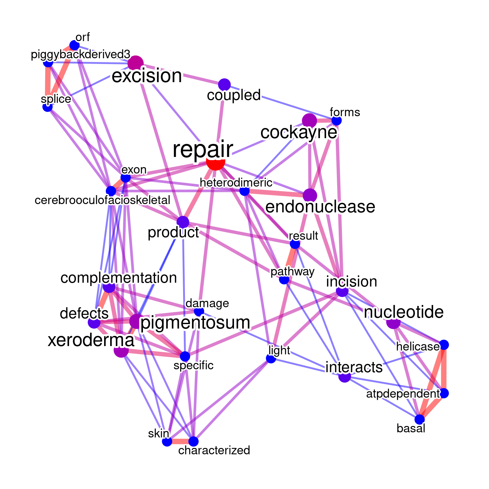
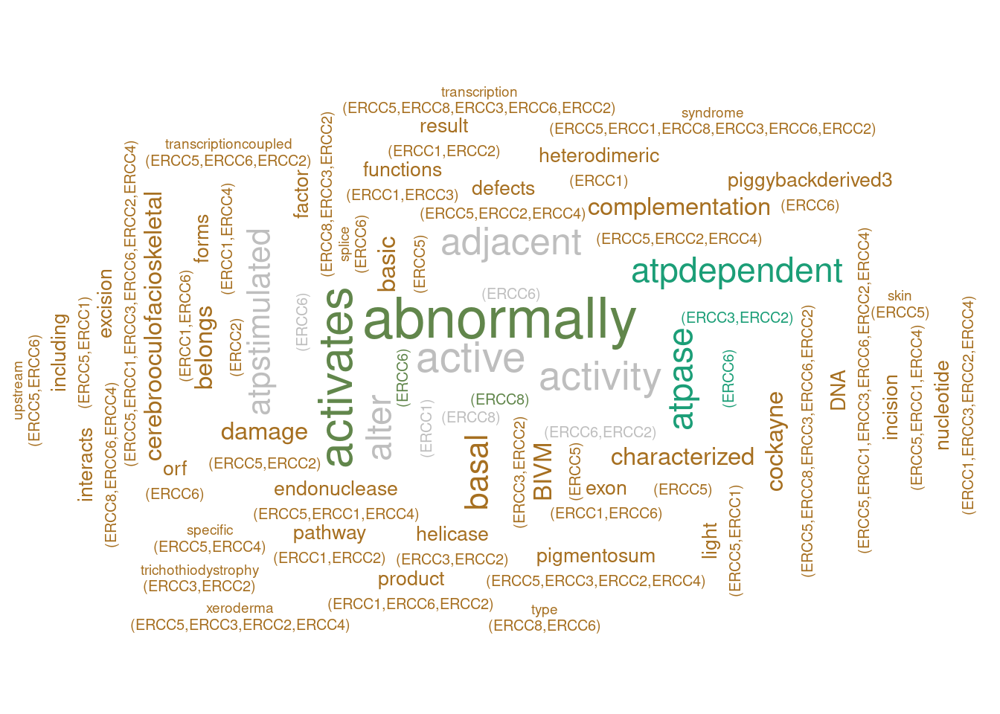
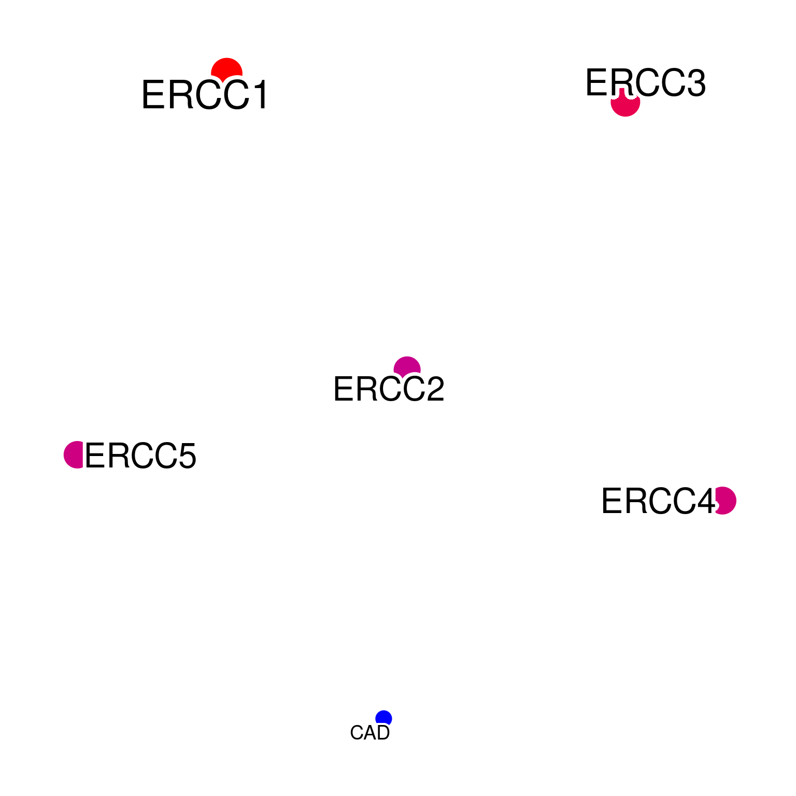
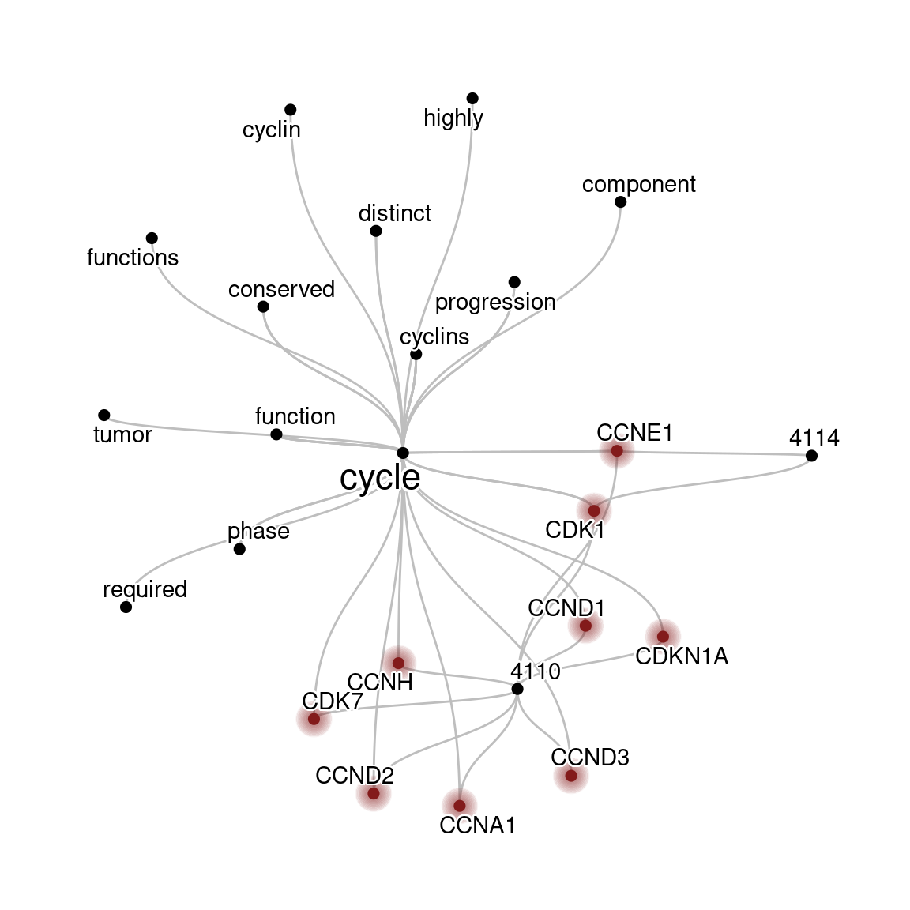
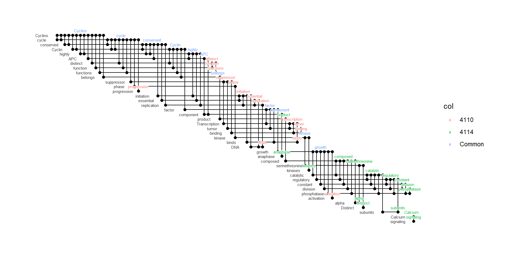
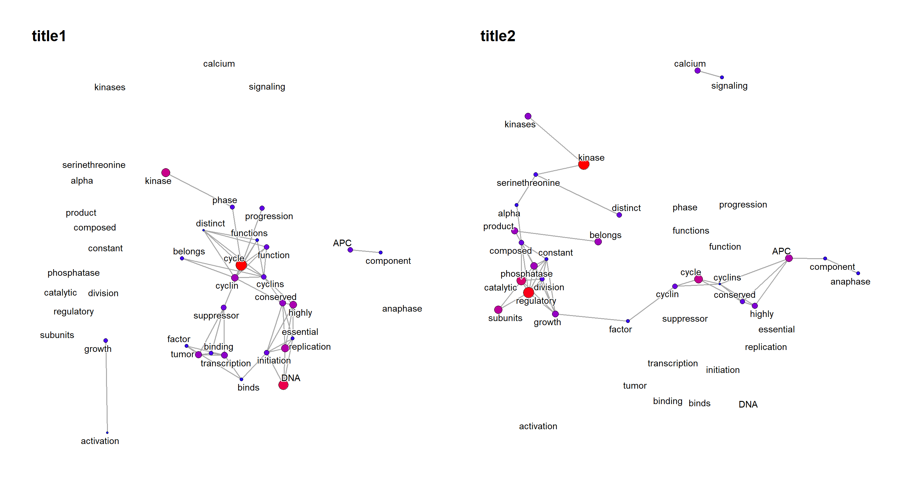
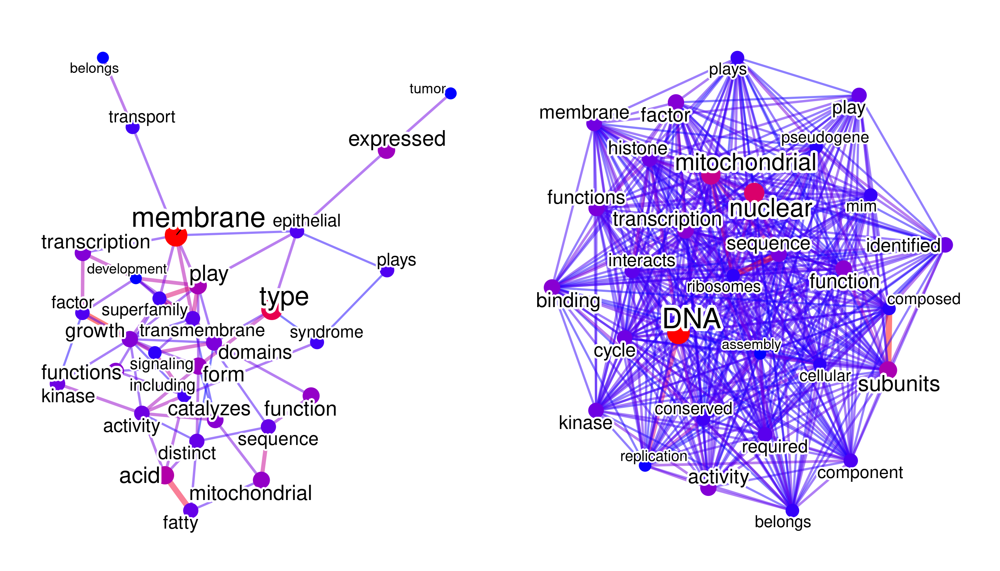
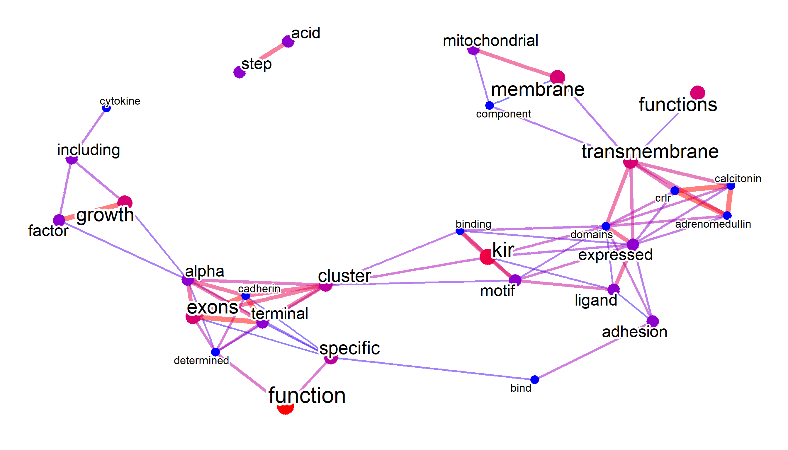

# Basic usage

Load the package and the database for converting identifiers.
In this example, we use mostly human-derived data, and use `org.Hs.eg.db`.


```r
library(biotextgraph)
library(org.Hs.eg.db)
library(ggplot2)
library(ggraph)
library(RColorBrewer)
library(ReactomePA)
library(clusterProfiler)
library(dendextend)
library(dplyr)
load(system.file("extdata", "sysdata.rda", package = "biotextgraph"))
```

## Producing networks

The main function is producing networks between words based on the co-occurrence or correlation of the words in the text, given the list of gene identifiers. `refseq` is a function that imports gene text from RefSeq and summarizes the text information. Here, we use seven ERCC genes as input. This function returns a `biotext` class object, which contains various types of information. The `net` slot stores the `ggraph`, which represents the visualization result of the network.

The `plotNet` method plots the network. This can modify the options for the visualization. such as the layout and the coloring of the nodes and edges without querying the database again. The same method for the wordcloud is prepared as `plotWC`. The `plotNet` and `plotWC` method by default override preset visualization option, and this behaviour can be turned off by specifying `asis=TRUE`. We can obtain the attribute in the slot by the `getSlot` method. 


```r
## Configure input genes
inpSymbol <- c("ERCC1","ERCC2","ERCC3","ERCC4","ERCC5","ERCC6","ERCC8")
net <- refseq(inpSymbol)
#> Input genes: 7
#>   Converted input genes: 7
#> Filter based on GeneSummary
#> Filtered 77 words (frequency and/or tfidf)
#> Ignoring corThresh, automatically determine the value
#> threshold = 0.5
plotNet(net, asis=TRUE)
```


By default, the gene ID type is set to `SYMBOL`. The other type can be set by `keyType`. As many of the words are commonly observed, filtering based on pre-computed word frequency on whole RefSeq data is provided. You should limit word frequency by `excludeFreq`, which is default to 2000. TF-IDF on the all the summary is also precomputed, and `exclude="tfidf"` can be specified too.


```r
net <- refseq(inpSymbol, excludeFreq=1000)
#> Input genes: 7
#>   Converted input genes: 7
#> Filter based on GeneSummary
#> Filtered 141 words (frequency and/or tfidf)
#> Ignoring corThresh, automatically determine the value
#> threshold = 0.519
plotNet(net, asis=TRUE)
```



For visualization, The edge label corresponding to correlation or cooccurrence values can be shown by `edgeLabel=TRUE`. The number of words to be shown on plot can be specified by `numWords`. The threshold of correlation can be specified by `corThresh`. The visualized network layout can be specified by passing `layout` argument. The text color can be changed by `colorText=TRUE`. The type of edge can be specified by `edgeLink`, which is by default `TRUE` (link will be used).


```r
net <- refseq(inpSymbol, plotType="network",
    edgeLabel=TRUE, corThresh=0.4,
    numWords=20, colorText=TRUE, layout="kk")
#> Input genes: 7
#>   Converted input genes: 7
#> Filter based on GeneSummary
#> Filtered 77 words (frequency and/or tfidf)
#> Ignoring corThresh, automatically determine the value
#> threshold = 0.5
plotNet(net, asis=TRUE)
```


One of the main questions is which words can be clustered together among the words contained in the queried gene cluster. Word clustering (`pvclust`) and identified significant clusters based on the occurrence in the text can be visualized by specifying `tag="tdm"` or `tag="cor"`. For the significance threshold, `pvclAlpha` can be specified. The default parameters perform `pvclust` on the subset of dataset for words with high frequency specified by `numWords`. If one want to perform on whole matrix of TDM (which is a natural way), `tagWhole=TRUE` can be specified with `tag="tdm"`, although it is computationally intensive. One can pass clusters to perform parallel computing owning to `pvclust` function, by specifying `cl` as below. For tag coloring, `tagPalette` can be used. The `igraph` contained in the object can also be plotted by passing to `plot` method.


```r
net <- refseq(inpSymbol, plotType="network", corThresh=0.2,
    numWords=20, tag="cor")
#> Input genes: 7
#>   Converted input genes: 7
#> Filter based on GeneSummary
#> Filtered 77 words (frequency and/or tfidf)
#> Ignoring corThresh, automatically determine the value
#> threshold = 0.5
#> Bootstrap (r = 0.5)... Done.
#> Bootstrap (r = 0.6)... Done.
#> Bootstrap (r = 0.7)... Done.
#> Bootstrap (r = 0.8)... Done.
#> Bootstrap (r = 0.9)... Done.
#> Bootstrap (r = 1.0)... Done.
#> Bootstrap (r = 1.1)... Done.
#> Bootstrap (r = 1.2)... Done.
#> Bootstrap (r = 1.3)... Done.
#> Bootstrap (r = 1.4)... Done.
plotNet(net)
```


```r
getSlot(net, "pvpick")
#> $clusters
#> $clusters[[1]]
#> [1] "complementation" "defects"         "pigmentosum"    
#> [4] "xeroderma"      
#> 
#> $clusters[[2]]
#> [1] "activity"      "atpdependent"  "cockayne"     
#> [4] "dna"           "transcription"
#> 
#> 
#> $edges
#> [1]  8 13
plot(net)
```


## Identifying important genes in the network

The other important aim is finding important genes (queries) in the network. The genes associated with the words can be shown by specifying `genePlot=TRUE`, useful for assessing which words is associated with interesting genes. The edges connecting words to corresponding genes are shown.
One can specify `genePlotNum` for limiting the genes shown by ranking of how often a gene is associated with the high-frequency words. This can be useful for identifying important genes among the network.


```r
net <- refseq(inpSymbol, plotType="network",
    genePlot=TRUE, corThresh=0.5,
    tag="cor", edgeLink=FALSE,
    numWords=20)
#> Input genes: 7
#>   Converted input genes: 7
#> Filter based on GeneSummary
#> Filtered 77 words (frequency and/or tfidf)
#> Ignoring corThresh, automatically determine the value
#> threshold = 0.5
#> Bootstrap (r = 0.5)... Done.
#> Bootstrap (r = 0.6)... Done.
#> Bootstrap (r = 0.7)... Done.
#> Bootstrap (r = 0.8)... Done.
#> Bootstrap (r = 0.9)... Done.
#> Bootstrap (r = 1.0)... Done.
#> Bootstrap (r = 1.1)... Done.
#> Bootstrap (r = 1.2)... Done.
#> Bootstrap (r = 1.3)... Done.
#> Bootstrap (r = 1.4)... Done.
plotNet(net, asis=TRUE)
```


The associated enriched pathways (if present) can be shown by specifying `genePathPlot`, using `ggforce`. In this option, the function first performs over-representation analysis on the whole gene set, and plot enriched terms for included genes in the plot. Enrichment analysis here is performed by the library `clusterProfiler` or `ReactomePA`, and one can control which pathways to plot by `genePathPlotSig` value.


```r
library(concaveman)
library(ggforce)
net <- refseq(inpSymbol, plotType="network",
    genePathPlot="reactome", corThresh=0.5,
    tag="cor", edgeLink=FALSE,
    genePathPlotSig=0.05, numWords=20)
#> Input genes: 7
#>   Converted input genes: 7
#> Filter based on GeneSummary
#> Filtered 77 words (frequency and/or tfidf)
#> Found 48 enriched term
#> Ignoring corThresh, automatically determine the value
#> threshold = 0.5
#> Bootstrap (r = 0.5)... Done.
#> Bootstrap (r = 0.6)... Done.
#> Bootstrap (r = 0.7)... Done.
#> Bootstrap (r = 0.8)... Done.
#> Bootstrap (r = 0.9)... Done.
#> Bootstrap (r = 1.0)... Done.
#> Bootstrap (r = 1.1)... Done.
#> Bootstrap (r = 1.2)... Done.
#> Bootstrap (r = 1.3)... Done.
#> Bootstrap (r = 1.4)... Done.

plotNet(net, asis=TRUE)
```


By default, the associated genes are plotted without colorization (grey) and without nodes. If preferred, set `colorize=TRUE` to colorize the associated genes by `geneColor` and showing the nodes by adding pseudo-frequency corresponding to the minimum frequency of words in the network. In this way, color of nodes corresponding to words are shown by the gradient of frequency, and the queried genes are shown by `geneColor`. `addFreqToGene` also adds pseudo-frequency to gene nodes and show the node, but are colorized according to the specified minimum frequency.


```r
net <- refseq(inpSymbol, plotType="network",
    genePlot=TRUE, corThresh=0.5,
    colorize=TRUE, geneColor="pink",
    colorText=TRUE,
    tag="cor", edgeLink=FALSE,
    numWords=20)
#> Input genes: 7
#>   Converted input genes: 7
#> Filter based on GeneSummary
#> Filtered 77 words (frequency and/or tfidf)
#> Ignoring corThresh, automatically determine the value
#> threshold = 0.5
#> Bootstrap (r = 0.5)... Done.
#> Bootstrap (r = 0.6)... Done.
#> Bootstrap (r = 0.7)... Done.
#> Bootstrap (r = 0.8)... Done.
#> Bootstrap (r = 0.9)... Done.
#> Bootstrap (r = 1.0)... Done.
#> Bootstrap (r = 1.1)... Done.
#> Bootstrap (r = 1.2)... Done.
#> Bootstrap (r = 1.3)... Done.
#> Bootstrap (r = 1.4)... Done.
plotNet(net, asis=TRUE)
```


## Producing word clouds

The other basic usage of the package is producing a word cloud of summaries of identifiers. Specify `plotType="wc"` or use `plot_wordcloud()` function for this purpose.


```r
wc <- obtain_refseq(c("DDX41","PNKP","IRF3")) |> make_corpus() |> make_TDM() |> plot_wordcloud()
#> Input genes: 3
#>   Converted input genes: 3
gwc <- refseq(inpSymbol, plotType="wc")
#> Input genes: 7
#>   Converted input genes: 7
#> Filter based on GeneSummary
#> Filtered 77 words (frequency and/or tfidf)
plotWC(gwc, asis=TRUE)
```


It accepts values of the `wordcloud()` function. `numWords` specifies how many words are to be shown on word cloud. The words are ordered by their frequency, and the subset of 1:`numWords` is used to downstream visualization. The arguments for wordcloud visualization must be passed to `argList` arguments as a list. `scaleFreq` can be specified to scale the frequency when the observation count is low.


```r
gwc <- refseq(inpSymbol,
    plotType="wc",
    numWords=100,
    scaleFreq=2,
    excludeFreq=5000,
    argList=list(
        "random.order"=FALSE,
        colors=RColorBrewer::brewer.pal(8, "Dark2"),
        "rot.per"=0.4)
)
#> Input genes: 7
#>   Converted input genes: 7
#> Filter based on GeneSummary
#> Filtered 30 words (frequency and/or tfidf)
plotWC(gwc, asis=TRUE)
```


By default, `preserve=TRUE`, which indicates the funciton tries to preserve the original cases of characters. Note that if both the lower case words and capitalized words are present, all words are converted to capitalized words, like `damage` and `Damage` would be shown as `Damage` if `preserve=TRUE`.


```r
gwc_p <- refseq(inpSymbol,
    plotType="wc",
    numWords=100,
    excludeFreq=5000,
    preserve=FALSE,
    argList=list(
        rot.per=0.4,
        colors=RColorBrewer::brewer.pal(8, "Set2"),
        random.order=FALSE)
)
#> Input genes: 7
#>   Converted input genes: 7
#> Filter based on GeneSummary
#> Filtered 30 words (frequency and/or tfidf)
plotWC(gwc_p, asis=TRUE)
```


It also returns a data frame consisting of frequency of each term in the slot name `freqDf`.


```r
gwc
#> Type: refseq
#> Number of words: 100
#> Query: ERCC1/ERCC2/ERCC3/ERCC4/ERCC5/ERCC6/ERCC8
#> 204.1 Kb
knitr::kable(
    head(getSlot(gwc, "freqDf")),
    caption = 'Term frequencies.',
    row.names = FALSE
)
```


Table: (\#tab:table)Term frequencies.

|word          | freq|
|:-------------|----:|
|repair        |   16|
|DNA           |   11|
|syndrome      |    9|
|excision      |    8|
|transcription |    7|
|Cockayne      |    6|


N-gram is supported by library `tm`, specified by `ngram`.
Default is `1`, and the example specifying `2` is shown below.


```r
gwc2 <- refseq(inpSymbol,
    ngram=2,
    numWords=50,
    plotType="wc",
    argList=list(
        rot.per=0.4,
        colors=RColorBrewer::brewer.pal(8, "Set2"),
        random.order=FALSE)
)
#> Input genes: 7
#> 'select()' returned 1:1 mapping between keys and
#> columns
#>   Converted input genes: 7
#> Filter based on GeneSummary
#> Filtered 77 words (frequency and/or tfidf)
#> Scale for size is already present.
#> Adding another scale for size, which will replace the existing scale.
plotWC(gwc2, asis=TRUE)
```


Using `clusterProfiler` functions, one can use enriched pathway names for visualization.
The `enrich` option can be specified for `'kegg'` or `'reactome'`, this time we specify `'reactome'`.


```r
gwc3 <- refseq(inpSymbol,
	plotType="wc",
    enrich="reactome",
    tfidf=TRUE, numWords=50)
#> Input genes: 7
#> 'select()' returned 1:1 mapping between keys and
#> columns
#>   Converted input genes: 7
#> Performing enrichment analysis
#> Filter based on GeneSummary
#> Filtered 77 words (frequency and/or tfidf)
#> Scale for size is already present.
#> Adding another scale for size, which will replace the existing scale.
plotWC(gwc3, asis=TRUE)
```


In the word cloud, it is also possible to visualize tag information with colors. In the example below, clustering was performed for all matrices, and the results were visualized based on the colors of `tagPalette`.


```r
## Prepare the palette for tag coloring
pal <- RColorBrewer::brewer.pal(8, "Dark2") 
pal <- colorRampPalette(pal)(20)
## Cluster on whole matrix
gwclWhole <- refseq(inpSymbol,
    numWords=50,
    plotType="wc",
    tag="cor",
    tagPalette = pal,
    scaleFreq=5,
    cl=snow::makeCluster(8),
    argList=list(rot.per=0.4)
)
#> Input genes: 7
#> 'select()' returned 1:1 mapping between keys and
#> columns
#>   Converted input genes: 7
#> Filter based on GeneSummary
#> Filtered 77 words (frequency and/or tfidf)
#> Multiscale bootstrap... Done.
#> Scale for size is already present.
#> Adding another scale for size, which will replace the existing scale.

getSlot(gwclWhole, "pvpick")
#> $clusters
#> $clusters[[1]]
#> [1] "pigmentosum" "xeroderma"  
#> 
#> $clusters[[2]]
#> [1] "dna"    "repair"
#> 
#> $clusters[[3]]
#>  [1] "abnormally"                "activates"                
#>  [3] "active"                    "activity"                 
#>  [5] "adjacent"                  "alter"                    
#>  [7] "atpase"                    "atpdependent"             
#>  [9] "atpstimulated"             "basal"                    
#> [11] "basic"                     "belongs"                  
#> [13] "bivm"                      "cerebrooculofacioskeletal"
#> [15] "characterized"             "complementation"          
#> [17] "damage"                    "defects"                  
#> [19] "exon"                      "factor"                   
#> [21] "forms"                     "functions"                
#> [23] "helicase"                  "heterodimeric"            
#> [25] "incision"                  "including"                
#> [27] "interacts"                 "light"                    
#> [29] "nucleotide"                "orf"                      
#> [31] "pathway"                   "piggybackderived3"        
#> [33] "product"                   "result"                   
#> [35] "skin"                      "specific"                 
#> [37] "splice"                    "transcriptioncoupled"     
#> [39] "trichothiodystrophy"       "type"                     
#> [41] "upstream"                 
#> 
#> 
#> $edges
#> [1] 16 41 43
plotWC(gwclWhole, asis=TRUE)
```


In this example querying ERCC genes, the term `DNA repair` is clustered as expected.

### Plotting associated genes in WC

By using the feature `label_content` in `ggwordcloud`, the user can choose to plot associated gene names along with the words, by `genePlot=TRUE`, as same as the network.


```r
geneplotWC <- refseq(inpSymbol,
    numWords=50,
    plotType="wc",
    tag="cor",
    genePlot=TRUE,
    tagPalette = pal,
    scaleFreq=5,
    cl=snow::makeCluster(8),
    argList=list(rot.per=0.4)
)
#> Input genes: 7
#> 'select()' returned 1:1 mapping between keys and
#> columns
#>   Converted input genes: 7
#> Filter based on GeneSummary
#> Filtered 77 words (frequency and/or tfidf)
#> 'select()' returned 1:1 mapping between keys and
#> columns
#> Multiscale bootstrap... Done.
#> Scale for size is already present.
#> Adding another scale for size, which will replace the
#> existing scale.
plotWC(geneplotWC, asis=TRUE)
```



## Visualization of PubMed information.

Using `rentrez`, one can perform the same analysis on PubMed text like the article title and abstract. The function queries for the input gene symbols (or the other queries) and visualize. For typical use cases, the genes identified by showing `genePlot`, or hub genes identified in gene network analysis can be queried. The basic parameters for searching PubMed, like max number of articles retrieved and how to sort the articles can be specified by `retMax` and `sortOrder`. Be sure to obtain [an api key](https://ncbiinsights.ncbi.nlm.nih.gov/2017/11/02/new-api-keys-for-the-e-utilities/) when querying heavily, and specify in `apiKey` argument. These functions including `pubmed` and `refseq` serve as wrappers for several other functions, but a detailed explanation can be found in \@ref(tidy).
 

```r
ab <- pubmed(inpSymbol[1:3], retMax=20, apiKey=apiKey, plotType="wc")
#> Scale for size is already present.
#> Adding another scale for size, which will replace the existing scale.
plotWC(ab, asis=TRUE)
```


The returned PubMed IDs are stored in `pmids` slot.


```r
pmids <- getSlot(ab, "pmids")
pmids |> length()
#> [1] 20
```

As fetching the same information is not desirable and time consuming, the same object can be passed to `redo` option and re-perform the analysis like tagging, or changing the visualization options. Also, using `obtain_pubmed` function, only the text can be obtained and be processed by the downstream functions. 


```r
abtag <- pubmed(redo=ab, tag="tdm", cl=snow::makeCluster(10), apiKey=apiKey)
#> Resuming from the previous results
#> Multiscale bootstrap... Done.
#> Ignoring corThresh, automatically determine the value
#> threshold = 0.401
abtag2 <- pubmed(redo=abtag, tag="tdm", genePlot=TRUE,
    plotType="network", corThresh=0.2, pre=TRUE, apiKey=apiKey)
#> Resuming from the previous results
#> Using previous pvclust resultsIgnoring corThresh, automatically determine the value
#> threshold = 0.401
plotNet(abtag2, asis=TRUE)
```


If only the gene symbols are to be plotted, specify `onlyGene=TRUE`.


```r
net <- pubmed(inpSymbol[1:5], plotType="network",
    onlyGene=TRUE, apiKey=apiKey, numWords=150)
#> Ignoring corThresh, automatically determine the value
#> threshold = 0.6
#> Subsetting to the gene symbol in orgDb
plotNet(net, asis=TRUE)
```


It is sometimes the case that the results of the search is dominated by one well-investigated or well-characterized genes (such as TP53).
To overcome this, the `perQuery` option can be specified to search the database one by one. It is recommended to use API key for querying a large number of genes. 


```r
netPerQuery <- pubmed(inpSymbol[1:5], perQuery=TRUE, onlyGene=TRUE, apiKey=apiKey, numWords=150)
#>   Querying ERCC1
#>   Querying ERCC2
#>   Querying ERCC3
#>   Querying ERCC4
#>   Querying ERCC5
#> Ignoring corThresh, automatically determine the value
#> threshold = 0.3
#> Subsetting to the gene symbol in orgDb
plotNet(netPerQuery, asis=TRUE)
```




## Comparing two or more networks

One can compare two or more networks by providing list of `biotext` objects produced by text mining various databases, like `refseq`, `pubmed`, `obtain_refseq`, etc. This can be useful for assessing the similarity and dissimilarity of the various text sources, like PubMed, RefSeq, and Reactome pathway names. Additionally, performing graph-based clustering on merged networks can potentially identify groups of related terms within the overall network.


```r
cxcls <- c()
for (i in c(1,2,3,5,6,8,9,10,11,12,13,14,16)){
    cxcls <- c(cxcls, paste0("CXCL",i))
}

net1 <- refseq(inpSymbol, plotType="network",
    corThresh=0.5, numWords=20)
#> Input genes: 7
#>   Converted input genes: 7
#> Filter based on GeneSummary
#> Filtered 77 words (frequency and/or tfidf)
#> Ignoring corThresh, automatically determine the value
#> threshold = 0.5
net2 <- refseq(cxcls, plotType="network",
    corThresh=0.5, numWords=20)
#> Input genes: 13
#>   Converted input genes: 13
#> Filter based on GeneSummary
#> Filtered 77 words (frequency and/or tfidf)
#> Ignoring corThresh, automatically determine the value
#> threshold = 0.4
net3 <- pubmed(redo=ab, plotType="network",
    corThresh=0.2, numWords=20)
#> Resuming from the previous results
#> Ignoring corThresh, automatically determine the value
#> threshold = 0.301

## Not having meaningful overlaps
compareWordNet(list(net1, net2),
    titles=c("ercc","cxcl")) |> plotNet()
```


```r
compareWordNet(list(net1, net3),
    titles=c("ercc","ercc-PubMed")) |> plotNet()
```


```r
compareWordNet(list(net1, net2, net3),
    titles=c("ercc","cxcl", "ercc-PubMed")) |> plotNet()
```


If `tag` information is available in both gene clusters, combined tags can be visualized by `tag=TRUE`. If using `geom_mark_hull` to show the tagging information, specify `hull=TRUE` in `compareWordNet`.


```r
keggPathways <- org.Hs.egPATH2EG
mappedKeys <- mappedkeys(keggPathways)
keggList <- as.list(keggPathways[mappedKeys])

net1 <- refseq(keggList$`04110`,
    keyType="ENTREZID",
    corThresh=0.3,
    numWords=30,
    tag="cor",
    tfidf=TRUE)
#> Input genes: 124
#> Filter based on GeneSummary
#> Filtered 77 words (frequency and/or tfidf)
#> Ignoring corThresh, automatically determine the value
#> threshold = 0.1
#> Bootstrap (r = 0.5)... Done.
#> Bootstrap (r = 0.6)... Done.
#> Bootstrap (r = 0.7)... Done.
#> Bootstrap (r = 0.8)... Done.
#> Bootstrap (r = 0.9)... Done.
#> Bootstrap (r = 1.0)... Done.
#> Bootstrap (r = 1.1)... Done.
#> Bootstrap (r = 1.2)... Done.
#> Bootstrap (r = 1.3)... Done.
#> Bootstrap (r = 1.4)... Done.

net2 <- refseq(keggList$`04210`,
    keyType="ENTREZID",
    corThresh=0.3,
    numWords=30,
    tfidf=TRUE,
    tag="cor")
#> Input genes: 87
#> Filter based on GeneSummary
#> Filtered 77 words (frequency and/or tfidf)
#> Ignoring corThresh, automatically determine the value
#> threshold = 0.1
#> Bootstrap (r = 0.5)... Done.
#> Bootstrap (r = 0.6)... Done.
#> Bootstrap (r = 0.7)... Done.
#> Bootstrap (r = 0.8)... Done.
#> Bootstrap (r = 0.9)... Done.
#> Bootstrap (r = 1.0)... Done.
#> Bootstrap (r = 1.1)... Done.
#> Bootstrap (r = 1.2)... Done.
#> Bootstrap (r = 1.3)... Done.
#> Bootstrap (r = 1.4)... Done.

compareWordNet(list(net1, net2), tag=TRUE, hull=TRUE) |> plotNet()
```


An application example of using text mining for transcriptome analysis of BK polyomavirus infection by combining the functions described here \@ref(app).

### Connecting the networks and identify shared genes

If you specify `genePlot` (or equivalent) in calculating network in both networks, you can connect two networks based on specific words with showing relevant genes by using `connectGenes()`. As it states genes in the title, it can be used with the other networks besides genes. By default, only the queried word is retrieved from the original network, and by specifying `neighbors`, it fecthes the neighbor words.


```r
library(scales)
net1 <- refseq(keggList$`04110`, keyType="ENTREZID", corThresh=0.3, numWords=30, genePlot=TRUE)
#> Input genes: 124
#> Filter based on GeneSummary
#> Filtered 77 words (frequency and/or tfidf)
#> Ignoring corThresh, automatically determine the value
#> threshold = 0.2
net2 <- refseq(keggList$`04114`, keyType="ENTREZID", corThresh=0.3, numWords=30, genePlot=TRUE)
#> Input genes: 112
#> Filter based on GeneSummary
#> Filtered 77 words (frequency and/or tfidf)
#> Ignoring corThresh, automatically determine the value
#> threshold = 0.2
connectGenes(list("4110"=net1, "4114"=net2), "cycle", neighbor=TRUE) |>
    tidygraph::as_tbl_graph() |>
    mutate(SYMBOL=name %in% keys(org.Hs.eg.db, "SYMBOL")) |> ## Highlighy symbol
ggraph(layout="nicely")+
    geom_edge_diagonal(color="grey")+
    geom_node_point(aes(filter=.data$SYMBOL), size=2, color=muted("red"))+
    graphhighlight::highlight_node(glow=TRUE, filter=SYMBOL,
        glow_base_size = TRUE, glow_size=0.5,highlight_color = muted("red"))+
    geom_node_point(aes(filter=!.data$SYMBOL), size=2)+
    geom_node_text(aes(label=name, filter=name!="cycle"), repel=TRUE, bg.colour="white") +
    geom_node_text(aes(label=name, filter=name=="cycle"), size=6, repel=TRUE, bg.colour="white") +
    theme_graph()
```



## Text over represenatation analysis (experimental)

For RefSeq, overrepresentation-based filtering and prioritization of words can be performed using pre-computed background.


```r
geneList <- keggList$`00785` # Lipoic acid metabolism
pvs <- textORA(geneList)
hist(pvs)
```


```r
pvs[order(pvs)] |> head()
#>            lipoic              step              acid 
#>      1.600963e-14      8.016934e-08      5.300425e-07 
#> lipoateactivating  lipoatedependent            lipoyl 
#>      1.484931e-04      1.484931e-04      1.484931e-04

geneList <- keggList$`05150` # Staphylococcus aureus infection
pvs <- textORA(geneList)
hist(pvs)
```


```r
pvs[order(pvs)] |> head()
#>          drb        chain   complement        class 
#> 0.000000e+00 3.669590e-82 3.266180e-74 5.496543e-46 
#>         exon         beta 
#> 6.851722e-39 1.318324e-34
```

This thresholding can be used in RefSeq visualization in the above functions.
Filter words using ORA threshold and frequency threshold by setting `ora=TRUE`.


```r
net <- refseq(inpSymbol, plotType="network",
                     ora=TRUE, edgeLink=FALSE)
#> Input genes: 7
#>   Converted input genes: 7
#> Filter based on GeneSummary
#> Filtered 77 words (frequency and/or tfidf)
#> Performing ORA
#> Filtered 148 words (ORA)
#> Ignoring corThresh, automatically determine the value
#> threshold = 0.5
plotNet(net, asis=TRUE)
```


After obtaining the ORA results, one can plot volcano-plot like plot for the results using `plotORA` function.


```r
library(ggrepel)
plotORA(net)
```


## Dependency analyis using udpipe

Using [`udpipe`](https://github.com/bnosac/udpipe) package ([Straka and Straková. 2017](https://aclanthology.org/K17-3009/)), one can performe dependency analysis of texts in various databases. Set `useUdpipe` to `TRUE`, and specify downloaded model to be used in `udpipeModel`.


```r
p <- biotextgraph::refseq(c("DDX41","PNKP","ERCC2"),
    plotType="network", useUdpipe=TRUE,
    udpipeModel="english-ewt-ud-2.5-191206.udpipe")
#> Using udpipe mode
#> Input genes: 3
#>   Converted input genes: 3
#> Filter based on GeneSummary
#> Filtered 77 words (frequency and/or tfidf)
plotNet(p, asis=TRUE)
```


## Changing the font

Font can be specified by `fontFamily`, which affects all the labels including edges and nodes.


```r
load(system.file("extdata", "sysdata.rda", package = "biotextgraph"))
degs <- d3degUpAssetta2016
## Use alien encounter fonts (http://www.hipsthetic.com/alien-encounters-free-80s-font-family/)
sysfonts::font_add(family="alien",regular="SFAlienEncounters.ttf")
p <- biotextgraph::refseq(degs,
    plotType="network",
    numWords=50, genePlot=TRUE,
    fontFamily="alien", autoThresh=FALSE,
    colorText=TRUE)
#> Input genes: 636
#>   Converted input genes: 552
#> Filter based on GeneSummary
#> Filtered 77 words (frequency and/or tfidf)
plotNet(p, asis=TRUE)
```


For complex networks, changing the layout is possible by the small function `changeLayout`.
Specify which layout algorithm to choose in `igraph`. This can be also accomplished by specifying the layout in `plotNet` method.


```r
changeLayout(p, igraph::layout.graphopt) |> plotNet(asis=TRUE)
```


## Biofabric layout

It is possible to use the `BioFabric` layout from the extracted `igraph`. In this case, one wants to add text position in x-axis using `biotextgraph::obtainTextPosition`. For the beautiful `BioFabric` layout, please refer to their original homepage [here](https://biofabric.systemsbiology.net/), and their publication available [here](https://doi.org/10.1186/1471-2105-13-275) (Longabaugh, W.J. 2012).


```r
ex <- refseq(c("DDX41","PNKP"), autoThresh=FALSE, genePlot=TRUE)
#> Input genes: 2
#>   Converted input genes: 2
#> Filter based on GeneSummary
#> Filtered 77 words (frequency and/or tfidf)
ex <- getSlot(ex, "igraph") |> obtainTextPosition() ## Obtain text position for the X-axis
ex |> 
ggraph("fabric",
  sort.by = node_rank_fabric())+
    geom_node_range() +
    geom_edge_span(end_shape = 'circle') +
    geom_node_text(aes(x=xmin-4, label=name), size=2.5)+
    shadowtext::geom_shadowtext(aes(x=center,
            color=nodeCat, y=y+1, label=name),
        size=2.5, bg.colour="white")+
    scale_color_manual(values=c("grey20", "grey80"))+
    theme_graph()
```


### Highlighting genes in the layout

For more practical use, we highlight gene names in the layout using `ggfx`.


```r
library(ggfx)

# Use sample DEGs
ex <- suppressMessages(refseq(d3degUpAssetta2016,
                              genePlot=TRUE,
                              numWords=50,
                              preserve=FALSE,
                              autoThresh=FALSE))
#> Input genes: 636
#>   Converted input genes: 552
#> Filter based on GeneSummary
#> Filtered 77 words (frequency and/or tfidf)

# Obtain text positions, and plot using various geoms.
getSlot(ex, "igraph") |> obtainTextPosition(verbose=FALSE)  |>
  ggraph("fabric", sort.by = node_rank_fabric())+
    geom_node_range(aes(color=nodeCat)) +
    geom_edge_span(end_shape = 'circle') +
    with_outer_glow(ggkegg::geom_node_shadowtext(aes(x=xmin-4, label=name, filter=type=="Genes"), size=2.5,
                                                 color="tomato", bg.colour="white"), "gold",expand=5)+ ## Show genes (shadowtext + ggfx)
    geom_node_text(aes(x=xmin-4, label=name, filter=type!="Genes"), size=2)+
    ggkegg::geom_node_shadowtext(aes(x=center, size=xmin, filter=type!="Genes", color=nodeCat, y=y+1, label=name), bg.colour="white")+
    with_outer_glow(ggkegg::geom_node_shadowtext(aes(x=center, filter=type=="Genes", color=nodeCat, y=y+1, label=name),
                                                 size=2.5, bg.colour="white"),"gold",expand=5)+
    scale_color_manual(values=c("tomato", "grey20"),name="Category")+
    theme_graph() +
    scale_size(trans = 'reverse', range=c(1.5,2))+
    guides(size="none")
```


### Biofabric layouts for combined networks

Can be used in cojuction with `compareWordNet()`. The BioFabric layout is especially useful for visualizing complex networks. For interactively inspecting complex networks, please refer to the section \@ref(interactive).


```r
net1 <- refseq(keggList$`04110`, keyType="ENTREZID",
               corThresh=0.3, numWords=30, autoThresh=FALSE)
#> Input genes: 124
#> Filter based on GeneSummary
#> Filtered 77 words (frequency and/or tfidf)
net2 <- refseq(keggList$`04114`, keyType="ENTREZID",
               corThresh=0.3, numWords=30, autoThresh=FALSE)
#> Input genes: 112
#> Filter based on GeneSummary
#> Filtered 77 words (frequency and/or tfidf)
comp <- compareWordNet(list(net1, net2),titles=c("4110","4114"))

## Grouping is stored in `col` variable of nodes
ggraph(getSlot(comp, "igraphRaw") |> obtainTextPosition(), "fabric",sort.by=node_rank_fabric())+
    geom_node_range() +
    geom_edge_span(end_shape = 'circle') +
    geom_node_shadowtext(aes(x=.data$xmin-4,
  	    label=.data$name), color="grey20",size=2, bg.colour="white")+
    geom_node_shadowtext(aes(x=.data$center,
  	    y=.data$y+1, label=.data$name, color=col), bg.colour="white", size=2)+
    theme_graph()
```




### Wrapper for `BioFabric` layout

The funciton `plot_biofabric` is prepared, which accepts `biotext` class object.


```r
ex |> plot_biofabric(end_shape="square")
```


## Dynamic layout

Dynamic layout can be also used to compare the networks, by `graphlayouts`, for comparing the multiple graphs, especially useful for time-series analysis. See the documentation of [`layout_as_dynamic`](http://graphlayouts.schochastics.net/reference/layout_dynamic.html) for specifying the alpha, which is default to 0.5. 


```r
library(igraph)
dyn <- plotDynamic(list(net1, net2), concat="union")
dyn
```



## Input type

Some input types can be used to conveniently perform text mining. `refseqWGCNA` accepts `blockwiseModules()` results from `WGCNA`, and recursively returns the biotext class object for each of the cluster.


```r
load("./blockwiseModule.rda")
test <- refseqWGCNA(bwmod)
#> Processing a total of 17 clusters
#> Input genes: 621
#>   Converted input genes: 534
#> Filter based on GeneSummary
#> Filtered 77 words (frequency and/or tfidf)
#> Ignoring corThresh, automatically determine the value
#> threshold = 0.1
#> Input genes: 2192
#>   Converted input genes: 2017
#> Filter based on GeneSummary
#> Filtered 77 words (frequency and/or tfidf)
#> Ignoring corThresh, automatically determine the value
#> threshold = 0
#> Input genes: 12943
#>   Converted input genes: 9875
#> Filter based on GeneSummary
#> Filtered 77 words (frequency and/or tfidf)
#> Ignoring corThresh, automatically determine the value
#> threshold = 0
#> Input genes: 5534
#>   Converted input genes: 4644
#> Filter based on GeneSummary
#> Filtered 77 words (frequency and/or tfidf)
#> Ignoring corThresh, automatically determine the value
#> threshold = 0
#> Input genes: 653
#>   Converted input genes: 533
#> Filter based on GeneSummary
#> Filtered 77 words (frequency and/or tfidf)
#> Ignoring corThresh, automatically determine the value
#> threshold = 0.1
#> Input genes: 591
#>   Converted input genes: 471
#> Filter based on GeneSummary
#> Filtered 77 words (frequency and/or tfidf)
#> Ignoring corThresh, automatically determine the value
#> threshold = 0.1
#> Input genes: 740
#>   Converted input genes: 577
#> Filter based on GeneSummary
#> Filtered 77 words (frequency and/or tfidf)
#> Ignoring corThresh, automatically determine the value
#> threshold = 0.104
#> Input genes: 89
#>   Converted input genes: 87
#> Filter based on GeneSummary
#> Filtered 77 words (frequency and/or tfidf)
#> Ignoring corThresh, automatically determine the value
#> threshold = 0.103
#> Input genes: 43
#>   Converted input genes: 40
#> Filter based on GeneSummary
#> Filtered 77 words (frequency and/or tfidf)
#> Ignoring corThresh, automatically determine the value
#> threshold = 0.2
#> Input genes: 39
#>   Converted input genes: 37
#> Filter based on GeneSummary
#> Filtered 77 words (frequency and/or tfidf)
#> Ignoring corThresh, automatically determine the value
#> threshold = 0.107
#> Input genes: 43
#>   Converted input genes: 42
#> Filter based on GeneSummary
#> Filtered 77 words (frequency and/or tfidf)
#> Ignoring corThresh, automatically determine the value
#> threshold = 0.308
#> Input genes: 41
#>   Converted input genes: 40
#> Filter based on GeneSummary
#> Filtered 77 words (frequency and/or tfidf)
#> Ignoring corThresh, automatically determine the value
#> threshold = 0.304
#> Input genes: 42
#>   Converted input genes: 40
#> Filter based on GeneSummary
#> Filtered 77 words (frequency and/or tfidf)
#> Ignoring corThresh, automatically determine the value
#> threshold = 0.203
#> Input genes: 40
#>   Converted input genes: 33
#> Filter based on GeneSummary
#> Filtered 77 words (frequency and/or tfidf)
#> Ignoring corThresh, automatically determine the value
#> threshold = 0.317
#> Input genes: 112
#>   Converted input genes: 65
#> Filter based on GeneSummary
#> Filtered 77 words (frequency and/or tfidf)
#> Ignoring corThresh, automatically determine the value
#> threshold = 0.507
#> Input genes: 38
#>   Converted input genes: 38
#> Filter based on GeneSummary
#> Filtered 77 words (frequency and/or tfidf)
#> Ignoring corThresh, automatically determine the value
#> threshold = 0.2
#> Input genes: 139
#>   Converted input genes: 58
#> Filter based on GeneSummary
#> Filtered 77 words (frequency and/or tfidf)
#> Ignoring corThresh, automatically determine the value
#> threshold = 0.641
length(test)
#> [1] 17
test[[1]]@net + test[[2]]@net
```



`refseqDESeq2` accepts the resulting object from `DESeq2::results()` function, with specified criteria such as LFC and p-values and returns the biotext class object like as follows.


```r
library(DESeq2)
library(org.Hs.eg.db)
dds <- makeExampleDESeqDataSet(m=4)
dds <- DESeq(dds)
res <- results(dds, contrast=c("condition","B","A"))
set.seed(123)
row.names(res) <- sample(keys(org.Hs.eg.db, "ENSEMBL"), nrow(res))
res
#> log2 fold change (MLE): condition B vs A 
#> Wald test p-value: condition B vs A 
#> DataFrame with 1000 rows and 6 columns
#>                  baseMean log2FoldChange     lfcSE
#>                 <numeric>      <numeric> <numeric>
#> ENSG00000134910    0.0000             NA        NA
#> ENSG00000271702   50.2927       1.069097  0.741541
#> ENSG00000232764   27.5563       0.326519  0.868801
#> ENSG00000266610   55.0974       0.833955  0.720673
#> ENSG00000121351   11.4532      -0.830936  1.349457
#> ...                   ...            ...       ...
#> ENSG00000067560  58.98350      0.8363000  0.700295
#> ENSG00000207714 362.38625      0.2839425  0.427786
#> ENSG00000184990   1.91443      0.0455055  2.882155
#> ENSG00000223548  15.13427     -0.2184717  1.131090
#> ENSG00000169976  14.83963      0.3887442  1.098821
#>                       stat    pvalue      padj
#>                  <numeric> <numeric> <numeric>
#> ENSG00000134910         NA        NA        NA
#> ENSG00000271702   1.441724  0.149380  0.993345
#> ENSG00000232764   0.375827  0.707046  0.993345
#> ENSG00000266610   1.157189  0.247195  0.993345
#> ENSG00000121351  -0.615756  0.538056  0.993345
#> ...                    ...       ...       ...
#> ENSG00000067560  1.1942105  0.232396  0.993345
#> ENSG00000207714  0.6637483  0.506851  0.993345
#> ENSG00000184990  0.0157887  0.987403  0.999979
#> ENSG00000223548 -0.1931515  0.846840  0.993345
#> ENSG00000169976  0.3537831  0.723501  0.993345

refseqDESeq2(res, log2FoldChange>2) |> plotNet(asis=TRUE)
#> Input genes: 59
#>   Converted input genes: 87
#> Filter based on GeneSummary
#> Filtered 77 words (frequency and/or tfidf)
#> Ignoring corThresh, automatically determine the value
#> threshold = 0.1
```



## Split by EA

If `splitByEA` option is enabled, the function first performs enrichment analysis on the queried input, and output the list of biotext object for each significant pathway, as well as for those not related to significant pathways. This is useful for confirming the prior knowledge in terms of textual information perspective.


```r
eanets <- refseq(inpSymbol, splitByEA="reactome")
#> Total of 48 pathways, including non-enrichment terms
#> Input genes: 7
#> Filter based on GeneSummary
#> Filtered 77 words (frequency and/or tfidf)
#> Ignoring corThresh, automatically determine the value
#> threshold = 0.5
#> Input genes: 7
#> Filter based on GeneSummary
#> Filtered 77 words (frequency and/or tfidf)
#> Ignoring corThresh, automatically determine the value
#> threshold = 0.5
#> Input genes: 7
#> Filter based on GeneSummary
#> Filtered 77 words (frequency and/or tfidf)
#> Ignoring corThresh, automatically determine the value
#> threshold = 0.5
#> Input genes: 5
#> Filter based on GeneSummary
#> Filtered 77 words (frequency and/or tfidf)
#> Ignoring corThresh, automatically determine the value
#> threshold = 0.7
#> Input genes: 5
#> Filter based on GeneSummary
#> Filtered 77 words (frequency and/or tfidf)
#> Ignoring corThresh, automatically determine the value
#> threshold = 0.7
#> Input genes: 7
#> Filter based on GeneSummary
#> Filtered 77 words (frequency and/or tfidf)
#> Ignoring corThresh, automatically determine the value
#> threshold = 0.5
#> Input genes: 5
#> Filter based on GeneSummary
#> Filtered 77 words (frequency and/or tfidf)
#> Ignoring corThresh, automatically determine the value
#> threshold = 0.7
#> Input genes: 4
#> Filter based on GeneSummary
#> Filtered 77 words (frequency and/or tfidf)
#> Ignoring corThresh, automatically determine the value
#> threshold = 0.8
#> Input genes: 4
#> Filter based on GeneSummary
#> Filtered 77 words (frequency and/or tfidf)
#> Ignoring corThresh, automatically determine the value
#> threshold = 0.8
#> Input genes: 3
#> Filter based on GeneSummary
#> Filtered 77 words (frequency and/or tfidf)
#> Ignoring corThresh, automatically determine the value
#> threshold = 1
#> Input genes: 3
#> Filter based on GeneSummary
#> Filtered 77 words (frequency and/or tfidf)
#> Ignoring corThresh, automatically determine the value
#> threshold = 1
#> Input genes: 3
#> Filter based on GeneSummary
#> Filtered 77 words (frequency and/or tfidf)
#> Ignoring corThresh, automatically determine the value
#> threshold = 1
#> Input genes: 2
#> Filter based on GeneSummary
#> Filtered 77 words (frequency and/or tfidf)
#> Ignoring corThresh, automatically determine the value
#> threshold = 1
#> Input genes: 2
#> Filter based on GeneSummary
#> Filtered 77 words (frequency and/or tfidf)
#> Ignoring corThresh, automatically determine the value
#> threshold = 1
#> Input genes: 2
#> Filter based on GeneSummary
#> Filtered 77 words (frequency and/or tfidf)
#> Ignoring corThresh, automatically determine the value
#> threshold = 1
#> Input genes: 3
#> Filter based on GeneSummary
#> Filtered 77 words (frequency and/or tfidf)
#> Ignoring corThresh, automatically determine the value
#> threshold = 1
#> Input genes: 2
#> Filter based on GeneSummary
#> Filtered 77 words (frequency and/or tfidf)
#> Ignoring corThresh, automatically determine the value
#> threshold = 1
#> Input genes: 2
#> Filter based on GeneSummary
#> Filtered 77 words (frequency and/or tfidf)
#> Ignoring corThresh, automatically determine the value
#> threshold = 1
#> Input genes: 2
#> Filter based on GeneSummary
#> Filtered 77 words (frequency and/or tfidf)
#> Ignoring corThresh, automatically determine the value
#> threshold = 1
#> Input genes: 2
#> Filter based on GeneSummary
#> Filtered 77 words (frequency and/or tfidf)
#> Ignoring corThresh, automatically determine the value
#> threshold = 1
#> Input genes: 2
#> Filter based on GeneSummary
#> Filtered 77 words (frequency and/or tfidf)
#> Ignoring corThresh, automatically determine the value
#> threshold = 1
#> Input genes: 2
#> Filter based on GeneSummary
#> Filtered 77 words (frequency and/or tfidf)
#> Ignoring corThresh, automatically determine the value
#> threshold = 1
#> Input genes: 2
#> Filter based on GeneSummary
#> Filtered 77 words (frequency and/or tfidf)
#> Ignoring corThresh, automatically determine the value
#> threshold = 1
#> Input genes: 2
#> Filter based on GeneSummary
#> Filtered 77 words (frequency and/or tfidf)
#> Ignoring corThresh, automatically determine the value
#> threshold = 1
#> Input genes: 2
#> Filter based on GeneSummary
#> Filtered 77 words (frequency and/or tfidf)
#> Ignoring corThresh, automatically determine the value
#> threshold = 1
#> Input genes: 2
#> Filter based on GeneSummary
#> Filtered 77 words (frequency and/or tfidf)
#> Ignoring corThresh, automatically determine the value
#> threshold = 1
#> Input genes: 2
#> Filter based on GeneSummary
#> Filtered 77 words (frequency and/or tfidf)
#> Ignoring corThresh, automatically determine the value
#> threshold = 1
#> Input genes: 2
#> Filter based on GeneSummary
#> Filtered 77 words (frequency and/or tfidf)
#> Ignoring corThresh, automatically determine the value
#> threshold = 1
#> Input genes: 2
#> Filter based on GeneSummary
#> Filtered 77 words (frequency and/or tfidf)
#> Ignoring corThresh, automatically determine the value
#> threshold = 1
#> Input genes: 2
#> Filter based on GeneSummary
#> Filtered 77 words (frequency and/or tfidf)
#> Ignoring corThresh, automatically determine the value
#> threshold = 1
#> Input genes: 2
#> Filter based on GeneSummary
#> Filtered 77 words (frequency and/or tfidf)
#> Ignoring corThresh, automatically determine the value
#> threshold = 1
#> Input genes: 2
#> Filter based on GeneSummary
#> Filtered 77 words (frequency and/or tfidf)
#> Ignoring corThresh, automatically determine the value
#> threshold = 1
#> Input genes: 2
#> Filter based on GeneSummary
#> Filtered 77 words (frequency and/or tfidf)
#> Ignoring corThresh, automatically determine the value
#> threshold = 1
#> Input genes: 2
#> Filter based on GeneSummary
#> Filtered 77 words (frequency and/or tfidf)
#> Ignoring corThresh, automatically determine the value
#> threshold = 1
#> Input genes: 2
#> Filter based on GeneSummary
#> Filtered 77 words (frequency and/or tfidf)
#> Ignoring corThresh, automatically determine the value
#> threshold = 1
#> Input genes: 2
#> Filter based on GeneSummary
#> Filtered 77 words (frequency and/or tfidf)
#> Ignoring corThresh, automatically determine the value
#> threshold = 1
#> Input genes: 2
#> Filter based on GeneSummary
#> Filtered 77 words (frequency and/or tfidf)
#> Ignoring corThresh, automatically determine the value
#> threshold = 1
#> Input genes: 2
#> Filter based on GeneSummary
#> Filtered 77 words (frequency and/or tfidf)
#> Ignoring corThresh, automatically determine the value
#> threshold = 1
#> Input genes: 2
#> Filter based on GeneSummary
#> Filtered 77 words (frequency and/or tfidf)
#> Ignoring corThresh, automatically determine the value
#> threshold = 1
#> Input genes: 2
#> Filter based on GeneSummary
#> Filtered 77 words (frequency and/or tfidf)
#> Ignoring corThresh, automatically determine the value
#> threshold = 1
#> Input genes: 2
#> Filter based on GeneSummary
#> Filtered 77 words (frequency and/or tfidf)
#> Ignoring corThresh, automatically determine the value
#> threshold = 1
#> Input genes: 2
#> Filter based on GeneSummary
#> Filtered 77 words (frequency and/or tfidf)
#> Ignoring corThresh, automatically determine the value
#> threshold = 1
#> Input genes: 2
#> Filter based on GeneSummary
#> Filtered 77 words (frequency and/or tfidf)
#> Ignoring corThresh, automatically determine the value
#> threshold = 1
#> Input genes: 2
#> Filter based on GeneSummary
#> Filtered 77 words (frequency and/or tfidf)
#> Ignoring corThresh, automatically determine the value
#> threshold = 1
#> Input genes: 2
#> Filter based on GeneSummary
#> Filtered 77 words (frequency and/or tfidf)
#> Ignoring corThresh, automatically determine the value
#> threshold = 1
#> Input genes: 2
#> Filter based on GeneSummary
#> Filtered 77 words (frequency and/or tfidf)
#> Ignoring corThresh, automatically determine the value
#> threshold = 1
```


```r
sessionInfo()
#> R version 4.3.0 (2023-04-21)
#> Platform: x86_64-pc-linux-gnu (64-bit)
#> Running under: CentOS Linux 7 (Core)
#> 
#> Matrix products: default
#> BLAS:   /usr/local/package/r/4.3.0/lib64/R/lib/libRblas.so 
#> LAPACK: /usr/local/package/r/4.3.0/lib64/R/lib/libRlapack.so;  LAPACK version 3.11.0
#> 
#> locale:
#>  [1] LC_CTYPE=ja_JP.UTF-8       LC_NUMERIC=C              
#>  [3] LC_TIME=ja_JP.UTF-8        LC_COLLATE=ja_JP.UTF-8    
#>  [5] LC_MONETARY=ja_JP.UTF-8    LC_MESSAGES=ja_JP.UTF-8   
#>  [7] LC_PAPER=ja_JP.UTF-8       LC_NAME=C                 
#>  [9] LC_ADDRESS=C               LC_TELEPHONE=C            
#> [11] LC_MEASUREMENT=ja_JP.UTF-8 LC_IDENTIFICATION=C       
#> 
#> time zone: Asia/Tokyo
#> tzcode source: system (glibc)
#> 
#> attached base packages:
#> [1] stats4    stats     graphics  grDevices utils    
#> [6] datasets  methods   base     
#> 
#> other attached packages:
#>  [1] ggkegg_1.1.7          testthat_3.1.10      
#>  [3] XML_3.99-0.15         tidygraph_1.2.3      
#>  [5] ggfx_1.0.1            igraph_1.5.1         
#>  [7] GetoptLong_1.0.5      ggrepel_0.9.4        
#>  [9] dplyr_1.1.2           dendextend_1.17.1    
#> [11] clusterProfiler_4.8.3 ReactomePA_1.44.0    
#> [13] RColorBrewer_1.1-3    ggraph_2.1.0         
#> [15] org.Hs.eg.db_3.18.0   AnnotationDbi_1.64.1 
#> [17] IRanges_2.34.1        S4Vectors_0.38.1     
#> [19] Biobase_2.60.0        BiocGenerics_0.46.0  
#> [21] biotextgraph_0.99.0   ggplot2_3.4.2        
#> 
#> loaded via a namespace (and not attached):
#>   [1] splines_4.3.0           later_1.3.1            
#>   [3] filelock_1.0.2          bitops_1.0-7           
#>   [5] ggplotify_0.1.2         tibble_3.2.1           
#>   [7] polyclip_1.10-6         graph_1.80.0           
#>   [9] lifecycle_1.0.3         rprojroot_2.0.3        
#>  [11] bugsigdbr_1.8.1         processx_3.8.2         
#>  [13] NLP_0.2-1               lattice_0.21-8         
#>  [15] MASS_7.3-58.4           magrittr_2.0.3         
#>  [17] sass_0.4.7              rmarkdown_2.23         
#>  [19] remotes_2.4.2.1         jquerylib_0.1.4        
#>  [21] yaml_2.3.7              httpuv_1.6.11          
#>  [23] sessioninfo_1.2.2       pkgbuild_1.4.2         
#>  [25] cowplot_1.1.1           DBI_1.1.3              
#>  [27] pkgload_1.3.2.1         zlibbioc_1.46.0        
#>  [29] purrr_1.0.2             downlit_0.4.3          
#>  [31] RCurl_1.98-1.13         yulab.utils_0.1.0      
#>  [33] tweenr_2.0.2            rappdirs_0.3.3         
#>  [35] pvclust_2.2-0           GenomeInfoDbData_1.2.10
#>  [37] ISOcodes_2022.09.29     enrichplot_1.20.3      
#>  [39] cyjShiny_1.0.42         tm_0.7-11              
#>  [41] tidytree_0.4.5          rentrez_1.2.3          
#>  [43] reactome.db_1.84.0      ggwordcloud_0.6.0      
#>  [45] commonmark_1.9.0        codetools_0.2-19       
#>  [47] DOSE_3.26.2             xml2_1.3.5             
#>  [49] ggforce_0.4.1           tidyselect_1.2.0       
#>  [51] aplot_0.2.2             farver_2.1.1           
#>  [53] viridis_0.6.4           GeneSummary_0.99.6     
#>  [55] BiocFileCache_2.8.0     base64enc_0.1-3        
#>  [57] showtext_0.9-6          jsonlite_1.8.7         
#>  [59] ellipsis_0.3.2          systemfonts_1.0.4      
#>  [61] tools_4.3.0             ragg_1.2.5             
#>  [63] treeio_1.24.3           snow_0.4-4             
#>  [65] Rcpp_1.0.11             glue_1.6.2             
#>  [67] gridExtra_2.3           xfun_0.40              
#>  [69] usethis_2.2.2           qvalue_2.32.0          
#>  [71] GenomeInfoDb_1.36.4     withr_2.5.0            
#>  [73] fastmap_1.1.1           fansi_1.0.4            
#>  [75] callr_3.7.3             digest_0.6.33          
#>  [77] R6_2.5.1                mime_0.12              
#>  [79] gridGraphics_0.5-1      textshaping_0.3.6      
#>  [81] colorspace_2.1-0        Cairo_1.6-1            
#>  [83] GO.db_3.17.0            markdown_1.11          
#>  [85] RSQLite_2.3.3           utf8_1.2.3             
#>  [87] tidyr_1.3.0             generics_0.1.3         
#>  [89] data.table_1.14.8       prettyunits_1.1.1      
#>  [91] graphlayouts_1.0.2      stopwords_2.3          
#>  [93] httr_1.4.6              htmlwidgets_1.6.2      
#>  [95] scatterpie_0.2.1        graphite_1.46.0        
#>  [97] pkgconfig_2.0.3         gtable_0.3.3           
#>  [99] blob_1.2.4              XVector_0.40.0         
#> [101] brio_1.1.3              shadowtext_0.1.2       
#> [103] htmltools_0.5.6         profvis_0.3.8          
#> [105] sysfonts_0.8.8          bookdown_0.36          
#> [107] fgsea_1.26.0            scales_1.2.1           
#> [109] png_0.1-8               wordcloud_2.6          
#> [111] ggfun_0.1.3             ggdendro_0.1.23        
#> [113] knitr_1.43              rstudioapi_0.15.0      
#> [115] reshape2_1.4.4          rjson_0.2.21           
#> [117] curl_5.0.1              nlme_3.1-162           
#> [119] showtextdb_3.0          cachem_1.0.8           
#> [121] GlobalOptions_0.1.2     stringr_1.5.0          
#> [123] miniUI_0.1.1.1          parallel_4.3.0         
#> [125] HDO.db_0.99.1           desc_1.4.2             
#> [127] pillar_1.9.0            grid_4.3.0             
#> [129] vctrs_0.6.3             urlchecker_1.0.1       
#> [131] slam_0.1-50             promises_1.2.1         
#> [133] dbplyr_2.3.3            xtable_1.8-4           
#> [135] evaluate_0.21           magick_2.8.1           
#> [137] cli_3.6.1               compiler_4.3.0         
#> [139] rlang_1.1.1             crayon_1.5.2           
#> [141] labeling_0.4.2          ps_1.7.5               
#> [143] plyr_1.8.9              fs_1.6.3               
#> [145] stringi_1.7.12          viridisLite_0.4.2      
#> [147] BiocParallel_1.34.2     munsell_0.5.0          
#> [149] Biostrings_2.68.1       lazyeval_0.2.2         
#> [151] devtools_2.4.5          GOSemSim_2.26.1        
#> [153] Matrix_1.6-3            patchwork_1.1.3        
#> [155] bit64_4.0.5             KEGGREST_1.40.1        
#> [157] shiny_1.7.4.1           highr_0.10             
#> [159] gridtext_0.1.5          memoise_2.0.1          
#> [161] bslib_0.5.1             ggtree_3.8.2           
#> [163] fastmatch_1.1-4         bit_4.0.5              
#> [165] downloader_0.4          ape_5.7-1              
#> [167] gson_0.1.0
```
