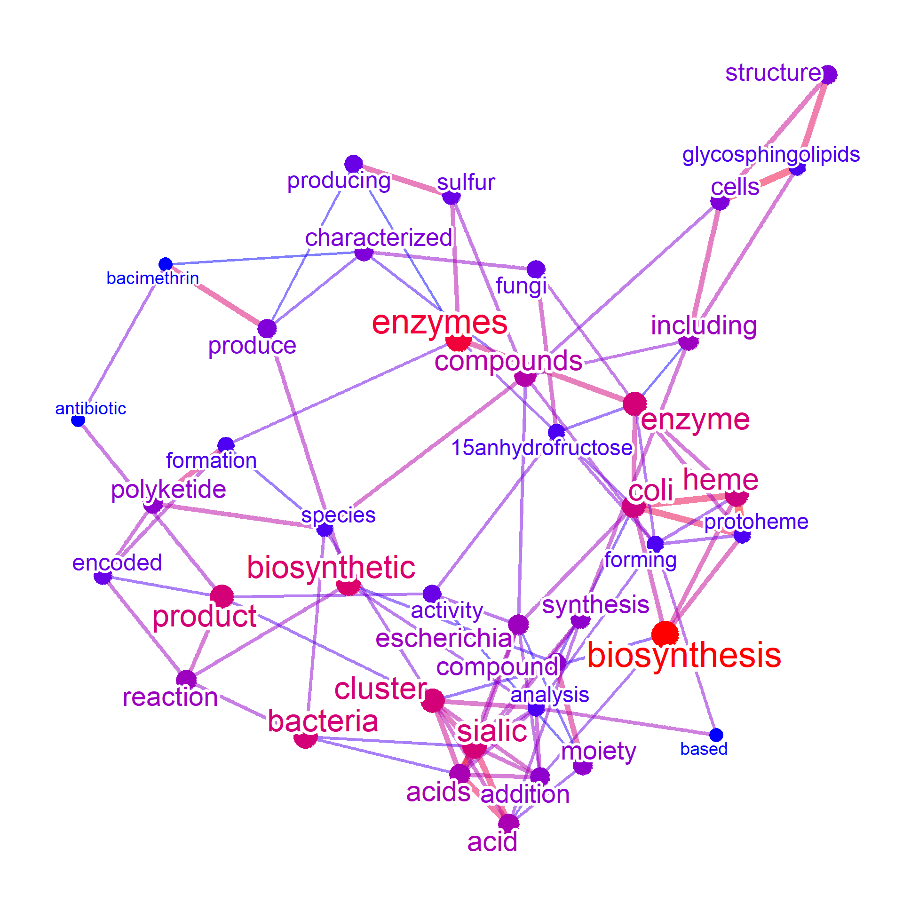
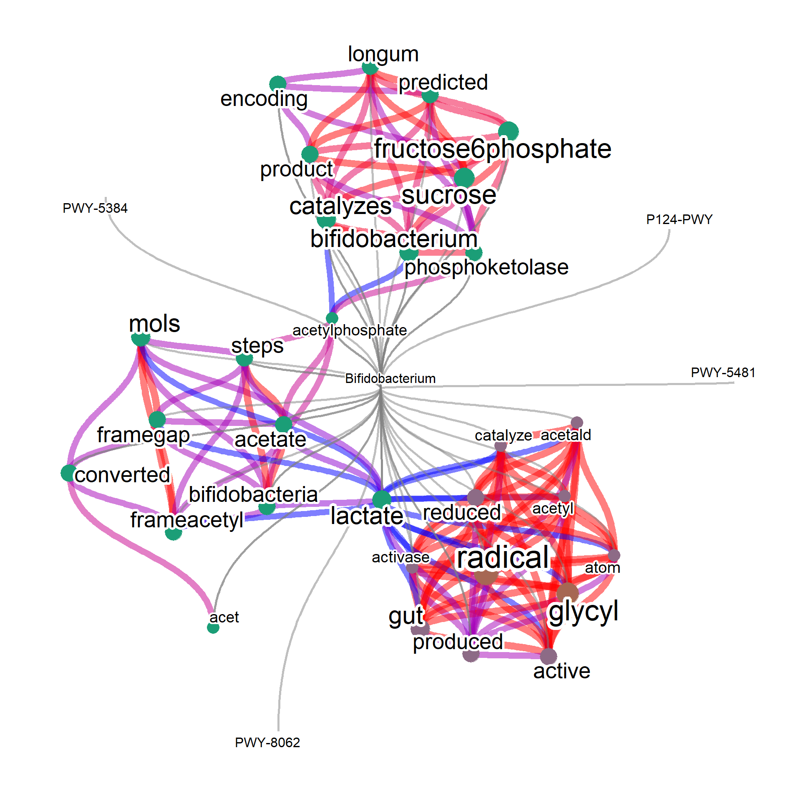

# Microbial functional analysis {#metacyc}

In this section, we introduce making word networks showing microbial function using taxonomic idenfiers as input. For mining the pathway information in curated database MetaCyc ([Caspi et al. 2020](https://academic.oup.com/nar/article/48/D1/D445/5581728)), users can prepare `pathways.dat` from MetaCyc flat files. Note that you must have a valid license of using MetaCyc. See [User guides](https://www.metacyc.org/MetaCycUserGuide.shtml) of MetaCyc, and [BioCyc](www.biocyc.org). The other options will be KEGG Pathway textual information.

Suppose we would like to know pathway and related information of "*Bifidobacterium longum*" and "*Escherichia coli*". The function `parseMetaCycPathway` can be used to parse the summarized comment of pathways using these queries. Note that the function search for `TAXONOMIC-RANGE` or `SPECIES` information in `pathways.dat` if `withTax=TRUE`. The resulting data.frame looks like below.

For selecting species investigated, you can use your own dataset or the database such as `BugSigDB`, described in the section \@ref(disease).


```r
library(biotextgraph)
library(ggraph)

## Two species selected
candidateSpecies <- c("Staphylococcus aureus","Escherichia coli")

## Downloaded pathway description file
file <- "../../metacyc/24.5/data/pathways.dat"

input <- parseMetaCycPathway(file, candidateSpecies)
head(input, n=1) |> dplyr::select(!text) |> kableExtra::kable()
```

<table>
 <thead>
  <tr>
   <th style="text-align:left;"> pathwayID </th>
   <th style="text-align:left;"> commonName </th>
   <th style="text-align:left;"> query </th>
  </tr>
 </thead>
<tbody>
  <tr>
   <td style="text-align:left;"> PWY-7622 </td>
   <td style="text-align:left;"> UDP-&amp;alpha;-D-galactofuranose biosynthesis </td>
   <td style="text-align:left;"> Escherichia coli </td>
  </tr>
</tbody>
</table>


```r

input2 <- parseMetaCycPathway(file, candidateSpecies, withTax=TRUE)
head(input2, n=1) |> dplyr::select(!text) |> kableExtra::kable()
```

<table>
 <thead>
  <tr>
   <th style="text-align:left;"> pathwayID </th>
   <th style="text-align:left;"> commonName </th>
   <th style="text-align:left;"> species </th>
   <th style="text-align:left;"> taxonomicRange </th>
   <th style="text-align:left;"> query </th>
  </tr>
 </thead>
<tbody>
  <tr>
   <td style="text-align:left;"> PWY-7622 </td>
   <td style="text-align:left;"> UDP-&amp;alpha;-D-galactofuranose biosynthesis </td>
   <td style="text-align:left;"> TAX-746128,TAX-330879,TAX-162425 </td>
   <td style="text-align:left;"> TAX-6231,TAX-3052,TAX-147538,TAX-5654,TAX-2 </td>
   <td style="text-align:left;"> Escherichia coli </td>
  </tr>
</tbody>
</table>


You can strip some tags and symbols in the text by `clear=TRUE`.


```r
input3 <- parseMetaCycPathway(file, candidateSpecies, withTax=TRUE, clear=TRUE)
## Not shown because of the long text
```

These data frames can be passed to `manual` function, which performs the same analysis as RefSeq or PubMed information. The input data frame has to have `"text"` column to make word cloud or a network. 


```r

## Set remove words
remove_words <- c("cits","frame","pathway","gene","genes")

metawc <- manual(input3, plotType="wc",
				additionalRemove=remove_words,
                numWords=100,
                 argList=list(
                   rot.per=0.4,
                   colors=RColorBrewer::brewer.pal(8, "Set2"),
                   random.order=FALSE
                 ))
metawc
#> Type: manual
#> Number of words: 100
#> Query: 
#> 526 Kb
plotWC(metawc, asis=TRUE)
```


For plotting the network, query column must be specified if plotting the query with the word information.


```r


metanet <- manual(input[,c("query","text")], 
                  additionalRemove=remove_words,
                  numWords=40, colorText=TRUE)
#> Ignoring corThresh, automatically determine the value
#> threshold = 0.4
metanet
#> Type: manual
#> Number of words: 40
#> Query: 
#> Graph: V(40), E(95)
#> Degree: acids(8)/cluster(8)/enzyme(8)/sialic(8)/addition(7)
#> 560.8 Kb
plotNet(metanet, asis=TRUE)
```



For column other than the query and text, in this example `commonName` and `pathwayID`, the relationship between query and these columns are to be plotted. In this example, the connection between query and text is not shown because `queryPlot` is FALSE.


```r

metanet2 <- manual(input[,c("query","text")],
                   layout="kk", edgeLink=FALSE,
                   additionalRemove=remove_words,
                   numWords=20, colorText=TRUE,
                   queryPlot=TRUE, ngram=2)
#> Ignoring corThresh, automatically determine the value
#> threshold = 0.2
metanet2
#> Type: manual
#> Number of words: 20
#> Query: 
#> Graph: V(22), E(110)
#> Degree: Escherichia coli(41)/escherichia coli(22)/biosynthetic cluster(15)/coli purified(13)/staphylococcus aureus(13)
#> 830.2 Kb
plotNet(metanet2, asis=TRUE)
```


When taxonomy parsing is available, query by the NCBI Taxonomy ID.


```r
# Set candSp to all and noComma to TRUE
input <- parseMetaCycPathway(file, candSp="all", withTax = TRUE, noComma=TRUE)

input2 <- input[grepl("TAX-2157",input$taxonomicRange),]
input2 <- input2[!duplicated(input2$pathwayID),]
onlyText <- data.frame(input2[,c("text")]) |> `colnames<-`(c("text"))
input2Net <- manual(onlyText, additionalRemove=c("cits","frame",
                       "gene","genes","proteins",
                       "pathway","pathways","enzyme","enzymes",
                       "bacteria","reaction","protein","biosynthesis",
                       "organism","organisms"))
#> Ignoring corThresh, automatically determine the value
#> threshold = 0.1
plotNet(input2Net, asis=TRUE)
```


Also, if you want to search for the NCBI taxonomy identifiers and want to use species names as queries, First you should convert the IDs using `convertMetaCyc` function using `taxonomizr`.
Next you search for converted names for the interested species, and input this data frame to `manual`.


```r
input$converted <- convertMetaCyc(input$species)
input3 <- input[grepl("Bifidobacterium",input$converted),]
input3 <- input3[!duplicated(input3$pathwayID),]
input3$query <- rep("Bifidobacterium",nrow(input3))
input3 <- input3[,c("text","pathwayID","query")]
input3Net <- manual(input3, plotType="network", queryPlot=TRUE,
                    layout="lgl", edgeLink=FALSE, tag="cor",
                    additionalRemove=c("cits","frame",
                                       "gene","genes","proteins",
                                       "pathway","pathways","enzyme","enzymes",
                                       "bacteria","reaction","protein","biosynthesis",
                                       "organism","organisms"))
#> Bootstrap (r = 0.5)... Done.
#> Bootstrap (r = 0.6)... Done.
#> Bootstrap (r = 0.7)... Done.
#> Bootstrap (r = 0.8)... Done.
#> Bootstrap (r = 0.9)... Done.
#> Bootstrap (r = 1.0)... Done.
#> Bootstrap (r = 1.1)... Done.
#> Bootstrap (r = 1.2)... Done.
#> Bootstrap (r = 1.3)... Done.
#> Bootstrap (r = 1.4)... Done.
#> Ignoring corThresh, automatically determine the value
#> threshold = 0.8
#> Including columns pathwayID to link with query
plotNet(input3Net, asis=TRUE)
```



Includes BioCyc (TM) pathway/genome databases under license from SRI International.  


```r
sessionInfo()
#> R version 4.3.1 (2023-06-16 ucrt)
#> Platform: x86_64-w64-mingw32/x64 (64-bit)
#> Running under: Windows 11 x64 (build 22621)
#> 
#> Matrix products: default
#> 
#> 
#> locale:
#> [1] LC_COLLATE=Japanese_Japan.utf8 
#> [2] LC_CTYPE=Japanese_Japan.utf8   
#> [3] LC_MONETARY=Japanese_Japan.utf8
#> [4] LC_NUMERIC=C                   
#> [5] LC_TIME=Japanese_Japan.utf8    
#> 
#> time zone: Asia/Tokyo
#> tzcode source: internal
#> 
#> attached base packages:
#> [1] stats     graphics  grDevices utils     datasets 
#> [6] methods   base     
#> 
#> loaded via a namespace (and not attached):
#>  [1] digest_0.6.33     R6_2.5.1          bookdown_0.35    
#>  [4] fastmap_1.1.1     xfun_0.40         cachem_1.0.8     
#>  [7] knitr_1.44        memoise_2.0.1     htmltools_0.5.6  
#> [10] rmarkdown_2.25    xml2_1.3.5        cli_3.6.1        
#> [13] downlit_0.4.3     sass_0.4.7        withr_2.5.0      
#> [16] jquerylib_0.1.4   compiler_4.3.1    rstudioapi_0.15.0
#> [19] tools_4.3.1       evaluate_0.21     bslib_0.5.1      
#> [22] yaml_2.3.7        fs_1.6.3          jsonlite_1.8.7   
#> [25] rlang_1.1.1
```
