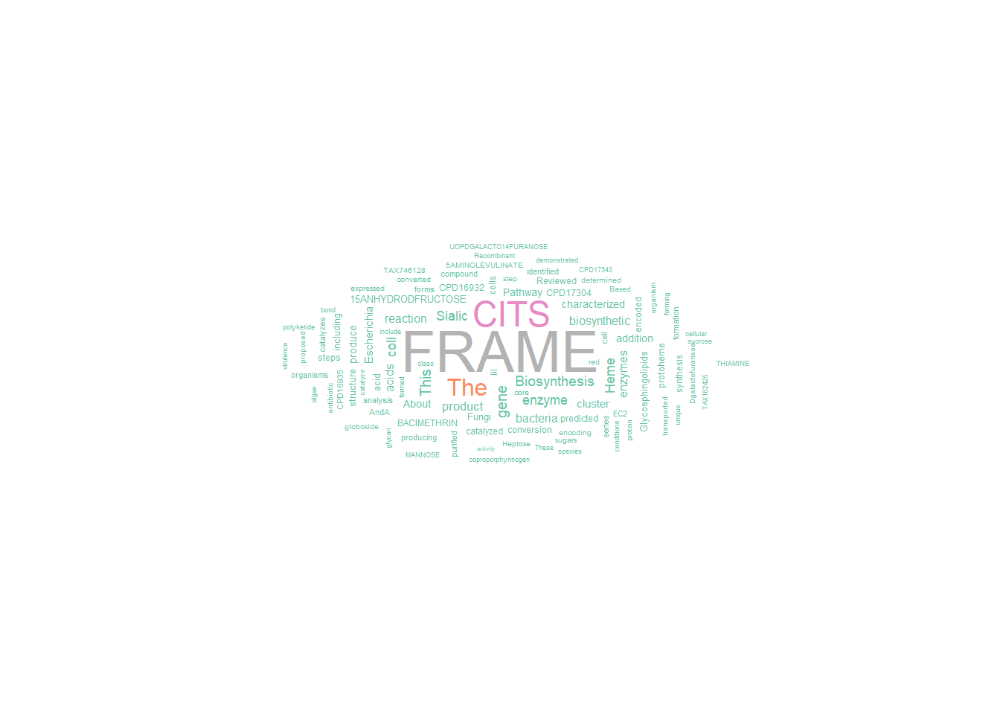
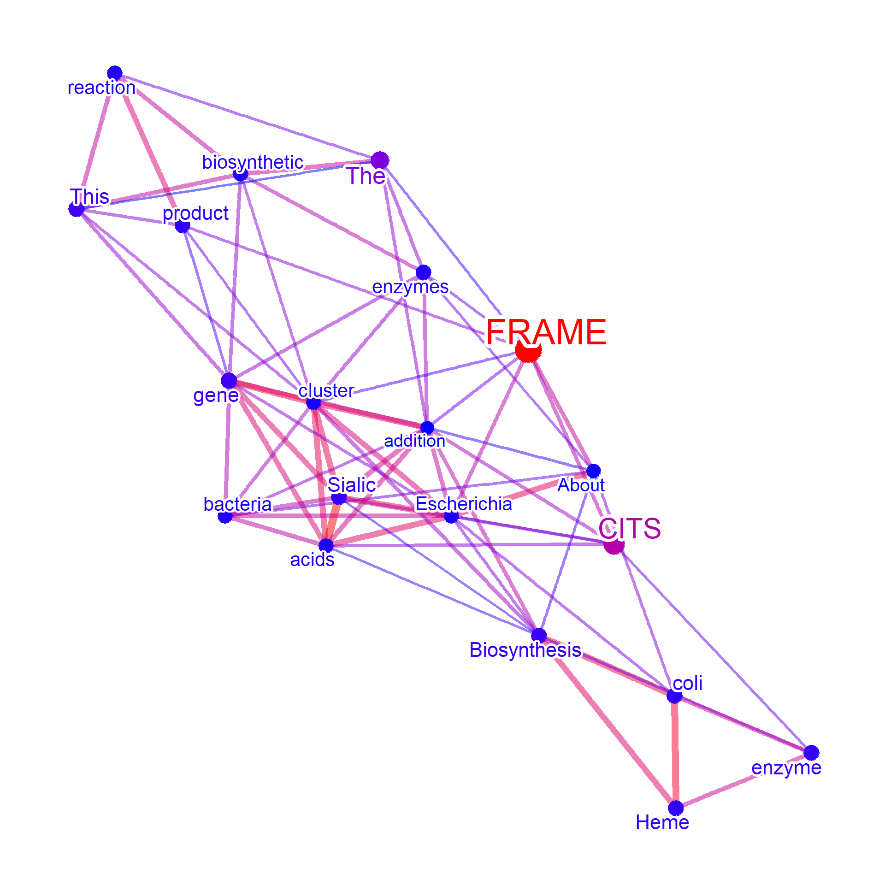
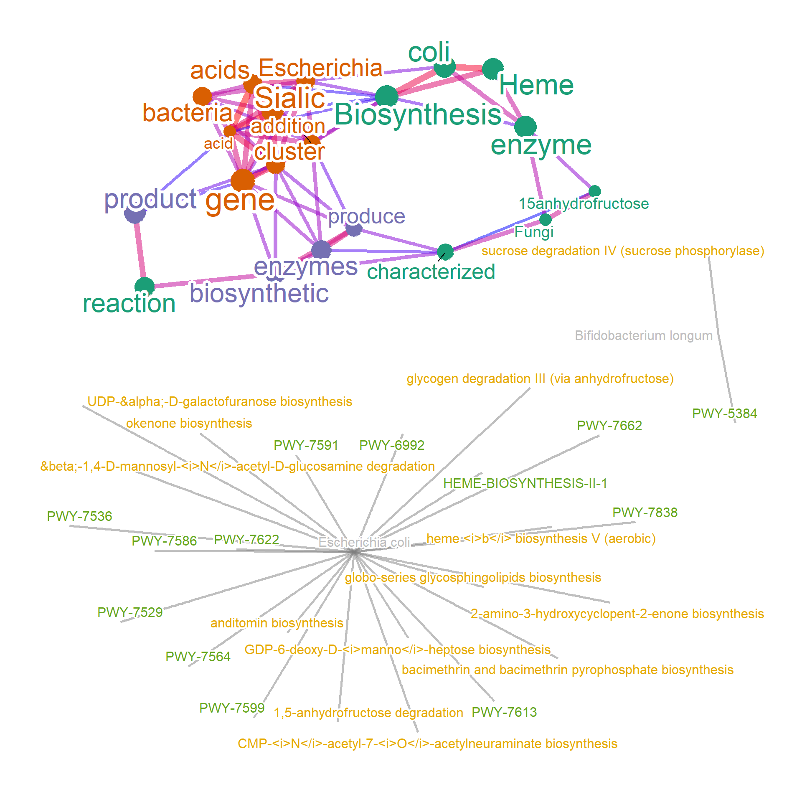
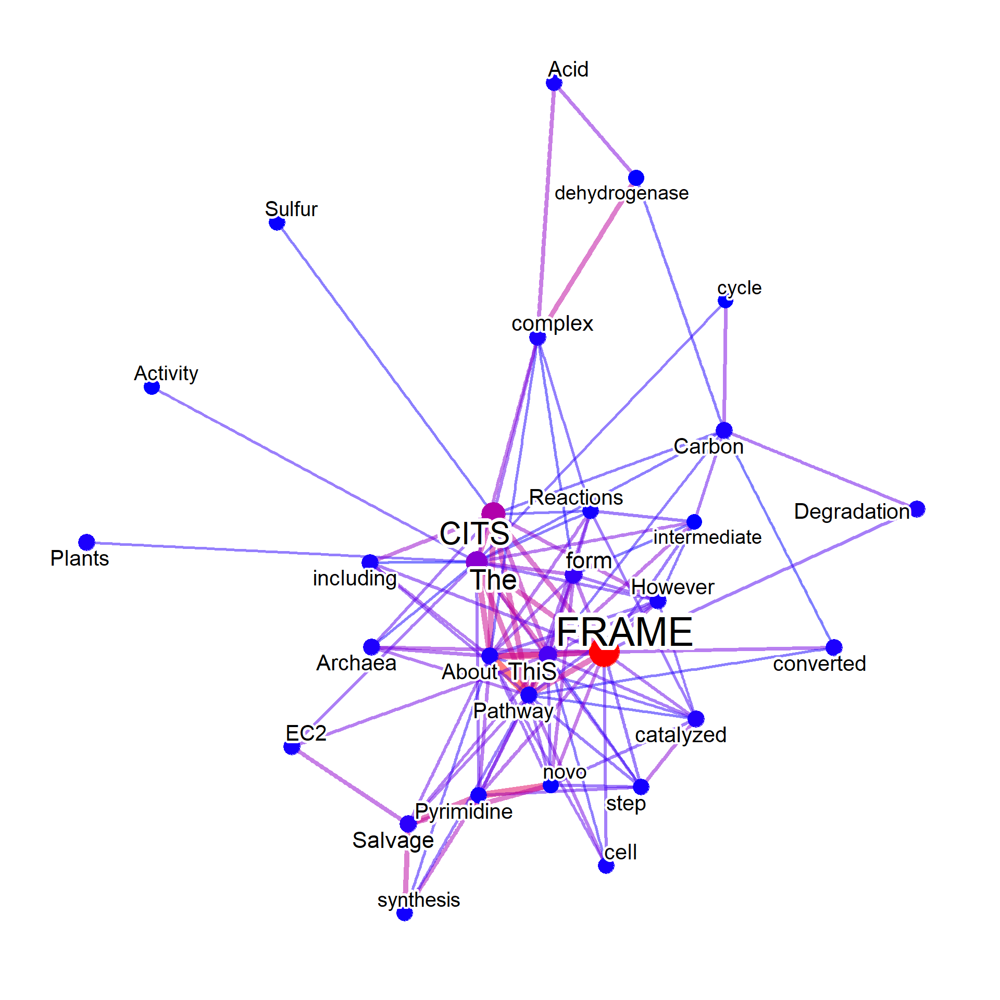
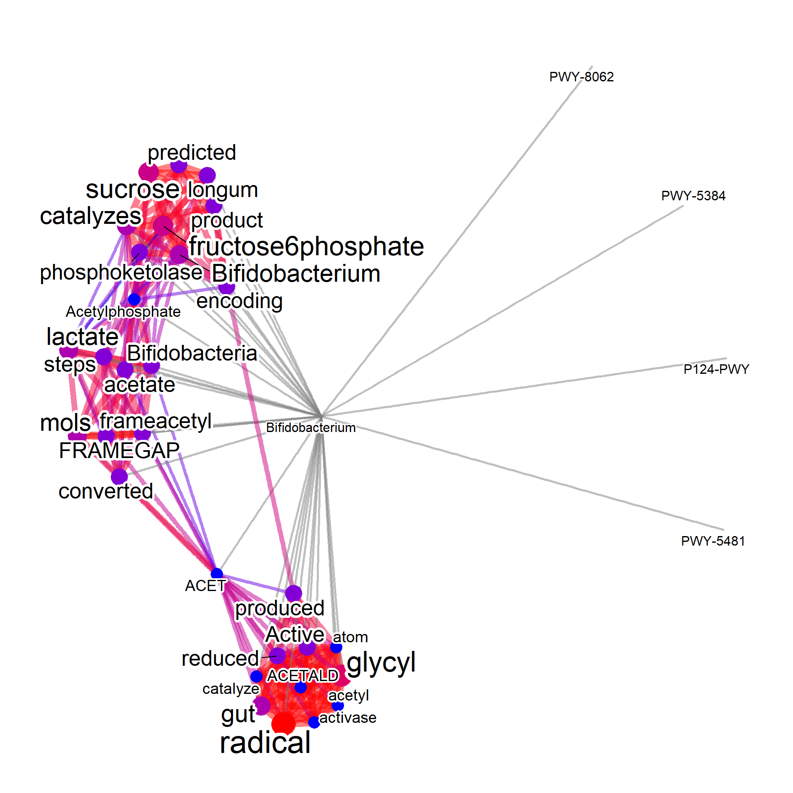

# Including the other databases (an example in MetaCyc) {#metacyc}

For mining the pathway information in curated database MetaCyc ([Caspi et al. 2020](https://academic.oup.com/nar/article/48/D1/D445/5581728)), users can prepare `pathways.dat` from MetaCyc flat files. Note that you must have a valid license of using MetaCyc. See [User guides](https://www.metacyc.org/MetaCycUserGuide.shtml) of MetaCyc, and [BioCyc](www.biocyc.org).
Suppose we would like to know pathway and related information of "Bifidobacterium longum" and "Escherichia coli". The function `parseMetaCycPathway` can be used to parse the summarized comment of pathways using these queries. Note that the function search for `TAXONOMIC-RANGE` or `SPECIES` information in `pathways.dat` if `withTax=TRUE`. The resulting data.frame looks like below.


```r
library(biotextgraph)
library(ggraph)

candidateSpecies <- c("Bifidobacterium longum","Escherichia coli")
file <- "../../metacyc/24.5/data/pathways.dat"
input <- parseMetaCycPathway(file, candidateSpecies)

head(input, n=1) |> dplyr::select(!text) |> kableExtra::kable()
```

<table>
 <thead>
  <tr>
   <th style="text-align:left;"> pathwayID </th>
   <th style="text-align:left;"> commonName </th>
   <th style="text-align:left;"> query </th>
  </tr>
 </thead>
<tbody>
  <tr>
   <td style="text-align:left;"> PWY-7622 </td>
   <td style="text-align:left;"> UDP-&amp;alpha;-D-galactofuranose biosynthesis </td>
   <td style="text-align:left;"> Escherichia coli </td>
  </tr>
</tbody>
</table>

```r

input2 <- parseMetaCycPathway(file, candidateSpecies, withTax=TRUE)

head(input2, n=1) |> dplyr::select(!text) |> kableExtra::kable()
```

<table>
 <thead>
  <tr>
   <th style="text-align:left;"> pathwayID </th>
   <th style="text-align:left;"> commonName </th>
   <th style="text-align:left;"> species </th>
   <th style="text-align:left;"> taxonomicRange </th>
   <th style="text-align:left;"> query </th>
  </tr>
 </thead>
<tbody>
  <tr>
   <td style="text-align:left;"> PWY-7622 </td>
   <td style="text-align:left;"> UDP-&amp;alpha;-D-galactofuranose biosynthesis </td>
   <td style="text-align:left;"> TAX-746128,TAX-330879,TAX-162425 </td>
   <td style="text-align:left;"> TAX-6231,TAX-3052,TAX-147538,TAX-5654,TAX-2 </td>
   <td style="text-align:left;"> Escherichia coli </td>
  </tr>
</tbody>
</table>

You can strip some tags and symbols in the text by `clear=TRUE`.


```r
input3 <- parseMetaCycPathway(file, candidateSpecies, withTax=TRUE, clear=TRUE)
## Not shown because of the long text
```

These data frames can be passed to `wcMan` function, which performs the same analysis as RefSeq or PubMed information. The input data frame has to have `"text"` column to make word cloud or a network. 


```r

metawc <- wcMan(input, plotType="wc",
				additionalRemove=c("cits","frame","pathway"),
                numWords=100,
                 argList=list(
                   rot.per=0.4,
                   colors=RColorBrewer::brewer.pal(8, "Set2"),
                   random.order=FALSE
                 ))
metawc
#> Type: manual
#> Number of words: 100
#> Query: 
#> 628.9 Kb
metawc@wc
```



For plotting the network, query column must be specified if plotting the query with the word information.


```r


metanet <- wcMan(input[,c("query","text")], 
				additionalRemove=c("cits","frame","pathway"),
                numWords=20, plotType="network", colorText=TRUE)
metanet
#> Type: manual
#> Number of words: 20
#> 
#> 627.9 Kb
metanet@net
```



For column other than the query and text, in this example `commonName` and `pathwayID`, the relationship between query and these columns are to be plotted. In this example, the connection between query and text is not shown because `queryPlot` is FALSE.


```r

metanet2 <- wcMan(input, 
				additionalRemove=c("cits","frame","pathway"),
                numWords=20, plotType="network", colorText=TRUE,
                tag=TRUE)
#> Bootstrap (r = 0.5)... Done.
#> Bootstrap (r = 0.6)... Done.
#> Bootstrap (r = 0.7)... Done.
#> Bootstrap (r = 0.8)... Done.
#> Bootstrap (r = 0.9)... Done.
#> Bootstrap (r = 1.0)... Done.
#> Bootstrap (r = 1.1)... Done.
#> Bootstrap (r = 1.2)... Done.
#> Bootstrap (r = 1.3)... Done.
#> Bootstrap (r = 1.4)... Done.
#> Including columns pathwayID and commonName to link with query
metanet2
#> Type: manual
#> Number of words: 20
#> 
#> 714.6 Kb
metanet2@net
```



When taxonomy parsing is available, query by the NCBI Taxonomy ID.


```r
# Set candSp to all and noComma to TRUE
input <- parseMetaCycPathway(file, candSp="all", withTax = TRUE,noComma=TRUE)


input2 <- input[grepl("TAX-2157",input$taxonomicRange),]
input2 <- input2[!duplicated(input2$pathwayID),]
onlyText <- data.frame(input2[,c("text")]) |> `colnames<-`(c("text"))
input2Net <- wcMan(onlyText, plotType="network", additionalRemove=c("cits","frame",
                                               "gene","genes","proteins",
                                               "pathway","pathways","enzyme","enzymes",
                                               "bacteria","reaction","protein","biosynthesis",
                                               "organism","organisms"))
input2Net@net
```



Also, if you want to search for the NCBI tax identifiers and want to use species names as queries,
First you should convert the IDs using `convertMetaCyc` function using `taxonomizr`.
Next you search for converted names for the interested species, and input this data frame to `wcMan`.


```r
input$converted <- convertMetaCyc(input$species)
input3 <- input[grepl("Bifidobacterium",input$converted),]
input3 <- input3[!duplicated(input3$pathwayID),]
input3$query <- rep("Bifidobacterium",nrow(input3))
input3 <- input3[,c("text","pathwayID","query")]
input3Net <- wcMan(input3, plotType="network", queryPlot=TRUE,
                   additionalRemove=c("cits","frame",
                    "gene","genes","proteins",
                    "pathway","pathways","enzyme","enzymes",
                    "bacteria","reaction","protein","biosynthesis",
                    "organism","organisms"))
#> Including columns pathwayID to link with query
input3Net@net
```



Includes BioCyc (TM) pathway/genome databases under license from SRI International.  


```r
sessionInfo()
#> R version 4.2.1 (2022-06-23 ucrt)
#> Platform: x86_64-w64-mingw32/x64 (64-bit)
#> Running under: Windows 10 x64 (build 22621)
#> 
#> Matrix products: default
#> 
#> locale:
#> [1] LC_COLLATE=Japanese_Japan.utf8 
#> [2] LC_CTYPE=Japanese_Japan.utf8   
#> [3] LC_MONETARY=Japanese_Japan.utf8
#> [4] LC_NUMERIC=C                   
#> [5] LC_TIME=Japanese_Japan.utf8    
#> 
#> attached base packages:
#> [1] stats     graphics  grDevices utils     datasets 
#> [6] methods   base     
#> 
#> other attached packages:
#> [1] ggraph_2.1.0        biotextgraph_0.99.0
#> [3] ggplot2_3.4.2      
#> 
#> loaded via a namespace (and not attached):
#>   [1] GeneSummary_0.99.4     colorspace_2.1-0      
#>   [3] rjson_0.2.21           ellipsis_0.3.2        
#>   [5] ISOcodes_2022.09.29    markdown_1.5          
#>   [7] XVector_0.38.0         GlobalOptions_0.1.2   
#>   [9] base64enc_0.1-3        ggdendro_0.1.23       
#>  [11] fs_1.6.1               gridtext_0.1.5        
#>  [13] rstudioapi_0.14        farver_2.1.1          
#>  [15] graphlayouts_0.8.4     ggrepel_0.9.3         
#>  [17] ggwordcloud_0.6.0      bit64_4.0.5           
#>  [19] AnnotationDbi_1.60.2   fansi_1.0.4           
#>  [21] xml2_1.3.3             codetools_0.2-18      
#>  [23] downlit_0.4.2          cachem_1.0.7          
#>  [25] knitr_1.42             polyclip_1.10-4       
#>  [27] jsonlite_1.8.4         png_0.1-8             
#>  [29] graph_1.76.0           ggforce_0.4.1         
#>  [31] shiny_1.7.4            bugsigdbr_1.4.3       
#>  [33] rentrez_1.2.3          compiler_4.2.1        
#>  [35] httr_1.4.5             fastmap_1.1.1         
#>  [37] cli_3.6.1              later_1.3.0           
#>  [39] tweenr_2.0.2           htmltools_0.5.4       
#>  [41] tools_4.2.1            igraph_1.4.2          
#>  [43] NLP_0.2-1              gtable_0.3.3          
#>  [45] glue_1.6.2             GenomeInfoDbData_1.2.9
#>  [47] dplyr_1.1.1            Rcpp_1.0.10           
#>  [49] slam_0.1-50            Biobase_2.58.0        
#>  [51] jquerylib_0.1.4        vctrs_0.6.1           
#>  [53] Biostrings_2.66.0      stringr_1.5.0         
#>  [55] xfun_0.37              stopwords_2.3         
#>  [57] mime_0.12              lifecycle_1.0.3       
#>  [59] XML_3.99-0.14          pvclust_2.2-0         
#>  [61] dendextend_1.16.0      org.Hs.eg.db_3.15.0   
#>  [63] zlibbioc_1.44.0        MASS_7.3-57           
#>  [65] scales_1.2.1           tidygraph_1.2.3       
#>  [67] promises_1.2.0.1       parallel_4.2.1        
#>  [69] cyjShiny_1.0.34        RColorBrewer_1.1-3    
#>  [71] yaml_2.3.7             memoise_2.0.1         
#>  [73] gridExtra_2.3          yulab.utils_0.0.6     
#>  [75] sass_0.4.5             stringi_1.7.12        
#>  [77] RSQLite_2.3.0          highr_0.10            
#>  [79] S4Vectors_0.36.2       BiocGenerics_0.44.0   
#>  [81] GenomeInfoDb_1.34.9    commonmark_1.9.0      
#>  [83] rlang_1.1.0            pkgconfig_2.0.3       
#>  [85] bitops_1.0-7           evaluate_0.20         
#>  [87] purrr_1.0.1            labeling_0.4.2        
#>  [89] patchwork_1.1.2        htmlwidgets_1.6.2     
#>  [91] cowplot_1.1.1          bit_4.0.5             
#>  [93] tidyselect_1.2.0       magrittr_2.0.3        
#>  [95] bookdown_0.33          R6_2.5.1              
#>  [97] IRanges_2.32.0         generics_0.1.3        
#>  [99] DBI_1.1.3              pillar_1.9.0          
#> [101] withr_2.5.0            KEGGREST_1.38.0       
#> [103] RCurl_1.98-1.10        tibble_3.2.1          
#> [105] crayon_1.5.2           wordcloud_2.6         
#> [107] utf8_1.2.3             rmarkdown_2.20        
#> [109] viridis_0.6.2          GetoptLong_1.0.5      
#> [111] grid_4.2.1             blob_1.2.4            
#> [113] digest_0.6.31          xtable_1.8-4          
#> [115] tm_0.7-11              tidyr_1.3.0           
#> [117] httpuv_1.6.9           gridGraphics_0.5-1    
#> [119] stats4_4.2.1           munsell_0.5.0         
#> [121] viridisLite_0.4.1      ggplotify_0.1.0       
#> [123] bslib_0.4.2
```
