# The other usage for microbiome-related data

In this section, we introduce the other usage for mining the information related to microbiome-related signatures, including disease, enzymes and metabolites by the package.


```r
library(biotextgraph)
library(ggplot2)
library(ggraph)
library(RColorBrewer)
load(system.file("extdata", "sysdata.rda", package = "biotextgraph"))
```

## Diseases {#disease}

We use BugSigDB, and its R port bugsigdbr to obtain the curated dataset of the relationship with bacterial taxonomy and human diseases ([Geistlinger et al. 2022](https://bugsigdb.org/Main_Page)). Users can query microbiome names, which will be searched for MetaPhlAn taxonomic annotation. If `target="title"`, the title of the corresponding articles will be summarized.


```r
basic <- bugsigdb(c("Veillonella dispar","Neisseria flava"),tag="none", plotType="wc",
    curate=TRUE,target="title",pre=TRUE,cl=snow::makeCluster(12),
    pal=RColorBrewer::brewer.pal(10, "Set2"),numWords=80,argList=list(min.freq=1))
#> Input microbes: 2
#>   Found 17 entries for Veillonella dispar
#>   Found 1 entries for Neisseria flava
#> Including 28 entries
#> Filter based on BugSigDB
#> Filtering 0 words (frequency and/or tfidf)
getSlot(basic, "freqDf") |> head(n=20)
#>                    word freq
#> gut                 Gut    8
#> oral               Oral    5
#> patients       patients    5
#> study             study    3
#> arthritis     arthritis    2
#> association association    2
#> bacterial     bacterial    2
#> covid19         COVID19    2
#> diabetes       diabetes    2
#> dysbiosis     Dysbiosis    2
#> infant           infant    2
#> infection     Infection    2
#> obese             obese    2
#> respiratory respiratory    2
#> sequencing   sequencing    2
#> surgery         surgery    2
#> tract             tract    2
#>  features      features    1
#> 16s                 16S    1
#> aerosol         Aerosol    1
plotWC(basic)
```

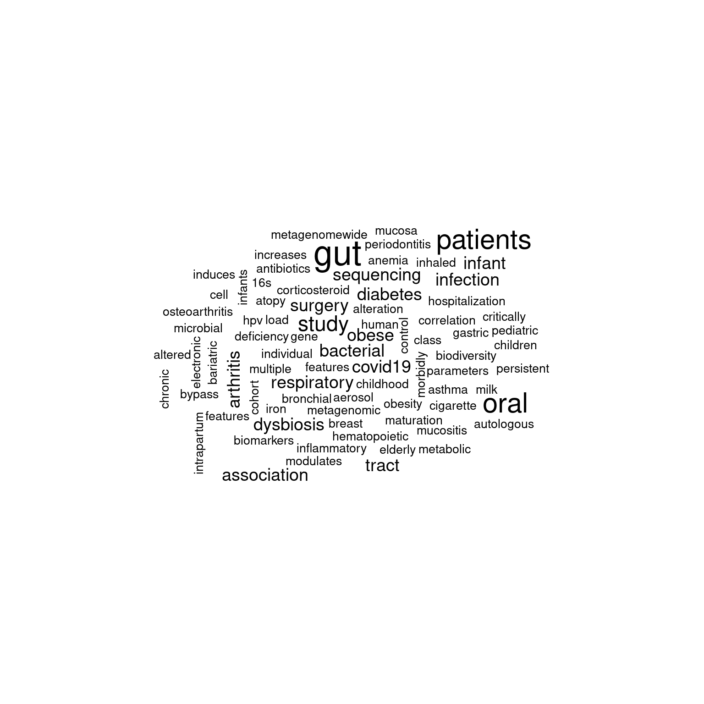

If `target="abstract"`, the corresponding abstract of curated publications will be fetched and be summarized.


```r
basic2 <- bugsigdb(c("Veillonella dispar","Neisseria flava"),tag="cor", plotType="wc",
    curate=TRUE,target="abstract",pre=TRUE,cl=snow::makeCluster(12),
    pal=RColorBrewer::brewer.pal(10, "Dark2"),numWords=80)
#> Input microbes: 2
#>   Found 17 entries for Veillonella dispar
#>   Found 1 entries for Neisseria flava
#> Including 28 entries
#> Target is abstract
#>   Querying PubMed for 17 pmids
#>   Querying without API key
#> Filter based on BugSigDB
#> Filtering 0 words (frequency and/or tfidf)
#> Multiscale bootstrap... Done.
getSlot(basic2, "freqDf") |> head(n=20)
#>                    word freq
#> patients       patients   37
#> gut                 Gut   30
#> oral               Oral   27
#> bacterial     Bacterial   25
#> species         species   24
#> microbial     Microbial   23
#> subjects       Subjects   20
#> sequencing   sequencing   18
#> diversity     diversity   17
#> composition composition   16
#> 16s                 16S   14
#> infection     infection   14
#> differences differences   13
#> healthy         healthy   13
#> controls       controls   12
#> covid19         COVID19   12
#> infant           Infant   12
#> rrna               rRNA   12
#> compared       compared   11
#> disease         disease   11
plotWC(basic2)
```

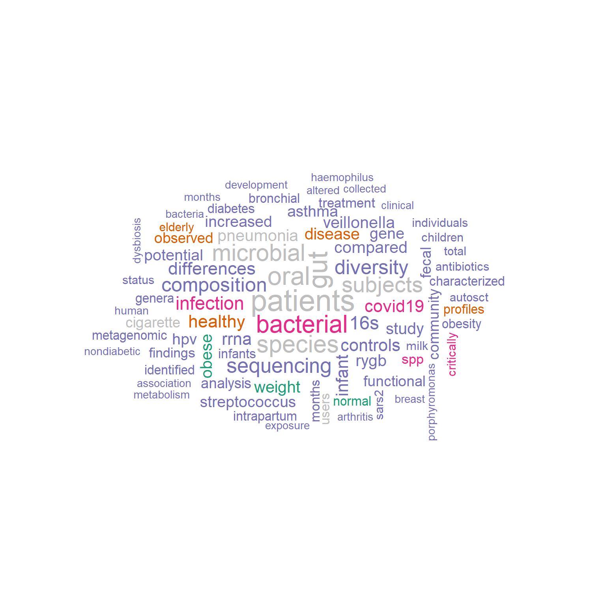

For successful visualization, pre-caculated TF-IDF and frequency data frame is available and one can use them to filter the highly occurring words, or the other prefiltering option used in `refseq`.


```r
rmwords <- allFreqBSDB
filter <- rmwords[rmwords$freq>quantile(rmwords$freq, 0.95),]
filter$word |> length()
#> [1] 65
filter |> head(n=20)
#>             freq        word
#> microbiota   275  microbiota
#> gut          242         gut
#> microbiome   175  microbiome
#> patients     146    patients
#> study         69       study
#> cancer        64      cancer
#> composition   62 composition
#> oral          55        oral
#> human         49       human
#> intestinal    48  intestinal
#> children      45    children
#> microbial     45   microbial
#> disease       43     disease
#> fecal         41       fecal
#> alterations   36 alterations
#> analysis      34    analysis
#> association   34 association
#> dysbiosis     34   dysbiosis
#> infection     34   infection
#> risk          33        risk
```
The network visualization is possible by enabling `plotType="network"`.
The same parameters that can be passed to `refseq` can be used.


```r
net <- bugsigdb(c("Neisseria","Veillonella"),
    curate=TRUE,
    target="title",
    pre=TRUE,
    plotType="network",
    additionalRemove=filter$word,
    corThresh=0.2,
    edgeLink=FALSE,
    numWords=60)
#> Input microbes: 2
#>   Found 76 entries for Neisseria
#>   Found 221 entries for Veillonella
#> Including 502 entries
#> Filter based on BugSigDB
#> Filtering 0 words (frequency and/or tfidf)
plotNet(net)
```

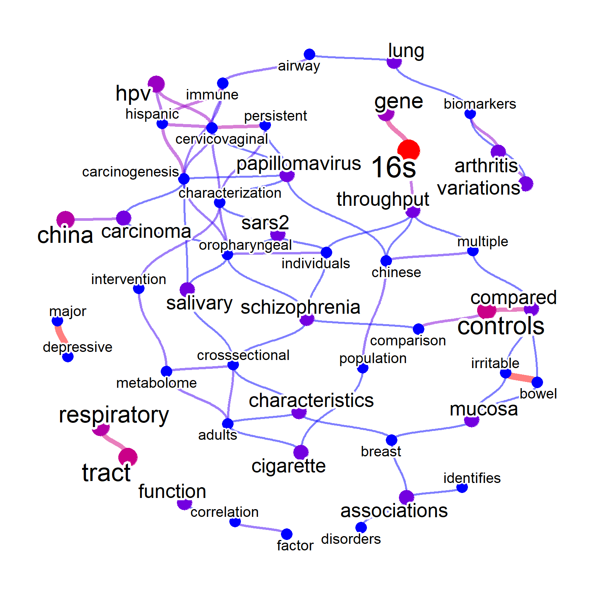

The words-to-species relationship can be plotted by `mbPlot=TRUE`, useful for assessing which species have similar characteristics regarding diseases.


```r
net2 <- bugsigdb(c("Veillonella dispar","Neisseria flava",
                 "Veillonella parvula","Akkermansia muciniphila"),
            mbPlot=TRUE,
            curate=TRUE,
            target="title",
            pre=TRUE,
            plotType="network",
            additionalRemove=filter$word,
            colorize=TRUE,
            showLegend=TRUE,
            numWords=50, 
            corThresh=0.2,
            colorText=TRUE
            )
#> Input microbes: 4
#>   Found 17 entries for Veillonella dispar
#>   Found 1 entries for Neisseria flava
#>   Found 20 entries for Veillonella parvula
#>   Found 21 entries for Akkermansia muciniphila
#> Including 90 entries
#> Filter based on BugSigDB
#> Filtering 0 words (frequency and/or tfidf)
plotNet(net2)
```

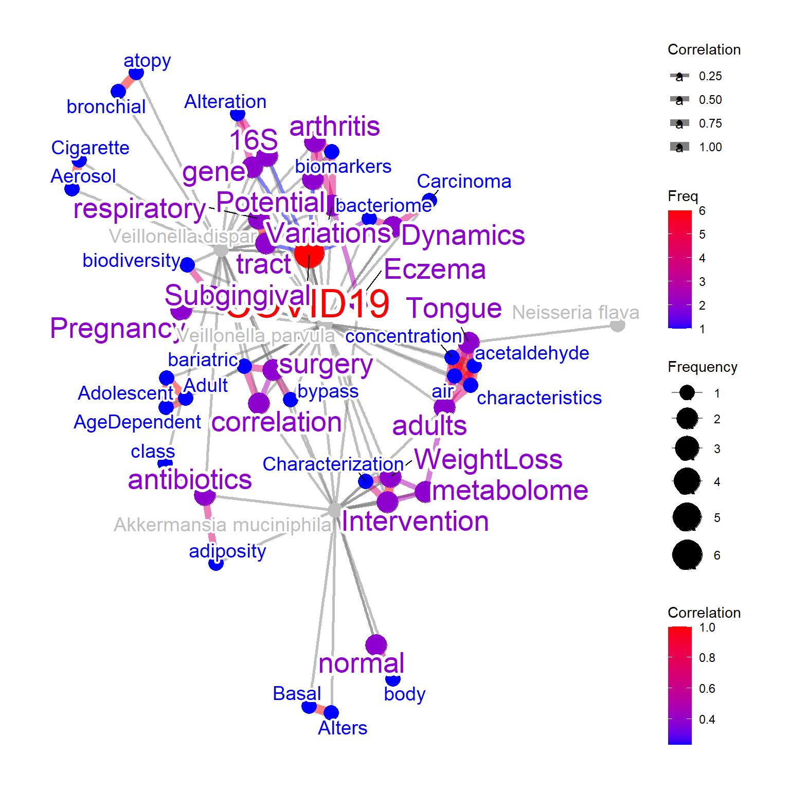

As the BugSigDB contains the relationship between bacterial taxonomy and disease, disease name can also be plotted. When `disPlot=TRUE`, the `mbPlot`
 will be set to `TRUE` by default. Words from PubMed that is contained in the disease flag will be concatenated into disease label (like `pregnancy`) when the `colorize=TRUE` like the example below.
 

```r
net3 <- bugsigdb(c("Veillonella dispar","Neisseria flava",
    "Veillonella parvula","Akkermansia muciniphila"), mbPlot=TRUE,
    curate=TRUE,target="title",pre=TRUE,plotType="network",
    additionalRemove=filter$word, disPlot=TRUE, colorize=TRUE,
    numWords=50, corThresh=0.2, colorText=TRUE, edgeLink=FALSE)
#> Input microbes: 4
#>   Found 17 entries for Veillonella dispar
#>   Found 1 entries for Neisseria flava
#>   Found 20 entries for Veillonella parvula
#>   Found 21 entries for Akkermansia muciniphila
#> Including 90 entries
#> Filter based on BugSigDB
#> Filtering 0 words (frequency and/or tfidf)
plotNet(net3)
```

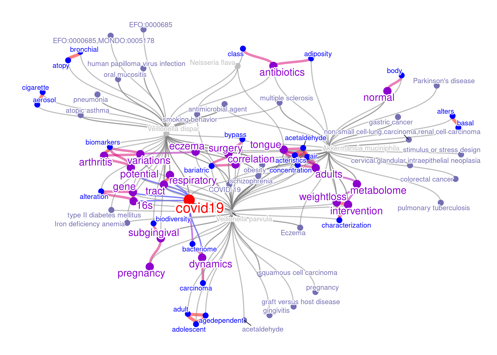

Other than curated databases, the PubMed query can also be performed with setting `curate=FALSE`. This way, the text information of the latest literature for the microbes and diseases can be plotted. The options for use in function obtaining PubMed information can be specified to `abstArg` in list format, like `sortOrder="pubdate"`.


```r
net4 <- bugsigdb(c("Akkermansia muciniphila"),
    curate=FALSE,target="title",pre=TRUE,plotType="network",
    additionalRemove=filter$word,
    numWords=40, corThresh=0.2, colorText=TRUE, colorize=TRUE,
    abstArg = list(retMax=80, sortOrder="pubdate"))
#> Input microbes: 1
#>   Found 21 entries for Akkermansia muciniphila
#> Including 31 entries
#> Proceeding without API key
#> Filter based on BugSigDB
#> Filtering 0 words (frequency and/or tfidf)
plotNet(net4)
```

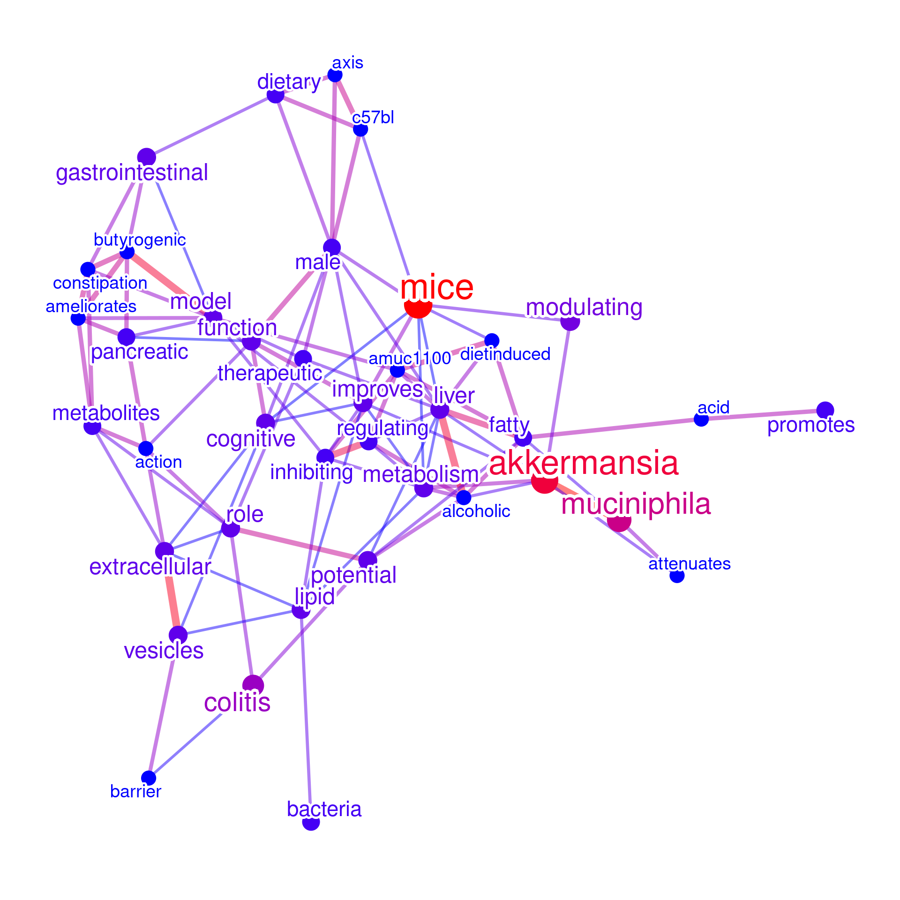

## Enzymes

For microbiome analysis, it is often the case that investigating coded enzymes is important. Using `enzyme` function and `getUPtax` function, the queried species or genus can be linked to possible interaction with enzymes using following databases. The downloaded file path should be specified to the function like below to link the queried taxonomy and enzymes. Specifically, enzymes listed in `enzyme.dat` are searched, and corresponding UniProt identifiers are obtained, followed by mapping using `speclist.txt`. This way, the links to microbe - textual information - enzyme can be plotted. 

- [enzyme.dat - from Expasy](https://enzyme.expasy.org/)
- [speclist.txt - UniProt Controlled vocabulary of species](https://ftp.uniprot.org/pub/databases/uniprot/current_release/knowledgebase/complete/docs/speclist.txt)


```r

vp <- bugsigdb(c("Veillonella parvula"),
                 plotType="network", layout="kk",
                curate=TRUE, target="title", edgeLink=TRUE,
                mbPlot = TRUE, ecPlot=TRUE, disPlot=TRUE, tag="cor",
                cl=snow::makeCluster(10),colorText=TRUE, pre=TRUE, numWords=30,
                ecFile="../enzyme.dat", addFreqToMB=TRUE, ## Add nodes other than words pseudo-frequency
                upTaxFile = "../speclist.txt")
#> Input microbes: 1
#>   Found 20 entries for Veillonella parvula
#> Including 31 entries
#> Filter based on BugSigDB
#> Filtering 0 words (frequency and/or tfidf)
#> Processing EC file
#>   Linking taxonomy to EC
#> Bootstrap (r = 0.5)... Done.
#> Bootstrap (r = 0.6)... Done.
#> Bootstrap (r = 0.7)... Done.
#> Bootstrap (r = 0.8)... Done.
#> Bootstrap (r = 0.9)... Done.
#> Bootstrap (r = 1.0)... Done.
#> Bootstrap (r = 1.1)... Done.
#> Bootstrap (r = 1.2)... Done.
#> Bootstrap (r = 1.3)... Done.
#> Bootstrap (r = 1.4)... Done.
plotNet(vp)
```

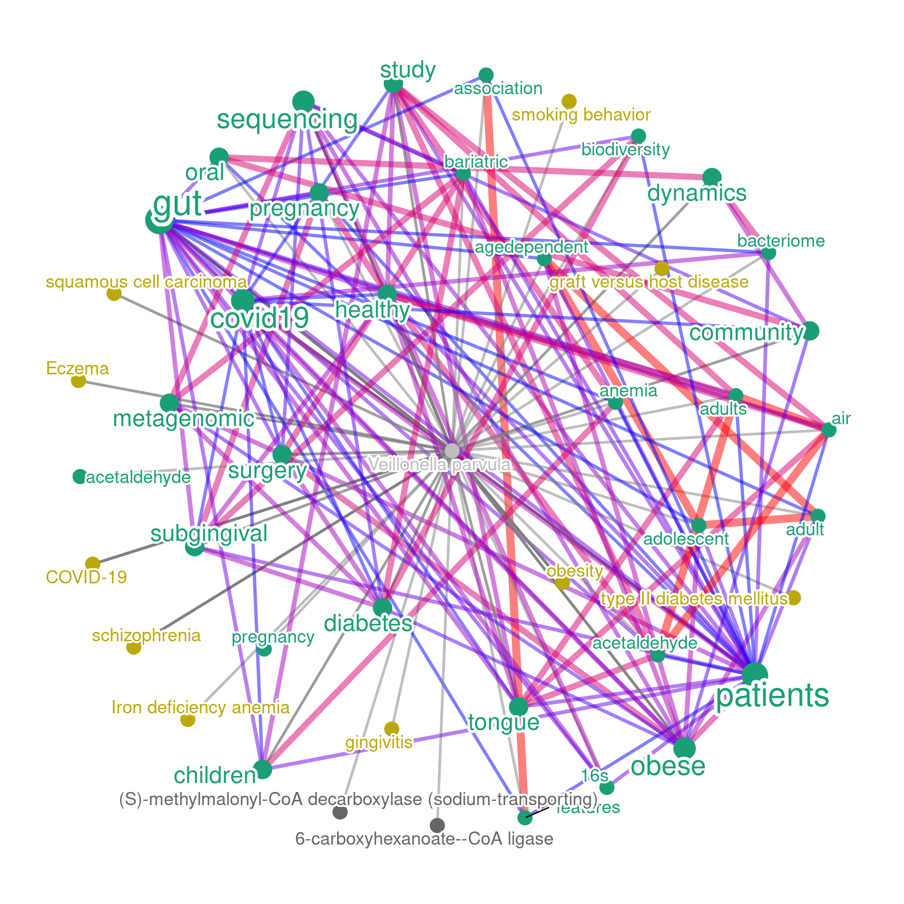

## Metabolites

Further, the relationship between metabolites and microbiome is of interest. Recent studies have revealed various associations in gut microbiome composition and human plasma metabolites, as well as in the other environments.

- Wishart DS, Oler E, Peters H, et al. MiMeDB: the Human Microbial Metabolome Database. Nucleic Acids Res. 2023;51(D1):D611-D620. doi:10.1093/nar/gkac868
- Muller E, Algavi YM, Borenstein E. The gut microbiome-metabolome dataset collection: a curated resource for integrative meta-analysis. npj Biofilms and Microbiomes. 2022;8(1):1-7. doi:10.1038/s41522-022-00345-5
- Dekkers KF, Sayols-Baixeras S, Baldanzi G, et al. An online atlas of human plasma metabolite signatures of gut microbiome composition. Nat Commun. 2022;13(1):5370. doi:10.1038/s41467-022-33050-0

We now use data obtained in [Dekkers et al.](https://www.nature.com/articles/s41467-022-33050-0).
First, read the downloaded file using `readxl`.


```r
metab <- readxl::read_excel(
  "../41467_2022_33050_MOESM8_ESM.xlsx",skip = 7)
```

Pass this tibble, as well as the columns to represent `taxonomy`, `metabolites`, and `quantitative values to threshold` to `metCol`. In this case, `metCol <- c("Metagenomic species", "Metabolite", "Spearman's ρ")`. `manual` function can be also used for the general purpose of adding external information.


```r

metabEx <- bugsigdb(c("Akkermansia muciniphila"),
                edgeLink=FALSE,
                curate=TRUE,
                corThresh=0.3,
                pre=TRUE,
                additionalRemove = filter$word,
                target="abstract",
                colorText=TRUE,
                plotType="network",
                numWords=50,
                mbPlot=TRUE,
                layout="lgl",
                metCol=c("Metagenomic species", "Metabolite", "Spearman's ρ"),
                metab =metab, metThresh=0.15,
                preserve = TRUE,
                cl=snow::makeCluster(10),
                showLegend=TRUE,
                abstArg = list(retMax=80,
                               sortOrder="relevance"))
#> Input microbes: 1
#>   Found 21 entries for Akkermansia muciniphila
#> Including 31 entries
#> Target is abstract
#>   Querying PubMed for 20 pmids
#>   Querying without API key
#> Filter based on BugSigDB
#> Filtering 0 words (frequency and/or tfidf)
#> Checking metabolites
#> Ignoring corThresh, automatically determine the value
#> threshold = 0.3
plotNet(metabEx)
```

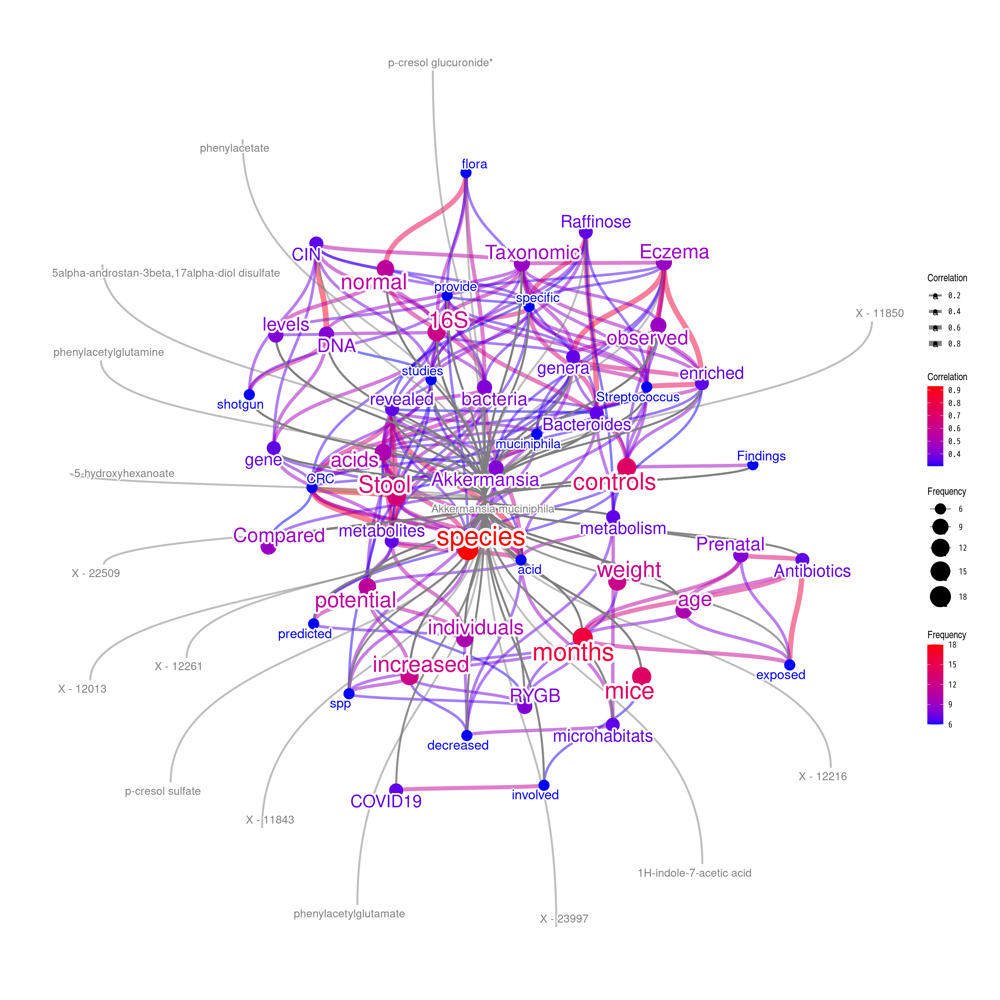

In this way, we can plot links between microbes - metabolites - textual information. For all the information combined, one can plot textual information - metabolites - coded enzymes - diseases - microbes link in one query.

By default, the category other than words are plotted without node and colorization (grey). If preferred, set `colorize=TRUE` to colorize the associated information by `catColors`. In this way, color of nodes of words are shown by the gradient of frequency, independent of color of associated categories.


```r

metabEx <- bugsigdb(c("Akkermansia muciniphila"),
                edgeLink=FALSE,
                curate=TRUE,
                target="abstract",
                corThresh=0.3,
                colorize=TRUE,
                pre=TRUE,
                additionalRemove = filter$word,
                colorText=TRUE,
                plotType="network",
                layout="lgl",
                numWords=50,
                mbPlot=TRUE,
                disPlot=TRUE,
                preserve = TRUE)
#> Input microbes: 1
#>   Found 21 entries for Akkermansia muciniphila
#> Including 31 entries
#> Target is abstract
#>   Querying PubMed for 20 pmids
#>   Querying without API key
#> Filter based on BugSigDB
#> Filtering 0 words (frequency and/or tfidf)
plotNet(metabEx)
```

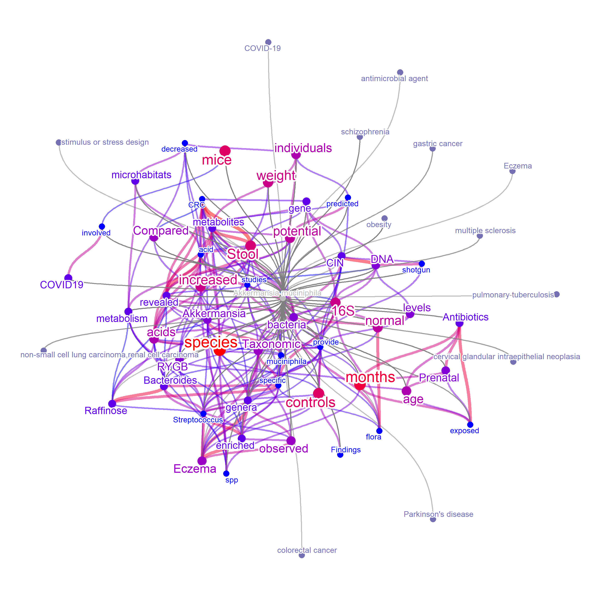

### Visualizing complex network interactively {#interactive}

For the complex network, the resulting image might be unreadable.
`exportCyjsWithoutImage` function can be used to export the graph to readily interactive interface using `Cytoscape.js`. The below chunk shows the output produced by the function, hosted by GitHub Pages.


```r
## exportCyjsWithoutImage(getSlot(metabEx, "igraph"), rootDir=".", netDir="",nodeColorDiscretePal = "Pastel1")
knitr::include_url("https://noriakis.github.io/cyjs_test/complex")
```

<iframe src="https://noriakis.github.io/cyjs_test/complex" width="100%" height="400px" data-external="1" style="border: none;"></iframe>

## Pathway information

Other than enzymes, metabolites, diseases, metabolic pathways are the most important functional entities that can be analyzed in microbiome. Analyzing the text information of databases such as KEGG and MetaCyc is crucial for this purpose. Please refer to Section \@ref(metacyc) for the methods used for this analysis.

## Annotating the dendrogram of taxonomy

Annotating the dendrogram (or cladogram) of taxonomy is possible by the `plotEigengeneNetworksWithWords` function. The used need to provide customized data.frame depicting query (taxonomy) and its corresponding text, like MetaCyc.


```r

## Read pathway description
file <- "../../metacyc/24.5/data/pathways.dat"
input <- parseMetaCycPathway(file,
                              candSp="all",
                              withTax=TRUE,
                              clear=TRUE,
                              noComma = TRUE)


## Convert the species name by taxonomizr
input$spConverted <- convertMetaCyc(input$species)
input$spConverted |> head()
#> [1] "Bacteria;Cyanobacteria;NA;Synechococcales;Prochloraceae;Prochloron;Prochloron didemni"                                 
#> [2] "Bacteria;Pseudomonadota;Gammaproteobacteria;Enterobacterales;Enterobacteriaceae;Escherichia;Escherichia coli"          
#> [3] "Bacteria;Pseudomonadota;Gammaproteobacteria;Enterobacterales;Enterobacteriaceae;Salmonella;Salmonella enterica"        
#> [4] "Bacteria;Pseudomonadota;Gammaproteobacteria;Enterobacterales;Enterobacteriaceae;Escherichia;Escherichia coli"          
#> [5] "Bacteria;Pseudomonadota;Betaproteobacteria;Burkholderiales;Burkholderiaceae;Paraburkholderia;Paraburkholderia phymatum"
#> [6] "Bacteria;Pseudomonadota;Betaproteobacteria;Burkholderiales;Burkholderiaceae;Cupriavidus;Cupriavidus basilensis"
```

Now we fetch species under `Bacillota`.


```r
bc <- input[grepl("Bacillota", input$spConverted),]
bc <- bc[!duplicated(bc$pathwayID),]
bc |> head()
#>      pathwayID
#> 12  PCEDEG-PWY
#> 173   PWY-7872
#> 349   PWY-7013
#> 748   PWY-7886
#> 749   PWY-8146
#> 799   PWY-7942
#>                                                                                                                                                                                                                                                                                                                                                                                                                                                                                                                                                                                                                                                                                                                                                                                                                                                                                                                                                                                                                                                                                                                                                                                                                                                                                                                                                                                                                                                                                                                                                                                                                                                                                                                                                                                                                                                                                                                                                                                                                                                                                                                                                                                                                                                                                                                                                                                                                                                                                                                                                                                                                                                                                                                                                                                                                                                                                                                                                                                                                                                                                                                                                                                                                                                                                                                                                                                                                                                                                                                                                                                                                                                                                                                                                                                                                                                                                                                                                                                                                                                                                                                                                                                                                                                                                                                               text
#> 12                                                                                                                                                                                                                                                                                                                                                                                                                                                                                                                                                                                                                                                                                                                                                                                                                                                                                                                                                                                                                                                                                                                                                                                                                                                                                                                                                                                                                                                                                                                                                                                                                                                                                                                                                                                                                                                                                                                                                                                                                                                                                                                                                                                                                                                                                                                                                                                                                                                                                                                Another group of organisms, called the halorespirators, has been shown to metabolize tetrachloroethene in a process known as dehalorespiration, in which halogenated organic compounds are used as electron acceptors in an anaerobic respiratory process . Halorespiration can result in the complete dechlorination of PCE and TRICHLOROETHENE (TCE) to the benign end products ETHYLENE-CMPD and CPD-9312. In most cases different organisms specialize in different steps of this pathway. Thus far, only TAX-243164 has been shown to completely dechlorinate TETRACHLOROETHENE to ETHYLENE-CMPD through anaerobic reductive dechlorination (dehalorespiration) .  TAX-243164 achieves this utilizing only two enzymes: EC-1.21.99.5 (PCE-RDase), which degrades PCE to TCE, and EC-1.21.99.M1 (TCE-RDase), which performs all the other steps of the pathway. However, TCE-RDase has a very low activity using DICHLOROETHENE and VINYL-CHLORIDE (vinyl chloride, or VC) as substrates, and is apparently catalyzing these reductions as a slow, cometabolic reaction (the reaction rate in &mu;molminmg is 5.2 for TCE but only 0.036 for VC) . This phenomenon poses a problem for the treatment of contaminated sites, as it results in the accumulation of VINYL-CHLORIDE, which is the most toxic compound of all the chloroethenes. The problem can be alleviated by other organisms, such as TAX-311424, which have a dedicated EC-1.21.99.M2, which reduces VC and all dichloroethene (DCE) isomers at a high rate .  All of these enzymes are inhibited by the addition of iodoalkanes, and this inhibition is reversed by exposure to light, indicating the presence of corrinoid cofactors. In addition, most (but not all) of these enzymes have been shown to contain at least one  cluster. 
#> 173                                                                                                                                                                                                                                                                                                                                                                                                                                                                                                                                                                                                                                                                                                                                                                                                                                                                                                                                                                                                                                                                                                                                                                                                                                                                                                                                                                                                                                                                                                                                                                                                                                                                                                                                                                                                                                                                                                                                                                                                                                                                                                                                                                                                                                                                                                                                                                                                                                                                                                                                                                                                                                                                                                                                                                                                                                                                                                                                                                                                                                                                                                                                                                                                                                                                                                                                                                                                                                                             The pathway for the degradation of CPD-19877 was found by a bioinformatic analysis of genes clustered with a D-threonate-binding protein (SBP), which is a part of a TRAP (tripartite ATP-independent permease) transporter for the compound .  Following import into the cell, CPD-19877 is phosphorylated to form ERYTHRONATE-4P by EC-2.7.1.220. The enzyme, encoded by the G-55076 gene, is one of the first members of a large family of enzymes, known as DUF (domain of unknown function) 1537, to which a function has been assigned .  Following phosphorylation, the compound is dehygrogenated at position 3 by EC-1.1.1.409. This dehydrogenase, with has some similarity to EC-1.1.1.262, catalyzes a dehydrogenation, generating an unstable product that undergoes a decarboxylation to yield the central metabolite DIHYDROXY-ACETONE-PHOSPHATE . 
#> 349  PROPANE-1-2-DIOL (propylene glycol) is produced from LACTALD during the bacterial degradation of L-rhamnose and L-Fucopyranoses (see PWY0-1315 and the associated pathway links) (in ). TAX-28901 can utilize PROPANE-1-2-DIOL as a carbon source and its metabolism may be a virulence factor . Under fermentative conditions, CPD-665 (propionaldehyde) is formed and converted to PROPANOL and PROPIONATE (propionate), ATP is produced, and NAD is regenerated (in ). The reactions forming CPD-665 and PROPIONYL-COA occur within a specialized bacterial microcompartment known as a metabolosome (see the About This Pathway section below).   The first enzyme in this pathway is CPLX1R65-171, a diol dehydratase composed of polypeptides PduCDE. This enzyme is dependent upon ADENOSYLCOBALAMIN (vitamin B12), which requires anaerobic conditions for its de novo biosynthesis (see pathway PWY-5507). Initially it was thought that PROPANE-1-2-DIOL utilization required oxygen, leading to an apparent ADENOSYLCOBALAMIN paradox. This paradox was resolved by the discovery that TAX-28901 can use CPD-14 as an alternative electron acceptor during anaerobic degradation of both PROPANE-1-2-DIOL and ETHANOL-AMINE .  The adenosyl group of the ADENOSYLCOBALAMIN cofactor of CPLX1R65-171 is unstable in vivo and can be converted to CPD0-1256 in a reaction that inactivates the enzyme . Active enzyme can be regenerated within the microcompartment by the combined action of a reactivase PduGH  (biochemically characterized in TAX-571 ), a dedicated STM2050-MONOMER , and a cobalamin reductase PduS, that together regenerate ADENOSYLCOBALAMIN. Thus, the microcompartment contains a complete ADENOSYLCOBALAMIN recycling system  (and in ).  Under aerobic conditions, exogenously added ADENOSYLCOBALAMIN (or its precursor COBINAMIDE) can be imported into the cell to allow use of PROPANE-1-2-DIOL as a carbon and energy source via the PWY0-42 as shown in the pathway link  and in .  There is also evidence for the production of PROPANOL and PROPIONATE via this pathway in TAX-1637 species, although the PWY0-42 may not be present in these organisms .  In addition to the organisms shown here, genes for ADENOSYLCOBALAMIN-dependent propanediol utilization have also been identified in species of FRAME:TAX-620, FRAME:TAX-629, FRAME:TAX-1578 and FRAME:TAX-1357, as well as FRAME:TAX-562 E24377A (reviewed in ).  About This Pathway  The first two reactions of this pathway occur within the lumen of a bacterial microcompartment (BMC), a capsid-like shell composed of multiple proteins that is analogous to the carboxysome of cyanobacteria. The ADENOSYLCOBALAMIN-dependent PROPANE-1-2-DIOL utilization (Pdu) microcompartment consists of major polypeptides PduABB'CDEGHJKOPTU which includes enzymes PduCDE, PduGH, PduO and PduP, as well as BMC-domain containing proteins PduABB'JKNTU . A structural proein (PduM) has also been described . The proposed function of this microcompartment is to sequester toxic CPD-665 (propionaldehyde).  The remaining reactions occur in the cytosol (reviewed in  and ).  The conversion of CPD-665 to PROPANOL is catalyzed within the compartment by an alcohol dehydrogenasealdehyde reductase encoded by the STM2052 gene, which provides ample supply of NAD+ to EC-1.2.1.87 (STM2051 PduP) .  The PROPIONATE formed can be activated to PROPIONYL-COA by the reversible reactions catalyzed by PduW and PduL. PROPIONYL-COA Propanoyl-CoA can also be formed from PROPIONATE by the Acs and PrpE enzymes in pathway PWY0-42 (see EC-6.2.1.17). PROPIONYL-COA Propanoyl-CoA is thus an intermediate in the catabolism of both PROPANE-1-2-DIOL (this pathway) and PROPIONATE (in pathway PWY0-42) and is necessary for expression of the prpBCDE genes of the PWY0-42 during growth on PROPANE-1-2-DIOL .  The genes of this pathway are clustered and are located adjacent to the cbicob gene cluster needed for ADENOSYLCOBALAMIN biosynthesis. Both clusters are regulated by the pocR gene ( and in ).  The 21 gene regulon encoding the pdu organelle and propanediol degradation enzymes from TAX-546 was cloned and expressed successfully in TAX-562, allowing PROPANE-1-2-DIOL utilization . 
#> 748                                                                                                                                                                                                                                                                                                                                                                                                                                                                                                                                                                                                                                                                                                                                                                                                                                                                                                                                                                                                                                                                                                                                                                                                                                                                                                                                                                                                                                                                                                                                                                                                                                                                                                                                                                                                                                                                                                                                                                                                                                                                                                                                                                                                                                                                                                                                                                                                                                                                                                                                                                                                   Bacteria do not possess the PWY3O-450 eukaryote-like CDP-choline-dependent pathway for phosphatidylcholine synthesis, but it is now well-documented that a wide range of Gram-positive and Gram-negative species that colonize mucosal tissue utilize a pathway very similar to the eukaryotic pathway as a means to decorate cell wall glycoconjugates with phosphocholine. While the addition of phosphocholine to these glycoconjugates is not as common as acetylation or methylation, it has far more potent biological consequences due to the multiple interactions between phosphocholine and host proteins, which are important at all stages of the infection process by pathogens .   These phosphocholine glycoconjugate modifications are found on various surface structures depending on the species. Examples include Lipopolysaccharides lipopolysaccharides (TAX-727) , pili (TAX-487 and TAX-485) , Lipoteichoic-Acids lipoteichoic acid (TAX-1313) , a 43-kDa surface protein (TAX-287) , and surface components of diverse commensal oral species .  The first two enzyme activities in the pathway, EC-2.7.1.32, and EC-2.7.7.15, are essentially identical to those of the eukaryotic pathway. These enzymes are encoded by homologues of the eukaryotic genes (G-44724 and G-44725, respectively) that have been detected in many species that colonize mucosal tissue.  The third and last enzyme, diphosphonucleoside choline phosphotransferase, catalyzes the transfer of the phosphoclholine moiety to a cell surface glycoconjugate. The gene encoding this enzyme has not been definitively identified in many of these organisms , but is proposed to be G-43708 in TAX-727  and TAX-1313 . 
#> 749                                                                                                                           C-type cytochromes (cytC) are electron-transfer proteins that have one or more HEME_C groups. They are characterized by the covalent attachment of the heme to the polypeptide chain via two (or rarely one) thioether bonds formed between thiol groups of cysteine residues and vinyl groups of a PROTOHEME molecule. The two cysteine residues almost always occur in the amino-acid sequence CXXCH .  C-type cytochromes possess a wide range of properties and function in a large number of different redox processes. In general, the differences in c-type cytochromes among bacteria are much larger than those among animal species. The use of the term term c-type cytochromes was introduced to distinguish this family of diverse proteins from the well-characterized mitochondrial protein, which is often referred to as cytochrome c.  Bacterial c-type cytochromes function in the electron transport chains of bacteria with many different types of energy metabolism, including phototrophs, methylotrophs, denitrifiers, sulfate reducers and the nitrogen-fixers.   The biogenesis of c-type cytochromes involves covalent attachment of PROTOHEME to two cysteines at a conserved CXXCH sequence in the apocytochrome. The histidine residue acts as an axial ligand to the heme iron. Three unique cytochrome c assembly pathways, known as systems I, II, and III, have ben described. This pathway describes system III, which is found in the mitochondria of fungi, vertebrates, invertebrates, and sme protozoa.  About This Pathway  The first indication for the existence of the system II pathway was the discovery that the ccsA gene (named for cytochrome c synthesis) in chloroplasts contains a WWD domain (a tryptophan-rich domain that is known to maintain a heme molecule in the reduced state by two external histidines) that is different from that found in the bacterial CcmF genes of system I . The gene was later shown to be required for cytochrome f biosynthesis (cytochrome f, a part of the cytochrome b6f complex, is analogous to cytochrome c1 of the bc1 complex and contains the CXXCH motif), and led to the discovery of the rest of the involved genes . Analogous genes were discovered in the Gram-positive bacterium TAX-1423  and the &beta;-proteobacterium TAX-520 .  The system is now known to operate in a wide range of organisms, including chloroplasts, Gram-positive bacteria, cyanobacteria, most &beta;-proteobacteria, some &delta;-proteobacteria, and all &epsilon;-proteobacteria .  In organisms that utilize system II the apocytochrome polypeptide, upon translocation from the cytosol, is exposed to the activity of EC-1.8.4.15, which forms a disulfide bridge between the two cysteines in the CXXCH motif. This bridge must be reduced before the heme molecule can be attached to the polypeptide. System II uses reducing equivalents from inside the cell (likely thioredoxin) to reduce the cysteine residues. Dedicated thioredoxin-related proteins called ResA (in TAX-1423) and CcsX (in TAX-520) can reduce the cysteines directly . These proteins are kept in their reduced active form by the DsbD protein, or by the similar, smaller protein CcdA .  The other components of system II are the CcsA and CcsB proteins, which form a tight complex with the activity of EC-4.4.1.17. In a few bacterial species (such as TAX-209, TAX-816, and TAX-843) the two proteins are fused into one large ORF called CcsBA. The two proteins are membrane-bound. CcsA, which has either eight or six transmembrane domains , contains the WWD domain that binds the heme molecule, as well as conserved histidine residues that are believed to help keep the heme iron in its reduced form. The reduced heme molecule moves from the cytosol through CcsA until it reaches the WWD domain, where it is liganded in place. CcsB has four transmembrane domains, with the third and fourth separated by a large periplasmic domain that includes the apocytochrome c CXXCH recognition function. CcsB thus recruites the apocytochrome polypeptide and presents it to the heme bound to CcsA . 
#> 799                                                                                                                                                                                                                                                                                                                                                                                                                                                                                                                                                                                                                                                                                                                                                                                                                                                                                                                                                                                                                                                                                                                                                                                                                                                                                                                                                                                                                                                                                                                                                                                                                                                                                                                                                                                                                                                                                                                                                                                                                                                                                                                                                                                                                                                                                                                                                                                                                                                                                                                                                                                                                                                                                                                                     The cyclization is not limited to free amino acids. N-terminal glutaminyl and glutamyl residues of polypeptides can also spontaneously cyclize to 5-OXOPROLINE residues. The former transformation is also enzymically catalyzed by EC-2.3.2.5 . Once formed, the abberant residue is removed from the peptide by EC-3.4.19.3, yielding free 5-OXOPROLINE .  5-OXOPROLINE is also formed by additional routes. One such route is from GLUTATHIONE, in a reaction catalyzed by EC-4.3.2.7 . In eukaryotic organisms it is also formed by EC-4.3.2.9 as part of the PWY-4041 .   Accumulation of 5-OXOPROLINE is deleterious to the organism. Its reported effects include growth inhibition in prokaryotes and plants  and interference with energy production, lipid synthesis, and antioxidant defenses in mammalian brain . Human inborn errors of glutathione metabolism that lead to 5-OXOPROLINE buildup result in metabolic acidosis, hemolytic anemia, neurological problems, and massive urinary excretion of 5-OXOPROLINE .  An ATP-dependent enzyme that hydrolyzes 5-OXOPROLINE to GLT, EC-3.5.2.9, has been known for a while, as it functions in the PWY-4041. Until recently, the enzyme, which is encoded by the HS11319 gene, was thought to be a eukaryotic enzyme exclusively . However, in 2017 a widespread prokaryotic enzyme that catalyzes the same reaction was discovered . The trimeric enzyme is encoded by the G6382, G6380, and G6381 genes. Inactivation of any of these genes in TAX-1423 slowed growth and caused 5-OXOPROLINE accumulation in the cells. 
#>                                                         commonName
#> 12                                   tetrachloroethene degradation
#> 173                                    D-erythronate degradation I
#> 349                        (<i>S</i>)-propane-1,2-diol degradation
#> 748 cell-surface glycoconjugate-linked phosphocholine biosynthesis
#> 749                cytochrome <i>c</i> biogenesis (system II type)
#> 799                                     5-oxo-L-proline metabolism
#>        species taxonomicRange
#> 12   TAX-55583          TAX-2
#> 173 TAX-498761          TAX-2
#> 349   TAX-1642          TAX-2
#> 748   TAX-1313          TAX-2
#> 749 TAX-224308      TAX-28216
#> 799   TAX-1423       TAX-2759
#>                                                                                                   spConverted
#> 12     Bacteria;Bacillota;Clostridia;Eubacteriales;Desulfitobacteriaceae;Dehalobacter;Dehalobacter restrictus
#> 173 Bacteria;Bacillota;Clostridia;Eubacteriales;Heliobacteriaceae;Heliomicrobium;Heliomicrobium modesticaldum
#> 349                              Bacteria;Bacillota;Bacilli;Bacillales;Listeriaceae;Listeria;Listeria innocua
#> 748        Bacteria;Bacillota;Bacilli;Lactobacillales;Streptococcaceae;Streptococcus;Streptococcus pneumoniae
#> 749                              Bacteria;Bacillota;Bacilli;Bacillales;Bacillaceae;Bacillus;Bacillus subtilis
#> 799                              Bacteria;Bacillota;Bacilli;Bacillales;Bacillaceae;Bacillus;Bacillus subtilis
```

This time we use a random dendrogram and rename the rows with taxonomic name included in MetaCyc.


```r

while (TRUE) {
  uniq <- sample(bc$species, 10)
  if (length(uniq)==length(unique(uniq))) {
    # if (sum(is.na(sapply(strsplit(bc[bc$species %in% uniq,]$spConverted, ";"), "[", 7)))==0) {
      break
    # }
  }
}
data <- matrix(sample(seq(1,100),100), ncol = 10)
rownames(data) <- uniq

## Dendrogram
dhc <- as.dendrogram(hclust(dist(data)))
plot(dhc)
```

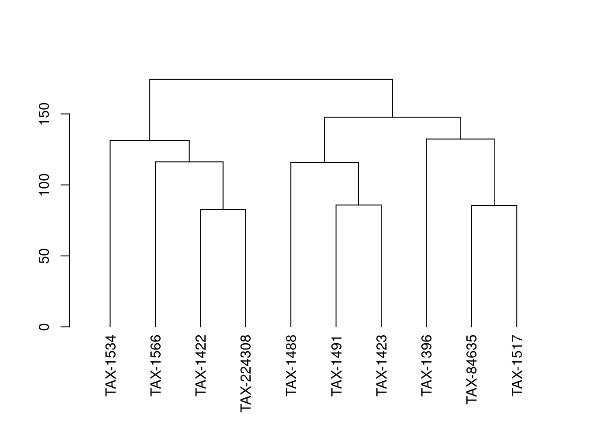

```r

## Maket it cladogram
dhc <- phylogram::as.cladogram(dhc)
```
Using the dendrogram (`dhc` argument) and input data.frame with the column name `query`, we can plot the dendrogram with pathway information. Note we need to provide the function named vector of nodes (corresponding to gene clusters when the gene as input). This time, wordclouds are to be plotted and additional arguments can by specified in `argList`.


```r
# Some filtering
load("../allFreqMetaCyc.rda")
deleter <- (allFreqMetaCyc |> dplyr::filter(freq>5000) |> dplyr::select(word))$word
# Named vector
sampled <- row.names(data)
names(sampled) <- sampled
# Query column (including node names) is specified as query
input$query <- input$species

library(ggfx) # use ggfx
micro <- plotEigengeneNetworksWithWords(NA, sampled,
                               useWC = TRUE, # Use wordcloud
                               useFunc = "manual", # Use manual function (as the input is custom data.frame)
                               useDf=input,dendPlot="ggplot",dhc=dhc,
                               useggfx="with_outer_glow",
                               ggfxParams=list(colour="white",expand=5),
                               argList=list(additionalRemove=deleter,
                                ngram=1), horizontalSpacer=0.1,
                               useWGCNA=FALSE, spacer=0.05,
                               horiz=FALSE, wcScale =5)
#> Ignoring corThresh, automatically determine the value
#> threshold = 0.1
#> Including columns pathwayID and commonName and species and taxonomicRange and spConverted to link with query
#> Ignoring corThresh, automatically determine the value
#> threshold = 0.101
#> Including columns pathwayID and commonName and species and taxonomicRange and spConverted to link with query
#> Ignoring corThresh, automatically determine the value
#> threshold = 0.301
#> Including columns pathwayID and commonName and species and taxonomicRange and spConverted to link with query
#> Ignoring corThresh, automatically determine the value
#> threshold = 0.305
#> Including columns pathwayID and commonName and species and taxonomicRange and spConverted to link with query
#> Ignoring corThresh, automatically determine the value
#> threshold = 0.3
#> Including columns pathwayID and commonName and species and taxonomicRange and spConverted to link with query
#> Ignoring corThresh, automatically determine the value
#> threshold = 0.303
#> Including columns pathwayID and commonName and species and taxonomicRange and spConverted to link with query
#> Ignoring corThresh, automatically determine the value
#> threshold = 0.9
#> Including columns pathwayID and commonName and species and taxonomicRange and spConverted to link with query
#> Ignoring corThresh, automatically determine the value
#> threshold = 0.702
#> Including columns pathwayID and commonName and species and taxonomicRange and spConverted to link with query
#> border is set to FALSE as useggfx is not NULL
scaled <- micro + scale_y_continuous(expand=c(0,6))

## Non-scaled and scaled (show the truncated tip labels)
micro
```

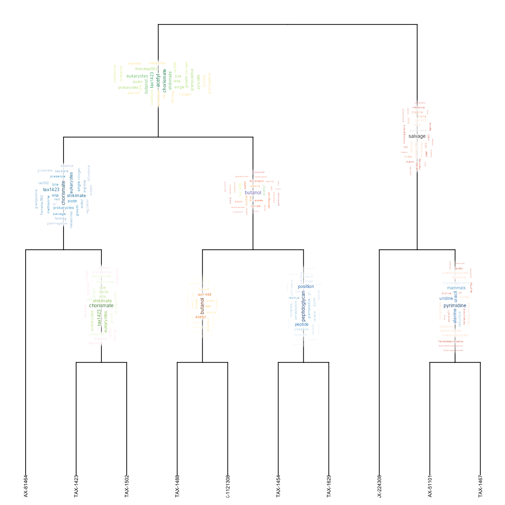

```r
scaled
```

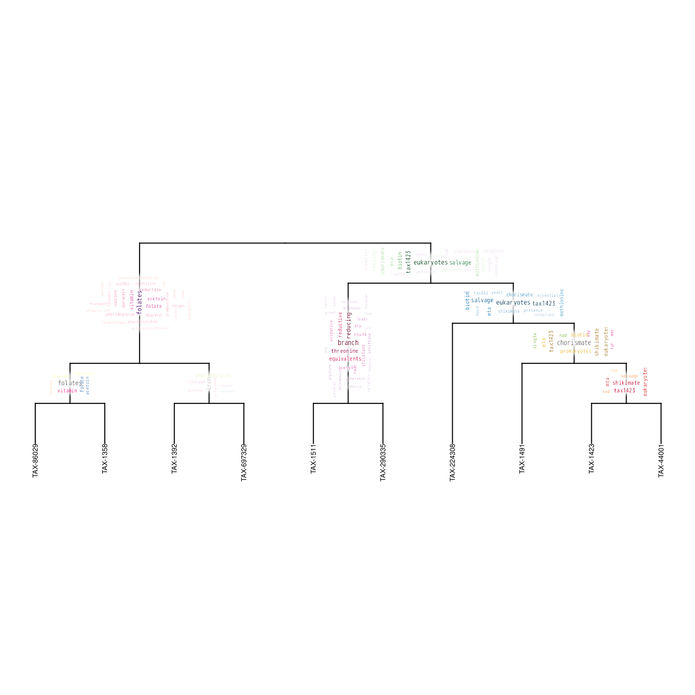


```r
sessionInfo()
#> R version 4.3.1 (2023-06-16 ucrt)
#> Platform: x86_64-w64-mingw32/x64 (64-bit)
#> Running under: Windows 11 x64 (build 22621)
#> 
#> Matrix products: default
#> 
#> 
#> locale:
#> [1] LC_COLLATE=Japanese_Japan.utf8 
#> [2] LC_CTYPE=Japanese_Japan.utf8   
#> [3] LC_MONETARY=Japanese_Japan.utf8
#> [4] LC_NUMERIC=C                   
#> [5] LC_TIME=Japanese_Japan.utf8    
#> 
#> time zone: Asia/Tokyo
#> tzcode source: internal
#> 
#> attached base packages:
#> [1] stats     graphics  grDevices utils     datasets 
#> [6] methods   base     
#> 
#> other attached packages:
#> [1] ggfx_1.0.1          RColorBrewer_1.1-3 
#> [3] ggraph_2.1.0.9000   biotextgraph_0.99.0
#> [5] ggplot2_3.4.3      
#> 
#> loaded via a namespace (and not attached):
#>   [1] ggdendro_0.1.23         jsonlite_1.8.7         
#>   [3] pvclust_2.2-0           magrittr_2.0.3         
#>   [5] magick_2.7.5            farver_2.1.1           
#>   [7] rmarkdown_2.25          ragg_1.2.5             
#>   [9] GlobalOptions_0.1.2     fs_1.6.3               
#>  [11] zlibbioc_1.47.0         vctrs_0.6.3            
#>  [13] memoise_2.0.1           cyjShiny_1.0.42        
#>  [15] RCurl_1.98-1.12         base64enc_0.1-3        
#>  [17] htmltools_0.5.6         curl_5.0.2             
#>  [19] cellranger_1.1.0        gridGraphics_0.5-1     
#>  [21] sass_0.4.7              GeneSummary_0.99.6     
#>  [23] bslib_0.5.1             htmlwidgets_1.6.2      
#>  [25] cachem_1.0.8            commonmark_1.9.0       
#>  [27] igraph_1.5.1            mime_0.12              
#>  [29] lifecycle_1.0.3         pkgconfig_2.0.3        
#>  [31] R6_2.5.1                fastmap_1.1.1          
#>  [33] GenomeInfoDbData_1.2.10 shiny_1.7.5            
#>  [35] digest_0.6.33           colorspace_2.1-0       
#>  [37] patchwork_1.1.3         AnnotationDbi_1.63.2   
#>  [39] S4Vectors_0.38.1        textshaping_0.3.6      
#>  [41] RSQLite_2.3.1           org.Hs.eg.db_3.17.0    
#>  [43] filelock_1.0.2          labeling_0.4.3         
#>  [45] fansi_1.0.4             httr_1.4.7             
#>  [47] polyclip_1.10-4         compiler_4.3.1         
#>  [49] bit64_4.0.5             withr_2.5.0            
#>  [51] viridis_0.6.4           DBI_1.1.3              
#>  [53] dendextend_1.17.1       highr_0.10             
#>  [55] ggforce_0.4.1           MASS_7.3-60            
#>  [57] ISOcodes_2022.09.29     rjson_0.2.21           
#>  [59] tools_4.3.1             ape_5.7-1              
#>  [61] stopwords_2.3           rentrez_1.2.3          
#>  [63] httpuv_1.6.11           glue_1.6.2             
#>  [65] nlme_3.1-163            promises_1.2.1         
#>  [67] gridtext_0.1.5          grid_4.3.1             
#>  [69] shadowtext_0.1.2        generics_0.1.3         
#>  [71] gtable_0.3.4            tidyr_1.3.0            
#>  [73] bugsigdbr_1.8.1         data.table_1.14.8      
#>  [75] tidygraph_1.2.3         xml2_1.3.5             
#>  [77] utf8_1.2.3              XVector_0.41.1         
#>  [79] BiocGenerics_0.47.0     stringr_1.5.0          
#>  [81] markdown_1.8            ggrepel_0.9.3          
#>  [83] pillar_1.9.0            yulab.utils_0.1.0      
#>  [85] later_1.3.1             dplyr_1.1.2            
#>  [87] tweenr_2.0.2            BiocFileCache_2.9.1    
#>  [89] lattice_0.21-8          bit_4.0.5              
#>  [91] tidyselect_1.2.0        phylogram_2.1.0        
#>  [93] tm_0.7-11               Biostrings_2.69.2      
#>  [95] downlit_0.4.3           knitr_1.44             
#>  [97] gridExtra_2.3           NLP_0.2-1              
#>  [99] bookdown_0.35           IRanges_2.35.2         
#> [101] stats4_4.3.1            xfun_0.40              
#> [103] graphlayouts_1.0.0      Biobase_2.61.0         
#> [105] stringi_1.7.12          yaml_2.3.7             
#> [107] evaluate_0.21           ggwordcloud_0.6.0      
#> [109] wordcloud_2.6           tibble_3.2.1           
#> [111] graph_1.79.1            ggplotify_0.1.2        
#> [113] cli_3.6.1               systemfonts_1.0.4      
#> [115] xtable_1.8-4            munsell_0.5.0          
#> [117] jquerylib_0.1.4         Rcpp_1.0.11            
#> [119] GenomeInfoDb_1.37.4     readxl_1.4.3           
#> [121] dbplyr_2.3.3            png_0.1-8              
#> [123] XML_3.99-0.14           parallel_4.3.1         
#> [125] ellipsis_0.3.2          blob_1.2.4             
#> [127] bitops_1.0-7            viridisLite_0.4.2      
#> [129] slam_0.1-50             scales_1.2.1           
#> [131] purrr_1.0.2             crayon_1.5.2           
#> [133] GetoptLong_1.0.5        rlang_1.1.1            
#> [135] cowplot_1.1.1           KEGGREST_1.41.0
```
