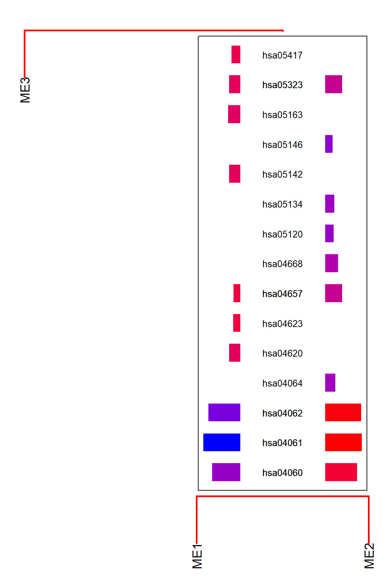
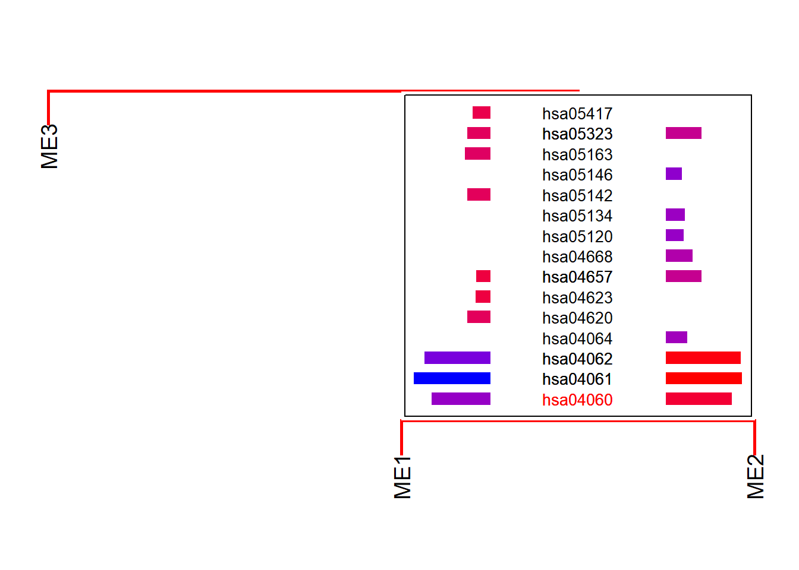
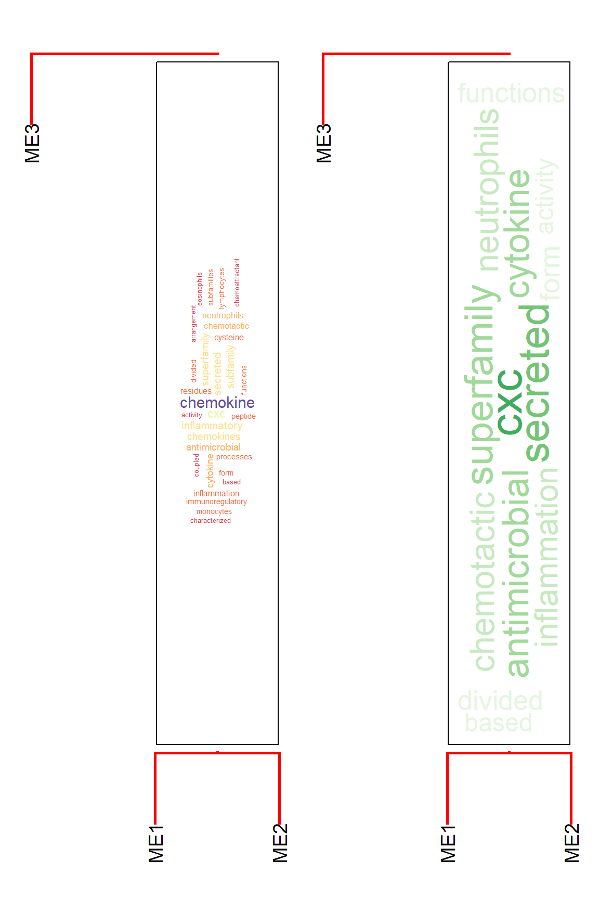
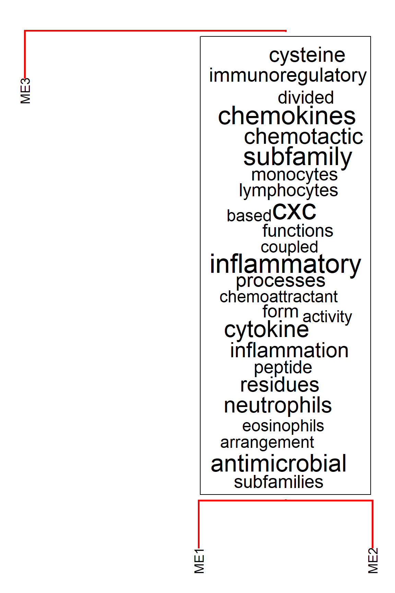
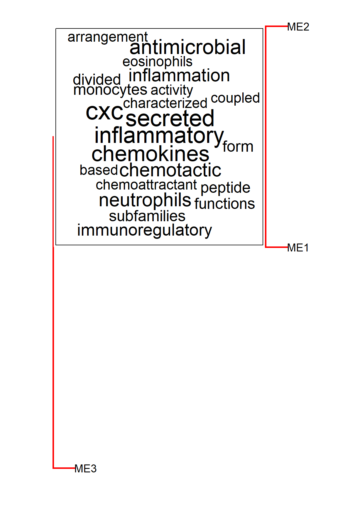
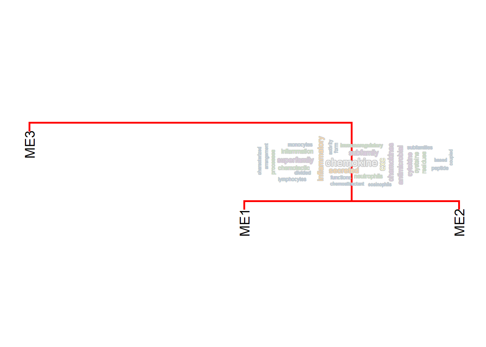
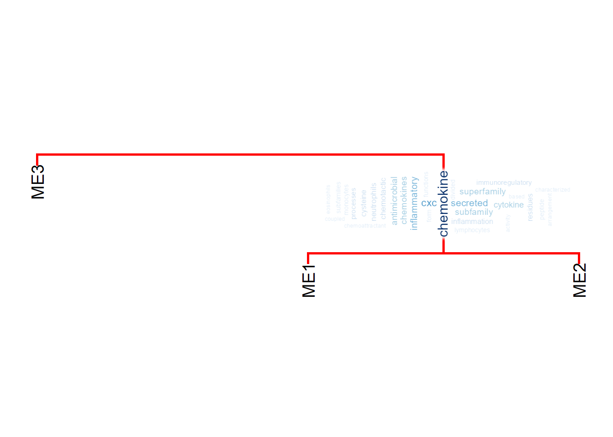
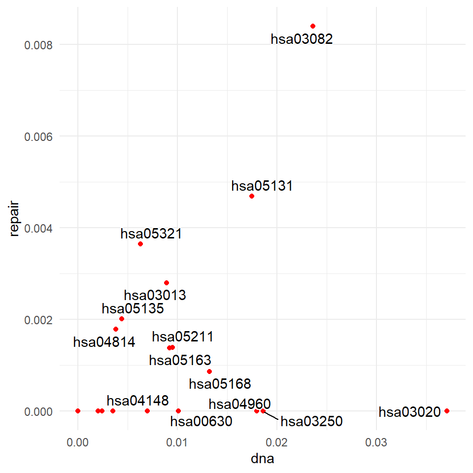
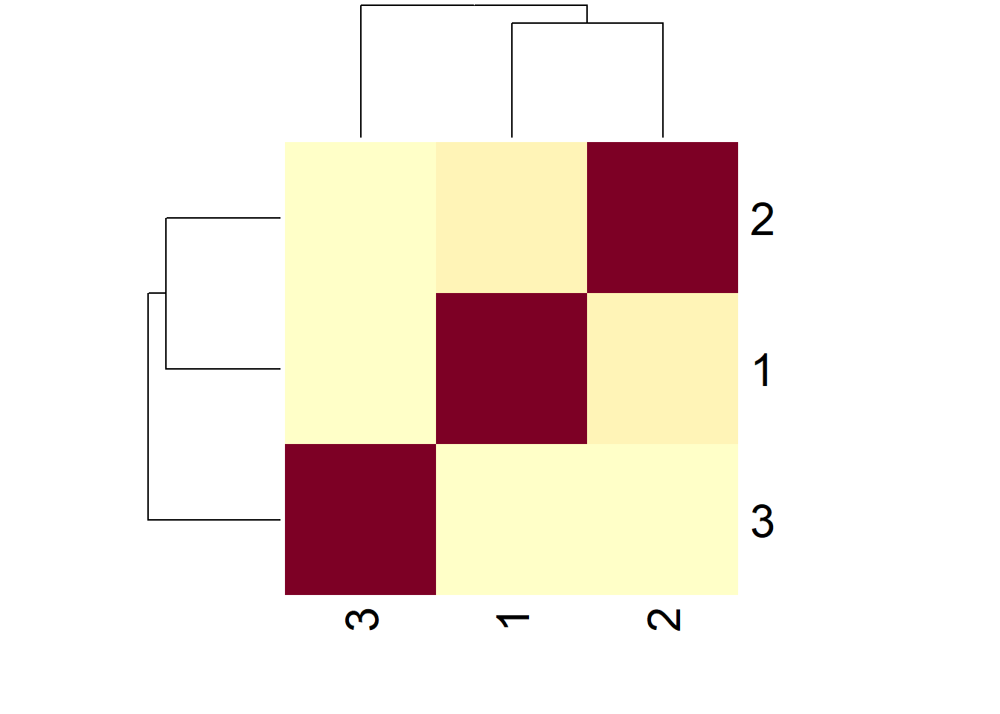

# Interactive inspection of gene cluster network annotated by words


```r
library(biotextgraph)
library(ggplot2)
library(ggraph)
library(org.Hs.eg.db)
library(clusterProfiler)
library(RColorBrewer)
```

In this example, a Bayesian network showing the module eigengenes relationship are inferred using `boot.strength` function in `bnlearn` from the weighted gene correlation network analysis (WGCNA) results. The modules are annotated by word clouds produced by `refseq()`, and can be exported to the format of `Cytoscape.js` or `vis.js`. In this way, module relationship can be interactively inspected with the functional implications. The other functions like `pubmed()` can be used, however, you shold specify API keys for the function makes multiple queries.


```r
## In this example, we simulate WGCNA results.
## you can just use results from WGCNA.
## Assuming WGCNA results are stored in `mod`
mod <- biotextgraph::returnExample()
MEs <- mod$MEs
modColors <- mod$colors
ensg <- names(modColors)

# library(bnlearn)
library(igraph)

## Replace like boot.strength(mod$MEs, R=500, algorithm = "hc")
# dag <- model2network("[ME1][ME2|ME1]") # If using bnlearn
g <- graph_from_literal( ME1-+ME2, ME1-+ME3 )

## Convert to igraph
# g <- as.igraph(dag)

## Assign edge attributes
## Skip, if you perform boot.strength, the edge attributes can be added from the result
# el <- data.frame(as_edgelist(g))
# colnames(el) <- c("from","to")
# el <- left_join(el, bs)
# E(g)$strength <- el$strength
# E(g)$direction <- el$direction

## Node attributes
V(g)$stripName <- gsub("ME","",V(g)$name)
sizes <- table(modColors)
V(g)$size <- as.numeric(sizes[V(g)$stripName])

## Directory to save images and a script
rootDir <- "./"
netDir <- "visCyjs"
imageDir <- "images"

dir.create(paste0(rootDir, "/", netDir))
dir.create(paste0(rootDir, netDir, "/", imageDir))

images <- c()
plotType <- "bar"
numLim <- 200 # limit for gene number
for (i in V(g)$name){
    print(i)
    i <- as.numeric(gsub("ME","",i)) # strip ME

    queries <- ensg[modColors==i]
    if (length(queries)>numLim) {
        warning("Sampling random genes")
        queries <- queries[sample(1:length(queries), numLim)] ## Temporary restrict to randomly chosen genes, should be replaced to like kME values
    }
    
    ## Convert to ENTREZ
    entre <- AnnotationDbi::select(org.Hs.eg.db, keytype="ENSEMBL",
        keys = queries, columns = "ENTREZID")$ENTREZID
    
    if (plotType=="bar"){
        plt <- makeBar(entre, keyType="ENTREZID") # get barplot
    } else { ## If wordcloud
        # A <- refseq(entre, keyType="ENTREZID",
        #                    argList=list(rot.per=0.4,
        #                                 colors=brewer.pal(10,
        #                                                   sample(row.names(RColorBrewer::brewer.pal.info), 1)),
        #                                 random.order=FALSE),
        #                    numWords=80)
        # # plt <- plotWC(A)
        # # 
        # # ## This time use ggwordcloud()
        # plt <- ggwordcloud::ggwordcloud(getSlot(A, "freqDf")$word, getSlot(A, "freqDf")$freq,
        #                      shape="circle", min.freq = 1,max.words = Inf,
        #                      rot.per = 0.5, random.order = FALSE,
        #                      colors = brewer.pal(10,
        #                                          sample(row.names(RColorBrewer::brewer.pal.info), 1)))+
        #          scale_size_area(max_size = 40)
    }
    ## Save images
    ggsave(paste0(rootDir, netDir, "/", imageDir, "/", i ,".png"),
           plt, dpi=300, width=10, height=10)
    ## Store image dir
    images <- c(images, paste0(imageDir, "/", i ,".png"))
}
#> [1] "ME1"
#> Input genes: 12
#> Filter based on GeneSummary
#> Filtered 77 words (frequency and/or tfidf)
#> [1] "ME2"
#> Input genes: 13
#> Filter based on GeneSummary
#> Filtered 77 words (frequency and/or tfidf)
#> [1] "ME3"
#> Input genes: 7
#> Filter based on GeneSummary
#> Filtered 77 words (frequency and/or tfidf)
V(g)$image <- images

## Node shape
if (plotType=="bar"){
    V(g)$shape <- rep("rectangle", length(V(g))) 
} else {
    V(g)$shape <- rep("circle", length(V(g)))
}

## Scale the node size
sizeMin <- 50
sizeMax <- 200
rawMin <- min(V(g)$size)
rawMax <- max(V(g)$size)
scf <- (sizeMax-sizeMin)/(rawMax-rawMin)
V(g)$size <- scf * V(g)$size + sizeMin - scf * rawMin

## Export
exportCyjs(g, rootDir, netDir)
# or, exportVisjs(g, rootDir, netDir)
```

Use like `http-server` in the directory containing a exported JavaScript, and interactively inspect the module relationship with word information. The example visualization is shown below (not by the code above, but Bayesian network of module eigenes inferred from RNA-seq dataset ofbladder cancer).

{width=50%}


Interactive inspection is possible using GitHub pages or the other hosting services like below.


```r
knitr::include_url("https://noriakis.github.io/cyjs_test/wordcloud")
```

<iframe src="https://noriakis.github.io/cyjs_test/wordcloud" width="100%" height="400px" data-external="1" style="border: none;"></iframe>

If you specify node attribute named `group`, and set `bubble=TRUE` in `exportCyjs` function, bubble sets will be plotted using [`cytoscape.js-bubblesets`](https://github.com/upsetjs/cytoscape.js-bubblesets), useful for inspecting the similarity betwteen the gene cluster, like the output of `pvclust` and `pvpick` on module eigengenes.


```r
V(g)$group <- c(1, 1, NA)
# exportCyjs(g, rootDir, netDir, bubble=TRUE)

## Example, not by the code above.
knitr::include_url("https://noriakis.github.io/cyjs_test/wordcloud_bubble")
```

<iframe src="https://noriakis.github.io/cyjs_test/wordcloud_bubble" width="100%" height="400px" data-external="1" style="border: none;"></iframe>


`vis.js` can be used, by exporting function `exportVisjs`.
In this example, the barplot of words are shown in the nodes.


```r
knitr::include_url("https://noriakis.github.io/cyjs_test/visjs")
```

<iframe src="https://noriakis.github.io/cyjs_test/visjs" width="100%" height="400px" data-external="1" style="border: none;"></iframe>

## Wrapper function for wordcloud network

The network like the previous example can be conveniently exported using `exportWCNetwork` function, which wrapped the previous code. The input is `igraph` and named gene list.


```r
mod <- biotextgraph::returnExample()
#> 'select()' returned 1:many mapping between keys and
#> columns
#> 'select()' returned 1:1 mapping between keys and
#> columns
#> 'select()' returned 1:1 mapping between keys and
#> columns
g <- graph_from_literal( ME1-+ME2, ME1-+ME3 )
geneList <- list("ME1"=mod$colors[mod$colors==1] |> names(),
     "ME2"=mod$colors[mod$colors==2] |> names(),
     "ME3"=mod$colors[mod$colors==3] |> names())
g
#> IGRAPH c69958d DN-- 3 2 -- 
#> + attr: name (v/c)
#> + edges from c69958d (vertex names):
#> [1] ME1->ME2 ME1->ME3
geneList
#> $ME1
#>  [1] "ENSG00000108702" "ENSG00000108691" "ENSG00000277632"
#>  [4] "ENSG00000278567" "ENSG00000274221" "ENSG00000275302"
#>  [7] "ENSG00000277943" "ENSG00000275824" "ENSG00000271503"
#> [10] "ENSG00000274233" "ENSG00000108688" "ENSG00000108700"
#> 
#> $ME2
#>  [1] "ENSG00000163739" "ENSG00000081041" "ENSG00000163734"
#>  [4] "ENSG00000163735" "ENSG00000124875" "ENSG00000169429"
#>  [7] "ENSG00000138755" "ENSG00000169245" "ENSG00000169248"
#> [10] "ENSG00000107562" "ENSG00000156234" "ENSG00000145824"
#> [13] "ENSG00000161921"
#> 
#> $ME3
#> [1] "ENSG00000012061" "ENSG00000104884" "ENSG00000163161"
#> [4] "ENSG00000175595" "ENSG00000134899" "ENSG00000225830"
#> [7] "ENSG00000049167"
exportWCNetwork(g,geneList,keyType="ENSEMBL", wcScale=50)
#> Warning in brewer.pal(10, sample(row.names(RColorBrewer::brewer.pal.info), : n too large, allowed maximum for palette BuPu is 9
#> Returning the palette you asked for with that many colors
#> Warning in brewer.pal(10, sample(row.names(RColorBrewer::brewer.pal.info), : n too large, allowed maximum for palette PuBu is 9
#> Returning the palette you asked for with that many colors
#> Warning in dir.create(paste0(dir)): 'network'
#> はすでに存在します
#> Warning in dir.create(paste0(dir, "/images")):
#> 'network/images' はすでに存在します
#> Input genes: 12
#> 'select()' returned 1:1 mapping between keys and
#> columns
#>   Converted input genes: 7
#> Filter based on GeneSummary
#> Filtered 77 words (frequency and/or tfidf)
#> Scale for size is already present.
#> Adding another scale for size, which will replace the
#> existing scale.
#> Warning in wordcloud_boxes(data_points =
#> points_valid_first, boxes = boxes, : Some words could not
#> fit on page. They have been removed.
#> Input genes: 13
#> 'select()' returned 1:1 mapping between keys and
#> columns
#>   Converted input genes: 13
#> Filter based on GeneSummary
#> Filtered 77 words (frequency and/or tfidf)
#> Scale for size is already present.
#> Adding another scale for size, which will replace the
#> existing scale.
#> Warning in wordcloud_boxes(data_points =
#> points_valid_first, boxes = boxes, : Some words could not
#> fit on page. They have been removed.
#> Input genes: 7
#> 'select()' returned 1:1 mapping between keys and
#> columns
#>   Converted input genes: 7
#> Filter based on GeneSummary
#> Filtered 77 words (frequency and/or tfidf)
#> Scale for size is already present.
#> Adding another scale for size, which will replace the
#> existing scale.
#> Warning in wordcloud_boxes(data_points =
#> points_valid_first, boxes = boxes, : One word could not fit
#> on page. It has been removed.
```

# Annotating gene cluster dendrogram

## Annotating by pyramid plots

The relationship between gene clusters are often investigated in clustering analysis like WGCNA. As workflows involving gene clustering analysis typically plot dendrogram and heatmap of module eigengenes using `plotEigengeneNetworks`, it is useful to combine with biotextgraph, which plot additional word information on a dendrogram with one line.


```r
# WGCNA::plotEigengeneNetworks(mod$MEs, mod$colors, plotHeatmaps = FALSE)
plotEigengeneNetworksWithWords(MEs, modColors)
#> Bootstrap (r = 0.5)... Done.
#> Bootstrap (r = 0.6)... Done.
#> Bootstrap (r = 0.7)... Done.
#> Bootstrap (r = 0.8)... Done.
#> Bootstrap (r = 0.9)... Done.
#> Bootstrap (r = 1.0)... Done.
#> Bootstrap (r = 1.1)... Done.
#> Bootstrap (r = 1.2)... Done.
#> Bootstrap (r = 1.3)... Done.
#> Bootstrap (r = 1.4)... Done.
#> Input genes: 12
#>   Converted input genes: 7
#> Filter based on GeneSummary
#> Filtered 77 words (frequency and/or tfidf)
#> Input genes: 13
#>   Converted input genes: 13
#> Filter based on GeneSummary
#> Filtered 77 words (frequency and/or tfidf)
```


This calculates a dendrogram using `pvclust` internally in default. If you would like to plot segments involving only the specified gene cluster, use `candidateNodes` to specify the nodes.


```r
plotEigengeneNetworksWithWords(MEs, modColors, candidateNodes=c("ME2"))
#> Bootstrap (r = 0.5)... Done.
#> Bootstrap (r = 0.6)... Done.
#> Bootstrap (r = 0.7)... Done.
#> Bootstrap (r = 0.8)... Done.
#> Bootstrap (r = 0.9)... Done.
#> Bootstrap (r = 1.0)... Done.
#> Bootstrap (r = 1.1)... Done.
#> Bootstrap (r = 1.2)... Done.
#> Bootstrap (r = 1.3)... Done.
#> Bootstrap (r = 1.4)... Done.
#> Input genes: 12
#>   Converted input genes: 7
#> Filter based on GeneSummary
#> Filtered 77 words (frequency and/or tfidf)
#> Input genes: 13
#>   Converted input genes: 13
#> Filter based on GeneSummary
#> Filtered 77 words (frequency and/or tfidf)
```


By default, the function calculates the frequency of common words across branches and plot the words that the differences between branches are large. By disabling `takeIntersect`, the function plots the frequent words for each branch.


```r
plotEigengeneNetworksWithWords(MEs,
    modColors, takeIntersect=FALSE, candidateNodes=c("ME2"))
#> Bootstrap (r = 0.5)... Done.
#> Bootstrap (r = 0.6)... Done.
#> Bootstrap (r = 0.7)... Done.
#> Bootstrap (r = 0.8)... Done.
#> Bootstrap (r = 0.9)... Done.
#> Bootstrap (r = 1.0)... Done.
#> Bootstrap (r = 1.1)... Done.
#> Bootstrap (r = 1.2)... Done.
#> Bootstrap (r = 1.3)... Done.
#> Bootstrap (r = 1.4)... Done.
#> Input genes: 12
#>   Converted input genes: 7
#> Filter based on GeneSummary
#> Filtered 77 words (frequency and/or tfidf)
#> Input genes: 13
#>   Converted input genes: 13
#> Filter based on GeneSummary
#> Filtered 77 words (frequency and/or tfidf)
```


For examining enriched pathway names in the dendrograms, specify `argList` to `refseq`, like `list(enrich="kegg")`.


```r
plotEigengeneNetworksWithWords(MEs, modColors, type="words", argList=list(enrich="kegg"))
#> Bootstrap (r = 0.5)... Done.
#> Bootstrap (r = 0.6)... Done.
#> Bootstrap (r = 0.7)... Done.
#> Bootstrap (r = 0.8)... Done.
#> Bootstrap (r = 0.9)... Done.
#> Bootstrap (r = 1.0)... Done.
#> Bootstrap (r = 1.1)... Done.
#> Bootstrap (r = 1.2)... Done.
#> Bootstrap (r = 1.3)... Done.
#> Bootstrap (r = 1.4)... Done.
#> Input genes: 12
#>   Converted input genes: 7
#> Performing enrichment analysis
#> Filter based on GeneSummary
#> Filtered 77 words (frequency and/or tfidf)
#> Input genes: 13
#>   Converted input genes: 13
#> Performing enrichment analysis
#> Filter based on GeneSummary
#> Filtered 77 words (frequency and/or tfidf)
```


Other than textual information, we can simply annotate the dendrogram using enrichment analysis.
Useful for inspecting how the branches of dendrogram contains pathway information. 


```r
plotEigengeneNetworksWithWords(MEs, modColors, type="enrich")
#> Bootstrap (r = 0.5)... Done.
#> Bootstrap (r = 0.6)... Done.
#> Bootstrap (r = 0.7)... Done.
#> Bootstrap (r = 0.8)... Done.
#> Bootstrap (r = 0.9)... Done.
#> Bootstrap (r = 1.0)... Done.
#> Bootstrap (r = 1.1)... Done.
#> Bootstrap (r = 1.2)... Done.
#> Bootstrap (r = 1.3)... Done.
#> Bootstrap (r = 1.4)... Done.
```



The column names for clusterProfiler results can be specified to `showType`.


```r
plotEigengeneNetworksWithWords(MEs, modColors, type="enrich", showType="Description")
#> Bootstrap (r = 0.5)... Done.
#> Bootstrap (r = 0.6)... Done.
#> Bootstrap (r = 0.7)... Done.
#> Bootstrap (r = 0.8)... Done.
#> Bootstrap (r = 0.9)... Done.
#> Bootstrap (r = 1.0)... Done.
#> Bootstrap (r = 1.1)... Done.
#> Bootstrap (r = 1.2)... Done.
#> Bootstrap (r = 1.3)... Done.
#> Bootstrap (r = 1.4)... Done.
```


Text sizing and wrapping can be controlled by `textSize` and `wrap`.


```r
plotEigengeneNetworksWithWords(MEs, modColors, type="enrich", showType="Description",
    textSize=1.5, wrap=30)
#> Bootstrap (r = 0.5)... Done.
#> Bootstrap (r = 0.6)... Done.
#> Bootstrap (r = 0.7)... Done.
#> Bootstrap (r = 0.8)... Done.
#> Bootstrap (r = 0.9)... Done.
#> Bootstrap (r = 1.0)... Done.
#> Bootstrap (r = 1.1)... Done.
#> Bootstrap (r = 1.2)... Done.
#> Bootstrap (r = 1.3)... Done.
#> Bootstrap (r = 1.4)... Done.
```


If you have a specifically interested pathway, use `highlight` to highlight the names in the dendrogram.


```r
plotEigengeneNetworksWithWords(mod$MEs, mod$colors,
                               type="enrich", highlight=c("hsa04060"))+
  scale_y_continuous(expand=c(0,0.5))
#> Bootstrap (r = 0.5)... Done.
#> Bootstrap (r = 0.6)... Done.
#> Bootstrap (r = 0.7)... Done.
#> Bootstrap (r = 0.8)... Done.
#> Bootstrap (r = 0.9)... Done.
#> Bootstrap (r = 1.0)... Done.
#> Bootstrap (r = 1.1)... Done.
#> Bootstrap (r = 1.2)... Done.
#> Bootstrap (r = 1.3)... Done.
#> Bootstrap (r = 1.4)... Done.
#> 'select()' returned 1:1 mapping between keys and
#> columns
#> 'select()' returned 1:1 mapping between keys and
#> columns
```




## Annotating by word clouds

To plot the word cloud instead of pyramid plots, use `useWC` option. For scaling the word size, use `wcScale` option.


```r
scale4 <- plotEigengeneNetworksWithWords(MEs, modColors, useWC=TRUE, candidateNodes=c("ME2"), wcScale=4)
#> Bootstrap (r = 0.5)... Done.
#> Bootstrap (r = 0.6)... Done.
#> Bootstrap (r = 0.7)... Done.
#> Bootstrap (r = 0.8)... Done.
#> Bootstrap (r = 0.9)... Done.
#> Bootstrap (r = 1.0)... Done.
#> Bootstrap (r = 1.1)... Done.
#> Bootstrap (r = 1.2)... Done.
#> Bootstrap (r = 1.3)... Done.
#> Bootstrap (r = 1.4)... Done.
#> Input genes: 25
#>   Converted input genes: 20
#> Filter based on GeneSummary
#> Filtered 77 words (frequency and/or tfidf)
#> Ignoring corThresh, automatically determine the value
#> threshold = 0.304
scale15 <- plotEigengeneNetworksWithWords(MEs, modColors, useWC=TRUE, candidateNodes=c("ME2"), wcScale=15)
#> Bootstrap (r = 0.5)... Done.
#> Bootstrap (r = 0.6)... Done.
#> Bootstrap (r = 0.7)... Done.
#> Bootstrap (r = 0.8)... Done.
#> Bootstrap (r = 0.9)... Done.
#> Bootstrap (r = 1.0)... Done.
#> Bootstrap (r = 1.1)... Done.
#> Bootstrap (r = 1.2)... Done.
#> Bootstrap (r = 1.3)... Done.
#> Bootstrap (r = 1.4)... Done.
#> Input genes: 25
#>   Converted input genes: 20
#> Filter based on GeneSummary
#> Filtered 77 words (frequency and/or tfidf)
#> Ignoring corThresh, automatically determine the value
#> threshold = 0.304
scale4 + scale15
```



This uses `ggwordcloud` and a list specified by `wcArgs` is passed to the function.


```r
plotEigengeneNetworksWithWords(MEs, modColors, useWC=TRUE, candidateNodes=c("ME2"), wcScale=15, wcArgs=list(rot.per=0))
#> Bootstrap (r = 0.5)... Done.
#> Bootstrap (r = 0.6)... Done.
#> Bootstrap (r = 0.7)... Done.
#> Bootstrap (r = 0.8)... Done.
#> Bootstrap (r = 0.9)... Done.
#> Bootstrap (r = 1.0)... Done.
#> Bootstrap (r = 1.1)... Done.
#> Bootstrap (r = 1.2)... Done.
#> Bootstrap (r = 1.3)... Done.
#> Bootstrap (r = 1.4)... Done.
#> Input genes: 25
#>   Converted input genes: 20
#> Filter based on GeneSummary
#> Filtered 77 words (frequency and/or tfidf)
#> Ignoring corThresh, automatically determine the value
#> threshold = 0.304
```




The horizontal plot can be specified by `horiz=TRUE`.


```r
plotEigengeneNetworksWithWords(MEs,
                               modColors,
                               useWC=TRUE,
                               candidateNodes=c("ME2"),
                               wcScale=15,
                               wcArgs=list(rot.per=0),
                               horiz=TRUE)
#> Bootstrap (r = 0.5)... Done.
#> Bootstrap (r = 0.6)... Done.
#> Bootstrap (r = 0.7)... Done.
#> Bootstrap (r = 0.8)... Done.
#> Bootstrap (r = 0.9)... Done.
#> Bootstrap (r = 1.0)... Done.
#> Bootstrap (r = 1.1)... Done.
#> Bootstrap (r = 1.2)... Done.
#> Bootstrap (r = 1.3)... Done.
#> Bootstrap (r = 1.4)... Done.
#> Input genes: 25
#>   Converted input genes: 20
#> Filter based on GeneSummary
#> Filtered 77 words (frequency and/or tfidf)
#> Ignoring corThresh, automatically determine the value
#> threshold = 0.304
```




`spacer` can control the gaps above and below the grob on the dendrogram (y-axis).
`horizontalSpacer` can be used too for x-axis.


```r
plotEigengeneNetworksWithWords(mod$MEs, mod$colors,
                               type="enrich", highlight=c("hsa04060"), spacer=0.2)+
    scale_y_continuous(expand=c(0,0.5))
#> Bootstrap (r = 0.5)... Done.
#> Bootstrap (r = 0.6)... Done.
#> Bootstrap (r = 0.7)... Done.
#> Bootstrap (r = 0.8)... Done.
#> Bootstrap (r = 0.9)... Done.
#> Bootstrap (r = 1.0)... Done.
#> Bootstrap (r = 1.1)... Done.
#> Bootstrap (r = 1.2)... Done.
#> Bootstrap (r = 1.3)... Done.
#> Bootstrap (r = 1.4)... Done.
#> 'select()' returned 1:1 mapping between keys and
#> columns
#> 'select()' returned 1:1 mapping between keys and
#> columns
```


```r

plotEigengeneNetworksWithWords(mod$MEs, mod$colors, useWC=TRUE,
                               spacer=0.2, horizontalSpacer=0.1)+
    scale_y_continuous(expand=c(0,0.5))
#> Bootstrap (r = 0.5)... Done.
#> Bootstrap (r = 0.6)... Done.
#> Bootstrap (r = 0.7)... Done.
#> Bootstrap (r = 0.8)... Done.
#> Bootstrap (r = 0.9)... Done.
#> Bootstrap (r = 1.0)... Done.
#> Bootstrap (r = 1.1)... Done.
#> Bootstrap (r = 1.2)... Done.
#> Bootstrap (r = 1.3)... Done.
#> Bootstrap (r = 1.4)... Done.
#> Input genes: 25
#> 'select()' returned 1:1 mapping between keys and
#> columns
#>   Converted input genes: 20
#> Filter based on GeneSummary
#> Filtered 77 words (frequency and/or tfidf)
#> Ignoring corThresh, automatically determine the value
#> threshold = 0.304
#> Scale for size is already present.
#> Adding another scale for size, which will replace the
#> existing scale.
```


By specifying `returnGlobOnly`, the grobs with the position in the dendrogram can be returned.


```r
gro <- plotEigengeneNetworksWithWords(mod$MEs, mod$colors, candidateNodes=c("ME2"),
                               returnGlobOnly=TRUE)
#> Bootstrap (r = 0.5)... Done.
#> Bootstrap (r = 0.6)... Done.
#> Bootstrap (r = 0.7)... Done.
#> Bootstrap (r = 0.8)... Done.
#> Bootstrap (r = 0.9)... Done.
#> Bootstrap (r = 1.0)... Done.
#> Bootstrap (r = 1.1)... Done.
#> Bootstrap (r = 1.2)... Done.
#> Bootstrap (r = 1.3)... Done.
#> Bootstrap (r = 1.4)... Done.
#> Input genes: 12
#> 'select()' returned 1:1 mapping between keys and
#> columns
#>   Converted input genes: 7
#> Filter based on GeneSummary
#> Filtered 77 words (frequency and/or tfidf)
#> Input genes: 13
#> 'select()' returned 1:1 mapping between keys and
#> columns
#>   Converted input genes: 13
#> Filter based on GeneSummary
#> Filtered 77 words (frequency and/or tfidf)
ggplotify::as.ggplot(gro[[1]]$plot)
```


## Decorating wordclouds

If needed, wordclouds can be filtered by `ggfx` or using `shadowtext`. In this case, border is set to `FALSE` and the background will be transparent for resulting grobs. If `shadowtext` is needed, specify `bg.colour` argument. If `ggfx` is needed, specify the filter function in `useggfx` and parameters in `ggfxParams`.


```r
library(ggfx)
plotEigengeneNetworksWithWords(MEs, modColors, useWC=TRUE, candidateNodes=c("ME2"), wcScale=4,
    bg.colour="grey80")+ scale_y_continuous(expand=c(0,3))
#> Bootstrap (r = 0.5)... Done.
#> Bootstrap (r = 0.6)... Done.
#> Bootstrap (r = 0.7)... Done.
#> Bootstrap (r = 0.8)... Done.
#> Bootstrap (r = 0.9)... Done.
#> Bootstrap (r = 1.0)... Done.
#> Bootstrap (r = 1.1)... Done.
#> Bootstrap (r = 1.2)... Done.
#> Bootstrap (r = 1.3)... Done.
#> Bootstrap (r = 1.4)... Done.
#> Input genes: 25
#> 'select()' returned 1:1 mapping between keys and
#> columns
#>   Converted input genes: 20
#> Filter based on GeneSummary
#> Filtered 77 words (frequency and/or tfidf)
#> Ignoring corThresh, automatically determine the value
#> threshold = 0.304
#> Scale for size is already present.
#> Adding another scale for size, which will replace the
#> existing scale.
#> border is set to FALSE as bg.colour is not NULL
```



```r
plotEigengeneNetworksWithWords(MEs, modColors, useWC=TRUE, candidateNodes=c("ME2"), wcScale=4,
    useggfx="with_outer_glow", ggfxParams=list(colour="white",expand=5))+ scale_y_continuous(expand=c(0,3))
#> Bootstrap (r = 0.5)... Done.
#> Bootstrap (r = 0.6)... Done.
#> Bootstrap (r = 0.7)... Done.
#> Bootstrap (r = 0.8)... Done.
#> Bootstrap (r = 0.9)... Done.
#> Bootstrap (r = 1.0)... Done.
#> Bootstrap (r = 1.1)... Done.
#> Bootstrap (r = 1.2)... Done.
#> Bootstrap (r = 1.3)... Done.
#> Bootstrap (r = 1.4)... Done.
#> Input genes: 25
#> 'select()' returned 1:1 mapping between keys and
#> columns
#>   Converted input genes: 20
#> Filter based on GeneSummary
#> Filtered 77 words (frequency and/or tfidf)
#> Ignoring corThresh, automatically determine the value
#> threshold = 0.304
#> Warning in brewer.pal(10, sample(row.names(RColorBrewer::brewer.pal.info), : n too large, allowed maximum for palette PuBu is 9
#> Returning the palette you asked for with that many colors
#> Scale for size is already present.
#> Adding another scale for size, which will replace the
#> existing scale.
#> border is set to FALSE as useggfx is not NULL
#> Warning in wordcloud_boxes(data_points =
#> points_valid_first, boxes = boxes, : One word could not fit
#> on page. It has been removed.
```



The below example shows using the other dendrogram like those produced by WGCNA combining the parameters.


```r
library(ggfx)
load("./blockwiseModule.rda")
MEs <- bwmod$MEs
modColors <- bwmod$colors
plotEigengeneNetworksWithWords(MEs,useWC=TRUE,
                              modColors, candidateNodes=c("ME11","ME3","ME7","ME6","ME12"),
                              useggfx="with_outer_glow", useRandomColor=TRUE,
                              ggfxParams=list(colour="white",expand=3),
                              wcScale=6, wcArgs=list(shape="square",
                              min.freq=1, max.words=Inf, rot.per=0.5,random.order=FALSE))
#> Bootstrap (r = 0.49)... Done.
#> Bootstrap (r = 0.6)... Done.
#> Bootstrap (r = 0.69)... Done.
#> Bootstrap (r = 0.8)... Done.
#> Bootstrap (r = 0.89)... Done.
#> Bootstrap (r = 1.0)... Done.
#> Bootstrap (r = 1.09)... Done.
#> Bootstrap (r = 1.2)... Done.
#> Bootstrap (r = 1.29)... Done.
#> Bootstrap (r = 1.4)... Done.
#> Input genes: 5822
#>   Converted input genes: 4803
#> Filter based on GeneSummary
#> Filtered 77 words (frequency and/or tfidf)
#> Ignoring corThresh, automatically determine the value
#> threshold = 0
#> Input genes: 15534
#>   Converted input genes: 12199
#> Filter based on GeneSummary
#> Filtered 77 words (frequency and/or tfidf)
#> Ignoring corThresh, automatically determine the value
#> threshold = 0
#> Input genes: 1926
#>   Converted input genes: 1554
#> Filter based on GeneSummary
#> Filtered 77 words (frequency and/or tfidf)
#> Ignoring corThresh, automatically determine the value
#> threshold = 0
#> Input genes: 860
#>   Converted input genes: 671
#> Filter based on GeneSummary
#> Filtered 77 words (frequency and/or tfidf)
#> Ignoring corThresh, automatically determine the value
#> threshold = 0.1
#> Input genes: 275
#>   Converted input genes: 260
#> Filter based on GeneSummary
#> Filtered 77 words (frequency and/or tfidf)
#> Ignoring corThresh, automatically determine the value
#> threshold = 0.001
#> border is set to FALSE as useggfx is not NULL
```


# Quantitative analysis

## Assess the occurrence of the speicific words across gene clusters


```r
library(limma)
library(ggrepel)
query <- "DNA repair"
tab <- getGeneKEGGLinks(species="hsa")
listOfGenes <- list()
for (path in unique(tab$PathwayID)){
    listOfGenes[[path]] <- subset(tab, PathwayID==path)$GeneID
}
## Random subset! The results would be different.
frq <- findTerm(query, listOfGenes[sample(length(listOfGenes), 20)],
                split=TRUE, calc="mean",
                keyType="ENTREZID")
#> Finding query in 20 clusters ...
#> Input genes: 301
#> Filter based on GeneSummary
#> Filtered 77 words (frequency and/or tfidf)
#> Input genes: 70
#> Filter based on GeneSummary
#> Filtered 77 words (frequency and/or tfidf)
#> Input genes: 92
#> Filter based on GeneSummary
#> Filtered 77 words (frequency and/or tfidf)
#> Input genes: 37
#> Filter based on GeneSummary
#> Filtered 77 words (frequency and/or tfidf)
#> Input genes: 108
#> Filter based on GeneSummary
#> Filtered 77 words (frequency and/or tfidf)
#> Input genes: 5
#> Filter based on GeneSummary
#> Filtered 77 words (frequency and/or tfidf)
#> Input genes: 47
#> Filter based on GeneSummary
#> Filtered 77 words (frequency and/or tfidf)
#> Input genes: 108
#> Filter based on GeneSummary
#> Filtered 77 words (frequency and/or tfidf)
#> Input genes: 50
#> Filter based on GeneSummary
#> Filtered 77 words (frequency and/or tfidf)
#> Input genes: 8
#> Filter based on GeneSummary
#> Filtered 77 words (frequency and/or tfidf)
#> Input genes: 79
#> Filter based on GeneSummary
#> Filtered 77 words (frequency and/or tfidf)
#> Input genes: 212
#> Filter based on GeneSummary
#> Filtered 77 words (frequency and/or tfidf)
#> Input genes: 42
#> Filter based on GeneSummary
#> Filtered 77 words (frequency and/or tfidf)
#> Input genes: 31
#> Filter based on GeneSummary
#> Filtered 77 words (frequency and/or tfidf)
#> Input genes: 192
#> Filter based on GeneSummary
#> Filtered 77 words (frequency and/or tfidf)
#> Input genes: 62
#> Filter based on GeneSummary
#> Filtered 77 words (frequency and/or tfidf)
#> Input genes: 53
#> Filter based on GeneSummary
#> Filtered 77 words (frequency and/or tfidf)
#> Input genes: 30
#> Filter based on GeneSummary
#> Filtered 77 words (frequency and/or tfidf)
#> Input genes: 117
#> Filter based on GeneSummary
#> Filtered 77 words (frequency and/or tfidf)
#> Input genes: 97
#> Filter based on GeneSummary
#> Filtered 77 words (frequency and/or tfidf)
plt <- data.frame(t(data.frame(frq, check.names=FALSE)),
                  check.names=FALSE)

plt$name <- gsub("path:", "", rownames(plt))
p <- ggplot(plt, aes(dna, repair, label = plt[,3])) +
    geom_point(color = "red")+ 
    geom_text_repel(bg.color="white")+theme_minimal()+
    xlab("dna")+ylab("repair")
p
```



For clustering analysis like `WGCNA`, making the list and query.


```r
query <- "antiviral response"
load("./blockwiseModule.rda")
mecolors <- bwmod$color
inputList <- names(mecolors)
names(inputList) <- paste0("ME",bwmod$color)

listOfGenes <- split(inputList, names(inputList))

frq <- findTerm(query, listOfGenes,
                split=TRUE,calc="highest",
                keyType="ENSEMBL")
#> Finding query in 17 clusters ...
#> Input genes: 12526
#> 'select()' returned 1:many mapping between keys and
#> columns
#>   Converted input genes: 9520
#> Filter based on GeneSummary
#> Filtered 77 words (frequency and/or tfidf)
#> Input genes: 5586
#> 'select()' returned 1:many mapping between keys and
#> columns
#>   Converted input genes: 4603
#> Filter based on GeneSummary
#> Filtered 77 words (frequency and/or tfidf)
#> Input genes: 94
#> 'select()' returned 1:1 mapping between keys and
#> columns
#>   Converted input genes: 92
#> Filter based on GeneSummary
#> Filtered 77 words (frequency and/or tfidf)
#> Input genes: 87
#> 'select()' returned 1:1 mapping between keys and
#> columns
#>   Converted input genes: 85
#> Filter based on GeneSummary
#> Filtered 77 words (frequency and/or tfidf)
#> Input genes: 86
#> 'select()' returned 1:many mapping between keys and
#> columns
#>   Converted input genes: 47
#> Filter based on GeneSummary
#> Filtered 77 words (frequency and/or tfidf)
#> Input genes: 83
#> 'select()' returned 1:many mapping between keys and
#> columns
#>   Converted input genes: 77
#> Filter based on GeneSummary
#> Filtered 77 words (frequency and/or tfidf)
#> Input genes: 68
#> 'select()' returned 1:1 mapping between keys and
#> columns
#>   Converted input genes: 68
#> Filter based on GeneSummary
#> Filtered 77 words (frequency and/or tfidf)
#> Input genes: 45
#> 'select()' returned 1:1 mapping between keys and
#> columns
#>   Converted input genes: 45
#> Filter based on GeneSummary
#> Filtered 77 words (frequency and/or tfidf)
#> Input genes: 36
#> 'select()' returned 1:1 mapping between keys and
#> columns
#>   Converted input genes: 10
#> Filter based on GeneSummary
#> Filtered 77 words (frequency and/or tfidf)
#> Input genes: 2396
#> 'select()' returned 1:many mapping between keys and
#> columns
#>   Converted input genes: 2200
#> Filter based on GeneSummary
#> Filtered 77 words (frequency and/or tfidf)
#> Input genes: 1066
#> 'select()' returned 1:many mapping between keys and
#> columns
#>   Converted input genes: 883
#> Filter based on GeneSummary
#> Filtered 77 words (frequency and/or tfidf)
#> Input genes: 774
#> 'select()' returned 1:many mapping between keys and
#> columns
#>   Converted input genes: 624
#> Filter based on GeneSummary
#> Filtered 77 words (frequency and/or tfidf)
#> Input genes: 379
#> 'select()' returned 1:many mapping between keys and
#> columns
#>   Converted input genes: 338
#> Filter based on GeneSummary
#> Filtered 77 words (frequency and/or tfidf)
#> Input genes: 233
#> 'select()' returned 1:many mapping between keys and
#> columns
#>   Converted input genes: 143
#> Filter based on GeneSummary
#> Filtered 77 words (frequency and/or tfidf)
#> Input genes: 181
#> 'select()' returned 1:many mapping between keys and
#> columns
#>   Converted input genes: 168
#> Filter based on GeneSummary
#> Filtered 77 words (frequency and/or tfidf)
#> Input genes: 147
#> 'select()' returned 1:1 mapping between keys and
#> columns
#>   Converted input genes: 125
#> Filter based on GeneSummary
#> Filtered 77 words (frequency and/or tfidf)
#> Input genes: 113
#> 'select()' returned 1:many mapping between keys and
#> columns
#>   Converted input genes: 105
#> Filter based on GeneSummary
#> Filtered 77 words (frequency and/or tfidf)
plt <- data.frame(t(data.frame(frq, check.names=FALSE)),
                  check.names=FALSE)
plt$name <- row.names(plt)

p <- ggplot(plt, aes(antiviral, response, label = plt[,3])) +
  geom_point(color = "blue")+ 
  geom_text_repel(bg.color="white")+theme_minimal()+
  xlab("antiviral")+ylab("response")
p
```


## Recluster the cluster using word information


```r
simExample <- returnSim(returnExample()$color,
                        keyType="ENSEMBL", argList=list(ora=TRUE))
#> Number of clusters: 3
#> 1
#> Input genes: 12
#>   Converted input genes: 7
#> Filter based on GeneSummary
#> Filtered 77 words (frequency and/or tfidf)
#> Performing ORA
#> Filtered 109 words (ORA)
#> Ignoring corThresh, automatically determine the value
#> threshold = 0.6
#> 2
#> Input genes: 13
#>   Converted input genes: 13
#> Filter based on GeneSummary
#> Filtered 77 words (frequency and/or tfidf)
#> Performing ORA
#> Filtered 238 words (ORA)
#> Ignoring corThresh, automatically determine the value
#> threshold = 0.4
#> 3
#> Input genes: 7
#>   Converted input genes: 7
#> Filter based on GeneSummary
#> Filtered 77 words (frequency and/or tfidf)
#> Performing ORA
#> Filtered 148 words (ORA)
#> Ignoring corThresh, automatically determine the value
#> threshold = 0.5
heatmap(simExample)
```




```r
simExample <- returnSim(returnExample()$color,
                        keyType="ENSEMBL",
                        argList=list(tfidf=TRUE, takeMax=TRUE))
#> Number of clusters: 3
#> 1
#> Input genes: 12
#>   Converted input genes: 7
#> Filter based on GeneSummary
#> Filtered 77 words (frequency and/or tfidf)
#> Ignoring corThresh, automatically determine the value
#> threshold = 0.917
#> 2
#> Input genes: 13
#>   Converted input genes: 13
#> Filter based on GeneSummary
#> Filtered 77 words (frequency and/or tfidf)
#> Ignoring corThresh, automatically determine the value
#> threshold = 0.091
#> 3
#> Input genes: 7
#>   Converted input genes: 7
#> Filter based on GeneSummary
#> Filtered 77 words (frequency and/or tfidf)
#> Ignoring corThresh, automatically determine the value
#> threshold = 0.216
heatmap(simExample)
```


```r
simExample <- returnSim(returnExample()$color,
                        keyType="ENSEMBL",
                        argList=list(tfidf=FALSE,
                            normalize=TRUE,
                            takeMean=TRUE))
#> Number of clusters: 3
#> 1
#> Input genes: 12
#>   Converted input genes: 7
#> Filter based on GeneSummary
#> Filtered 77 words (frequency and/or tfidf)
#> Ignoring corThresh, automatically determine the value
#> threshold = 0.6
#> 2
#> Input genes: 13
#>   Converted input genes: 13
#> Filter based on GeneSummary
#> Filtered 77 words (frequency and/or tfidf)
#> Ignoring corThresh, automatically determine the value
#> threshold = 0.4
#> 3
#> Input genes: 7
#>   Converted input genes: 7
#> Filter based on GeneSummary
#> Filtered 77 words (frequency and/or tfidf)
#> Ignoring corThresh, automatically determine the value
#> threshold = 0.7
heatmap(simExample)
```


