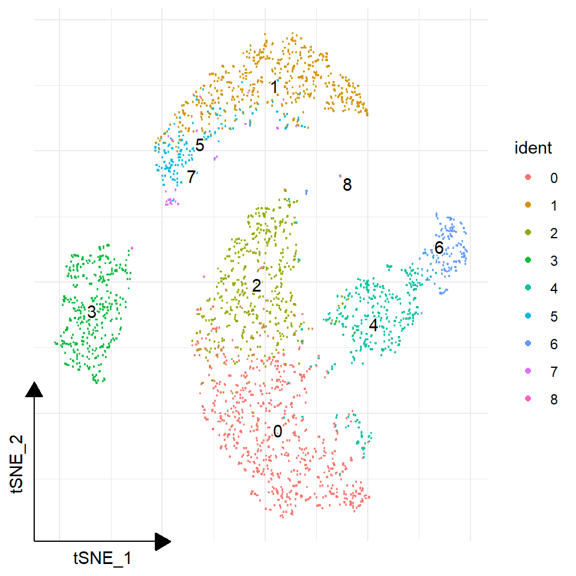
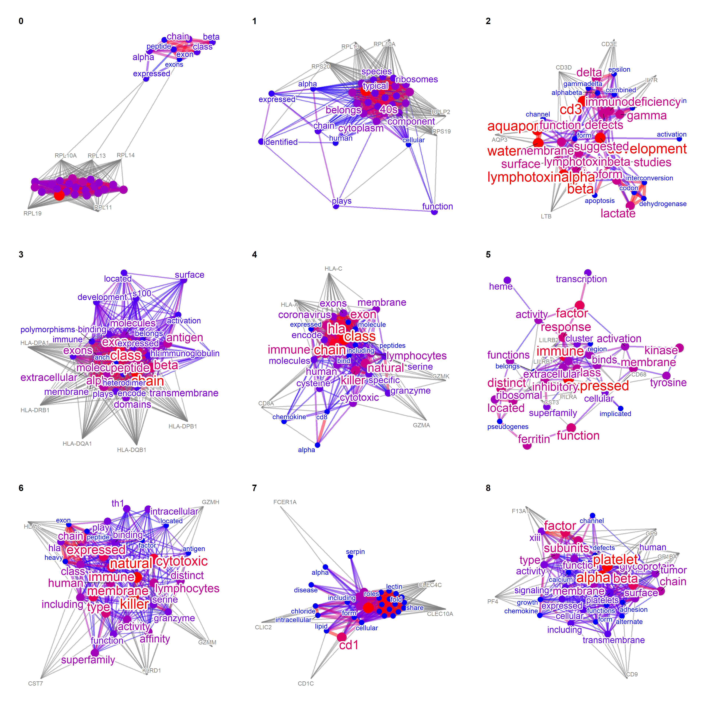
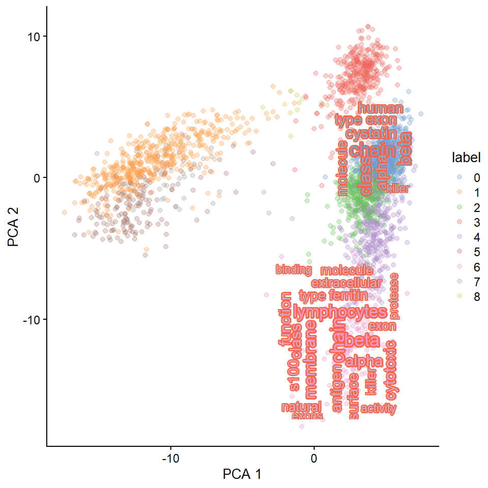
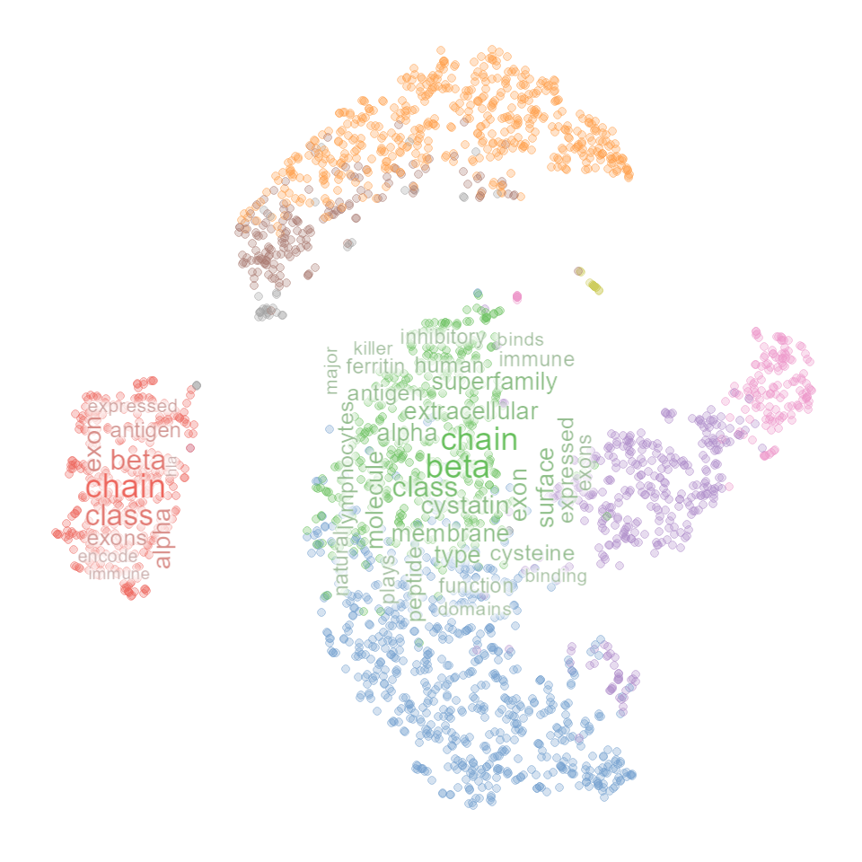
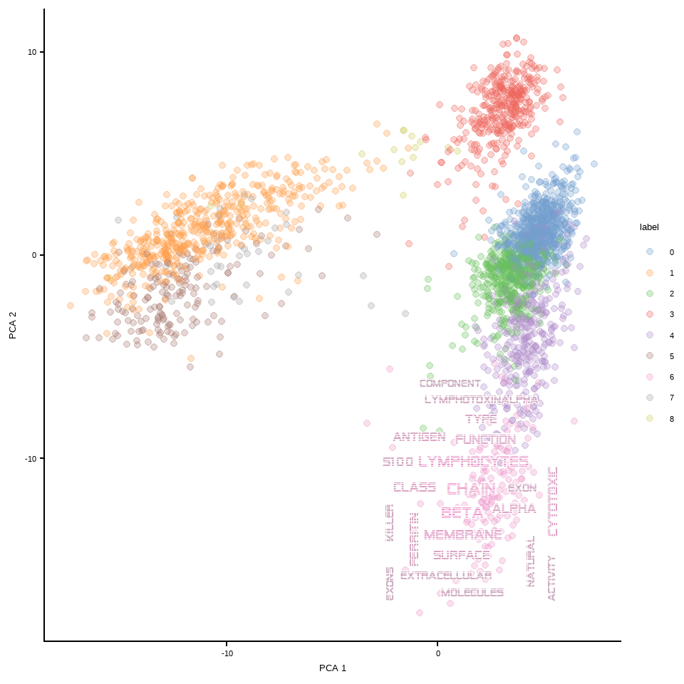
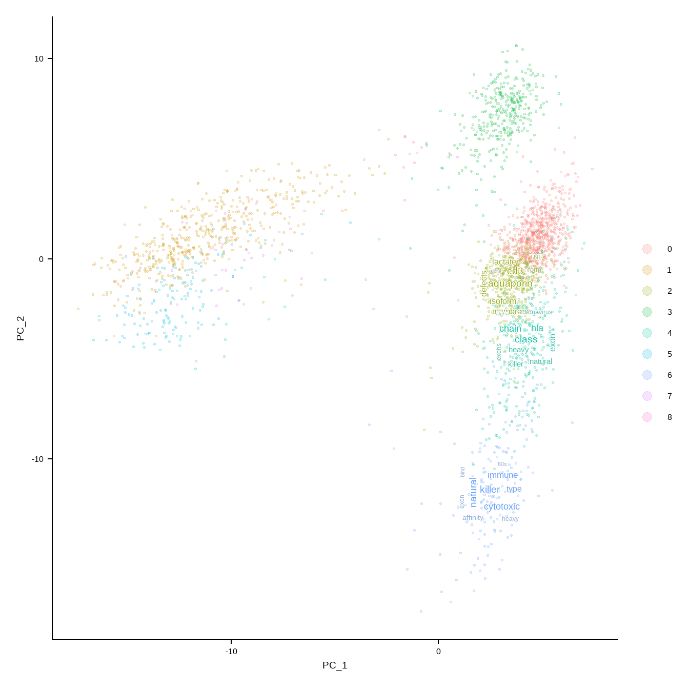
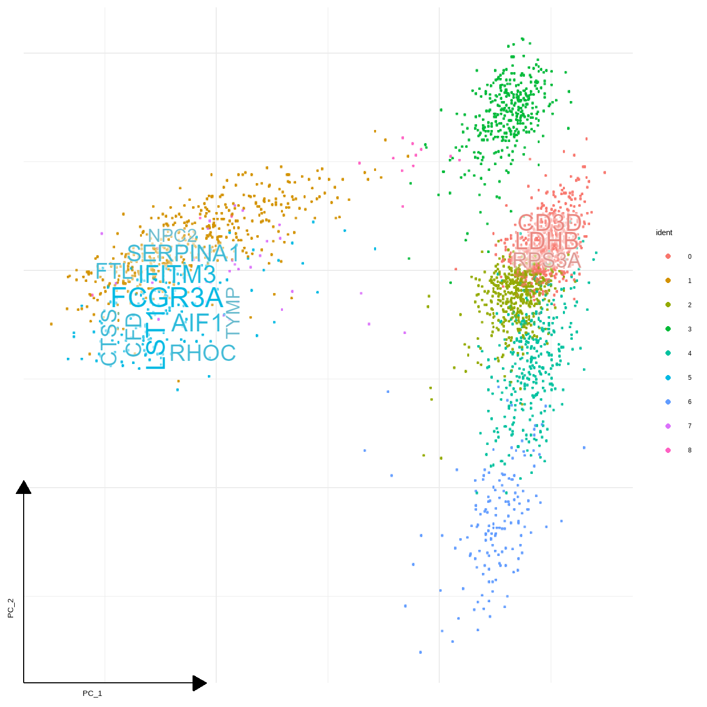

# Single-cell transcriptomic data

For use with single-cell transcriptomic data, some functions are prepared.
The example data used here is for the demonstrative purpose and the necessary preprocessing should be performed.

## Visualizing textual information for marker genes

Visualize the network for all the cluster's marker genes.


```r
library(Seurat)
library(patchwork)
library(ggraph)
library(biotextgraph)
library(ggsc) ## Install using BiocManager::install("ggsc")
```


```r
dir = "filtered_gene_bc_matrices/hg19"
pbmc.data <- Read10X(data.dir = dir)
pbmc <- CreateSeuratObject(counts = pbmc.data, project = "pbmc3k",
                           min.cells=3, min.features=200)
pbmc <- NormalizeData(pbmc)
pbmc <- FindVariableFeatures(pbmc, selection.method = "vst")
pbmc <- ScaleData(pbmc, features = row.names(pbmc))
pbmc <- RunPCA(pbmc, features = VariableFeatures(object = pbmc))
pbmc <- FindNeighbors(pbmc, dims = 1:10, verbose = FALSE)
pbmc <- FindClusters(pbmc, resolution = 0.5, verbose = FALSE)
pbmc <- RunTSNE(pbmc, reduction.use = "cca.aligned", dims.use = 1:20, do.fast = TRUE)
DimPlot(pbmc, reduction = "pca",
        label = TRUE, pt.size = 0.5) 
```


```r
## Or, use ggsc (ggsc, https://yulab-smu.top/ggsc/)
sc_dim(pbmc) + 
    sc_dim_geom_label(geom = shadowtext::geom_shadowtext, 
            color='black', bg.color='white')
```



`TextMarkers` function can be used for Seurat results. `pvalThresh` can be specified.


```r
markers <- FindAllMarkers(pbmc)
texts <- TextMarkers(markers, type="network", pvalThresh=1e-50)
#> 0
#> Input genes: 75
#>   Converted input genes: 75
#> Filter based on GeneSummary
#> Filtered 77 words (frequency and/or tfidf)
#> Ignoring corThresh, automatically determine the value
#> threshold = 0.514
#> 1
#> Input genes: 197
#>   Converted input genes: 190
#> Filter based on GeneSummary
#> Filtered 77 words (frequency and/or tfidf)
#> Ignoring corThresh, automatically determine the value
#> threshold = 0.102
#> 2
#> Input genes: 8
#>   Converted input genes: 8
#> Filter based on GeneSummary
#> Filtered 77 words (frequency and/or tfidf)
#> Ignoring corThresh, automatically determine the value
#> threshold = 0.323
#> 3
#> Input genes: 64
#>   Converted input genes: 60
#> Filter based on GeneSummary
#> Filtered 77 words (frequency and/or tfidf)
#> Ignoring corThresh, automatically determine the value
#> threshold = 0.101
#> 4
#> Input genes: 16
#>   Converted input genes: 16
#> Filter based on GeneSummary
#> Filtered 77 words (frequency and/or tfidf)
#> Ignoring corThresh, automatically determine the value
#> threshold = 0.2
#> 5
#> Input genes: 88
#>   Converted input genes: 82
#> Filter based on GeneSummary
#> Filtered 77 words (frequency and/or tfidf)
#> Ignoring corThresh, automatically determine the value
#> threshold = 0.201
#> 6
#> Input genes: 40
#>   Converted input genes: 39
#> Filter based on GeneSummary
#> Filtered 77 words (frequency and/or tfidf)
#> Ignoring corThresh, automatically determine the value
#> threshold = 0.1
#> 7
#> Input genes: 9
#>   Converted input genes: 8
#> Filter based on GeneSummary
#> Filtered 77 words (frequency and/or tfidf)
#> Ignoring corThresh, automatically determine the value
#> threshold = 0.273
#> 8
#> Input genes: 63
#>   Converted input genes: 52
#> Filter based on GeneSummary
#> Filtered 77 words (frequency and/or tfidf)
#> Ignoring corThresh, automatically determine the value
#> threshold = 0.102
wrap_plots(texts, nrow=3)
```



Word clouds can also be shown.


```r
texts <- TextMarkers(subset(markers, markers$cluster %in% c("6","8")),
     type="wc", pvalThresh=1e-50, genePlot=FALSE)
#> 6
#> Input genes: 40
#>   Converted input genes: 39
#> Filter based on GeneSummary
#> Filtered 77 words (frequency and/or tfidf)
#> 8
#> Input genes: 63
#>   Converted input genes: 52
#> Filter based on GeneSummary
#> Filtered 77 words (frequency and/or tfidf)
wrap_plots(texts)
```


## `findMarkers()` in `scran`


```r
library(SingleCellExperiment)
library(scater)
library(scran)
```


```r
sce <- as.SingleCellExperiment(pbmc)
colLabels(sce) <- colData(sce)$ident
colData(sce)$label <- colData(sce)$ident
```

The function `TextMarkersScran` performs text fetching recursively for each cluster.


```r
marker.info <- findMarkers(sce, colLabels(sce))
texts <- marker.info |> TextMarkersScran(top=5)
#> 0
#> Input genes: 28
#>   Converted input genes: 28
#> Filter based on GeneSummary
#> Filtered 77 words (frequency and/or tfidf)
#> 1
#> Input genes: 20
#>   Converted input genes: 20
#> Filter based on GeneSummary
#> Filtered 77 words (frequency and/or tfidf)
#> 2
#> Input genes: 27
#>   Converted input genes: 27
#> Filter based on GeneSummary
#> Filtered 77 words (frequency and/or tfidf)
#> 3
#> Input genes: 22
#>   Converted input genes: 22
#> Filter based on GeneSummary
#> Filtered 77 words (frequency and/or tfidf)
#> 4
#> Input genes: 19
#>   Converted input genes: 19
#> Filter based on GeneSummary
#> Filtered 77 words (frequency and/or tfidf)
#> 5
#> Input genes: 18
#>   Converted input genes: 16
#> Filter based on GeneSummary
#> Filtered 77 words (frequency and/or tfidf)
#> 6
#> Input genes: 20
#>   Converted input genes: 20
#> Filter based on GeneSummary
#> Filtered 77 words (frequency and/or tfidf)
#> 7
#> Input genes: 26
#>   Converted input genes: 25
#> Filter based on GeneSummary
#> Filtered 77 words (frequency and/or tfidf)
#> 8
#> Input genes: 21
#>   Converted input genes: 20
#> Filter based on GeneSummary
#> Filtered 77 words (frequency and/or tfidf)
texts$`6`
```


## Map resulting wordcloud plots on the dimensionality reducing plot.

Single-cell level wordclouds can be plotted on the reduced dimension plot of cells.
The title in the wordcloud or network can be suppressed by `withTitle=FALSE` in `TextMarkers` functions.
A function is prepared to generate colors and show word cloud on the reduced dimension plot using the same color as the original plot (`plotReducedDimWithTexts`). 
This function can use `use_shadowtext` in `ggwordcloud::geom_text_wordcloud`, which is available from the forked repository (`noriakis/ggwordcloud`). 
`bg.colour` is used to specify background color. Otherwise, one can specify [`ggfx`](https://ggfx.data-imaginist.com/) filtering functions to `withggfx` and `ggfxParams` as parameters, which reflects to wordcloud.

For `SingleCellExperiment`,


```r
library(ggfx)
candLabel <- c("0","6")

plotReducedDimWithTexts(sce, marker.info, colour_by="label",point_alpha=0.3,
    use_shadowtext=TRUE, which.label=candLabel)
#> 0
#> Input genes: 28
#>   Converted input genes: 28
#> Filter based on GeneSummary
#> Filtered 77 words (frequency and/or tfidf)
#> 6
#> Input genes: 20
#>   Converted input genes: 20
#> Filter based on GeneSummary
#> Filtered 77 words (frequency and/or tfidf)
```


```r

## Change the bg.colour
plotReducedDimWithTexts(sce, marker.info, colour_by="label",point_alpha=0.3,
    use_shadowtext=TRUE, bg.colour="tomato",
    which.label=candLabel)
#> 0
#> Input genes: 28
#>   Converted input genes: 28
#> Filter based on GeneSummary
#> Filtered 77 words (frequency and/or tfidf)
#> 6
#> Input genes: 20
#>   Converted input genes: 20
#> Filter based on GeneSummary
#> Filtered 77 words (frequency and/or tfidf)
```



```r

## Use `with_outer_glow`
plotReducedDimWithTexts(sce, marker.info, colour_by="label",point_alpha=0.3,
    use_shadowtext=FALSE, withggfx="with_outer_glow",
    which.label=candLabel)
#> 0
#> Input genes: 28
#>   Converted input genes: 28
#> Filter based on GeneSummary
#> Filtered 77 words (frequency and/or tfidf)
#> 6
#> Input genes: 20
#>   Converted input genes: 20
#> Filter based on GeneSummary
#> Filtered 77 words (frequency and/or tfidf)
```


```r

## Use `with_outer_glow` with parameters
## Should only be used for just the visualization purpose
plotReducedDimWithTexts(sce, marker.info, colour_by="label",point_alpha=0.3,
    use_shadowtext=FALSE, withggfx="with_outer_glow", dimred="TSNE",
    ggfxParams=list(colour="white", expand=2),
    which.label=c("2","3"))+
    theme(axis.line=element_blank(),
        axis.text.x=element_blank(),
        axis.text.y=element_blank(),
        axis.ticks=element_blank(),
        axis.title.x=element_blank(),
        axis.title.y=element_blank(),
        legend.position="none",
        panel.background=element_blank(),
        panel.border=element_blank(),
        panel.grid.major=element_blank(),
        panel.grid.minor=element_blank(),
        plot.background=element_blank())
#> 2
#> Input genes: 27
#>   Converted input genes: 27
#> Filter based on GeneSummary
#> Filtered 77 words (frequency and/or tfidf)
#> 3
#> Input genes: 22
#>   Converted input genes: 22
#> Filter based on GeneSummary
#> Filtered 77 words (frequency and/or tfidf)
```



```r


## Change the font
## Use alien encounter fonts (http://www.hipsthetic.com/alien-encounters-free-80s-font-family/)
sysfonts::font_add(family="alien",regular="SFAlienEncounters.ttf")
showtext::showtext_auto()
plotReducedDimWithTexts(sce, marker.info, colour_by="label",point_alpha=0.3,
                        use_shadowtext=TRUE, bg.colour="white", args=list(fontFamily="alien"),
                        which.label=c("6"), wcScale=6)
#> 6
#> Input genes: 20
#>   Converted input genes: 20
#> Filter based on GeneSummary
#> Filtered 77 words (frequency and/or tfidf)
```



For the `Seurat` object, use `DimPlotWithTexts()`.


```r
r <- rep(4, length(unique(markers$cluster)))
names(r) <- unique(markers$cluster)
DimPlotWithTexts(pbmc, markers, label=FALSE, rad=r, which.label=c("1","4"), wcScale=6)
#> 1
#> Input genes: 1027
#>   Converted input genes: 966
#> Filter based on GeneSummary
#> Filtered 77 words (frequency and/or tfidf)
#> 4
#> Input genes: 316
#>   Converted input genes: 298
#> Filter based on GeneSummary
#> Filtered 77 words (frequency and/or tfidf)
```


Give the function a data frame that is already filtered, like thersholding by adjusted p-values.


```r
r <- rep(2, length(unique(markers$cluster)))
names(r) <- unique(markers$cluster)
thresh <- subset(markers, markers$p_val_adj<1e-50)
DimPlotWithTexts(pbmc,
    thresh,
    label=FALSE,
    rad=r,
    which.label=c("2","4","6"),
    args=list(numWords=50,scaleFreq=5))
#> 2
#> Input genes: 8
#>   Converted input genes: 8
#> Filter based on GeneSummary
#> Filtered 77 words (frequency and/or tfidf)
#> 4
#> Input genes: 16
#>   Converted input genes: 16
#> Filter based on GeneSummary
#> Filtered 77 words (frequency and/or tfidf)
#> 6
#> Input genes: 40
#>   Converted input genes: 39
#> Filter based on GeneSummary
#> Filtered 77 words (frequency and/or tfidf)
```



`geom_sc_wordcloud` is prepared to use in conjuction with `ggsc`.


```r
sc_dim(pbmc,reduction = "pca")+
  geom_sc_wordcloud(markers, show_markers = c(3,5),
                    p_val_adj_threshold = 1e-50, wcScale=7)+
  sc_dim_geom_label(geom = shadowtext::geom_shadowtext, 
                  color='black', bg.color='white')
#> 3
#> Input genes: 64
#>   Converted input genes: 60
#> Filter based on GeneSummary
#> Filtered 77 words (frequency and/or tfidf)
#> 5
#> Input genes: 88
#>   Converted input genes: 82
#> Filter based on GeneSummary
#> Filtered 77 words (frequency and/or tfidf)
```


Some positioning arguments are prepared.


```r
sc_dim(pbmc,reduction = "pca")+
  geom_sc_wordcloud(markers, show_markers = c(4,7),
    p_val_adj_threshold = 1e-50,
    wcScale=7,
    base_dens=TRUE)
#> 4
#> Input genes: 16
#>   Converted input genes: 16
#> Filter based on GeneSummary
#> Filtered 77 words (frequency and/or tfidf)
#> 7
#> Input genes: 9
#>   Converted input genes: 8
#> Filter based on GeneSummary
#> Filtered 77 words (frequency and/or tfidf)
```


## Plotting marker gene names in plot

You can plot gene names instead of gene description by specifying `gene_name=TRUE` in `geom_sc_wordcloud()`. Number of genes can be controlled with `geneNum`. The genes in each cluster are ordered by `sortBy`, in decreasing order in default (`decreasing` option).


```r
sc_dim(pbmc,reduction = "pca")+
    geom_sc_wordcloud(markers, show_markers = c(0,5),
        gene_name = TRUE, wcScale=7,
        p_val_adj_threshold = 1e-50, base_dens = TRUE)
```


```r

sc_dim(pbmc,reduction = "pca")+
    geom_sc_wordcloud(markers, show_markers = c(0,5),
        gene_name = TRUE, wcScale=7, use_shadowtext=FALSE,
        withggfx="with_outer_glow", ggfxParams=list(colour="white", expand=1.5),
        p_val_adj_threshold = 1e-50, base_dens = TRUE)
```



Scaling color should be called before `geom_sc_wordcloud()`.


```r
sc_dim(pbmc,reduction = "pca")+
    scale_color_manual(values=RColorBrewer::brewer.pal(9, "PuOr"))+
    geom_sc_wordcloud(markers, show_markers = c(0,5),
        gene_name = TRUE, wcScale=7,
        p_val_adj_threshold = 1e-50, base_dens = TRUE)
```


### Plotting the enrichment analysis results of marker genes


```r
r <- rep(3, length(unique(markers$cluster)))
names(r) <- unique(markers$cluster)

## Enrichment analysis
DimPlotWithTexts(pbmc, thresh, label=FALSE,
    point_alpha = 0.8,which.label = c(0,6),
    args=list(enrich="kegg", scaleFreq=10, numWords=50),
    reduction = "pca", base_dens=TRUE,
    wcScale=7)
#> 0
#> Input genes: 75
#>   Converted input genes: 75
#> Performing enrichment analysis
#> Filter based on GeneSummary
#> Filtered 77 words (frequency and/or tfidf)
#> 6
#> Input genes: 40
#>   Converted input genes: 39
#> Performing enrichment analysis
#> Filter based on GeneSummary
#> Filtered 77 words (frequency and/or tfidf)
```


