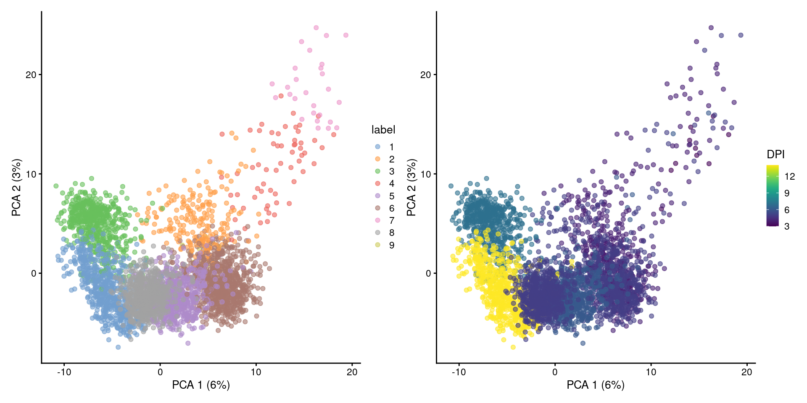
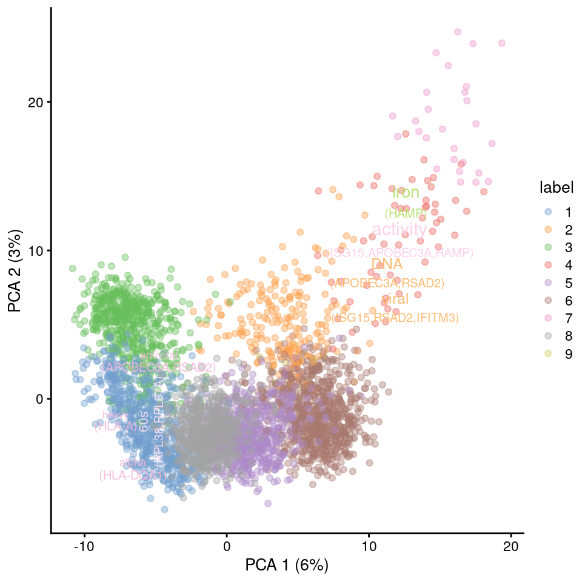
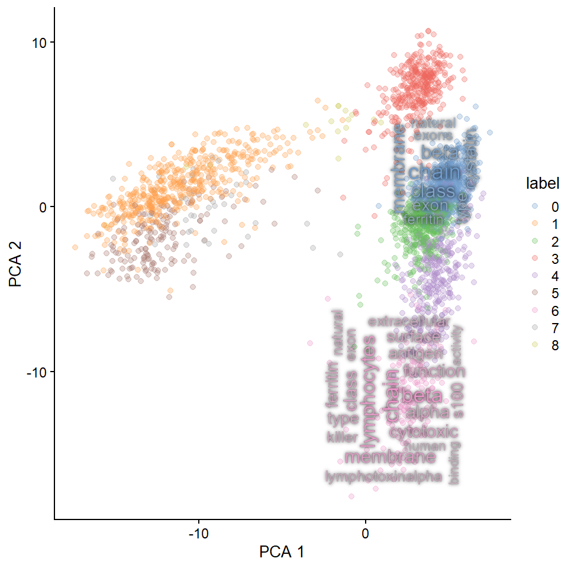
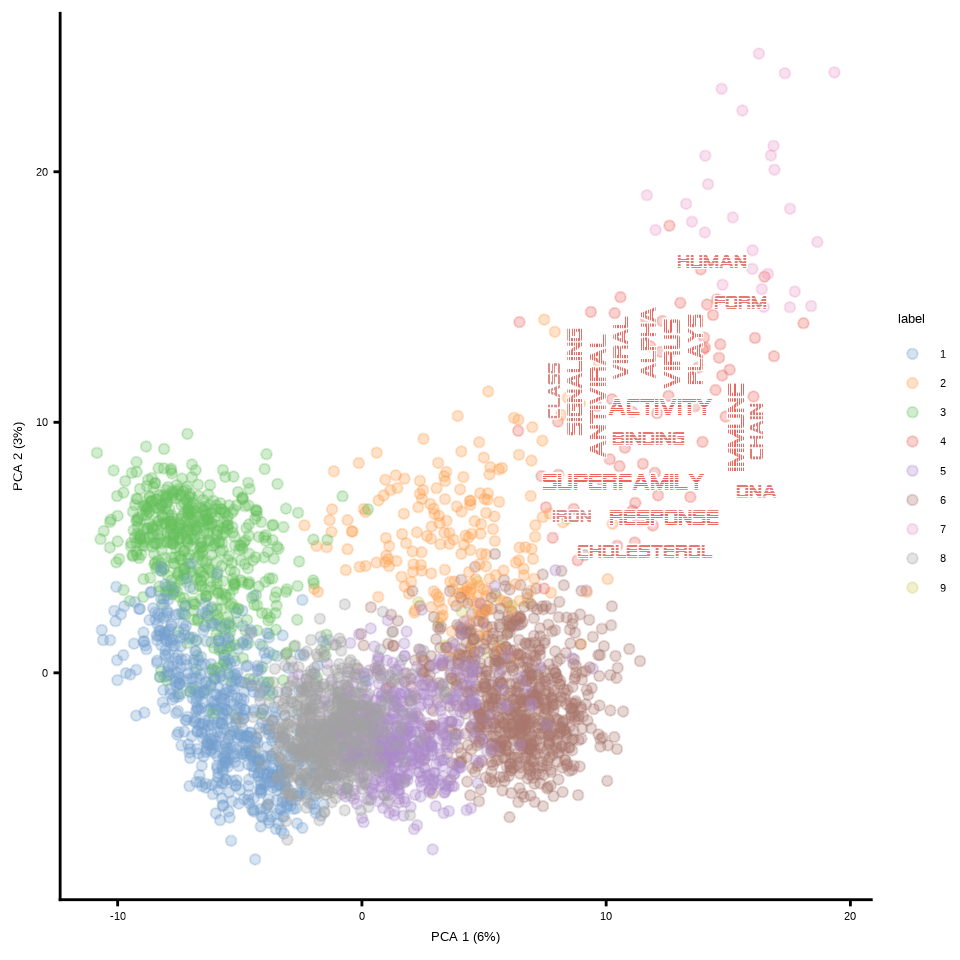
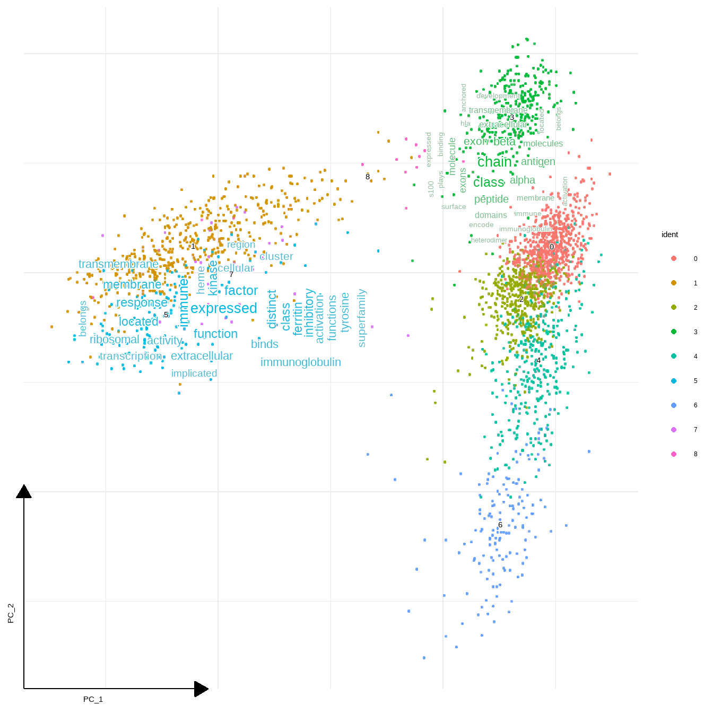
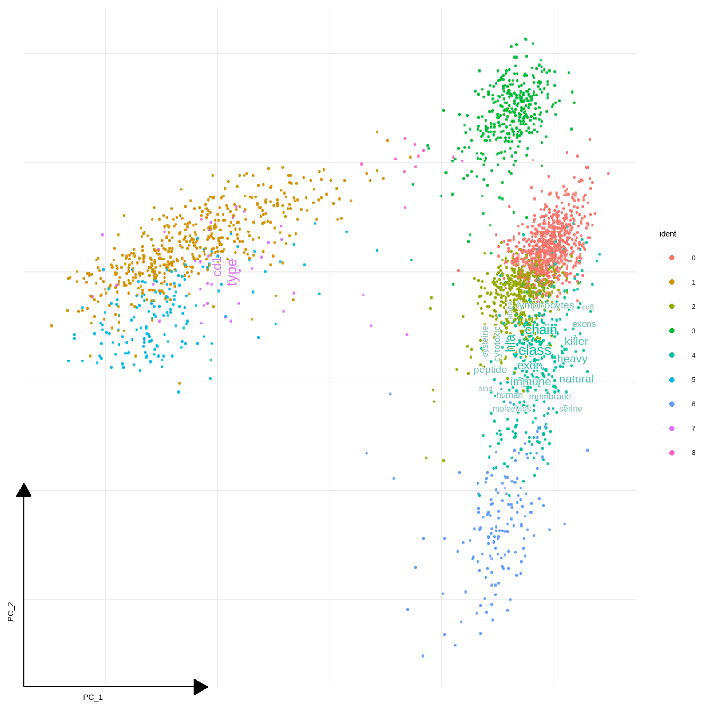
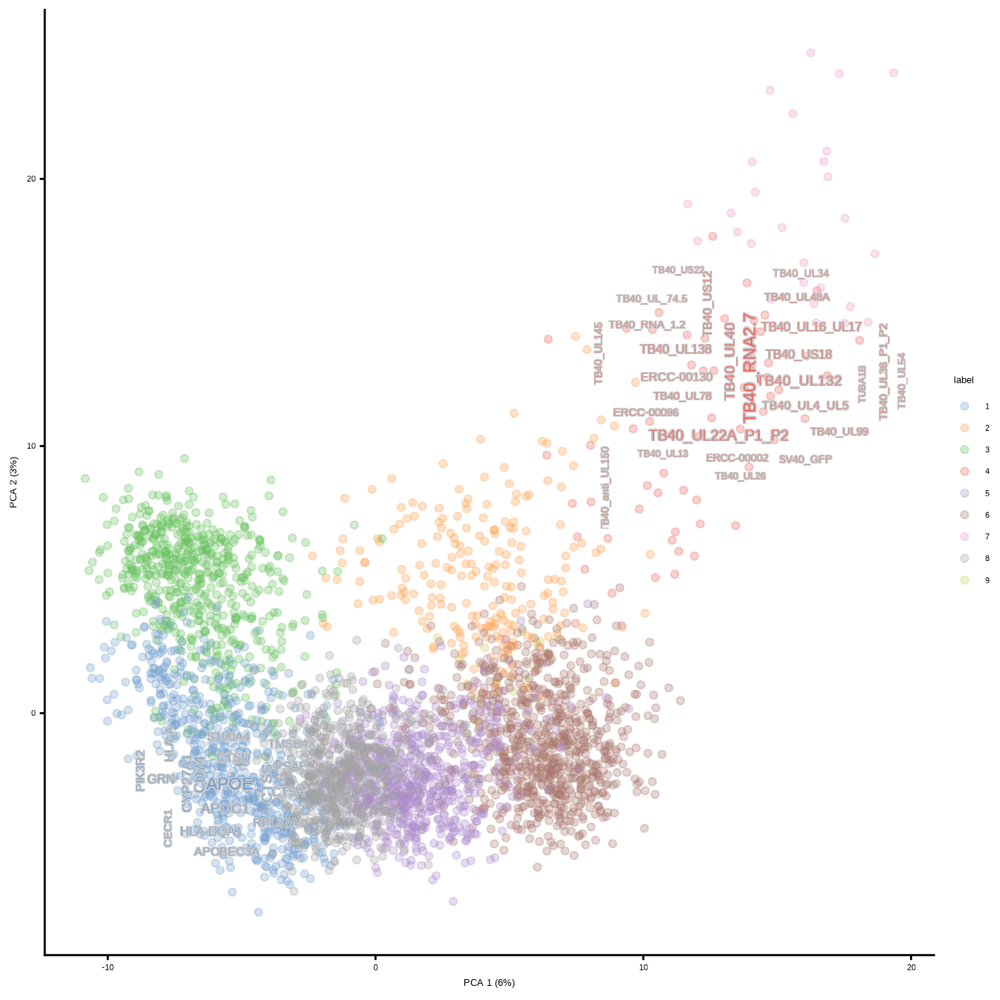

# Single-cell transcriptomic data

For use with single-cell transcriptomic data, some functions are prepared.

## Visualizing textual information for marker genes

Visualize the network for all the cluster's marker genes.


```r
library(Seurat)
library(patchwork)
library(ggraph)
library(biotextgraph)
library(ggsc) ## can be installed by devtools::install_github("YuLab-SMU/ggsc")
```


```r
dir = "filtered_gene_bc_matrices/hg19"
pbmc.data <- Read10X(data.dir = dir)
pbmc <- CreateSeuratObject(counts = pbmc.data, project = "pbmc3k",
                           min.cells=3, min.features=200)
pbmc <- NormalizeData(pbmc)
pbmc <- FindVariableFeatures(pbmc, selection.method = "vst")
pbmc <- ScaleData(pbmc, features = row.names(pbmc))
pbmc <- RunPCA(pbmc, features = VariableFeatures(object = pbmc))
pbmc <- FindNeighbors(pbmc, dims = 1:10, verbose = FALSE)
pbmc <- FindClusters(pbmc, resolution = 0.5, verbose = FALSE)
# pbmc <- RunUMAP(pbmc, dims = 1:10, umap.method = "uwot", metric = "cosine")
DimPlot(pbmc, reduction = "pca",
        label = TRUE, pt.size = 0.5) 
```


```r
## Or, use ggsc (ggsc, https://yulab-smu.top/ggsc/)
sc_dim(pbmc) + 
    sc_dim_geom_label(geom = shadowtext::geom_shadowtext, 
            color='black', bg.color='white')
```


`TextMarkers` function can be used for Seurat results. `pvalThresh` can be specified.


```r
markers <- FindAllMarkers(pbmc)
texts <- markers |> TextMarkers(type="network", pvalThresh=1e-50)
#> 0
#> Input genes: 75
#>   Converted input genes: 75
#> Filter based on GeneSummary
#> Filtered 77 words (frequency and/or tfidf)
#> Ignoring corThresh, automatically determine the value
#> threshold = 0.514
#> 1
#> Input genes: 197
#>   Converted input genes: 190
#> Filter based on GeneSummary
#> Filtered 77 words (frequency and/or tfidf)
#> Ignoring corThresh, automatically determine the value
#> threshold = 0.102
#> 2
#> Input genes: 8
#>   Converted input genes: 8
#> Filter based on GeneSummary
#> Filtered 77 words (frequency and/or tfidf)
#> Ignoring corThresh, automatically determine the value
#> threshold = 0.323
#> 3
#> Input genes: 64
#>   Converted input genes: 60
#> Filter based on GeneSummary
#> Filtered 77 words (frequency and/or tfidf)
#> Ignoring corThresh, automatically determine the value
#> threshold = 0.101
#> 4
#> Input genes: 16
#>   Converted input genes: 16
#> Filter based on GeneSummary
#> Filtered 77 words (frequency and/or tfidf)
#> Ignoring corThresh, automatically determine the value
#> threshold = 0.2
#> 5
#> Input genes: 88
#>   Converted input genes: 82
#> Filter based on GeneSummary
#> Filtered 77 words (frequency and/or tfidf)
#> Ignoring corThresh, automatically determine the value
#> threshold = 0.201
#> 6
#> Input genes: 40
#>   Converted input genes: 39
#> Filter based on GeneSummary
#> Filtered 77 words (frequency and/or tfidf)
#> Ignoring corThresh, automatically determine the value
#> threshold = 0.1
#> 7
#> Input genes: 9
#>   Converted input genes: 8
#> Filter based on GeneSummary
#> Filtered 77 words (frequency and/or tfidf)
#> Ignoring corThresh, automatically determine the value
#> threshold = 0.273
#> 8
#> Input genes: 63
#>   Converted input genes: 52
#> Filter based on GeneSummary
#> Filtered 77 words (frequency and/or tfidf)
#> Ignoring corThresh, automatically determine the value
#> threshold = 0.102
wrap_plots(texts, nrow=3)
```


Word clouds can also be shown.


```r
texts <- markers |> TextMarkers(type="wc", pvalThresh=1e-50)
#> 0
#> Input genes: 75
#>   Converted input genes: 75
#> Filter based on GeneSummary
#> Filtered 77 words (frequency and/or tfidf)
#> 1
#> Input genes: 197
#>   Converted input genes: 190
#> Filter based on GeneSummary
#> Filtered 77 words (frequency and/or tfidf)
#> 2
#> Input genes: 8
#>   Converted input genes: 8
#> Filter based on GeneSummary
#> Filtered 77 words (frequency and/or tfidf)
#> 3
#> Input genes: 64
#>   Converted input genes: 60
#> Filter based on GeneSummary
#> Filtered 77 words (frequency and/or tfidf)
#> 4
#> Input genes: 16
#>   Converted input genes: 16
#> Filter based on GeneSummary
#> Filtered 77 words (frequency and/or tfidf)
#> 5
#> Input genes: 88
#>   Converted input genes: 82
#> Filter based on GeneSummary
#> Filtered 77 words (frequency and/or tfidf)
#> 6
#> Input genes: 40
#>   Converted input genes: 39
#> Filter based on GeneSummary
#> Filtered 77 words (frequency and/or tfidf)
#> 7
#> Input genes: 9
#>   Converted input genes: 8
#> Filter based on GeneSummary
#> Filtered 77 words (frequency and/or tfidf)
#> 8
#> Input genes: 63
#>   Converted input genes: 52
#> Filter based on GeneSummary
#> Filtered 77 words (frequency and/or tfidf)
wrap_plots(texts, nrow=3)
```


## `findMarkers()` in `scran`

We use the data from `GSE101341` as an example input for `scran`.


```r
library(SingleCellExperiment)
library(scater)
library(scran)
```


```r
df <- read.table("GSE101341_CD14_umis.txt",
                 sep="\t", row.names=1,
                 header=1)
df |> dim()
#> [1] 26121  3655
des <- read.table("GSE101341_experimental_design.txt", sep="\t", row.names=1, header=1)
des |> dim()
#> [1] 3655    5
sce <- SingleCellExperiment(list(counts=df), colData=des |> DataFrame())
sce ## Contains some malformed gene names...
#> class: SingleCellExperiment 
#> dim: 26121 3655 
#> metadata(0):
#> assays(1): counts
#> rownames(26121): 1-Dec 1-Mar ... mir-34;MIR34A
#>   unknown
#> rowData names(0):
#> colnames(3655): W101153 W101171 ... W503839 W503840
#> colData names(5): Batch.ID well_coordinates
#>   Cell_barcode Pool_barcode DPI
#> reducedDimNames(0):
#> mainExpName: NULL
#> altExpNames(0):

set.seed(1)

qcstats <- perCellQCMetrics(sce)
qcfilter <- quickPerCellQC(qcstats)
sce <- sce[,!qcfilter$discard]
summary(qcfilter$discard)
#>    Mode   FALSE 
#> logical    3655

lib.sf.sce <- librarySizeFactors(sce)
clust.sce <- quickCluster(sce) 
sce <- computeSumFactors(sce,
                         cluster=clust.sce,
                         min.mean=0.1)
sce <- logNormCounts(sce)
top.sce <- getTopHVGs(sce, n=2000)
sce <- fixedPCA(sce, subset.row=top.sce) 
# sce <- runUMAP(sce)
nn.clusters <- clusterCells(sce, use.dimred="PCA")
colLabels(sce) <- nn.clusters
plrd <- plotReducedDim(sce, dimred="PCA", colour_by="label")
plrd_DPI <- plotReducedDim(sce, dimred="PCA", colour_by="DPI")

plrd + plrd_DPI
```



The function `TextMarkersScran` performs text fetching recursively for each cluster.


```r
marker.info <- findMarkers(sce, colLabels(sce))
texts <- marker.info |> TextMarkersScran(top=5)
#> 1
#> Input genes: 22
#>   Converted input genes: 17
#> Filter based on GeneSummary
#> Filtered 77 words (frequency and/or tfidf)
#> 2
#> Input genes: 22
#>   Converted input genes: 13
#> Filter based on GeneSummary
#> Filtered 77 words (frequency and/or tfidf)
#> 3
#> Input genes: 22
#>   Converted input genes: 16
#> Filter based on GeneSummary
#> Filtered 77 words (frequency and/or tfidf)
#> 4
#> Input genes: 17
#>   Converted input genes: 10
#> Filter based on GeneSummary
#> Filtered 77 words (frequency and/or tfidf)
#> 5
#> Input genes: 25
#>   Converted input genes: 16
#> Filter based on GeneSummary
#> Filtered 77 words (frequency and/or tfidf)
#> 6
#> Input genes: 17
#>   Converted input genes: 11
#> Filter based on GeneSummary
#> Filtered 77 words (frequency and/or tfidf)
#> 7
#> Input genes: 26
#>   Converted input genes: 19
#> Filter based on GeneSummary
#> Filtered 77 words (frequency and/or tfidf)
#> 8
#> Input genes: 25
#>   Converted input genes: 17
#> Filter based on GeneSummary
#> Filtered 77 words (frequency and/or tfidf)
#> 9
#> Input genes: 16
#>   Converted input genes: 8
#> Filter based on GeneSummary
#> Filtered 77 words (frequency and/or tfidf)
texts$`1` + texts$`4`
```


## Map resulting wordcloud plots on the dimensionality reducing plot.

Single-cell level wordclouds can be plotted on the reduced dimension plot of cells.
The title in the wordcloud or network can be suppressed by `withTitle=FALSE`.


```r
library(dplyr)

## Make text visible
rawPlot <- plotReducedDim(sce, dimred="PCA",
                          colour_by="label",
                          point_alpha=0.4)


set.seed(5)
texts <- marker.info[c(1,4)] |> TextMarkersScran(wcArgs=list(alpha=0.9),
                                                      args=list(wcScale=4),
                                                      withTitle=FALSE, top=5)
#> 1
#> Input genes: 22
#>   Converted input genes: 17
#> Filter based on GeneSummary
#> Filtered 77 words (frequency and/or tfidf)
#> 4
#> Input genes: 17
#>   Converted input genes: 10
#> Filter based on GeneSummary
#> Filtered 77 words (frequency and/or tfidf)


new_points <- rawPlot$data |>
  group_by(colour_by) |>
  summarise(XMi=min(X),
            YMi=min(Y),
            XMa=max(X),
            YMa=max(Y))

for (i in names(texts)) {
  tmp <- subset(new_points,
                new_points$colour_by==i)
  tmpXMi <- tmp$XMi; tmpYMi <- tmp$YMi; tmpXMa <- tmp$XMa; tmpYMa <- tmp$YMa
  rawPlot <- rawPlot + annotation_custom(ggplotify::as.grob(texts[[i]]),
                                   xmin=tmpXMi, xmax=tmpXMa,
                                   ymin=tmpYMi, ymax=tmpYMa)
}
rawPlot
```



A function is prepared to generate colors and show word cloud on the reduced dimension plot using the same color as the original plot (`plotReducedDimWithTexts`). This function can use `use_shadowtext` in `ggwordcloud::geom_text_wordcloud`, which is available from the forked repository (`noriakis/ggwordcloud`). `bg.colour` is used to specify background color. Otherwise, one can specify [`ggfx`](https://ggfx.data-imaginist.com/) filtering functions to `withggfx` and `ggfxParams` as parameters, which reflects to wordcloud.


```r
library(ggfx)

plotReducedDimWithTexts(sce, marker.info, colour_by="label",point_alpha=0.3,
                        use_shadowtext=TRUE, which.label=c("1","4"))
#> 1
#> Input genes: 39
#>   Converted input genes: 31
#> Filter based on GeneSummary
#> Filtered 77 words (frequency and/or tfidf)
#> 4
#> Input genes: 42
#>   Converted input genes: 24
#> Filter based on GeneSummary
#> Filtered 77 words (frequency and/or tfidf)
```


```r

## Change the bg.colour
plotReducedDimWithTexts(sce, marker.info, colour_by="label",point_alpha=0.3,
                        use_shadowtext=TRUE, bg.colour="tomato",
                        which.label=c("1","4"))
#> 1
#> Input genes: 39
#>   Converted input genes: 31
#> Filter based on GeneSummary
#> Filtered 77 words (frequency and/or tfidf)
#> 4
#> Input genes: 42
#>   Converted input genes: 24
#> Filter based on GeneSummary
#> Filtered 77 words (frequency and/or tfidf)
```


```r

## Use `with_outer_glow`
plotReducedDimWithTexts(sce, marker.info, colour_by="label",point_alpha=0.3,
                        use_shadowtext=FALSE, withggfx="with_outer_glow",
                        which.label=c("1","4"))
#> 1
#> Input genes: 39
#>   Converted input genes: 31
#> Filter based on GeneSummary
#> Filtered 77 words (frequency and/or tfidf)
#> 4
#> Input genes: 42
#>   Converted input genes: 24
#> Filter based on GeneSummary
#> Filtered 77 words (frequency and/or tfidf)
```



```r

## Use `with_outer_glow` with parameters
plotReducedDimWithTexts(sce, marker.info, colour_by="label",point_alpha=0.3,
                        use_shadowtext=FALSE, withggfx="with_outer_glow",
                        ggfxParams=list(colour="white", expand=2),
                        which.label=c("1","4"))
#> 1
#> Input genes: 39
#>   Converted input genes: 31
#> Filter based on GeneSummary
#> Filtered 77 words (frequency and/or tfidf)
#> 4
#> Input genes: 42
#>   Converted input genes: 24
#> Filter based on GeneSummary
#> Filtered 77 words (frequency and/or tfidf)
```


```r
## Use `with_inner_glow`
plotReducedDimWithTexts(sce, marker.info, colour_by="label",point_alpha=0.3,
                        use_shadowtext=FALSE, withggfx="with_inner_glow",
                        which.label=c("1","4"))
#> 1
#> Input genes: 39
#>   Converted input genes: 31
#> Filter based on GeneSummary
#> Filtered 77 words (frequency and/or tfidf)
#> 4
#> Input genes: 42
#>   Converted input genes: 24
#> Filter based on GeneSummary
#> Filtered 77 words (frequency and/or tfidf)
```


```r

## Change the font
## Use alien encounter fonts (http://www.hipsthetic.com/alien-encounters-free-80s-font-family/)
sysfonts::font_add(family="alien",regular="SFAlienEncounters.ttf")
showtext::showtext_auto()
plotReducedDimWithTexts(sce, marker.info, colour_by="label",point_alpha=0.3,
                        use_shadowtext=TRUE, bg.colour="white", args=list(fontFamily="alien"),
                        which.label=c("4"), wcScale=6)
#> 4
#> Input genes: 42
#>   Converted input genes: 24
#> Filter based on GeneSummary
#> Filtered 77 words (frequency and/or tfidf)
```



For the `Seurat` object, use `DimPlotWithTexts()`.


```r
r <- rep(4, length(unique(markers$cluster)))
names(r) <- unique(markers$cluster)
DimPlotWithTexts(pbmc, markers, label=FALSE, rad=r, which.label=c("1","4"),
                 wcScale=6)
#> 1
#> Input genes: 1027
#>   Converted input genes: 966
#> Filter based on GeneSummary
#> Filtered 77 words (frequency and/or tfidf)
#> 4
#> Input genes: 316
#>   Converted input genes: 298
#> Filter based on GeneSummary
#> Filtered 77 words (frequency and/or tfidf)
```


Give the function a data frame that is already filtered, like thersholding by adjusted p-values.


```r
r <- rep(2, length(unique(markers$cluster)))
names(r) <- unique(markers$cluster)
thresh <- subset(markers, markers$p_val_adj<1e-50)
DimPlotWithTexts(pbmc,
                 thresh,
                 label=FALSE,
                 rad=r,
                 which.label=c("2","4","6"),
                 args=list(numWords=50,scaleFreq=5))
#> 2
#> Input genes: 8
#>   Converted input genes: 8
#> Filter based on GeneSummary
#> Filtered 77 words (frequency and/or tfidf)
#> 4
#> Input genes: 16
#>   Converted input genes: 16
#> Filter based on GeneSummary
#> Filtered 77 words (frequency and/or tfidf)
#> 6
#> Input genes: 40
#>   Converted input genes: 39
#> Filter based on GeneSummary
#> Filtered 77 words (frequency and/or tfidf)
```


`geom_sc_wordcloud` is prepared to use in conjuction with `ggsc`.


```r
sc_dim(pbmc,reduction = "pca")+
  geom_sc_wordcloud(markers, show_markers = c(3,5),
                    p_val_adj_threshold = 1e-50, wcScale=7)+
  sc_dim_geom_label(geom = shadowtext::geom_shadowtext, 
                  color='black', bg.color='white')
#> 3
#> Input genes: 64
#>   Converted input genes: 60
#> Filter based on GeneSummary
#> Filtered 77 words (frequency and/or tfidf)
#> 5
#> Input genes: 88
#>   Converted input genes: 82
#> Filter based on GeneSummary
#> Filtered 77 words (frequency and/or tfidf)
```



Some positioning arguments are prepared.


```r
sc_dim(pbmc,reduction = "pca")+
  geom_sc_wordcloud(markers, show_markers = c(4,7),
                    p_val_adj_threshold = 1e-50,
                    wcScale=7,
                    base_dens=TRUE)
#> 4
#> Input genes: 16
#>   Converted input genes: 16
#> Filter based on GeneSummary
#> Filtered 77 words (frequency and/or tfidf)
#> 7
#> Input genes: 9
#>   Converted input genes: 8
#> Filter based on GeneSummary
#> Filtered 77 words (frequency and/or tfidf)
```



## Plotting marker gene names in plot

You can plot gene names instead of gene description by specifying `gene_name=TRUE` in `geom_sc_wordcloud()`. Number of genes can be controlled with `geneNum`. The genes in each cluster are ordered by `sortBy`, in decreasing order in default (`decreasing` option).


```r
sc_dim(pbmc,reduction = "pca")+
    geom_sc_wordcloud(markers, show_markers = c(0,5),
                      gene_name = TRUE, wcScale=7,
                      p_val_adj_threshold = 1e-50, base_dens = TRUE)
```


```r

sc_dim(pbmc,reduction = "pca")+
    geom_sc_wordcloud(markers, show_markers = c(0,5),
                      gene_name = TRUE, wcScale=7, use_shadowtext=FALSE,
                      withggfx="with_outer_glow", ggfxParams=list(colour="white", expand=1.5),
                      p_val_adj_threshold = 1e-50, base_dens = TRUE)
```


Scaling color should be called before `geom_sc_wordcloud()`.


```r
sc_dim(pbmc,reduction = "pca")+
    scale_color_manual(values=RColorBrewer::brewer.pal(9, "PuOr"))+
    geom_sc_wordcloud(markers, show_markers = c(0,5),
                      gene_name = TRUE, wcScale=7,
                      p_val_adj_threshold = 1e-50, base_dens = TRUE)
```


For scran, use `plotReducedDimWithTexts`.


```r
scex <- plotReducedDimWithTexts(sce,
                        marker.info,
                        colour_by="label",
                        base_dens = TRUE,
                        point_alpha=0.3,
                        wcScale=6,
                        use_shadowtext=TRUE,
                        bg.colour="grey80",
                        gene_name=TRUE,
                        which.label=c("1","4"))
scex
```



### Plotting the enrichment analysis results of marker genes


```r
r <- rep(3, length(unique(markers$cluster)))
names(r) <- unique(markers$cluster)

## Enrichment analysis
DimPlotWithTexts(pbmc, thresh, label=FALSE,
                       point_alpha = 0.8,which.label = c(0,6),
                       args=list(enrich="reactome",
                                 numWords=50),
                       reduction = "pca", base_dens=TRUE,
                       wcScale=7)
#> 0
#> Input genes: 75
#>   Converted input genes: 75
#> Performing enrichment analysis
#> Filter based on GeneSummary
#> Filtered 77 words (frequency and/or tfidf)
#> 6
#> Input genes: 40
#>   Converted input genes: 39
#> Performing enrichment analysis
#> Filter based on GeneSummary
#> Filtered 77 words (frequency and/or tfidf)
```


