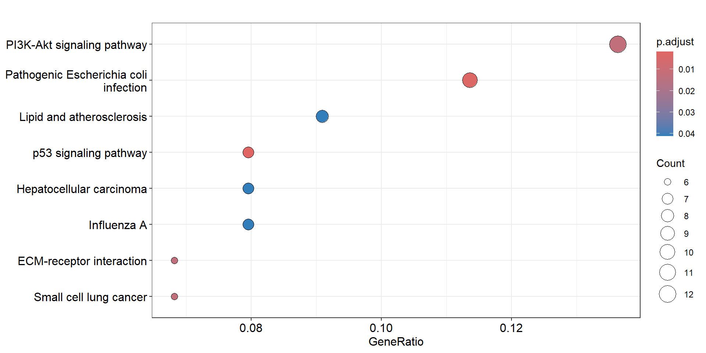
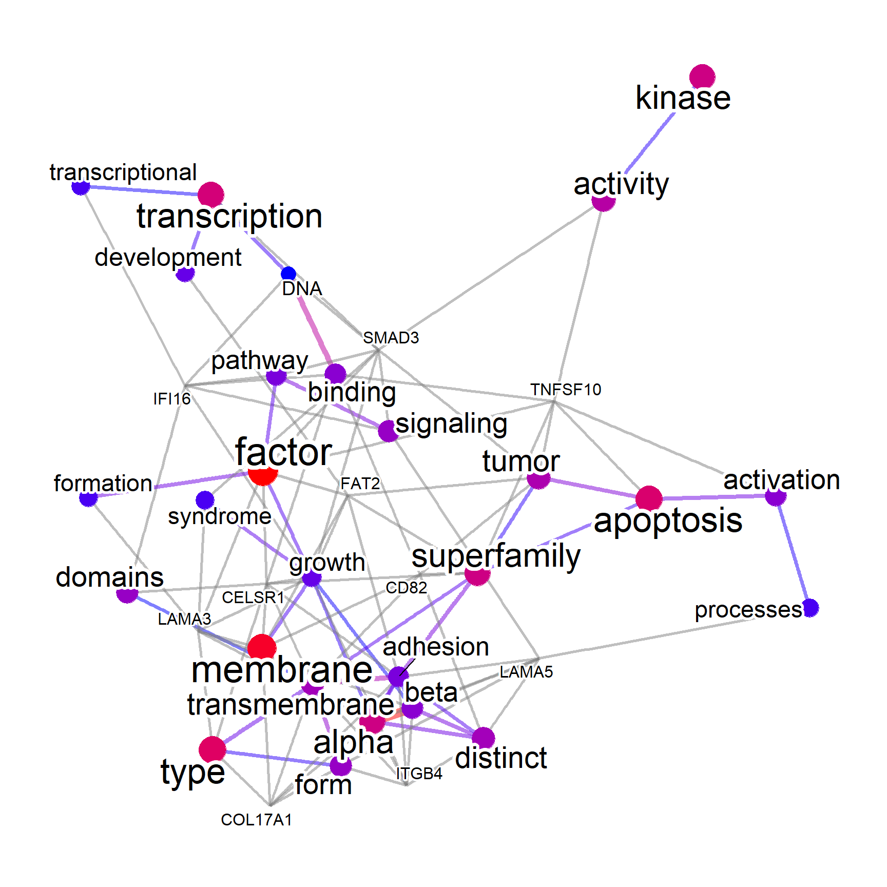
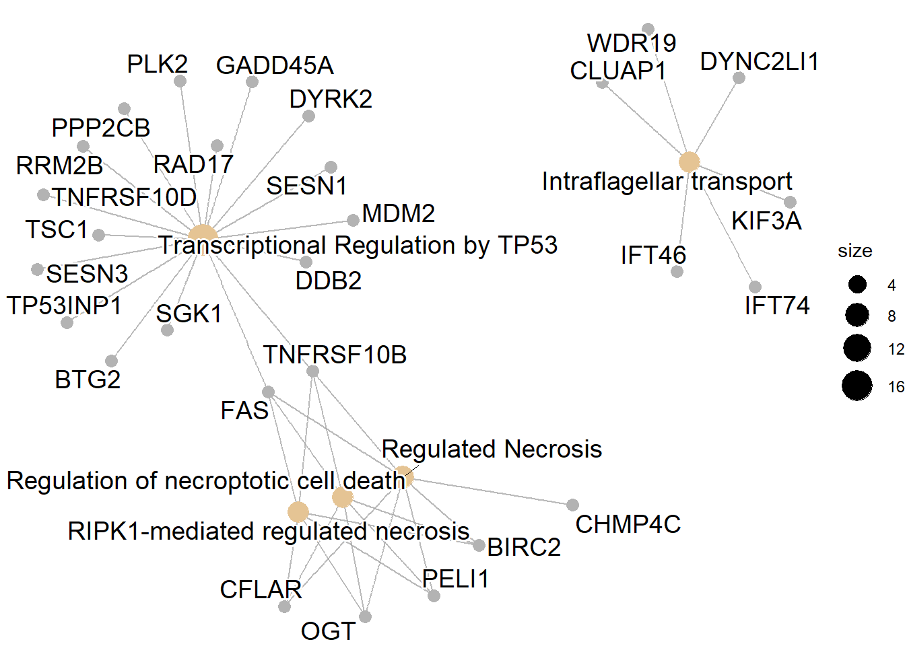
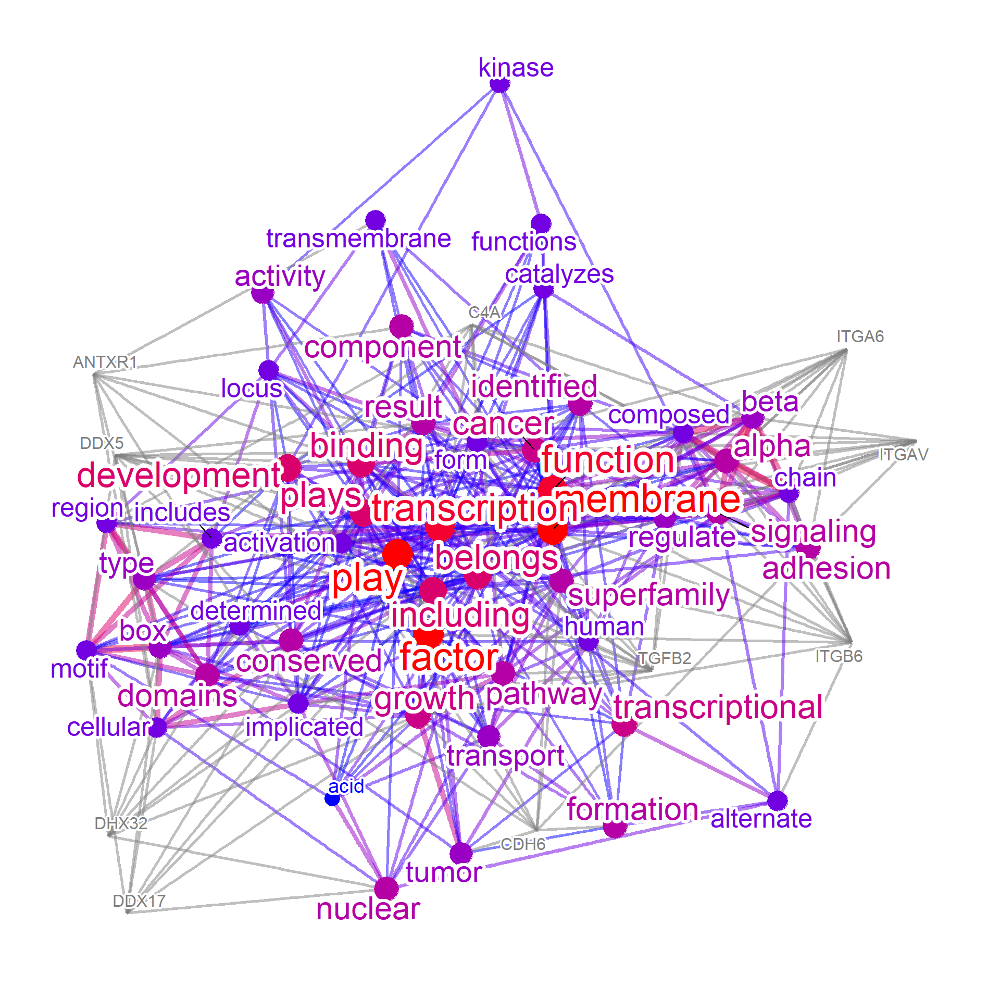
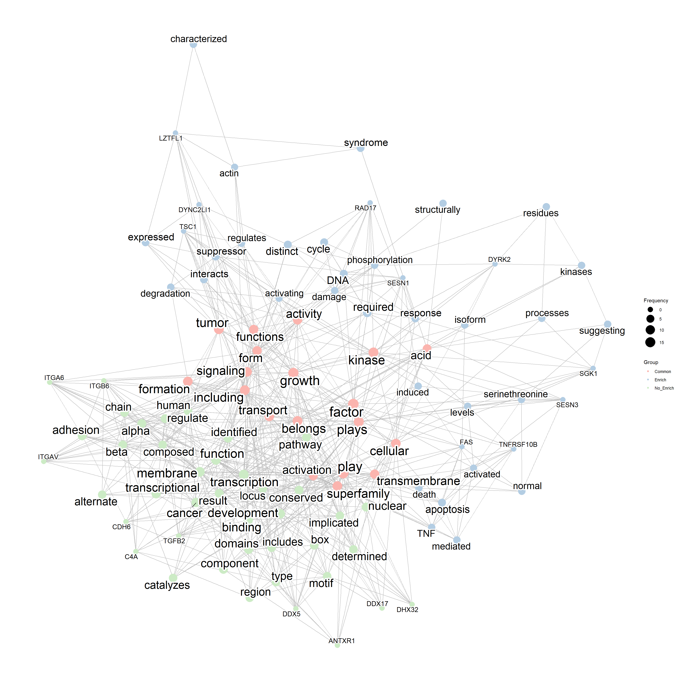

# Application examples {#app}

## Actual application of the package

### The selection of genes

The input of genes can be selected in various ways. In most cases, the list obtained by differential expression analysis can be used as an input to the function. Additionally, the cluster of genes identified in gene clustering analysis such as weighted gene co-expression network analysis can be used as input.

## Gene cluster

### Load the necessary packages and genes


```r
library(biotextgraph)
library(org.Hs.eg.db)
library(ggplot2)
library(ReactomePA);library(clusterProfiler)
library(ggraph);library(igraph)
load(system.file("extdata", "sysdata.rda", package = "biotextgraph"))
```

For the omics analysis involving transcript or genes, we would not obtain a list containing the single gene type such as ERCC genes shown in the basic usage example. In almost all the cases, the gene comes from various biological pathways like obtained in the analysis mentioned in the above section. Here, we introduce an example using the example cluster of WGCNA analysis obtained from the transcriptomic dataset investigating bladder cancer ([Chen et al. 2019](https://doi.org/10.1038/s41556-019-0361-y)). The gene set contains 621 genes.

First, we perform over-representation analysis on the gene set (KEGG) to grasp the biological functions of these genes.


```r
converted <- clusterProfiler::bitr(exampleWGCNAcluster,
    fromType="ENSEMBL", toType="ENTREZID",
    OrgDb="org.Hs.eg.db")[,2]
ora <- clusterProfiler::enrichKEGG(converted)
ora |> filter(p.adjust<0.05) |> data.frame() |> dplyr::pull("Description")
#>  [1] "Butanoate metabolism"                      
#>  [2] "Fatty acid metabolism"                     
#>  [3] "Tight junction"                            
#>  [4] "Valine, leucine and isoleucine degradation"
#>  [5] "Peroxisome"                                
#>  [6] "Fatty acid degradation"                    
#>  [7] "Fatty acid elongation"                     
#>  [8] "Biosynthesis of unsaturated fatty acids"   
#>  [9] "alpha-Linolenic acid metabolism"           
#> [10] "PPAR signaling pathway"                    
#> [11] "Aldosterone-regulated sodium reabsorption" 
#> [12] "Sphingolipid metabolism"
enrichplot::dotplot(ora, showCategory=20)
```



We use the function in `biotextgraph` to make a summarized visualization of textual information, along with associated genes. As for the input reaching to a hundred of genes, there is an option `filterByGO` term, which filters the text mining results to those used in GO terms. This is useful for limiting the visualization to biologically-relevant terms.


```r
check <- refseq(converted, genePlot=TRUE,
                filterByGO=TRUE, keyType="ENTREZID", autoThresh=FALSE)
#> Input genes: 534
#> Filter based on GeneSummary
#> Filtered 77 words (frequency and/or tfidf)
#> `filterByGO` option enabled. Filtering by GO terms ...
plotNet(check, asis=TRUE)
```



Some genes are not related to the significantly enriched pathway, and one would like to inspect the biological function of these genes.


```r
## Extraction of non-related genes
enr_genes <- ora@result %>% data.frame() %>% 
  filter(p.adjust<0.05) %>% dplyr::pull(geneID) %>%
  strsplit("/") %>% unlist() %>% unique()

no_enr <- converted[!(converted %in% enr_genes)]
length(no_enr)
#> [1] 472
```

This time, we enable the `filterByGO` option along with `ngram=2`, which produces 2-gram visualization.


```r
check_noenr_WGO <- refseq(no_enr,
    layout="nicely",
    ngram=2,
    keyType="ENTREZID",
    filterByGO=TRUE,
    autoThresh=FALSE,
    corThresh=0.1,
    docsum=TRUE)
#> Input genes: 472
#> Filter based on GeneSummary
#> Filtered 77 words (frequency and/or tfidf)
#> `filterByGO` option enabled. Filtering by GO terms ...
plotNet(check_noenr_WGO, asis=TRUE)
```


This way, we can filter the unnecessary words from the many terms included in the textual information of identifiers, and focus on biologically relevant terms contained in the identifiers.

## DEGs

We demonstrate an use case of the package, which investigates transcriptomic changes induced by BK polyomavirus (BKPyV) infection in renal proximal tubular epithelial cells ([Assetta et al. 2016](https://pubmed.ncbi.nlm.nih.gov/27381292/)). Differentially expressed mRNAs in 3 days post-infection were obtained, and down-regulated mRNAs in BKPyV infected cells were examined.

### Load the necessary packages and genes


```r
library(biotextgraph)
library(org.Hs.eg.db)
library(ggplot2)
library(ReactomePA);library(clusterProfiler)
library(ggraph);library(igraph)
library(ggforce) ## For genePathPlot
load(system.file("extdata", "sysdata.rda", package = "biotextgraph"))
degs <- d3degDownAssetta2016
length(degs)
#> [1] 191
degs
#>   [1] "ABCB4"           "ABCB7"           "AKTIP"          
#>   [4] "ALS2"            "ANKRA2"          "ANTXR1"         
#>   [7] "APH1B"           "ARHGEF28"        "ARNTL"          
#>  [10] "ATMIN"           "BDH2"            "BIRC2"          
#>  [13] "BTG1"            "BTG2"            "C4A"            
#>  [16] "C7orf60"         "C8orf4"          "CALCOCO1"       
#>  [19] "CAPRIN2"         "CARS"            "CBLB"           
#>  [22] "CCNDBP1"         "CCNG2"           "CCZ1B"          
#>  [25] "CDC42EP3"        "CDH6"            "CFLAR"          
#>  [28] "CHMP1B"          "CHMP4C"          "CLUAP1"         
#>  [31] "COG2"            "COG3"            "CPQ"            
#>  [34] "CROT"            "CTTNBP2NL"       "CYP4V2"         
#>  [37] "DAB2"            "DDB2"            "DDX17"          
#>  [40] "DDX5"            "DGKA"            "DHX32"          
#>  [43] "DLG1"            "DYNC2LI1"        "DYRK2"          
#>  [46] "EFHC1"           "EIF4A2"          "ERMAP"          
#>  [49] "ERMARD"          "EXOC1"           "FAM134B"        
#>  [52] "FAM160B1"        "FAM21C"          "FAM84B"         
#>  [55] "FANK1"           "FAS"             "FBXO38"         
#>  [58] "FCHO2"           "FGD6"            "FLJ22447"       
#>  [61] "FMNL2"           "GADD45A"         "GJA1"           
#>  [64] "GLIDR"           "GLT8D1"          "GOPC"           
#>  [67] "GPBP1L1"         "GPR155"          "GPR75-ASB3"     
#>  [70] "GRAMD3"          "HADHB"           "HCG11"          
#>  [73] "HDAC9"           "HDHD2"           "HERPUD1"        
#>  [76] "HSDL2"           "ICA1"            "ICK"            
#>  [79] "IFNGR1"          "IFT46"           "IFT74"          
#>  [82] "IRF6"            "ITGA2"           "ITGA6"          
#>  [85] "ITGAV"           "ITGB6"           "KDM5B"          
#>  [88] "KIF3A"           "KIF5B"           "KLHL20"         
#>  [91] "KLHL24"          "KLHL9"           "KPNA5"          
#>  [94] "KRCC1"           "L3MBTL3"         "LINC00657"      
#>  [97] "LOC100131564"    "LZTFL1"          "MAMDC2"         
#> [100] "MAP4K5"          "MAT2B"           "MBNL2"          
#> [103] "MDM2"            "MECOM"           "MFSD1"          
#> [106] "MGEA5"           "MICU3"           "MSANTD4"        
#> [109] "NBPF11"          "NCBP2"           "NEAT1"          
#> [112] "NTM"             "OGT"             "PAFAH1B2"       
#> [115] "PAFAH2"          "PCMTD2"          "PDE4D"          
#> [118] "PDP1"            "PELI1"           "PEX1"           
#> [121] "PHF14"           "PHOSPHO2-KLHL23" "PIK3IP1"        
#> [124] "PLA2R1"          "PLCB4"           "PLK2"           
#> [127] "POLI"            "POSTN"           "PPAN-P2RY11"    
#> [130] "PPFIBP1"         "PPP2CB"          "PRICKLE1"       
#> [133] "PROS1"           "PSMD5-AS1"       "RAD17"          
#> [136] "RHOQ"            "RIMKLB"          "RNA18S5"        
#> [139] "RNF170"          "RNF20"           "RNU1-28P"       
#> [142] "RPL23AP53"       "RRM2B"           "RRN3"           
#> [145] "RRN3P1"          "SEMA3C"          "SERINC1"        
#> [148] "SESN1"           "SESN3"           "SGK1"           
#> [151] "SLC22A5"         "SLC37A3"         "SVIL"           
#> [154] "SYT11"           "TARSL2"          "TBC1D19"        
#> [157] "TBCK"            "TBRG1"           "TGFA"           
#> [160] "TGFB2"           "TIPARP"          "TMEM136"        
#> [163] "TNFRSF10B"       "TNFRSF10D"       "TOM1L1"         
#> [166] "TP53INP1"        "TRIM13"          "TRIM32"         
#> [169] "TRIM4"           "TSC1"            "TSPYL5"         
#> [172] "UGT2B7"          "UNC13B"          "UPRT"           
#> [175] "VPS41"           "VPS8"            "WDR11"          
#> [178] "WDR19"           "XPC"             "YPEL2"          
#> [181] "ZC2HC1A"         "ZFAND5"          "ZFP90"          
#> [184] "ZFR"             "ZMAT3"           "ZNF12"          
#> [187] "ZNF248"          "ZNF322"          "ZNF561"         
#> [190] "ZNF626"          "ZSCAN30"
set.seed(1)
```

### Enrichment analysis

First, we perform enrichment analysis using ReactomePA.
From the enrichment analysis results, the cluster is related to transcriptional regulation by TP53.


```r
## Convert to ENTREZID
entre <- AnnotationDbi::select(org.Hs.eg.db, keytype="SYMBOL",
                               keys = degs, columns = "ENTREZID")$ENTREZID
pway <- setReadable(enrichPathway(entre), org.Hs.eg.db)
sigpway <- subset(pway |> data.frame(), p.adjust<0.05)
sigpway$Description
#>  [1] "Transcriptional Regulation by TP53"                              
#>  [2] "RIPK1-mediated regulated necrosis"                               
#>  [3] "Regulation of necroptotic cell death"                            
#>  [4] "Regulated Necrosis"                                              
#>  [5] "Intraflagellar transport"                                        
#>  [6] "Regulation by c-FLIP"                                            
#>  [7] "CASP8 activity is inhibited"                                     
#>  [8] "Dimerization of procaspase-8"                                    
#>  [9] "TP53 Regulates Transcription of Death Receptors and Ligands"     
#> [10] "Caspase activation via Death Receptors in the presence of ligand"
#> [11] "FOXO-mediated transcription of cell cycle genes"                 
#> [12] "Cilium Assembly"                                                 
#> [13] "TP53 Regulates Transcription of Cell Death Genes"
cnetplot(pway)
```



```r

## Genes involved in significant pathways
excheck <- unlist(unique(sapply(sigpway$geneID,
                                function (x) strsplit(x,"/"))))
length(excheck)
#> [1] 57

## Not involved in significant pathways
no_enr <- degs[!(degs %in% excheck)]
length(no_enr)
#> [1] 159
```

### Text mining the gene summaries

Next we perform the plain function producing a correlation network, with showing the top-genes related to high-frequency words in the text in RefSeq summary. We make two networks, those related to significantly enriched pathways and those not related to the significant pathways.


```r
net1 <- refseq(excheck, colorText=TRUE, genePlot=TRUE, numWords=50, docsum=TRUE)
#> Input genes: 57
#>   Converted input genes: 32
#> Filter based on GeneSummary
#> Filtered 77 words (frequency and/or tfidf)
#> Ignoring corThresh, automatically determine the value
#> threshold = 0.3
net2 <- refseq(no_enr, colorText=TRUE, genePlot=TRUE, numWords=50, docsum=TRUE)
#> Input genes: 159
#>   Converted input genes: 142
#> Filter based on GeneSummary
#> Filtered 77 words (frequency and/or tfidf)
#> Ignoring corThresh, automatically determine the value
#> threshold = 0.1

plotNet(net2, asis=TRUE)
```



### Combine and inspect merged network

These networks can be combined to find intersections and differences, from textual perspective. We can see from the results that the genes related to non-enriched pathways could be associated with the membrane transport and adhesion, while genes in the enriched pathways have textual information resembling to those in curated biological databases (such as DNA damage response and tumor suppression).


```r
compareWordNet(list(net1, net2),
               titles=c("Enrich","No_Enrich")) |>
plotNet()
```




```r
sessionInfo()
#> R version 4.3.0 (2023-04-21)
#> Platform: x86_64-pc-linux-gnu (64-bit)
#> Running under: CentOS Linux 7 (Core)
#> 
#> Matrix products: default
#> BLAS:   /usr/local/package/r/4.3.0/lib64/R/lib/libRblas.so 
#> LAPACK: /usr/local/package/r/4.3.0/lib64/R/lib/libRlapack.so;  LAPACK version 3.11.0
#> 
#> locale:
#>  [1] LC_CTYPE=ja_JP.UTF-8       LC_NUMERIC=C              
#>  [3] LC_TIME=ja_JP.UTF-8        LC_COLLATE=ja_JP.UTF-8    
#>  [5] LC_MONETARY=ja_JP.UTF-8    LC_MESSAGES=ja_JP.UTF-8   
#>  [7] LC_PAPER=ja_JP.UTF-8       LC_NAME=C                 
#>  [9] LC_ADDRESS=C               LC_TELEPHONE=C            
#> [11] LC_MEASUREMENT=ja_JP.UTF-8 LC_IDENTIFICATION=C       
#> 
#> time zone: Asia/Tokyo
#> tzcode source: system (glibc)
#> 
#> attached base packages:
#> [1] stats4    stats     graphics  grDevices utils    
#> [6] datasets  methods   base     
#> 
#> other attached packages:
#>  [1] ggforce_0.4.1         igraph_1.5.1         
#>  [3] ggraph_2.1.0          clusterProfiler_4.8.3
#>  [5] ReactomePA_1.44.0     org.Hs.eg.db_3.18.0  
#>  [7] AnnotationDbi_1.64.1  IRanges_2.34.1       
#>  [9] S4Vectors_0.38.1      Biobase_2.60.0       
#> [11] BiocGenerics_0.46.0   biotextgraph_0.99.0  
#> [13] ggplot2_3.4.2        
#> 
#> loaded via a namespace (and not attached):
#>   [1] RColorBrewer_1.1-3      ggdendro_0.1.23        
#>   [3] rstudioapi_0.15.0       jsonlite_1.8.7         
#>   [5] pvclust_2.2-0           magrittr_2.0.3         
#>   [7] farver_2.1.1            rmarkdown_2.23         
#>   [9] GlobalOptions_0.1.2     fs_1.6.3               
#>  [11] zlibbioc_1.46.0         vctrs_0.6.3            
#>  [13] memoise_2.0.1           cyjShiny_1.0.42        
#>  [15] RCurl_1.98-1.13         ggtree_3.8.2           
#>  [17] base64enc_0.1-3         htmltools_0.5.6        
#>  [19] gridGraphics_0.5-1      sass_0.4.7             
#>  [21] GeneSummary_0.99.6      bslib_0.5.1            
#>  [23] htmlwidgets_1.6.2       plyr_1.8.9             
#>  [25] cachem_1.0.8            mime_0.12              
#>  [27] lifecycle_1.0.3         pkgconfig_2.0.3        
#>  [29] gson_0.1.0              Matrix_1.6-3           
#>  [31] R6_2.5.1                fastmap_1.1.1          
#>  [33] GenomeInfoDbData_1.2.10 shiny_1.7.4.1          
#>  [35] aplot_0.2.2             enrichplot_1.20.3      
#>  [37] digest_0.6.33           colorspace_2.1-0       
#>  [39] patchwork_1.1.3         RSQLite_2.3.3          
#>  [41] labeling_0.4.2          fansi_1.0.4            
#>  [43] httr_1.4.6              polyclip_1.10-6        
#>  [45] compiler_4.3.0          downloader_0.4         
#>  [47] bit64_4.0.5             withr_2.5.0            
#>  [49] graphite_1.46.0         BiocParallel_1.34.2    
#>  [51] viridis_0.6.4           DBI_1.1.3              
#>  [53] highr_0.10              dendextend_1.17.1      
#>  [55] MASS_7.3-58.4           ISOcodes_2022.09.29    
#>  [57] rappdirs_0.3.3          rjson_0.2.21           
#>  [59] HDO.db_0.99.1           tools_4.3.0            
#>  [61] stopwords_2.3           scatterpie_0.2.1       
#>  [63] ape_5.7-1               rentrez_1.2.3          
#>  [65] httpuv_1.6.11           glue_1.6.2             
#>  [67] nlme_3.1-162            GOSemSim_2.26.1        
#>  [69] promises_1.2.1          grid_4.3.0             
#>  [71] shadowtext_0.1.2        reshape2_1.4.4         
#>  [73] fgsea_1.26.0            generics_0.1.3         
#>  [75] gtable_0.3.3            tidyr_1.3.0            
#>  [77] bugsigdbr_1.8.1         data.table_1.14.8      
#>  [79] tidygraph_1.2.3         xml2_1.3.5             
#>  [81] utf8_1.2.3              XVector_0.40.0         
#>  [83] stringr_1.5.0           ggrepel_0.9.4          
#>  [85] pillar_1.9.0            yulab.utils_0.1.0      
#>  [87] later_1.3.1             splines_4.3.0          
#>  [89] dplyr_1.1.2             tweenr_2.0.2           
#>  [91] treeio_1.24.3           lattice_0.21-8         
#>  [93] bit_4.0.5               tidyselect_1.2.0       
#>  [95] GO.db_3.17.0            tm_0.7-11              
#>  [97] Biostrings_2.68.1       reactome.db_1.84.0     
#>  [99] downlit_0.4.3           knitr_1.43             
#> [101] gridExtra_2.3           NLP_0.2-1              
#> [103] bookdown_0.36           xfun_0.40              
#> [105] graphlayouts_1.0.2      stringi_1.7.12         
#> [107] lazyeval_0.2.2          ggfun_0.1.3            
#> [109] yaml_2.3.7              evaluate_0.21          
#> [111] codetools_0.2-19        wordcloud_2.6          
#> [113] tibble_3.2.1            qvalue_2.32.0          
#> [115] graph_1.80.0            ggplotify_0.1.2        
#> [117] cli_3.6.1               xtable_1.8-4           
#> [119] munsell_0.5.0           jquerylib_0.1.4        
#> [121] Rcpp_1.0.11             GenomeInfoDb_1.36.4    
#> [123] png_0.1-8               XML_3.99-0.15          
#> [125] parallel_4.3.0          ellipsis_0.3.2         
#> [127] blob_1.2.4              DOSE_3.26.2            
#> [129] bitops_1.0-7            tidytree_0.4.5         
#> [131] viridisLite_0.4.2       slam_0.1-50            
#> [133] scales_1.2.1            purrr_1.0.2            
#> [135] crayon_1.5.2            GetoptLong_1.0.5       
#> [137] rlang_1.1.1             cowplot_1.1.1          
#> [139] fastmatch_1.1-4         KEGGREST_1.40.1
```
