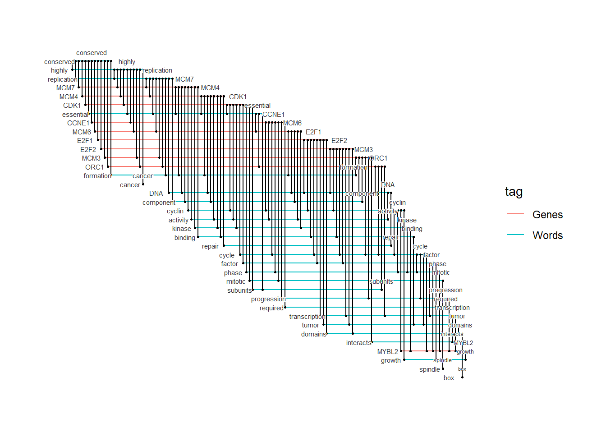

--- 
title: "biotextgraph"
author: "Noriaki Sato"
date: "2023-12-02"
site: bookdown::bookdown_site
documentclass: book
bibliography: [book.bib]
url: https://noriakis.github.io/software/biotextgraph
# cover-image: path to the social sharing image like images/cover.jpg
biblio-style: apalike
csl: chicago-fullnote-bibliography.csl
---

# About

This package aims to visualize the word and text information contained in the gene or the other omics identifiers such as microbiome, and identify important words among the clusters, and compare the clusters based on those information. It contributes to understanding the gene clusters and aid in easy interpretation and visualization. The documentation using bookdown is available [here](https://noriakis.github.io/software/biotextgraph), and the web server using `shinyapps.io` is [here](https://nsato.shinyapps.io/biotextgraphweb/).


The example visualization below shows the annotation of gene cluster network.


```r
library(biotextgraph)
knitr::include_url("https://noriakis.github.io/cyjs_test/wordcloud")
```

<iframe src="https://noriakis.github.io/cyjs_test/wordcloud" width="100%" height="400px" data-external="1" style="border: none;"></iframe>

Another example below shows summarization of 636 genes identified in differential expression analysis by [BioFabric layout](https://biofabric.systemsbiology.net/).


```r
load(system.file("extdata", "sysdata.rda", package = "biotextgraph"))
net <- refseq(d3degUpAssetta2016, numWords=40, tag="cor", genePlot=TRUE)
#> Input genes: 636
#>   Converted input genes: 552
#> Filter based on GeneSummary
#> Filtered 77 words (frequency and/or tfidf)
#> Ignoring corThresh, automatically determine the value
#> threshold = 0
#> Bootstrap (r = 0.5)... Done.
#> Bootstrap (r = 0.6)... Done.
#> Bootstrap (r = 0.7)... Done.
#> Bootstrap (r = 0.8)... Done.
#> Bootstrap (r = 0.9)... Done.
#> Bootstrap (r = 1.0)... Done.
#> Bootstrap (r = 1.1)... Done.
#> Bootstrap (r = 1.2)... Done.
#> Bootstrap (r = 1.3)... Done.
#> Bootstrap (r = 1.4)... Done.
plot_biofabric(net, color_map="tag")
```


