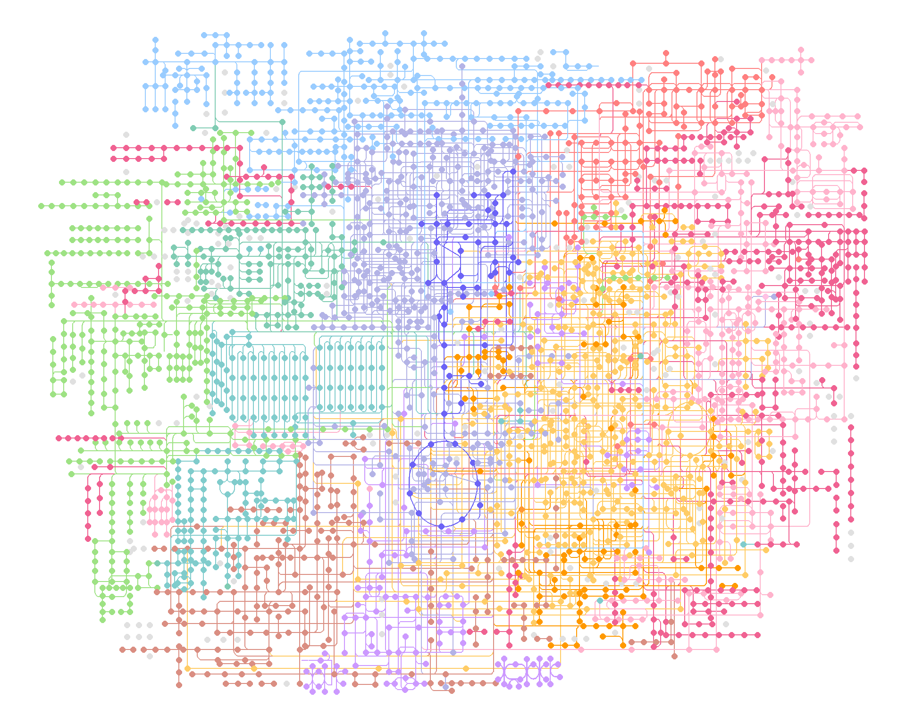

# Pathway

Providing `ggkegg` a pathway ID, it fetches information, parse them and make `ggraph` object. Inside, `parse_kgml` or `pathway` function is used to return `igraph` or `tbl_graph` object. It can be used with all the pathways across organisms listed in KEGG PATHWAY database.
The `pathway` function is a core function that downloads and parses KGML files. If the file already exists in the current working directory, it will not be downloaded again. The function also extracts reactions that are included in the pathway as edges. If there are nodes represented by `type=line`, the function converts these nodes to edges based on their `coords`. This conversion is carried out by the `process_line` function.


```r
library(ggkegg)
library(ggfx)
library(ggraph)
library(igraph)
library(clusterProfiler)
library(dplyr)
library(tidygraph)
```

## Example visualization

This example first fetches `eco00270` and parse the information, convert the pathway and eco identifiers, delete zero degree nodes and returns the `igraph` object.


```r
g <- ggkegg(pid="eco00270",
            convert_org = c("pathway","eco"),
            delete_zero_degree = TRUE,
            return_igraph = TRUE)
gg <- ggraph(g, layout="stress") 
gg$data$type |> unique()
#> [1] "map"      "compound" "gene"
gg + geom_edge_diagonal(
  aes(color=subtype_name,
      filter=type!="maplink"))+
  geom_node_point(
  aes(filter= !type%in%c("map","compound")),
    fill=gg$data[!gg$data$type%in%c("map","compound"),]$bgcolor,
    color="black",
    shape=21, size=4
  )+
  geom_node_point(
    aes(filter= !type%in%c("map","gene")),
    fill=gg$data[!gg$data$type%in%c("map","gene"),]$bgcolor,
    color="black",
    shape=21, size=6
  )+
  geom_node_text(
    aes(label=converted_name,
        filter=type=="gene"),
    repel=TRUE,
    bg.colour="white")+
  theme_void()
```


The x-coordinate, y-coordinate, width, and height described in the KGML are listed as x, y, width, and height. Based on this information, xmin, xmax, ymin, and ymax are calculated and stored in the node table.

## `geom_node_rect`

This package also provides the `geom_node_rect` function, which allows drawing rectangles at specified locations based on mappings of xmin, xmax, ymin, and ymax.

### Assigning colors to nodes

You can set diffent and multiple colors on nodes using `geom_node_rect`. This application is useful when visualizing factors such as log2 fold change among multiple conditions.


```r
g <- pathway("ko00520")
V(g)$color_one <- colorRampPalette(RColorBrewer::brewer.pal(5,"Set1"))(length(V(g)))
V(g)$color_two <- colorRampPalette(RColorBrewer::brewer.pal(5,"Set2"))(length(V(g)))

ggraph(g, x=x, y=y) +
  geom_node_rect(aes(xmin=xmin, xmax=x, fill=I(color_one)), alpha=0.5)+
  geom_node_rect(aes(xmin=x, xmax=xmax, fill=I(color_two)), alpha=0.5)+
  ggfx::with_outer_glow(geom_node_text(aes(label=name |> 
                       strsplit(":") |> 
                       sapply("[", 2) |>
                       strsplit(" ") |>
                       sapply("[", 1),
                     filter=type=="ortholog"),
                     size=2), colour="white", expand=1)
```


It is possible to specify any number of groups.


```r
V(g)$color_one <- colorRampPalette(RColorBrewer::brewer.pal(5,"Set1"))(length(V(g)))
V(g)$color_two <- colorRampPalette(RColorBrewer::brewer.pal(5,"Set2"))(length(V(g)))
V(g)$color_three <- colorRampPalette(RColorBrewer::brewer.pal(5,"PuOr"))(length(V(g)))
V(g)$color_four <- colorRampPalette(RColorBrewer::brewer.pal(5,"Paired"))(length(V(g)))

V(g)$space <- V(g)$width/4

ggraph(g, x=x, y=y) +
  geom_node_rect(aes(xmin=xmin, xmax=xmin+space, fill=I(color_one), filter=type=="ortholog"))+
  geom_node_rect(aes(xmin=xmin+space, xmax=xmin+2*space, fill=I(color_two), filter=type=="ortholog"))+
  geom_node_rect(aes(xmin=xmin+2*space, xmax=xmin+3*space, fill=I(color_three), filter=type=="ortholog"))+
  geom_node_rect(aes(xmin=xmin+3*space, xmax=xmin+4*space, fill=I(color_four), filter=type=="ortholog"))+
  ggfx::with_outer_glow(geom_node_text(aes(label=name |> 
                                             strsplit(":") |> 
                                             sapply("[", 2) |>
                                             strsplit(" ") |>
                                             sapply("[", 1),
                                           filter=type=="ortholog"),
                                       size=2), colour="white", expand=1)+
  theme_void()
```


## `geom_node_shadowtext`

Plot the shadowtext at the `x` and `y` position without enabling `repel=TRUE` in `geom_node_text`.


## Global maps

For global maps, `process_line` function, which makes nodes and edges based on `coords` attributes in KGML, is prepared. However, we cannot obtain and parse directed relationship (`substrate` to `product`, `reversible` or `irreversible`) based on `coords`. If you would like to retain these relationships, `process_reaction` function is prepared.


```r

pathway("ko01200") |> 
    process_reaction() |>
    activate(nodes) |> 
    mutate(x=NULL, y=NULL,
       comp=convert_id("compound")) |>
    mutate(degree=centrality_degree(mode="all")) |>
ggraph(layout="kk")+
    geom_node_point(aes(color=degree,
                        filter=type=="compound"))+
    geom_edge_parallel(
        color="grey",
        end_cap=circle(1,"mm"),
        start_cap=circle(1,"mm"),
        arrow=arrow(length=unit(1,"mm"),type="closed"))+
    geom_node_text(aes(label=comp,filter=degree>15),
                   repel=TRUE, bg.colour="white")+
    theme_graph()
```


## Highlighting set of nodes and edges

If you want to obtain `ko01230`, and highlight those components
involved in `M00002`, and show the corresponding compound names in the map,
we can write as follows using `highligh_set_edges` and `highlight_set_nodes`.


```r
pathway("ko01230") |> 
  process_line() |>
  activate(nodes) |>
  mutate(
    compound=convert_id("compound"),
    M00002=highlight_set_nodes(module("M00002")@reaction_components)) |>
  activate(edges) |>
  mutate(M00002=highlight_set_edges(module("M00002")@definition_components)) |>
  ggraph(x=x, y=y)+
  geom_edge_link()+
  with_outer_glow(geom_edge_link(aes(color=M00002, filter=M00002)),
                  colour="pink")+
  geom_node_point(shape=21,aes(filter=type!="line"))+
  with_outer_glow(geom_node_point(shape=21, aes(filter=M00002, color=M00002)),
                  colour="pink")+
  geom_node_text(aes(label=compound, filter=M00002), repel=TRUE,
                 bg.colour="white", size=2)+
  theme_void()
```


We show the example for highlighting `Metabolic pathways (ko01100)`, using `M00021` definition. `highlight_module` function accepts `kegg_module` class object and return the boolean of which edges are involved in reaction inside module and which nodes are compounds involved in the reaction. Please note that this does not produce exactly the same output as `KEGG mapper`. This adds new columns to the tbl_graph with `TRUE` for nodes and edges that meet the respective conditions.


```r
g <- pathway("ko01100") |> 
  process_line() |>
  highlight_module(module("M00021")) |>
  mutate(compound=convert_id("compound"))

g |> ggraph(x=x, y=y) +
  geom_node_point(size=1, aes(color=I(fgcolor),
    filter=fgcolor!="none" & type!="line"))+
  geom_edge_link(width=0.1, aes(color=I(fgcolor),
                                filter=type=="line"& fgcolor!="none"))+
  with_outer_glow(
    geom_edge_link(width=1,
                   aes(color=I(fgcolor),
                       filter=fgcolor!="none" & M00021)),
    colour="red", expand=3
  )+
  with_outer_glow(
    geom_node_point(size=2,
                   aes(color=I(fgcolor),
                       filter=fgcolor!="none" & M00021)),
    colour="red", expand=3
  )+
  theme_void()
```


Multiple modules involved in Cysteine and methionine metabolism, highlighting `M00017` by `ggforce`.


```r
list_of_modules <- c("M00021","M00338","M00609","M00017","M00034","M00035","M00368")
for (mm in list_of_modules) {
  g <- g |> highlight_module(module(mm))
}

ggraph(g,x=x,y=y,layout="manual") +
  geom_edge_link0(width=0.5, color="grey")+
  geom_edge_link(color="red",aes(filter=M00017|M00021|M00338|M00609|M00034|M00035|M00368))+
geom_node_point(size=2, color="red",aes(filter=M00017|M00021|M00338|M00609|M00034|M00035|M00368))+
  ggforce::geom_mark_rect(aes(fill=M00017,
                              label=module("M00017")@name,
                              x=x, y=y,
                              group=M00017,
                              filter=M00017),
                          label.fill = "transparent",
                          label.fontsize = 10,
                          expand=unit(1,"mm"))+
  theme_void()
```


When visualizing information about compounds, it is recommended to use `geom_node_text`, `ggrepel`, and `shadowtext`.


```r
g |> ggraph(x=x, y=y) +
  geom_node_point(size=1, aes(color=I(fgcolor),
    filter=fgcolor!="none" & type!="line"))+
  geom_edge_link(width=0.1, aes(color=I(fgcolor),
                                filter=type=="line"& fgcolor!="none"))+
  with_outer_glow(
    geom_edge_link(width=1,
                   aes(color=I(fgcolor),
                       filter=fgcolor!="none" & M00021)),
    colour="red", expand=3
  )+
  with_outer_glow(
    geom_node_point(size=2,
                   aes(color=I(fgcolor),
                       filter=fgcolor!="none" & M00021)),
    colour="red", expand=3
  )+
    geom_node_text(aes(label=compound, filter=M00021),
                   repel=TRUE, bg.colour="white", size=5)+
  theme_void()
```


If necessary, it is possible to visualize what information is included in the highlighted pathway and place it on the original map using the `annotation_custom` function. In this example, an annotation ggplot is first created and then converted to a grob using `ggplotify`. The grob is then drawn at any desired position.


```r

annot <- g |>  ggraph(x=x, y=y)+
  with_outer_glow(
    geom_edge_link(width=1,
                   aes(color=I(fgcolor),
                       filter=fgcolor!="none" & M00021)),
    colour="red", expand=3
  )+
  with_outer_glow(
    geom_node_point(size=2,
                    aes(color=I(fgcolor),
                        filter=fgcolor!="none" & M00021)),
    colour="red", expand=3
  )+
    geom_node_text(aes(label=compound, filter=M00021),
                   repel=TRUE, bg.colour="white", size=5)
g |>
  ggraph(x=x, y=y) +
  geom_node_point(size=1, aes(color=I(fgcolor),
                              filter=fgcolor!="none" & type!="line"))+
  geom_edge_link(width=0.1, aes(color=I(fgcolor),
                                filter=type=="line"& fgcolor!="none"))+
  with_outer_glow(
    geom_edge_link(width=1,
                   aes(color=I(fgcolor),
                       filter=fgcolor!="none" & M00021)),
    colour="red", expand=3
  )+
  with_outer_glow(
    geom_node_point(size=2,
                    aes(color=I(fgcolor),
                        filter=fgcolor!="none" & M00021)),
    colour="red", expand=3
  )+
  annotation_custom(ggplotify::as.grob(annot),
    ymin=-1500, ymax=0, xmin=0, xmax=1500)+ ## your desired position
  theme_void()
```


It is also possible to highlight any desired edges or nodes. In this case, the `highlight_set_edges` and `highlight_set_nodes` functions are used within `mutate` to generate a new column containing a boolean indicating whether the specified IDs are included or not. We can highlight those nodes or edges in the desired geoms. When `how` is set to `all`, `TRUE` is returned only if all the IDs included in the query are included in the node. When `how` is set to `any`, `TRUE` is returned if any of the IDs included in the query are included in the node.


```r

gg <- g |> activate(edges) |> 
  mutate(highlight=highlight_set_edges(c("ko:K00790","ko:K00789")))
gg |>
  ggraph(x=x, y=y) + geom_edge_link(width=0.1, aes(filter=fgcolor!="none",
                                                   color=I(fgcolor))) + 
  with_outer_glow(geom_edge_link(width=1, aes(filter=highlight,
   color=I(fgcolor))), colour="red", expand=3) + theme_graph()
```


An example of highlighting combined with the `graphhighlight`:


```r
library(graphhighlight)
g |> ggraph(x=x, y=y) +
  geom_edge_link(width=0.5, aes(color=I(fgcolor), filter=fgcolor!="none")) +
  geom_node_point(size=1, aes(color=I(fgcolor), filter=fgcolor!="none" & type!="line"))+
  highlight_node(glow=TRUE, filter=fgcolor!='none' & type!='line',
                 glow_base_size=TRUE,glow_size=0.5)+
  theme_void()
```


When visualizing large maps such as global and overview maps, it is better to use `geom_edge_link0`, as described in the documentation of ggraph `geom_edge_*`. Moreover, for nodes, combining the scattermore package's `geom_scattermore` with ggraph's `StatFilter` allows for faster rendering.


```r
st <- Sys.time()
ggraph(g, x=x, y=y) +geom_edge_link0(aes(color=I(fgcolor)))+
  scattermore::geom_scattermore(pointsize=1, stat=StatFilter,
    aes(x=x, y=y, color=I(fgcolor),
    filter=type!="map"))+theme_void()
```


```r
ed <- Sys.time()
ed-st
#> Time difference of 0.4859622 secs

st <- Sys.time()
ggraph(g, x=x, y=y) +geom_edge_link(aes(color=I(fgcolor)))+
  geom_node_point(size=2, aes(color=I(fgcolor),
    filter=type!="map"))+theme_void()
```



```r
ed <- Sys.time()
ed-st
#> Time difference of 19.0965 secs
```


## Overlaying original KEGG pathway images on ggraph

Using `magick`, you can overlay the original KEGG pathway image on the graph you made (or add components on the original image). The package provides overlay_raw_map function, which allows mapping a raster image onto the graph by specifying the pathway ID and the color to be made transparent.


```r
g <- pathway("ko00640",group_rect_nudge=0) ## Obtain pathway graph (don't show grouping rect)
gg <- ggraph(g, layout="manual", x=x, y=y)+
  geom_node_point(aes(filter=type=="compound"), color="blue", size=2)+
  geom_node_rect(fill="red",aes(filter=type=="ortholog"))+
  overlay_raw_map("ko00640")+
  theme_void()
gg
```


You can use your favorite geoms to annotate KEGG map combining the functions.


```r
m <- module("M00013")
g <- g |> mutate(mod=highlight_set_nodes(m@reaction_components,how="all"))
gg <- ggraph(g, layout="manual", x=x, y=y)+
  geom_node_rect(fill="grey",aes(filter=type=="ortholog"))+
  geom_node_point(aes(filter=type=="compound"), color="blue", size=2)+
  overlay_raw_map("ko00640")+
  ggfx::with_outer_glow(geom_node_point(aes(filter=mod, x=x, y=y), color="red",size=2),
                        colour="yellow",expand=5)+
  theme_void()
gg
```


## Group of nodes

The groups are specified in the KGML with type="group". The pathway function adds edges linking the group ID and component ID, allowing the visualization of groups in the layout other than those specified in the KGML. The edges mentioned are specified with the type `in_group`.


```r
g <- pathway("hsa03460") |> mutate(conv=convert_id("hsa"))
g <- delete_vertex_attr(g, "x")
g <- delete_vertex_attr(g, "y")
ggraph(g, layout = "nicely") +
  geom_node_point(aes(filter=type=="gene" | type=="group"), color="black") +
  geom_edge_link(aes(color=subtype_name),end_cap=circle(2,"mm"),
                 start_cap=circle(2,"mm"),
                     label_dodge = unit(2,"mm"))+
  geom_node_text(aes(label=conv), repel=TRUE, bg.colour="white")+
  theme_void()
```


## Combining multiple pathways in their native layouts

Combining multiple pathways using their native layouts is possible by mutating the nodes' positions or contracting multiple graphs.


```r

## Mutate X position for the first graph
g1 <-pathway("ko00640")
pos <- g1 |> activate(nodes) |> data.frame() |> summarise(min=min(y))
g1_mut <- g1 |> activate(nodes) |> mutate(x=x/max(x))

## Mutate Y position and x position for the second graph
g2 <-pathway("ko00620")
g2_mut <- g2 |> activate(nodes) |> mutate(y=y+pos$min, x=x/max(x))
joined_raw <- graph_join(g1_mut, g2_mut)
joined_name <- graph_join(g1_mut, g2_mut, by=c("name","x","y"))

## Group by node names and take attribute of first rows
## For edges, combine reaction
newg <- joined_raw |>
  convert(to_contracted, name) |>
  activate(nodes) |>
  mutate(purrr::map_vec(.orig_data, function(x) x[1,]))|>
  activate(edges) |>
  mutate(reaction=purrr::map_vec(.orig_data, 
                                 function(x) paste0(unique(x$reaction),
                                                    collapse=",")),
         subtype_name=purrr::map_vec(.orig_data, 
                                 function(x) unique(x$subtype_name)))
```


```r
## Highlight the cpd:C00024 node for normal-joined, and contracted graph by name
## Blue color indicates occurrence in both pathway

## Normal joined
joined_name |> morph(to_contracted, name) |> 
  activate(nodes) |>
  mutate(occ=purrr::map_vec(.orig_data, function(x) dim(x)[1])) |> 
  unmorph() |>
  ggraph(layout="manual", x=x, y=y) + 
  geom_edge_link0(width=0.1, aes(color=subtype_name,
                                 filter=subtype_name %in% c("substrate","product")))+
  geom_node_point() +
  geom_node_point(color="blue", aes(filter=occ>1))+
  graphhighlight::highlight_node(filter=name=="cpd:C00024", glow=TRUE,
                                 highlight_color = "red")+
  theme_void()
```


```r

## Contracted
newg |> 
  activate(nodes) |> mutate(
    ko=convert_id("ko"),
    occ=purrr::map_vec(.orig_data, function(x) dim(x)[1])) |>
ggraph(layout="manual", x=x, y=y) + 
  geom_edge_link0(width=0.1, aes(color=subtype_name,
                                 filter=subtype_name %in% c("substrate","product")))+
  geom_node_point()+
  geom_node_point(color="blue", aes(filter=occ>1)) + 
  geom_node_point(color="red", aes(filter=name=="cpd:C00024"))+
  graphhighlight::highlight_node(filter=name=="cpd:C00024", glow=TRUE,
                                 highlight_color = "red")+
  geom_node_text(size=1.5, family="serif", repel=TRUE, bg.colour="white",
                 aes(label=ko, filter=type=="ortholog"))+
  theme_void()
```


### `multi_pathway_native`

By employing the `multi_pathway_native` function, one can array multiple native KGML layouts on a panel. In conjunction with `to_contracted`, it becomes feasible to examine the relationships of genes across various pathways.


```r
pathways <- c("hsa04110","hsa03460")
multig <- multi_pathway_native(pathways, row_num=2)

multig |>
  ggraph(layout="manual", x=x, y=y)+
  geom_edge_parallel(alpha=0.2,
                 arrow=arrow(length=unit(1,"mm")),
                 start_cap=circle(5,"mm"),
                 end_cap=circle(5,"mm"))+
  geom_node_point(aes(color=pathway_id))+
  theme_void()
```


## Visualize the result of `enrichKEGG` and `gseKEGG`

The library can directly visualize the functional enrichment analysis result using `enrichKEGG` from `clusterProfiler`. The `enrich_attribute` will have boolean value whether the investigated gene is in pathway or not. By piping a `enrichResult` class object and `pathway_number` to `ggkegg`, `enrich_attribute` will be included in the resulting graph. Highlight `enrich_attribute` in the resulting graph. For a quick inspection, `rawMap` function can be used for simply producing highlighted graph with overlaid KEGG raw map.


```r
data(geneList, package='DOSE')
de <- names(geneList)[1:100]
enrichKEGG(de, pvalueCutoff=0.01) |>
  ggkegg(convert_org = "hsa",
         pathway_number=1) +
    geom_edge_link(
    aes(color=subtype_name),
    arrow = arrow(length = unit(1, 'mm')), 
    start_cap = square(1, 'cm'),
    end_cap = square(1.5, 'cm')) + 
    geom_node_rect(aes(filter=.data$undefined & !.data$type=="gene"),
                   fill="transparent", color="red")+
    geom_node_rect(aes(filter=!.data$undefined &
                         .data$type=="gene"), fill="white", color="black")+
    geom_node_text(aes(label=converted_name,
                       filter=.data$type == "gene"),
                   size=2.5,
                   color="black",family="serif")+
    with_outer_glow(geom_node_text(aes(label=converted_name,
                                       filter=.data$enrich_attribute),
                                   size=2.5, color="red"),
                    colour="white",
                    expand=4)+
    theme_void()
```


```r


## Quick inspection
res <- enrichKEGG(de, pvalueCutoff=0.01) |> rawMap()
res
```


`rawMap` can accept multiple `enrichResult` class objects, given by list. In this case, users can choose which color to highlight the components in the list by specifying multiple colors in `fill_color`. Also, you should specify pathway ID for multiple enrichment results.


```r
deres <- enrichKEGG(de, pvalueCutoff=0.01) 
res <- rawMap(list(deres, deres, deres), fill_color=c("red","green","blue"), pid="hsa04110")
res
```


`rawMap` also accepts `gseaResult` class, although it may be useful for assigning numeric values such as log2 fold changes directly.


```r
data(geneList, package="DOSE")
kk <- gseKEGG(geneList)
res <- rawMap(kk)
res
```


The same can be done for the numeric values using `rawValue`. You can control your favorite color gradient using `scale_fill_gradient2`. Note if multiple named vectors were passed by a list, the same scale is used. It can be customized by adding the additional scales using the package such as [`ggh4x`](https://github.com/teunbrand/ggh4x).


```r
res <- rawValue(geneList[1:100], "hsa04110", auto_add=TRUE)
res
```


## Using multiple scales when highlighting multiple values in pathway

Using `ggh4x`, you can plot the multiple values in its own scale using `scale_fill_multi()`. It is used in the package `plotKEGGPathway` in `stana` package for intra-species diversity analysis. For usage in the function, please refer to [`ggh4x`](https://github.com/teunbrand/ggh4x) site and [the code](https://github.com/noriakis/stana/blob/main/R/plotKEGGPathway.R).


```r
library(ggh4x)
test <- geneList[1:100]
names(test) <- paste0("hsa:",names(test))
g <- pathway("hsa04110") |> 
  mutate(value1=node_numeric(test),
         value2=node_numeric(test),
         value3=node_numeric(test),
         value4=node_numeric(test))
res <- ggraph(g) + 
  geom_node_rect(aes(value1=value1)) + 
  geom_node_rect(aes(value2=value2, xmin=xmin+width/4))+
  geom_node_rect(aes(value3=value3, xmin=xmin+2*width/4))+
  geom_node_rect(aes(value4=value4, xmin=xmin+3*width/4))+
  overlay_raw_map() + theme_void() +
  scale_fill_multi(aesthetics = c("value1", "value2",
                                  "value3", "value4"),
                   name = list("Condition1",
                               "Condition2",
                               "Condition3",
                               "Condition4"),
                   colours = list(
                     scales::brewer_pal(palette = "YlGnBu")(6),
                     scales::brewer_pal(palette = "RdPu")(6),
                     scales::brewer_pal(palette = "PuOr")(6),
                     scales::brewer_pal(palette = "RdBu")(6)
                   ),
                   guide = guide_colorbar(barheight = unit(50, "pt")))
res
```


