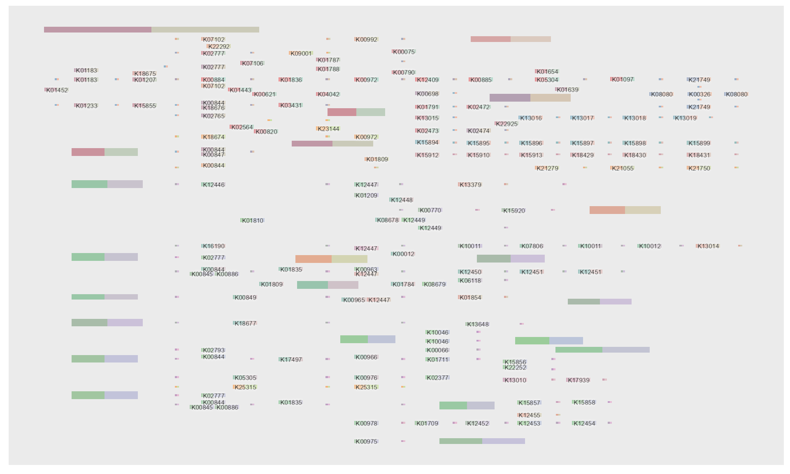
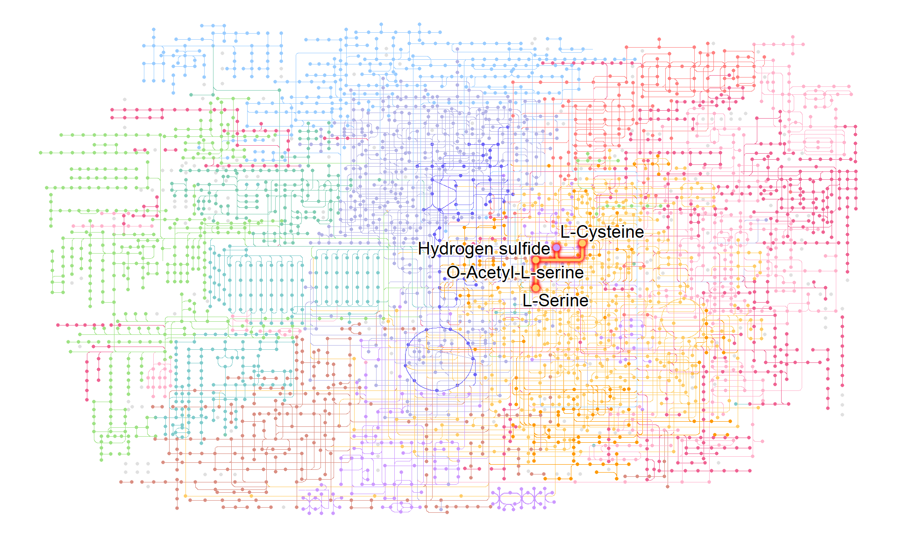
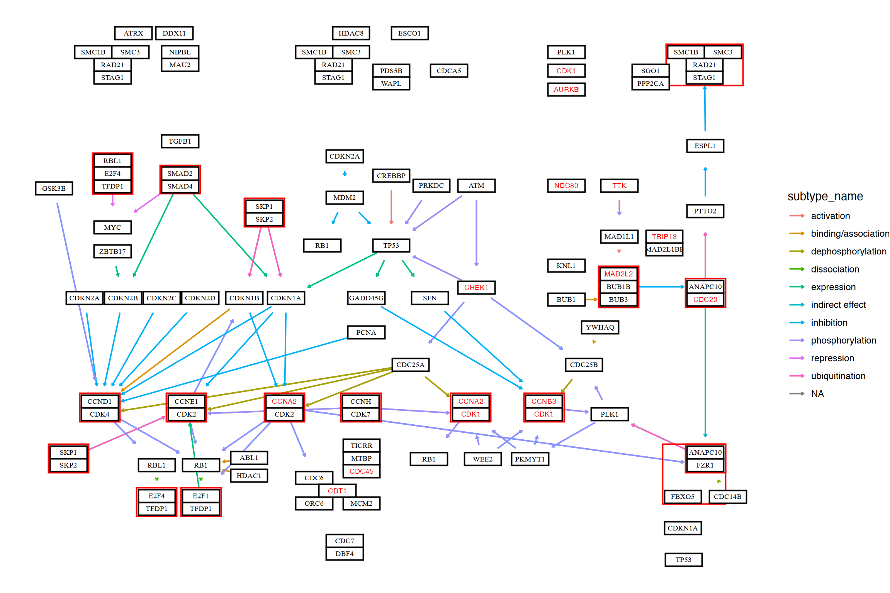

# Pathway

Providing `ggkegg` a pathway ID, it fetches information, parse them and make `ggraph` object. Inside, `parse_kgml` or `pathway` function is used to return `igraph` or `tbl_graph` object.  
The `pathway` function is a core function that downloads and parses KGML files. If the file already exists in the current working directory, it will not be downloaded again. The function also extracts reactions that are included in the pathway as edges. If there are nodes represented by type=line, the function converts these nodes to edges based on their coords. This conversion is carried out by the process_line function.


```r
library(ggkegg)
library(ggfx)
library(ggraph)
library(igraph)
library(clusterProfiler)
library(dplyr)
library(tidygraph)
```

This example first fetches `eco00270` and parse the information, convert the pathway and eco identifiers, delete zero degree nodes returns the `igraph` object.


```r
g <- ggkegg(pid="eco00270",
            convert_org = c("pathway","eco"),
            delete_zero_degree = TRUE,
            return_igraph = TRUE)
gg <- ggraph(g, layout="stress") 
gg$data$type |> unique()
#> [1] "map"      "compound" "gene"
gg + geom_edge_diagonal(
  aes(color=subtype,
      filter=type!="maplink"))+
  geom_node_point(
  aes(filter= !type%in%c("map","compound")),
    fill=gg$data[!gg$data$type%in%c("map","compound"),]$bgcolor,
    color="black",
    shape=21, size=4
  )+
  geom_node_point(
    aes(filter= !type%in%c("map","gene")),
    fill=gg$data[!gg$data$type%in%c("map","gene"),]$bgcolor,
    color="black",
    shape=21, size=6
  )+
  geom_node_text(
    aes(label=converted_name,
        filter=type=="gene"),
    repel=TRUE,
    bg.colour="white")+
  theme_void()
```


## geom_node_rect

This package also provides the `geom_node_rect` function, which allows drawing rectangles at specified locations based on mappings of xmin, xmax, ymin, and ymax.

### Assigning colors to nodes

You can set diffent and multiple colors on nodes using `geom_node_rect`. This application is useful when visualizing factors such as log2 fold change among multiple conditions.


```r
g <- pathway("ko00520")
V(g)$color_one <- colorRampPalette(RColorBrewer::brewer.pal(5,"Set1"))(length(V(g)))
V(g)$color_two <- colorRampPalette(RColorBrewer::brewer.pal(5,"Set2"))(length(V(g)))

ggraph(g, x=x, y=y) +
  geom_node_rect(aes(xmin=xmin, xmax=x, fill=I(color_one)), alpha=0.5)+
  geom_node_rect(aes(xmin=x, xmax=xmax, fill=I(color_two)), alpha=0.5)+
  ggfx::with_outer_glow(geom_node_text(aes(label=name |> 
                       strsplit(":") |> 
                       sapply("[", 2) |>
                       strsplit(" ") |>
                       sapply("[", 1),
                     filter=type=="ortholog"),
                     size=2), colour="white", expand=1)
```




## Highlighting set of nodes and edges

If you want to obtain `ko01230`, and highlight those components
involved in `M00002`, and show the corresponding compound names in the map,
we can write as follows using `highligh_set_edges` and `highlight_set_nodes`.


```r
pathway("ko01230") |> 
  process_line() |>
  activate(nodes) |>
  mutate(
    compound=convert_id("compound"),
    M00002=highlight_set_nodes(module("M00002")@reaction_components)) |>
  activate(edges) |>
  mutate(M00002=highlight_set_edges(module("M00002")@definition_components)) |>
  ggraph(x=x, y=y)+
  geom_edge_link()+
  with_outer_glow(geom_edge_link(aes(color=M00002, filter=M00002)),
                  colour="pink")+
  geom_node_point(shape=21,aes(filter=type!="line"))+
  with_outer_glow(geom_node_point(shape=21, aes(filter=M00002, color=M00002)),
                  colour="pink")+
  geom_node_text(aes(label=compound, filter=M00002), repel=TRUE,
                 bg.colour="white", size=2)+
  theme_void()
```


Also the example for highlighting `Metabolic pathways (ko01100)`, using `M00021` definition. `highlight_module` function accepts `kegg_module` class object and return the boolean of which edges are involved in reaction inside module and which nodes are compounds involved in the reaction. Please note that this does not produce exactly the same output as `KEGG mapper`. Internally, `higlight_module_compound` and `highlight_module_reaction` are utilized, which add new columns to the tbl_graph with TRUE for nodes and edges that meet the respective conditions.


```r
g <- pathway("ko01100") |> 
  process_line() |>
  highlight_module(module("M00021")) |>
  mutate(compound=convert_id("compound"))

g |> ggraph(x=x, y=y) +
  geom_node_point(size=1, aes(color=I(fgcolor),
    filter=fgcolor!="none" & type!="line"))+
  geom_edge_link(width=0.1, aes(color=I(fgcolor),
                                filter=type=="line"& fgcolor!="none"))+
  with_outer_glow(
    geom_edge_link(width=1,
                   aes(color=I(fgcolor),
                       filter=fgcolor!="none" & M00021)),
    colour="red", expand=3
  )+
  with_outer_glow(
    geom_node_point(size=2,
                   aes(color=I(fgcolor),
                       filter=fgcolor!="none" & M00021)),
    colour="red", expand=3
  )+
  theme_void()
```


When visualizing information about compounds, it is recommended to use `geom_node_text`, `ggrepel`, and `shadowtext`.


```r
g |> ggraph(x=x, y=y) +
  geom_node_point(size=1, aes(color=I(fgcolor),
    filter=fgcolor!="none" & type!="line"))+
  geom_edge_link(width=0.1, aes(color=I(fgcolor),
                                filter=type=="line"& fgcolor!="none"))+
  with_outer_glow(
    geom_edge_link(width=1,
                   aes(color=I(fgcolor),
                       filter=fgcolor!="none" & M00021)),
    colour="red", expand=3
  )+
  with_outer_glow(
    geom_node_point(size=2,
                   aes(color=I(fgcolor),
                       filter=fgcolor!="none" & M00021)),
    colour="red", expand=3
  )+
    geom_node_text(aes(label=compound, filter=M00021),
                   repel=TRUE, bg.colour="white", size=5)+
  theme_void()
```


If necessary, it is possible to visualize what information is included in the highlighted pathway and place it on the original map using the annotation_custom function. In this example, an annotation ggplot is first created and then converted to a grob using ggplotify. The grob is then drawn at any desired position.


```r

annot <- g |>  ggraph(x=x, y=y)+
  with_outer_glow(
    geom_edge_link(width=1,
                   aes(color=I(fgcolor),
                       filter=fgcolor!="none" & M00021)),
    colour="red", expand=3
  )+
  with_outer_glow(
    geom_node_point(size=2,
                    aes(color=I(fgcolor),
                        filter=fgcolor!="none" & M00021)),
    colour="red", expand=3
  )+
    geom_node_text(aes(label=compound, filter=M00021),
                   repel=TRUE, bg.colour="white", size=5)
g |>
  ggraph(x=x, y=y) +
  geom_node_point(size=1, aes(color=I(fgcolor),
                              filter=fgcolor!="none" & type!="line"))+
  geom_edge_link(width=0.1, aes(color=I(fgcolor),
                                filter=type=="line"& fgcolor!="none"))+
  with_outer_glow(
    geom_edge_link(width=1,
                   aes(color=I(fgcolor),
                       filter=fgcolor!="none" & M00021)),
    colour="red", expand=3
  )+
  with_outer_glow(
    geom_node_point(size=2,
                    aes(color=I(fgcolor),
                        filter=fgcolor!="none" & M00021)),
    colour="red", expand=3
  )+
  annotation_custom(ggplotify::as.grob(annot),
    ymin=-1000, ymax=0, xmin=0, xmax=1000)+ ## your desired position
  theme_void()
```


## Visualize the result of `enrichKEGG`

The library can directly visualize the functional enrichment analysis result using `enrichKEGG` from `clusterProfiler`. The `enrich_attribute` will have boolean value whether the investigated gene is in pathway or not. By piping a `enrichResult` class object and `pathway_number` to `ggkegg`, `enrich_attribute` will be included in the resulting graph. Highlight `enrich_attribute` in the resulting graph.


```r
data(geneList, package='DOSE')
de <- names(geneList)[1:100]
enrichKEGG(de, pvalueCutoff=0.01) |>
  ggkegg(convert_org = "hsa",
         pathway_number=1) +
    geom_edge_link(
    aes(color=subtype),
    arrow = arrow(length = unit(1, 'mm')), 
    start_cap = square(1, 'cm'),
    end_cap = square(1.5, 'cm')) + 
    geom_node_rect(aes(filter=.data$undefined & !.data$type=="gene"),
                   fill="transparent", color="red")+
    geom_node_rect(aes(filter=!.data$undefined &
                         .data$type=="gene"), fill="white", color="black")+
    geom_node_text(aes(label=converted_name,
                       filter=.data$type == "gene"),
                   size=2.5,
                   color="black",family="serif")+
    with_outer_glow(geom_node_text(aes(label=converted_name,
                                       filter=.data$enrich_attribute),
                                   size=2.5, color="red"),
                    colour="white",
                    expand=4)+
    theme_void()
```


