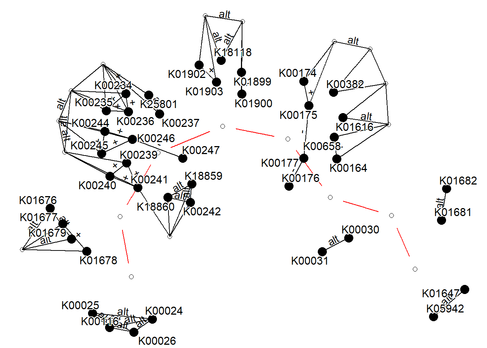
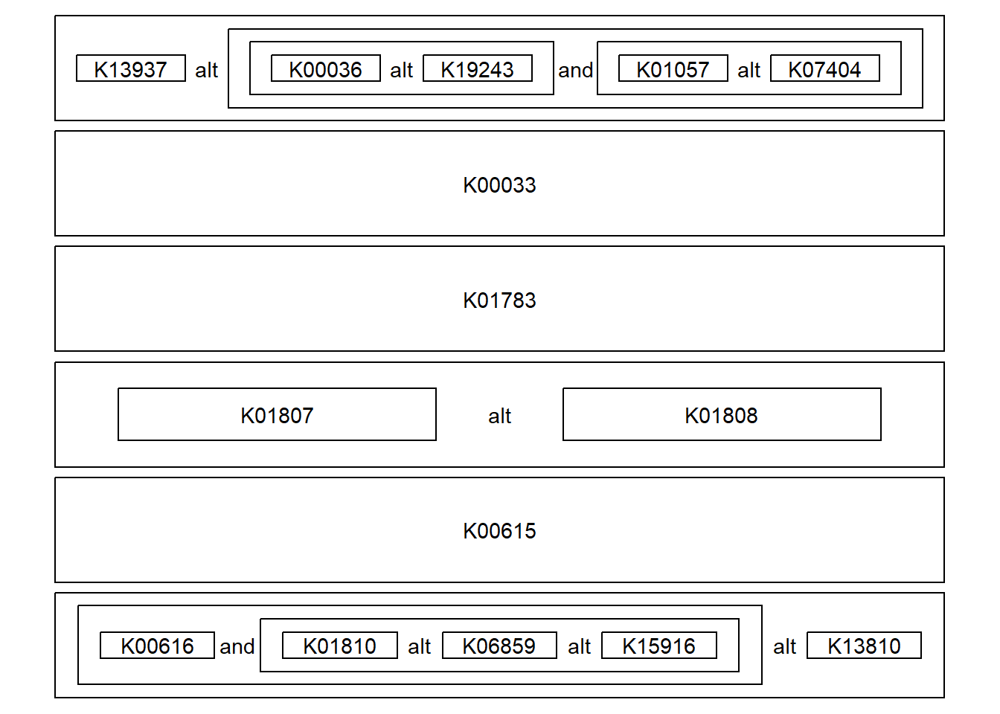
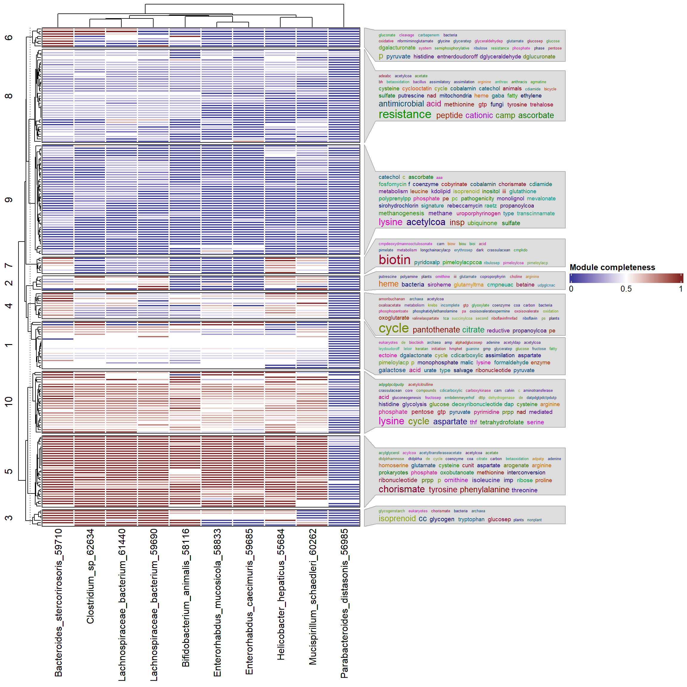

# Module

Module information can be obtained and parsed. Parsing `DEFINITION` and `REACTION` is supported. For the definition, first the function breaks down the definition to blocks, and make graphical representation using `ggraph` and `tbl_graph` or text itself using `geom_text` and `geom_rect`. By calling `module` function, `kegg_module` class object is created.


``` r
library(ggkegg)
library(tidygraph)
library(dplyr)
mod <- module("M00004")
mod
#> M00004
#> Pentose phosphate pathway (Pentose phosphate cycle)
```

The `module` function creates an object of the `kegg_module` class, which stores the parsed information of reactions and definitions in its internal slots. By providing this `kegg_module` object to various functions, it is possible to execute various operations related to the module.

Visualizing the reactions in the module. Please report any reaction that cannot be properly parsed this way.


``` r
library(igraph)
mod <- module("M00004")
## Obtain reaction graph
reacg <- attr(mod, "reaction_graph") # or, get_module_attribute()
## Some edges are duplicate and have different reactions,
## so simplify
reacg |>
    convert(to_simple) |>
    activate(edges) |> 
    mutate(reaction=lapply(.orig_data,
        function(x) 
            paste0(unique(x[["reaction"]]),
                collapse=","))) |>
    ggraph()+
        geom_node_point()+
        geom_edge_parallel(
            aes(label=reaction), angle_calc = "along",
            label_dodge = unit(5,"mm"),
            label_colour = "tomato",
            arrow = arrow(length = unit(1, 'mm')),
            end_cap = circle(5, 'mm'),
            start_cap = circle(5, "mm"))+
        geom_node_text(aes(label=name), repel=TRUE,
            bg.colour="white", size=4)+
        theme_void()
```


## Module definition in graph

We can visualize the module definition in the graph. This will make grouping nodes and nodes leading to the nodes connected with `AND` argument ('+' and ' '), and connect the definition. In the example below, the wrapper function plot_module_blocks() visualizes the definitions of each module. Red represents AND relationships, while other relationships (such as compound or OR) are expressed as edge labels.


``` r
module("M00009") |>
  obtain_sequential_module_definition() |> ## return tbl_graph
  plot_module_blocks() ## wrapper function
```



## Module definition in text

We can also visualize the module definition in text.


``` r
module("M00004") |>
  module_text() |> ## return data.frame
  plot_module_text() ## wrapper function
```



## Module completeness

Given a vector of interesting KOs, module completeness can be calculated using boolean expression.


``` r
mod <- module("M00009")
query <- sample(attr(mod, "definition_components"), 5) |>
  strsplit(":") |>
  sapply("[",2)
query
#> [1] "K00031" "K00241" "K01678" "K00236" "K00030"
```

``` r
mod |>
  module_completeness(query) |>
  kableExtra::kable()
```


|block                                                                                                          | all_num| present_num|     ratio|complete |
|:--------------------------------------------------------------------------------------------------------------|-------:|-----------:|---------:|:--------|
|(K01647,K05942)                                                                                                |       2|           0| 0.0000000|FALSE    |
|(K01681,K01682)                                                                                                |       2|           0| 0.0000000|FALSE    |
|(K00031,K00030)                                                                                                |       2|           2| 1.0000000|TRUE     |
|((K00164+K00658,K01616)+K00382,K00174+K00175-K00177-K00176)                                                    |       8|           0| 0.0000000|FALSE    |
|(K01902+K01903,K01899+K01900,K18118)                                                                           |       5|           0| 0.0000000|FALSE    |
|(K00234+K00235+K00236+(K00237,K25801),K00239+K00240+K00241-(K00242,K18859,K18860),K00244+K00245+K00246-K00247) |      15|           2| 0.1333333|FALSE    |
|(K01676,K01679,K01677+K01678)                                                                                  |       4|           1| 0.2500000|FALSE    |
|(K00026,K00025,K00024,K00116)                                                                                  |       4|           0| 0.0000000|FALSE    |


### Assessing module completeness across multiple microbial genomes

For instance, we can assess completeness from KOs inferred from multiple species genome. Here, we mapped EC numbers available in the annotation file in `MIDAS` pipeline, which is obtained from PATRIC server, to KOs and calculate completeness for randomly obtained species.


```r
## Load pre-computed KOs, and recursively perform completeness calculation.
mf <- list.files("../")
mf <- mf[startsWith(mf, "M")]
annos <- list()

candspid <- list.files("../species_dir")
candspid <- sample(candspid, 10)

## Obtain EC to KO mapping file from KEGG REST API
mapper <- data.table::fread("https://rest.kegg.jp/link/ec/ko", header=FALSE)

suppressMessages(
  for (i in candspid) {
    mcs <- NULL
    df <- read.table(paste0("../species_dir/",i), sep="\t", header=1)
    fid <- paste0("ec:",df[df$ontology=="ec",]$function_id)
    kos <- mapper[mapper$V2 %in% fid,]$V1 |> strsplit(":") |> sapply("[",2) |> unique()
    for (mid in mf) {
      mc <- module_completeness(module(mid, directory="../"),
                                query = kos)
      mcs <- c(mcs, mc$complete |> mean()) ## Mean of blocks
    }
    annos[[as.character(i)]] <- mcs
  }
)
```

We will next visualize the results using `ComplexHeatmap` and `simplifyEnrichment`. We will plot the word cloud of module description alongside heatmap by `simplifyEnrichment`, for determined clusters.


``` r
library(ComplexHeatmap)

## Make data.frame
hdf <- data.frame(annos, check.names=FALSE)
row.names(hdf) <- mf
hdf[is.na(hdf)] <- 0
hdf <- hdf[apply(hdf, 1, sum)!=0,]

## Prepare for word cloud annotation
moddesc <- data.table::fread("https://rest.kegg.jp/list/module", header=FALSE)

## Obtain K-means clustering
km = kmeans(hdf, centers = 10)$cluster

gene_list <- split(row.names(hdf), km)
gene_list <- lapply(gene_list, function(x) {
  x[!is.na(x)]
})

annotList <- list()
for (i in names(gene_list)) {
  maps <- (moddesc |> dplyr::filter(V1 %in% gene_list[[i]]))$V2
  annotList[[i]] <-  maps
}
```


``` r

col_fun = circlize::colorRamp2(c(0, 0.5, 1),
                               c(scales::muted("blue"), "white", scales::muted("red")))

ht1 <- Heatmap(hdf, show_column_names = TRUE,
               col=col_fun, row_split=km,
               heatmap_legend_param = list(
                 legend_direction = "horizontal", 
                 legend_width = unit(5, "cm")
               ),
               rect_gp = gpar(col = "white", lwd = 2),
               name="Module completeness", border=TRUE,
               column_names_max_height =unit(10,"cm"))+
  rowAnnotation(
    keywords = simplifyEnrichment::anno_word_cloud(align_to = km,
                                                   term=annotList,
                                                   exclude_words=c("pathway","degradation",
                                                                   "biosynthesis"),
                                                   max_words = 40,fontsize_range = c(5,20))
  )
ht1
```




## Module abundance and pathway abundance calculation


``` r
vec <- c(0.1, 0.5)
names(vec) <- c("K00234","K01676")
module_abundance("M00009", vec)
#> [1] 0.3947368
```

## Visualize the result of `enricher`

If you performed some experiments involving KEGG Orthology, and performed enrichment analysis on KO to module relationship, `ggkegg` function accepts the results and plot text-based or network-based graph where KOs are highlighted.


``` r
library(BiocFileCache)
#> Loading required package: dbplyr
#> 
#> Attaching package: 'dbplyr'
#> The following objects are masked from 'package:dplyr':
#> 
#>     ident, sql
```

``` r
library(clusterProfiler)
#> clusterProfiler v4.12.2 Learn more at https://yulab-smu.top/contribution-knowledge-mining/
#> 
#> Please cite:
#> 
#> Guangchuang Yu, Li-Gen Wang, Yanyan Han and Qing-Yu
#> He. clusterProfiler: an R package for comparing
#> biological themes among gene clusters. OMICS: A
#> Journal of Integrative Biology 2012, 16(5):284-287
#> 
#> Attaching package: 'clusterProfiler'
#> The following object is masked from 'package:igraph':
#> 
#>     simplify
#> The following object is masked from 'package:stats':
#> 
#>     filter
```

``` r

## Download and cache KO to module relationship
url <- paste0("https://rest.kegg.jp/link/ko/module")
bfc <- BiocFileCache()
path <- bfcrpath(bfc, url)
module.bg <- apply(data.table::fread(path), 2, function(x) sapply(strsplit(x, ":"), "[",2))|> data.frame()|>`colnames<-`(c("term","gene"))

## Using the table, perform enrichment analysis.
mod.enrich <- enricher(c("K00431","K00832"), TERM2GENE=module.bg)

## Visualize using ggkegg
dd <- ggkegg(mod.enrich)
dd
```


