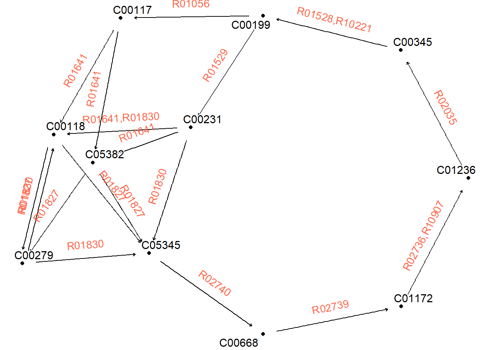

# Module

Module information can be obtained and parsed. Parsing `DEFINITION` and `REACTION` is supported. For the definition, first the function breaks down the definition to blocks, and make graphical representation using `ggraph` and `tbl_graph` or text itself using `geom_text` and `geom_rect`. By calling `module` function, `kegg_module` class object is created.


```r
library(ggkegg)
library(tidygraph)
library(dplyr)
mod <- module("M00004")
mod
#> M00004
#> Pentose phosphate pathway (Pentose phosphate cycle)
```

The `module` function creates an object of the `kegg_module` class, which stores the parsed information of reactions and definitions in its internal slots. By providing this `kegg_module` object to various functions, it is possible to execute various operations related to the module.

Visualizing the reactions in the module. Please report any reaction that cannot be properly parsed this way.


```r
library(igraph)
mod <- module("M00004")

## Some edges are duplicate and have different reactions,
## so simplify
mod@reaction_graph |> 
  convert(to_simple) |>
  activate(edges) |> 
  mutate(reaction=lapply(.orig_data,
                         function(x) 
                           paste0(unique(x[["reaction"]]),
                                  collapse=","))) |>
  ggraph()+
    geom_node_point()+
    geom_edge_parallel(
      aes(label=reaction), angle_calc = "along",
      label_dodge = unit(5,"mm"),
      label_colour = "tomato",
      arrow = arrow(length = unit(1, 'mm')),
      end_cap = circle(5, 'mm'),
      start_cap = circle(5, "mm"))+
    geom_node_text(aes(label=name), repel=TRUE,
                   bg.colour="white", size=4)+
    theme_void()
```



## Module definition in graph

We can visualize the module definition in the graph. This will make grouping nodes and nodes leading to the nodes connected with `AND` argument ('+' and ' '), and connect the definition. In the example below, the wrapper function plot_module_blocks() visualizes the definitions of each module. Red represents AND relationships, while other relationships (such as compound or OR) are expressed as edge labels.


```r
module("M00009") |>
  obtain_sequential_module_definition() |> ## return tbl_graph
  plot_module_blocks() ## wrapper function
```


## Module completeness

Given a vector of interesting KOs, module completeness can be calculated using boolean expression.


```r
mod <- module("M00009")
query <- sample(mod@definition_components,5) |>
  strsplit(":") |>
  sapply("[",2)
query
#> [1] "K00244" "K00175" "K18118" "K25801" "K00026"
mod |>
  module_completeness(query) |>
  kableExtra::kable()
```

<table>
 <thead>
  <tr>
   <th style="text-align:left;"> block </th>
   <th style="text-align:right;"> all_num </th>
   <th style="text-align:right;"> present_num </th>
   <th style="text-align:right;"> ratio </th>
   <th style="text-align:left;"> complete </th>
  </tr>
 </thead>
<tbody>
  <tr>
   <td style="text-align:left;"> (K01647,K05942) </td>
   <td style="text-align:right;"> 2 </td>
   <td style="text-align:right;"> 0 </td>
   <td style="text-align:right;"> 0.0000000 </td>
   <td style="text-align:left;"> FALSE </td>
  </tr>
  <tr>
   <td style="text-align:left;"> (K01681,K01682) </td>
   <td style="text-align:right;"> 2 </td>
   <td style="text-align:right;"> 0 </td>
   <td style="text-align:right;"> 0.0000000 </td>
   <td style="text-align:left;"> FALSE </td>
  </tr>
  <tr>
   <td style="text-align:left;"> (K00031,K00030) </td>
   <td style="text-align:right;"> 2 </td>
   <td style="text-align:right;"> 0 </td>
   <td style="text-align:right;"> 0.0000000 </td>
   <td style="text-align:left;"> FALSE </td>
  </tr>
  <tr>
   <td style="text-align:left;"> ((K00164+K00658,K01616)+K00382,K00174+K00175-K00177-K00176) </td>
   <td style="text-align:right;"> 8 </td>
   <td style="text-align:right;"> 1 </td>
   <td style="text-align:right;"> 0.1250000 </td>
   <td style="text-align:left;"> FALSE </td>
  </tr>
  <tr>
   <td style="text-align:left;"> (K01902+K01903,K01899+K01900,K18118) </td>
   <td style="text-align:right;"> 5 </td>
   <td style="text-align:right;"> 1 </td>
   <td style="text-align:right;"> 0.2000000 </td>
   <td style="text-align:left;"> TRUE </td>
  </tr>
  <tr>
   <td style="text-align:left;"> (K00234+K00235+K00236+(K00237,K25801),K00239+K00240+K00241-(K00242,K18859,K18860),K00244+K00245+K00246-K00247) </td>
   <td style="text-align:right;"> 15 </td>
   <td style="text-align:right;"> 2 </td>
   <td style="text-align:right;"> 0.1333333 </td>
   <td style="text-align:left;"> FALSE </td>
  </tr>
  <tr>
   <td style="text-align:left;"> (K01676,K01679,K01677+K01678) </td>
   <td style="text-align:right;"> 4 </td>
   <td style="text-align:right;"> 0 </td>
   <td style="text-align:right;"> 0.0000000 </td>
   <td style="text-align:left;"> FALSE </td>
  </tr>
  <tr>
   <td style="text-align:left;"> (K00026,K00025,K00024,K00116) </td>
   <td style="text-align:right;"> 4 </td>
   <td style="text-align:right;"> 1 </td>
   <td style="text-align:right;"> 0.2500000 </td>
   <td style="text-align:left;"> TRUE </td>
  </tr>
</tbody>
</table>

## Visualize the result of `enricher`

If you performed some experiments involving KEGG Orthology, and performed enrichment analysis on KO to module relationship.


```r
library(BiocFileCache)
#> Loading required package: dbplyr
#> Warning: package 'dbplyr' was built under R version 4.2.3
#> 
#> Attaching package: 'dbplyr'
#> The following objects are masked from 'package:dplyr':
#> 
#>     ident, sql
library(clusterProfiler)
#> 
#> clusterProfiler v4.7.1.003  For help: https://yulab-smu.top/biomedical-knowledge-mining-book/
#> 
#> If you use clusterProfiler in published research, please cite:
#> T Wu, E Hu, S Xu, M Chen, P Guo, Z Dai, T Feng, L Zhou, W Tang, L Zhan, X Fu, S Liu, X Bo, and G Yu. clusterProfiler 4.0: A universal enrichment tool for interpreting omics data. The Innovation. 2021, 2(3):100141
#> 
#> Attaching package: 'clusterProfiler'
#> The following object is masked from 'package:igraph':
#> 
#>     simplify
#> The following object is masked from 'package:stats':
#> 
#>     filter

## Download and cache KO to module relationship
url <- paste0("https://rest.kegg.jp/link/ko/module")
bfc <- BiocFileCache()
path <- bfcrpath(bfc, url)
module.bg <- apply(data.table::fread(path), 2, function(x) sapply(strsplit(x, ":"), "[",2))|> data.frame()|>`colnames<-`(c("term","gene"))

## Using the table, perform enrichment analysis.
mod.enrich <- enricher(c("K00431","K00832"),TERM2GENE=module.bg)

## Visualize using ggkegg
dd <- ggkegg(mod.enrich)
dd
```


