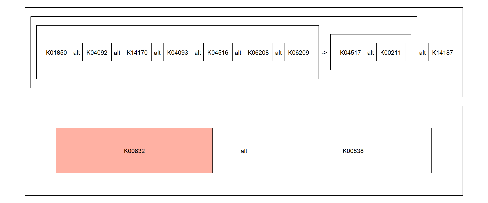

# Module

Module information can be obtained and parsed. Parsing `DEFINITION` and `REACTION` is supported. For the definition, first the function breaks down the definition to steps, and make graphical representation using `ggraph` or text itself.


```r
library(ggkegg)
mod <- obtain_module("M00004")
mod
#> $name
#> [1] "Pentose phosphate pathway (Pentose phosphate cycle)"
#> 
#> $definition
#> [1] "(K13937,((K00036,K19243) (K01057,K07404))) K00033 K01783 (K01807,K01808) K00615 ((K00616 (K01810,K06859,K15916)),K13810)"
#> 
#> $reaction
#>  [1] "R02736,R10907  C01172 -> C01236"           
#>  [2] "R02035  C01236 -> C00345"                  
#>  [3] "R01528,R10221  C00345 -> C00199"           
#>  [4] "R01529  C00199 -> C00231"                  
#>  [5] "R01056  C00199 -> C00117"                  
#>  [6] "R01641  C00117 + C00231 -> C05382 + C00118"
#>  [7] "R01827  C05382 + C00118 -> C00279 + C05345"
#>  [8] "R01830  C00279 + C00231 -> C05345 + C00118"
#>  [9] "R02740  C05345 -> C00668"                  
#> [10] "R02739  C00668 -> C01172"
```

Visualizing the reactions in the module. Please report any reaction that cannot be properly parsed this way.


```r
library(igraph)
mod <- obtain_module("M00004")
reac <- parse_module(mod, "reaction")
g <- simplify(graph_from_data_frame(reac), edge.attr.comb = "concat")
E(g)$reac <- unlist(lapply(E(g)$V3, function(x) paste(unique(x), collapse=",")))
ggraph(g)+
  geom_node_point()+
  geom_edge_link(
                 aes(label=reac), angle_calc = "along",
                 label_dodge = unit(5,"mm"),
                 label_colour = "tomato",
                 arrow = arrow(length = unit(1, 'mm')),
                 end_cap = circle(5, 'mm'),
                 start_cap = circle(5, "mm"))+
  geom_node_text(aes(label=name), repel=TRUE,
                 bg.colour="white", size=4)+
  theme_void()
```


## Visualize the result of `enricher`

If you performed some experiments involving KEGG Orthology, and performed enrichment analysis on KO to module relationship.


```r
library(BiocFileCache)
#> Warning: package 'BiocFileCache' was built under R version
#> 4.2.2
#> Loading required package: dbplyr
#> Warning: package 'dbplyr' was built under R version 4.2.3
library(clusterProfiler)
#> 
#> clusterProfiler v4.7.1.003  For help: https://yulab-smu.top/biomedical-knowledge-mining-book/
#> 
#> If you use clusterProfiler in published research, please cite:
#> T Wu, E Hu, S Xu, M Chen, P Guo, Z Dai, T Feng, L Zhou, W Tang, L Zhan, X Fu, S Liu, X Bo, and G Yu. clusterProfiler 4.0: A universal enrichment tool for interpreting omics data. The Innovation. 2021, 2(3):100141
#> 
#> Attaching package: 'clusterProfiler'
#> The following object is masked from 'package:igraph':
#> 
#>     simplify
#> The following object is masked from 'package:stats':
#> 
#>     filter

## Download and cache KO to module relationship
url <- paste0("https://rest.kegg.jp/link/ko/module")
bfc <- BiocFileCache()
path <- bfcrpath(bfc, url)
module.bg <- apply(data.table::fread(path), 2, function(x) sapply(strsplit(x, ":"), "[",2))|> data.frame()|>`colnames<-`(c("term","gene"))

## Using the table, perform enrichment analysis.
mod.enrich <- enricher(c("K00431","K00832"),TERM2GENE=module.bg)

## Visualize using ggkegg
dd <- ggkegg(mod.enrich)
#> Currently returning list of the KO and steps
dd
```


