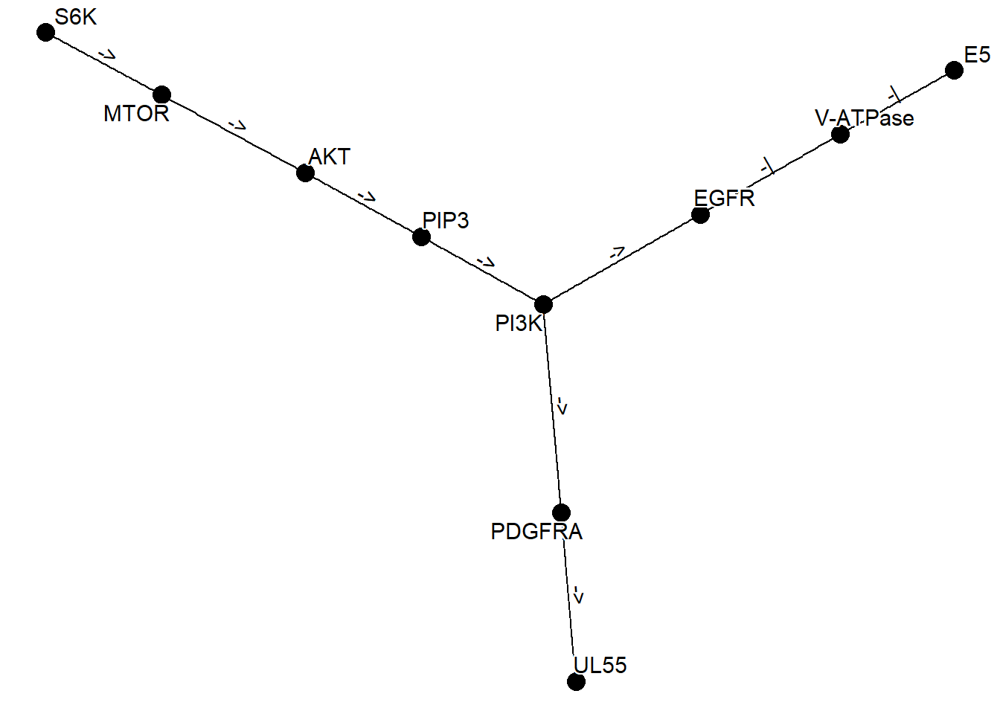

# Network

It is also possible to parse the KEGG NETWORK and plot it as a network in the same way. In this case, the `network` function is used.


```r
library(ggkegg)
library(tidygraph)
library(dplyr)
kne <- network("N00002")
kne
#> N00002
#> BCR-ABL fusion kinase to RAS-ERK signaling pathway
```

## Combining multiple networks

Here is an example of obtaining multiple networks, merging them with graph_join, and plotting them using the `plot_kegg_network` wrapper function. The `network_graph` function is a function that generates a graph from a string. It is possible to specify `definition` or `expanded` as the `type` to generate the graph.


```r
kne <- network("N00385")  ## HCMV
kne2 <- network("N00366") ## HPV
one <- kne |> network_graph()
two <- kne2 |> network_graph()
two
#> # A tbl_graph: 6 nodes and 5 edges
#> #
#> # A rooted tree
#> #
#> # A tibble: 6 × 3
#>   name     network_name                          network_ID
#>   <chr>    <chr>                                 <chr>     
#> 1 E5       HPV E5 to EGFR-PI3K signaling pathway N00366    
#> 2 V-ATPase HPV E5 to EGFR-PI3K signaling pathway N00366    
#> 3 EGFR     HPV E5 to EGFR-PI3K signaling pathway N00366    
#> 4 PI3K     HPV E5 to EGFR-PI3K signaling pathway N00366    
#> 5 PIP3     HPV E5 to EGFR-PI3K signaling pathway N00366    
#> 6 AKT      HPV E5 to EGFR-PI3K signaling pathway N00366    
#> #
#> # A tibble: 5 × 4
#>    from    to type  subtype  
#>   <int> <int> <chr> <chr>    
#> 1     1     2 -|    reference
#> 2     2     3 -|    reference
#> 3     3     4 ->    reference
#> # ℹ 2 more rows
graph_join(one, two, by="name") |> plot_kegg_network()
```



By using `ggforce`, it is possible to draw multiple graphs showing which genes belong to which network.


```r
kne3 <- network("N00485") ## EBV
kne4 <- network("N00030") ## EGF-EGFR-RAS-PI3K
three <- kne3 |> network_graph()
four <- kne4 |> network_graph()

gg <- Reduce(function(x,y) graph_join(x,y, by="name"), list(one, two, three, four))
coln <- gg |> activate(nodes) |> data.frame() |> colnames() 
nids <- coln[grepl("network_ID",coln)]

net <- plot_kegg_network(gg)
for (i in nids) {
  net <- net + ggforce::geom_mark_hull(alpha=0.2, aes(group=.data[[i]],
    fill=.data[[i]], x=x, y=y, filter=!is.na(.data[[i]])))
}
net + scale_fill_manual(values=viridis::plasma(4), name="ID")
```


```r
## Better to plot points and edges after the hull
```
