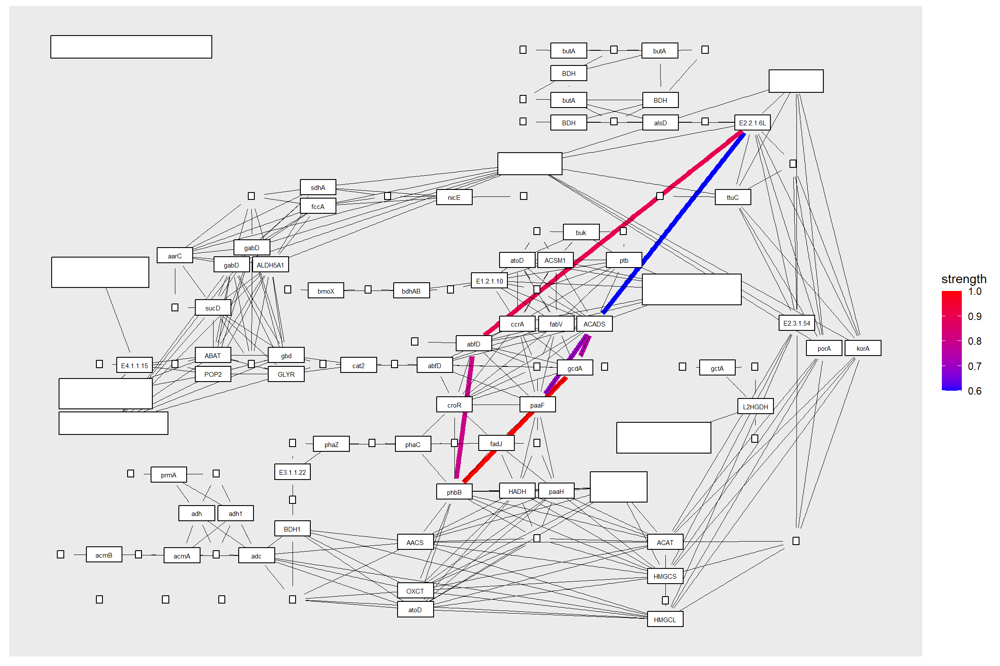

# Usecases 


## Projecting the gene regulatory networks on KEGG map

With this package, it is possible to project inferred networks such as gene regulatory networks or KO networks inferred by other software onto KEGG maps. The following is an example of projecting a subset of KO networks within a pathway inferred by CBNplot onto the reference map of the corresponding pathway using `MicrobiomeProfiler`. Of course, it is also possible to project networks created using other methods.


```r
library(dplyr)
library(igraph)
library(tidygraph)
library(CBNplot)
library(ggkegg)
library(MicrobiomeProfiler)
data(Rat_data)
ko.res <- enrichKO(Rat_data)
exp.dat <- matrix(abs(rnorm(910)), 91, 10) %>% magrittr::set_rownames(value=Rat_data) %>% magrittr::set_colnames(value=paste0('S', seq_len(ncol(.))))
returnnet <- bngeneplot(ko.res, exp=exp.dat, pathNum=1, orgDb=NULL,returnNet = TRUE)
pg <- pathway("ko00650")
joined <- combine_with_bnlearn(pg, returnnet$str, returnnet$av)
```

Plot the resulting map. In this example, the strength estimated by CBNplot is first displayed with colored edges, and then the edges of the reference graph are drawn in black on top of it.


```r
joined |> 
  activate(nodes) |>
  mutate(convertKO=convert_id("ko")) |>
  activate(edges) |>
  filter() |>
  ggraph(x=x, y=y) +
  geom_edge_link(width=2,aes(filter=!is.na(strength), color=strength),
                 start_cap=circle(4,"mm"),
                 end_cap=circle(4,"mm"))+
  
  geom_edge_link(
    width=0.1, aes(filter=is.na(strength)),
    start_cap=circle(4,"mm"),
    end_cap=circle(4,"mm"))+
  scale_edge_color_gradient(low="blue",high="red")+
  geom_node_rect(fill="white", color="black")+
  geom_node_text(aes(label=convertKO), size=2)
```


