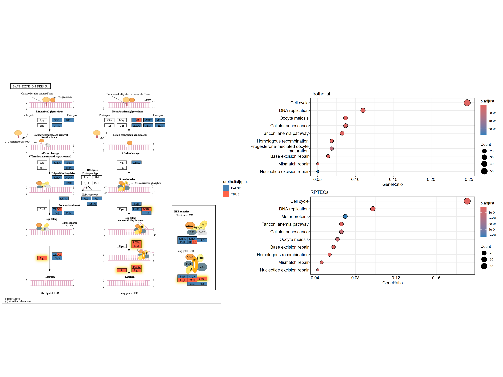
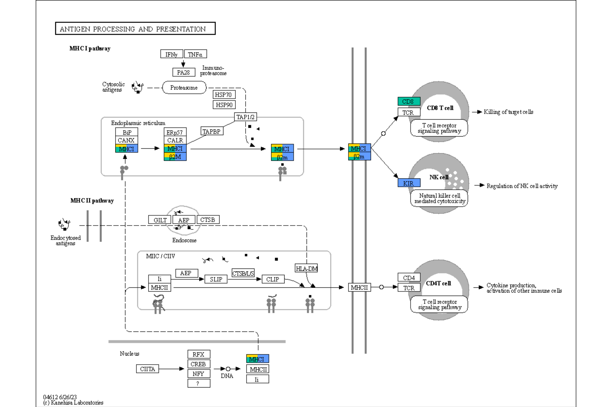
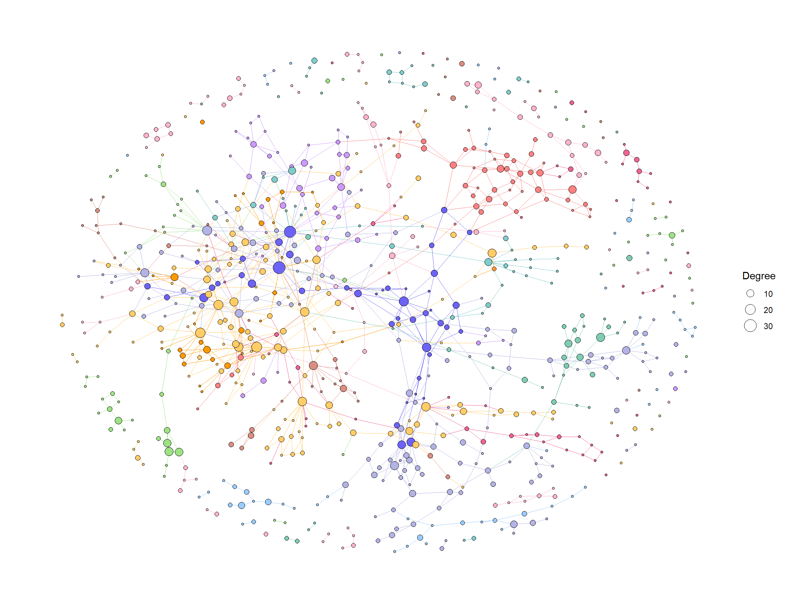
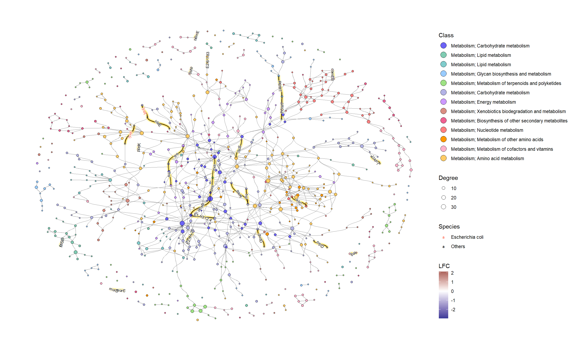

# Usecases


## Visualizing numerical attributes from DESeq2

By providing the results of the DESeq2 package, which is often used for transcriptome analysis, it is possible to reflect numerical results in the nodes of a graph. The `assign_deseq2` function can be used for this purpose. By specifying the numerical value (e.g., `log2FoldChange`) that you want to reflect in the graph as the `column` argument, you can assign the value to the nodes. If multiple genes are hit, the `numeric_combine` argument specifies how to combine multiple values (the default is `mean`).

Here, we use a RNA-Seq dataset that analyzed the transcriptome changes in human urothelial cells infected with BK polyomavirus ([Baker et al. 2022](https://doi.org/10.1038/s41388-022-02235-8)). The raw sequences obtained from Sequence Read Archive were processed by [nf-core](https://nf-co.re/rnaseq), and subsequently analyzed using `tximport`, `salmon` and `DESeq2`.


```r
library(ggkegg)
library(DESeq2)
library(org.Hs.eg.db)
library(dplyr)
```


```r
## The file stores DESeq() result on transcriptomic dataset deposited by Baker et al. 2022.
load("uro.deseq.res.rda") 
res
#> class: DESeqDataSet 
#> dim: 29744 26 
#> metadata(1): version
#> assays(8): counts avgTxLength ... replaceCounts
#>   replaceCooks
#> rownames(29744): A1BG A1BG-AS1 ... ZZEF1 ZZZ3
#> rowData names(27): baseMean baseVar ... maxCooks
#>   replace
#> colnames(26): SRR14509882 SRR14509883 ... SRR14509906
#>   SRR14509907
#> colData names(27): Assay.Type AvgSpotLen ...
#>   viral_infection replaceable
vinf <- results(res, contrast=c("viral_infection","BKPyV (Dunlop) MOI=1","No infection"))

## LFC
g <- pathway("hsa04110") |> mutate(deseq2=assign_deseq2(vinf),
                                   padj=assign_deseq2(vinf, column="padj"),
                                   converted_name=convert_id("hsa"))

ggraph(g, layout="manual", x=x, y=y) + 
  geom_edge_parallel(width=0.5, arrow = arrow(length = unit(1, 'mm')), 
                 start_cap = square(1, 'cm'),
                 end_cap = square(1.5, 'cm'), aes(color=subtype_name))+
  geom_node_rect(aes(fill=deseq2, filter=type=="gene"), color="black")+
  ggfx::with_outer_glow(geom_node_text(aes(label=converted_name, filter=type!="group"), size=2.5), colour="white", expand=1)+
  scale_fill_gradient(low="blue",high="red", name="LFC")+
  theme_void()
```


```r

## Adjusted p-values
ggraph(g, layout="manual", x=x, y=y) + 
  geom_edge_parallel(width=0.5, arrow = arrow(length = unit(1, 'mm')), 
                 start_cap = square(1, 'cm'),
                 end_cap = square(1.5, 'cm'), aes(color=subtype_name))+
  geom_node_rect(aes(fill=padj, filter=type=="gene"), color="black")+
  ggfx::with_outer_glow(geom_node_text(aes(label=converted_name, filter=type!="group"), size=2.5), colour="white", expand=1)+
  scale_fill_gradient(name="padj")+
  theme_void()
```


### using `ggfx` to further customize the visualization


```r
## Highlighting differentially expressed genes at adjusted p-values < 0.05 with coloring of adjusted p-values on raw KEGG map
gg <- ggraph(g, layout="manual", x=x, y=y)+
  geom_node_rect(aes(fill=padj, filter=type=="gene"))+
  ggfx::with_outer_glow(geom_node_rect(aes(fill=padj, filter=!is.na(padj) & padj<0.05)),
                        colour="yellow", expand=2)+
  overlay_raw_map("hsa04110", transparent_colors = c("#cccccc","#FFFFFF","#BFBFFF","#BFFFBF"))+
  scale_fill_gradient(low="pink",high="steelblue") + theme_void()
gg
```


### using multiple geoms to add information

You can use your favorite geoms in `ggplot2` and their extensions to add information. In this example, We add log2 fold changes as contour using [`geomtextpath`](https://github.com/AllanCameron/geomtextpath), and customized the font using [`Monocraft`](https://github.com/IdreesInc/Monocraft/).


```r
g <- g |> mutate(lfc=assign_deseq2(vinf, column="log2FoldChange"))

## Make contour data
df <- g |> data.frame()
df <- df[!is.na(df$lfc),]
cont <- akima::interp2xyz(interp::interp(df$x, df$y, df$lfc)) |>
    data.frame() |> `colnames<-`(c("x","y","z"))

## 
sysfonts::font_add(family="monocraft",regular="Monocraft.ttf")
gg <- ggraph(g, layout="manual", x=x, y=y)+
    geom_edge_parallel(arrow=arrow(length=unit(1,"mm")),
                       aes(color=subtype_name),
                       end_cap=circle(7.5,"mm"),
                       alpha=0.5)+
    geomtextpath::geom_textcontour(aes(x=x, y=y, z=z,color=after_stat(level)),
                                   size=3, linetype=2,
                                   linewidth=0.1, data=cont)+
    geom_node_rect(aes(fill=padj, filter=type=="gene"))+
    ggfx::with_outer_glow(geom_node_rect(aes(fill=padj, filter=!is.na(padj) & padj<0.05)),
                          colour="yellow", expand=2)+
    geom_node_text(aes(label=converted_name), family="monocraft")+
    scale_color_gradient2(low=scales::muted("blue"),
                          high=scales::muted("red"),
                          name="LFC")+
    scale_edge_color_manual(values=viridis::viridis(11), name="Edge type")+
    scale_fill_gradient(low="pink",high="steelblue") +
    theme_void()
gg
```


## Integrating numeric values onto `tbl_graph`

### Integrating numeric vector to `tbl_graph`

Numerical values can be reflected in node or edge tables, utilizing either the `node_numeric` or `edge_numeric` functions. The input can be a named vector or a tibble containing id and value columns.


```r
vec <- 1
names(vec) <- c("hsa:51343")
new_g <- g |> mutate(num=node_numeric(vec))
new_g
#> # A tbl_graph: 134 nodes and 157 edges
#> #
#> # A directed acyclic multigraph with 40 components
#> #
#> # Node Data: 134 × 23 (active)
#>    name       type  reaction graphics_name     x     y width
#>    <chr>      <chr> <chr>    <chr>         <dbl> <dbl> <dbl>
#>  1 hsa:1029   gene  <NA>     CDKN2A, ARF,…   532  -218    46
#>  2 hsa:51343  gene  <NA>     FZR1, CDC20C…   981  -630    46
#>  3 hsa:4171 … gene  <NA>     MCM2, BM28, …   553  -681    46
#>  4 hsa:23594… gene  <NA>     ORC6, ORC6L.…   494  -681    46
#>  5 hsa:10393… gene  <NA>     ANAPC10, APC…   981  -392    46
#>  6 hsa:10393… gene  <NA>     ANAPC10, APC…   981  -613    46
#>  7 hsa:6500 … gene  <NA>     SKP1, EMC19,…   188  -613    46
#>  8 hsa:6500 … gene  <NA>     SKP1, EMC19,…   432  -285    46
#>  9 hsa:983    gene  <NA>     CDK1, CDC2, …   780  -562    46
#> 10 hsa:701    gene  <NA>     BUB1B, BUB1b…   873  -392    46
#> # ℹ 124 more rows
#> # ℹ 16 more variables: height <dbl>, fgcolor <chr>,
#> #   bgcolor <chr>, graphics_type <chr>, coords <chr>,
#> #   xmin <dbl>, xmax <dbl>, ymin <dbl>, ymax <dbl>,
#> #   orig.id <chr>, pathway_id <chr>, deseq2 <dbl>,
#> #   padj <dbl>, converted_name <chr>, lfc <dbl>, num <dbl>
#> #
#> # Edge Data: 157 × 6
#>    from    to type  subtype_name    subtype_value pathway_id
#>   <int> <int> <chr> <chr>           <chr>         <chr>     
#> 1   118    39 GErel expression      -->           hsa04110  
#> 2    50    61 PPrel inhibition      --|           hsa04110  
#> 3    50    61 PPrel phosphorylation +p            hsa04110  
#> # ℹ 154 more rows
```

### Integrating matrix to `tbl_graph`

If you want to reflect an expression matrix in a graph, the `edge_matrix` and `node_matrix` functions can be useful. By specifying a matrix and gene IDs, you can assign numeric values for each sample to the `tbl_graph`. `edge_matrix` assigns the sum of the two nodes connected by an edge, ignoring group nodes ([Adnan et al. 2020](
https://doi.org/10.1186/s12859-020-03692-2)).


```r
mat <- assay(vst(res))
new_g <- g |> edge_matrix(mat) |> node_matrix(mat)
new_g
#> # A tbl_graph: 134 nodes and 157 edges
#> #
#> # A directed acyclic multigraph with 40 components
#> #
#> # Node Data: 134 × 48 (active)
#>    name       type  reaction graphics_name     x     y width
#>    <chr>      <chr> <chr>    <chr>         <dbl> <dbl> <dbl>
#>  1 hsa:1029   gene  <NA>     CDKN2A, ARF,…   532  -218    46
#>  2 hsa:51343  gene  <NA>     FZR1, CDC20C…   981  -630    46
#>  3 hsa:4171 … gene  <NA>     MCM2, BM28, …   553  -681    46
#>  4 hsa:23594… gene  <NA>     ORC6, ORC6L.…   494  -681    46
#>  5 hsa:10393… gene  <NA>     ANAPC10, APC…   981  -392    46
#>  6 hsa:10393… gene  <NA>     ANAPC10, APC…   981  -613    46
#>  7 hsa:6500 … gene  <NA>     SKP1, EMC19,…   188  -613    46
#>  8 hsa:6500 … gene  <NA>     SKP1, EMC19,…   432  -285    46
#>  9 hsa:983    gene  <NA>     CDK1, CDC2, …   780  -562    46
#> 10 hsa:701    gene  <NA>     BUB1B, BUB1b…   873  -392    46
#> # ℹ 124 more rows
#> # ℹ 41 more variables: height <dbl>, fgcolor <chr>,
#> #   bgcolor <chr>, graphics_type <chr>, coords <chr>,
#> #   xmin <dbl>, xmax <dbl>, ymin <dbl>, ymax <dbl>,
#> #   orig.id <chr>, pathway_id <chr>, deseq2 <dbl>,
#> #   padj <dbl>, converted_name <chr>, lfc <dbl>,
#> #   SRR14509882 <dbl>, SRR14509883 <dbl>, …
#> #
#> # Edge Data: 157 × 34
#>    from    to type  subtype_name    subtype_value pathway_id
#>   <int> <int> <chr> <chr>           <chr>         <chr>     
#> 1   118    39 GErel expression      -->           hsa04110  
#> 2    50    61 PPrel inhibition      --|           hsa04110  
#> 3    50    61 PPrel phosphorylation +p            hsa04110  
#> # ℹ 154 more rows
#> # ℹ 28 more variables: from_nd <chr>, to_nd <chr>,
#> #   SRR14509882 <dbl>, SRR14509883 <dbl>,
#> #   SRR14509884 <dbl>, SRR14509885 <dbl>,
#> #   SRR14509886 <dbl>, SRR14509887 <dbl>,
#> #   SRR14509888 <dbl>, SRR14509889 <dbl>,
#> #   SRR14509890 <dbl>, SRR14509891 <dbl>, …
```

#### Values to edge

The same effect of `edge_matrix` can be obtained by `edge_numeric_sum`, using named numeric vector as input. This function adds edge values based on node values. The below example shows combining LFCs to edges. This is different behaviour from `edge_numeric`.


```r

## Numeric vector (name is SYMBOL)
vinflfc <- vinf$log2FoldChange |> setNames(row.names(vinf))

g |> 
  ## Use graphics_name to merge
  mutate(grname=strsplit(graphics_name, ",") |> vapply("[", 1, FUN.VALUE="a")) |>
  activate(edges) |>
  mutate(summed = edge_numeric_sum(vinflfc, name="grname")) |>
  filter(!is.na(summed)) |>
  activate(nodes) |> 
  mutate(x=NULL, y=NULL, deg=centrality_degree(mode="all")) |>
  filter(deg>0) |>
  ggraph(layout="nicely")+
  geom_edge_parallel(aes(color=summed, width=summed,
                         linetype=subtype_name),
                     arrow=arrow(length=unit(1,"mm")),
                     start_cap=circle(2,"mm"),
                     end_cap=circle(2,"mm"))+
  geom_node_point(aes(fill=I(bgcolor)))+
  geom_node_text(aes(label=grname,
                     filter=type=="gene"),
                 repel=TRUE, bg.colour="white")+
  scale_edge_width(range=c(0.1,2))+
  scale_edge_color_gradient(low="blue", high="red", name="Edge")+
  theme_void()
```


## Visualizing multiple enrichment results

You can visualize the results of multiple enrichment analyses. Similar to using the `ggkegg` function with the `enrichResult` class, there is an `append_cp` function that can be used within the `mutate` function. By providing an `enrichResult` object to this function, if the pathway being visualized is present in the result, the gene information within the pathway can be reflected in the graph. In this example, in addition to the changes in urothelial cells mentioned above, changes in renal proximal tubular epithelial cells are being compared ([Assetta et al. 2016](https://doi.org/10.1128/mbio.00903-16)).


```r

## These are RDAs storing DEGs
load("degListRPTEC.rda")
load("degURO.rda")

library(org.Hs.eg.db);
library(clusterProfiler);
input_uro <- bitr(uroUp, ## DEGs in urothelial cells
              fromType = "SYMBOL",
              toType = "ENTREZID",
              OrgDb = org.Hs.eg.db)$ENTREZID
input_rptec <- bitr(gls$day3_up_rptec, ## DEGs at 3 days post infection in RPTECs
              fromType = "SYMBOL",
              toType = "ENTREZID",
              OrgDb = org.Hs.eg.db)$ENTREZID

ekuro <- enrichKEGG(gene = input_uro)
ekrptec <- enrichKEGG(gene = input_rptec)

g1 <- pathway("hsa04110") |> mutate(uro=append_cp(ekuro, how="all"),
                                    rptec=append_cp(ekrptec, how="all"),
                                    converted_name=convert_id("hsa"))
ggraph(g1, layout="manual", x=x, y=y) + 
  geom_edge_parallel(width=0.5, arrow = arrow(length = unit(1, 'mm')), 
                 start_cap = square(1, 'cm'),
                 end_cap = square(1.5, 'cm'), aes(color=subtype_name))+
  geom_node_rect(aes(fill=uro, xmax=x,  filter=type=="gene"))+
  geom_node_rect(aes(fill=rptec, xmin=x, filter=type=="gene"))+
  scale_fill_manual(values=c("steelblue","tomato"), name="urothelial|rptec")+
  ggfx::with_outer_glow(geom_node_text(aes(label=converted_name, filter=type!="group"), size=2), colour="white", expand=1)+
  theme_void()
```


We can combine multiple plots combining `rawMap` by `patchwork`.


```r
library(patchwork)
comb <- rawMap(list(ekuro, ekrptec), fill_color=c("tomato","tomato"), pid="hsa04110") + 
rawMap(list(ekuro, ekrptec), fill_color=c("tomato","tomato"),
  pid="hsa03460")
comb
```


The example below applies a similar reflection to the Raw KEGG map and highlights genes that show statistically significant changes under both conditions using `ggfx` in yellow outer glow, with composing `dotplot` produced by clusterProfiler for the enrichment results by `patchwork`.


```r
right <- (dotplot(ekuro) + ggtitle("Urothelial")) /
(dotplot(ekrptec) + ggtitle("RPTECs"))

g1 <- pathway("hsa03410") |>
  mutate(uro=append_cp(ekuro, how="all"),
        rptec=append_cp(ekrptec, how="all"),
        converted_name=convert_id("hsa"))
gg <- ggraph(g1, layout="manual", x=x, y=y)+
  ggfx::with_outer_glow(
    geom_node_rect(aes(filter=uro&rptec),
                   color="gold", fill="transparent"),
    colour="gold", expand=5, sigma=10)+
  geom_node_rect(aes(fill=uro, filter=type=="gene"))+
  geom_node_rect(aes(fill=rptec, xmin=x, filter=type=="gene")) +
  overlay_raw_map("hsa03410", transparent_colors = c("#cccccc","#FFFFFF","#BFBFFF","#BFFFBF"))+
  scale_fill_manual(values=c("steelblue","tomato"),
                    name="urothelial|rptec")+
  theme_void()
gg2 <- gg + right + plot_layout(design="
AAAA###
AAAABBB
AAAABBB
AAAA###
"
)
gg2
```



### Multiple enrichment analysis results across multiple pathways

In addition to native layouts, it is sometimes useful to show the interesting genes e.g. DEGs across multiple pathways. Here, we use [`scatterpie`](https://github.com/GuangchuangYu/scatterpie) library for visualization of multiple enrichment analysis results across multiple pathways.


```r
library(scatterpie)
## Obtain enrichment analysis results
entrezid <- uroUp |>
  clusterProfiler::bitr("SYMBOL","ENTREZID",org.Hs.eg.db)
cp <- clusterProfiler::enrichKEGG(entrezid$ENTREZID)

entrezid2 <- gls$day3_up_rptec |>
  clusterProfiler::bitr("SYMBOL","ENTREZID",org.Hs.eg.db)
cp2 <- clusterProfiler::enrichKEGG(entrezid2$ENTREZID)


## Filter to interesting pathways
include <- (data.frame(cp) |> row.names())[c(1,3,4)]
pathways <- data.frame(cp)[include,"ID"]
pathways
#> [1] "hsa04110" "hsa03460" "hsa03440"
```

We obtain multiple pathway data (the function returns the native coordinates but we ignore them).


```r

g1 <- multi_pathway_native(pathways, row_num=1)
g2 <- g1 |> mutate(new_name=
                    ifelse(name=="undefined",
                           paste0(name,"_",pathway_id,"_",orig.id),
                           name)) |>
  convert(to_contracted, new_name, simplify=FALSE) |>
  activate(nodes) |> 
  mutate(purrr::map_vec(.orig_data,function (x) x[1,] )) |>
  mutate(pid1 = purrr::map(.orig_data,function (x) unique(x["pathway_id"]) )) |>
  mutate(hsa03440 = purrr:::map_lgl(pid1, function(x) "hsa03440" %in% x$pathway_id) ,
         hsa04110 = purrr:::map_lgl(pid1, function(x) "hsa04110" %in% x$pathway_id),
         hsa03460 = purrr:::map_lgl(pid1, function(x) "hsa03460" %in% x$pathway_id))

nds <- g2 |> activate(nodes) |> data.frame()
eds <- g2 |> activate(edges) |> data.frame()
rmdup_eds <- eds[!duplicated(eds[,c("from","to","subtype_name")]),]

g2_2 <- tbl_graph(nodes=nds, edges=rmdup_eds)
g2_2 <- g2_2 |>  activate(nodes) |>
  mutate(
    in_pathway_uro=append_cp(cp, pid=include,name="new_name"),
    x=NULL, y=NULL,
   in_pathway_rptec=append_cp(cp2, pid=include,name = "new_name"),
   id=convert_id("hsa",name = "new_name")) |>
  morph(to_subgraph, type!="group") |>
  mutate(deg=centrality_degree(mode="all")) |>
  unmorph() |>
  filter(deg>0)
```

Here, we additionally assign graph-based clustering results to the graph, and we scale the size of the nodes so that the nodes can be visualized by scatterpie.


```r
V(g2_2)$walktrap <- igraph::walktrap.community(g2_2)$membership

## Scale the node size
sizeMin <- 0.1
sizeMax <- 0.3
rawMin <- min(V(g2_2)$deg)
rawMax <- max(V(g2_2)$deg)
scf <- (sizeMax-sizeMin)/(rawMax-rawMin)
V(g2_2)$size <- scf * V(g2_2)$deg + sizeMin - scf * rawMin


## Make base graph
g3 <- ggraph(g2_2, layout="nicely")+
  geom_edge_parallel(alpha=0.9,
                 arrow=arrow(length=unit(1,"mm")),
                 aes(color=subtype_name),
                 start_cap=circle(3,"mm"),
                 end_cap=circle(8,"mm"))+
  scale_edge_color_discrete(name="Edge type")
graphdata <- g3$data
```

Finally, we use `geom_scatterpie` for the visualization. The background scatterpie indicates whether the genes are in the pathways, and the foreground indicates whether the gene is differentially expressed in multiple datasets. We highlight the genes which were differentially expressed in both datasets by gold colour.


```r
g4 <- g3+
  ggforce::geom_mark_rect(aes(x=x, y=y, group=walktrap),color="grey")+
  geom_scatterpie(aes(x=x, y=y, r=size+0.1),
                  color="transparent",
                  legend_name="Pathway",
                  data=graphdata,
                  cols=c("hsa04110", "hsa03440","hsa03460")) +
  geom_scatterpie(aes(x=x, y=y, r=size),
                           color="transparent",
                           data=graphdata, legend_name="enrich",
                           cols=c("in_pathway_rptec","in_pathway_uro"))+
  ggfx::with_outer_glow(geom_scatterpie(aes(x=x, y=y, r=size),
                  color="transparent",
                  data=graphdata[graphdata$in_pathway_rptec & graphdata$in_pathway_uro,],
                  cols=c("in_pathway_rptec","in_pathway_uro")), colour="gold", expand=3)+
  geom_node_point(shape=19, size=3, aes(filter=!in_pathway_uro & !in_pathway_rptec & type!="map"))+
  geom_node_shadowtext(aes(label=id, y=y-0.5), size=3, family="sans", bg.colour="white", colour="black")+
  theme_void()+coord_fixed()
g4
```


## Projecting the gene regulatory networks on KEGG map

With this package, it is possible to project inferred networks such as gene regulatory networks or KO networks inferred by other software onto KEGG maps. The following is an example of projecting a subset of KO networks within a pathway inferred by CBNplot onto the reference map of the corresponding pathway using `MicrobiomeProfiler`. Of course, it is also possible to project networks created using other methods.


```r
library(dplyr)
library(igraph)
library(tidygraph)
library(CBNplot)
library(ggkegg)
library(MicrobiomeProfiler)
data(Rat_data)
ko.res <- enrichKO(Rat_data)
exp.dat <- matrix(abs(rnorm(910)), 91, 10) %>% magrittr::set_rownames(value=Rat_data) %>% magrittr::set_colnames(value=paste0('S', seq_len(ncol(.))))
returnnet <- bngeneplot(ko.res, exp=exp.dat, pathNum=1, orgDb=NULL,returnNet = TRUE)
pg <- pathway("ko00650")
joined <- combine_with_bnlearn(pg, returnnet$str, returnnet$av)
```

Plot the resulting map. In this example, the strength estimated by `CBNplot` is first displayed with colored edges, and then the edges of the reference graph are drawn in black on top of it. Also, edges included in both graphs are highlighted by yellow.


```r
## Summarize duplicate edges including `strength` attribute
number <- joined |> activate(edges) |> data.frame() |> group_by(from,to) |>
  summarise(n=n(), incstr=sum(!is.na(strength)))

## Annotate them
joined <- joined |> activate(edges) |> full_join(number) |> mutate(both=n>1&incstr>0)

joined |> 
  activate(nodes) |>
  filter(!is.na(type)) |>
  mutate(convertKO=convert_id("ko")) |>
  activate(edges) |>
  ggraph(x=x, y=y) +
  geom_edge_link0(width=0.5,aes(filter=!is.na(strength),
                              color=strength), linetype=1)+
  ggfx::with_outer_glow(
    geom_edge_link0(width=0.5,aes(filter=!is.na(strength) & both,
                                  color=strength), linetype=1),
    colour="yellow", sigma=1, expand=1)+
  geom_edge_link0(width=0.1, aes(filter=is.na(strength)))+
  scale_edge_color_gradient(low="blue",high="red")+
  geom_node_rect(color="black", aes(fill=type))+
  geom_node_text(aes(label=convertKO), size=2)+
  geom_node_text(aes(label=ifelse(grepl(":", graphics_name), strsplit(graphics_name, ":") |>
                                    sapply("[",2) |> stringr::str_wrap(22), stringr::str_wrap(graphics_name, 22)),
                     filter=!is.na(type) & type=="map"), family="serif",
                 size=2, na.rm=TRUE)+
  theme_void()
```


### Projection on to the raw KEGG map

You can directly project the inferred network onto the raw PATHWAY map, which enables direct comparison of the knowledge of curated database and inferred network from your own dataset.


```r
raws <- joined |> 
  ggraph(x=x, y=y) +
  geom_edge_link(width=0.5,aes(filter=!is.na(strength),
                                color=strength),
                 linetype=1,
                 arrow=arrow(length=unit(1,"mm"),type="closed"),
                 end_cap=circle(5,"mm"))+
  scale_edge_color_gradient2()+
  overlay_raw_map(transparent_colors = c("#ffffff"))+
  theme_void()
raws
```


## Analyzing cluster marker genes in single-cell transcriptomics

This package can also be applied to single-cell analysis. As an example, consider mapping marker genes between clusters onto KEGG pathways and plotting them together with reduced dimension plots. Here, we use the `Seurat` package. We conduct a fundamental analysis.


```r
library(Seurat)
library(dplyr)
# dir = "../filtered_gene_bc_matrices/hg19"
# pbmc.data <- Read10X(data.dir = dir)
# pbmc <- CreateSeuratObject(counts = pbmc.data, project = "pbmc3k",
#                            min.cells=3, min.features=200)
# pbmc <- NormalizeData(pbmc)
# pbmc <- FindVariableFeatures(pbmc, selection.method = "vst")
# pbmc <- ScaleData(pbmc, features = row.names(pbmc))
# pbmc <- RunPCA(pbmc, features = VariableFeatures(object = pbmc))
# pbmc <- FindNeighbors(pbmc, dims = 1:10, verbose = FALSE)
# pbmc <- FindClusters(pbmc, resolution = 0.5, verbose = FALSE)
# markers <- FindAllMarkers(pbmc)
# save(pbmc, markers, file="../sc_data.rda")

## To reduce file size, pre-calculated RDA will be loaded
load("../sc_data.rda")
```

Subsequently, we plot the results of dimensionality reduction by PCA.  
Among these, for the present study, we perform enrichment analysis on the marker genes of clusters 1 and 5.


```r
library(clusterProfiler)

## Directly access slots in Seurat
pcas <- data.frame(
    pbmc@reductions$pca@cell.embeddings[,1],
    pbmc@reductions$pca@cell.embeddings[,2],
    pbmc@active.ident,
    pbmc@meta.data$seurat_clusters) |>
    `colnames<-`(c("PC_1","PC_2","Cell","group"))

aa <- (pcas %>% group_by(Cell) %>%
    mutate(meanX=mean(PC_1), meanY=mean(PC_2))) |>
    select(Cell, meanX, meanY)
label <- aa[!duplicated(aa),]

dd <- ggplot(pcas)+
    geom_point(aes(x=PC_1, y=PC_2, color=Cell))+
    shadowtext::geom_shadowtext(x=label$meanX,y=label$meanY,label=label$Cell, data=label,
                            bg.colour="white", colour="black")+
    theme_minimal()+
    theme(legend.position="none")

marker_1 <- clusterProfiler::bitr((markers |> filter(cluster=="1" & p_val_adj < 1e-50) |>
                                     dplyr::select(gene))$gene,fromType="SYMBOL",toType="ENTREZID",OrgDb = org.Hs.eg.db)$ENTREZID
marker_5 <- clusterProfiler::bitr((markers |> filter(cluster=="5" & p_val_adj < 1e-50) |>
                                     dplyr::select(gene))$gene,fromType="SYMBOL",toType="ENTREZID",OrgDb = org.Hs.eg.db)$ENTREZID
mk1_enrich <- enrichKEGG(marker_1)
mk5_enrich <- enrichKEGG(marker_5)
```

Obtain the color information from `ggplot2` and obtain pathway using `ggkegg`. Here, we selected `Osteoclast differentiation (hsa04380)`, nodes are colored by `ggfx` according to the colors in the reduced dimension plot, and markers in both cluster are colored by the specified color (`tomato`). This facilitates the linkage between pathway information, such as KEGG, and single-cell analysis data, enabling the creation of intuitive and comprehensible visual representations.


```r
## Make color map
built <- ggplot_build(dd)$data[[1]]
cols <- built$colour
names(cols) <- as.character(as.numeric(built$group)-1)
gr_cols <- cols[!duplicated(cols)]

g <- pathway("hsa04380") |> mutate(marker_1=append_cp(mk1_enrich),
                                   marker_5=append_cp(mk5_enrich))
gg <- ggraph(g, layout="manual", x=x, y=y)+
    geom_node_rect(aes(filter=marker_1&marker_5), fill="tomato")+ ## Marker 1 & 5
    geom_node_rect(aes(filter=marker_1&!marker_5), fill=gr_cols["1"])+ ## Marker 1
    geom_node_rect(aes(filter=marker_5&!marker_1), fill=gr_cols["5"])+ ## Marker 5
  overlay_raw_map("hsa04380", transparent_colors = c("#cccccc","#FFFFFF","#BFBFFF","#BFFFBF"))+
  theme_void()
gg+dd+plot_layout(widths=c(0.6,0.4))
```


### Example for composing multiple pathways

We can inspect marker genes in multiple pathways to better understand the role of marker genes.


```r
library(clusterProfiler)
library(org.Hs.eg.db)

subset_lab <- label[label$Cell %in% c("1","4","5","6"),]
dd <- ggplot(pcas) + 
  ggfx::with_outer_glow(geom_node_point(size=1,
  	  aes(x=PC_1, y=PC_2, filter=group=="1", color=group)),
                        colour="tomato", expand=3)+
  ggfx::with_outer_glow(geom_node_point(size=1,
  	  aes(x=PC_1, y=PC_2, filter=group=="5", color=group)),
                        colour="tomato", expand=3)+
  ggfx::with_outer_glow(geom_node_point(size=1,
  	  aes(x=PC_1, y=PC_2, filter=group=="4", color=group)),
                        colour="gold", expand=3)+
  ggfx::with_outer_glow(geom_node_point(size=1,
  	  aes(x=PC_1, y=PC_2, filter=group=="6", color=group)),
                        colour="gold", expand=3)+
  shadowtext::geom_shadowtext(x=subset_lab$meanX,
  	  y=subset_lab$meanY, label=subset_lab$Cell,
  	  data=subset_lab,
      bg.colour="white", colour="black")+
  theme_minimal()

marker_1 <- clusterProfiler::bitr((markers |> filter(cluster=="1" & p_val_adj < 1e-50) |>
                                     dplyr::select(gene))$gene,fromType="SYMBOL",toType="ENTREZID",OrgDb = org.Hs.eg.db)$ENTREZID
marker_5 <- clusterProfiler::bitr((markers |> filter(cluster=="5" & p_val_adj < 1e-50) |>
                                     dplyr::select(gene))$gene,fromType="SYMBOL",toType="ENTREZID",OrgDb = org.Hs.eg.db)$ENTREZID
marker_6 <- clusterProfiler::bitr((markers |> filter(cluster=="6" & p_val_adj < 1e-50) |>
                                     dplyr::select(gene))$gene,fromType="SYMBOL",toType="ENTREZID",OrgDb = org.Hs.eg.db)$ENTREZID
marker_4 <- clusterProfiler::bitr((markers |> filter(cluster=="4" & p_val_adj < 1e-50) |>
                                     dplyr::select(gene))$gene,fromType="SYMBOL",toType="ENTREZID",OrgDb = org.Hs.eg.db)$ENTREZID
mk1_enrich <- enrichKEGG(marker_1)
mk5_enrich <- enrichKEGG(marker_5)
mk6_enrich <- enrichKEGG(marker_6)
mk4_enrich <- enrichKEGG(marker_4)

g1 <- pathway("hsa04612") |> mutate(marker_4=append_cp(mk4_enrich),
                                    marker_6=append_cp(mk6_enrich),
                                    gene_name=convert_id("hsa"))
gg1 <- ggraph(g1, layout="manual", x=x, y=y)+
  overlay_raw_map("hsa04612", transparent_colors = c("#FFFFFF", "#BFBFFF", "#BFFFBF"))+
  ggfx::with_outer_glow(
    geom_node_rect(aes(filter=marker_4&marker_6), fill="white"),
    colour="gold")+
  ggfx::with_outer_glow(
    geom_node_rect(aes(filter=marker_4&!marker_6), fill="white"),
    colour=gr_cols["4"])+
  ggfx::with_outer_glow(
    geom_node_rect(aes(filter=marker_6&!marker_4), fill="white"),
    colour=gr_cols["6"], expand=3)+
  overlay_raw_map("hsa04612", transparent_colors = c("#B3B3B3", "#FFFFFF", "#BFBFFF", "#BFFFBF"))+
  theme_void()

g2 <- pathway("hsa04380") |> mutate(marker_1=append_cp(mk1_enrich),
                                    marker_5=append_cp(mk5_enrich))
gg2 <- ggraph(g2, layout="manual", x=x, y=y)+
  ggfx::with_outer_glow(
    geom_node_rect(aes(filter=marker_1&marker_5),
                   fill="white"), ## Marker 1 & 5
    colour="tomato")+
  ggfx::with_outer_glow(
    geom_node_rect(aes(filter=marker_1&!marker_5),
                   fill="white"), ## Marker 1
    colour=gr_cols["1"])+
  ggfx::with_outer_glow(
    geom_node_rect(aes(filter=marker_5&!marker_1),
                   fill="white"), ## Marker 5
    colour=gr_cols["5"])+
  overlay_raw_map("hsa04380",
                  transparent_colors = c("#cccccc","#FFFFFF","#BFBFFF","#BFFFBF"))+
  theme_void()
left <-  (gg2 + ggtitle("Marker 1 and 5")) /
  (gg1 + ggtitle("Marker 4 and 6"))

final <- left + dd + plot_layout(design="
            AAAAA###
            AAAAACCC
            BBBBBCCC
            BBBBB###
            ")

final
```


### Barplot for numeric values on raw map

For nodes in which they are enriched in multiple clusters, we can plot barplot for numeric values. The referenced codes are [here](https://stackoverflow.com/questions/36063043/how-to-plot-barchart-onto-ggplot2-map) by inscaven.


```r

## Assign lfc to graph
mark_4 <- clusterProfiler::bitr((markers |> filter(cluster=="4" & p_val_adj < 1e-50) |>
                                     dplyr::select(gene))$gene,fromType="SYMBOL",toType="ENTREZID",OrgDb = org.Hs.eg.db)
mark_6 <- clusterProfiler::bitr((markers |> filter(cluster=="6" & p_val_adj < 1e-50) |>
                                   dplyr::select(gene))$gene,fromType="SYMBOL",toType="ENTREZID",OrgDb = org.Hs.eg.db)
mark_4$lfc <- markers[markers$cluster=="4" & markers$gene %in% mark_4$SYMBOL,]$avg_log2FC
mark_4$hsa <- paste0("hsa:",mark_4$ENTREZID)
mark_6$lfc <- markers[markers$cluster=="6" & markers$gene %in% mark_4$SYMBOL,]$avg_log2FC
mark_6$hsa <- paste0("hsa:",mark_6$ENTREZID)
mk4lfc <- mark_4$lfc
names(mk4lfc) <- mark_4$hsa
mk6lfc <- mark_6$lfc
names(mk6lfc) <- mark_6$hsa

g1 <- g1 |> mutate(mk4lfc=node_numeric(mk4lfc),
             mk6lfc=node_numeric(mk6lfc))

## Make data frame containing necessary data from node
subset_df <- g1 |> activate(nodes) |> data.frame() |>
    dplyr::filter(marker_4 & marker_6) |>
    dplyr::select(orig.id, mk4lfc, mk6lfc, x, y, xmin, xmax, ymin, ymax) |>
    tidyr::pivot_longer(cols=c("mk4lfc","mk6lfc"))

## Actually we dont need position list
pos_list <- list()
annot_list <- list()
for (i in subset_df$orig.id |> unique()) {
    tmp <- subset_df[subset_df$orig.id==i,]
    ymin <- tmp$ymin |> unique()
    ymax <- tmp$ymax |> unique()
    xmin <- tmp$xmin |> unique()
    xmax <- tmp$xmax |> unique()
    pos_list[[as.character(i)]] <- c(xmin, xmax,
                                     ymin, ymax)
    barp <- tmp |>
        ggplot(aes(x=name, y=value, fill=name))+
        geom_col(width=1)+
        scale_fill_manual(values=c(gr_cols["4"] |> as.character(),
                                   gr_cols["6"] |> as.character()))+
        labs(x = NULL, y = NULL) +
        coord_cartesian(expand = FALSE) +
        theme(
            legend.position = "none",
            panel.background = element_rect(fill = "transparent", colour = NA),
            line = element_blank(),
            text = element_blank()
        )
    gbar <- ggplotGrob(barp)
    panel_coords <- gbar$layout[gbar$layout$name == "panel", ]
    gbar_mod <- gbar[panel_coords$t:panel_coords$b, panel_coords$l:panel_coords$r]
    annot_list[[as.character(i)]] <- annotation_custom(gbar_mod,
                                                      xmin=xmin, xmax=xmax,
                                                      ymin=ymin, ymax=ymax)
}

## Make ggraph, annotate barplot, and overlay raw map.
graph_tmp <- ggraph(g1, layout="manual", x=x, y=y)+
    geom_node_rect(aes(filter=marker_4&marker_6),
                   fill="gold")+
    geom_node_rect(aes(filter=marker_4&!marker_6),
                   fill=gr_cols["4"])+
    geom_node_rect(aes(filter=marker_6&!marker_4),
                   fill=gr_cols["6"])+
    theme_void()
final_bar <- Reduce("+", annot_list, graph_tmp)+
overlay_raw_map("hsa04612",
                transparent_colors = c("#FFFFFF",
                                       "#BFBFFF",
                                       "#BFFFBF"))
final_bar
```




### Barplot across all the clusters

By iterating the above codes, we can plot all the clusters' quantitative data on plot. Although it is preferred to use ggplot2 mapping to produce the legend, here we obtain the legend from reduced dimension plot.


```r
g1 <- pathway("hsa04612") 
for (cluster_num in seq_len(9)) {
    cluster_num <- as.character(cluster_num - 1)
    mark <- clusterProfiler::bitr((markers |> filter(cluster==cluster_num & p_val_adj < 1e-50) |>
                                         dplyr::select(gene))$gene,fromType="SYMBOL",toType="ENTREZID",OrgDb = org.Hs.eg.db)
    mark$lfc <- markers[markers$cluster==cluster_num & markers$gene %in% mark$SYMBOL,]$avg_log2FC
    mark$hsa <- paste0("hsa:",mark$ENTREZID)
    coln <- paste0("marker",cluster_num,"lfc")
    g1 <- g1 |> mutate(!!coln := node_numeric(mark$lfc |> setNames(mark$hsa)))
}
```

Make `ggplotGrob()`.


```r

subset_df <- g1 |> activate(nodes) |> data.frame() |>
    dplyr::select(orig.id, paste0("marker",seq_len(9)-1,"lfc"), x, y, xmin, xmax, ymin, ymax) |>
    tidyr::pivot_longer(cols=paste0("marker",seq_len(9)-1,"lfc"))
pos_list <- list()
annot_list <- list()
all_gr_cols <- gr_cols
names(all_gr_cols) <- paste0("marker",names(all_gr_cols),"lfc")
for (i in subset_df$orig.id |> unique()) {
    tmp <- subset_df[subset_df$orig.id==i,]
    ymin <- tmp$ymin |> unique()
    ymax <- tmp$ymax |> unique()
    xmin <- tmp$xmin |> unique()
    xmax <- tmp$xmax |> unique()
    pos_list[[as.character(i)]] <- c(xmin, xmax,
                                     ymin, ymax)
    if ((tmp |> filter(!is.na(value)) |> dim())[1]!=0) {
        barp <- tmp |> filter(!is.na(value)) |>
            ggplot(aes(x=name, y=value, fill=name))+
            geom_col(width=1)+
            scale_fill_manual(values=all_gr_cols)+
            ## We add horizontal line to show the direction of bar
            geom_hline(yintercept=0, linewidth=1, colour="grey")+
            labs(x = NULL, y = NULL) +
            coord_cartesian(expand = FALSE) +
            theme(
                legend.position = "none",
                panel.background = element_rect(fill = "transparent", colour = NA),
                text = element_blank()
            )
        gbar <- ggplotGrob(barp)
        panel_coords <- gbar$layout[gbar$layout$name == "panel", ]
        gbar_mod <- gbar[panel_coords$t:panel_coords$b, panel_coords$l:panel_coords$r]
        annot_list[[as.character(i)]] <- annotation_custom(gbar_mod,
                                                           xmin=xmin, xmax=xmax,
                                                           ymin=ymin, ymax=ymax)
    }
}
```

Obtain legend and modify.


```r
## Take scplot legend, make it rectangle
## Make pseudo plot
dd2 <- ggplot(pcas) +
  geom_node_point(aes(x=PC_1, y=PC_2, color=group)) +
  guides(color = guide_legend(override.aes = list(shape=15, size=5)))+
  theme_minimal()
    
grobs <- ggplot_gtable(ggplot_build(dd2))
num <- which(sapply(grobs$grobs, function(x) x$name) == "guide-box")
legendGrob <- grobs$grobs[[num]]

## Show it
ggplotify::as.ggplot(legendGrob)
```


```r

## Make dummy legend by `fill`
graph_tmp <- ggraph(g1, layout="manual", x=x, y=y)+
    geom_node_rect(aes(fill="transparent"))+
    scale_fill_manual(values="transparent" |> setNames("transparent"))+
    theme_void()

## Overlaid the raw map
overlaid <- Reduce("+", annot_list, graph_tmp)+
    overlay_raw_map("hsa04612",
                    transparent_colors = c("#FFFFFF",
                                           "#BFBFFF",
                                           "#BFFFBF"))

## Replace the guides
overlaidGtable <- ggplot_gtable(ggplot_build(overlaid))
num2 <- which(sapply(overlaidGtable$grobs, function(x) x$name) == "guide-box")
overlaidGtable$grobs[[num2]] <- legendGrob

ggplotify::as.ggplot(overlaidGtable)
```


## Customizing global map visualization

One advantage of using `ggkegg` is visualizing global maps effectively using the power of `ggplot2` and `ggraph`. Here, I present an example of visualizing log2 fold change values obtained from some microbiome experiments in global map. First, we load necessary data, which can be obtained from your dataset investigating KO, obtained from the pipeline such as `HUMAnN3`.


```r
load("../lfcs.rda") ## Storing named vector of KOs storing LFCs and significant KOs
load("../func_cat.rda") ## Functional categories for hex values in ko01100

lfcs |> head()
#>  ko:K00013  ko:K00018  ko:K00031  ko:K00042  ko:K00065 
#> -0.2955686 -0.4803597 -0.3052872  0.9327130  1.0954976 
#>  ko:K00087 
#>  0.8713860
signame |> head()
#> [1] "ko:K00013" "ko:K00018" "ko:K00031" "ko:K00042"
#> [5] "ko:K00065" "ko:K00087"
func_cat |> head()
#> # A tibble: 6 × 3
#>   hex     class                                        top  
#>   <chr>   <chr>                                        <chr>
#> 1 #B3B3E6 Metabolism; Carbohydrate metabolism          Amin…
#> 2 #F06292 Metabolism; Biosynthesis of other secondary… Bios…
#> 3 #FFB3CC Metabolism; Metabolism of cofactors and vit… Bios…
#> 4 #FF8080 Metabolism; Nucleotide metabolism            Puri…
#> 5 #6C63F6 Metabolism; Carbohydrate metabolism          Glyc…
#> 6 #FFCC66 Metabolism; Amino acid metabolism            Bios…

## Named vector for Assigning functional category 
hex <- func_cat$hex |> setNames(func_cat$hex)
class <- func_cat$class |> setNames(func_cat$hex)
hex |> head()
#>   #B3B3E6   #F06292   #FFB3CC   #FF8080   #6C63F6   #FFCC66 
#> "#B3B3E6" "#F06292" "#FFB3CC" "#FF8080" "#6C63F6" "#FFCC66"
class |> head()
#>                                                   #B3B3E6 
#>                     "Metabolism; Carbohydrate metabolism" 
#>                                                   #F06292 
#> "Metabolism; Biosynthesis of other secondary metabolites" 
#>                                                   #FFB3CC 
#>        "Metabolism; Metabolism of cofactors and vitamins" 
#>                                                   #FF8080 
#>                       "Metabolism; Nucleotide metabolism" 
#>                                                   #6C63F6 
#>                     "Metabolism; Carbohydrate metabolism" 
#>                                                   #FFCC66 
#>                       "Metabolism; Amino acid metabolism"
```

### Preprocessing

We obtained `tbl_graph` of ko01100, and process the graph. First, we append edges corresponding to inter-compound relationships. Although most of the reactions are reversible and by default adds two edges in `process_reaction`, we specify `single_edge=TRUE` here for visualization. Also, converting compound ID and KO ID and append attributes to graph. 


```r
g <- ggkegg::pathway("ko01100")
g <- g |> process_reaction(single_edge=TRUE)
g <- g |> mutate(x=NULL, y=NULL)
g <- g |> activate(nodes) |> mutate(compn=convert_id("compound",
                                          first_arg_comma = FALSE))
g <- g |> activate(edges) |> mutate(kon=convert_id("ko",edge=TRUE))
```

Next we append values such as KOs and degrees to graph. In addition, here we append additional attribute, like which species have the enzymes, to the graph. This type of information can be obtained from stratified output of `HUMAnN3`.


```r
g2 <- g |> activate(edges) |> 
  mutate(kolfc=edge_numeric(lfcs), ## Pre-computed LFCs
         siglgl=.data$name %in% signame) |> ## Whether the KO is significant
  activate(nodes) |>
  filter(type=="compound") |> ## Subset to compound nodes and 
  mutate(Degree=centrality_degree(mode="all")) |> ## Calculate degree
  activate(nodes) |>
  filter(Degree>2) |> ## Filter based on degree
  activate(edges) |>
  mutate(Species=ifelse(kon=="lyxK", "Escherichia coli", "Others"))
```

We next check overall classes of these KOs based on ko01100, and the class with the highest number of KOs was Carbohydrate metabolism.


```r
class_table <- (g |> activate(edges) |>
  mutate(siglgl=name %in% signame) |>
  filter(siglgl) |>
  data.frame())$fgcolor |>
  table() |> sort(decreasing=TRUE)
names(class_table) <- class[names(class_table)]
class_table
#>                     Metabolism; Carbohydrate metabolism 
#>                                                      20 
#>          Metabolism; Glycan biosynthesis and metabolism 
#>                                                      16 
#>        Metabolism; Metabolism of cofactors and vitamins 
#>                                                      11 
#>                       Metabolism; Amino acid metabolism 
#>                                                       8 
#>                       Metabolism; Nucleotide metabolism 
#>                                                       7 
#>    Metabolism; Metabolism of terpenoids and polyketides 
#>                                                       3 
#>                           Metabolism; Energy metabolism 
#>                                                       3 
#>   Metabolism; Xenobiotics biodegradation and metabolism 
#>                                                       3 
#>                     Metabolism; Carbohydrate metabolism 
#>                                                       2 
#>                            Metabolism; Lipid metabolism 
#>                                                       1 
#> Metabolism; Biosynthesis of other secondary metabolites 
#>                                                       1 
#>             Metabolism; Metabolism of other amino acids 
#>                                                       1
```

### Plotting

We first visualize overall global map using the default values in `ko01100` and calculated degree.


```r
ggraph(g2, layout="fr")+
  geom_edge_link0(aes(color=I(fgcolor)), width=0.1)+
  geom_node_point(aes(fill=I(fgcolor), size=Degree), color="black", shape=21)+
  theme_graph()
```



We can apply various geoms to components in KEGG PATHWAY for the effective visualization. In this example, we highlighted significant edges (KOs) colored by their LFCs by `ggfx`, point size corresponding to degree in the network, and we showed edge label of significant KO names. KO names were colored by `Species` attributes. This time we set this to `Escherichia coli` and `Others`.


```r
ggraph(g2, layout="fr") +
  geom_edge_diagonal(color="grey50", width=0.1)+ ## Base edge
  ggfx::with_outer_glow(
    geom_edge_diagonal(aes(color=kolfc,filter=siglgl),
                       angle_calc = "along",
                       label_size=2.5),
    colour="gold", expand=3
  )+ ## Highlight significant edges
  scale_edge_color_gradient2(midpoint = 0, mid = "white",
                                    low=scales::muted("blue"),
                                    high=scales::muted("red"),
                                    name="LFC")+ ## Set gradient color
  geom_node_point(aes(fill=bgcolor,size=Degree),
                  shape=21,
                  color="black")+ ## Node size set to degree
  scale_size(range=c(1,4))+
  geom_edge_label_diagonal(aes(
    label=kon,
    label_colour=Species,
    filter=siglgl
  ),
  angle_calc = "along",
  label_size=2.5)+ ## Showing edge label, label color is Species attribute
  scale_label_colour_manual(values=c("tomato","black"),
                            name="Species")+ ## Scale color for edge label
  scale_fill_manual(values=hex,labels=class,name="Class")+ ## Show legend based on HEX
  theme_graph()+
  guides(fill = guide_legend(override.aes = list(size=5))) ## Change legend point size
```



If we want to investigate the specific class, subset by HEX value in graph.


```r

## Subset and do the same thing
g2 |>
  morph(to_subgraph, siglgl) |>
  activate(nodes) |>
  mutate(tmp=centrality_degree(mode="all")) |>
  filter(tmp>0) |>
  mutate(subname=compn) |>
  unmorph() |>
  activate(nodes) |>
  filter(bgcolor=="#B3B3E6") |>
  mutate(Degree=centrality_degree(mode="all")) |> ## Calculate degree
  filter(Degree>0) |>
ggraph(layout="fr") +
  geom_edge_diagonal(color="grey50", width=0.1)+ ## Base edge
  ggfx::with_outer_glow(
    geom_edge_diagonal(aes(color=kolfc,filter=siglgl),
                       angle_calc = "along",
                       label_size=2.5),
    colour="gold", expand=3
  )+
  scale_edge_color_gradient2(midpoint = 0, mid = "white",
                             low=scales::muted("blue"),
                             high=scales::muted("red"),
                             name="LFC")+
  geom_node_point(aes(fill=bgcolor,size=Degree),
                  shape=21,
                  color="black")+
  scale_size(range=c(1,4))+
  geom_edge_label_diagonal(aes(
    label=kon,
    label_colour=Species,
    filter=siglgl
  ),
  angle_calc = "along",
  label_size=2.5)+ ## Showing edge label
  scale_label_colour_manual(values=c("tomato","black"),
                            name="Species")+ ## Scale color for edge label
  geom_node_text(aes(label=stringr::str_wrap(subname,10,whitespace_only = FALSE)),
    repel=TRUE, bg.colour="white", size=2)+
  scale_fill_manual(values=hex,labels=class,name="Class")+
  theme_graph()+
  guides(fill = guide_legend(override.aes = list(size=5)))
```


