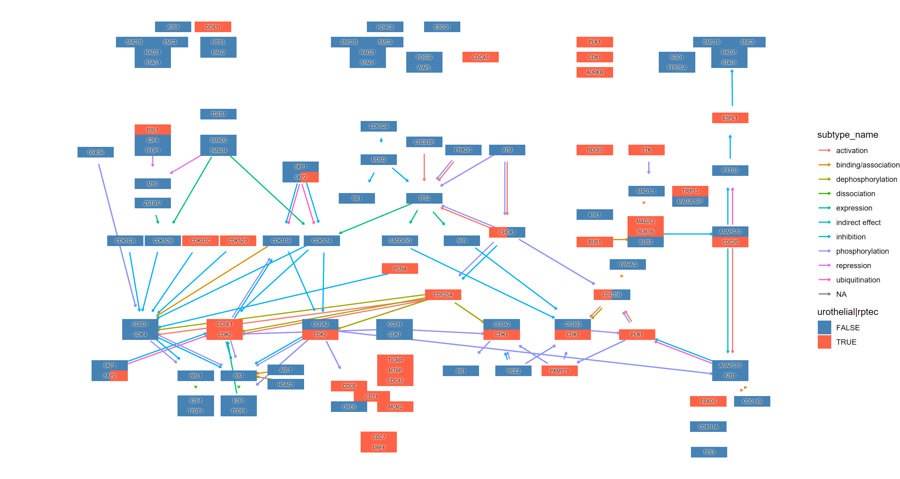

# Usecases 

## Visualizing numerical attributes from DESeq2

By providing the results of the DESeq2 package, which is often used for transcriptome analysis, it is possible to reflect numerical results in the nodes of a graph. The `assign_deseq2` function can be used for this purpose. By specifying the numerical value (e.g., `log2FoldChange`) that you want to reflect in the graph as the `column` argument, you can assign the value to the nodes. If multiple genes are hit, the `numeric_combine` argument specifies how to combine multiple values (the default is `mean`).

Here, we use a RNA-Seq dataset that analyzed the transcriptome changes in human urothelial cells infected with BK polyomavirus ([Baker et al. 2022](https://doi.org/10.1038/s41388-022-02235-8)). The raw sequences obtained from Sequence Read Archive were processed by [nf-core](https://nf-co.re/rnaseq), and subsequently analyzed using `tximport`, `salmon` and `DESeq2`.


```r
library(ggkegg)
library(DESeq2)
library(org.Hs.eg.db)
library(dplyr)

load("uro.deseq.res.rda") ## Storing DESeq() result
res
#> class: DESeqDataSet 
#> dim: 29744 26 
#> metadata(1): version
#> assays(8): counts avgTxLength ... replaceCounts
#>   replaceCooks
#> rownames(29744): A1BG A1BG-AS1 ... ZZEF1 ZZZ3
#> rowData names(27): baseMean baseVar ... maxCooks
#>   replace
#> colnames(26): SRR14509882 SRR14509883 ... SRR14509906
#>   SRR14509907
#> colData names(27): Assay.Type AvgSpotLen ...
#>   viral_infection replaceable
vinf <- results(res, contrast=c("viral_infection","BKPyV (Dunlop) MOI=1","No infection"))

## LFC
g <- pathway("hsa04110") |> mutate(deseq2=assign_deseq2(vinf),
                                   padj=assign_deseq2(vinf, column="padj"),
                                   converted_name=convert_id("hsa"))

ggraph(g, layout="manual", x=x, y=y) + 
  geom_edge_link(width=0.5, arrow = arrow(length = unit(1, 'mm')), 
                 start_cap = square(1, 'cm'),
                 end_cap = square(1.5, 'cm'), aes(color=subtype))+
  geom_node_rect(aes(fill=deseq2, filter=type=="gene"), color="black")+
  ggfx::with_outer_glow(geom_node_text(aes(label=converted_name, filter=type!="group"), size=2.5), colour="white", expand=1)+
  scale_fill_gradient(low="blue",high="red", name="LFC")+
  theme_void()
```


```r

## Adjusted p-values
ggraph(g, layout="manual", x=x, y=y) + 
  geom_edge_link(width=0.5, arrow = arrow(length = unit(1, 'mm')), 
                 start_cap = square(1, 'cm'),
                 end_cap = square(1.5, 'cm'), aes(color=subtype))+
  geom_node_rect(aes(fill=padj, filter=type=="gene"), color="black")+
  ggfx::with_outer_glow(geom_node_text(aes(label=converted_name, filter=type!="group"), size=2.5), colour="white", expand=1)+
  scale_fill_gradient(name="padj")+
  theme_void()
```


## Integrating matrix to `tbl_graph`

If you want to reflect an expression matrix in a graph, the `append_edge_value` and `append_node_value` functions can be useful. By specifying a matrix and gene IDs, you can assign numeric values for each sample to the `tbl_graph`. `append_edge_value` assigns the sum of the two nodes connected by an edge, ignoring group nodes ([Adnan et al. 2020](
https://doi.org/10.1186/s12859-020-03692-2)).


```r
mat <- assay(vst(res))
new_g <- g |> append_edge_value(mat) |> append_node_value(mat)
new_g
#> # A tbl_graph: 134 nodes and 157 edges
#> #
#> # A directed acyclic multigraph with 40 components
#> #
#> # Node Data: 134 × 47 (active)
#>   name  type  reacti… graphi…     x     y width height
#>   <chr> <chr> <chr>   <chr>   <dbl> <dbl> <dbl>  <dbl>
#> 1 hsa:… gene  <NA>    CDKN2A…   532  -218    46     17
#> 2 hsa:… gene  <NA>    FZR1, …   981  -630    46     17
#> 3 hsa:… gene  <NA>    MCM2, …   553  -681    46     17
#> 4 hsa:… gene  <NA>    ORC6, …   494  -681    46     17
#> 5 hsa:… gene  <NA>    ANAPC1…   981  -392    46     17
#> 6 hsa:… gene  <NA>    ANAPC1…   981  -613    46     17
#> # … with 128 more rows, and 39 more variables:
#> #   fgcolor <chr>, bgcolor <chr>, graphics_type <chr>,
#> #   coords <chr>, xmin <dbl>, xmax <dbl>, ymin <dbl>,
#> #   ymax <dbl>, orig.id <chr>, pathway_id <chr>,
#> #   deseq2 <dbl>, padj <dbl>, converted_name <chr>,
#> #   SRR14509882 <dbl>, SRR14509883 <dbl>,
#> #   SRR14509884 <dbl>, SRR14509885 <dbl>,
#> #   SRR14509886 <dbl>, SRR14509887 <dbl>,
#> #   SRR14509888 <dbl>, SRR14509889 <dbl>,
#> #   SRR14509890 <dbl>, SRR14509891 <dbl>,
#> #   SRR14509892 <dbl>, SRR14509893 <dbl>,
#> #   SRR14509894 <dbl>, SRR14509895 <dbl>,
#> #   SRR14509896 <dbl>, SRR14509897 <dbl>,
#> #   SRR14509898 <dbl>, SRR14509899 <dbl>,
#> #   SRR14509900 <dbl>, SRR14509901 <dbl>,
#> #   SRR14509902 <dbl>, SRR14509903 <dbl>,
#> #   SRR14509904 <dbl>, SRR14509905 <dbl>,
#> #   SRR14509906 <dbl>, SRR14509907 <dbl>
#> #
#> # Edge Data: 157 × 32
#>    from    to type  subtype from_nd to_nd SRR145… SRR145…
#>   <int> <int> <chr> <chr>   <chr>   <chr>   <dbl>   <dbl>
#> 1   118    39 GErel expres… undefi… hsa:…    NA      NA  
#> 2    50    61 PPrel inhibi… hsa:29… hsa:…    24.4    23.5
#> 3    50    61 PPrel phosph… hsa:29… hsa:…    24.4    23.5
#> # … with 154 more rows, and 24 more variables:
#> #   SRR14509884 <dbl>, SRR14509885 <dbl>,
#> #   SRR14509886 <dbl>, SRR14509887 <dbl>,
#> #   SRR14509888 <dbl>, SRR14509889 <dbl>,
#> #   SRR14509890 <dbl>, SRR14509891 <dbl>,
#> #   SRR14509892 <dbl>, SRR14509893 <dbl>,
#> #   SRR14509894 <dbl>, SRR14509895 <dbl>,
#> #   SRR14509896 <dbl>, SRR14509897 <dbl>,
#> #   SRR14509898 <dbl>, SRR14509899 <dbl>,
#> #   SRR14509900 <dbl>, SRR14509901 <dbl>,
#> #   SRR14509902 <dbl>, SRR14509903 <dbl>,
#> #   SRR14509904 <dbl>, SRR14509905 <dbl>,
#> #   SRR14509906 <dbl>, SRR14509907 <dbl>
```


## Visualizing multiple enrichment results

You can visualize the results of multiple enrichment analyses. Similar to using the `ggkegg` function with the `enrichResult` class, there is an `append_cp` function that can be used within the `mutate` function. By providing an `enrichResult` object to this function, if the pathway being visualized is present in the result, the gene information within the pathway can be reflected in the graph. In this example, in addition to the changes in urothelial cells mentioned above, changes in renal proximal tubular epithelial cells are being compared ([Assetta et al. 2016](https://doi.org/10.1128/mbio.00903-16)).


```r

## These are RDAs storing DEGs
load("degListRPTEC.rda")
load("degURO.rda")

library(org.Hs.eg.db);
library(clusterProfiler);
input_uro <- bitr(uroUp, ## DEGs in urothelial cells
              fromType = "SYMBOL",
              toType = "ENTREZID",
              OrgDb = org.Hs.eg.db)$ENTREZID
input_rptec <- bitr(gls$day3_up_rptec, ## DEGs at 3 days post infection in RPTECs
              fromType = "SYMBOL",
              toType = "ENTREZID",
              OrgDb = org.Hs.eg.db)$ENTREZID

ekuro <- enrichKEGG(gene = input_uro)
ekrptec <- enrichKEGG(gene = input_rptec)

g1 <- pathway("hsa04110") |> mutate(uro=append_cp(ekuro, how="all"),
                                    rptec=append_cp(ekrptec, how="all"),
                                    converted_name=convert_id("hsa"))
ggraph(g1, layout="manual", x=x, y=y) + 
  geom_edge_link(width=0.5, arrow = arrow(length = unit(1, 'mm')), 
                 start_cap = square(1, 'cm'),
                 end_cap = square(1.5, 'cm'), aes(color=subtype))+
  geom_node_rect(aes(fill=uro, xmin=xmin, xmax=x,  filter=type=="gene"))+
  geom_node_rect(aes(fill=rptec, xmin=x, xmax=xmax, filter=type=="gene"))+
  scale_fill_manual(values=c("steelblue","tomato"), name="urothelial|rptec")+
  ggfx::with_outer_glow(geom_node_text(aes(label=converted_name, filter=type!="group"), size=2), colour="white", expand=1)+
  theme_void()
```



The example below applies a similar reflection to the Raw KEGG map and highlights genes that show statistically significant changes under both conditions using `ggfx` in yellow outer glow, with composing `dotplot` produced by clusterProfiler for the enrichment results by `patchwork`.


```r
library(patchwork)
right <- (dotplot(ekuro) + ggtitle("Urothelial")) /
(dotplot(ekrptec) + ggtitle("RPTECs"))

g1 <- pathway("hsa03410") |>
  mutate(uro=append_cp(ekuro, how="all"),
        rptec=append_cp(ekrptec, how="all"),
        converted_name=convert_id("hsa"))
gg <- ggraph(g1, layout="manual", x=x, y=y)+
  ggfx::with_outer_glow(
    geom_node_rect(aes(filter=uro&rptec, xmin=xmin+0.5),
                   color="gold", fill="transparent"),
    colour="gold", expand=15, sigma=10)+
  geom_node_rect(aes(fill=uro, xmin=xmin+0.5, xmax=xmax,  filter=type=="gene"))+
  geom_node_rect(aes(fill=rptec, xmin=x+0.5, xmax=xmax, filter=type=="gene")) +
  overlay_raw_map("hsa03410", transparent_colors = c("#cccccc","#FFFFFF","#BFBFFF","#BFFFBF"))+
  scale_fill_manual(values=c("steelblue","tomato"),
                    name="urothelial|rptec")+
  theme_void()
gg2 <- gg + right + plot_layout(design="
AAAA###
AAAABBB
AAAABBB
AAAA###
"
)
ggsave(file="tmp.png",gg2,width=20,height=15,dpi=300,units="in")
cowplot::ggdraw()+cowplot::draw_image("tmp.png")
```


## Projecting the gene regulatory networks on KEGG map

With this package, it is possible to project inferred networks such as gene regulatory networks or KO networks inferred by other software onto KEGG maps. The following is an example of projecting a subset of KO networks within a pathway inferred by CBNplot onto the reference map of the corresponding pathway using `MicrobiomeProfiler`. Of course, it is also possible to project networks created using other methods.


```r
library(dplyr)
library(igraph)
library(tidygraph)
library(CBNplot)
library(ggkegg)
library(MicrobiomeProfiler)
data(Rat_data)
ko.res <- enrichKO(Rat_data)
exp.dat <- matrix(abs(rnorm(910)), 91, 10) %>% magrittr::set_rownames(value=Rat_data) %>% magrittr::set_colnames(value=paste0('S', seq_len(ncol(.))))
returnnet <- bngeneplot(ko.res, exp=exp.dat, pathNum=1, orgDb=NULL,returnNet = TRUE)
pg <- pathway("ko00650")
joined <- combine_with_bnlearn(pg, returnnet$str, returnnet$av)
```

Plot the resulting map. In this example, the strength estimated by `CBNplot` is first displayed with colored edges, and then the edges of the reference graph are drawn in black on top of it. Also, edges included in both graphs are highlighted by yellow.


```r
## Summarize duplicate edges including `strength` attribute
number <- joined |> activate(edges) |> data.frame() |> group_by(from,to) |>
  summarise(n=n(), incstr=sum(!is.na(strength)))

## Annotate them
joined <- joined |> activate(edges) |> full_join(number) |> mutate(both=n>1&incstr>0)

joined |> 
  activate(nodes) |>
  filter(!is.na(type)) |>
  mutate(convertKO=convert_id("ko")) |>
  activate(edges) |>
  ggraph(x=x, y=y) +
  geom_edge_link0(width=0.5,aes(filter=!is.na(strength),
                              color=strength), linetype=1)+
  ggfx::with_outer_glow(
    geom_edge_link0(width=0.5,aes(filter=!is.na(strength) & both,
                                  color=strength), linetype=1),
    colour="yellow", sigma=1, expand=1)+
  geom_edge_link0(width=0.1, aes(filter=is.na(strength)))+
  scale_edge_color_gradient(low="blue",high="red")+
  geom_node_rect(color="black", aes(fill=type))+
  geom_node_text(aes(label=convertKO), size=2)+
  geom_node_text(aes(label=ifelse(grepl(":", graphics_name), strsplit(graphics_name, ":") |>
                                    sapply("[",2) |> stringr::str_wrap(22), stringr::str_wrap(graphics_name, 22)),
                     filter=!is.na(type) & type=="map"), family="serif",
                 size=2, na.rm=TRUE)+
  theme_void()
```


