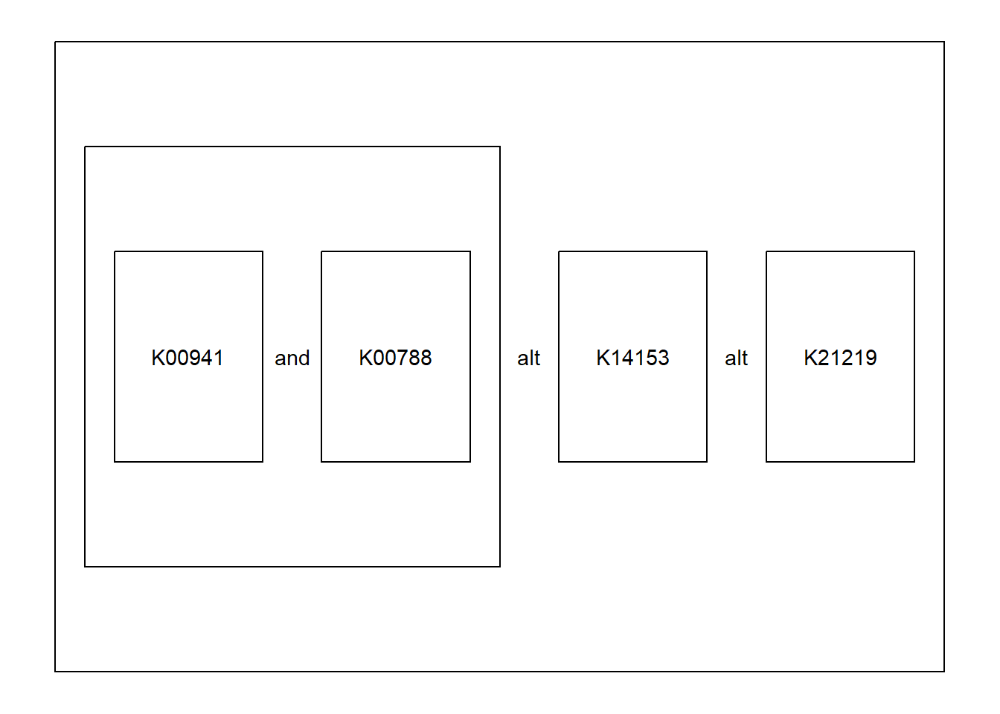

# Notes

## Stamp function

The `stamp` function can be used to highlight the nodes with colored rectangles.


``` r
library(ggkegg)
ggraph(pathway("ko00270"), layout="manual", x=x, y=y)+
    geom_node_rect()+
    stamp("ko:K00789")+
    theme_minimal()
```


## Parsing of the module definition

For module describing multiple lines of the definition (e.g. `M00897`), the `module` function tries to parse them separately. These definitions will be assigned the number (in `character` type).


``` r
mod <- module("M00899")


defs <- get_module_attribute(mod, "definitions")
defs[["1"]]
#> $definition_block
#> [1] "K00878"
#> 
#> $definition_kos
#> [1] "K00878"
#> 
#> $definition_num_in_block
#> [1] 1
#> 
#> $definition_ko_in_block
#> $definition_ko_in_block[[1]]
#> [1] "K00878"
defs[["2"]]
#> $definition_block
#> [1] "((K00941 K00788),K14153,K21219)"
#> 
#> $definition_kos
#> [1] "K00941" "K00788" "K14153" "K21219"
#> 
#> $definition_num_in_block
#> [1] 4
#> 
#> $definition_ko_in_block
#> $definition_ko_in_block[[1]]
#> [1] "K00941" "K00788" "K14153" "K21219"

## Extract definition 2
mod |>
  module_text("2") |> ## return data.frame
  plot_module_text() ## wrapper function
```




## Parsing of reactions in the pathway

In the `devel` branch of `ggkegg`, the KGML of the following reactions ([https://www.genome.jp/entry/R00863](https://www.genome.jp/entry/R00863)) in `ko00270` are parsed in the below format by default.

```xml
<reaction id="237" name="rn:R00863" type="irreversible">
    <substrate id="183" name="cpd:C00606"/>
    <product id="238" name="cpd:C00041"/>
    <product id="236" name="cpd:C09306"/>
</reaction>
```


``` r
library(ggkegg)
reac <- pathway("ko00270")
nname <- reac %N>% pull(name)
reac %E>% data.frame() %>% filter(reaction=="rn:R00863") %>% 
    mutate(fromn=nname[from], ton=nname[to])
#>   from  to         type subtype_name subtype_value
#> 1   91 128 irreversible    substrate          <NA>
#> 2  128 129 irreversible      product          <NA>
#> 3  128 127 irreversible      product          <NA>
#>    reaction reaction_id pathway_id      fromn        ton
#> 1 rn:R00863         237    ko00270 cpd:C00606  ko:K09758
#> 2 rn:R00863         237    ko00270  ko:K09758 cpd:C00041
#> 3 rn:R00863         237    ko00270  ko:K09758 cpd:C09306
```

These edges correspond to the relationship between compound `substrate` or `product` and `reaction (orthology)` nodes. These edges are kept for the conversion in `process_reaction`, where `substrate` and `product` are directly connected by edges.


``` r
reac2 <- reac |> process_reaction()
node_df <- reac2 %N>% data.frame()
reac2 %E>% data.frame() |>
    filter(reaction=="rn:R00863") |>
    mutate(from_name=node_df$name[from], to_name=node_df$name[to])
#>   from  to         type subtype_name subtype_value
#> 1   91 129 irreversible         <NA>          <NA>
#> 2   91 127 irreversible         <NA>          <NA>
#>    reaction reaction_id pathway_id      name bgcolor
#> 1 rn:R00863        <NA>       <NA> ko:K09758 #BFBFFF
#> 2 rn:R00863        <NA>       <NA> ko:K09758 #BFBFFF
#>   fgcolor  from_name    to_name
#> 1 #000000 cpd:C00606 cpd:C00041
#> 2 #000000 cpd:C00606 cpd:C09306
```


## Interpolation in the raster image

The `annotation_custom` is used in `overlay_raw_map`. The `interpolate` option can be specified.


``` r
ggraph(pathway("hsa04110"), layout="manual", x=x, y=y) + overlay_raw_map(interpolate=TRUE) + theme_void()
```


``` r
ggraph(pathway("hsa04110"), layout="manual", x=x, y=y) + overlay_raw_map(interpolate=FALSE) + theme_void()
```


## `add_readable_edge_label` {#addreadable}

The example in \@ref(global) uses customized ggraph function for highlighting edge labels. `add_readable_edge_label` can highlight the edge label by `shadowtext`. This layer must be inserted just after the layer with labels. `label_colour` argument in the mapping should specify which column in the edge to be used for coloring.


``` r
pathway("hsa03460") %>%
    ggraph(layout="kk")+
    geom_edge_link(aes(label=subtype_value,
         label_colour=subtype_value), color="grey80")+
    add_readable_edge_label(size=5)+
    geom_node_point()+
    theme_graph()
```


