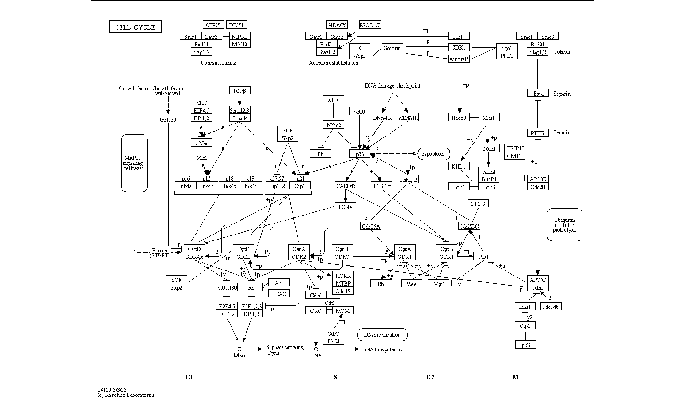

# Notes

## Parsing of reactions in the pathway

In the `devel` branch of `ggkegg`, the KGML of the following reactions ([https://www.genome.jp/entry/R00863](https://www.genome.jp/entry/R00863)) in `ko00270` are parsed in the below format by default.

```xml
<reaction id="237" name="rn:R00863" type="irreversible">
    <substrate id="183" name="cpd:C00606"/>
    <product id="238" name="cpd:C00041"/>
    <product id="236" name="cpd:C09306"/>
</reaction>
```


```r
library(ggkegg)
reac <- pathway("ko00270")
reac |> activate(edges) |> data.frame() |> filter(reaction=="rn:R00863")
#>   from  to         type subtype_name subtype_value
#> 1   91 128 irreversible    substrate          <NA>
#> 2  128 129 irreversible      product          <NA>
#> 3  128 127 irreversible      product          <NA>
#>    reaction reaction_id pathway_id
#> 1 rn:R00863         237    ko00270
#> 2 rn:R00863         237    ko00270
#> 3 rn:R00863         237    ko00270
```

These edges correspond to the relationship between compound `substrate` or `product` and `reaction (orthology)` nodes. These edges are kept for the conversion in `process_reaction`, where `substrate` and `product` are directly connected by edges.


```r
reac2 <- reac |> process_reaction()
node_df <- reac2 |> activate(nodes) |> data.frame()
reac2 |> activate(edges) |> data.frame() |>
    filter(reaction=="rn:R00863") |>
    mutate(from_name=node_df$name[from], to_name=node_df$name[to])
#>   from  to         type subtype_name subtype_value
#> 1   91 129 irreversible         <NA>          <NA>
#> 2   91 127 irreversible         <NA>          <NA>
#>    reaction reaction_id pathway_id      name bgcolor
#> 1 rn:R00863        <NA>       <NA> ko:K09758 #BFBFFF
#> 2 rn:R00863        <NA>       <NA> ko:K09758 #BFBFFF
#>   fgcolor  from_name    to_name
#> 1 #000000 cpd:C00606 cpd:C00041
#> 2 #000000 cpd:C00606 cpd:C09306
```


## Interpolation in the raster image

The `annotation_custom` is used in `overlay_raw_map`. The `interpolate` option can be specified.


```r
ggraph(pathway("hsa04110"), layout="manual", x=x, y=y) + overlay_raw_map(interpolate=TRUE) + theme_void()
```


```r
ggraph(pathway("hsa04110"), layout="manual", x=x, y=y) + overlay_raw_map(interpolate=FALSE) + theme_void()
```


