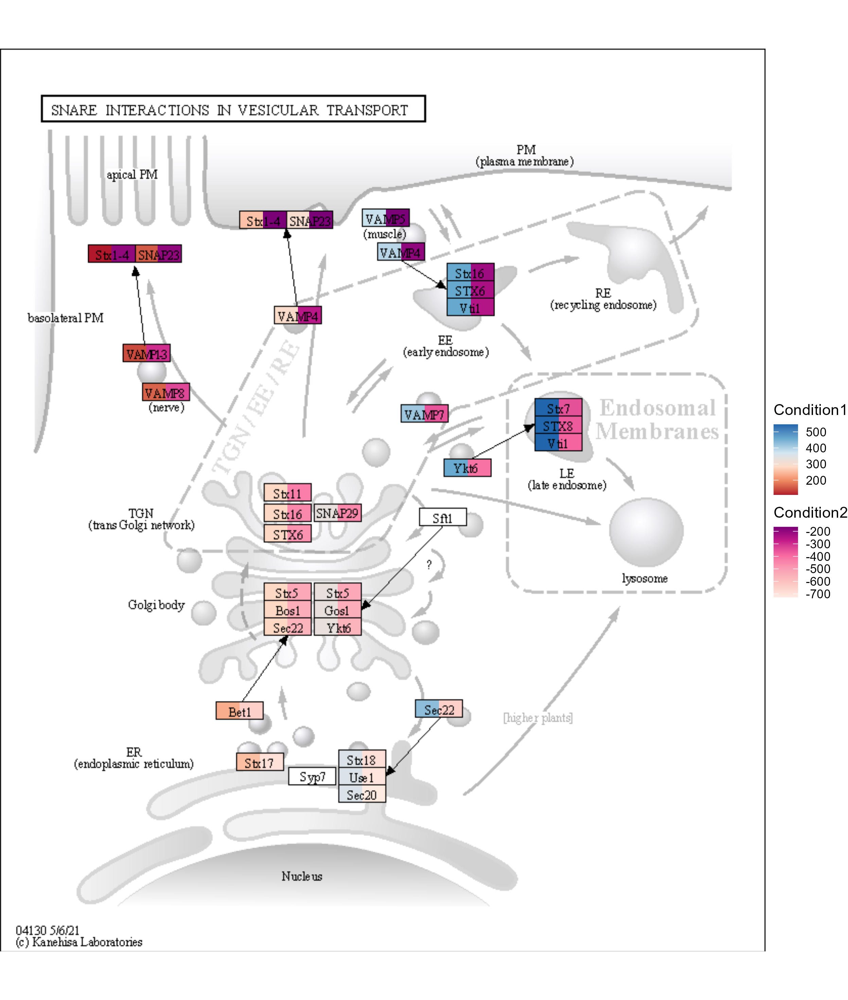
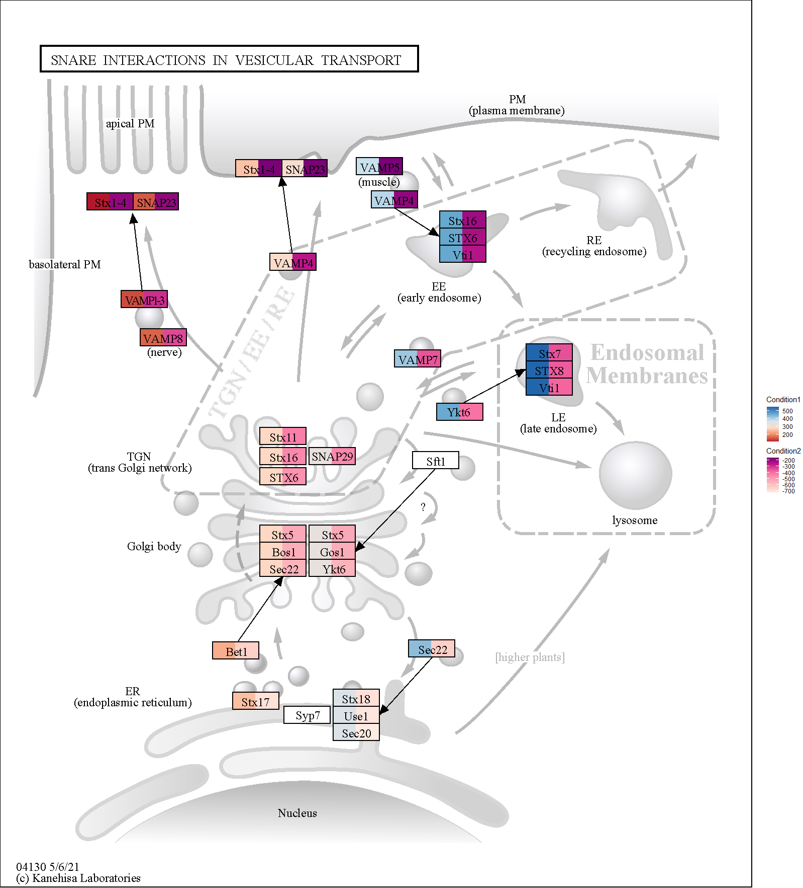

# Saving the resulting image

## `ggkeggsave`

`ggkegg` uses the `annotation_raster` for overlaying the original KEGG image.
This section describes how one can save the resulting custom plot for the publication.
The `ggkeggsave` function is prepared, which respects the original dimension of the image.
The function is intended for the ggplot with the `overlay_raw_map` layer.
On `overlay_raw_map`, one can control whether the interpolation is performed by `interpolate` option.
In some instances, `interpolate=TRUE` makes blurry images and by default it is disabled.


```r
library(ggkegg)
library(ggh4x)
g <- pathway("hsa04130")
gg <- ggraph(g, layout="manual", x=x, y=y)+
    geom_node_rect(aes(fill1=x, filter=type=="gene"))+
    geom_node_rect(aes(fill2=y, xmin=xmin+width/2, filter=type=="gene"))+
    scale_fill_multi(aesthetics = c("fill1", "fill2"),
        name = list("Condition1", "Condition2"),
        colours = list(
            scales::brewer_pal(palette = "RdBu")(6),
            scales::brewer_pal(palette = "RdPu")(6)),
            guide = guide_colorbar(barheight = unit(50, "pt")))+
    overlay_raw_map()+
    theme_void()
ggkeggsave("test1.png", gg)

```


## `output_overlay_image`

If one wants to keep the original resolution of the image, `output_overlay_image` function can be used.
This combines the image from ggplot layers and the original PNG image (and optionally legend image) and outputs it.
This extracts the main panel from ggplot objecy by gtable functions, and thus the legend, title, axis and the other elements outside the main panel is omitted for aligning the node position with the original image. The legend can be placed inside the plot by the theme like `theme(legend.position=c(0.5, 0.5))`, or `with_legend_image=TRUE` can be specified to additionaly concatenate the legend image.

The examples follow:

The legend insides the main panel.


```r
g <- pathway("hsa04130")
gg <- ggraph(g, layout="manual", x=x, y=y)+
    geom_node_rect(aes(fill=x, filter=type=="gene"))+
    theme_void()+
    theme(legend.position=c(0.9, 0.2))
output_overlay_image(gg, use_cache=TRUE, with_legend=TRUE,  out="test2.png")
#> [1] "test2.png"
knitr::include_graphics("test2.png")
```


The legend outside the main panel (`with_legend_image=TRUE`).


```r
g <- pathway("hsa04130")
gg <- ggraph(g, layout="manual", x=x, y=y)+
    geom_node_rect(aes(fill1=x, filter=type=="gene"))+
    geom_node_rect(aes(fill2=y, xmin=xmin+width/2, filter=type=="gene"))+
    scale_fill_multi(aesthetics = c("fill1", "fill2"),
        name = list("Condition1", "Condition2"),
        colours = list(
            scales::brewer_pal(palette = "RdBu")(6),
            scales::brewer_pal(palette = "RdPu")(6)),
            guide = guide_colorbar(barheight = unit(50, "pt")))+
    theme_void()
output_overlay_image(gg, use_cache=TRUE, with_legend_image=TRUE, out="test3.png")
#> [1] "test3.png"
knitr::include_graphics("test3.png")
```


Using high resolution (2x) images (should multiply the x* and y* positions, and adjust high `res` parameter and `legend_space` parameters in `output_overlay_image`):


```r
g <- pathway("hsa04130")
gg <- ggraph(g, layout="manual", x=x, y=y)+
    geom_node_rect(aes(fill1=x, xmin=xmin*2, xmax=xmax*2, ymin=ymin*2, ymax=ymax*2, filter=type=="gene"))+
    geom_node_rect(aes(fill2=y, xmin=xmin*2+width, xmax=xmax*2, ymin=ymin*2, ymax=ymax*2, filter=type=="gene"))+
    scale_fill_multi(aesthetics = c("fill1", "fill2"),
        name = list("Condition1", "Condition2"),
        colours = list(
            scales::brewer_pal(palette = "RdBu")(6),
            scales::brewer_pal(palette = "RdPu")(6)),
            guide = guide_colorbar(barheight = unit(50, "pt")))+
    theme_void()
output_overlay_image(gg, high_res=TRUE, use_cache=TRUE, with_legend_image=TRUE,
	res=100, legend_space=100,
	out="test4.png")
#> [1] "test4.png"

```


This makes sure the original image resolution is preserved.
