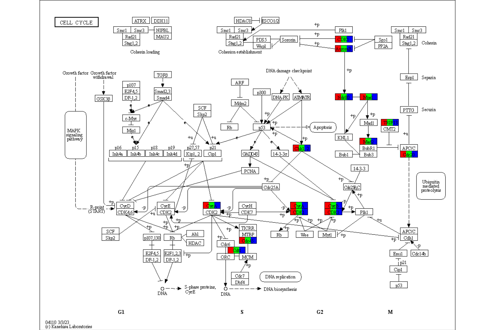
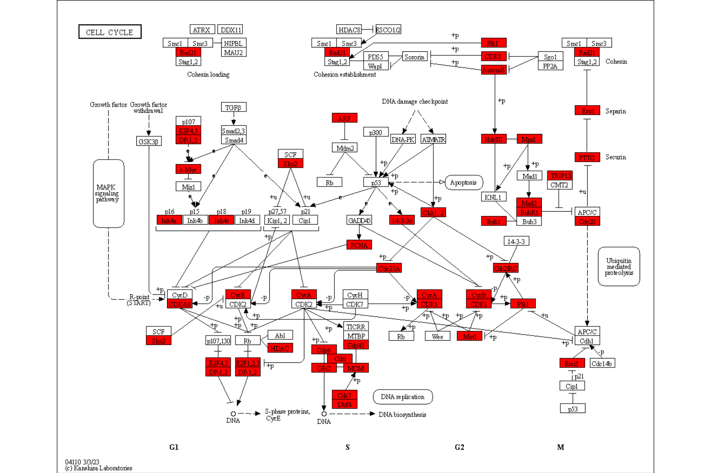
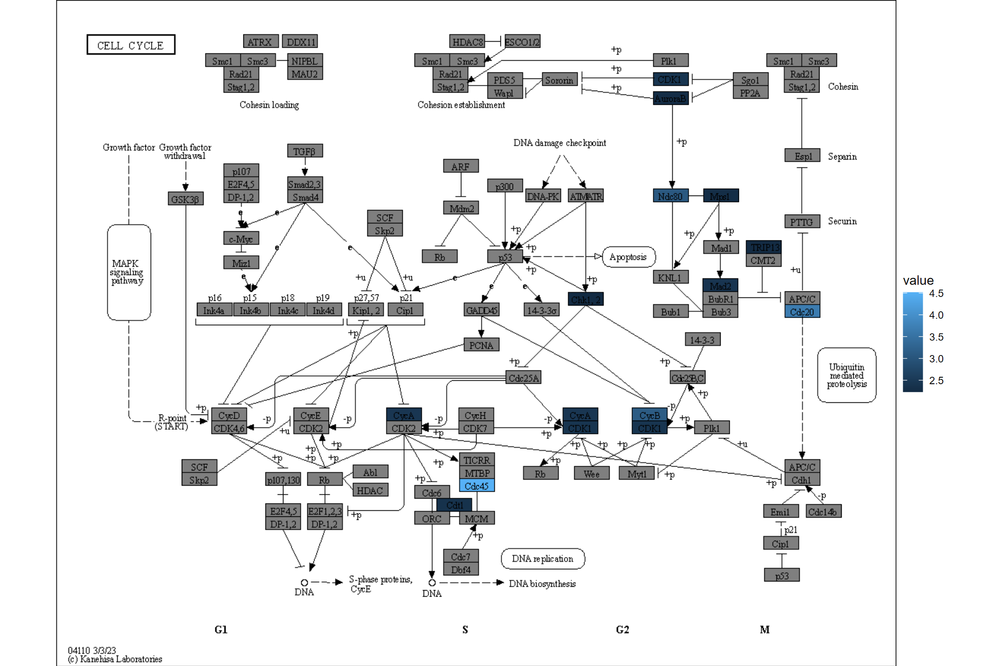

# Analysis of GSEA results


``` r
library(ggkegg)
library(ggfx)
library(ggraph)
library(igraph)
library(clusterProfiler)
library(dplyr)
library(tidygraph)
library(org.Hs.eg.db)
```

## Visualize the result of `enrichKEGG` and `gseKEGG`

The library can directly visualize the functional enrichment analysis result using `enrichKEGG` from `clusterProfiler`. The `enrich_attribute` will have boolean value whether the investigated gene is in pathway or not. By piping a `enrichResult` class object and `pathway_number` to `ggkegg`, `enrich_attribute` will be included in the resulting graph. Highlight `enrich_attribute` in the resulting graph. For a quick inspection, `rawMap` function can be used for simply producing highlighted graph with overlaid KEGG raw map.


``` r
data(geneList, package='DOSE')
de <- names(geneList)[1:100]
enrichKEGG(de, pvalueCutoff=0.01) |>
  ggkegg(convert_org = "hsa",
         pathway_number=1) +
    geom_edge_link(
    aes(color=subtype_name),
    arrow = arrow(length = unit(1, 'mm')), 
    start_cap = square(1, 'cm'),
    end_cap = square(1.5, 'cm')) + 
    geom_node_rect(aes(filter=.data$undefined & !.data$type=="gene"),
                   fill="transparent", color="red")+
    geom_node_rect(aes(filter=!.data$undefined &
                         .data$type=="gene"), fill="white", color="black")+
    geom_node_text(aes(label=converted_name,
                       filter=.data$type == "gene"),
                   size=2.5,
                   color="black",family="serif")+
    with_outer_glow(geom_node_text(aes(label=converted_name,
                                       filter=.data$enrich_attribute),
                                   size=2.5, color="red"),
                    colour="white",
                    expand=4)+
    theme_void()
```


``` r


## Quick inspection
res <- enrichKEGG(de, pvalueCutoff=0.01) |> rawMap()
res
```


`rawMap` can accept multiple `enrichResult` class objects, given by list. In this case, users can choose which color to highlight the components in the list by specifying multiple colors in `fill_color`. Also, you should specify pathway ID for multiple enrichment results.


``` r
deres <- enrichKEGG(de, pvalueCutoff=0.01) 
res <- rawMap(list(deres, deres, deres), fill_color=c("red","green","blue"), pid="hsa04110")
res
```



If the results are converted to readable format, you can specify name argument to the column name in node data.


``` r
deres <- enrichKEGG(de, pvalueCutoff=0.01) 
deres <- setReadable(deres, org.Hs.eg.db, "ENTREZID")
res <- rawMap(list(deres, deres, deres), fill_color=c("red","green","blue"), pid="hsa04110", name="graphics_name", sep=", ")
res
```


`rawMap` also accepts `gseaResult` class, although it may be useful for assigning numeric values such as log2 fold changes directly.


``` r
data(geneList, package="DOSE")
kk <- gseKEGG(geneList)
res <- rawMap(kk)
res
```



The same can be done for the numeric values using `rawValue`. You can control your favorite color gradient using `scale_fill_gradient*`. Note if multiple named vectors were passed by a list, the same scale is used. It can be customized by adding the additional scales using the package such as [`ggh4x`](https://github.com/teunbrand/ggh4x).


``` r
res <- rawValue(geneList[1:100], "hsa04110", auto_add=TRUE)
res
```




## Using multiple scales when highlighting multiple values in pathway

Using `ggh4x`, you can plot the multiple values in its own scale using `scale_fill_multi()`. It is used in the package `plotKEGGPathway` in `stana` package for intra-species diversity analysis. For usage in the function, please refer to [`ggh4x`](https://github.com/teunbrand/ggh4x) site and [the code](https://github.com/noriakis/stana/blob/main/R/plotKEGGPathway.R).


``` r
library(ggh4x)
test <- geneList[1:100]
names(test) <- paste0("hsa:",names(test))
g <- pathway("hsa04110") |> 
  mutate(value1=node_numeric(test),
         value2=node_numeric(test),
         value3=node_numeric(test),
         value4=node_numeric(test))
res <- ggraph(g) + 
  geom_node_rect(aes(value1=value1)) + 
  geom_node_rect(aes(value2=value2, xmin=xmin+width/4))+
  geom_node_rect(aes(value3=value3, xmin=xmin+2*width/4))+
  geom_node_rect(aes(value4=value4, xmin=xmin+3*width/4))+
  overlay_raw_map() + theme_void() +
  scale_fill_multi(aesthetics = c("value1", "value2",
                                  "value3", "value4"),
                   name = list("Condition1",
                               "Condition2",
                               "Condition3",
                               "Condition4"),
                   colours = list(
                     scales::brewer_pal(palette = "YlGnBu")(6),
                     scales::brewer_pal(palette = "RdPu")(6),
                     scales::brewer_pal(palette = "PuOr")(6),
                     scales::brewer_pal(palette = "RdBu")(6)
                   ),
                   guide = guide_colorbar(barheight = unit(50, "pt")))
res
```


