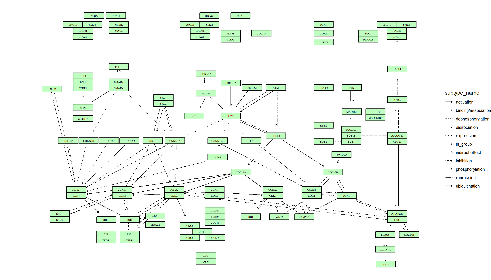

--- 
title: "ggkegg"
author: "Noriaki Sato"
date: "2023-06-08"
site: bookdown::bookdown_site
documentclass: book
bibliography: [book.bib]
# url: your book url like https://bookdown.org/yihui/bookdown
# cover-image: path to the social sharing image like images/cover.jpg
biblio-style: apalike
csl: chicago-fullnote-bibliography.csl
---


# About

`ggkegg` fetches information from KEGG and parse, analyze and visualize them using `ggplot2` and `ggraph`, combined with the other packages investigating biological functions using KEGG. This package aims to visualize the complex components of KEGG using grammar of graphics.


```r
# devtools::install_github("noriakis/ggkegg")
library(ggkegg)
```

One of the main aims of `ggkegg` or `tidykegg` is manupilating KEGG information in tidy ways using `tidygraph`.


```r
library(dplyr)
library(tidygraph)
pathway("hsa04110") |> ## Obtain and parse the KEGG pathway
  activate(nodes) |> ## node manipulation
  mutate(convert_hsa=convert_id("hsa"),
         convert_map=convert_id("pathway")) |> ## convert IDs for organism hsa and pathway
  ggraph(x=x, y=y)+ ## ggraph plot
  geom_node_rect(aes(filter=type=="gene",
                     fill=I(bgcolor)),
                 color="black")+
  geom_node_text(aes(label=convert_hsa),
                 size=2, family="serif")
```


