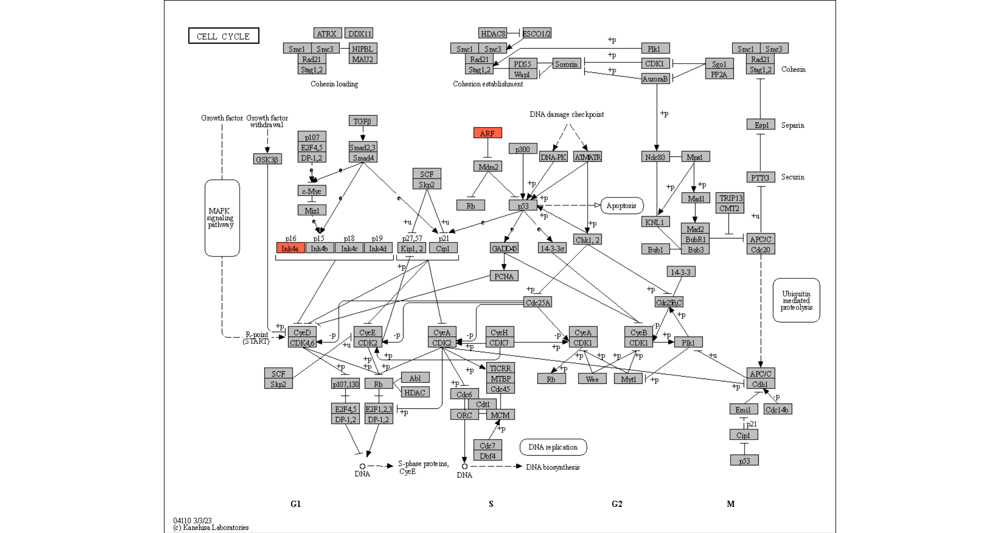

# About

`ggkegg` fetches information from KEGG and parse, analyze and visualize them using `ggplot2` and `ggraph`, combined with the other packages investigating biological functions using KEGG. This package aims to visualize the complex components of KEGG using the grammar of graphics. For Python, please use [`pykegg`](https://noriakis.github.io/pykegg-docs/) using `plotnine`, which offers the almost same functionality as `ggkegg` used in conjuction with the package such as `gseapy` and `PyDESeq2` and single-cell transcriptomics analysis library `scanpy`.

::: rmdwarning
`ggkegg` uses KEGG API, and is restricted to academic use by academic users belonging to academic institutions.
:::


``` r
# devtools::install_github("noriakis/ggkegg")
library(ggkegg)
```

One of the main aims of `ggkegg` is manupilating KEGG information in tidy ways using `tidygraph`, and offers the customized visualization of KEGG information including KEGG PATHWAY, MODULE, and NETWORK.


``` r
library(dplyr)
library(tidygraph)
pathway("hsa04110") |> ## Obtain and parse the KEGG pathway
  activate(nodes) |> ## node manipulation
  mutate(convert_hsa=convert_id("hsa"),
         convert_map=convert_id("pathway")) |> ## convert IDs for organism hsa and pathway
  ggraph(x=x, y=y)+ ## ggraph plot
  geom_edge_parallel(arrow=arrow(length=unit(1,"mm")),
                     aes(linetype=subtype_name),
                     end_cap=circle(7.5,"mm"))+ ## Parallel edges
  geom_node_rect(aes(filter=type=="gene",
                     fill=I(bgcolor)),
                 color="black")+ ## rectangular nodes
  geom_node_text(aes(label=convert_hsa),
                 size=2, family="serif")+ ## text
  geom_node_text(aes(label=convert_hsa,
                     filter=!is.na(convert_hsa) & convert_hsa=="TP53"),
                 size=2, color="red", family="serif")+ ## highlight text
  theme_void()
```


Some convenient functions are prepared, like highlighting genes in the pathway.


``` r
## Highlight genes in the pathway, and overlay raw map.
highlight_entities("hsa04110", "CDKN2A")
```



If named numeric vector is provided, continuous scale will be used.


``` r
## Highlight genes in the pathway, and overlay raw map.
vecs <- c(-2,2) |> setNames(c("CDKN2A", "CDC45"))
cs <- highlight_entities("hsa04110", vecs) + 
    scale_fill_viridis(name="LFC")
cs
```


The plot using the original KEGG image can be saved via the `ggkeggsave` using the original dimension. The function is the wrapper of `ggsave`.


``` r
ggkeggsave(filename="test.png", cs, dpi=300)

```


## Bugs and errors

If you find bugs, suggestions, or errors such as parsing errors, please kindly report them to [Issues](https://github.com/noriakis/ggkegg/issues), or make a [pull request](https://github.com/noriakis/ggkegg/pulls), or report it directly to [e-mail](nori@hgc.jp).
