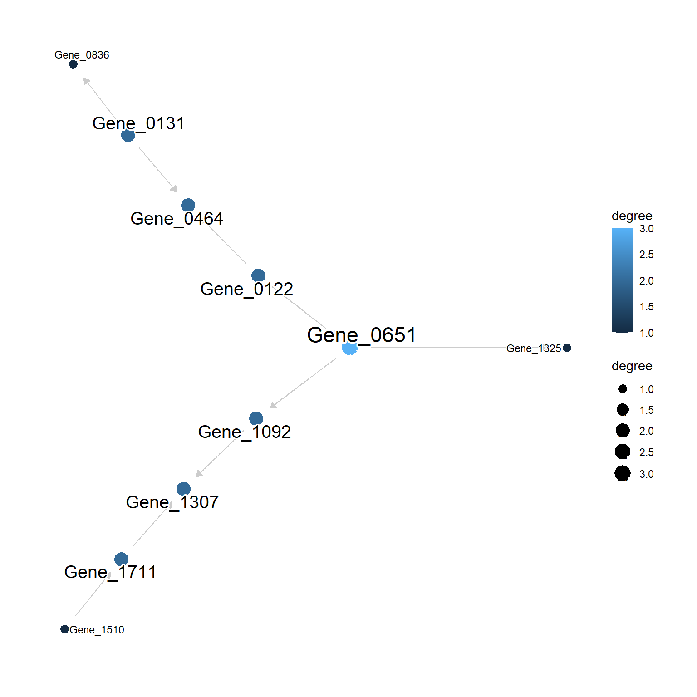
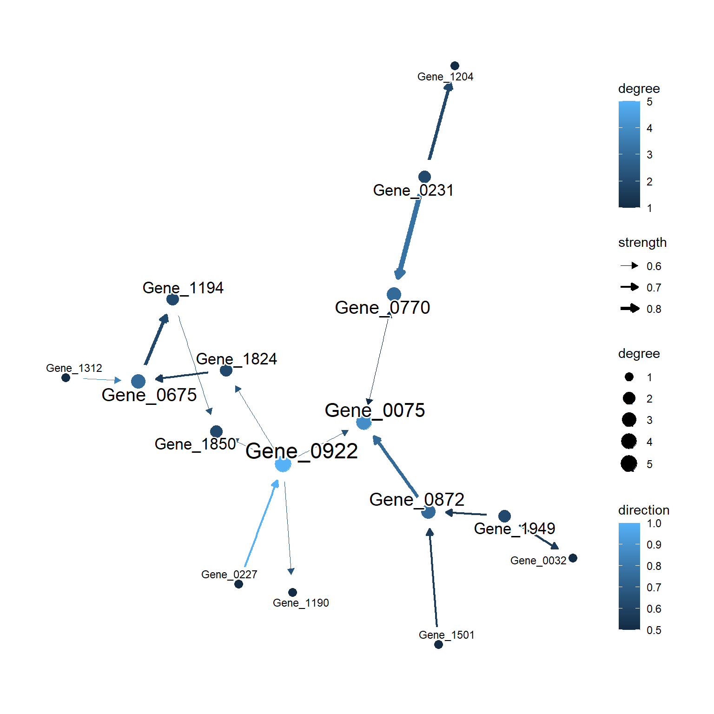
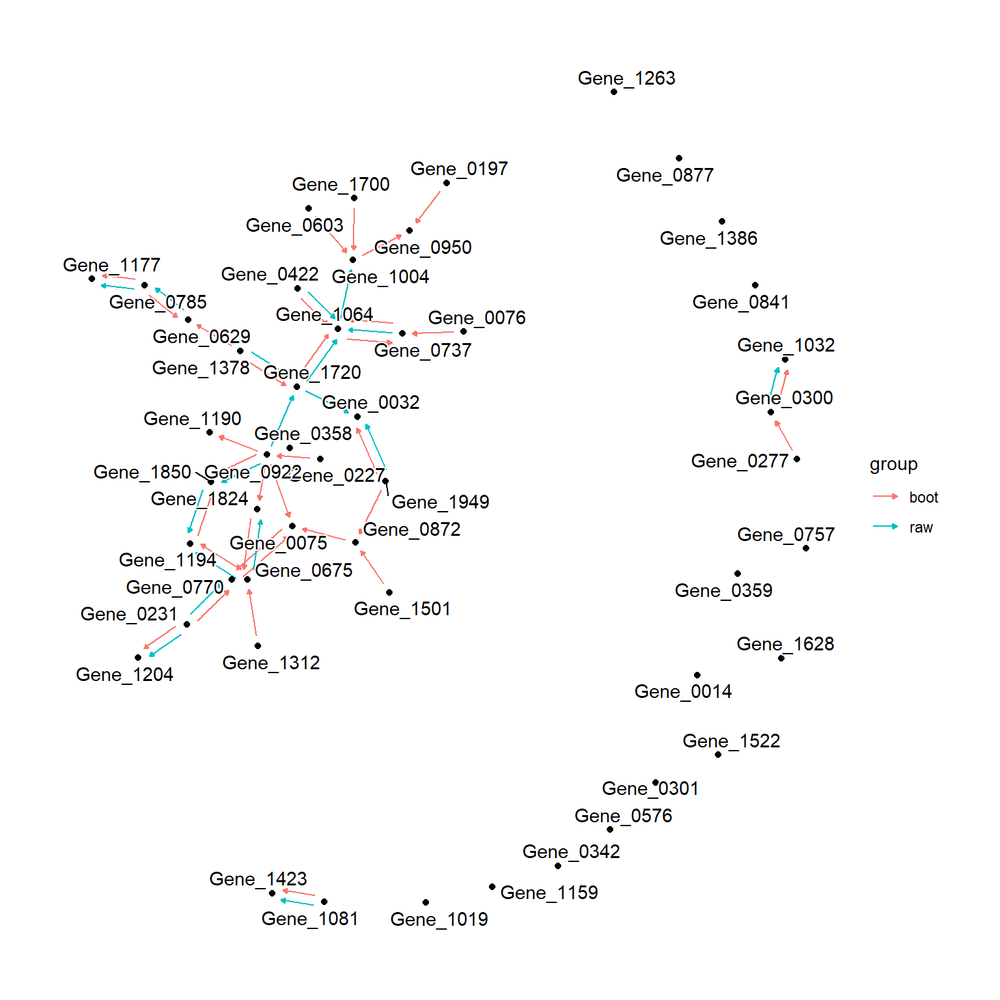

# Plotting functions {#plot}


The library has various functions for visualizing the inferred networks with highlighting the important regulatory relationships and comparing the inferred networks by multiple algorithms, using the `ggraph`, `tidygraph` and `ggfx`. These can be useful for the diagnosis and for the publication figure. Mostly, the function accepts the `bn` object from `bnlearn`.

## `plotNet`

`plotNet` function accepts `bn` object.


``` r
library(scstruc)
sce <- mockSCE()
sce <- logNormCounts(sce)
included_genes <- sample(row.names(sce), 50)
gs <- scstruc(sce, included_genes, changeSymbol=FALSE,
	algorithm="glmnet_BIC", returnData=TRUE)

## Vanilla plot
plotNet(gs$net)
```



Optionally, `data` can be passed to fit the parameters and the function colors the edge using the fitted parameters. The nodes will be sized by their degrees. `degreeMode` argument can be specified for how the degree will be calculated. By default, `mode="all"` is specified.


## `plotAVN`

This function is intended specifically for visualizing the bootstrapped networks. You can pass the results of functions returning `bn.strength` object, to this function. The threshold will be automatically determined if not specified. In the plot, the strength are shown as edge width, and the direction are shown as edge color. The node sizes will be determined by the degree.


``` r
library(ggraph)
gs.boot <- scstruc(sce, included_genes, changeSymbol=FALSE, boot=TRUE, R=10,
             algorithm="glmnet_BIC", returnData=TRUE)
#> Bootstrapping specified

plotAVN(gs.boot$net)
```



Edges can be highlighted by specifying `highlightEdges` argument, as same as `plotNet`. In the `plotAVN`, the `with_outer_glow` function in `ggfx` package is used to highlight edges as to preserve the strength and direction mapping in the plot.

## `ggraph.compare`

Similar to `graphviz.compare` function in `bnlearn`, the diagnostic plot can be made by `ggraph.compare`. This accepts the list of `bn` object and plot the nodes and each edge associated with the graphs by `geom_edge_parallel`. The agreement of edges in multiple graphs can be understood with the function, however, it will get too complicated if many graphs are provided.


``` r
ggraph.compare(list("boot"=averaged.network(gs.boot$net), "raw"=gs$net))
```


