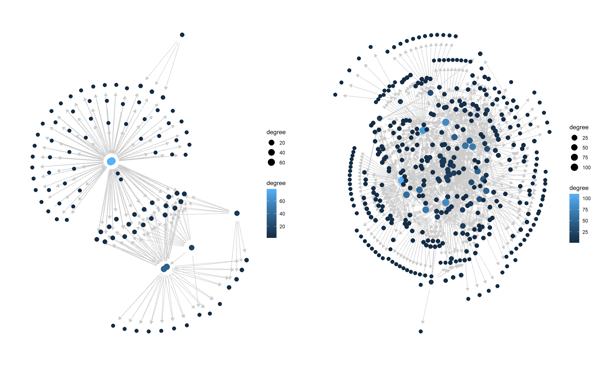
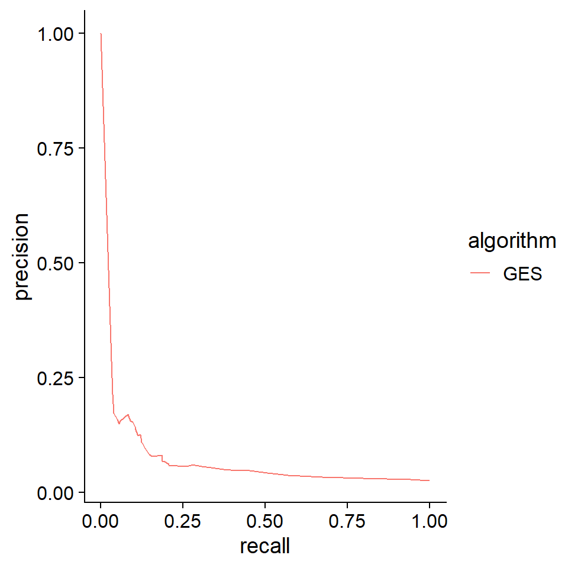
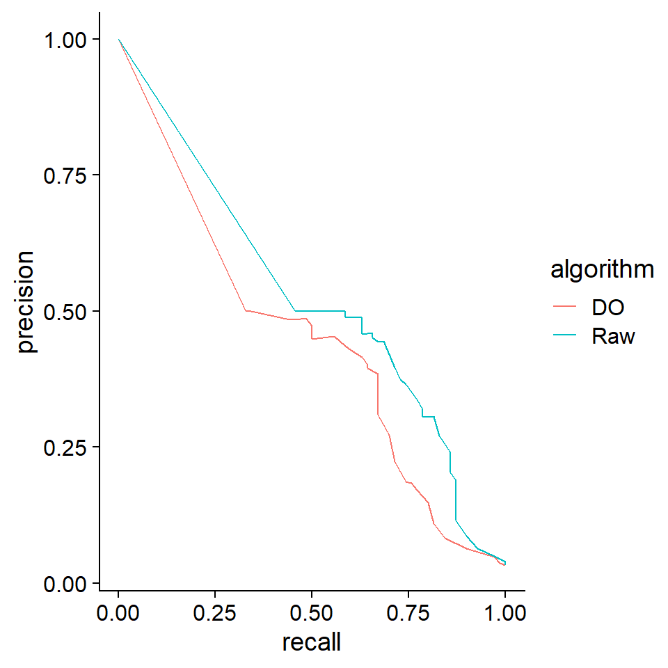

# Analysis {#analysis}


## Evaluation based on `SERGIO`

### Load and plot

`SERGIO`, a simulator of single-cell gene expression data, models the single-cell gene expression data based on the user-specified GRN. After cloning the repository, first load the GRN in the dataset. Then plot the loaded network using `plotNet`.


``` r
library(scstruc)
library(dplyr);library(igraph);library(bnlearn)

## De-noised_100G_9T_300cPerT_4_DS1
gt <- read.csv("De-noised_100G_9T_300cPerT_4_DS1/gt_GRN.csv", header=FALSE)
gt <- gt %>% `colnames<-`(c("from","to"))
gt$from <- paste0("G",gt$from)
gt$to <- paste0("G",gt$to)
g <- graph_from_data_frame(gt)

### Consider the GRN as DAG
is_dag(g)
#> [1] TRUE
ref.bn.ds1 <- bnlearn::as.bn(g)
ds1 <- plotNet(ref.bn.ds1, showText=FALSE)

## De-noised_400G_9T_300cPerT_5_DS2
gt <- read.csv("De-noised_400G_9T_300cPerT_5_DS2/gt_GRN.csv", header=FALSE)
gt <- gt %>% `colnames<-`(c("from","to"))
gt$from <- paste0("G",gt$from)
gt$to <- paste0("G",gt$to)
g <- graph_from_data_frame(gt)

### Consider the GRN as DAG
is_dag(g)
#> [1] TRUE
ref.bn.ds2 <- bnlearn::as.bn(g)
ds2 <- plotNet(ref.bn.ds2, showText=FALSE)

library(patchwork)
ds1 + ds2
```




### Inference and evaluation

Load the expression data, and bootstrapped network is obtained using GES algorithm. The expression is coarse-grained beforehand. The performance metrics is calculated based on the functions in `scstruc`.


``` r
## DS1
df <- read.csv("De-noised_100G_9T_300cPerT_4_DS1/simulated_noNoise_0.csv", row.names=1)
dim(df)
#> [1]  100 2700
row.names(df) <- paste0("G",row.names(df))
df <- scstruc::superCellMat(as.matrix(df), pca=FALSE)
#>   SuperCell dimension: 100 270
input <- data.frame(t(as.matrix(df)))
ges.res <- pcalg.boot(input, R=25)

calc.auprc(ref.bn.ds1, ges.res)
#> # A tibble: 1 × 3
#>   .metric .estimator .estimate
#>   <chr>   <chr>          <dbl>
#> 1 pr_auc  binary        0.0728
prc.plot(ref.bn.ds1, list("GES"=ges.res))+
    cowplot::theme_cowplot()
```




## Adding dropout to GBN

As another method to reproduce dropout in non-SCT data, the `add.dropout` function is provided. In this example, the function was applied to data sampled from a Gaussian Bayesian network, and the estimation accuracy was compared using the same inference methods.


``` r
net <- readRDS("ecoli70.rds")

dat <- rbn(net, 100)
dat2 <- dat * add.dropout(dat, q=0.2)

raw <- pcalg.boot(dat, R=25)
raw.2 <- pcalg.boot(dat2, R=25)

prc.plot(bn.net(net),
    list("Raw"=raw, "DO"=raw.2))+
    cowplot::theme_cowplot()
```


