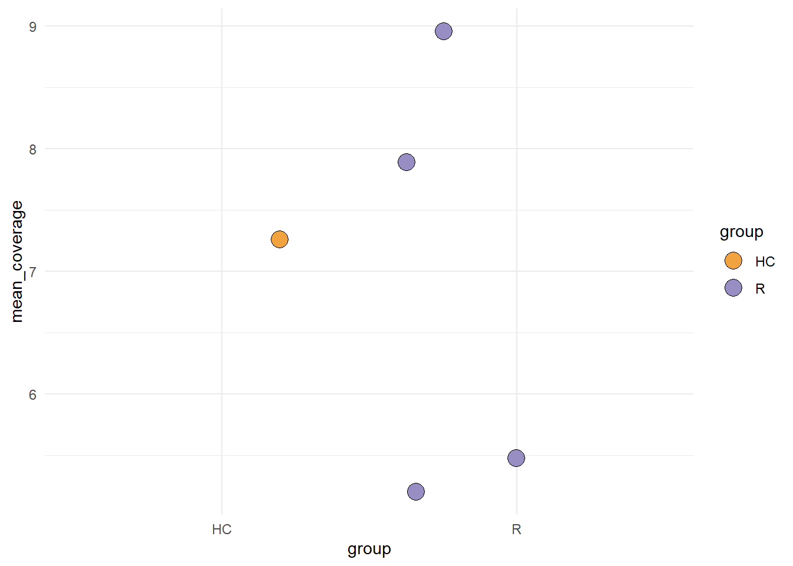

# Importing

`stana` is aimed to import the metagenotyping results of various pipelines.
The package is designed primarily for `MIDAS` and `MIDAS2`, which outputs the 
gene abundances by default. Note that the slot name `snps` here refers to just the variable, and not to reflect the actual meaning.


```r
library(stana)
#> 
```

## MIDAS

For `MIDAS`, `loadMIDAS` function can be used to import the output of `merge` command.


```r
# stana <- loadMIDAS("../")
```

## MIDAS2

For `MIDAS2`, `loadMIDAS2` function can be used to import the output of `merge` command.
Here, we load the example dataset deposited by the study investigating gut microbiome of hemodialysis patients ([Shi et al. 2022](https://doi.org/10.3389/fcimb.2022.904284)). `hd_meta` includes named list of grouping.


```r
load("../hd_meta.rda")
hd_meta
#> $HC
#>  [1] "ERR9492498" "ERR9492502" "ERR9492507" "ERR9492508"
#>  [5] "ERR9492512" "ERR9492497" "ERR9492499" "ERR9492501"
#>  [9] "ERR9492504" "ERR9492505" "ERR9492509" "ERR9492511"
#> [13] "ERR9492500" "ERR9492503" "ERR9492506" "ERR9492510"
#> 
#> $R
#>  [1] "ERR9492489" "ERR9492490" "ERR9492492" "ERR9492494"
#>  [5] "ERR9492519" "ERR9492524" "ERR9492526" "ERR9492527"
#>  [9] "ERR9492528" "ERR9492513" "ERR9492514" "ERR9492518"
#> [13] "ERR9492520" "ERR9492522" "ERR9492523" "ERR9492525"
#> [17] "ERR9492491" "ERR9492493" "ERR9492495" "ERR9492496"
#> [21] "ERR9492515" "ERR9492516" "ERR9492517" "ERR9492521"
```

We can check stats of how many samples are profiled for each species, by `only_stat`. This returns the list of tibbles with names `snps` and `genes`.


```r
stana <- loadMIDAS2("../merge_uhgg", only_stat=TRUE, cl=hd_meta)
stana$snps |> dplyr::filter(group=="HC") |> dplyr::arrange(desc(n)) |> head()
#> # A tibble: 6 × 3
#> # Groups:   species_id [6]
#>   species_id group     n
#>        <int> <chr> <int>
#> 1     101346 HC       12
#> 2     102438 HC       10
#> 3     101378 HC        9
#> 4     102478 HC        9
#> 5     102492 HC        8
#> 6     100044 HC        7
```
As the long output is expected, only one species is loaded here. 


```r
stana <- loadMIDAS2("../merge_uhgg", candSp="100002", cl=hd_meta)
#> SNPS
#>   100002
#>     Number of snps: 2058
#>     Number of samples: 5
#>       Number of samples in HC: 1
#>       Number of samples in R: 4
#>       Not passed the filter
#> Genes
#>   100002
#>     Number of genes: 23427
#>     Number of samples: 7
#>       Number of samples in HC: 1
#>       Number of samples in R: 6
#>       Not passed the filter
```

The data is profiled against UHGG. `loadSummary` and `loadInfo` can be specified to load the SNV summary and SNV info per species, which is default to `TRUE`.


```r
stana@snps$`100002` |> head()
#>                                 ERR9492497 ERR9492515
#> gnl|Prokka|UHGG000004_1|2901|A           1          1
#> gnl|Prokka|UHGG000004_1|4071|C           1          0
#> gnl|Prokka|UHGG000004_1|11094|T          1          0
#> gnl|Prokka|UHGG000004_1|11148|T          1          0
#> gnl|Prokka|UHGG000004_1|11940|G          0          0
#> gnl|Prokka|UHGG000004_1|11970|C          0          0
#>                                 ERR9492526 ERR9492527
#> gnl|Prokka|UHGG000004_1|2901|A           0      0.429
#> gnl|Prokka|UHGG000004_1|4071|C           1      0.000
#> gnl|Prokka|UHGG000004_1|11094|T          0      0.000
#> gnl|Prokka|UHGG000004_1|11148|T          0      0.429
#> gnl|Prokka|UHGG000004_1|11940|G          1      0.444
#> gnl|Prokka|UHGG000004_1|11970|C          1      0.556
#>                                 ERR9492528
#> gnl|Prokka|UHGG000004_1|2901|A           0
#> gnl|Prokka|UHGG000004_1|4071|C           0
#> gnl|Prokka|UHGG000004_1|11094|T          1
#> gnl|Prokka|UHGG000004_1|11148|T          1
#> gnl|Prokka|UHGG000004_1|11940|G          0
#> gnl|Prokka|UHGG000004_1|11970|C          0
stana@freqTableSnps |> head()
#>        species HC R
#> 100002  100002  1 4
```

For ID conversion, the metadata accompanied with the default database can be used.


```r
taxtbl <- read.table("../metadata_uhgg.tsv", sep="\t",
                     header=1, row.names=1, check.names = FALSE)
taxtbl |> head()
#>          representative MGnify_accession species_closest
#> 100001 GUT_GENOME000001  MGYG-HGUT-00001          100049
#> 100002 GUT_GENOME000004  MGYG-HGUT-00002          100201
#> 100003 GUT_GENOME000008  MGYG-HGUT-00003          103279
#> 100004 GUT_GENOME000010  MGYG-HGUT-00004          103876
#> 100005 GUT_GENOME000017  MGYG-HGUT-00005          101623
#> 100006 GUT_GENOME000020  MGYG-HGUT-00006          100011
#>        ani_closest gtpro_kmer_counts phyeco_marker_counts
#> 100001    83.35600                NA                   15
#> 100002    84.86955             29822                   15
#> 100003    93.41555              1115                   15
#> 100004    78.17620                NA                   15
#> 100005    85.84275                NA                   15
#> 100006    93.07075                NA                   15
#>        phyeco_pass_ratio pangene_counts genome_counts
#> 100001                 1           4893             4
#> 100002                 1         147601           358
#> 100003                 1         113409          1178
#> 100004                 1          12599            24
#> 100005                 1           5488             2
#> 100006                 1           2656             1
#>        Genome_type  Length N_contigs    N50 GC_content
#> 100001     Isolate 3219614       137  47258      28.26
#> 100002     Isolate 4433090       100 109266      42.60
#> 100003     Isolate 3229507        35 158570      58.52
#> 100004     Isolate 3698872       105  90296      54.19
#> 100005     Isolate 3930422        32 350032      28.59
#> 100006     Isolate 2822523        36 121380      32.65
#>        Completeness Contamination
#> 100001        98.59          0.70
#> 100002        99.37          0.00
#> 100003       100.00          0.00
#> 100004        98.66          0.22
#> 100005        99.30          0.00
#> 100006        99.26          1.39
#>                                                                                                                                                Lineage
#> 100001                                 d__Bacteria;p__Firmicutes_A;c__Clostridia;o__Peptostreptococcales;f__Peptostreptococcaceae;g__GCA-900066495;s__
#> 100002                            d__Bacteria;p__Firmicutes_A;c__Clostridia;o__Lachnospirales;f__Lachnospiraceae;g__Blautia_A;s__Blautia_A sp900066165
#> 100003                                   d__Bacteria;p__Bacteroidota;c__Bacteroidia;o__Bacteroidales;f__Rikenellaceae;g__Alistipes;s__Alistipes shahii
#> 100004                   d__Bacteria;p__Firmicutes_A;c__Clostridia;o__Oscillospirales;f__Ruminococcaceae;g__Anaerotruncus;s__Anaerotruncus colihominis
#> 100005 d__Bacteria;p__Firmicutes_A;c__Clostridia;o__Peptostreptococcales;f__Peptostreptococcaceae;g__Terrisporobacter;s__Terrisporobacter glycolicus_A
#> 100006                       d__Bacteria;p__Firmicutes;c__Bacilli;o__Staphylococcales;f__Staphylococcaceae;g__Staphylococcus;s__Staphylococcus xylosus
#>        Continent
#> 100001    Europe
#> 100002    Europe
#> 100003    Europe
#> 100004    Europe
#> 100005    Europe
#> 100006    Europe
```

The taxonomy table can be loaded with providing to `taxtbl` argument.


```r
loadMIDAS2("../merge_uhgg", cl=hd_meta, candSp="100002", taxtbl=taxtbl, db="uhgg")
#> SNPS
#>   100002
#>   d__Bacteria;p__Firmicutes_A;c__Clostridia;o__Lachnospirales;f__Lachnospiraceae;g__Blautia_A;s__Blautia_A sp900066165
#>     Number of snps: 2058
#>     Number of samples: 5
#>       Number of samples in HC: 1
#>       Number of samples in R: 4
#>       Not passed the filter
#> Genes
#>   100002
#>   d__Bacteria;p__Firmicutes_A;c__Clostridia;o__Lachnospirales;f__Lachnospiraceae;g__Blautia_A;s__Blautia_A sp900066165
#>     Number of genes: 23427
#>     Number of samples: 7
#>       Number of samples in HC: 1
#>       Number of samples in R: 6
#>       Not passed the filter
#> Type: MIDAS2
#> Directory: ../merge_uhgg
#> Species number: 1
#> Filter type: group, number: 2, proportion: 0.8
#> Loaded SNV table: 1
#>   Species cleared SNV filter: 0
#> Loaded gene table (copynum): 1
#>   Species cleared gene filter: 0
#> 4.2 Mb
```

The coverage for each species per sample is plotted by `plotCoverage`.


```r
plotCoverage(stana, "100002", pointSize=5)
```



## inStrain

For inStrain, we need `compare` command output, after `profile` command. First we would like to know which species are profiled. `just_species` option only list species in the table. Here, we load an example dataset profiled by `inStrain`, using the default database described in their original tutorial. For `inStrain`, loading all the SNV tables is often impossible, we must specify `candidate_species` for investigation.


```r
sp <- loadInStrain("../inStrain_out", just_species=TRUE)
sp
#>  [1] "GUT_GENOME000022" "GUT_GENOME000024"
#>  [3] "GUT_GENOME000147" "GUT_GENOME000220"
#>  [5] "GUT_GENOME000221" "GUT_GENOME000224"
#>  [7] "GUT_GENOME000225" "GUT_GENOME000231"
#>  [9] "GUT_GENOME000509" "GUT_GENOME007566"
#> [11] "GUT_GENOME009103" "GUT_GENOME031782"
#> [13] "GUT_GENOME034989" "GUT_GENOME044231"
#> [15] "GUT_GENOME067546" "GUT_GENOME068725"
#> [17] "GUT_GENOME080972" "GUT_GENOME090701"
#> [19] "GUT_GENOME094995" "GUT_GENOME096045"
#> [21] "GUT_GENOME096080" "GUT_GENOME096083"
#> [23] "GUT_GENOME096473" "GUT_GENOME096573"
#> [25] "GUT_GENOME102034" "GUT_GENOME103721"
#> [27] "GUT_GENOME104570" "GUT_GENOME109880"
#> [29] "GUT_GENOME112794" "GUT_GENOME113322"
#> [31] "GUT_GENOME114679" "GUT_GENOME115272"
#> [33] "GUT_GENOME115357" "GUT_GENOME116258"
#> [35] "GUT_GENOME116897" "GUT_GENOME117271"
#> [37] "GUT_GENOME132077" "GUT_GENOME135463"
#> [39] "GUT_GENOME140076" "GUT_GENOME142015"
#> [41] "GUT_GENOME142390" "GUT_GENOME143131"
#> [43] "GUT_GENOME143211" "GUT_GENOME143348"
#> [45] "GUT_GENOME143497" "GUT_GENOME143505"
#> [47] "GUT_GENOME149497" "GUT_GENOME156849"
#> [49] "GUT_GENOME174809" "GUT_GENOME175554"
#> [51] "GUT_GENOME189814" "GUT_GENOME195293"
#> [53] "GUT_GENOME208589" "GUT_GENOME210309"
#> [55] "GUT_GENOME210710" "GUT_GENOME217823"
#> [57] "GUT_GENOME217842" "GUT_GENOME217850"
#> [59] "GUT_GENOME234840" "GUT_GENOME252930"
#> [61] "GUT_GENOME258721" "GUT_GENOME261411"
#> [63] "GUT_GENOME272874" "GUT_GENOME274362"
#> [65] "GUT_GENOME275708" "GUT_GENOME277090"
#> [67] "GUT_GENOME284693" "GUT_GENOME286118"
```

This recalculates the minor allele frequency based on pooled SNV information (not on individual SNV information), thus takes a long time in case the number of profiled positions is large. We can set `cl` argument if needed.


```r
instr_chk <- "GUT_GENOME142015"
instr <- loadInStrain("../inStrain_out", instr_chk, skip_pool=FALSE) ## Load MAF table
#> Loading allele count table
#> Loading key table
#> Loading info table
#> Candidate species: GUT_GENOME142015
#>   Candidate key numbers: 1
#>   Dimension of pooled SNV table for species: 2359827
#> Calculating MAF
instr
#> Type: InStrain
#> Directory: ../inStrain_out
#> Species number: 68
#> Loaded SNV table: 1
#> 70.4 Mb
```

## metaSNV

For loading the output of `metaSNV`, `metaSNV.py` and `metaSNV_Filtering.py` are typically performed beforehand. You can use `just_species` to return species ID. Note that the `loadmetaSNV` is currently supported to load only the SNV profiles.


```r
meta <- loadmetaSNV("../metasnv_sample_out")
#>   Loading refGenome1clus
#>   Loading refGenome2clus
#>   Loading refGenome3clus
```
