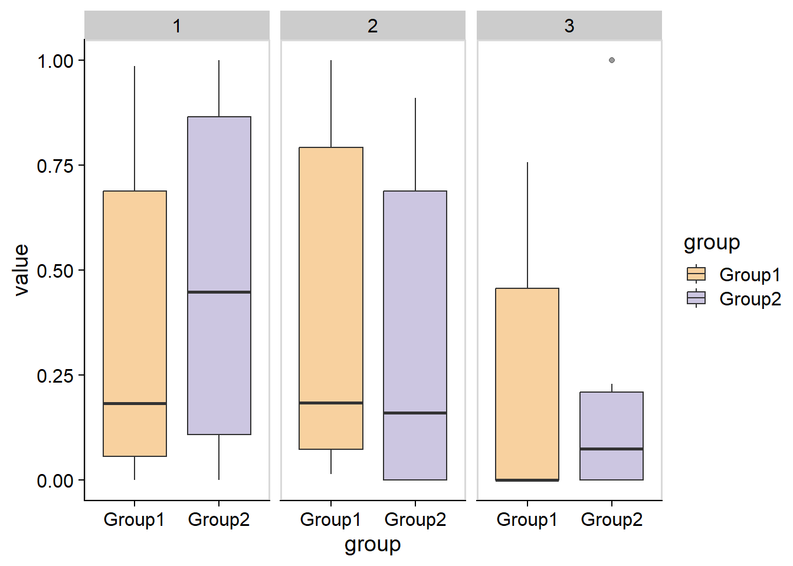
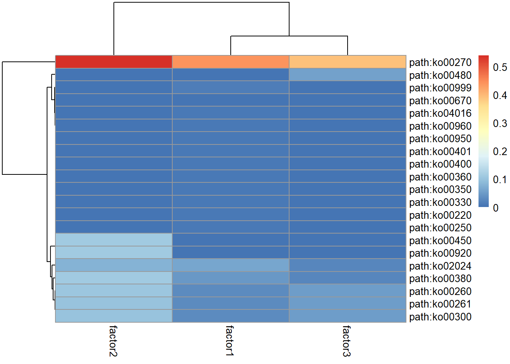
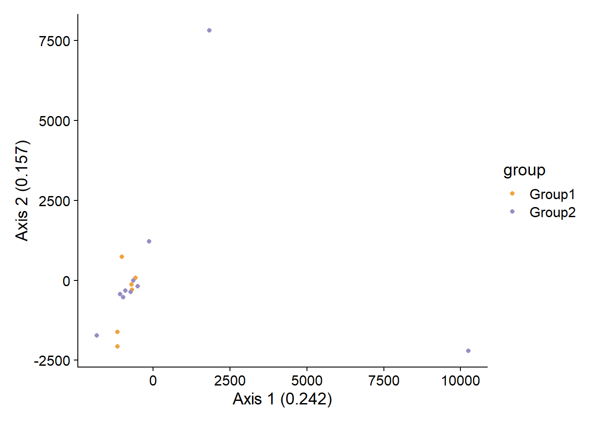

# Statistial analysis

`stana` provides functions to perform statistical analysis on the metagenotyping results based on loaded data.


``` r
library(stana)
library(phangorn)
library(ggtree)
library(ggstar)
## Examine sample object
load(system.file("extdata", "sysdata.rda", package = "stana"))
```

## Consensus sequence calling {#cons}

The consensus sequence calling can be performed using SNV MAF matrix (or the matrix converted from the allelic counts). It can filter the confident and user-defined positions and output the multiple sequence alignment in `fastaList` slot. The `MIDAS` and `MIDAS2` output provides various statistics of SNVs that can be used for the filtering. The implementation is similar to that in `MIDAS`. Here we use pair-wise distances of sequences calculated by `dist.ml` in the default amino acid model (`JC69`), and performs neighbor-joining tree estimation by `NJ`.


``` r

## The consensusSeq* is prepared, but consensusSeq function can automatically 
## choose which functions to use
stana <- consensusSeqMIDAS2(stana, species="100003", verbose=FALSE)
#> # Beginning calling for 100003
#> # Original Site number: 5019
#> #  Profiled samples: 11
#> #  Included samples: 11

## Tree estimation and visualization by `phangorn` and `ggtree`
dm <- dist.ml(getSlot(stana, "fastaList")[["100003"]])
tre <- NJ(dm)
tre <- groupOTU(tre, getSlot(stana, "cl"))
tp <- ggtree(tre, aes(color=.data$group),
             layout='circular') +
        geom_tippoint(size=3) +
        ggtree::scale_color_manual(values=getSlot(stana, "colors"))
tp
```


The sequences are stored as `phyDat` class object in `fastaList` slot, the list with the species ID as name.


``` r
stana <- stana |>
    consensusSeq(argList=list(site_prev=0.8))
#> # Beginning calling for 100003
#> # Original Site number: 5019
#> #  Profiled samples: 11
#> #  Included samples: 11
getFasta(stana)[[1]]
#> 11 sequences with 4214 character and 2782 different site patterns.
#> The states are a c g t
```

Matrix of characters can be returned by `return_mat=TRUE`. This does not return stana object.


``` r
mat <- stana |>
    consensusSeq(argList=list(site_prev=0.8, return_mat=TRUE))
#> # Beginning calling for 100003
#> # Original Site number: 5019
#> #  Profiled samples: 11
#> #  Included samples: 11
mat |> dim()
#> [1]   11 4214
```

You can use the MSA stored in `fastaList` slot to infer the phylogenetic tree of your choices.
The `inferAndPlotTree` function can be used to internally infer and plot the tree based on grouping.
`dist_method` is set to `dist.ml` by default, and you can pass arguments to the function by `tree_args`.


``` r
library(phangorn)
stana <- inferAndPlotTree(stana, dist_method="dist.hamming", tree_args=list(exclude="all"))
getTree(stana)[[1]]
#> 
#> Phylogenetic tree with 11 tips and 10 internal nodes.
#> 
#> Tip labels:
#>   ERR1711593, ERR1711594, ERR1711596, ERR1711598, ERR1711603, ERR1711605, ...
#> 
#> Rooted; includes branch lengths.
```

Owning to the powerful functions in `ggtree` and `ggtreeExtra`, you can visualize the tree based on the metadata.
You should set `data.frame` containing covariates to stana object by `setMetadata` function. And specify the covariates to `meta` argument in `plotTree`.


``` r
## Make example metadata
samples <- getSlot(stana, "snps")[["100003"]] |> colnames()
metadata <- data.frame(
    row.names=samples,
    treatment=factor(sample(1:3, length(samples), replace=TRUE)),
    marker=runif(length(samples))
)

## Set metadata
stana <- setMetadata(stana, metadata)

## Call consensus sequence
## Infer and plot tree based on metadata
stana <- stana |>
  consensusSeq(argList=list(site_prev=0.95)) |>
  inferAndPlotTree(meta=c("treatment","marker"))
#> # Beginning calling for 100003
#> # Original Site number: 5019
#> #  Profiled samples: 11
#> #  Included samples: 11
getFasta(stana)[[1]]
#> 11 sequences with 896 character and 625 different site patterns.
#> The states are a c g t
getTree(stana)[[1]]
#> 
#> Phylogenetic tree with 11 tips and 10 internal nodes.
#> 
#> Tip labels:
#>   ERR1711593, ERR1711594, ERR1711596, ERR1711598, ERR1711603, ERR1711605, ...
#> 
#> Rooted; includes branch lengths.
getSlot(stana, "treePlotList")[[1]]
```


The `site_list` is supported for the usecase such as calling limited to the certain gene regions. The below example calls the MSA in specific gene ID and output plot by `ggmsa`.


``` r
## get snpsInfo slot and filter to variants in specific gene IDs
cand_ids <- stana::getSlot(stana, "snpsInfo")[["100003"]] %>%
    dplyr::filter(gene_id=="UHGG000008_01913") %>%
    row.names()

## Call sequence
stana <- consensusSeqMIDAS2(stana, "100003", site_list=cand_ids)
#> # Beginning calling for 100003
#> # Original Site number: 5019
#> #  Profiled samples: 11
#> #  Included samples: 11
#> # site_list specified: 22

## Plot
if (requireNamespace("ggmsa")) {
    library(ggmsa)
    phangorn::write.phyDat(getFasta(stana)[["100003"]],
                           "test.fasta", format="fasta")
    ggmsa::ggmsa("test.fasta",seq_name = TRUE)+ ggmsa::geom_seqlogo()
}
```


## Nonnegative matrix factorization {#nmf}

The loaded or calculated matrix can be used for the nonnegative matrix factorization (NMF) for the unsupervised identifications of factors within species. This calculates factor x sample and sample to feature matrix, and possibly finds the pattern for the within-species diversity. The results can be summarized by the functions such as `plotAbundanceWithinSpecies`.

The input can be SNV, gene, or gene family (KO) abundance table. The matrix can contain `NA` or `-1` (zero depth at the position), so filtering should be performed. The `NMF::nmf` function or `NNLM::nnmf` function can be used for this purpose. By default, `estimate` is set to FALSE but if set to `TRUE`, it performs the estimation of rank within `estimate_range`. This assumes that multiple subspecies are in the samples and is not applicable where only one subspecies should be present. It chooses the rank based on the cophenetic correlation coefficient when the function uses the R package `NMF`, but the package implements a variety of algorithms and the rank selection method. Also, if `NNLM`, the rank selection based on cross-validation by randomly assigning the NA in the cell in the matrix, is performed.

The function outputs the related statistics like the proportion of NA or zero value, the relative abundances of factors after the estimation, or the features presented in each factor.

The method is set to `snmf/r` by default in `NMF`. For the larger matrix, the `NNML` function can be used for the faster computation by setting `nnlm_flag` to TRUE.


``` r
library(NMF)
stana <- NMF(stana, "100003", estimate=TRUE)[[1]]
#> # NMF started 100003, target: kos, method: snmf/r
#> # Original features: 20
#> # Original samples: 16
#> # Original matrix NA: NA
#> # Original matrix zero: 0.781
#> # Selecting KL loss
#> # Filtered features: 20
#> # Filtered samples: 16
#> # Chosen rank:3
#> # Rank 3
#> Mean relative abundances: 0.4506259 0.3696346 0.1797395 
#> Present feature per factor: 18 14 13
getSlot(stana, "nmf")
#> NULL
```
The users can specify the rank. The `NMF` slot stores the list of `NMF` results (or `NNLM` results) per species.


``` r
stana <- NMF(stana, "100003", rank=3, beta=0.001)
#> # NMF started 100003, target: kos, method: snmf/r
#> # Original features: 20
#> # Original samples: 16
#> # Original matrix NA: NA
#> # Original matrix zero: 0.781
#> # Selecting KL loss
#> # Filtered features: 20
#> # Filtered samples: 16
#> # Rank 3
#> Mean relative abundances: 0.4391153 0.3652978 0.1955869 
#> Present feature per factor: 15 11 12
getSlot(stana, "NMF")
#> $`100003`
#> <Object of class: NMFfit>
#>  # Model:
#>   <Object of class:NMFstd>
#>   features: 20 
#>   basis/rank: 3 
#>   samples: 16 
#>  # Details:
#>   algorithm:  snmf/r 
#>   seed:  random 
#>   RNG: 10403L, 624L, ..., -1119848976L [a0b56536ecb759f07f21b4b252fb5db8]
#>   distance metric:  <function> 
#>   residuals:  5.628987 
#>   parameters: beta=0.001 
#>   Iterations: 65 
#>   Timing:
#>      user  system elapsed 
#>      0.03    0.00    0.05
```

The resulting stana object can be used with the other function. `plotAbundanceWithinSpecies` plots the (relative) abundances per sample using the grouping criteria in stana object.


``` r
plotAbundanceWithinSpecies(stana, "100003", tss=TRUE)
```



The data can be obtained using `return_data`.


``` r
plotAbundanceWithinSpecies(stana, "100003", tss=TRUE, return_data=TRUE) %>% head()
#>                     1          2         3  group
#> ERR1711593 0.98582990 0.01417010 0.0000000 Group1
#> ERR1711594 0.85247014 0.14752986 0.0000000 Group1
#> ERR1711596 0.19498362 0.04848823 0.7565282 Group1
#> ERR1711598 0.17024848 0.22117519 0.6085763 Group1
#> ERR1711599 0.00000000 1.00000000 0.0000000 Group1
#> ERR1711602 0.01749079 0.98250921 0.0000000 Group1
```

The basis corresponds to the factor to feature matrix. This represents functional implications if the KO or gene copy number tables are used for the NMF. This information can be parsed to matrix of KEGG PATHWAY information using `pathwayWithFactor`.


``` r
library(pheatmap)
pheatmap(pathwayWithFactor(stana, "100003", tss=TRUE))
```



These information can be further combined with the other functions in `stana`, like plotting factor abundances along with the tree inferred from consensus sequence alignment, linking allele frequency information and gene copy number data.


``` r
ab <- plotAbundanceWithinSpecies(stana, "100003", tss=TRUE, return_data=TRUE)
stana <- setMetadata(stana, ab)
stana <- inferAndPlotTree(stana, "100003", meta=colnames(ab))
getTreePlot(stana)
#> $`100003`
```


## PERMANOVA

Using `adonis2` function in `vegan`, one can compare distance matrix based on SNV frequency or gene (gene family) copy numbers, or tree-based distance between the specified group. When the `target="tree"` is specified, tree shuold be in `treeList`, with the species name as the key. The `ape::cophenetic.phylo()` is used to calculate distance between tips based on branch length. Distance method can be chosen from `dist` function in `stats`, and the default is set to `manhattan`. You can specify `distArg` to pass the arguments to `dist`. Also, the distance calculated directly from sequences can be used. In this case, `target='fasta'` should be chosen, and the function to calculate distance should be provided to `AAfunc` argument.


``` r
stana <- setTree(stana, "100003", tre)
stana <- doAdonis(stana, specs = "100003", target="tree")
#> # Performing adonis in 100003 target is tree
#> #  F: 0.719649945825046, R2: 0.0740407267582885, Pr: 0.708
getAdonis(stana)[["100003"]]
#> Permutation test for adonis under reduced model
#> Terms added sequentially (first to last)
#> Permutation: free
#> Number of permutations: 999
#> 
#> adonis2(formula = d ~ ., data = structure(list(group = c("Group1", "Group1", "Group1", "Group1", "Group2", "Group2", "Group2", "Group2", "Group2", "Group2", "Group2")), row.names = c("ERR1711593", "ERR1711594", "ERR1711596", "ERR1711598", "ERR1711603", "ERR1711605", "ERR1711606", "ERR1711609", "ERR1711611", "ERR1711612", "ERR1711618"), class = "data.frame"))
#>          Df SumOfSqs      R2      F Pr(>F)
#> group     1  0.15557 0.07404 0.7196  0.708
#> Residual  9  1.94558 0.92596              
#> Total    10  2.10115 1.00000
```
The corresponding principal coordinate analysis plot using distance matrix can be drawn by specifying `pcoa`. The relative eigenvalues are plotted.


``` r
stana <- doAdonis(stana, specs = "100003",
	target="genes", pcoa=TRUE)
#> # Performing adonis in 100003 target is genes
#> #  F: 0.950009752773493, R2: 0.0635457614064265, Pr: 0.545
```



By default, the function uses grouping variable in `cl` slot. For more complex modeling, the slot `meta` can be populated by the data frame of samples by `setMetadata` like the example below. To use metadata, `useMeta` option should be specified with the formula argument.


``` r
stana <- doAdonis(stana, specs = "100003",
    target="genes", useMeta=TRUE, formula = "d ~ .")
#> # Performing adonis in 100003 target is genes
#> # Printing raw adonis results ...
#> No residual component
#> 
#> adonis2(formula = d ~ ., data = structure(list(`1` = c(0.985829902295573, 0.852470142666385, 0.194983622925863, 0.1702484777323, 0, 0.01749079304296, 0.169551265957738, 1, 0.774981822424855, 0, 0, 1, 0.145056521442649, 0.894711680596164, 0.725364565076885, 0.0951555820116268), `2` = c(0.0141700977044264, 0.147529857333615, 0.0484882264088995, 0.221175192027691, 1, 0.98250920695704, 0.830448734042262, 0, 0, 0.911065650363313, 0, 0, 0.693043447598221, 0.0456195965920271, 0.274635434923115, 0.67607988474988
#>          Df  SumOfSqs R2 F Pr(>F)
#> Model    15 501125509  1         
#> Residual  0         0  0         
#> Total    15 501125509  1
getAdonis(stana)[["100003"]]
#> No residual component
#> 
#> adonis2(formula = d ~ ., data = structure(list(`1` = c(0.985829902295573, 0.852470142666385, 0.194983622925863, 0.1702484777323, 0, 0.01749079304296, 0.169551265957738, 1, 0.774981822424855, 0, 0, 1, 0.145056521442649, 0.894711680596164, 0.725364565076885, 0.0951555820116268), `2` = c(0.0141700977044264, 0.147529857333615, 0.0484882264088995, 0.221175192027691, 1, 0.98250920695704, 0.830448734042262, 0, 0, 0.911065650363313, 0, 0, 0.693043447598221, 0.0456195965920271, 0.274635434923115, 0.67607988474988
#>          Df  SumOfSqs R2 F Pr(>F)
#> Model    15 501125509  1         
#> Residual  0         0  0         
#> Total    15 501125509  1
```


## Comparing gene copy numbers

If you have `genes` slot filled in the stana object, gene copy numbers can be compared one by one using exact Wilcoxon rank-sum test using `wilcox.exact` in `exactRankTests` computing exact conditional p-values. Note that p-values are not adjusted for multiple comparisons made.


``` r
res <- compareGenes(stana, "100003")
#> # Testing total of 21806
res[["UHGG000008_01733"]]
#> 
#> 	Exact Wilcoxon rank sum test
#> 
#> data:  c(1.154444, 2.404241, 0, 1.421386, 1.50773, 0) and c(0.535732, 1.709442, 1.31675, 3.44086, 2.712423, 1.923076, 1.062853, c(1.154444, 2.404241, 0, 1.421386, 1.50773, 0) and 1.21147, 0, 1.509217)
#> W = 22, p-value = 0.4256
#> alternative hypothesis: true mu is not equal to 0
```

## Aggregating gene copy numbers

The gene abundances across multiple stana object can be aggregated. This returns the new stana object where the gene abundances are combined.


``` r
## This returns new stana object
stanacomb <- combineGenes(list(stana, stana), species="100003")
#> Common genes: 21806
#> Duplicate label found in group
dim(getSlot(stanacomb, "genes")[["100003"]])
#> [1] 21806    32
```

## Performing Boruta or feature selection

`Boruta` algorithm can be run on matrices to obtain important marker (SNV position or gene) for distinguishing between group by `doBoruta` function. The function performs `Boruta` algorithm on specified data and returns the `Boruta` class result. By default, the function performs fixes to tentative input. To disable this, specify `doFix=FALSE`.


``` r
library(Boruta)
brres <- doBoruta(stana, "100003")
#> # Using grouping from the slot: Group1/Group2
#> # If needed, please provide preprocessed matrix to `mat`
#> # Feature number: 21806
#> # Performing Boruta
brres
#> $boruta
#> Boruta performed 99 iterations in 28.57647 secs.
#> Tentatives roughfixed over the last 99 iterations.
#>  13 attributes confirmed important: UHGG000008_01647,
#> UHGG025024_01181, UHGG025024_01950, UHGG052054_01631,
#> UHGG101119_00553 and 8 more;
#>  21793 attributes confirmed unimportant:
#> UHGG000008_00008, UHGG000008_00009, UHGG000008_00010,
#> UHGG000008_00012, UHGG000008_00015 and 21788 more;
```

Further, we visualize the copy numbers of important genes confirmed between the group.


``` r
confirmed_genes <- brres$boruta$finalDecision[brres$boruta$finalDecision=="Confirmed"] %>% names()
plotGenes(stana, "100003", confirmed_genes)+
  ggplot2::facet_wrap(.~geneID,scales="free_y")+
  cowplot::theme_cowplot() +
  cowplot::panel_border()
#> [1] "#F1A340" "#998EC3"
```


