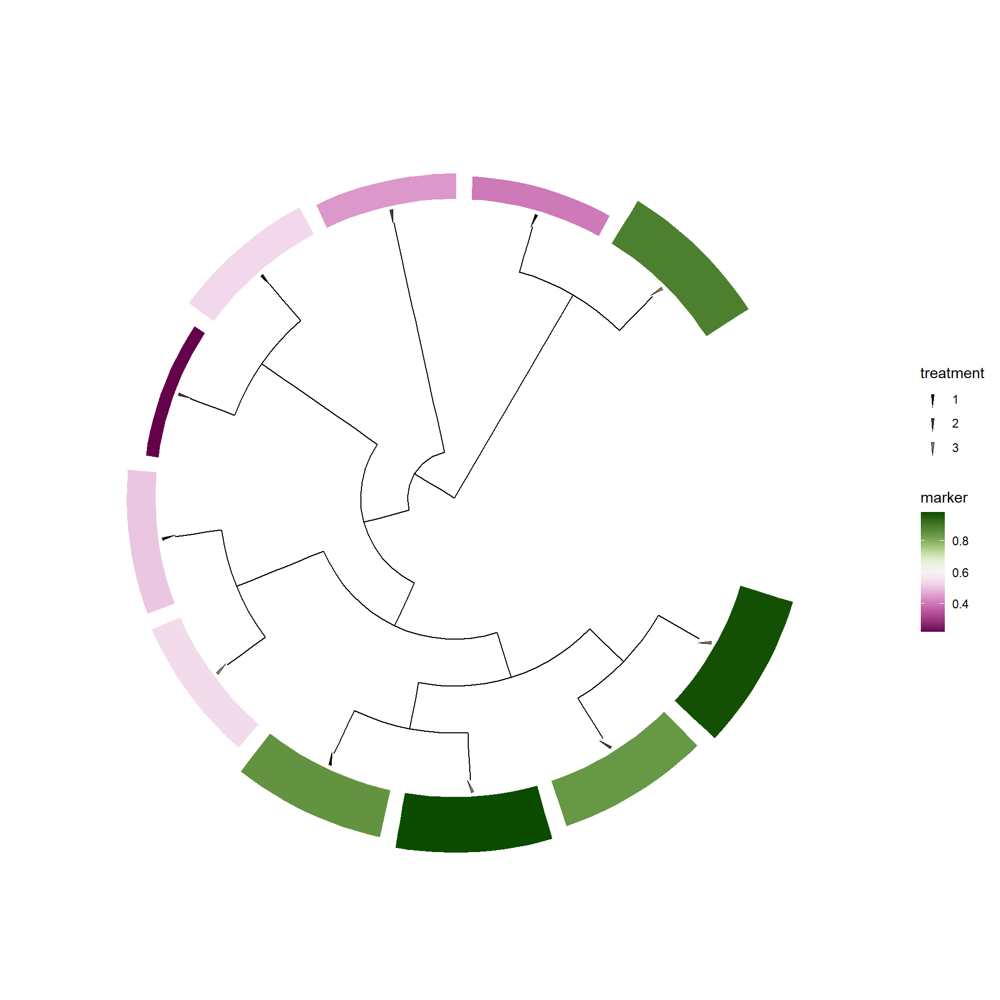
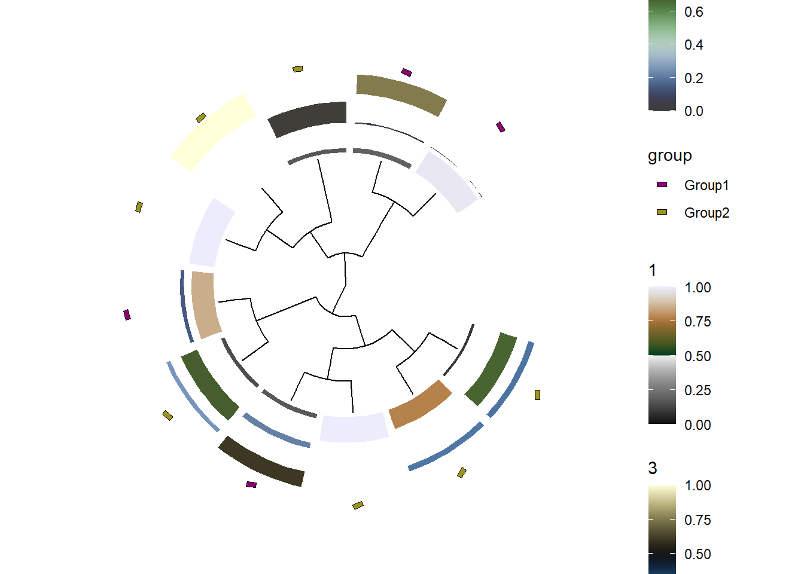

# Statistial analysis

`stana` provides functions to perform statistical analysis on the metagenotyping results based on loaded data.


```r
library(stana)
library(phangorn)
library(ggtree)
## Examine sample object
load(system.file("extdata", "sysdata.rda", package = "stana"))
```

## Consensus sequence calling {#cons}

The consensus sequence calling can be performed using SNV matrix. For `MIDAS` and `MIDAS2` output, it can filter the confident positions as the software provides various statistics of SNVs. The implementation is based on `call_consensus.py` script available in `MIDAS`. Here we use pair-wise distances of sequences calculated by `dist.ml` in the default amino acid model (`JC69`), and performs neighbor-joining tree estimation by `NJ`.


```r

## The consensusSeq* is prepared, but consensusSeq function can automatically 
## choose which functions to use
stana <- consensusSeqMIDAS2(stana, species="100003", verbose=FALSE)
#> Beginning calling for 100003
#>   Site number: 5019
#>   Profiled samples: 11
#>   Included samples: 11

## Tree estimation and visualization by `phangorn` and `ggtree`
dm <- dist.ml(getSlot(stana, "fastaList")[["100003"]])
tre <- NJ(dm)
tre <- groupOTU(tre, getSlot(stana, "cl"))
tp <- ggtree(tre, aes(color=.data$group),
             layout='circular') +
        geom_tippoint(size=3) +
        ggtree::scale_color_manual(values=getSlot(stana, "colors"))
tp
```


The sequences are stored as `phyDat` class object in `fastaList` slot, the list with the species ID as name.


```r
stana <- stana |>
    consensusSeq(argList=list(site_prev=0.8))
#> Beginning calling for 100003
#>   Site number: 5019
#>   Profiled samples: 11
#>   Included samples: 11
getFasta(stana)[[1]]
#> 11 sequences with 4214 character and 2782 different site patterns.
#> The states are a c g t
```

Matrix of characters can be returned by `return_mat=TRUE`. This does not return stana object.


```r
mat <- stana |>
    consensusSeq(argList=list(site_prev=0.8, return_mat=TRUE))
#> Beginning calling for 100003
#>   Site number: 5019
#>   Profiled samples: 11
#>   Included samples: 11
mat |> dim()
#> [1]   11 4214
```

You can use the MSA stored in `fastaList` slot to infer the phylogenetic tree of your choices.
The `plotTree` function can be used to internally infer and plot the tree based on grouping.
`dist_method` is set to `dist.ml` by default, and you can pass arguments to the function by `tree_args`.


```r
library(phangorn)
stana <- inferAndPlotTree(stana, dist_method="dist.hamming", tree_args=list(exclude="all"))
getTree(stana)[[1]]
#> 
#> Phylogenetic tree with 11 tips and 10 internal nodes.
#> 
#> Tip labels:
#>   ERR1711593, ERR1711594, ERR1711596, ERR1711598, ERR1711603, ERR1711605, ...
#> 
#> Rooted; includes branch lengths.
```

Owning to the powerful functions in `ggtree` and `ggtreeExtra`, you can visualize the tree based on the metadata.
You should set `data.frame` containing covariates to stana object by `setMetadata` function. And specify the covariates to `meta` argument in `plotTree`.


```r
## Make example metadata
samples <- getSlot(stana, "snps")[["100003"]] |> colnames()
metadata <- data.frame(
    row.names=samples,
    treatment=factor(sample(1:3, length(samples), replace=TRUE)),
    marker=runif(length(samples))
)

## Set metadata
stana <- setMetadata(stana, metadata)

## Call consensus sequence
## Infer and plot tree based on metadata
stana <- stana |>
  consensusSeq(argList=list(site_prev=0.95)) |>
  inferAndPlotTree(meta=c("treatment","marker"))
#> Beginning calling for 100003
#>   Site number: 5019
#>   Profiled samples: 11
#>   Included samples: 11
getFasta(stana)[[1]]
#> 11 sequences with 896 character and 625 different site patterns.
#> The states are a c g t
getTree(stana)[[1]]
#> 
#> Phylogenetic tree with 11 tips and 10 internal nodes.
#> 
#> Tip labels:
#>   ERR1711593, ERR1711594, ERR1711596, ERR1711598, ERR1711603, ERR1711605, ...
#> 
#> Rooted; includes branch lengths.
getSlot(stana, "treePlotList")[[1]]
```



## Nonnegative matrix factorization

The loaded or calculated matrix can be used for the nonnegative matrix factorization (NMF). This calculates factor x sample and sample to feature matrix, and possibly finds the pattern for the within-species diversity. The results can be summarized by the functions such as `plotAbundanceWithinSpecies`. The function uses the R package `NMF`, which implements a variety of algorithms and the rank selection method.

The input can be SNV, gene, or gene family (KO) abundance table. SNV matrix can contain NA or `-1` (zero depth at the position), so filtering should be performed. The `NMF` function can be used for this purpose. By default, `estimate` is set to FALSE but if set to `TRUE`, it performs the estimation of rank within `estimate_range`. This assumes that multiple subspecies are in the samples and is not applicable where only one subspecies should be present. It chooses the rank based on the cophenetic correlation coefficient.

The method is set to `snmf/r` by default.


```r
library(NMF)
#> Warning: package 'NMF' was built under R version 4.3.3
#> Loading required package: registry
#> Loading required package: rngtools
#> Loading required package: cluster
#> NMF - BioConductor layer [OK] | Shared memory capabilities [NO: windows] | Cores 2/2
#> 
#> Attaching package: 'NMF'
#> The following object is masked from 'package:ape':
#> 
#>     consensus
#> The following objects are masked from 'package:igraph':
#> 
#>     algorithm, compare
stana <- NMF(stana, "100003", target="genes", estimate=TRUE)
#> Original features: 21806 
#> Original samples: 16 
#> Filtered features: 21806 
#> Filtered samples: 16 
#> Chosen rank: 3 
#> Rank 3 
#> Mean relative abundances: 0.7205298 0.1216617 0.1578085 
#> Present feature per strain: 20546 11671 14235
getSlot(stana, "nmf")
#> NULL
```

The users can specify the rank.


```r
stana <- NMF(stana, "100003", rank=3)
#> Original features: 20 
#> Original samples: 16 
#> Filtered features: 20 
#> Filtered samples: 16 
#> Rank 3 
#> Mean relative abundances: 0.0625 0.7745108 0.1629892 
#> Present feature per strain: 7 18 9
getSlot(stana, "nmf")
#> NULL
```

The resulting stana object can be used with the other function. `plotAbundanceWithinSpecies` plots the (relative) abundances per sample using the grouping criteria in stana object.


```r
plotAbundanceWithinSpecies(stana, "100003", tss=TRUE)
```


The data can be obtained using `return_data`.


```r
plotAbundanceWithinSpecies(stana, "100003", tss=TRUE, return_data=TRUE) %>% head()
#>            1         2         3  group
#> ERR1711593 0 0.7235181 0.2764819 Group1
#> ERR1711594 0 1.0000000 0.0000000 Group1
#> ERR1711596 0 1.0000000 0.0000000 Group1
#> ERR1711598 0 1.0000000 0.0000000 Group1
#> ERR1711599 0 0.0000000 1.0000000 Group1
#> ERR1711602 0 0.5397880 0.4602120 Group1
```

The basis corresponds to the factor to feature matrix. This represents functional implications if the KO abundance tables are used for the NMF. This information can be parsed to matrix of KEGG PATHWAY information using `pathwayWithFactor`.


```r
library(pheatmap)
pheatmap(pathwayWithFactor(stana, "100003", tss=TRUE))
```


These information can be further combined with the other functions in `stana`, like plotting factor abundances along with the tree inferred from consensus sequence alignment.


```r
ab <- plotAbundanceWithinSpecies(stana, "100003", tss=TRUE, return_data=TRUE)
stana <- setMetadata(stana, ab)
stana <- inferAndPlotTree(stana, "100003", meta=colnames(ab))
getTreePlot(stana)
#> $`100003`
```




## PERMANOVA

Using `adonis2` function in `vegan`, one can compare distance matrix based on SNV frequency or gene copy numbers, or tree-based distance between the specified group. When the `target="tree"` is specified, tree shuold be in `treeList`, with the species name as the key. The `ape::cophenetic.phylo()` is used to calculate distance between tips based on branch length. Distance method can be chosen from `dist` function in `stats`. You can specify `distArg` to pass the arguments to `dist`. Also, the distance calculated directly from sequences can be used. In this case, `target='fasta'` should be chosen, and the function to calculate distance should be provided to `AAfunc` argument.


```r
stana <- setTree(stana, "100003", tre)
stana <- doAdonis(stana, specs = "100003", target="tree")
#> Performing adonis in 100003
#> Warning in att$heading[2] <- deparse(match.call(),
#> width.cutoff = 500L): number of items to replace is not a
#> multiple of replacement length
#>   F: 0.719649945825046, R2: 0.0740407267582885, Pr: 0.723
getAdonis(stana)[["100003"]]
#> Permutation test for adonis under reduced model
#> Terms added sequentially (first to last)
#> Permutation: free
#> Number of permutations: 999
#> 
#> adonis2(formula = d ~ gr, na.action = function (object, ...) 
#>          Df SumOfSqs      R2      F Pr(>F)
#> gr        1  0.15557 0.07404 0.7196  0.723
#> Residual  9  1.94558 0.92596              
#> Total    10  2.10115 1.00000
```

## Comparing gene copy numbers

If you have `genes` slot filled in the stana object, gene copy numbers can be compared one by one using exact Wilcoxon rank-sum test using `wilcox.exact` in `exactRankTests` computing exact conditional p-values. Note that p-values are not adjusted for multiple comparisons made.


```r
res <- compareGenes(stana, "100003")
#> Testing total of 21806
res[["UHGG000008_01733"]]
#> 
#> 	Exact Wilcoxon rank sum test
#> 
#> data:  c(1.154444, 2.404241, 0, 1.421386, 1.50773, 0) and c(0.535732, 1.709442, 1.31675, 3.44086, 2.712423, 1.923076, 1.062853, c(1.154444, 2.404241, 0, 1.421386, 1.50773, 0) and 1.21147, 0, 1.509217)
#> W = 22, p-value = 0.4256
#> alternative hypothesis: true mu is not equal to 0
```

## Aggregating gene copy numbers

The gene abundances across multiple stana object can be aggregated. This returns the new stana object where the gene abundances are combined.


```r
## This returns new stana object
stanacomb <- combineGenes(list(stana, stana), species="100003")
#> Common genes: 21806
#> Duplicate label found in group
dim(getSlot(stanacomb, "genes")[["100003"]])
#> [1] 21806    32
```

## Performing Boruta or feature selection

`Boruta` algorithm can be run on matrices to obtain important marker (SNV position or gene) for distinguishing between group by `doBoruta` function. The function performs `Boruta` algorithm on specified data and returns the `Boruta` class result. By default, the function performs fixes to tentative input. To disable this, specify `doFix=FALSE`.


```r
library(Boruta)
brres <- doBoruta(stana, "100003")
#> Using grouping from the slot
#> If needed, please provide preprocessed matrix of genes to `mat`
#> Feature number: 21806
#> Performing Boruta
brres
#> $boruta
#> Boruta performed 99 iterations in 42.10037 secs.
#> Tentatives roughfixed over the last 99 iterations.
#>  15 attributes confirmed important: UHGG006336_00186,
#> UHGG025024_01181, UHGG044133_01185, UHGG061776_01340,
#> UHGG096197_00528 and 10 more;
#>  21791 attributes confirmed unimportant:
#> UHGG000008_00008, UHGG000008_00009, UHGG000008_00010,
#> UHGG000008_00012, UHGG000008_00015 and 21786 more;
```

Further, we visualize the copy numbers of important genes confirmed between the group.


```r
plotGenes(stana, "100003",
          brres$boruta$finalDecision[brres$boruta$finalDecision=="Confirmed"] |> names())+
  ggplot2::facet_wrap(.~geneID,scales="free_y")
```


