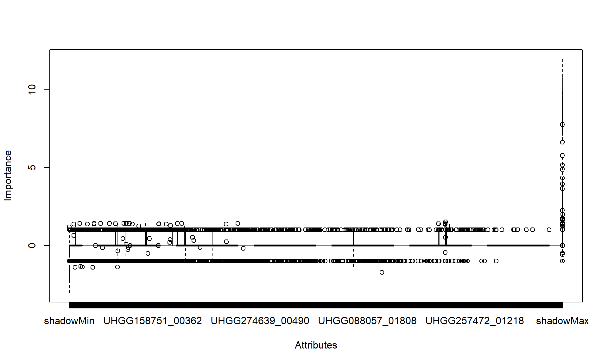
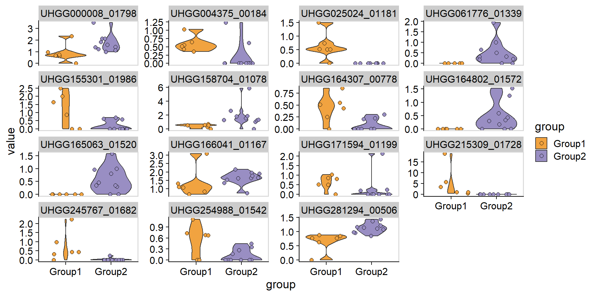

# Statistial analysis

`stana` provides some functions to perform statistical analysis based on loaded data.


```r
library(stana)
library(phangorn)
library(ggtree)
## Examine sample object
load(system.file("extdata", "sysdata.rda", package = "stana"))
```

## Consensus sequence calling

The consensus sequence calling can be performed for `MIDAS` and `MIDAS2` output. The implementation is based on `call_consensus.py` script available in `MIDAS`. Here we use pair-wise distances of sequences calculated by `dist.ml` in the default amino acid model (`JC69`), and performs neighbor-joining tree estimation by `NJ`.


```r
stana <- consensusSeqMIDAS2(stana, species="100003", verbose=FALSE)
#> Beginning calling for 100003
#>   Site number: 5019
#>   Outputting consensus sequence to 100003_consensus.fasta

## Tree estimation and visualization by `phangorn` and `ggtree`
dm <- dist.ml(stana@fastaList$`100003`)
tre <- NJ(dm)
tre <- groupOTU(tre, stana@cl)
tp <- ggtree(tre, aes(color=.data$group),
             layout='circular') +
        geom_tippoint(size=3) +
        ggtree::scale_color_manual(values=stana@colors)
tp
```


## PERMANOVA

Using `adonis2` function in `vegan`, one can compare distance matrix based on SNV frequency or gene abundances, or tree-based distance between the specified group. When the `target=tree` is specified, tree shuold be in `stana@treeList`, with the species name as the key. The `ape::cophenetic.phylo()` is used to calculate distance between tips based on branch length. Distance method can be chosen from `dist` function in `stats`. You can specify `distArg` to pass the arguments to `dist`. Also, the distance calculated directly from sequences can be used. In this case, `target='fasta'` should be chosen, and the function to calculate distance should be provided to `AAfunc` argument.


```r
stana@treeList[["100003"]] <- tre
stana <- doAdonis(stana, specs = "100003", target="tree")
#> Performing adonis in 100003
#>   R2: 0.0740407266729293, Pr: 0.695
stana@adonisList[["100003"]]
#> Permutation test for adonis under reduced model
#> Terms added sequentially (first to last)
#> Permutation: free
#> Number of permutations: 999
#> 
#> adonis2(formula = d ~ gr)
#>          Df SumOfSqs      R2      F Pr(>F)
#> gr        1  0.15557 0.07404 0.7196  0.695
#> Residual  9  1.94558 0.92596              
#> Total    10  2.10115 1.00000
```

## Comparing gene abundances

For `MIDAS` and `MIDAS2` output (or if you have `genes` slot filled in the stana object), gene abundances can be compared one by one using exact Wilcoxon rank-sum test using `wilcox.exact` in `exactRankTests` computing exact conditional p-values. Note that p-values are not adjusted for multiple comparisons made.


```r
res <- compareGenes(stana, "100003")
#> Testing total of 21806
res[["UHGG000008_01733"]]
#> 
#> 	Exact Wilcoxon rank sum test
#> 
#> data:  c(1.154444, 2.404241, 0, 1.421386, 1.50773, 0) and c(0.535732, 1.709442, 1.31675, 3.44086, 2.712423, 1.923076, 1.062853, c(1.154444, 2.404241, 0, 1.421386, 1.50773, 0) and 1.21147, 0, 1.509217)
#> W = 22, p-value = 0.4256
#> alternative hypothesis: true mu is not equal to 0
```


## Performing Boruta

`Boruta` algorithm can be run on matrices to obtain important marker (SNV or gene) for distinguishing between group by `doBoruta` function. The function performs `Boruta` algorithm on specified data and returns the `Boruta` class result. By default, the function performs fixes to tentative input. To disable this, specify `doFix=FALSE`.


```r
library(Boruta)
brres <- doBoruta(stana, "100003")
#> Using grouping from the slot
#> If needed, please provide preprocessed matrix of genes to `mat`
#> Feature number: 21806
#> Performing Boruta
brres
#> $boruta
#> Boruta performed 99 iterations in 39.57059 secs.
#> Tentatives roughfixed over the last 99 iterations.
#>  11 attributes confirmed important: UHGG000008_01290,
#> UHGG000008_01798, UHGG004616_01682, UHGG006042_01659,
#> UHGG060667_01243 and 6 more;
#>  21795 attributes confirmed unimportant:
#> UHGG000008_00008, UHGG000008_00009, UHGG000008_00010,
#> UHGG000008_00012, UHGG000008_00015 and 21790 more;
```


```r
plot(brres$boruta)
```



Further, we visualize the abundances of important genes confirmed.


```r
plotGenes(stana, "100003",
          brres$boruta$finalDecision[brres$boruta$finalDecision=="Confirmed"] |> names())+
  ggplot2::facet_wrap(.~geneID,scales="free_y")
```


