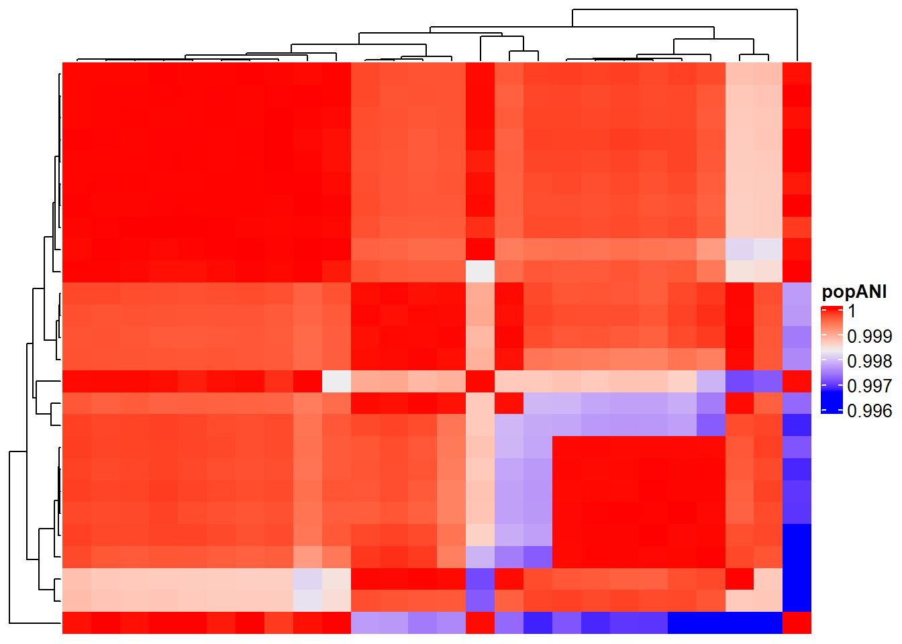
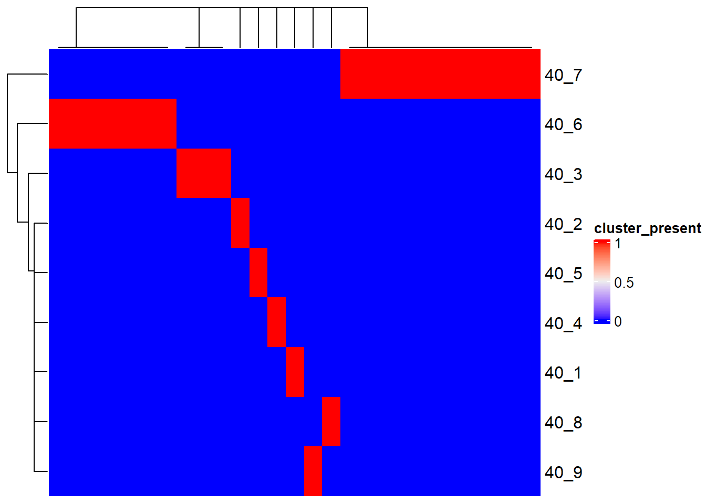

# Visualization

`stana` offers visualization functions that can interpret the profiled data.


```r
library(stana)
library(ComplexHeatmap)
#> Loading required package: grid
#> ========================================
#> ComplexHeatmap version 2.14.0
#> Bioconductor page: http://bioconductor.org/packages/ComplexHeatmap/
#> Github page: https://github.com/jokergoo/ComplexHeatmap
#> Documentation: http://jokergoo.github.io/ComplexHeatmap-reference
#> 
#> If you use it in published research, please cite either one:
#> - Gu, Z. Complex Heatmap Visualization. iMeta 2022.
#> - Gu, Z. Complex heatmaps reveal patterns and correlations in multidimensional 
#>     genomic data. Bioinformatics 2016.
#> 
#> 
#> The new InteractiveComplexHeatmap package can directly export static 
#> complex heatmaps into an interactive Shiny app with zero effort. Have a try!
#> 
#> This message can be suppressed by:
#>   suppressPackageStartupMessages(library(ComplexHeatmap))
#> ========================================
```


## Visualization of gene abundances

## Visualization of functional analysis results

## Visualization of `inStrain` results

The imported `inStrain` `compare` profiles can be visualized. The loaded genome-wide comparison table and strain cluster table can be visualized using `genomeHeatmap` and `strainClusterHeatmap` by `ComplexHeatmap`. For `genomeHeatmap`, typically population ANI or consensus ANI are plotted, but all the columns listed in `genomeWide_compare.tsv` can be plotted. The parameters to be passed to `Heatmap` can be specified with `heatmapArgs`. If cluster information (`stana@cl`) is available or `cl` is specified, the columns will be split to present the grouping.


```r
instr_chk <- "GUT_GENOME142015"
instr <- loadInStrain("../inStrain_out", instr_chk)
genomeHeatmap(instr, instr_chk, column = "popANI", heatmapArgs = list(show_column_name=FALSE))
```



```r
strainClusterHeatmap(instr, instr_chk, heatmapArgs = list(show_column_name=FALSE))
```


