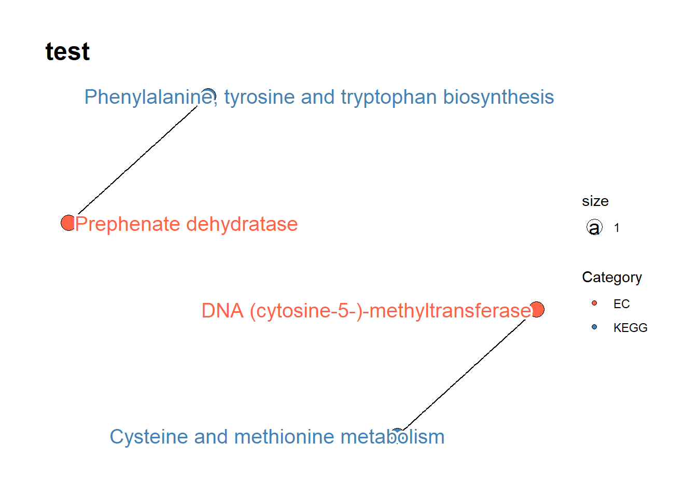
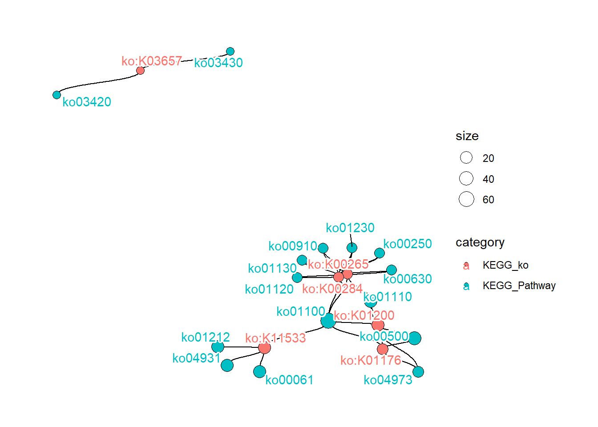
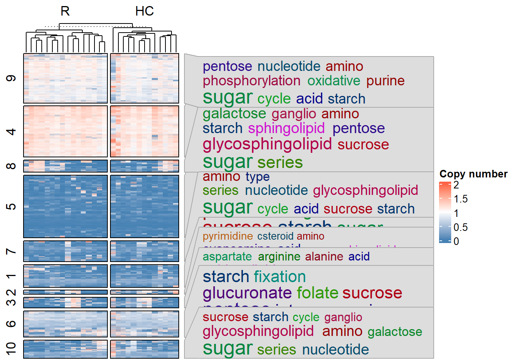
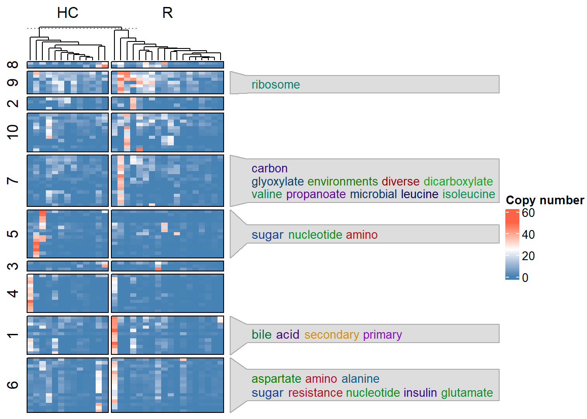
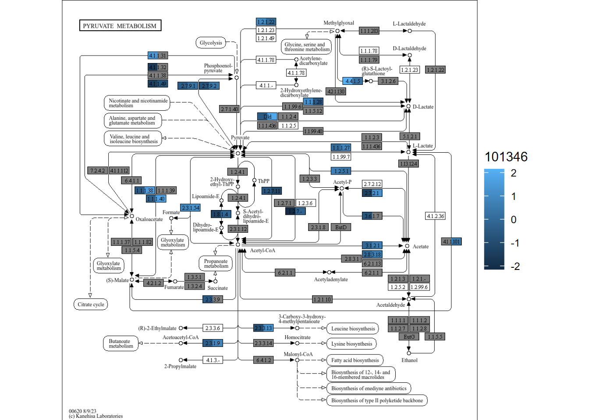
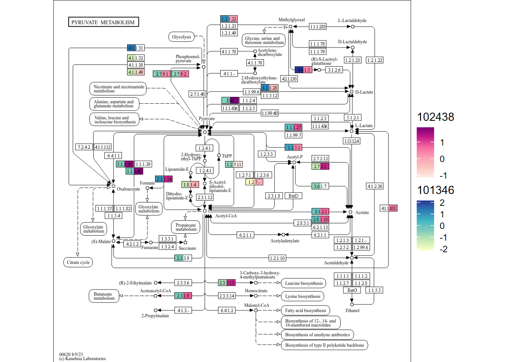
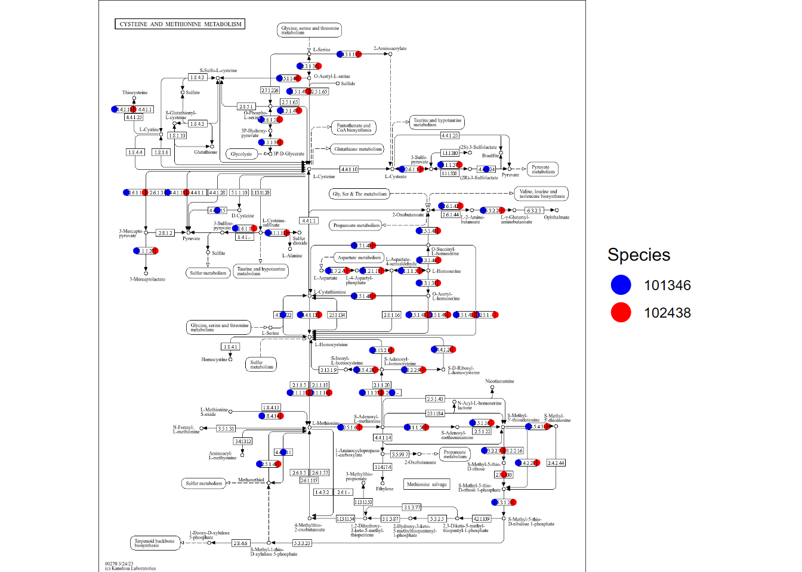

# Functional annotation {#function}

For metabolic functional profiling, several functions are prepared in `stana`. Note that these functions are primarily designed for KEGG ORTHOLOGY which can be subsequently linked to KEGG PATHWAY and the other databases in KEGG. However, the other options such as the enzyme commision numbers can be accepted.


``` r
library(stana)
library(ComplexHeatmap)
```

## Parsing `PATRIC` results

If the gene IDs in the gene matrix stored in the stana object is PATRIC ID, we can use `checkPATRIC` function to obtain information related to `PATRIC` functional annotation. The function accepts the input of named list of genes, and returns functional annotation results. The function uses `BiocFileCache()` to cache the obtained results from API.


``` r
genes <- list("test"=read.table("../test_genes.txt")$V1)
genes |> head()
#> $test
#>  [1] "1280701.3.peg.1153" "1280701.3.peg.1169"
#>  [3] "1280701.3.peg.1174" "1280701.3.peg.1179"
#>  [5] "1280701.3.peg.1186" "1280701.3.peg.203" 
#>  [7] "1280701.3.peg.361"  "1280701.3.peg.363" 
#>  [9] "1280701.3.peg.368"  "1280701.3.peg.369" 
#> [11] "1280701.3.peg.570"  "1280701.3.peg.758" 
#> [13] "1280701.3.peg.762"  "1410605.3.peg.1201"
#> [15] "1410605.3.peg.1204" "1410605.3.peg.1463"
#> [17] "1410605.3.peg.1510" "1410605.3.peg.1568"
#> [19] "1410605.3.peg.450"  "1410605.3.peg.593" 
#> [21] "1410605.3.peg.655"  "1410605.3.peg.833" 
#> [23] "1410605.3.peg.844"  "1410605.3.peg.903" 
#> [25] "1410605.3.peg.953"  "1447715.5.peg.1455"
#> [27] "1447715.5.peg.1549" "1447715.5.peg.1582"
#> [29] "1447715.5.peg.256"  "1447715.5.peg.33"  
#> [31] "1447715.5.peg.566"  "1447715.5.peg.964"
res <- checkPATRIC(genes, "pathway_name")
#> Obtaining annotations of 3 genomes
#>   Obtaining information on 1280701.3
#>   Obtaining information on 1410605.3
#>   Obtaining information on 1447715.5
#> Checking results on cluster test
#>   total of 2 annotation obtained
#>   remove duplicate based on pathway_name
#>   total of 2 annotation obtained after removal of duplication
DT::datatable(res$test$DF, options = list(scrollX=TRUE))
```


```{=html}
<div class="datatables html-widget html-fill-item" id="htmlwidget-cbf65d276ea073363184" style="width:100%;height:auto;"></div>
<script type="application/json" data-for="htmlwidget-cbf65d276ea073363184">{"x":{"filter":"none","vertical":false,"data":[["254","608"],["fig|1280701.3.peg.570","fig|1280701.3.peg.1186"],["4.2.1.51","2.1.1.37"],["Prephenate dehydratase","DNA (cytosine-5-)-methyltransferase"],[400,270],["Phenylalanine, tyrosine and tryptophan biosynthesis","Cysteine and methionine metabolism"]],"container":"<table class=\"display\">\n  <thead>\n    <tr>\n      <th> <\/th>\n      <th>patric_id<\/th>\n      <th>ec_number<\/th>\n      <th>ec_description<\/th>\n      <th>pathway_id<\/th>\n      <th>pathway_name<\/th>\n    <\/tr>\n  <\/thead>\n<\/table>","options":{"scrollX":true,"columnDefs":[{"className":"dt-right","targets":4},{"orderable":false,"targets":0},{"name":" ","targets":0},{"name":"patric_id","targets":1},{"name":"ec_number","targets":2},{"name":"ec_description","targets":3},{"name":"pathway_id","targets":4},{"name":"pathway_name","targets":5}],"order":[],"autoWidth":false,"orderClasses":false}},"evals":[],"jsHooks":[]}</script>
```


### Draw the network

You can draw the graph of obtained results depicting enzyme to KEGG PATHWAY relationship.


``` r
drawPATRIC(genes)
#> Obtaining annotations of 3 genomes
#>   Obtaining information on 1280701.3
#>   Obtaining information on 1410605.3
#>   Obtaining information on 1447715.5
#> Checking results on cluster test
#>   total of 2 annotation obtained
#>   remove duplicate based on ec_description
#>   total of 2 annotation obtained after removal of duplication
#> Making graph on pathway_name and ec_description
#>   subsetting to 5 label on each category
#> $test
#> $test$DF
#>                  patric_id ec_number
#> 254  fig|1280701.3.peg.570  4.2.1.51
#> 608 fig|1280701.3.peg.1186  2.1.1.37
#>                          ec_description pathway_id
#> 254              Prephenate dehydratase        400
#> 608 DNA (cytosine-5-)-methyltransferase        270
#>                                            pathway_name
#> 254 Phenylalanine, tyrosine and tryptophan biosynthesis
#> 608                  Cysteine and methionine metabolism
#> 
#> $test$REMOVEDUP
#>                  patric_id ec_number
#> 254  fig|1280701.3.peg.570  4.2.1.51
#> 608 fig|1280701.3.peg.1186  2.1.1.37
#>                          ec_description pathway_id
#> 254              Prephenate dehydratase        400
#> 608 DNA (cytosine-5-)-methyltransferase        270
#>                                            pathway_name
#> 254 Phenylalanine, tyrosine and tryptophan biosynthesis
#> 608                  Cysteine and methionine metabolism
#> 
#> $test$SORTED
#> 
#> DNA (cytosine-5-)-methyltransferase 
#>                                   1 
#>              Prephenate dehydratase 
#>                                   1 
#> 
#> $test$GRAPH
#> IGRAPH 18591ff UN-- 4 2 -- 
#> + attr: name (v/c)
#> + edges from 18591ff (vertex names):
#> [1] Prephenate dehydratase             --Phenylalanine, tyrosine and tryptophan biosynthesis
#> [2] DNA (cytosine-5-)-methyltransferase--Cysteine and methionine metabolism                 
#> 
#> $test$PLOT
```



## Parsing `eggNOG-mapper v2` results

If the genes are not annotated, one can use annotation software and produces an assignment file. We can use `checkEGGNOG` function to read the output of eggNOG-mapper v2. 
You should perform the annotation to genes using [the server](http://eggnog-mapper.embl.de/) or the software.
Specify IDs you want to obtain to `ret`, such as "KEGG_ko" and "KEGG_Pathway".
The annotation can be used with the other functions.


``` r
tib <- checkEGGNOG("../annotations_gtdb/100224_eggnog_out.emapper.annotations",
    ret="KEGG_ko")
tib |> head() |> DT::datatable()
```


```{=html}
<div class="datatables html-widget html-fill-item" id="htmlwidget-d92ec52e6305e3540a40" style="width:100%;height:auto;"></div>
<script type="application/json" data-for="htmlwidget-d92ec52e6305e3540a40">{"x":{"filter":"none","vertical":false,"data":[["1","2","3","4","5","6"],["GCF_002846775.1_00408","GCF_002846815.1_01743","GCF_004156145.1_01406","GCF_004155565.1_00557","GCF_004155645.1_00353","GCF_000800475.2_00338"],["KEGG_ko","KEGG_ko","KEGG_ko","KEGG_ko","KEGG_ko","KEGG_ko"],["ko:K11533","ko:K11533","ko:K11533","ko:K11533","ko:K11533","ko:K11533"]],"container":"<table class=\"display\">\n  <thead>\n    <tr>\n      <th> <\/th>\n      <th>ID<\/th>\n      <th>name<\/th>\n      <th>value<\/th>\n    <\/tr>\n  <\/thead>\n<\/table>","options":{"columnDefs":[{"orderable":false,"targets":0},{"name":" ","targets":0},{"name":"ID","targets":1},{"name":"name","targets":2},{"name":"value","targets":3}],"order":[],"autoWidth":false,"orderClasses":false}},"evals":[],"jsHooks":[]}</script>
```


### Draw the network

You can draw the relationships between IDs by `drawEGGNOG`.


``` r
drawEGGNOG("../annotations_gtdb/100224_eggnog_out.emapper.annotations",
            candPlot = c("KEGG_ko","KEGG_Pathway"),
            geneIDs = tib$ID |> head(100))
#> $graph
#> IGRAPH 194655f UN-- 21 922 -- 
#> + attr: name (v/c), category (v/c), size (v/n)
#> + edges from 194655f (vertex names):
#>  [1] ko:K11533--ko00061 ko:K11533--ko01100
#>  [3] ko:K11533--ko01212 ko:K11533--ko04931
#>  [5] ko:K11533--ko00061 ko:K11533--ko01100
#>  [7] ko:K11533--ko01212 ko:K11533--ko04931
#>  [9] ko:K11533--ko00061 ko:K11533--ko01100
#> [11] ko:K11533--ko01212 ko:K11533--ko04931
#> [13] ko:K11533--ko00061 ko:K11533--ko01100
#> [15] ko:K11533--ko01212 ko:K11533--ko04931
#> + ... omitted several edges
#> 
#> $plot
```




## Heatmap of the gene copy numbers with functional annotations

You can inspect the overview of functional differences using gene copy numbers along with `simplifyEnrichment`. The `plotHeatmap` function can be used with the stana object or preprocessed gene copy number matrix as input. In the function, `anno_PATRIC_keywords` and `anno_eggNOG_keywords` are used to plot the word clouds alongside `Heatmap` from `ComplexHeatmap`. It is easy for `MIDAS`, as the function obtains functional annotation from PATRIC API server and no annotation step is needed.

### `MIDAS`

For `MIDAS`, the function automatically query API of `PATRIC` server using the gene names. As the gene number is large typically, one can filter the genes by options `filter_zero_frac`, `filter_max_frac` and `filter_max_value`. However, one should perform own filtering beforehand and provide the matrix to `mat`. If `mat` is specified, other filtering options will be ignored.


``` r
library(ComplexHeatmap)
library(simplifyEnrichment)
load("../hd_meta.rda")
stana <- loadMIDAS("../merge_midas1/", cl=hd_meta, candSp="Bacteroides_uniformis_57318")
#> Bacteroides_uniformis_57318
#>   Snps
#>     HC 13
#>     R 16
#>     Bacteroides_uniformis_57318 cleared filtering threshold in SNV
#>   Genes
#>     HC 13
#>     R 16
#>     Bacteroides_uniformis_57318 cleared filtering threshold in genes
#> Overall, 1 species met criteria in SNPs
#> Overall, 1 species met criteria in genes
plotHeatmap(stana, "Bacteroides_uniformis_57318",
    filter_max_value = 2, filter_max_frac = 0)
#> # In resulting matrix, max: 1.99955229433902 min: 0
#> # Dimension: 4911 29
#> Obtaining gene information from PATRIC server
#> Obtaining annotations of 7 genomes
#>   Obtaining information on 1235787.3
#>   Obtaining information on 1339348.3
#>   Obtaining information on 411479.10
#>   Obtaining information on 457393.3
#>   Obtaining information on 585543.3
#>   Obtaining information on 997889.3
#>   Obtaining information on 997890.3
#> Checking results on cluster 1
#>   total of 557 annotation obtained
#>   remove duplicate based on pathway_name
#>   total of 534 annotation obtained after removal of duplication
#> Checking results on cluster 2
#>   total of 28 annotation obtained
#>   remove duplicate based on pathway_name
#>   total of 28 annotation obtained after removal of duplication
#> Checking results on cluster 3
#>   total of 154 annotation obtained
#>   remove duplicate based on pathway_name
#>   total of 153 annotation obtained after removal of duplication
#> Checking results on cluster 4
#>   total of 1445 annotation obtained
#>   remove duplicate based on pathway_name
#>   total of 1403 annotation obtained after removal of duplication
#> Checking results on cluster 5
#>   total of 1015 annotation obtained
#>   remove duplicate based on pathway_name
#>   total of 975 annotation obtained after removal of duplication
#> Checking results on cluster 6
#>   total of 371 annotation obtained
#>   remove duplicate based on pathway_name
#>   total of 366 annotation obtained after removal of duplication
#> Checking results on cluster 7
#>   total of 346 annotation obtained
#>   remove duplicate based on pathway_name
#>   total of 341 annotation obtained after removal of duplication
#> Checking results on cluster 8
#>   total of 279 annotation obtained
#>   remove duplicate based on pathway_name
#>   total of 272 annotation obtained after removal of duplication
#> Checking results on cluster 9
#>   total of 1012 annotation obtained
#>   remove duplicate based on pathway_name
#>   total of 971 annotation obtained after removal of duplication
#> Checking results on cluster 10
#>   total of 878 annotation obtained
#>   remove duplicate based on pathway_name
#>   total of 844 annotation obtained after removal of duplication
```




### The other types

The users should provide eggNOG annotation on `eggNOG` slot of stana object. `fnc` argument accepts `KEGG_Pathway` or `KEGG_Module` available in eggNOG annotation. The function queries `KEGG REST API` to obtain pathway and module description.


``` r
load("../hd_meta.rda")
stana <- loadMIDAS2("../merge_uhgg", cl=hd_meta, candSp=c("101346"), db="uhgg")
#>   101346
#>   g__Bacteroides;s__Bacteroides uniformis
#>     Number of snps: 70178
#>     Number of samples: 28
#>   101346
#>   g__Bacteroides;s__Bacteroides uniformis
#>     Number of genes: 120158
#>     Number of samples: 31
```

We set the eggNOG-mapper v2 annotation file to the eggNOG slot of stana object.
This can be done by `setAnnotation` function.


``` r
## Set the annotation file
stana <- setAnnotation(stana, list("101346"="../annotations_uhgg/101346_eggnog_out.emapper.annotations"))
```

You can set `removeAdditional` argument to filter words that are to be displayed.


``` r
library(ComplexHeatmap)
library(simplifyEnrichment)

plotHeatmap(stana, "101346",
    fnc="KEGG_Module",
    removeAdditional=c("cycle","pathway"),
    filter_zero_frac = 0.5,
    filter_max_frac = 0,
    filter_max_value = 5)
#> # In resulting matrix, max: 4.999739 min: 0
#> # Dimension: 3501 31
#> # Looking for the annotation file by eggNOG-mapper v2
#> # Loading annotation
```


The gene IDs can be subset by providing the IDs to the `geneID` option. If `variable` is set to other than zero, the genes with top-{`variable`} variable features were subset to be used in the heatmap visualization.


``` r
## Subset to top-100 variable genes
plotHeatmap(stana, "101346", variable=100)
#> # In resulting matrix, max: 49.729167 min: 0
#> # Dimension: 18808 31
#> # Looking for the annotation file by eggNOG-mapper v2
#> # Loading annotation
```



## Aggregate the gene copy numbers based on the annotations

`calcGF` function can aggregate the gene copy numbers based on the annotation (eggNOG) or the manually set annotation.


``` r
## Default to use eggNOG annotation, and the user can specify which gene family to summarize
stana <- calcGF(stana, "101346", column="EC")
getSlot(stana, "kos")[["101346"]] %>% head()
#>           ERR9492489 ERR9492490 ERR9492491 ERR9492492
#> 3.6.4.12   39.173924  95.450865  52.767661  46.882936
#> 3.4.24.40   0.000000   0.841116   0.278746   0.000000
#> 3.2.1.14    1.198363   5.697443   2.435163   0.298239
#> 4.2.2.23    1.586967   8.950180   3.871217   0.326971
#> 2.7.11.1    7.415218  17.180451  17.557883  12.640404
#> 3.1.3.90    0.000000   0.000000   0.000000   0.000000
#>           ERR9492493 ERR9492494 ERR9492495 ERR9492496
#> 3.6.4.12  109.030709  38.157274  61.418044  32.840106
#> 3.4.24.40   2.289508   0.000000   0.000000   0.000000
#> 3.2.1.14    4.716068   0.565635   3.950550   0.842613
#> 4.2.2.23    2.222589   2.685389   1.223989   0.547461
#> 2.7.11.1   13.093117  16.668716   9.321875   3.957696
#> 3.1.3.90    0.309415   0.000000   0.000000   0.000000
#>           ERR9492497 ERR9492498 ERR9492499 ERR9492500
#> 3.6.4.12   75.977012  28.210277  61.693399  36.666227
#> 3.4.24.40   1.190823   0.117354   0.276488   0.000000
#> 3.2.1.14    3.989812   0.833608   2.955427   1.241877
#> 4.2.2.23    2.361721   0.534308   2.707128   0.000000
#> 2.7.11.1   24.343595   8.375070  15.225822   9.506420
#> 3.1.3.90    0.399345   0.000000   0.334459   0.000000
#>           ERR9492501 ERR9492503 ERR9492504 ERR9492505
#> 3.6.4.12   48.993525  58.889647  41.316522  44.670327
#> 3.4.24.40   0.605779   0.000000   1.281429   0.431620
#> 3.2.1.14    6.470900   2.073627   1.787648   1.916355
#> 4.2.2.23    6.066784   3.795593   0.000000   1.875545
#> 2.7.11.1   21.694552  19.085136  15.225251  12.040248
#> 3.1.3.90    0.328735   0.210771   0.000000   0.133266
#>           ERR9492507 ERR9492509 ERR9492510 ERR9492511
#> 3.6.4.12   30.414200  94.222205  67.033382  45.280463
#> 3.4.24.40   0.000000   0.000000   0.582293   0.050622
#> 3.2.1.14    0.113379   9.611853   3.004519   0.816464
#> 4.2.2.23    5.876491   9.608170   6.104285   0.227825
#> 2.7.11.1   15.459505  48.563617  16.882499   6.723153
#> 3.1.3.90    0.000000   0.330640   0.000000   0.209655
#>           ERR9492512 ERR9492513 ERR9492514 ERR9492515
#> 3.6.4.12   37.248780  92.564239  44.501316  33.343923
#> 3.4.24.40   0.000000   0.699384   0.809852   0.000000
#> 3.2.1.14    2.928634   3.767824   1.008637   0.391071
#> 4.2.2.23    0.200991   2.143717   0.000000   2.435797
#> 2.7.11.1   13.147839  19.027770  17.290957   8.964407
#> 3.1.3.90    0.000000   0.000000   0.000000   0.000000
#>           ERR9492519 ERR9492521 ERR9492522 ERR9492523
#> 3.6.4.12  123.352975  19.992745 113.496963  73.578048
#> 3.4.24.40   0.612824   0.044187   0.000000   0.289869
#> 3.2.1.14    2.685511   0.555955   4.377865   4.203646
#> 4.2.2.23    7.924792   2.183619   8.216322   2.000771
#> 2.7.11.1   21.618306  16.281798  27.935448   8.713224
#> 3.1.3.90    0.745864   0.064679   0.000000   0.270559
#>           ERR9492525 ERR9492526 ERR9492528
#> 3.6.4.12   22.958707  64.120946  37.810981
#> 3.4.24.40   0.048448   0.548795   0.000000
#> 3.2.1.14    0.671990   4.579498   2.684535
#> 4.2.2.23    2.174417   9.497381   3.574399
#> 2.7.11.1    3.474492  16.346382  10.342824
#> 3.1.3.90    0.147197   0.000000   0.000000
```

## KGEG PATHWAY and KEGG ORTHOLOGY

### Visualization of KEGG PATHWAY

`KEGG PATHWAY` is frequently used to characterize metabolic function of microbiome. Utilizing [`ggkegg`](https://github.com/noriakis/ggkegg), the information of intra-species diversity, particulary gene copy number differences, can be reflected onto `KEGG PATHWAY`. It needs `genes` slot filled, and some annotations files, typically `eggNOG-mapper v2`, are needed.

#### Visualizing differences per species

Load the profile for multiple species.


``` r
load("../hd_meta.rda")
stana <- loadMIDAS2("../merge_uhgg", cl=hd_meta, candSp=c("101346","102438"), db="uhgg")
#>   101346
#>   g__Bacteroides;s__Bacteroides uniformis
#>     Number of snps: 70178
#>     Number of samples: 28
#>   102438
#>   g__Parabacteroides;s__Parabacteroides distasonis
#>     Number of snps: 18102
#>     Number of samples: 28
#>   101346
#>   g__Bacteroides;s__Bacteroides uniformis
#>     Number of genes: 120158
#>     Number of samples: 31
#>   102438
#>   g__Parabacteroides;s__Parabacteroides distasonis
#>     Number of genes: 47046
#>     Number of samples: 29
```

Next, we set the eggNOG-mapper v2 annotation file to the eggNOG slot of stana object.
This way, the `plotKEGGPathway` function automatically calculates the copy numbers by user-defined method.


``` r
## Set the annotation file
stana <- setAnnotation(stana, list("101346"="../annotations_uhgg/101346_eggnog_out.emapper.annotations",
    "102438"="../annotations_uhgg/102438_eggnog_out.emapper.annotations"))
```

plotKEGGPathway can be run by providing stana object, species (when multiple species, rectangular nodes will be split),
and pathway ID to visualize. Here, we visualize `ko00620`, Pyruvate metabolism for example. As for the large annotation table, the calculation takes time and you can provide pre-calculated KO table in `kos` slot of stana object, or specify `only_ko = TRUE` to first return KO table.


``` r
stana <- plotKEGGPathway(stana, c("101346","102438"), pathway_id="ko00620", only_ko=TRUE, multi_scale=FALSE)
gg <- plotKEGGPathway(stana, c("101346","102438"), pathway_id="ko00620", multi_scale=FALSE)
#> Using pre-computed KO table
#> Using pre-computed KO table
#> 101346: HC / R
#> 102438: HC / R
gg
```



By default, the scale is same. If you install `ggh4x`, multiple scales can be added, by specifying `multi_scale` argument.


``` r
gg <- plotKEGGPathway(stana, c("101346","102438"), pathway_id="ko00620", multi_scale=TRUE)
#> Using pre-computed KO table
#> Using pre-computed KO table
#> 101346: HC / R
#> 102438: HC / R
gg
```



You can provide multiple pathway IDs to pathway_id, which returns a list of plot.


``` r
gg <- plotKEGGPathway(stana, c("101346","102438"),
                      pathway_id=c("ko00270","ko00620"),
                      multi_scale=TRUE)
#> Using pre-computed KO table
#> Using pre-computed KO table
#> 101346: HC / R
#> 102438: HC / R
gg2 <- patchwork::wrap_plots(gg)
gg2
```


In this way, differences in orthologies in the pathway across multiple species can be readily captured.

### Visualizing calculated values across species

If you want to see the sum values across species, you can set option `summarize=TRUE`. This way, the KO values across specified species are summed, and compared between groups, then plotted.


``` r
gg <- plotKEGGPathway(stana, c("101346","102438"),
                      pathway_id=c("ko00270","ko00620"),
                      summarize=TRUE)
#> Using pre-computed KO table
#> Using pre-computed KO table
#> 102438: HC / R
gg2 <- patchwork::wrap_plots(gg)
gg2
```


### Show which species have the KOs

If you specify `point_mode=TRUE`, the function plot points on the KOs on the pathways
based on whether the specified species have the corresponding KOs annotated.


``` r
gg <- plotKEGGPathway(stana, c("101346","102438"),
                      pathway_id=c("ko00270"),
                      sp_colors=c("blue","red") |> setNames(c("101346","102438")),
                      point_mode=TRUE)
#> Using pre-computed KO table
#> Using pre-computed KO table
#> 101346: HC / R
#> 102438: HC / R
#> Point mode enabled
gg
#> $ko00270
```



### Ranking the components in the graph

By using calculated statistics of gene family (in this case, KO), one can rank the compounds catalyzed by these enzymes using graph information. Specify the candidate species ID and pathway ID and the function automatically calculates the values.


``` r
library(tidygraph)
rankComponents(stana, pid="ko00270", candSp="102438")
#> # Using pre-computed KO table
#> # HC / R
#>          name        rank
#> 1  cpd:C02218  1.54370291
#> 2  cpd:C09306  1.40561913
#> 3  cpd:C00041  1.40561913
#> 4  cpd:C01077  1.10144476
#> 5  cpd:C00263  1.09552071
#> 6  cpd:C01118  0.99254895
#> 7  cpd:C03082  0.89568277
#> 8  cpd:C05823  0.87235086
#> 9  cpd:C00049  0.60348505
#> 10 cpd:C03539  0.36484440
#> 11 cpd:C05527 -0.08284236
#> 12 cpd:C03232 -0.59819630
#> 13 cpd:C02989 -1.18193737
#> 14 cpd:C00197 -1.50453597
```


## Setting the manual annotation

Using `setMap` function, one can set stana object a named data frame of mapping file between gene and gene families.
In this case, the data.frame should be two column layouts, and the first column corresponds to gene ID and the second column corresponds to the gene family IDs.


``` r
stana <- setMap(stana, "101346", data.frame(c("geneID1","geneID2"), c("K00001","K00002")))
```


## `pathwayWithFactor`

The KO copy numbers can be aggregated to KEGG PATHWAY profiles by `pathwayWithFactor`.
By default, the function uses the KO matrix from `NMF` slot. `mat` can be specified for the other matrices.


``` r
## Row.names: KO, colnames: Samples
ch <- getSlot(stana, "kos")[["101346"]]
head(pathwayWithFactor(stana, "101346", summarize=mean, mat=ch))
#>              ERR9492489 ERR9492490 ERR9492491 ERR9492492
#> path:ko00010 0.03877215 0.13322643 0.04001532 0.06391891
#> path:ko00020 0.03425545 0.12828687 0.03985006 0.07768581
#> path:ko00030 0.04703528 0.13909857 0.06912219 0.04676925
#> path:ko00040 0.04000612 0.17272473 0.06849944 0.05096996
#> path:ko00051 0.05214005 0.07052621 0.06382708 0.03420876
#> path:ko00052 0.06397950 0.07191146 0.04914795 0.03673800
#>              ERR9492493 ERR9492494 ERR9492495 ERR9492496
#> path:ko00010 0.09384163 0.05637166 0.06068150 0.02861835
#> path:ko00020 0.08709860 0.06347143 0.08655160 0.02838112
#> path:ko00030 0.09236281 0.06725684 0.09888781 0.06070932
#> path:ko00040 0.09423838 0.09310127 0.09308659 0.04017714
#> path:ko00051 0.05898339 0.06181811 0.05094572 0.04122640
#> path:ko00052 0.06410715 0.05452204 0.14107086 0.03358680
#>              ERR9492497 ERR9492498 ERR9492499 ERR9492500
#> path:ko00010 0.08451250 0.03267193 0.09284024 0.06000493
#> path:ko00020 0.06743175 0.02951531 0.09662457 0.05163185
#> path:ko00030 0.11954092 0.04752626 0.09501196 0.12192500
#> path:ko00040 0.09575037 0.04763954 0.09862459 0.05061098
#> path:ko00051 0.08917651 0.04097972 0.09009920 0.09712665
#> path:ko00052 0.10890301 0.03198491 0.04649193 0.08376906
#>              ERR9492501 ERR9492503 ERR9492504 ERR9492505
#> path:ko00010 0.06353951 0.07530207 0.07413198 0.03851865
#> path:ko00020 0.06736760 0.05907952 0.08066299 0.03291251
#> path:ko00030 0.08062611 0.10059762 0.09074628 0.06140277
#> path:ko00040 0.05230380 0.10797610 0.05192520 0.04096908
#> path:ko00051 0.07521150 0.06162177 0.06966618 0.03856838
#> path:ko00052 0.07510973 0.05448280 0.08440857 0.05159773
#>              ERR9492507 ERR9492509 ERR9492510 ERR9492511
#> path:ko00010 0.04408184  0.1101960 0.06831861 0.04457377
#> path:ko00020 0.03055716  0.1122648 0.05686148 0.03786649
#> path:ko00030 0.05901192  0.2060442 0.07937786 0.06227169
#> path:ko00040 0.04993012  0.1811532 0.12112892 0.06357970
#> path:ko00051 0.03501170  0.1072305 0.09978821 0.04688276
#> path:ko00052 0.03050457  0.1082022 0.09676729 0.05031496
#>              ERR9492512 ERR9492513 ERR9492514 ERR9492515
#> path:ko00010 0.05663017 0.11421784 0.08596117 0.03688230
#> path:ko00020 0.04904705 0.09192427 0.07901509 0.04271306
#> path:ko00030 0.07407402 0.10263472 0.11231495 0.04835473
#> path:ko00040 0.04686250 0.10666516 0.07078609 0.05789550
#> path:ko00051 0.04646515 0.10730369 0.07973031 0.03461777
#> path:ko00052 0.05438493 0.07782405 0.09124815 0.04582225
#>              ERR9492519 ERR9492521 ERR9492522 ERR9492523
#> path:ko00010  0.2020544 0.03199985 0.11593241 0.06408050
#> path:ko00020  0.1902600 0.02793804 0.16804823 0.07081124
#> path:ko00030  0.1585779 0.05154594 0.11458300 0.06178188
#> path:ko00040  0.1028053 0.04093270 0.13291912 0.07091612
#> path:ko00051  0.1608883 0.03638188 0.25908852 0.04935026
#> path:ko00052  0.1023709 0.02991019 0.07093243 0.05402583
#>              ERR9492525 ERR9492526 ERR9492528
#> path:ko00010 0.02762329 0.07007589 0.05262720
#> path:ko00020 0.02638546 0.05562837 0.04079618
#> path:ko00030 0.04034426 0.08332154 0.09070246
#> path:ko00040 0.02860687 0.09845644 0.06750199
#> path:ko00051 0.03293917 0.08427063 0.06058627
#> path:ko00052 0.04860460 0.08358931 0.05641848
```


## GSEA

The gene set enrichment analysis based on the background KEGG PATHWAY information is possible if the KO copy numbers are used. `doGSEA` function performs `GSEA` on the gene copy number table based on the grouping variable set in the `stana` object. The background set is obtained by KEGG REST API. The `gsea` slot is filled with the function.

::: rmdwarning
Note that background gene set contains the human disease category and the results should be taken care of with caution.
:::


``` r
library(clusterProfiler)
stana <- doGSEA(stana, "101346")
#> HC / R
```

`plotGSEA` function can be used to draw a network representation of species ID and differential pathway at the specified threshold. List of multiple `stana` objects can be passed to the  function, which helps interpret the inter-dataset (like diseases) differences of intra-species diversity. This function returns the plot by default, but `return_graph` can be set to TRUE to return only the tbl_graph object. Also, layout can be specified by `layout` argument.


``` r
library(dplyr);library(tidygraph);library(ggraph)
plotGSEA(list(stana, stana), padjThreshold=0.2, layout="fr")
```


