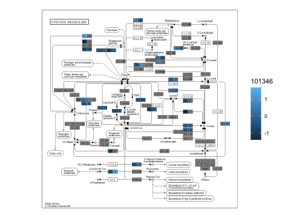
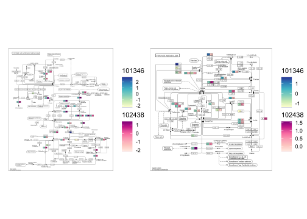
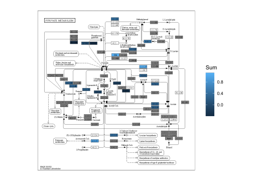

# Functional annotation {#function}

For functional profiling, several functions are prepared in `stana`. Note that these functions are primarily designed for `MIDAS` and `MIDAS2`, which profile gene abundances within species by default.


```r
library(stana)
library(ComplexHeatmap)
```

## Parsing `PATRIC` results

Use `checkPATRIC` function to obtain information related to `PATRIC` functional annotation. The function accepts the input of named list of genes, and returns functional annotation results. The function uses `BiocFileCache()` to cache the obtained results from API.


```r
genes <- list("test"=read.table("../test_genes.txt")$V1)
genes |> head()
#> $test
#>  [1] "1280701.3.peg.1153" "1280701.3.peg.1169"
#>  [3] "1280701.3.peg.1174" "1280701.3.peg.1179"
#>  [5] "1280701.3.peg.1186" "1280701.3.peg.203" 
#>  [7] "1280701.3.peg.361"  "1280701.3.peg.363" 
#>  [9] "1280701.3.peg.368"  "1280701.3.peg.369" 
#> [11] "1280701.3.peg.570"  "1280701.3.peg.758" 
#> [13] "1280701.3.peg.762"  "1410605.3.peg.1201"
#> [15] "1410605.3.peg.1204" "1410605.3.peg.1463"
#> [17] "1410605.3.peg.1510" "1410605.3.peg.1568"
#> [19] "1410605.3.peg.450"  "1410605.3.peg.593" 
#> [21] "1410605.3.peg.655"  "1410605.3.peg.833" 
#> [23] "1410605.3.peg.844"  "1410605.3.peg.903" 
#> [25] "1410605.3.peg.953"  "1447715.5.peg.1455"
#> [27] "1447715.5.peg.1549" "1447715.5.peg.1582"
#> [29] "1447715.5.peg.256"  "1447715.5.peg.33"  
#> [31] "1447715.5.peg.566"  "1447715.5.peg.964"
res <- checkPATRIC(genes, "pathway_name")
#> Obtaining annotations of 3 genomes
#>   Obtaining information on 1280701.3
#>   Obtaining information on 1410605.3
#>   Obtaining information on 1447715.5
#> Checking results on cluster test
#>   total of 2 annotation obtained
#>   remove duplicate based on pathway_name
#>   total of 2 annotation obtained after removal of duplication
DT::datatable(res$test$DF)
```

```{=html}
<div class="datatables html-widget html-fill-item-overflow-hidden html-fill-item" id="htmlwidget-0ef75ba074c45fa0f060" style="width:100%;height:auto;"></div>
<script type="application/json" data-for="htmlwidget-0ef75ba074c45fa0f060">{"x":{"filter":"none","vertical":false,"data":[["254","608"],["fig|1280701.3.peg.570","fig|1280701.3.peg.1186"],["4.2.1.51","2.1.1.37"],["Prephenate dehydratase","DNA (cytosine-5-)-methyltransferase"],[400,270],["Phenylalanine, tyrosine and tryptophan biosynthesis","Cysteine and methionine metabolism"]],"container":"<table class=\"display\">\n  <thead>\n    <tr>\n      <th> <\/th>\n      <th>patric_id<\/th>\n      <th>ec_number<\/th>\n      <th>ec_description<\/th>\n      <th>pathway_id<\/th>\n      <th>pathway_name<\/th>\n    <\/tr>\n  <\/thead>\n<\/table>","options":{"columnDefs":[{"className":"dt-right","targets":4},{"orderable":false,"targets":0}],"order":[],"autoWidth":false,"orderClasses":false}},"evals":[],"jsHooks":[]}</script>
```

### Draw the network

You can draw the graph of obtained results depicting enzyme to KEGG PATHWAY relationship.


```r
drawPATRIC(genes)
#> Obtaining annotations of 3 genomes
#>   Obtaining information on 1280701.3
#>   Obtaining information on 1410605.3
#>   Obtaining information on 1447715.5
#> Checking results on cluster test
#>   total of 2 annotation obtained
#>   remove duplicate based on ec_description
#>   total of 2 annotation obtained after removal of duplication
#> Making graph on pathway_name and ec_description
#>   subsetting to 5 label on each category
#> $test
#> $test$DF
#>                  patric_id ec_number
#> 254  fig|1280701.3.peg.570  4.2.1.51
#> 608 fig|1280701.3.peg.1186  2.1.1.37
#>                          ec_description pathway_id
#> 254              Prephenate dehydratase        400
#> 608 DNA (cytosine-5-)-methyltransferase        270
#>                                            pathway_name
#> 254 Phenylalanine, tyrosine and tryptophan biosynthesis
#> 608                  Cysteine and methionine metabolism
#> 
#> $test$REMOVEDUP
#>                  patric_id ec_number
#> 254  fig|1280701.3.peg.570  4.2.1.51
#> 608 fig|1280701.3.peg.1186  2.1.1.37
#>                          ec_description pathway_id
#> 254              Prephenate dehydratase        400
#> 608 DNA (cytosine-5-)-methyltransferase        270
#>                                            pathway_name
#> 254 Phenylalanine, tyrosine and tryptophan biosynthesis
#> 608                  Cysteine and methionine metabolism
#> 
#> $test$SORTED
#> 
#> DNA (cytosine-5-)-methyltransferase 
#>                                   1 
#>              Prephenate dehydratase 
#>                                   1 
#> 
#> $test$GRAPH
#> IGRAPH 36f1684 UN-- 4 2 -- 
#> + attr: name (v/c)
#> + edges from 36f1684 (vertex names):
#> [1] Prephenate dehydratase             --Phenylalanine, tyrosine and tryptophan biosynthesis
#> [2] DNA (cytosine-5-)-methyltransferase--Cysteine and methionine metabolism                 
#> 
#> $test$PLOT
```


## Parsing `eggNOG-mapper v2` results

Use `checkEGGNOG` function to read the output of eggNOG-mapper v2. Specify IDs you want to obtain to `ret`, such as "KEGG_ko" and "KEGG_Pathway".


```r
tib <- checkEGGNOG("../annotations_gtdb/100224_eggnog_out.emapper.annotations",
    ret="KEGG_ko")
tib |> head() |> DT::datatable()
```

```{=html}
<div class="datatables html-widget html-fill-item-overflow-hidden html-fill-item" id="htmlwidget-877148777273f2d41c15" style="width:100%;height:auto;"></div>
<script type="application/json" data-for="htmlwidget-877148777273f2d41c15">{"x":{"filter":"none","vertical":false,"data":[["1","2","3","4","5","6"],["GCF_002846775.1_00408","GCF_002846815.1_01743","GCF_004156145.1_01406","GCF_004155565.1_00557","GCF_004155645.1_00353","GCF_000800475.2_00338"],["KEGG_ko","KEGG_ko","KEGG_ko","KEGG_ko","KEGG_ko","KEGG_ko"],["ko:K11533","ko:K11533","ko:K11533","ko:K11533","ko:K11533","ko:K11533"]],"container":"<table class=\"display\">\n  <thead>\n    <tr>\n      <th> <\/th>\n      <th>ID<\/th>\n      <th>name<\/th>\n      <th>value<\/th>\n    <\/tr>\n  <\/thead>\n<\/table>","options":{"columnDefs":[{"orderable":false,"targets":0}],"order":[],"autoWidth":false,"orderClasses":false}},"evals":[],"jsHooks":[]}</script>
```

### Draw the network

You can draw the relationships between IDs by `drawEGGNOG`.


```r
drawEGGNOG("../annotations_gtdb/100224_eggnog_out.emapper.annotations",
           candPlot = c("KEGG_ko","KEGG_Pathway"),
           geneIDs = tib$ID |> head(100))
#> # A tibble: 4,287 × 3
#>    ID                    name          value                
#>    <chr>                 <chr>         <chr>                
#>  1 GCF_002846775.1_00408 seed_ortholog 1690.BPSG_1412       
#>  2 GCF_002846775.1_00408 eggNOG_OGs    COG0304@1|root       
#>  3 GCF_002846775.1_00408 eggNOG_OGs    COG0331@1|root       
#>  4 GCF_002846775.1_00408 eggNOG_OGs    COG2030@1|root       
#>  5 GCF_002846775.1_00408 eggNOG_OGs    COG4981@1|root       
#>  6 GCF_002846775.1_00408 eggNOG_OGs    COG0304@2|Bacteria   
#>  7 GCF_002846775.1_00408 eggNOG_OGs    COG0331@2|Bacteria   
#>  8 GCF_002846775.1_00408 eggNOG_OGs    COG2030@2|Bacteria   
#>  9 GCF_002846775.1_00408 eggNOG_OGs    COG4981@2|Bacteria   
#> 10 GCF_002846775.1_00408 eggNOG_OGs    2GIY4@201174|Actinob…
#> # … with 4,277 more rows
#> $graph
#> IGRAPH 37efc8d UN-- 21 922 -- 
#> + attr: name (v/c), category (v/c), size (v/n)
#> + edges from 37efc8d (vertex names):
#>  [1] ko:K11533--ko00061 ko:K11533--ko01100
#>  [3] ko:K11533--ko01212 ko:K11533--ko04931
#>  [5] ko:K11533--ko00061 ko:K11533--ko01100
#>  [7] ko:K11533--ko01212 ko:K11533--ko04931
#>  [9] ko:K11533--ko00061 ko:K11533--ko01100
#> [11] ko:K11533--ko01212 ko:K11533--ko04931
#> [13] ko:K11533--ko00061 ko:K11533--ko01100
#> [15] ko:K11533--ko01212 ko:K11533--ko04931
#> + ... omitted several edges
#> 
#> $plot
```


## Heatmap of the gene abundances with functional annotations

You can inspect the overview of functional differences using gene abundances along with `simplifyEnrichment`. The `plotHeatmap` function can be used with the stana object or preprocessed gene abundance matrix as input. In the function, `anno_PATRIC_keywords` and `anno_eggNOG_keywords` are used to plot the word clouds alongside `Heatmap` from `ComplexHeatmap`.

### `MIDAS`

For `MIDAS`, the function automatically query API of `PATRIC` server using the gene names.

### `MIDAS2`

For `MIDAS2`, the users should provide eggNOG annotation on `eggNOG` slot of stana object. `fnc` argument accepts `KEGG_Pathway` or `KEGG_Module` available in eggNOG annotation. The function queries `KEGG REST API` to obtain pathway and module description. As the gene number is large typically, one can filter the genes by options `filter_zero_frac`, `filter_max_frac` and `filter_max_value`. However, one should perform own filtering beforehand and provide the matrix to `mat`. If `mat` is specified, other filtering options will be ignored.


```r
load("../hd_meta.rda")
taxtbl <- read.table("../metadata_uhgg.tsv", sep="\t",
                     header=1, row.names=1, check.names = FALSE)
stana <- loadMIDAS2("../merge_uhgg", cl=hd_meta, candSp=c("101346"), taxtbl=taxtbl, db="uhgg")
#> SNPS
#>   101346
#>   d__Bacteria;p__Bacteroidota;c__Bacteroidia;o__Bacteroidales;f__Bacteroidaceae;g__Bacteroides;s__Bacteroides uniformis
#>     Number of snps: 70178
#>     Number of samples: 28
#>       Number of samples in HC: 12
#>       Number of samples in R: 16
#>       Passed the filter
#> Genes
#>   101346
#>   d__Bacteria;p__Bacteroidota;c__Bacteroidia;o__Bacteroidales;f__Bacteroidaceae;g__Bacteroides;s__Bacteroides uniformis
#>     Number of genes: 120158
#>     Number of samples: 31
#>       Number of samples in HC: 13
#>       Number of samples in R: 18
#>       Passed the filter
```

We set the eggNOG-mapper v2 annotation file to the eggNOG slot of stana object.


```r
## Set the annotation file
stana@eggNOG <- list("101346"="../annotations_uhgg/101346_eggnog_out.emapper.annotations")
```

You can set `removeAdditional` argument to filter words that are to be displayed.


```r
library(ComplexHeatmap)
library(simplifyEnrichment)

plotHeatmap(stana, "101346",
    fnc="KEGG_Module",
    removeAdditional=c("cycle","pathway"),
    filter_zero_frac = 0.5,
    filter_max_frac = 0,
    filter_max_value = 5)
#> In resulting matrix, max: 4.999739, min: 0
#> Dimension: 3501, 31
#> MIDAS2, looking for the annotation file by eggNOG-mapper v2
#> Loading annotation
```


## KGEG PATHWAY and KEGG ORTHOLOGY

### Visualization of KEGG PATHWAY

`KEGG PATHWAY` is frequently used to characterize metabolic function of microbiome. Utilizing [`ggkegg`](https://github.com/noriakis/ggkegg), the information of intra-species diversity, particulary gene abundance differences, can be reflected onto `KEGG PATHWAY`.

#### Visualizing differences per species

Load the profile for multiple species.


```r
load("../hd_meta.rda")
taxtbl <- read.table("../metadata_uhgg.tsv", sep="\t",
                     header=1, row.names=1, check.names = FALSE)
stana <- loadMIDAS2("../merge_uhgg", cl=hd_meta, candSp=c("101346","102438"), taxtbl=taxtbl, db="uhgg")
#> SNPS
#>   101346
#>   d__Bacteria;p__Bacteroidota;c__Bacteroidia;o__Bacteroidales;f__Bacteroidaceae;g__Bacteroides;s__Bacteroides uniformis
#>     Number of snps: 70178
#>     Number of samples: 28
#>       Number of samples in HC: 12
#>       Number of samples in R: 16
#>       Passed the filter
#>   102438
#>   d__Bacteria;p__Bacteroidota;c__Bacteroidia;o__Bacteroidales;f__Tannerellaceae;g__Parabacteroides;s__Parabacteroides distasonis
#>     Number of snps: 18102
#>     Number of samples: 28
#>       Number of samples in HC: 10
#>       Number of samples in R: 18
#>       Passed the filter
#> Genes
#>   101346
#>   d__Bacteria;p__Bacteroidota;c__Bacteroidia;o__Bacteroidales;f__Bacteroidaceae;g__Bacteroides;s__Bacteroides uniformis
#>     Number of genes: 120158
#>     Number of samples: 31
#>       Number of samples in HC: 13
#>       Number of samples in R: 18
#>       Passed the filter
#>   102438
#>   d__Bacteria;p__Bacteroidota;c__Bacteroidia;o__Bacteroidales;f__Tannerellaceae;g__Parabacteroides;s__Parabacteroides distasonis
#>     Number of genes: 47046
#>     Number of samples: 29
#>       Number of samples in HC: 11
#>       Number of samples in R: 18
#>       Passed the filter
```

Next, we set the eggNOG-mapper v2 annotation file to the eggNOG slot of stana object.
This way, the `plotKEGGPathway` function automatically calculates the abundance by user-defined method.


```r
## Set the annotation file
stana@eggNOG <- list("101346"="../annotations_uhgg/101346_eggnog_out.emapper.annotations",
                     "102438"="../annotations_uhgg/102438_eggnog_out.emapper.annotations")
```

plotKEGGPathway can be run by providing stana object, species (when multiple species, rectangular nodes will be split),
and pathway ID to visualize. Here, we visualize `ko00620`, Pyruvate metabolism for example. As for the large annotation table, the calculation takes time and you can provide pre-calculated KO table in `kos` slot of stana object, or specify `only_ko = TRUE` to first return KO table.


```r
stana <- plotKEGGPathway(stana, c("101346","102438"), pathway_id="ko00620", only_ko=TRUE, multi_scale=FALSE)
gg <- plotKEGGPathway(stana, c("101346","102438"), pathway_id="ko00620", multi_scale=FALSE)
#> Using pre-computed KO table
#> Using pre-computed KO table
#> 101346: HC / R
#> 102438: HC / R
gg
```



By default, the scale is same. If you install `ggh4x`, multiple scales can be added, by specifying `multi_scale` argument.


```r
gg <- plotKEGGPathway(stana, c("101346","102438"), pathway_id="ko00620", multi_scale=TRUE)
#> Using pre-computed KO table
#> Using pre-computed KO table
#> 101346: HC / R
#> 102438: HC / R
gg
```


You can provide multiple pathway IDs to pathway_id, which returns a list of plot.


```r
gg <- plotKEGGPathway(stana, c("101346","102438"),
                      pathway_id=c("ko00270","ko00620"),
                      multi_scale=TRUE)
#> Using pre-computed KO table
#> Using pre-computed KO table
#> 101346: HC / R
#> 102438: HC / R
gg2 <- patchwork::wrap_plots(gg)
gg2
```



In this way, differences in orthologies in the pathway across multiple species can be readily captured.

### Visualizing calculated values across species

If you want to see the sum values across species, you can set option `summarize=TRUE`. This way, the KO values across specified species are summed, and compared between groups, then plotted.


```r
gg <- plotKEGGPathway(stana, c("101346","102438"),
                      pathway_id=c("ko00270","ko00620"),
                      summarize=TRUE)
#> Using pre-computed KO table
#> Using pre-computed KO table
#> 102438: HC / R
gg2 <- patchwork::wrap_plots(gg)
gg2
```


