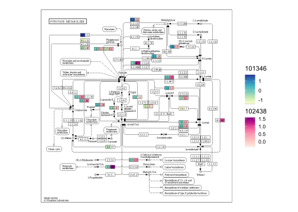

# Functional annotation {#function}

For functional profiling, several functions are prepared in `stana`. Note that these functions are primarily designed for `MIDAS` and `MIDAS2`, which profile gene abundances within species by default.


```r
library(stana)
library(ComplexHeatmap)
```

## Parsing `PATRIC` results

## Parsing `eggNOG-mapper v2` results

### Visualizing function network

## KGEG PATHWAY and KEGG ORTHOLOGY

### Visualization of KEGG PATHWAY

`KEGG PATHWAY` is frequently used to characterize metabolic function of microbiome. Utilizing [`ggkegg`](https://github.com/noriakis/ggkegg), the information of intra-species diversity, particulary gene abundance differences, can be reflected onto `KEGG PATHWAY`.

#### Visualizing differences per species

Load the profile for multiple species.


```r
load("../hd_meta.rda")
taxtbl <- read.table("../metadata_uhgg.tsv", sep="\t",
                     header=1, row.names=1, check.names = FALSE)
stana <- loadMIDAS2("../merge_uhgg", cl=hd_meta, candSp=c("101346","102438"), taxtbl=taxtbl, db="uhgg")
#> SNPS
#>   101346
#>   d__Bacteria;p__Bacteroidota;c__Bacteroidia;o__Bacteroidales;f__Bacteroidaceae;g__Bacteroides;s__Bacteroides uniformis
#>     Number of snps: 70178
#>     Number of samples: 28
#>       Number of samples in HC: 12
#>       Number of samples in R: 16
#>       Passed the filter
#>   102438
#>   d__Bacteria;p__Bacteroidota;c__Bacteroidia;o__Bacteroidales;f__Tannerellaceae;g__Parabacteroides;s__Parabacteroides distasonis
#>     Number of snps: 18102
#>     Number of samples: 28
#>       Number of samples in HC: 10
#>       Number of samples in R: 18
#>       Passed the filter
#> Genes
#>   101346
#>   d__Bacteria;p__Bacteroidota;c__Bacteroidia;o__Bacteroidales;f__Bacteroidaceae;g__Bacteroides;s__Bacteroides uniformis
#>     Number of genes: 120158
#>     Number of samples: 31
#>       Number of samples in HC: 13
#>       Number of samples in R: 18
#>       Passed the filter
#>   102438
#>   d__Bacteria;p__Bacteroidota;c__Bacteroidia;o__Bacteroidales;f__Tannerellaceae;g__Parabacteroides;s__Parabacteroides distasonis
#>     Number of genes: 47046
#>     Number of samples: 29
#>       Number of samples in HC: 11
#>       Number of samples in R: 18
#>       Passed the filter
```

Next, we set the eggNOG-mapper v2 annotation file to the eggNOG slot of stana object.
This way, the `plotKEGGPathway` function automatically calculates the abundance by user-defined method.


```r
## Set the annotation file
stana@eggNOG <- list("101346"="../annotations_uhgg/101346_eggnog_out.emapper.annotations",
                     "102438"="../annotations_uhgg/102438_eggnog_out.emapper.annotations")
```

plotKEGGPathway can be run by providing stana object, species (when multiple species, rectangular nodes will be split),
and pathway ID to visualize. Here, we visualize `ko00620`, Pyruvate metabolism for example. As for the large annotation table, the calculation takes time and you can provide pre-calculated KO table in `kos` slot of stana object, or specify `only_ko = TRUE` to first return KO table.


```r
stana <- plotKEGGPathway(stana, c("101346","102438"), pathway_id="ko00620", only_ko=TRUE, multi_scale=FALSE)
gg <- plotKEGGPathway(stana, c("101346","102438"), pathway_id="ko00620", multi_scale=FALSE)
#> Using pre-computed KO table
#> Using pre-computed KO table
#> 101346: HC / R
#> 102438: HC / R
gg
```


By default, the scale is same. If you install `ggh4x`, multiple scales can be added, by specifying `multi_scale` argument.


```r
gg <- plotKEGGPathway(stana, c("101346","102438"), pathway_id="ko00620", multi_scale=TRUE)
#> Using pre-computed KO table
#> Using pre-computed KO table
#> 101346: HC / R
#> 102438: HC / R
gg
```



You can provide multiple pathway IDs to pathway_id, which returns a list of plot.


```r
gg <- plotKEGGPathway(stana, c("101346","102438"),
                      pathway_id=c("ko00270","ko00620"),
                      multi_scale=TRUE)
#> Using pre-computed KO table
#> Using pre-computed KO table
#> 101346: HC / R
#> 102438: HC / R
gg2 <- patchwork::wrap_plots(gg)
gg2
```


In this way, differences in orthologies in the pathway across multiple species can be readily captured.
