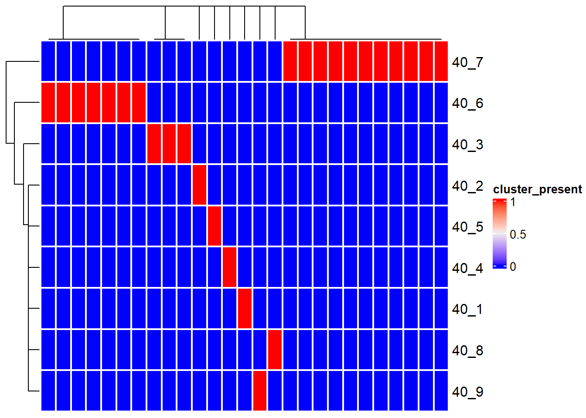

# Visualization

`stana` offers visualization functions that can interpret the profiled data.


```r
library(stana)
library(ComplexHeatmap)
```


## `plotPCA`

You can plot principal component analysis results using `prcomp` by `plotPCA` function across grouping specified. If no group is specified, `No_Group` label is assigned to all the samples.


```r
mt <- loadmetaSNV("../metasnv_sample_out/",just_species = TRUE)
mt <- loadmetaSNV("../metasnv_sample_out/", candSp=mt[1])
#>   Loading refGenome1clus
plotPCA(mt, species=getID(mt)[1])
#> After filtering: 1022 SNVs
#> $refGenome1clus
```


## Visualization of gene copy numbers


```r
load("../hd_meta.rda")
stana <- loadMIDAS2("../merge_uhgg", cl=hd_meta, candSp="102478")
#> SNPS
#>   102478
#>     Number of snps: 77431
#>     Number of samples: 31
#>       Number of samples in HC: 9
#>       Number of samples in R: 22
#>       Passed the filter
#> Genes
#>   102478
#>     Number of genes: 150996
#>     Number of samples: 32
#>       Number of samples in HC: 10
#>       Number of samples in R: 22
#>       Passed the filter
plotGenes(stana, "102478", c("UHGG000186_00531","UHGG000186_00521"))
```


Default color mapping can be changed by `changeColors`.


```r
stana <- changeColors(stana, c("blue","red"))
plotGenes(stana, "102478", c("UHGG000186_00531","UHGG000186_00521"))
```


## Visualization of functional analysis results

See \@ref(function).

## Visualization of `inStrain` results

The imported `inStrain` `compare` profiles can be visualized. The loaded genome-wide comparison table and strain cluster table can be visualized using `genomeHeatmap` and `strainClusterHeatmap` by `ComplexHeatmap`. For `genomeHeatmap`, typically population ANI or consensus ANI are plotted, but all the columns listed in `genomeWide_compare.tsv` can be plotted. The parameters to be passed to `Heatmap` can be specified with `heatmapArgs`. If cluster information (`getCl(stana)`) is available or `cl` is specified, the columns will be split to present the grouping. Please refer to the documentation of [`inStrain`](https://instrain.readthedocs.io/en/latest/important_concepts.html) for `popANI` and `conANI`.


```r
instr_chk <- "GUT_GENOME142015"
instr <- loadInStrain("../inStrain_out", instr_chk)
genomeHeatmap(instr, instr_chk, column = "popANI", heatmapArgs = list(show_column_name=FALSE))
```


```r
strainClusterHeatmap(instr, instr_chk, heatmapArgs = list(show_column_name=FALSE))
```


