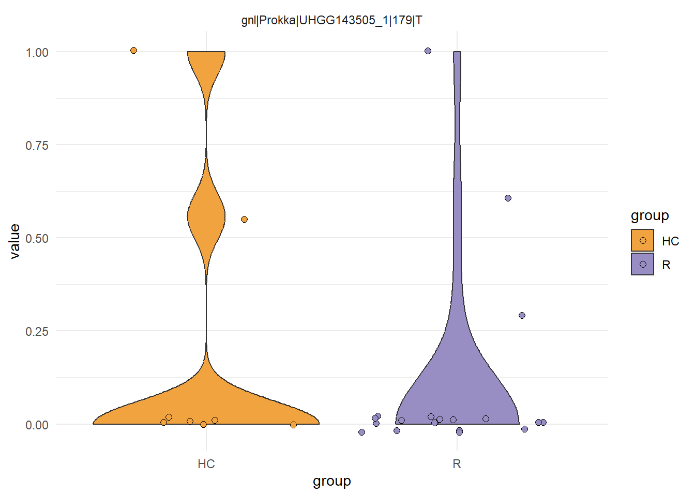
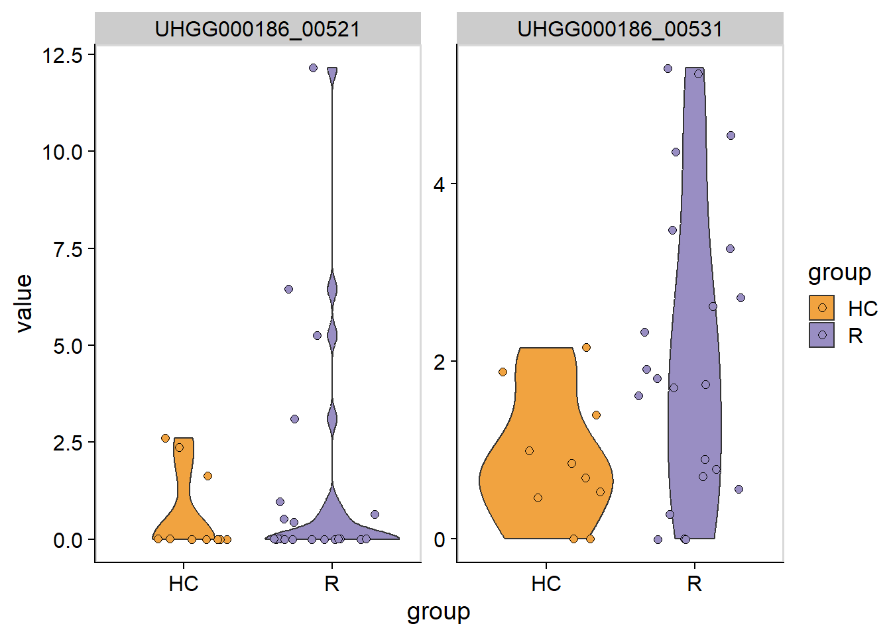

# Visualization

`stana` offers visualization functions that can interpret the profiled data.


```r
library(stana)
library(ComplexHeatmap)
```

## `plotSNVSummary` and `plotSNVInfo`

These functions can be used to plot the information related to SNV, which can be used to inspect the overview of profiled SNVs.


```r
load("../hd_meta.rda")
stana <- loadMIDAS2("../merge_uhgg", cl=hd_meta, candSp="102478")
#>   102478
#>   s__Clostridium_A leptum
#>     Number of snps: 77431
#>     Number of samples: 31
#>   102478
#>   s__Clostridium_A leptum
#>     Number of genes: 150996
#>     Number of samples: 32
plotSNVSummary(stana, "102478")
```


```r
plotSNVInfo(stana, "102478")
```


## `plotMAF`

This functions plots the boxplot of MAF at a single position between groups.


```r
plotMAF(stana, "102478", row.names(getSlot(stana, "snpsInfo")[[1]])[1])
```



## `plotMAFHist`

This functions plots the histogram of MAF for the candidate species.


```r
plotMAFHist(stana, "102478")
```


## `plotCoverage`

This function plots the coverage of the canddiate species across the group.


```r
plotCoverage(stana, "102478")
```


## `plotPCA`

You can plot principal component analysis results using `prcomp` by `plotPCA` function across grouping specified. If no group is specified, `No_Group` label is assigned to all the samples.


```r
mt <- loadmetaSNV("../metasnv_sample_out/",just_species = TRUE)
mt <- loadmetaSNV("../metasnv_sample_out/", candSp=mt[1])
#>   Loading refGenome1clus
plotPCA(mt, species=getID(mt)[1])
#> After filtering: 1022 SNVs
#> $refGenome1clus
```


## `plotDist`

Plot the heatmap of distance matrix with grouping variables using `pheatmap`.


```r
library(pheatmap)
plotDist(stana, "102478", target="snps")
#> # Performing dist in 102478 target is snps
```


Plot using the subset of the SNV.


```r
stana <- siteFilter(stana, "102478", site_type=="4D")
#> # total of 27533 obtained from 77431
plotDist(stana, "102478", target="snps")
#> # Performing dist in 102478 target is snps
#> # The set SNV ID information (27533) is used.
```


## `plotCirclize`

This function can be used to circlize plot, which can link the information related to MAF or SNV with gene copy number analysis. The function needs the `snpsInfo` slot filled with the data having `genome_id`, `gene_id` and `position` column. For MIDAS2 and inStrain, the packge automatically infers the `genome_id`.


```r
library(circlize)
plotCirclize(stana, "102478", genomeId="UHGG143505", thresh_snp_gene = 150)
#> Type is MIDAS2
#> Features not provided, default to sample_counts
#> Genome ID in SNV information:
#>   UHGG143505_1: 179 - 5439351, number of position: 77431
#> Genome ID: UHGG143505
#> Included position: 987
```


## Visualization of gene copy numbers

The violin plot of gene copy numbers can be plotted by `plotGenes`.


```r
load("../hd_meta.rda")
stana <- loadMIDAS2("../merge_uhgg", cl=hd_meta, candSp="102478")
#>   102478
#>   s__Clostridium_A leptum
#>     Number of snps: 77431
#>     Number of samples: 31
#>   102478
#>   s__Clostridium_A leptum
#>     Number of genes: 150996
#>     Number of samples: 32
plotGenes(stana, "102478", c("UHGG000186_00531","UHGG000186_00521"))
#> [1] "#F1A340" "#998EC3"
```



Default color mapping can be changed by `changeColors`.


```r
stana <- changeColors(stana, c("blue","red"))
plotGenes(stana, "102478", c("UHGG000186_00531","UHGG000186_00521"))
#> [1] "blue" "red"
```


## Visualization of phylogenetic tree

See \@ref(cons) for the functions like `inferAndPlotTree` for visualizing the phylogenetic tree inferred by various methods.

## Visualization of functional analysis results

See \@ref(function) for the functions like `plotHeatmap` and `plotKEGGPathway`.

## Visualization of `inStrain` results

For the specific software, the imported `inStrain` `compare` profiles can be visualized. The loaded genome-wide comparison table and strain cluster table can be visualized using `genomeHeatmap` and `strainClusterHeatmap` by `ComplexHeatmap`. For `genomeHeatmap`, typically population ANI or consensus ANI are plotted, but all the columns listed in `genomeWide_compare.tsv` can be plotted. The parameters to be passed to `Heatmap` can be specified with `heatmapArgs`. If cluster information (`getCl(stana)`) is available or `cl` is specified, the columns will be split to present the grouping. Please refer to the documentation of [`inStrain`](https://instrain.readthedocs.io/en/latest/important_concepts.html) for `popANI` and `conANI`.


```r
instr_chk <- "GUT_GENOME142015"
instr <- loadInStrain("../inStrain_out", instr_chk)
genomeHeatmap(instr, instr_chk, column = "popANI", heatmapArgs = list(show_column_name=FALSE))
```


```r
strainClusterHeatmap(instr, instr_chk, heatmapArgs = list(show_column_name=FALSE))
```


