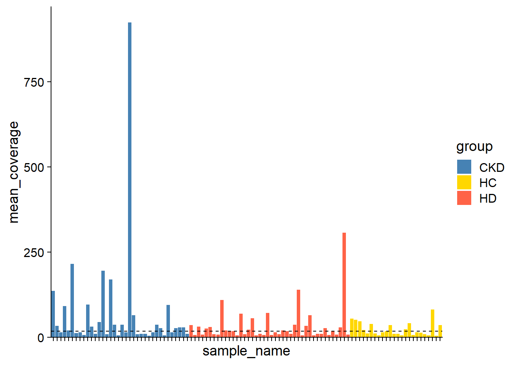

# Analysis example

We demonstrate the analysis of metagenotyping results using `stana`. We use the gut microbiome data of Crohn's disease patients from the publication by He et al. ([He et al. 2017](https://doi.org/10.1093/gigascience/gix050)). Here, we investigate the genotyping results of MIDAS2, specifically *Bacteroides dorei* as the species has been reported to play a role in the disease through gut microbiome.

First we load the MIDAS2 results specifying merged MIDAS2 directory, with specifying which species to load and which database was used.

## SNV analysis


```r
library(stana)
library(dplyr)

## Make grouping list using SRA run table
meta <- read.table("../clinical/CrohnSubset/metadata.tsv", sep="\t", header=1)
pd <- meta$Run %>% setNames(meta$diganosis)
cl <- split(pd, names(pd))
cl <- lapply(cl, unname)
cl
#> $CD
#>  [1] "ERR1620255" "ERR1620256" "ERR1620257" "ERR1620258"
#>  [5] "ERR1620259" "ERR1620260" "ERR1620261" "ERR1620262"
#>  [9] "ERR1620263" "ERR1620264" "ERR1620265" "ERR1620266"
#> [13] "ERR1620267" "ERR1620268" "ERR1620269" "ERR1620270"
#> [17] "ERR1620271" "ERR1620272" "ERR1620273" "ERR1620274"
#> [21] "ERR1620275" "ERR1620276" "ERR1620278" "ERR1620279"
#> [25] "ERR1620280" "ERR1620281" "ERR1620282" "ERR1620283"
#> [29] "ERR1620284" "ERR1620285" "ERR1620286" "ERR1620287"
#> [33] "ERR1620288" "ERR1620289" "ERR1620290" "ERR1620291"
#> [37] "ERR1620292" "ERR1620293" "ERR1620294" "ERR1620295"
#> [41] "ERR1620296" "ERR1620297" "ERR1620298" "ERR1620299"
#> [45] "ERR1620300" "ERR1620301" "ERR1620302" "ERR1620303"
#> [49] "ERR1620304" "ERR1620305" "ERR1620306" "ERR1620307"
#> [53] "ERR1620308" "ERR1620309" "ERR1620313" "ERR1620314"
#> [57] "ERR1620315" "ERR1620316" "ERR1620317" "ERR1620318"
#> [61] "ERR1620319" "ERR1620320" "ERR1620321"
#> 
#> $Control
#>  [1] "ERR1620322" "ERR1620323" "ERR1620324" "ERR1620325"
#>  [5] "ERR1620326" "ERR1620327" "ERR1620328" "ERR1620329"
#>  [9] "ERR1620330" "ERR1620331" "ERR1620332" "ERR1620333"
#> [13] "ERR1620334" "ERR1620335" "ERR1620336" "ERR1620337"
#> [17] "ERR1620338" "ERR1620339" "ERR1620340" "ERR1620341"
#> [21] "ERR1620342" "ERR1620343" "ERR1620344" "ERR1620346"
#> [25] "ERR1620347" "ERR1620348" "ERR1620349" "ERR1620350"
#> [29] "ERR1620351" "ERR1620352" "ERR1620353" "ERR1620355"
#> [33] "ERR1620356" "ERR1620357" "ERR1620358" "ERR1620359"
#> [37] "ERR1620360" "ERR1620361" "ERR1620362" "ERR1620363"
#> [41] "ERR1620364" "ERR1620365" "ERR1620366" "ERR1620367"
#> [45] "ERR1620368" "ERR1620369" "ERR1620370" "ERR1620371"
#> [49] "ERR1620372" "ERR1620373" "ERR1620374" "ERR1620375"
#> [53] "ERR1620376" "ERR1620377"

## Load the B. dorei profile
cand_species <- "102478"
stana <- loadMIDAS2("../clinical/CrohnSubset", candSp=cand_species, cl=cl, db="uhgg")
#>   102478
#>     Number of snps: 80029
#>     Number of samples: 98
#>   102478
#>     Number of genes: 208821
#>     Number of samples: 99
stana
#> # A stana: MIDAS2
#> # Database: uhgg
#> # Loaded directory: ../clinical/CrohnSubset
#> # Species number: 1
#> # Group info (list): CD/Control
#> # Loaded SNV table: 1 ID: 102478
#> # Loaded gene table: 1 ID: 102478
#> # Size: 310904480 B
#> # 
#> # SNV description
#> # A tibble: 3 × 3
#> # Groups:   group [3]
#>   group   species_id                                       n
#>   <chr>   <chr>                                        <int>
#> 1 CD      d__Bacteria;p__Bacteroidota;c__Bacteroidia;…    44
#> 2 Control d__Bacteria;p__Bacteroidota;c__Bacteroidia;…    50
#> 3 <NA>    d__Bacteria;p__Bacteroidota;c__Bacteroidia;…     4
```
Get a brief overview of SNVs.


```r
## The level contains NA
stana <- stana <- stana::changeColors(stana, c("tomato","steelblue","gold"))

plotSNVInfo(stana, cand_species)
```


```r
plotSNVSummary(stana, cand_species)
```



Based on the SNV and the related statistics of SNV, the consensus multiple sequence alignment is made by `consensusSeq` function. It can be accessed by `getFasta` function. This time, we filter the samples with `mean_coverage`.


```r
stana <- consensusSeq(stana, cand_species, argList=list("mean_depth"=20))
#> Beginning calling for 102478
#>   Site number: 80029
#>   Profiled samples: 98
#>   Included samples: 82
getFasta(stana)[[cand_species]]
#> 82 sequences with 72042 character and 30516 different site patterns.
#> The states are a c g t
```

Based on the MSA, the phylogenetic tree can be inferred by `inferAndPlotTree`. Inferring function can be specified by `treeFun` and is default to `upgma` function in phangorn, but can be stated the other functions. The tree plot shows the cladogram by default, but can be overridden by `branch.length` argument passed to `ggtree`.


```r
stana <- inferAndPlotTree(stana, cand_species, target="fasta", treeFun="upgma")
getTree(stana)[[cand_species]]
#> 
#> Phylogenetic tree with 82 tips and 81 internal nodes.
#> 
#> Tip labels:
#>   ERR1620255, ERR1620256, ERR1620257, ERR1620258, ERR1620260, ERR1620264, ...
#> 
#> Rooted; includes branch lengths.
getTreePlot(stana)[[cand_species]]
```


Using cophenetic distance matrix from tree, the PERMANOVA is performed. Note that `doAdonis` can accept the other distance matrices of samples such as those calculated from gene copy numbers.


```r
stana <- doAdonis(stana, cand_species, target="tree")
#> Performing adonis in 102478
#> Warning in att$heading[2] <- deparse(match.call(),
#> width.cutoff = 500L): number of items to replace is not a
#> multiple of replacement length
#>   F: 1.55515904503209, R2: 0.0200522965097537, Pr: 0.287
getAdonis(stana)[[cand_species]]
#> Permutation test for adonis under reduced model
#> Terms added sequentially (first to last)
#> Permutation: free
#> Number of permutations: 999
#> 
#> adonis2(formula = d ~ gr, na.action = function (object, ...) 
#>          Df SumOfSqs      R2      F Pr(>F)
#> gr        1    2.029 0.02005 1.5552  0.287
#> Residual 76   99.147 0.97995              
#> Total    77  101.176 1.00000
```

## Gene copy number analysis

The gene annotation is obtained by eggNOG-mapper, and the resulting file can be set by `setAnnotation` function.


```r
stana <- setAnnotation(stana, annotList=list("102478"="../clinical/CrohnSubset/102478_eggnog_out.emapper.annotations"))
```
Aggregate the gene copy numbers to KEGG ORTHOLOGY (gene family) level.


```r
stana <- calcKO(stana, cand_species)
```
Perform NMF on KO abundance tables with the rank of two assuming two factors are within the species.


```r
stana <- NMF(stana, cand_species, rank=2)
#> Original features: 3570 
#> Original samples: 99 
#> Filtered features: 3570 
#> Filtered samples: 99 
#> Rank 2 
#> Mean relative abundances: 0.8978259 0.1021741 
#> Present feature per strain: 3535 2957
plotAbundanceWithinSpecies(stana, cand_species)
```


Using these information to inspect how these two factors have different metabolic functions.


```r
library(ggrepel)
#> Warning: package 'ggrepel' was built under R version 4.3.2
pw <- data.frame(pathwayWithFactor(stana, cand_species, tss=TRUE, change_name=TRUE))
pw[["name"]] <- row.names(pw)
ggplot(pw, aes(x=pw[,1], y=pw[,2]))+
    geom_point()+
    geom_text_repel(aes(label=name), bg.colour="white")+
    geom_smooth()+xlab("1")+ylab("2")+
    cowplot::theme_cowplot()
#> `geom_smooth()` using method = 'loess' and formula = 'y ~
#> x'
#> Warning: ggrepel: 296 unlabeled data points (too many
#> overlaps). Consider increasing max.overlaps
```


```r

fc <- pw[,1] - pw[,2]
names(fc) <- pw[["name"]]
nms <- names(sort(abs(fc[!is.infinite(fc)]), decreasing=TRUE) %>% head(20))

library(pheatmap)
pheatmap(pw[nms, 1:2])
```


The Boruta function can be used to identify those genes distinguishing two conditions (CD vs Control).


```r
library(Boruta)
bor <- doBoruta(stana, cand_species, target="kos")
#> Using grouping from the slot
#> Feature number: 3570
#> Performing Boruta
conf <- names(bor$boruta$finalDecision[bor$boruta$finalDecision=="Confirmed"])

library(BiocFileCache)
#> Loading required package: dbplyr
#> 
#> Attaching package: 'dbplyr'
#> The following objects are masked from 'package:dplyr':
#> 
#>     ident, sql
bfc <- BiocFileCache()
url <- bfcrpath(bfc,"https://rest.kegg.jp/list/ko")
readr::read_delim(url, col_names = FALSE) %>%
    mutate(X1=paste0("ko:",X1)) %>%
    filter(X1 %in% conf)
#> Rows: 26323 Columns: 2
#> ── Column specification ────────────────────────────────────
#> Delimiter: "\t"
#> chr (2): X1, X2
#> 
#> ℹ Use `spec()` to retrieve the full column specification for this data.
#> ℹ Specify the column types or set `show_col_types = FALSE` to quiet this message.
#> # A tibble: 69 × 2
#>    X1        X2                                             
#>    <chr>     <chr>                                          
#>  1 ko:K00005 gldA; glycerol dehydrogenase [EC:1.1.1.6]      
#>  2 ko:K00008 SORD, gutB; L-iditol 2-dehydrogenase [EC:1.1.1…
#>  3 ko:K00390 cysH; phosphoadenosine phosphosulfate reductas…
#>  4 ko:K00433 cpo; non-heme chloroperoxidase [EC:1.11.1.10]  
#>  5 ko:K00632 fadA, fadI; acetyl-CoA acyltransferase [EC:2.3…
#>  6 ko:K00981 E2.7.7.41, CDS1, CDS2, cdsA; phosphatidate cyt…
#>  7 ko:K01182 IMA, malL; oligo-1,6-glucosidase [EC:3.2.1.10] 
#>  8 ko:K01226 treC; trehalose-6-phosphate hydrolase [EC:3.2.…
#>  9 ko:K01267 DNPEP; aspartyl aminopeptidase [EC:3.4.11.21]  
#> 10 ko:K01439 dapE; succinyl-diaminopimelate desuccinylase […
#> # ℹ 59 more rows
```


