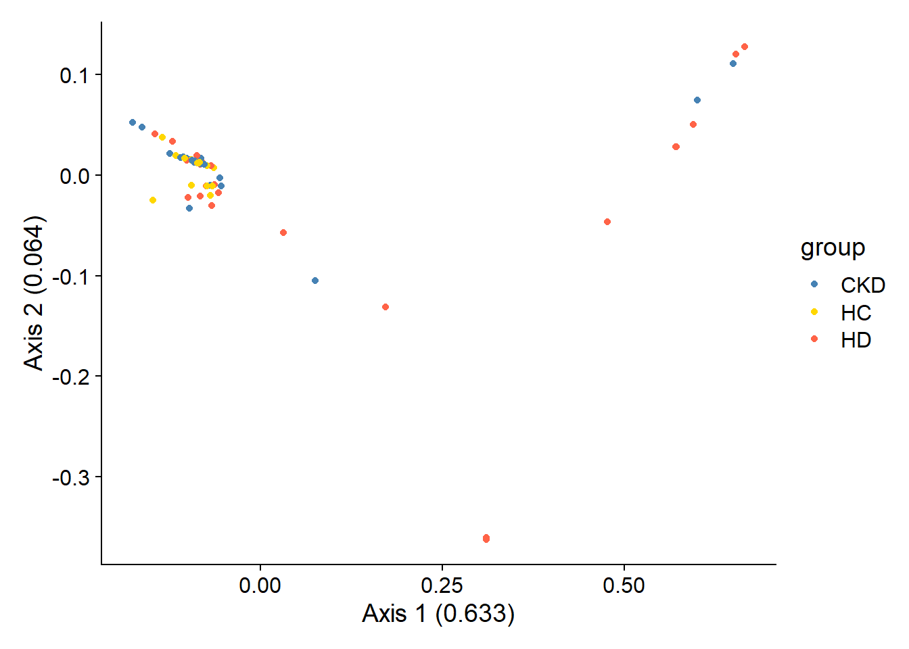
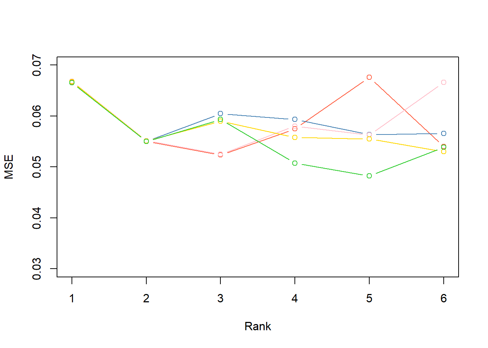
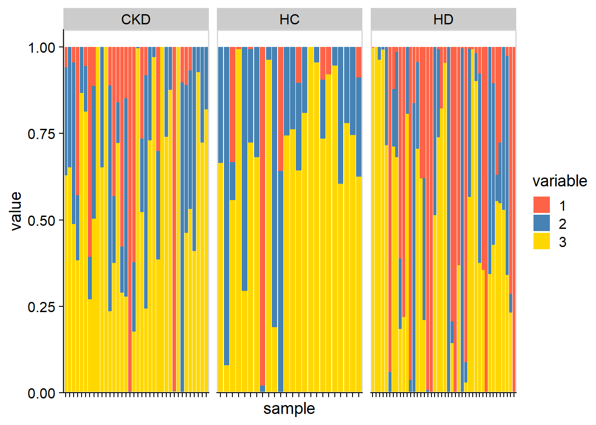

# Analysis example of gut microbiome of ESRD patients

We examine the dataset investigating the gut microbiome of ESRD patients ([Zhang et al. 2023](https://doi.org/10.1186/s13059-023-03056-y)) using `stana`. The SNV was profiled by MIDAS2 pipeline, and loaded to stana object. This time, we investigate one of the profiled species, `Faecalicatena gnavus` genotyping results.

Load the MIDAS2 merge results to stana object with setting the clinical grouping.


```r
library(dplyr)
library(stana)

meta <- read.table("../clinical/HDSubset/metadata.tsv", sep="\t", header=1)
hd <- meta$Run %>% setNames(meta$Group)
cl <- split(hd, names(hd))
cl <- lapply(cl, unname)
cand_species <- "101380"
stana <- loadMIDAS2("../clinical/HDSubset", candSp=cand_species, cl=cl, db="uhgg")
#>   101380
#>     Number of snps: 26540
#>     Number of samples: 102
#>   101380
#>     Number of genes: 59925
#>     Number of samples: 124
stana <- changeColors(stana, c("steelblue","gold","tomato"))
stana
#> # A stana: MIDAS2
#> # Database: uhgg
#> # Loaded directory: ../clinical/HDSubset
#> # Species number: 1
#> # Group info (list): CKD/HC/HD
#> # Loaded SNV table: 1 ID: 101380
#> # Loaded gene table: 1 ID: 101380
#> # Size: 108700560 B
#> # 
#> # SNV description
#> # A tibble: 3 × 3
#> # Groups:   group [3]
#>   group species_id                                         n
#>   <chr> <chr>                                          <int>
#> 1 CKD   d__Bacteria;p__Firmicutes_A;c__Clostridia;o__…    36
#> 2 HC    d__Bacteria;p__Firmicutes_A;c__Clostridia;o__…    24
#> 3 HD    d__Bacteria;p__Firmicutes_A;c__Clostridia;o__…    42
```
Get a brief overview of SNVs.


```r
plotSNVInfo(stana, cand_species)
```


```r
plotSNVSummary(stana, cand_species) +
    scale_y_log10()
```


Based on the SNV and the related statistics of SNV, the consensus multiple sequence alignment is made by `consensusSeq` function. It can be accessed by `getFasta` function.


```r
stana <- consensusSeq(stana, cand_species)
#> Beginning calling for 101380
#>   Site number: 26540
#>   Profiled samples: 102
#>   Included samples: 102
getFasta(stana)[[cand_species]]
#> 102 sequences with 24641 character and 24559 different site patterns.
#> The states are a c g t
```

Based on the MSA, the phylogenetic tree can be inferred by `inferAndPlotTree`. Inferring function can be specified by `treeFun` and is default to `upgma` function in phangorn, but can be stated the other functions. The tree plot shows the cladogram by default, but can be overridden by `branch.length` argument passed to `ggtree`.


```r
stana <- inferAndPlotTree(stana, cand_species, target="fasta", treeFun="FastTree")
#> File already exists!
#> Tree file already exists!
getTree(stana)[[cand_species]]
#> 
#> Phylogenetic tree with 102 tips and 100 internal nodes.
#> 
#> Tip labels:
#>   ERR11865846, ERR11865866, ERR11865898, ERR11865921, ERR11865925, ERR11865952, ...
#> 
#> Unrooted; includes branch lengths.
getTreePlot(stana)[[cand_species]]
```


Using cophenetic distance matrix from tree, the PERMANOVA is performed and the principal coordinate analysis plot based on the distance matrix is plotted.


```r
stana <- doAdonis(stana, cand_species, target="tree", pcoa=TRUE)
#> # Performing adonis in 101380 target is tree
#> Warning in att$heading[2] <- deparse(match.call(),
#> width.cutoff = 500L): number of items to replace is not a
#> multiple of replacement length
#> #  F: 2.70213130791564, R2: 0.0517628541251898, Pr: 0.041
```



```r
getAdonis(stana)[[cand_species]]
#> Permutation test for adonis under reduced model
#> Terms added sequentially (first to last)
#> Permutation: free
#> Number of permutations: 999
#> 
#> adonis2(formula = d ~ ., data = structure(list(group = c("CKD", "CKD", "CKD", "CKD", "CKD", "CKD", "CKD", "CKD", "CKD", "CKD", "CKD", "CKD", "CKD", "CKD", "CKD", "CKD", "CKD", "CKD", "CKD", "CKD", "CKD", "CKD", "CKD", "CKD", "CKD", "CKD", "CKD", "CKD", "CKD", "CKD", "CKD", "CKD", "CKD", "CKD", "CKD", "CKD", "HD", "HD", "HD", "HD", "HD", "HD", "HD", "HD", "HD", "HD", "HD", "HD", "HD", "HD", "HD", "HD", "HD", "HD", "HD", "HD", "HD", "HD", "HD", "HD", "HD", "HD", "HD", "HD", "HD", "HD", "HD", "HD", 
#>           Df SumOfSqs      R2      F Pr(>F)  
#> group      2   0.2860 0.05176 2.7021  0.041 *
#> Residual  99   5.2391 0.94824                
#> Total    101   5.5251 1.00000                
#> ---
#> Signif. codes:  
#> 0 '***' 0.001 '**' 0.01 '*' 0.05 '.' 0.1 ' ' 1
```

Also, this time, using the minor allele frequency itself, the NMF is performed. As the SNV matrix contains zero depth cells (information is not available), the corresponding cell is replaced with `NA`. For NMF with missing value, `NNLM` implementation of NMF is used. The rank was chosen based on the cross validation approach by randomly inserting the `NA` to the matrix (not to the zero depth position).


```r
## This only returns the test statistics, we perform 5 times with different seed
library(NNLM)
tmp <- list()
for (i in seq_len(5)) {
  set.seed(i)
  test <- NMF(stana, cand_species, target="snps", estimate=TRUE, estimate_range=1:6, nnlm_flag=TRUE)
  tmp[[i]] <- test
}
#> # NMF started 101380, target: snps, method: NNLM::nnmf
#> # Original features: 26540
#> # Original samples: 102
#> # NNLM flag enabled, the cross-validation error matrix only will be returned.
#> # NMF started 101380, target: snps, method: NNLM::nnmf
#> # Original features: 26540
#> # Original samples: 102
#> # NNLM flag enabled, the cross-validation error matrix only will be returned.
#> # NMF started 101380, target: snps, method: NNLM::nnmf
#> # Original features: 26540
#> # Original samples: 102
#> # NNLM flag enabled, the cross-validation error matrix only will be returned.
#> # NMF started 101380, target: snps, method: NNLM::nnmf
#> # Original features: 26540
#> # Original samples: 102
#> # NNLM flag enabled, the cross-validation error matrix only will be returned.
#> # NMF started 101380, target: snps, method: NNLM::nnmf
#> # Original features: 26540
#> # Original samples: 102
#> # NNLM flag enabled, the cross-validation error matrix only will be returned.

## X-axis is rank and y-axis is MSE.
plot(-1, xlim = c(1,6), ylim = c(0.03, 0.07), xlab = "Rank", ylab = "MSE")
cols <- c("tomato","steelblue","pink","gold","limegreen")
for (e in seq_along(tmp)) {
  lines(tmp[[e]][1,], type="b", col=cols[e])
}
```



We choose rank of 3 for the SNV MAF matrix.

Using this rank, the NMF is performed and the resulting coefficient mixture matrix is extracted and plotted by the function. This suggests that some factors have higher abundances in HD patients while some lower.


```r
stana <- NMF(stana, cand_species, target="snps", rank=3, nnlm_flag=TRUE)
#> # NMF started 101380, target: snps, method: NNLM::nnmf
#> # Original features: 26540
#> # Original samples: 102
#> # Rank 3
#> Mean relative abundances: 0.2072903 0.5629668 0.2297429 
#> Present feature per strain: 14433 17823 23678
plotAbundanceWithinSpecies(stana, cand_species, tss=TRUE, by="coef")
```


```r

## By stacked bar plot
plotStackedBarPlot(stana, cand_species, by="coef")+
  scale_fill_manual(values=c("tomato","steelblue","gold"))
#> Using sample, group as id variables
```


We can directly examine the functional implications by using the same approach in KO table.
First we calculate KO abundances based on eggNOG-mapper annotation.


```r
stana <- setAnnotation(stana,
                       annotList=list("101380"="../annotations_uhgg/101380_eggnog_out.emapper.annotations"))
stana <- calcGF(stana, candSp=cand_species)
```
We assume that two strain exists across the samples and specify the rank of two in KO example.


```r
set.seed(1)
stana <- NMF(stana, cand_species, target="KO", rank=2, nnlm_flag=TRUE)
#> # NMF started 101380, target: KO, method: NNLM::nnmf
#> # Original features: 2568
#> # Original samples: 124
#> # Rank 2
#> Mean relative abundances: 0.5826988 0.4173012 
#> Present feature per strain: 2231 2394
plotAbundanceWithinSpecies(stana, cand_species, tss=TRUE, by="coef")
```


Using these two factors, we summarize KO abundance information to KEGG PATHWAY information, and plot the relationship between the pathway abundance within two factors by scatter plot and heatmap.


```r
library(ggrepel)
pw <- data.frame(pathwayWithFactor(stana, cand_species, tss=TRUE, change_name=TRUE,
	mat = getSlot(stana, "NMF")[[cand_species]]$W))
colnames(pw) <- c("1","2")
pw[["name"]] <- row.names(pw)
pw[["size"]] <- (pw[,1] + pw[,2])/2
ggplot(pw, aes(x=pw[,1], y=pw[,2]))+
    geom_point(aes(size=size))+
    geom_text_repel(aes(label=name, size=size), bg.colour="white")+
    geom_smooth(method=lm, se=TRUE)+xlab("1")+ylab("2")+
    cowplot::theme_cowplot()
#> `geom_smooth()` using formula = 'y ~ x'
#> Warning: ggrepel: 225 unlabeled data points (too many
#> overlaps). Consider increasing max.overlaps
```


```r

fc <- pw[,1] - pw[,2]
names(fc) <- pw[["name"]]
nms <- names(sort(abs(fc[!is.infinite(fc)]), decreasing=TRUE) %>% head(40))

library(pheatmap)
pheatmap(pw[nms, 1:2])
```


Of these, cysteine and methionine metabolism pathway is interesting as the pathway is reported to be related to the species. The KEGG PATHWAY scheme of the pathway is plotted by ggkegg (For group comparison, use `plotKEGGPathway`. The returned object is ggplot object and the users can modify the visualization by stacking the layers).

The left-side is abundance for factor 1 and right side is factor 2.


```r
## Built-in `plotKEGGPathway` function. The statistics to be shown is moderated t-value
# kegg <- plotKEGGPathway(stana, cand_species,
#                         pathway_id="ko00270",
#                         statMethod="mod.t")

library(ggkegg)
library(tidygraph)

pp <- ggkegg::pathway("ko00270") %N>% 
    mutate(
    	f1=ggkegg::node_numeric(getSlot(stana, "NMF")[[cand_species]]$W[,1]),
    	f2=ggkegg::node_numeric(getSlot(stana, "NMF")[[cand_species]]$W[,2])
    )

ggraph(pp, layout="manual", x=x, y=y)+
    geom_node_rect(aes(fill=f1, xmin=xmin, xmax=x, filter=type=="ortholog"))+
    geom_node_rect(aes(fill=f2, xmin=x, xmax=xmax, filter=type=="ortholog"))+
    scale_fill_gradient(low="blue",high="pink", name="abundance")+
    overlay_raw_map() +
    theme_void()
```


In this map, we can find interesting findings like one of the enzymes AdoMet synthetase (2.5.1.6), is enriched in the factor 2, and the factor 2 is elevated in HD. The corresponding enzyme is reported to be in relation to the hemodialysis ([Loehrer et al. 1998.](https://doi.org/10.1093/ndt/13.3.656)). The results suggest the library and function can link the intra-species diversity and clinical factors in the R environment.


Finally, the results can be exported to the interactive inspection by `exportInteractive` function.


```r
exportInteractive(stana)
#> Warning in dir.create(paste0(out, "/data")): '.\data'
#> already exists
#> Tree number: 1, KO (or gene) number: 1
#> Exporting ...
#> # A stana: MIDAS2
#> # Database: uhgg
#> # Loaded directory: ../clinical/HDSubset
#> # Species number: 1
#> # Group info (list): CKD/HC/HD
#> # Loaded SNV table: 1 ID: 101380
#> # Loaded gene table: 1 ID: 101380
#> # Loaded KO table: 1 ID: 101380
#> # Inferred fasta: 1 ID: 101380
#> # Size: 125114608 B
#> # 
#> # SNV description
#> # A tibble: 3 × 3
#> # Groups:   group [3]
#>   group species_id                                         n
#>   <chr> <chr>                                          <int>
#> 1 CKD   d__Bacteria;p__Firmicutes_A;c__Clostridia;o__…    36
#> 2 HC    d__Bacteria;p__Firmicutes_A;c__Clostridia;o__…    24
#> 3 HD    d__Bacteria;p__Firmicutes_A;c__Clostridia;o__…    42
```
