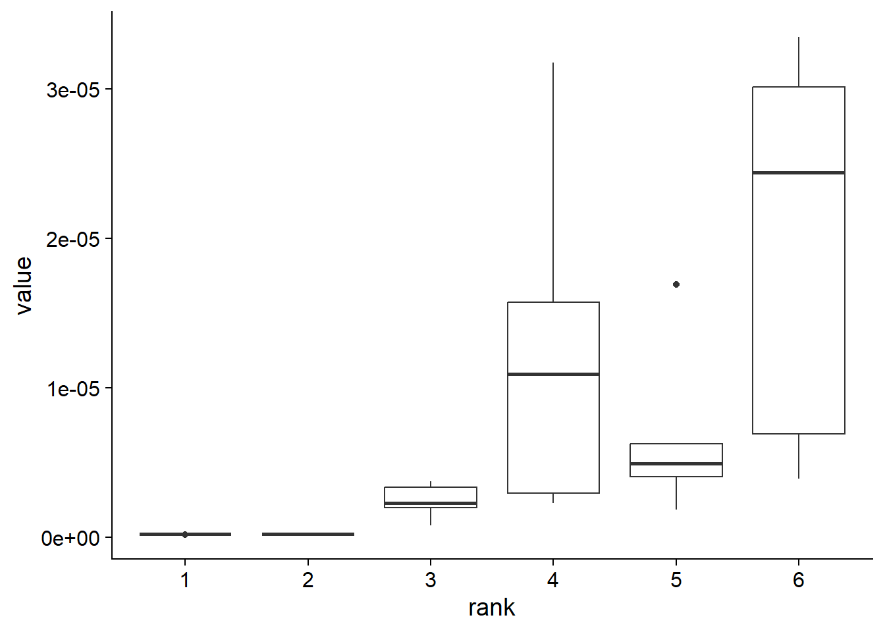
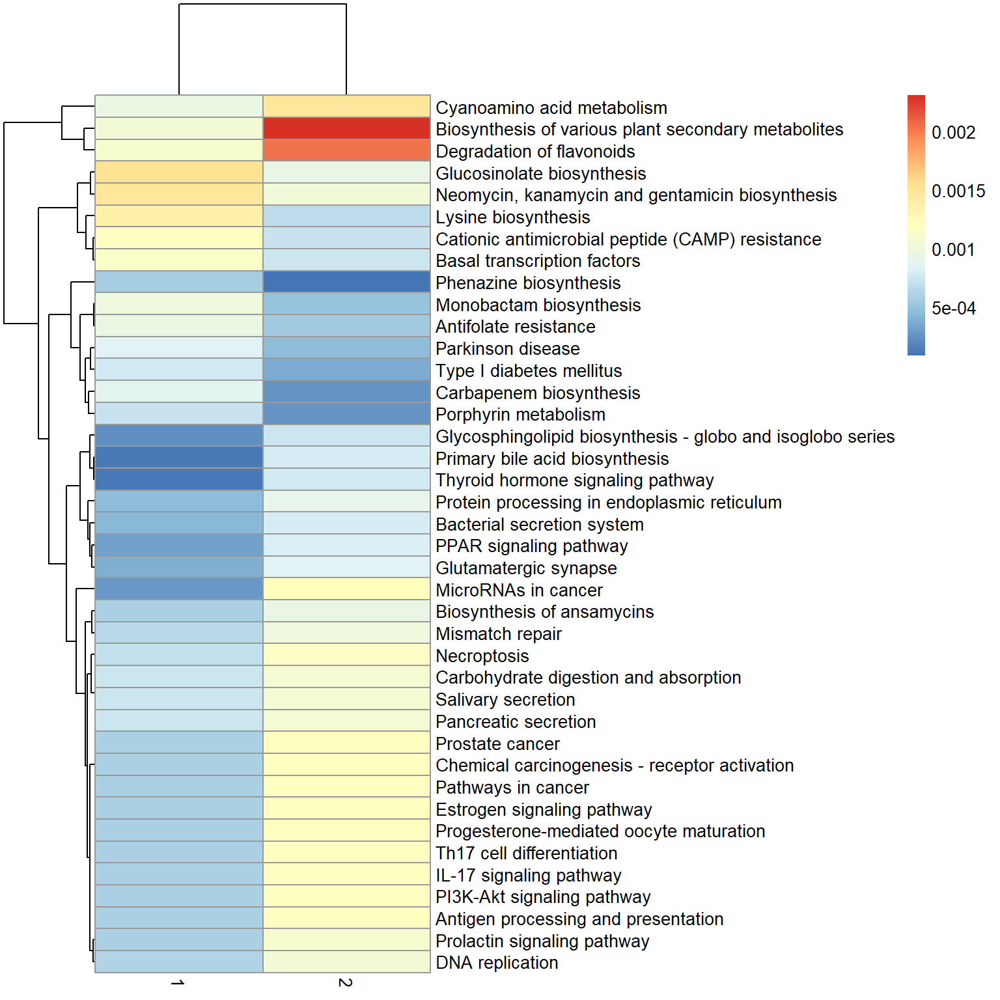
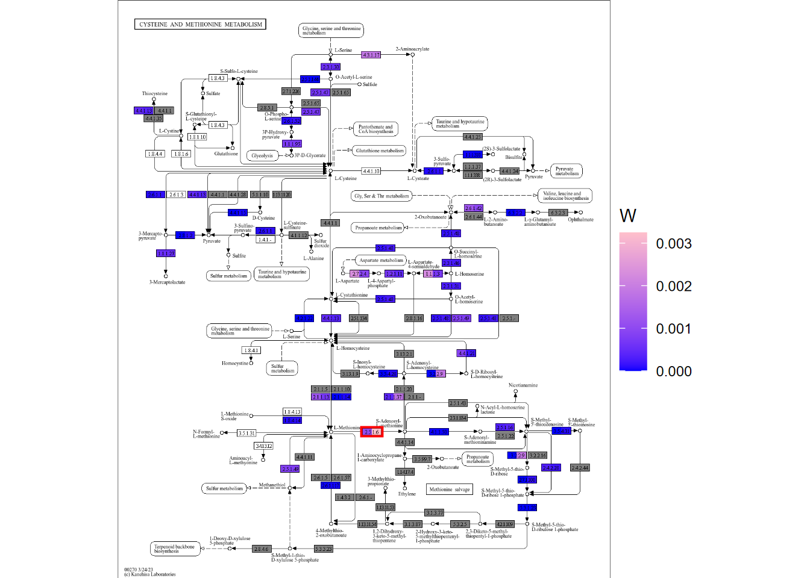
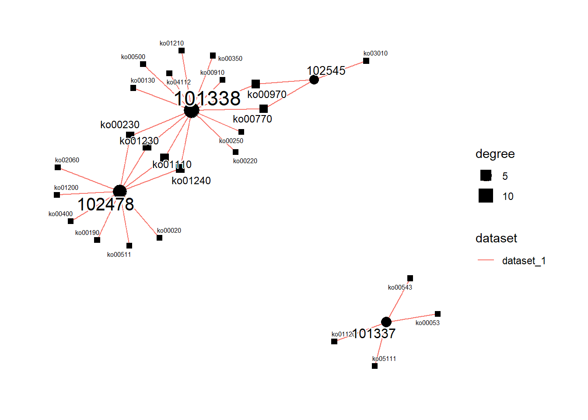

# Analysis example of gut microbiome of ESRD patients

We examine the dataset investigating the gut microbiome of ESRD patients ([Zhang et al. 2023](https://doi.org/10.1186/s13059-023-03056-y)) using `stana`. The SNV was profiled by MIDAS2 pipeline, and loaded to stana object. This time, we investigate one of the profiled species, `Faecalicatena gnavus` genotyping results.

Load the MIDAS2 merge results to stana object with setting the clinical grouping. The used metagenotyping data and metadata is found at [this link](https://w5po.myqnapcloud.com/share.cgi?ssid=9346fc2fc21e4534a9e5181527108cfa#9346fc2fc21e4534a9e5181527108cfa). Also, the Rprof results describing the memory and time usage is available at the same link.


``` r
library(dplyr)
library(stana)

meta <- read.table("../clinical/HDSubset/metadata.tsv", sep="\t", header=1)
hd <- meta$Run %>% setNames(meta$Group)
cl <- split(hd, names(hd))
cl <- lapply(cl, unname)
cand_species <- "101380"
stana <- loadMIDAS2("../clinical/HDSubset", candSp=cand_species, cl=cl, db="uhgg")
#>   101380
#>   g__Faecalicatena;s__Faecalicatena gnavus
#>     Number of snps: 26540
#>     Number of samples: 102
#>   101380
#>   g__Faecalicatena;s__Faecalicatena gnavus
#>     Number of genes: 59925
#>     Number of samples: 124
stana <- changeColors(stana, c("steelblue","gold","tomato"))
stana
#> # A stana: MIDAS2
#> # Database: uhgg
#> # Loaded directory: ../clinical/HDSubset
#> # Species number: 1
#> # Group info (list): CKD/HC/HD
#> # Loaded SNV table: 1 ID: 101380
#> # Loaded gene table: 1 ID: 101380
#> # Size: 108.702024 MB
```
Get a brief overview of SNVs.


``` r
plotSNVInfo(stana, cand_species)
```


``` r
plotSNVSummary(stana, cand_species, perSample=TRUE)
```


Based on the SNV and the related statistics of SNV, the consensus multiple sequence alignment is made by `consensusSeq` function with the relatively stringent parameters. It can be accessed by `getFasta` function.


``` r
stana <- consensusSeq(stana, cand_species, argList=list(site_prev=0.95, mean_depth=10))
#> # Beginning calling for 101380
#> # Original Site number: 26540
#> #  Profiled samples: 102
#> #  Included samples: 75
getFasta(stana)[[cand_species]]
#> 75 sequences with 24157 character and 20999 different site patterns.
#> The states are a c g t
```

Based on the MSA, the phylogenetic tree can be inferred by `inferAndPlotTree`. Inferring function can be specified by `treeFun` and is default to `upgma` function in phangorn, but can be stated the other functions. The tree plot shows the cladogram by default, but can be overridden by `branch.length` argument passed to `ggtree`.


``` r
library(phangorn)
stana <- inferAndPlotTree(stana, cand_species, target="fasta", treeFun="FastTree")
#> # File already exists! Removing the file ...
#> # Tree file already exists! Overwriting ...
getTree(stana)[[cand_species]]
#> 
#> Phylogenetic tree with 75 tips and 73 internal nodes.
#> 
#> Tip labels:
#>   ERR11866308, ERR11869411, ERR11866252, ERR11869407, ERR11869309, ERR11869389, ...
#> Node labels:
#>   , 1.000, 0.983, 1.000, 0.985, 1.000, ...
#> 
#> Unrooted; includes branch lengths.
getTreePlot(stana)[[cand_species]]
```


Using cophenetic distance matrix from tree, the PERMANOVA is performed and the principal coordinate analysis plot based on the distance matrix is plotted.


``` r
stana <- doAdonis(stana, cand_species, target="tree")
#> # Performing adonis in 101380 target is tree
#> #  F: 3.91604401661088, R2: 0.0981070171929171, Pr: 0.008
getAdonis(stana)[[cand_species]]
#> Permutation test for adonis under reduced model
#> Permutation: free
#> Number of permutations: 999
#> 
#> adonis2(formula = d ~ ., data = structure(list(group = c("CKD", "HC", "CKD", "HC", "HD", "HC", "HD", "HD", "CKD", "CKD", "HC", "CKD", "CKD", "HD", "HD", "HC", "HD", "CKD", "CKD", "CKD", "CKD", "HD", "HC", "HD", "HD", "HC", "CKD", "HD", "HD", "CKD", "HD", "HD", "HD", "CKD", "CKD", "HD", "HD", "HD", "HD", "HD", "HD", "HD", "CKD", "CKD", "CKD", "HD", "HC", "HC", "HC", "HD", "CKD", "HD", "HD", "HC", "CKD", "CKD", "HD", "CKD", "CKD", "CKD", "CKD", "HC", "HC", "CKD", "HC", "CKD", "CKD", "CKD", "HC", "HC", 
#>          Df SumOfSqs      R2     F Pr(>F)   
#> Model     2   0.5698 0.09811 3.916  0.008 **
#> Residual 72   5.2383 0.90189                
#> Total    74   5.8081 1.00000                
#> ---
#> Signif. codes:  
#> 0 '***' 0.001 '**' 0.01 '*' 0.05 '.' 0.1 ' ' 1
```

Based on the results, assuming there are multiple factors within the species, we can directly examine their estimated profiles and the functional implications by using the NMF approach in KO table. First we calculate KO copy number based on eggNOG-mapper annotation.


``` r
stana <- setAnnotation(stana,
                       annotList=list("101380"="../annotations_uhgg/101380_eggnog_out.emapper.annotations"))
stana <- calcGF(stana, candSp=cand_species)
```

Subsequently, using the cross-validation approach replacing random variables to `NA`, we estimate the rank based on the KO tables. The function in `NNLM` is used to compute the loss (`mse`) with replacing 30% of the data to `NA`.


``` r
library(NNLM)
cvl <- list()
for (i in seq_len(5)) {
  cvl[[i]] <- NMF(stana, cand_species, nnlm_flag=TRUE,
                  nnlm_args=list("loss"="mse"),
                  estimate=TRUE, tss=TRUE)[1,]
}
#> # NMF started 101380, target: kos, method: NNLM::nnmf
#> # Original features: 2568
#> # Original samples: 124
#> # Original matrix NA: NA
#> # Original matrix zero: 0.487
#> # Performing TSS
#> # Filtered features: 2568
#> # Filtered samples: 124
#> # NNLM flag enabled, the error matrix only will be returned.
#> # NMF started 101380, target: kos, method: NNLM::nnmf
#> # Original features: 2568
#> # Original samples: 124
#> # Original matrix NA: NA
#> # Original matrix zero: 0.487
#> # Performing TSS
#> # Filtered features: 2568
#> # Filtered samples: 124
#> # NNLM flag enabled, the error matrix only will be returned.
#> # NMF started 101380, target: kos, method: NNLM::nnmf
#> # Original features: 2568
#> # Original samples: 124
#> # Original matrix NA: NA
#> # Original matrix zero: 0.487
#> # Performing TSS
#> # Filtered features: 2568
#> # Filtered samples: 124
#> # NNLM flag enabled, the error matrix only will be returned.
#> # NMF started 101380, target: kos, method: NNLM::nnmf
#> # Original features: 2568
#> # Original samples: 124
#> # Original matrix NA: NA
#> # Original matrix zero: 0.487
#> # Performing TSS
#> # Filtered features: 2568
#> # Filtered samples: 124
#> # NNLM flag enabled, the error matrix only will be returned.
#> # NMF started 101380, target: kos, method: NNLM::nnmf
#> # Original features: 2568
#> # Original samples: 124
#> # Original matrix NA: NA
#> # Original matrix zero: 0.487
#> # Performing TSS
#> # Filtered features: 2568
#> # Filtered samples: 124
#> # NNLM flag enabled, the error matrix only will be returned.

do.call(rbind, cvl) %>% data.frame(check.names=FALSE) %>% mutate(group=1:5) %>%
  tidyr::pivot_longer(1:6) %>% ggplot(aes(x=name, y=value))+
  geom_boxplot() + cowplot::theme_cowplot() + xlab("rank")
```



Based on the information, the factor number of two is selected.


``` r
stana <- NMF(stana, cand_species, rank=2,
	nnlm_flag=TRUE, nnlm_args=list("loss"="mse"))
#> # NMF started 101380, target: kos, method: NNLM::nnmf
#> # Original features: 2568
#> # Original samples: 124
#> # Original matrix NA: NA
#> # Original matrix zero: 0.487
#> # Filtered features: 2568
#> # Filtered samples: 124
#> # Rank 2
#> Mean relative abundances: 0.5835186 0.4164814 
#> Present feature per factor: 2239 2378

## Plot the results
plotAbundanceWithinSpecies(stana, cand_species, by="coef")
```


``` r
plotStackedBarPlot(stana, cand_species, by="coef") + scale_fill_manual(values=c("tomato","gold"))
```


Using these two factors, we summarize NMF information to KEGG PATHWAY information, and plot the relationship between the profiles within two factors by scatter plot and heatmap.


``` r
library(ggrepel)
pw <- data.frame(pathwayWithFactor(stana, cand_species,
    change_name=TRUE, mat = Wmat, summarize=mean))
colnames(pw) <- c("1","2")
pw[["name"]] <- row.names(pw)
pw[["size"]] <- (pw[,1] + pw[,2])/2
ggplot(pw, aes(x=pw[,1], y=pw[,2]))+
    geom_point(aes(size=size))+
    geom_text_repel(aes(label=name, size=size), bg.colour="white")+
    geom_smooth(method=lm, se=TRUE)+xlab("1")+ylab("2")+
    cowplot::theme_cowplot()
```


``` r

## Sort by absolute difference
fc <- pw[,1] - pw[,2]
names(fc) <- pw[["name"]]
nms <- names(sort(abs(fc[!is.infinite(fc)]), decreasing=TRUE) %>% head(40))

library(pheatmap)
pheatmap(pw[nms, 1:2])
```



Cysteine and methionine metabolism pathway is interesting as the pathway is reported to be related to the species. The KEGG PATHWAY scheme of the pathway is plotted by ggkegg (For group comparison, use `plotKEGGPathway`. The returned object is ggplot object and the users can modify the visualization by stacking the layers).

The colors in the nodes of left-side is profile for factor 1 and right side is factor 2.


``` r
library(ggkegg)
library(tidygraph)

pp <- ggkegg::pathway("ko00270") %N>% 
    mutate(
    	f1=ggkegg::node_numeric(vis1),
    	f2=ggkegg::node_numeric(vis2)
    )

gg <- ggraph(pp, layout="manual", x=x, y=y)+
    geom_node_rect(aes(fill=f1, xmin=xmin, xmax=x, filter=type=="ortholog"))+
    geom_node_rect(aes(fill=f2, xmin=x, xmax=xmax, filter=type=="ortholog"))+
    scale_fill_gradient(low="blue",high="pink", name="W")+
    overlay_raw_map() +
    stamp("ko:K00789")+
    theme_void()
gg
```



In this map, we can find interesting findings like one of the enzymes AdoMet synthetase (2.5.1.6, indicated in red rectangle), is enriched in the factor 2, and the factor 2 is elevated in HD. The corresponding enzyme is reported to be in relation to the hemodialysis ([Loehrer et al. 1998.](https://doi.org/10.1093/ndt/13.3.656)).

We further examine whether these pathway changes can be attributed to changes in the data obtained from aligning the reads to the representative genome sequences. First we obtain all the KO in the pathway using `ggkegg`.


``` r
library(tidygraph)
library(dplyr)
kos <- ggkegg::pathway("ko00270") %N>%
  filter(type=="ortholog") %>% dplyr::pull(name) %>%
  strsplit(" ") %>% unlist() %>% unique()
```

Add the copy numbers of KOs to the metadata. Note that `how` argument can be specified how to combine the multiple IDs.


``` r
row.names(meta) <- meta$Run
stana <- setMetadata(stana, meta)
stana <- addGeneAbundance(stana, cand_species, IDs=kos, newCol = "gene", how = sum, convert=NULL)
```

Performs the adonis based on metadata, including the pathway abundance and grouping information in model formula.


``` r
set.seed(11)
stana <- doAdonis(stana, cand_species, target="tree",
         useMeta=TRUE,
         formula="d ~ gene + Group")
#> # Performing adonis in 101380 target is tree
#> # Printing raw adonis results ...
#> Permutation test for adonis under reduced model
#> Permutation: free
#> Number of permutations: 999
#> 
#> adonis2(formula = d ~ gene + Group, data = structure(list(Run = c("ERR11866308", "ERR11869411", "ERR11866252", "ERR11869407", "ERR11869309", "ERR11869389", "ERR11869249", "ERR11869021", "ERR11866391", "ERR11866506", "ERR11869428", "ERR11865921", "ERR11866099", "ERR11869026", "ERR11869362", "ERR11870913", "ERR11869188", "ERR11866124", "ERR11865952", "ERR11865925", "ERR11868983", "ERR11869379", "ERR11869391", "ERR11869266", "ERR11869293", "ERR11869451", "ERR11866385", "ERR11869342", "ERR11869285", 
#>          Df SumOfSqs      R2      F Pr(>F)   
#> Model     3   0.7681 0.13224 3.6066  0.004 **
#> Residual 71   5.0400 0.86776                 
#> Total    74   5.8081 1.00000                 
#> ---
#> Signif. codes:  
#> 0 '***' 0.001 '**' 0.01 '*' 0.05 '.' 0.1 ' ' 1
```

The results suggest the abundances of the pathway and the distance based on phylogenetic inferred from MAF matrix could be related and worth investigating for the experimental validation. This analysis suggests the library and function can link the intra-species diversity and clinical factors in the R environment.

The other species information is also interesting and here we load the other five species. With the HD or other binary grouping information.


``` r
meta <- read.table("../clinical/HDSubset/metadata.tsv", sep="\t", header=1)
hd <- meta$Run %>% setNames(meta$HDorNot)
cl <- split(hd, names(hd))
cl <- lapply(cl, unname)
cands <- c("102545","101380","101338","102478","101337")
stana <- loadMIDAS2("../clinical/HDSubset", candSp=cands, cl=cl, db="uhgg")
#>   101337
#>   g__Bacteroides;s__Bacteroides fragilis
#>     Number of snps: 24483
#>     Number of samples: 83
#>   101338
#>   g__Blautia_A;s__Blautia_A wexlerae
#>     Number of snps: 24297
#>     Number of samples: 162
#>   101380
#>   g__Faecalicatena;s__Faecalicatena gnavus
#>     Number of snps: 26540
#>     Number of samples: 102
#>   102478
#>   g__Bacteroides_B;s__Bacteroides_B dorei
#>     Number of snps: 77057
#>     Number of samples: 216
#>   102545
#>   g__Faecalibacterium;s__Faecalibacterium prausnitzii_G
#>     Number of snps: 9443
#>     Number of samples: 111
#>   101337
#>   g__Bacteroides;s__Bacteroides fragilis
#>     Number of genes: 56742
#>     Number of samples: 94
#>   101338
#>   g__Blautia_A;s__Blautia_A wexlerae
#>     Number of genes: 138535
#>     Number of samples: 197
#>   101380
#>   g__Faecalicatena;s__Faecalicatena gnavus
#>     Number of genes: 59925
#>     Number of samples: 124
#>   102478
#>   g__Bacteroides_B;s__Bacteroides_B dorei
#>     Number of genes: 244846
#>     Number of samples: 230
#>   102545
#>   g__Faecalibacterium;s__Faecalibacterium prausnitzii_G
#>     Number of genes: 75257
#>     Number of samples: 137
stana
#> # A stana: MIDAS2
#> # Database: uhgg
#> # Loaded directory: ../clinical/HDSubset
#> # Species number: 5
#> # Group info (list): False/True
#> # Loaded SNV table: 5 ID: 101337
#> # Loaded gene table: 5 ID: 101337
#> # Size: 1287.10924 MB
```


Subsequently, we perform GSEA on all the species by `doGSEA` function.


```r
## Set annotation for genes to KOs
stana <- setAnnotation(stana,
                       annotList=list("102545"="../annotations_uhgg/102545_eggnog_out.emapper.annotations",
                                      "101380"="../annotations_uhgg/101380_eggnog_out.emapper.annotations",
                                      "101338"="../annotations_uhgg/101338_eggnog_out.emapper.annotations",
                                      "102478"="../annotations_uhgg/102478_eggnog_out.emapper.annotations",
                                      "101337"="../annotations_uhgg/101337_eggnog_out.emapper.annotations"))
library(clusterProfiler)
for (cs in cands) {
  cat(cs, "\n")
  stana <- doGSEA(stana, candSp=cs)
}
#> 102545 
#> False / True 
#> KO abundance not found, calculating based on annotation ...
#> 101380 
#> False / True 
#> KO abundance not found, calculating based on annotation ...
#> 101338 
#> False / True 
#> KO abundance not found, calculating based on annotation ...
#> 102478 
#> False / True 
#> KO abundance not found, calculating based on annotation ...
#> 101337 
#> False / True 
#> KO abundance not found, calculating based on annotation ...
```

plot the result for inter-species differences with statistically significant pathways.


``` r
plotGSEA(stana, padjThreshold=0.1)
```



Finally, the results can be exported to the interactive inspection by `exportInteractive` function for the sharing the findings with the other researchers.


``` r
exportInteractive(stana, notRun=TRUE)
#> # No tree for 101337
#> # No tree for 101338
#> # No tree for 101380
#> # No tree for 102478
#> # No tree for 102545
#> # Tree number: 0 KO (or gene) number: 5
#> # Exporting ...
#> # A stana: MIDAS2
#> # Database: uhgg
#> # Loaded directory: ../clinical/HDSubset
#> # Species number: 5
#> # Group info (list): False/True
#> # Group column (DF): label/group
#> # Loaded KO table: 5 ID: 102545
#> # Size: 146.094192 MB
```
