# Basic usage

Load the package and the database for converting identifiers.
In this example, we use mostly human-derived data, and use `org.Hs.eg.db`.


```r
library(wcGeneSummary)
library(org.Hs.eg.db)
library(ggplot2)
library(ggraph)
library(RColorBrewer)
library(ReactomePA)
library(clusterProfiler)
library(dendextend)
library(dplyr)
load(system.file("extdata", "sysdata.rda", package = "wcGeneSummary"))
```

## Producing word clouds

We use ERCC genes as input. The basic usage of the package is producing a word cloud of gene summaries by querying gene IDs, default to symbol. The other type can be set by `keyType`. As many of the words are commonly observed, you should limit word frequency by `excludeFreq`, which is default to 2000. TF-IDF on the all the summary is precomputed, and `exclude="tfidf"` can be specified too.


```r
## Configure input genes
inpSymbol <- c("ERCC1","ERCC2","ERCC3","ERCC4","ERCC5","ERCC6","ERCC8")
gwc <- wcGeneSummary(inpSymbol)
#> Input genes: 7
#>   Converted input genes: 7
#> Filter based on GeneSummary
#> Filtered 65 words (frequency and/or tfidf)
gwc@wc
```

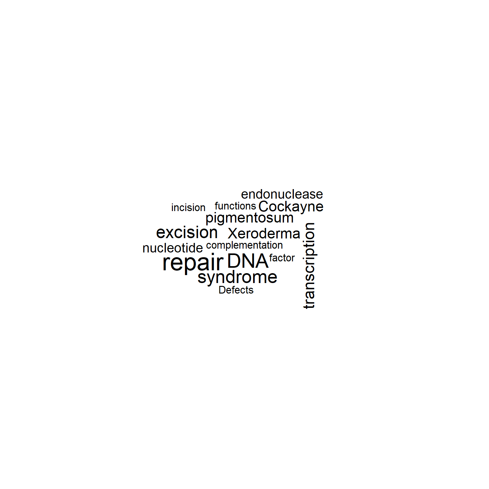

It accepts values of the `wordcloud()` function. `numWords` specifies how many words are to be shown on word cloud. The words are ordered by their frequency, and the subset of 1:`numWords` is used to downstream visualization. The values must be passed to `argList` arguments as a list.


```r
## Use palette from palettetown, palettetown::pokepal(150) (Mewtwo!)
gwc <- wcGeneSummary(inpSymbol,
                     numWords=100,
                     excludeFreq=5000,
                     argList=list(
                      "random.order"=FALSE,
                     "colors"=palette(),
                     "rot.per"=0.4))
#> Input genes: 7
#>   Converted input genes: 7
#> Filter based on GeneSummary
#> Filtered 14 words (frequency and/or tfidf)
gwc@wc
```


By default, `preserve=TRUE`, which indicates the funciton tries to preserve the original cases of characters. Note that if both the lower case words and capitalized words are present, all words are converted to capitalized words, like `damage` and `Damage` would be shown as `Damage` if `preserve=TRUE`.


```r
gwc_p <- wcGeneSummary(inpSymbol, 
                     numWords=100,
                     excludeFreq=5000,
                     preserve=FALSE,
                     argList=list(
                       rot.per=0.4,
                       colors=RColorBrewer::brewer.pal(8, "Set2"),
                       random.order=FALSE
                     ))
#> Input genes: 7
#>   Converted input genes: 7
#> Filter based on GeneSummary
#> Filtered 14 words (frequency and/or tfidf)
gwc_p@wc
```

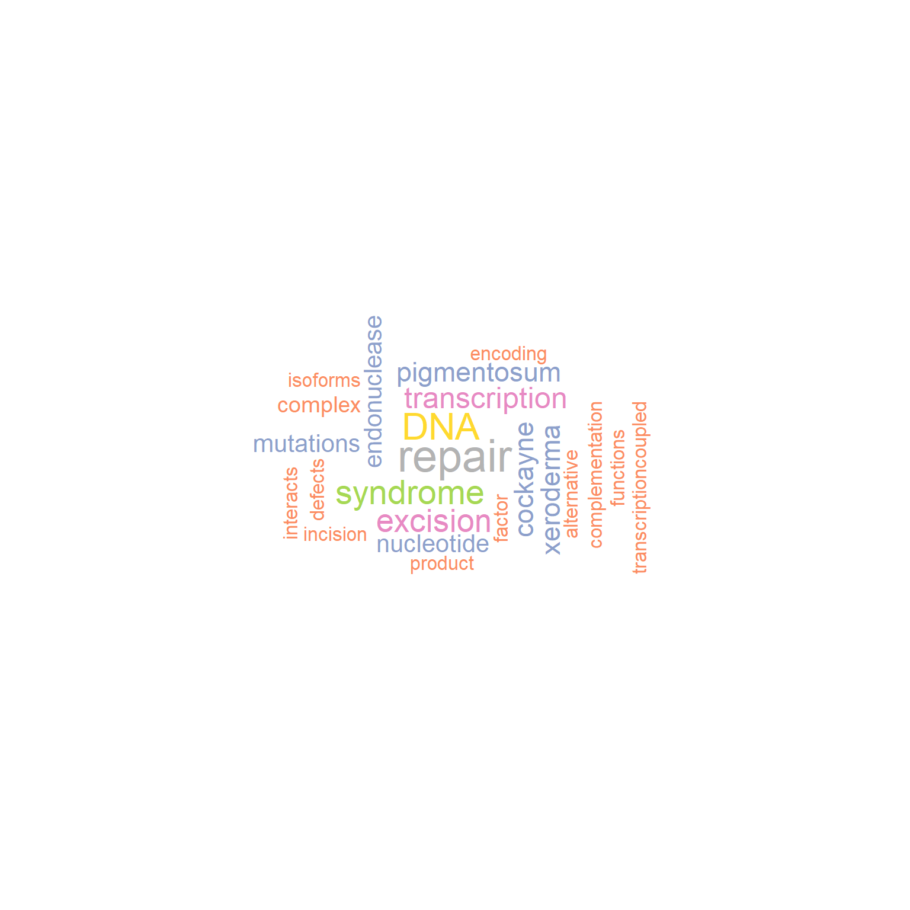

It also returns a data frame consisting of frequency of each term in the slot name `freqDf`.


```r
gwc
#> Type: refseq
#> Number of words: 100
#> ERCC1/ERCC2/ERCC3/ERCC4/ERCC5/ERCC6/ERCC8
#> 201.6 Kb
knitr::kable(
  head(gwc@freqDf), caption = 'Term frequencies.',
  row.names = FALSE
)
```


Table: (\#tab:table)Term frequencies.

|word          | freq|
|:-------------|----:|
|repair        |   16|
|DNA           |   11|
|syndrome      |    9|
|excision      |    8|
|transcription |    7|
|Cockayne      |    6|

N-gram is supported by library `tm`, specified by `ngram`.
Default is `1`, and the example specifying `2` is shown below.


```r
gwc2 <- wcGeneSummary(inpSymbol,
                      ngram=2,
                      numWords=50)
#> Input genes: 7
#> 'select()' returned 1:1 mapping between keys and
#> columns
#>   Converted input genes: 7
#> Filter based on GeneSummary
#> Filtered 65 words (frequency and/or tfidf)
#> Scale for size is already present.
#> Adding another scale for size, which will replace the
#> existing scale.
gwc2@wc
```


Using `clusterProfiler` functions, one can use enriched pathway names for visualization.
The `enrich` option can be specified for `'kegg'` or `'reactome'`, this time we specify `'reactome'`.


```r
gwc3 <- wcGeneSummary(inpSymbol,
                      enrich="reactome",
                      tfidf=TRUE, numWords=50)
#> Input genes: 7
#> 'select()' returned 1:1 mapping between keys and
#> columns
#>   Converted input genes: 7
#> Filter based on GeneSummary
#> Filtered 65 words (frequency and/or tfidf)
#> Performing enrichment analysis
#> Scale for size is already present.
#> Adding another scale for size, which will replace the
#> existing scale.
gwc3@wc
```


One of the main questions is which words can be clustered together among the words contained in the queried gene cluster. Word clustering (`pvclust`) and identified significant clusters based on the occurrence in the text can be visualized by specifying `tag=TRUE`. For the significance threshold, `pvclAlpha` can be specified. The default parameters perform `pvclust` on the subset of dataset for words with high frequency specified by `numWords`. If one want to perform on whole matrix (which is a natural way), `tagWhole=TRUE` can be specified, although it is computationally intensive. One can pass clusters to perform parallel computing owning to `pvclust` function, by specifying `cl` as below.


```r

pal <- RColorBrewer::brewer.pal(4, "PuOr") 
pal <- colorRampPalette(pal)(20)


## Cluster on subset of words
gwcl <- wcGeneSummary(inpSymbol,
                     numWords=30,
                     tag=TRUE,
                     pal = pal,
                     argList=list(rot.per=0.4))
#> Input genes: 7
#> 'select()' returned 1:1 mapping between keys and
#> columns
#>   Converted input genes: 7
#> Filter based on GeneSummary
#> Filtered 65 words (frequency and/or tfidf)
#> Bootstrap (r = 0.5)... Done.
#> Bootstrap (r = 0.6)... Done.
#> Bootstrap (r = 0.7)... Done.
#> Bootstrap (r = 0.8)... Done.
#> Bootstrap (r = 0.9)... Done.
#> Bootstrap (r = 1.0)... Done.
#> Bootstrap (r = 1.1)... Done.
#> Bootstrap (r = 1.2)... Done.
#> Bootstrap (r = 1.3)... Done.
#> Bootstrap (r = 1.4)... Done.
#> Scale for size is already present.
#> Adding another scale for size, which will replace the
#> existing scale.
gwcl@wc
```

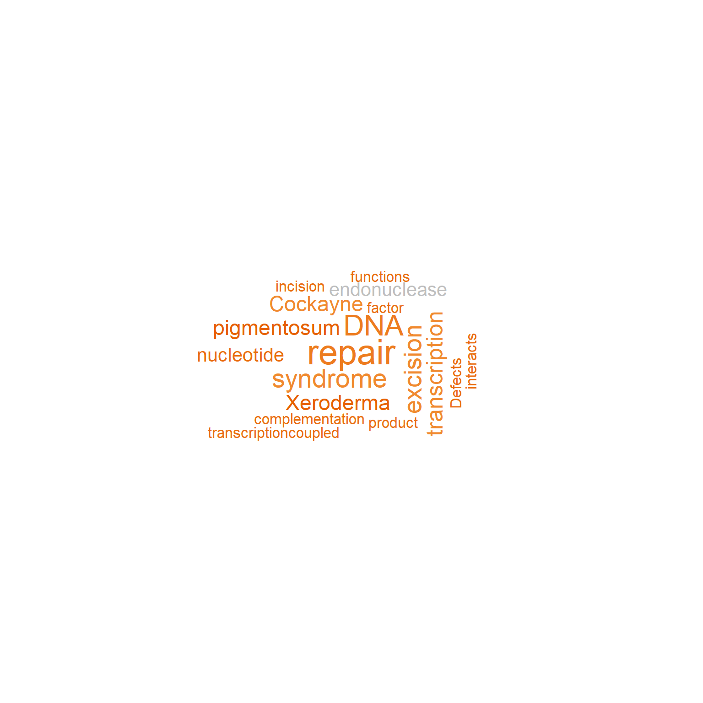

```r
gwcl@pvpick
#> $clusters
#> $clusters[[1]]
#> [1] "pigmentosum" "xeroderma"  
#> 
#> $clusters[[2]]
#>  [1] "activity"                  "atpdependent"             
#>  [3] "basal"                     "cerebrooculofacioskeletal"
#>  [5] "characterized"             "complementation"          
#>  [7] "damage"                    "defects"                  
#>  [9] "exon"                      "factor"                   
#> [11] "forms"                     "functions"                
#> [13] "helicase"                  "heterodimeric"            
#> [15] "incision"                  "including"                
#> [17] "interacts"                 "light"                    
#> [19] "nucleotide"                "product"                  
#> [21] "transcriptioncoupled"     
#> 
#> $clusters[[3]]
#> [1] "dna"    "repair"
#> 
#> $clusters[[4]]
#> [1] "cockayne"      "excision"      "syndrome"     
#> [4] "transcription"
#> 
#> 
#> $edges
#> [1]  6 22 23 25

## Cluster on whole matrix

gwclWhole <- wcGeneSummary(inpSymbol,
                     numWords=50,
                     tag=TRUE, tagWhole=TRUE,
                     pal = pal,
                     cl=snow::makeCluster(8),
                     argList=list(rot.per=0.4))
#> Input genes: 7
#> 'select()' returned 1:1 mapping between keys and
#> columns
#>   Converted input genes: 7
#> Filter based on GeneSummary
#> Filtered 65 words (frequency and/or tfidf)
#> Multiscale bootstrap... Done.
#> Scale for size is already present.
#> Adding another scale for size, which will replace the
#> existing scale.
gwclWhole@wc
```

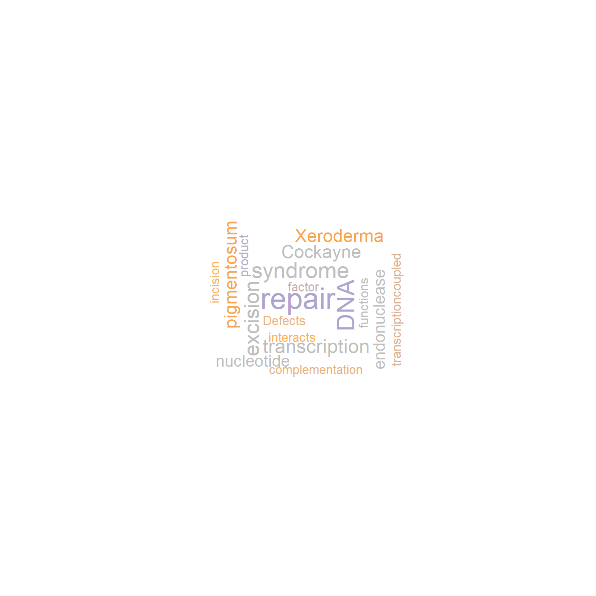

```r
gwclWhole@pvpick
#> $clusters
#> $clusters[[1]]
#>  [1] "abnormally"        "active"           
#>  [3] "csb"               "defective"        
#>  [5] "disease"           "hereditary"       
#>  [7] "identified"        "iih"              
#>  [9] "p44"               "radiation"        
#> [11] "repeat"            "sensitive"        
#> [13] "transcriptionally" "ultraviolet"      
#> 
#> $clusters[[2]]
#>  [1] "activates"       "adjacent"        "atpase"         
#>  [4] "atpstimulated"   "dnabinding"      "downstream"     
#>  [7] "encode"          "formation"       "frame"          
#> [10] "fusion"          "individual"      "occurs"         
#> [13] "polyadenylation" "promote"         "reading"        
#> [16] "sequence"        "shares"          "sites"          
#> 
#> $clusters[[3]]
#> [1] "class" "tfiih"
#> 
#> $clusters[[4]]
#> [1] "eme1"      "ercc1"     "structure" "xp6"      
#> 
#> $clusters[[5]]
#> [1] "orf"               "piggybackderived3"
#> [3] "splice"           
#> 
#> $clusters[[6]]
#> [1] "pigmentosum" "xeroderma"  
#> 
#> $clusters[[7]]
#> [1] "interacts" "type"     
#> 
#> $clusters[[8]]
#> [1] "incision"  "including" "light"    
#> 
#> $clusters[[9]]
#> [1] "complementation" "damage"          "defects"        
#> 
#> $clusters[[10]]
#> [1] "transcriptioncoupled" "upstream"            
#> 
#> $clusters[[11]]
#>  [1] "basic"            "bivm"            
#>  [3] "cachexia"         "cancer"          
#>  [5] "cellular"         "characterized"   
#>  [7] "cognitive"        "develop"         
#>  [9] "development"      "disability"      
#> [11] "disorder"         "exists"          
#> [13] "exposure"         "function"        
#> [15] "growth"           "hypersensitivity"
#> [17] "immunoglobulin"   "increased"       
#> [19] "motif"            "neighboring"     
#> [21] "patients"         "processes"       
#> [23] "read"             "referred"        
#> [25] "severe"           "singlestrand"    
#> [27] "skin"             "specific"        
#> [29] "susceptibility"   "uvinduced"       
#> [31] "variable"         "vii"             
#> [33] "xp7"             
#> 
#> $clusters[[12]]
#>  [1] "atpdependent"        "basal"              
#>  [3] "belongs"             "btf2tfiih"          
#>  [5] "cancerprone"         "disorders"          
#>  [7] "factor"              "helicase"           
#>  [9] "helicases"           "integral"           
#> [11] "mechanism"           "rad3xpd"            
#> [13] "subfamily"           "trichothiodystrophy"
#> 
#> $clusters[[13]]
#>  [1] "alter"                     "carcinogenesis"           
#>  [3] "catalyzes"                 "cd3e"                     
#>  [5] "cerebrooculofacioskeletal" "cisplatin"                
#>  [7] "compounds"                 "crosslinks"               
#>  [9] "electrophilic"             "epsilon"                  
#> [11] "ercc4"                     "excising"                 
#> [13] "exon"                      "formed"                   
#> [15] "forms"                     "heterodimer"              
#> [17] "heterodimeric"             "induced"                  
#> [19] "interstrand"               "lesion"                   
#> [21] "lesions"                   "molecule"                 
#> [23] "overlaps"                  "pathway"                  
#> [25] "play"                      "polymorphisms"            
#> [27] "process"                   "product"                  
#> [29] "recombinational"           "required"                 
#> [31] "result"                    "strand"                   
#> [33] "xpf"                      
#> 
#> $clusters[[14]]
#> [1] "dna"    "repair"
#> 
#> 
#> $edges
#>  [1]  13  30  97 101 104 106 107 110 114 117 118 119 124 130
```

In this example showing ERCC genes, the term `DNA repair` is clustered as expected.

## Producing correlation networks

The next main function is producing correlation networks between words based on the co-occurrence of the words in the text.


```r
net <- wcGeneSummary(inpSymbol, plotType="network")
#> Input genes: 7
#>   Converted input genes: 7
#> Filter based on GeneSummary
#> Filtered 65 words (frequency and/or tfidf)
net@net
```


Changing the layout.


```r
net <- wcGeneSummary(inpSymbol, plotType="network", layout="kk")
#> Input genes: 7
#>   Converted input genes: 7
#> Filter based on GeneSummary
#> Filtered 65 words (frequency and/or tfidf)
net@net
```

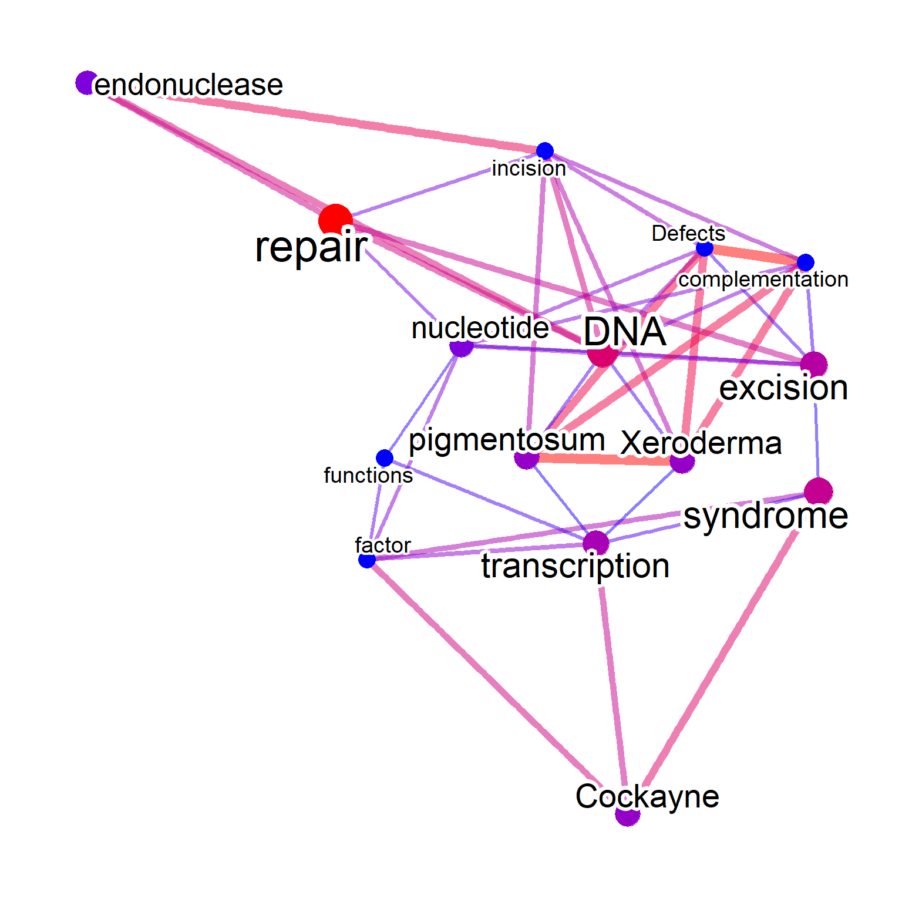

The edge label corresponding to correlation values can be shown by `edgeLabel=TRUE`. The number of words to be shown on plot can be specified by `numWords`. The threshold of correlation can be specified by `corThresh`. The text color can be changed by `colorText=TRUE`. The type of edge can be specified by `edgeLink`, which is by default `TRUE` (link will be used).


```r
net <- wcGeneSummary(inpSymbol, plotType="network",
                     edgeLabel=TRUE, corThresh=0.5,
                     numWords=20, colorText=TRUE)
#> Input genes: 7
#>   Converted input genes: 7
#> Filter based on GeneSummary
#> Filtered 65 words (frequency and/or tfidf)
net@net
```


The clustering results based on `pvclust` can be shown also on the correlation network, by the node color (`tag=TRUE`). We can plot `igraph` object as well, using basic `plot` function implemented.


```r
net <- wcGeneSummary(inpSymbol, plotType="network", corThresh=0.2,
                     numWords=20, tag=TRUE)
#> Input genes: 7
#>   Converted input genes: 7
#> Filter based on GeneSummary
#> Filtered 65 words (frequency and/or tfidf)
#> Bootstrap (r = 0.5)... Done.
#> Bootstrap (r = 0.6)... Done.
#> Bootstrap (r = 0.7)... Done.
#> Bootstrap (r = 0.8)... Done.
#> Bootstrap (r = 0.9)... Done.
#> Bootstrap (r = 1.0)... Done.
#> Bootstrap (r = 1.1)... Done.
#> Bootstrap (r = 1.2)... Done.
#> Bootstrap (r = 1.3)... Done.
#> Bootstrap (r = 1.4)... Done.
net@net
```


```r
net@pvpick
#> $clusters
#> $clusters[[1]]
#> [1] "pigmentosum" "xeroderma"  
#> 
#> $clusters[[2]]
#>  [1] "activity"             "atpdependent"        
#>  [3] "complementation"      "defects"             
#>  [5] "factor"               "functions"           
#>  [7] "incision"             "interacts"           
#>  [9] "nucleotide"           "product"             
#> [11] "transcriptioncoupled"
#> 
#> $clusters[[3]]
#> [1] "dna"    "repair"
#> 
#> 
#> $edges
#> [1]  2 12 13
plot(net)
```

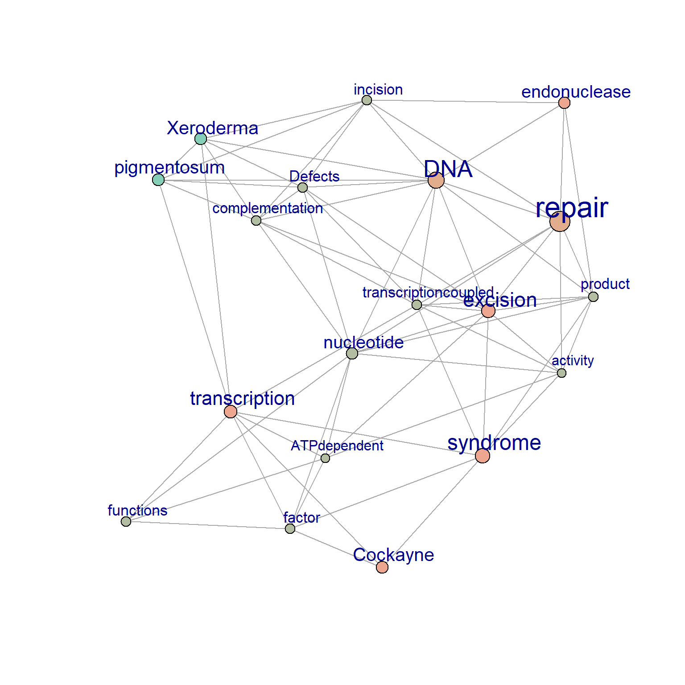

The genes associated with the corresponding words can be shown by specifying `genePlot=TRUE`, useful for assessing which words is associated with interesting genes. The edges connecting words to corresponding genes are shown.
Additionally, one can specify `genePlotNum` for limiting the genes shown, which can be useful for identifying important genes associated with high-frequent words.


```r
net <- wcGeneSummary(inpSymbol, plotType="network",
                     genePlot=TRUE, corThresh=0.5,
                     tag=TRUE, edgeLink=FALSE,
                     numWords=20)
#> Input genes: 7
#>   Converted input genes: 7
#> Filter based on GeneSummary
#> Filtered 65 words (frequency and/or tfidf)
#> Bootstrap (r = 0.5)... Done.
#> Bootstrap (r = 0.6)... Done.
#> Bootstrap (r = 0.7)... Done.
#> Bootstrap (r = 0.8)... Done.
#> Bootstrap (r = 0.9)... Done.
#> Bootstrap (r = 1.0)... Done.
#> Bootstrap (r = 1.1)... Done.
#> Bootstrap (r = 1.2)... Done.
#> Bootstrap (r = 1.3)... Done.
#> Bootstrap (r = 1.4)... Done.
net@net
```


By default, the associated genes are plotted without colorization (grey). If preferred, set `colorize=TRUE` to colorize the associated genes by `geneColor`. In this way, color of nodes of words are shown by the gradient of frequency, independent of color of associated gene symbols.


```r
net <- wcGeneSummary(inpSymbol, plotType="network",
                     genePlot=TRUE, corThresh=0.5,
                     colorize=TRUE, geneColor="pink",
                     colorText=TRUE,
                     tag=TRUE, edgeLink=FALSE,
                     numWords=20)
#> Input genes: 7
#>   Converted input genes: 7
#> Filter based on GeneSummary
#> Filtered 65 words (frequency and/or tfidf)
#> Bootstrap (r = 0.5)... Done.
#> Bootstrap (r = 0.6)... Done.
#> Bootstrap (r = 0.7)... Done.
#> Bootstrap (r = 0.8)... Done.
#> Bootstrap (r = 0.9)... Done.
#> Bootstrap (r = 1.0)... Done.
#> Bootstrap (r = 1.1)... Done.
#> Bootstrap (r = 1.2)... Done.
#> Bootstrap (r = 1.3)... Done.
#> Bootstrap (r = 1.4)... Done.
net@net
```

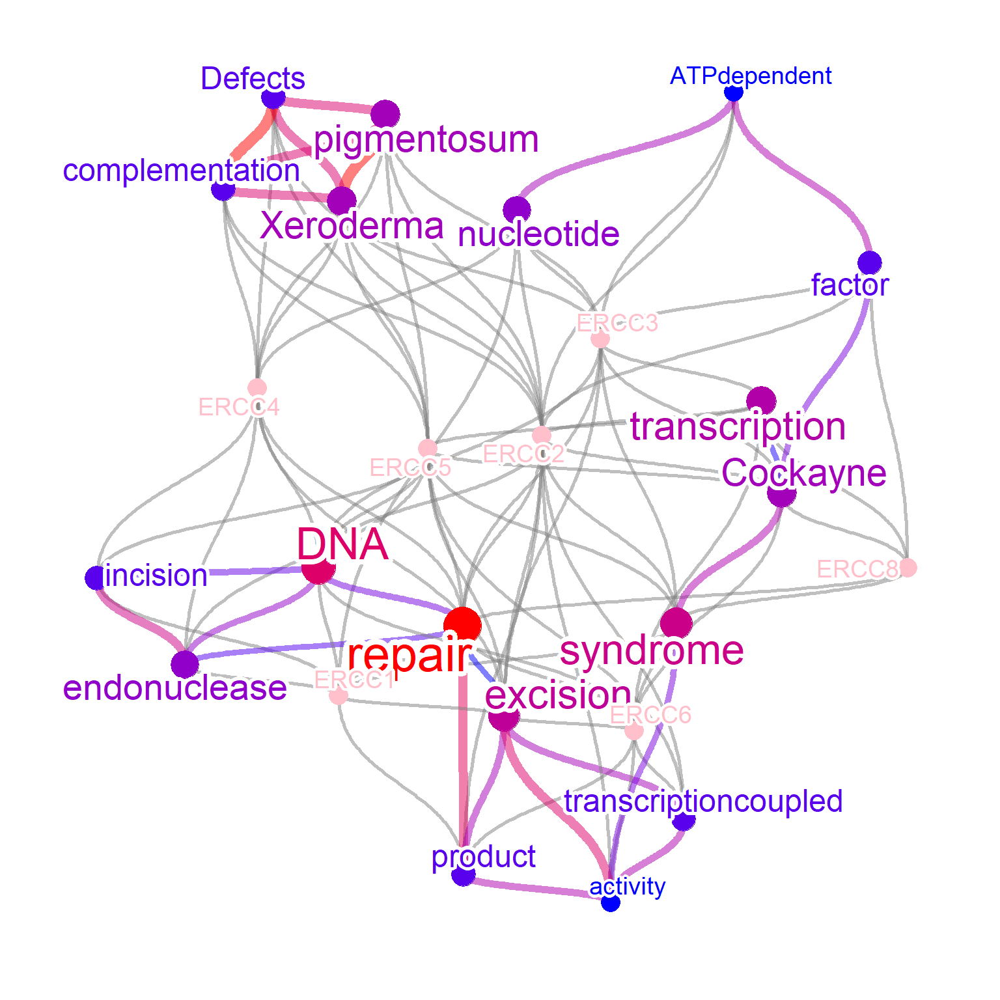


The associated enriched pathways (if present) can be shown by specifying `genePathPlot`, using `ggforce`.
In this option, the function first performs over-representation analysis on the whole gene set, and plot enriched terms for included genes in the plot. Enrichment analysis here is performed by the library `clusterProfiler` or `ReactomePA`, and one can control which pathways to plot by `genePathPlotSig` value.


```r
library(concaveman)
library(ggforce)
net <- wcGeneSummary(inpSymbol, plotType="network",
                     genePathPlot="reactome", corThresh=0.5,
                     tag=TRUE, edgeLink=FALSE,
                     genePathPlotSig=0.05, numWords=20)
#> Input genes: 7
#>   Converted input genes: 7
#> Filter based on GeneSummary
#> Filtered 65 words (frequency and/or tfidf)
#> Bootstrap (r = 0.5)... Done.
#> Bootstrap (r = 0.6)... Done.
#> Bootstrap (r = 0.7)... Done.
#> Bootstrap (r = 0.8)... Done.
#> Bootstrap (r = 0.9)... Done.
#> Bootstrap (r = 1.0)... Done.
#> Bootstrap (r = 1.1)... Done.
#> Bootstrap (r = 1.2)... Done.
#> Bootstrap (r = 1.3)... Done.
#> Bootstrap (r = 1.4)... Done.
#> Found 47 enriched term

net@net
```


## Visualization of PubMed information.

Using `rentrez`, one can perform the same analysis on PubMed text like the article title and abstract. The function queries for the input gene symbols (or microbes) and visualize. For typical use cases, the genes identified by showing `genePlot`, or hub genes identified in gene network analysis can be queried. The basic parameters for searching PubMed, like max number of articles retrieved and how to sort the articles can be specified by `retMax` and `sortOrder`. Be sure to obtain [an api key](https://ncbiinsights.ncbi.nlm.nih.gov/2017/11/02/new-api-keys-for-the-e-utilities/) when querying heavily, and specify in `apiKey` argument.
 

```r
ab <- wcAbst(inpSymbol[1:3], retMax=20, apiKey=apiKey)
#> Scale for size is already present.
#> Adding another scale for size, which will replace the
#> existing scale.
ab@wc
```


The returned PubMed IDs are stored in `pmids` slot.


```r
ab@pmids
#>  [1] "20301571" "27051024" "27838878" "31077069" "34284736"
#>  [6] "32749109" "23593158" "24023723" "21278243" "16835333"
#> [11] "28088319" "25867436" "27051038" "25674148" "28803404"
#> [16] "30847299" "33125943" "28474168" "8053936"  "26400354"
ab@pmids |> length()
#> [1] 20
```

As fetching the same information is not desirable and time consuming, the same object can be passed to `redo` option and re-perform the analysis like tagging, or changing the visualization options.


```r
pal <- brewer.pal(5, "PuOr") 
abtag <- wcAbst(redo=ab, tag=TRUE,
                cl=snow::makeCluster(10), pal=pal, apiKey=apiKey)
#> Resuming from the previous results
#> Multiscale bootstrap... Done.
#> Scale for size is already present.
#> Adding another scale for size, which will replace the
#> existing scale.
abtag2 <- wcAbst(redo=abtag, tag=TRUE, genePlot=TRUE,
                 plotType="network", corThresh=0.2, pre=TRUE, apiKey=apiKey)
#> Resuming from the previous results
#> Using previous pvclust results
abtag@wc
```

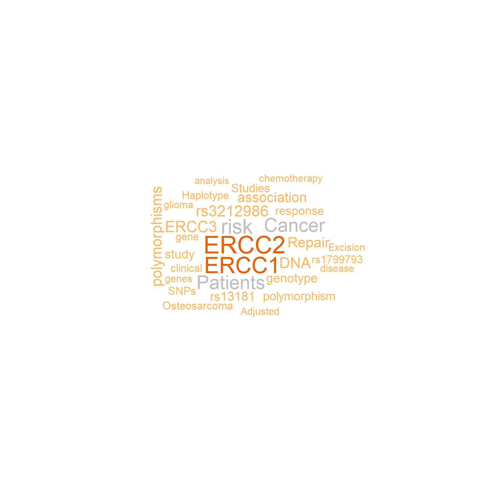

```r
abtag2@net
#> Warning: Removed 3 rows containing missing values
#> (`geom_point()`).
```

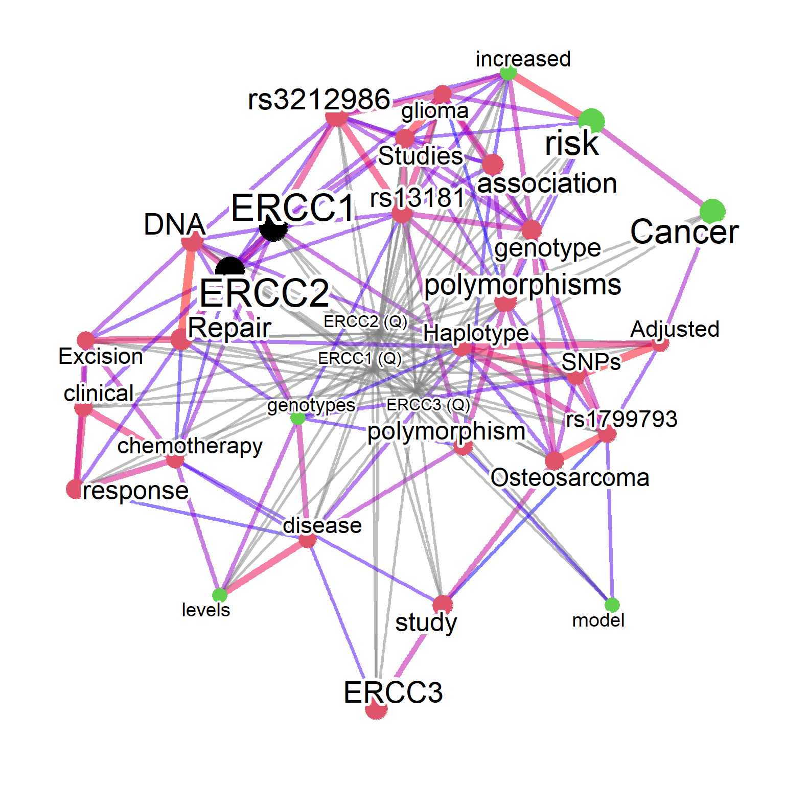

If only the gene symbols are to be plotted, specify `onlyGene=TRUE`.


```r
net <- wcAbst(inpSymbol[1:5], plotType="network", onlyGene=TRUE, apiKey=apiKey)
#> Subsetting to the gene symbol in orgDb
net@net
```

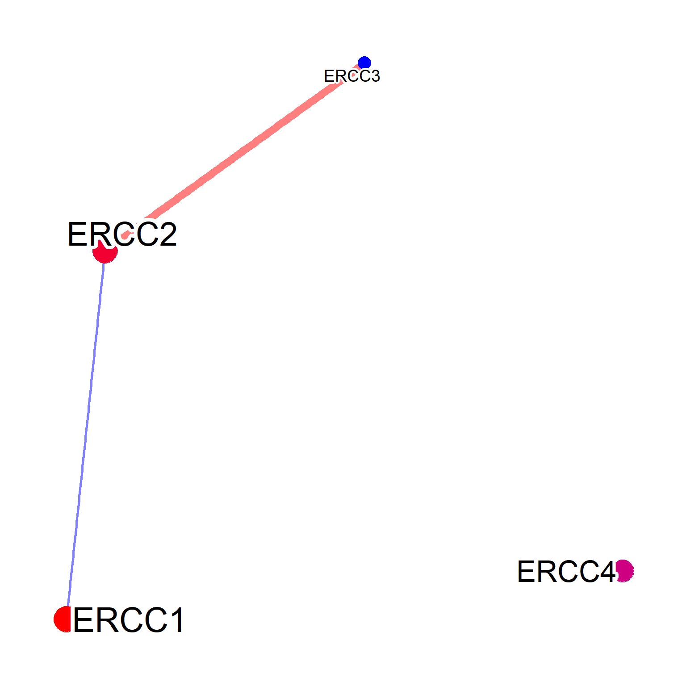

## Comparing two or more networks

One can compare two or more networks by providing list of objects produced by wc* functions, like `wcGeneSummary` and `wcAbst`. This can be useful for assessing the similarity and dissimilarity of the various text sources, like PubMed, RefSeq, and Reactome pathway names.


```r
cxcls <- c()
for (i in c(1,2,3,5,6,8,9,10,11,12,13,14,16)){
    cxcls <- c(cxcls, paste0("CXCL",i))
}

net1 <- wcGeneSummary(inpSymbol, plotType="network",
                      corThresh=0.5, numWords=20)
#> Input genes: 7
#> 'select()' returned 1:1 mapping between keys and
#> columns
#>   Converted input genes: 7
#> Filter based on GeneSummary
#> Filtered 65 words (frequency and/or tfidf)
net2 <- wcGeneSummary(cxcls, plotType="network",
                      corThresh=0.5, numWords=20)
#> Input genes: 13
#> 'select()' returned 1:1 mapping between keys and
#> columns
#>   Converted input genes: 13
#> Filter based on GeneSummary
#> Filtered 65 words (frequency and/or tfidf)
net3 <- wcAbst(redo=ab, plotType="network",
               corThresh=0.2, numWords=20)
#> Resuming from the previous results

## Not having meaningful overlaps
compareWordNet(list(net1, net2),
               titles=c("ercc","cxcl"))
#> Warning in grid.Call(C_stringMetric,
#> as.graphicsAnnot(x$label)): font family not found in Windows
#> font database

#> Warning in grid.Call(C_stringMetric,
#> as.graphicsAnnot(x$label)): font family not found in Windows
#> font database
#> Warning in grid.Call(C_textBounds,
#> as.graphicsAnnot(x$label), x$x, x$y, : font family not found
#> in Windows font database

#> Warning in grid.Call(C_textBounds,
#> as.graphicsAnnot(x$label), x$x, x$y, : font family not found
#> in Windows font database

#> Warning in grid.Call(C_textBounds,
#> as.graphicsAnnot(x$label), x$x, x$y, : font family not found
#> in Windows font database

#> Warning in grid.Call(C_textBounds,
#> as.graphicsAnnot(x$label), x$x, x$y, : font family not found
#> in Windows font database

#> Warning in grid.Call(C_textBounds,
#> as.graphicsAnnot(x$label), x$x, x$y, : font family not found
#> in Windows font database

#> Warning in grid.Call(C_textBounds,
#> as.graphicsAnnot(x$label), x$x, x$y, : font family not found
#> in Windows font database
```

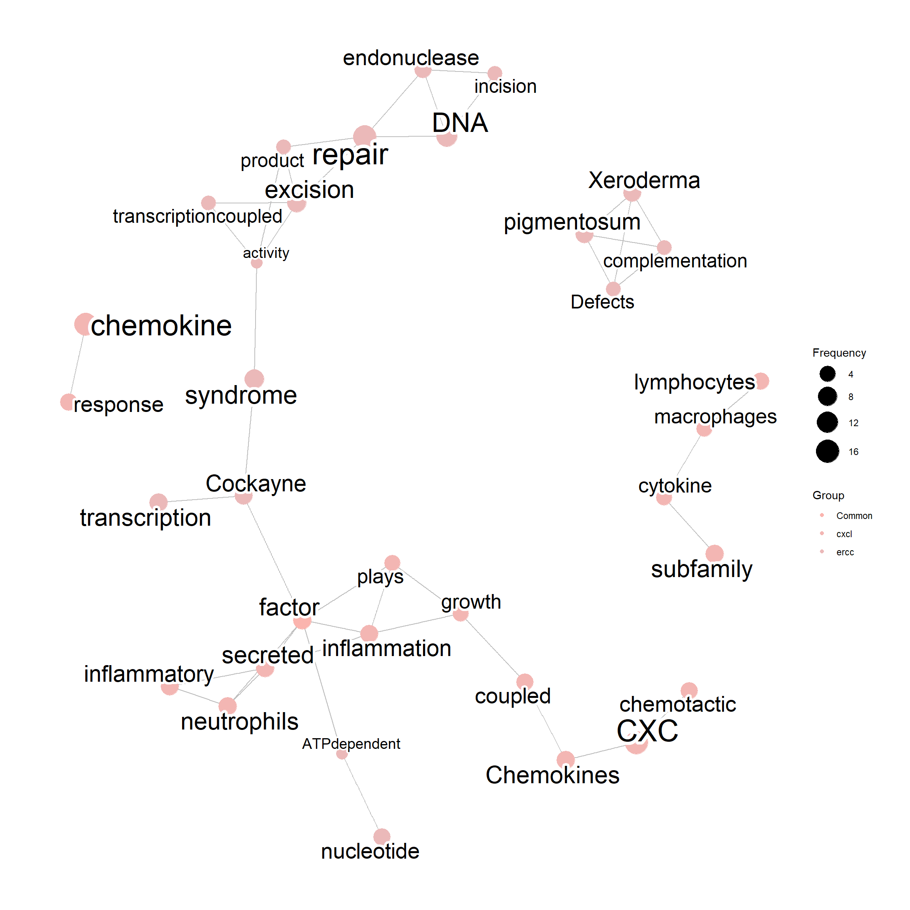

```r
compareWordNet(list(net1, net3),
               titles=c("ercc","ercc-PubMed"))
#> Warning in grid.Call(C_textBounds,
#> as.graphicsAnnot(x$label), x$x, x$y, : font family not found
#> in Windows font database

#> Warning in grid.Call(C_textBounds,
#> as.graphicsAnnot(x$label), x$x, x$y, : font family not found
#> in Windows font database

#> Warning in grid.Call(C_textBounds,
#> as.graphicsAnnot(x$label), x$x, x$y, : font family not found
#> in Windows font database

#> Warning in grid.Call(C_textBounds,
#> as.graphicsAnnot(x$label), x$x, x$y, : font family not found
#> in Windows font database

#> Warning in grid.Call(C_textBounds,
#> as.graphicsAnnot(x$label), x$x, x$y, : font family not found
#> in Windows font database

#> Warning in grid.Call(C_textBounds,
#> as.graphicsAnnot(x$label), x$x, x$y, : font family not found
#> in Windows font database

#> Warning in grid.Call(C_textBounds,
#> as.graphicsAnnot(x$label), x$x, x$y, : font family not found
#> in Windows font database

#> Warning in grid.Call(C_textBounds,
#> as.graphicsAnnot(x$label), x$x, x$y, : font family not found
#> in Windows font database
```

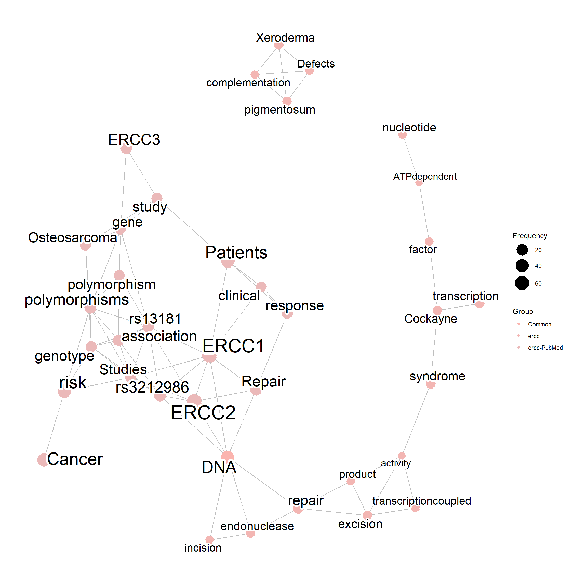

```r
compareWordNet(list(net1, net2, net3),
               titles=c("ercc","cxcl", "ercc-PubMed"))
#> Warning in grid.Call(C_textBounds,
#> as.graphicsAnnot(x$label), x$x, x$y, : font family not found
#> in Windows font database

#> Warning in grid.Call(C_textBounds,
#> as.graphicsAnnot(x$label), x$x, x$y, : font family not found
#> in Windows font database

#> Warning in grid.Call(C_textBounds,
#> as.graphicsAnnot(x$label), x$x, x$y, : font family not found
#> in Windows font database

#> Warning in grid.Call(C_textBounds,
#> as.graphicsAnnot(x$label), x$x, x$y, : font family not found
#> in Windows font database

#> Warning in grid.Call(C_textBounds,
#> as.graphicsAnnot(x$label), x$x, x$y, : font family not found
#> in Windows font database

#> Warning in grid.Call(C_textBounds,
#> as.graphicsAnnot(x$label), x$x, x$y, : font family not found
#> in Windows font database

#> Warning in grid.Call(C_textBounds,
#> as.graphicsAnnot(x$label), x$x, x$y, : font family not found
#> in Windows font database

#> Warning in grid.Call(C_textBounds,
#> as.graphicsAnnot(x$label), x$x, x$y, : font family not found
#> in Windows font database
```


If `tag` information is available in both gene clusters, combined tags can be visualized by `tag=TRUE`.


```r
keggPathways <- org.Hs.egPATH2EG
mappedKeys <- mappedkeys(keggPathways)
keggList <- as.list(keggPathways[mappedKeys])

net1 <- wcGeneSummary(keggList$`04110`,
                      keyType="ENTREZID",
                      plotType="network",
                      corThresh=0.3,
                      numWords=30,
                      tag=TRUE,
                      tfidf=TRUE)
#> Input genes: 124
#> Filter based on GeneSummary
#> Filtered 65 words (frequency and/or tfidf)
#> Bootstrap (r = 0.5)... Done.
#> Bootstrap (r = 0.6)... Done.
#> Bootstrap (r = 0.7)... Done.
#> Bootstrap (r = 0.8)... Done.
#> Bootstrap (r = 0.9)... Done.
#> Bootstrap (r = 1.0)... Done.
#> Bootstrap (r = 1.1)... Done.
#> Bootstrap (r = 1.2)... Done.
#> Bootstrap (r = 1.3)... Done.
#> Bootstrap (r = 1.4)... Done.

net2 <- wcGeneSummary(keggList$`04210`,
                      keyType="ENTREZID",
                      plotType="network",
                      corThresh=0.3,
                      numWords=30,
                      tfidf=TRUE,
                      tag=TRUE)
#> Input genes: 87
#> Filter based on GeneSummary
#> Filtered 65 words (frequency and/or tfidf)
#> Bootstrap (r = 0.5)... Done.
#> Bootstrap (r = 0.6)... Done.
#> Bootstrap (r = 0.7)... Done.
#> Bootstrap (r = 0.8)... Done.
#> Bootstrap (r = 0.9)... Done.
#> Bootstrap (r = 1.0)... Done.
#> Bootstrap (r = 1.1)... Done.
#> Bootstrap (r = 1.2)... Done.
#> Bootstrap (r = 1.3)... Done.
#> Bootstrap (r = 1.4)... Done.

compareWordNet(list(net1, net2), tag=TRUE)
#> Warning in grid.Call(C_textBounds,
#> as.graphicsAnnot(x$label), x$x, x$y, : font family not found
#> in Windows font database

#> Warning in grid.Call(C_textBounds,
#> as.graphicsAnnot(x$label), x$x, x$y, : font family not found
#> in Windows font database

#> Warning in grid.Call(C_textBounds,
#> as.graphicsAnnot(x$label), x$x, x$y, : font family not found
#> in Windows font database

#> Warning in grid.Call(C_textBounds,
#> as.graphicsAnnot(x$label), x$x, x$y, : font family not found
#> in Windows font database

#> Warning in grid.Call(C_textBounds,
#> as.graphicsAnnot(x$label), x$x, x$y, : font family not found
#> in Windows font database

#> Warning in grid.Call(C_textBounds,
#> as.graphicsAnnot(x$label), x$x, x$y, : font family not found
#> in Windows font database

#> Warning in grid.Call(C_textBounds,
#> as.graphicsAnnot(x$label), x$x, x$y, : font family not found
#> in Windows font database

#> Warning in grid.Call(C_textBounds,
#> as.graphicsAnnot(x$label), x$x, x$y, : font family not found
#> in Windows font database

#> Warning in grid.Call(C_textBounds,
#> as.graphicsAnnot(x$label), x$x, x$y, : font family not found
#> in Windows font database

#> Warning in grid.Call(C_textBounds,
#> as.graphicsAnnot(x$label), x$x, x$y, : font family not found
#> in Windows font database

#> Warning in grid.Call(C_textBounds,
#> as.graphicsAnnot(x$label), x$x, x$y, : font family not found
#> in Windows font database

#> Warning in grid.Call(C_textBounds,
#> as.graphicsAnnot(x$label), x$x, x$y, : font family not found
#> in Windows font database
```


## Text over represenatation analysis (experimental)


```r
geneList <- keggList$`00785` # Lipoic acid metabolism
pvs <- textORA(geneList)
hist(pvs)
```


```r
pvs[order(pvs)] |> head()
#>            lipoic              step              acid 
#>      1.600963e-14      8.016934e-08      5.300425e-07 
#> lipoateactivating  lipoatedependent            lipoyl 
#>      1.484931e-04      1.484931e-04      1.484931e-04

geneList <- keggList$`05150` # Staphylococcus aureus infection
pvs <- textORA(geneList)
hist(pvs)
```


```r
pvs[order(pvs)] |> head()
#>          drb        chain   complement        class 
#> 0.000000e+00 3.669590e-82 3.266180e-74 5.496543e-46 
#>         exon         beta 
#> 6.851722e-39 1.318324e-34
```

This thresholding can be used in RefSeq visualization.
Filter words using ORA threshold and frequency threshold by setting `ora=TRUE`.


```r
net <- wcGeneSummary(inpSymbol, plotType="network",
                     ora=TRUE, edgeLink=FALSE)
#> Input genes: 7
#>   Converted input genes: 7
#> Filter based on GeneSummary
#> Filtered 65 words (frequency and/or tfidf)
#> Performing ORA
#> Filtered 148 words (ORA)
net@net
```


After obtaining the ORA results, one can plot volcano-plot like plot for the results using `plotORA` function.


```r
library(ggrepel)
plotORA(net)
```

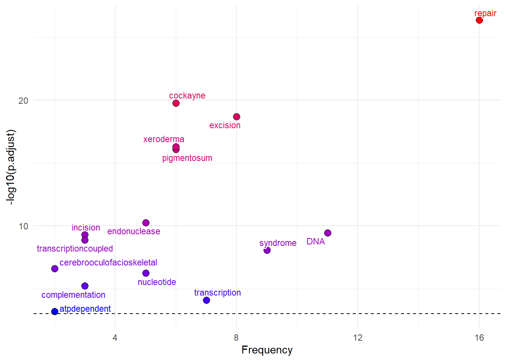

## Dependency analyis using udpipe
Using [`udpipe`](https://github.com/bnosac/udpipe) package ([Straka and Strakov√°. 2017](https://aclanthology.org/K17-3009/)), one can performe dependency analysis of texts in various databases. Set `useUdpipe` to `TRUE`, and specify downloaded model to be used in `udpipeModel`.


```r
p <- wcGeneSummary::wcGeneSummary(c("DDX41","PNKP","ERCC2"),
                                  plotType="network",
                                  useUdpipe=TRUE,
                                  udpipeModel="~/english-ewt-ud-2.5-191206.udpipe")
#> Using udpipe mode
#> Input genes: 3
#>   Converted input genes: 3
#> Filter based on GeneSummary
#> Filtered 65 words (frequency and/or tfidf)
p@net
```

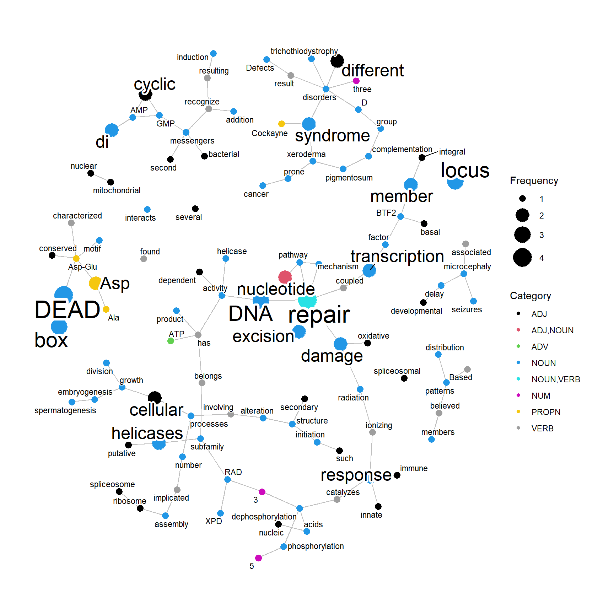

## Changing the font

Font can be specified by `fontFamily`, which affects all the labels including edges and nodes.


```r
load(system.file("extdata", "sysdata.rda", package = "wcGeneSummary"))
degs <- d3degUpAssetta2016
## Use alien encounter fonts (http://www.hipsthetic.com/alien-encounters-free-80s-font-family/)
sysfonts::font_add(family="alien",regular="SFAlienEncounters.ttf")
showtext::showtext_auto()
p <- wcGeneSummary::wcGeneSummary(degs,
                                  plotType="network",
                                  numWords=50, genePlot=TRUE,
                                  fontFamily="alien",
                                  colorText=TRUE)
#> Input genes: 636
#>   Converted input genes: 555
#> Filter based on GeneSummary
#> Filtered 65 words (frequency and/or tfidf)
p@net
```

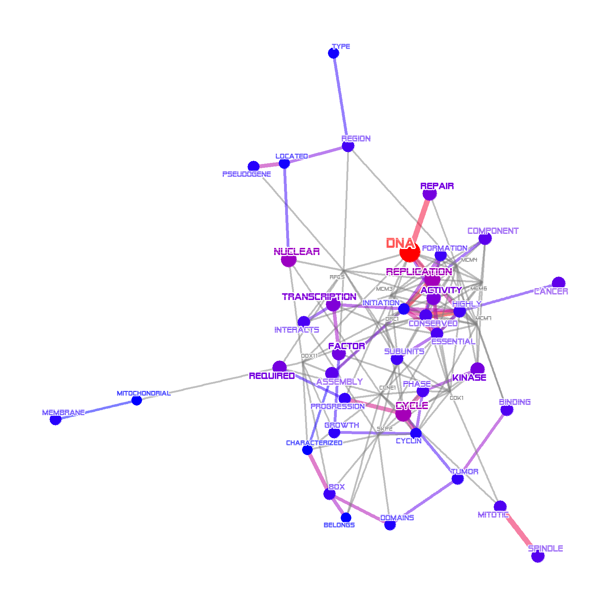


```r
sessionInfo()
#> R version 4.2.1 (2022-06-23 ucrt)
#> Platform: x86_64-w64-mingw32/x64 (64-bit)
#> Running under: Windows 10 x64 (build 22621)
#> 
#> Matrix products: default
#> 
#> locale:
#> [1] LC_COLLATE=Japanese_Japan.utf8 
#> [2] LC_CTYPE=Japanese_Japan.utf8   
#> [3] LC_MONETARY=Japanese_Japan.utf8
#> [4] LC_NUMERIC=C                   
#> [5] LC_TIME=Japanese_Japan.utf8    
#> 
#> attached base packages:
#> [1] stats4    stats     graphics  grDevices utils    
#> [6] datasets  methods   base     
#> 
#> other attached packages:
#>  [1] dplyr_1.1.1               dendextend_1.17.1        
#>  [3] clusterProfiler_4.7.1.003 ReactomePA_1.40.0        
#>  [5] RColorBrewer_1.1-3        ggraph_2.1.0             
#>  [7] org.Hs.eg.db_3.15.0       AnnotationDbi_1.58.0     
#>  [9] IRanges_2.30.0            S4Vectors_0.34.0         
#> [11] Biobase_2.56.0            BiocGenerics_0.42.0      
#> [13] wcGeneSummary_0.99.0      ggplot2_3.4.1            
#> 
#> loaded via a namespace (and not attached):
#>   [1] shadowtext_0.1.2       fastmatch_1.1-3       
#>   [3] plyr_1.8.8             igraph_1.4.1          
#>   [5] lazyeval_0.2.2         splines_4.2.1         
#>   [7] BiocParallel_1.30.4    GenomeInfoDb_1.32.4   
#>   [9] digest_0.6.29          yulab.utils_0.0.6     
#>  [11] htmltools_0.5.5        bugsigdbr_1.2.2       
#>  [13] GOSemSim_2.25.0        viridis_0.6.2         
#>  [15] GO.db_3.15.0           fansi_1.0.4           
#>  [17] GeneSummary_0.99.3     magrittr_2.0.3        
#>  [19] memoise_2.0.1          tm_0.7-8              
#>  [21] Biostrings_2.64.0      graphlayouts_0.8.4    
#>  [23] pvclust_2.2-0          wordcloud_2.6         
#>  [25] enrichplot_1.16.2      colorspace_2.1-0      
#>  [27] rappdirs_0.3.3         blob_1.2.4            
#>  [29] ggrepel_0.9.3          xfun_0.38             
#>  [31] crayon_1.5.2           RCurl_1.98-1.7        
#>  [33] jsonlite_1.8.0         scatterpie_0.1.8      
#>  [35] graph_1.74.0           ape_5.7-1             
#>  [37] glue_1.6.2             polyclip_1.10-4       
#>  [39] stopwords_2.3          gtable_0.3.3          
#>  [41] zlibbioc_1.42.0        XVector_0.36.0        
#>  [43] GetoptLong_1.0.5       graphite_1.42.0       
#>  [45] rentrez_1.2.3          scales_1.2.1          
#>  [47] DOSE_3.25.0.002        DBI_1.1.3             
#>  [49] Rcpp_1.0.9             viridisLite_0.4.1     
#>  [51] xtable_1.8-4           tidytree_0.4.2        
#>  [53] gridGraphics_0.5-1     reactome.db_1.81.0    
#>  [55] bit_4.0.4              htmlwidgets_1.6.2     
#>  [57] httr_1.4.5             fgsea_1.22.0          
#>  [59] ellipsis_0.3.2         pkgconfig_2.0.3       
#>  [61] XML_3.99-0.10          farver_2.1.1          
#>  [63] sass_0.4.5             utf8_1.2.3            
#>  [65] ggplotify_0.1.0        tidyselect_1.2.0      
#>  [67] rlang_1.1.0            reshape2_1.4.4        
#>  [69] later_1.3.0            munsell_0.5.0         
#>  [71] tools_4.2.1            cachem_1.0.6          
#>  [73] downloader_0.4         cli_3.5.0             
#>  [75] generics_0.1.3         RSQLite_2.2.15        
#>  [77] gson_0.1.0             evaluate_0.20         
#>  [79] stringr_1.5.0          fastmap_1.1.0         
#>  [81] ggdendro_0.1.23        yaml_2.3.5            
#>  [83] ggtree_3.7.1.002       knitr_1.42            
#>  [85] bit64_4.0.5            fs_1.5.2              
#>  [87] tidygraph_1.2.3        purrr_1.0.1           
#>  [89] KEGGREST_1.36.3        nlme_3.1-157          
#>  [91] mime_0.12              slam_0.1-50           
#>  [93] aplot_0.1.10           xml2_1.3.3            
#>  [95] compiler_4.2.1         rstudioapi_0.14       
#>  [97] png_0.1-7              treeio_1.20.2         
#>  [99] tibble_3.2.1           tweenr_2.0.2          
#> [101] bslib_0.4.2            stringi_1.7.8         
#> [103] cyjShiny_1.0.42        highr_0.10            
#> [105] lattice_0.20-45        Matrix_1.5-3          
#> [107] vctrs_0.6.1            pillar_1.9.0          
#> [109] lifecycle_1.0.3        jquerylib_0.1.4       
#> [111] GlobalOptions_0.1.2    data.table_1.14.2     
#> [113] cowplot_1.1.1          bitops_1.0-7          
#> [115] httpuv_1.6.5           patchwork_1.1.2       
#> [117] qvalue_2.28.0          R6_2.5.1              
#> [119] bookdown_0.33          promises_1.2.0.1      
#> [121] gridExtra_2.3          codetools_0.2-18      
#> [123] MASS_7.3-57            rjson_0.2.21          
#> [125] withr_2.5.0            GenomeInfoDbData_1.2.8
#> [127] parallel_4.2.1         ISOcodes_2022.09.29   
#> [129] grid_4.2.1             ggfun_0.0.9           
#> [131] tidyr_1.3.0            HDO.db_0.99.1         
#> [133] rmarkdown_2.21         downlit_0.4.2         
#> [135] ggforce_0.4.1          NLP_0.2-1             
#> [137] shiny_1.7.4            base64enc_0.1-3
```
