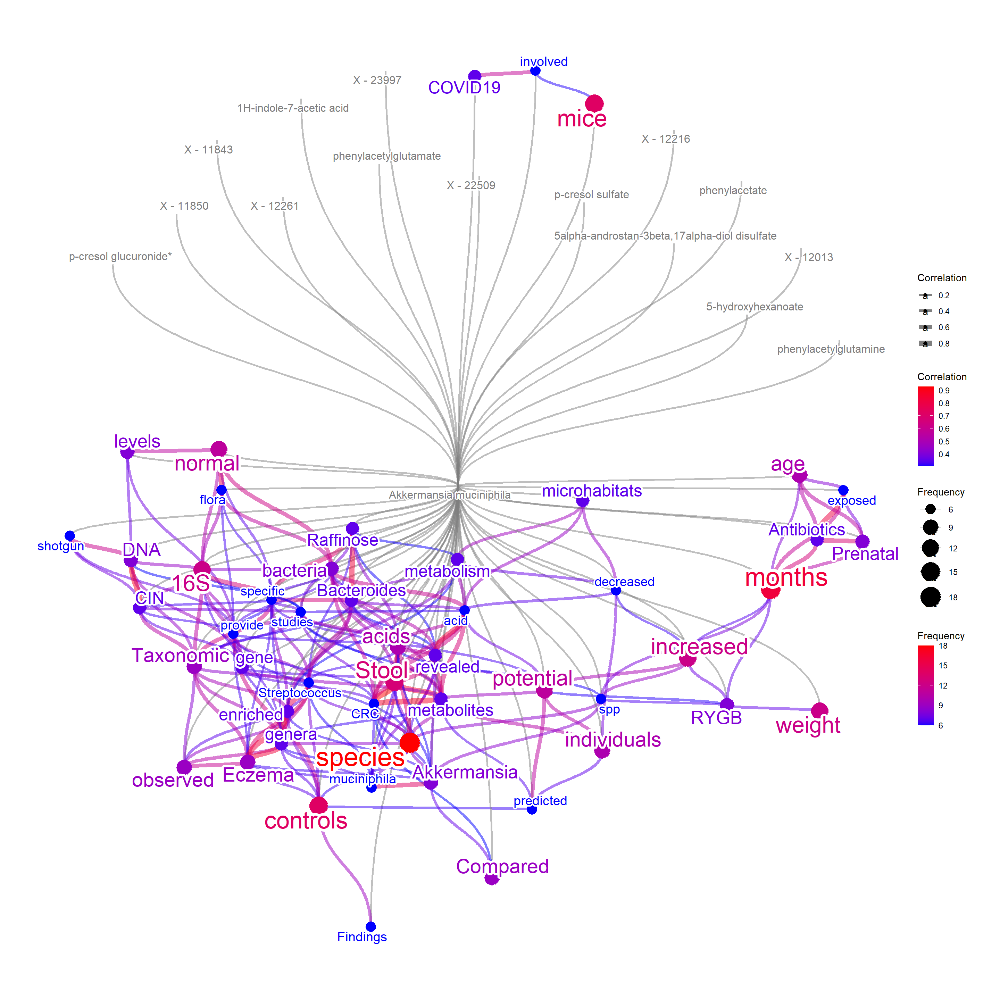

# The basic usage for microbiome-related data

The general usage for mining the information related to microbiome-related signatures.


```r
library(wcGeneSummary)
library(ggplot2)
library(ggraph)
library(RColorBrewer)
```

We use BugSigDB, and its R port bugsigdbr to obtain the curated dataset of the relationship with bacterial taxonomy and human diseases ([Geistlinger et al. 2022](https://bugsigdb.org/Main_Page)). Users can query microbiome names, which will be searched for MetaPhlAn taxonomic annotation. If `target="title"`, the title of the corresponding articles will be summarized.


```r
basic <- wcBSDB(c("Veillonella dispar","Neisseria flava"),tag=FALSE,
    curate=TRUE,target="title",pre=TRUE,cl=snow::makeCluster(12),
    pal=RColorBrewer::brewer.pal(10, "Set2"),numWords=80,argList=list(min.freq=1))
#> Input microbes: 2
#>   Found 17 entries for Veillonella dispar
#>   Found 1 entries for Neisseria flava
#> Including 28 entries
#> Filter based on BugSigDB
#> Filtering 0 words (frequency and/or tfidf)
basic@freqDf |> head(n=20)
#>                    word freq
#> gut                 Gut    8
#> oral               Oral    5
#> patients       patients    5
#> study             study    3
#> arthritis     arthritis    2
#> association association    2
#> bacterial     bacterial    2
#> covid19         COVID19    2
#> diabetes       diabetes    2
#> dysbiosis     Dysbiosis    2
#> infant           infant    2
#> infection     Infection    2
#> obese             obese    2
#> respiratory respiratory    2
#> sequencing   sequencing    2
#> surgery         surgery    2
#> tract             tract    2
#>  features      features    1
#> 16s                 16S    1
#> aerosol         Aerosol    1
basic@wc
```


If `target="abstract"`, the corresponding abstract will be fetched and be summarized.


```r
basic2 <- wcBSDB(c("Veillonella dispar","Neisseria flava"),tag=TRUE,
    curate=TRUE,target="abstract",pre=TRUE,cl=snow::makeCluster(12),
    pal=RColorBrewer::brewer.pal(10, "Set2"),numWords=80)
#> Input microbes: 2
#>   Found 17 entries for Veillonella dispar
#>   Found 1 entries for Neisseria flava
#> Including 28 entries
#> Target is abstract
#>   Querying PubMed for 17 pmids
#>   Querying without API key
#> Filter based on BugSigDB
#> Filtering 0 words (frequency and/or tfidf)
#> Multiscale bootstrap... Done.
basic2@freqDf |> head()
#>                word freq
#> patients   patients   37
#> gut             Gut   30
#> oral           Oral   27
#> bacterial Bacterial   25
#> species     species   24
#> microbial Microbial   23
basic2@wc
```


For successful visualization, pre-caculated TF-IDF and frequency data frame is available and one can use them to filter the highly occurring words, or the other prefiltering option used in `wcGeneSummary`.


```r
rmwords <- wcGeneSummary:::allFreqBSDB
filter <- rmwords[rmwords$freq>quantile(rmwords$freq, 0.95),]
filter |> head(n=20)
#>             freq        word
#> microbiota   275  microbiota
#> gut          242         gut
#> microbiome   175  microbiome
#> patients     146    patients
#> study         69       study
#> cancer        64      cancer
#> composition   62 composition
#> oral          55        oral
#> human         49       human
#> intestinal    48  intestinal
#> children      45    children
#> microbial     45   microbial
#> disease       43     disease
#> fecal         41       fecal
#> alterations   36 alterations
#> analysis      34    analysis
#> association   34 association
#> dysbiosis     34   dysbiosis
#> infection     34   infection
#> risk          33        risk
```
The network visualization is possible by enabling `plotType="network"`.
The same parameters that can be passed to `wcGeneSummary` can be used.


```r
net <- wcBSDB(c("Neisseria","Veillonella"),
    curate=TRUE,target="title",pre=TRUE,plotType="network",
    additionalRemove=filter$word, corThresh=0.2, edgeLink=FALSE,
    numWords=60)
#> Input microbes: 2
#>   Found 76 entries for Neisseria
#>   Found 221 entries for Veillonella
#> Including 502 entries
#> Filter based on BugSigDB
#> Filtering 0 words (frequency and/or tfidf)
net@net
```


The words-to-species relationship can be plotted by `mbPlot=TRUE`.


```r
net2 <- wcBSDB(c("Veillonella dispar","Neisseria flava",
    "Veillonella parvula","Akkermansia muciniphila"), mbPlot=TRUE,
    curate=TRUE,target="title",pre=TRUE,plotType="network",
    additionalRemove=filter$word,
    numWords=40, corThresh=0.2, colorText=TRUE)
#> Input microbes: 4
#>   Found 17 entries for Veillonella dispar
#>   Found 1 entries for Neisseria flava
#>   Found 20 entries for Veillonella parvula
#>   Found 21 entries for Akkermansia muciniphila
#> Including 90 entries
#> Filter based on BugSigDB
#> Filtering 0 words (frequency and/or tfidf)
net2@net
```


As the BugSigDB contains the relationship between bacterial taxonomy and disease, disease name can also be plotted. When `disPlot=TRUE`, the `mbPlot`
 will be set to `TRUE` by default.
 

```r
net3 <- wcBSDB(c("Veillonella dispar","Neisseria flava",
    "Veillonella parvula","Akkermansia muciniphila"), mbPlot=TRUE,
    curate=TRUE,target="title",pre=TRUE,plotType="network",
    additionalRemove=filter$word, disPlot=TRUE,
    numWords=40, corThresh=0.2, colorText=TRUE)
#> Input microbes: 4
#>   Found 17 entries for Veillonella dispar
#>   Found 1 entries for Neisseria flava
#>   Found 20 entries for Veillonella parvula
#>   Found 21 entries for Akkermansia muciniphila
#> Including 90 entries
#> Filter based on BugSigDB
#> Filtering 0 words (frequency and/or tfidf)
net3@net
```


Other than curated databases, the PubMed query can also be performed with setting `curate=FALSE`. This way, the text information of the latest literature for the microbes and diseases can be plotted. The options for use in function obtaining PubMed information can be specified to `abstArg` in list format, like `sortOrder="pubdate"`.


```r
net4 <- wcBSDB(c("Veillonella dispar","Neisseria flava",
    "Veillonella parvula","Akkermansia muciniphila"), mbPlot=TRUE,
    curate=FALSE,target="title",pre=TRUE,plotType="network",
    additionalRemove=filter$word, disPlot=TRUE,
    numWords=40, corThresh=0.2, colorText=TRUE,
    abstArg = list(retMax=80, sortOrder="pubdate"))
#> Input microbes: 4
#>   Found 17 entries for Veillonella dispar
#>   Found 1 entries for Neisseria flava
#>   Found 20 entries for Veillonella parvula
#>   Found 21 entries for Akkermansia muciniphila
#> Including 90 entries
#> Proceeding without API key
#> Filter based on BugSigDB
#> Filtering 0 words (frequency and/or tfidf)
net4@net
```


For microbiome analysis, it is often the case that investigating coded enzymes is important. Using `wcEC` function and `getUPtax` function, the queried species or genus can be linked to possible interaction with enzymes using following databases. The downloaded file path should be specified to the function like below to link the queried taxonomy and enzymes. Specifically, enzymes listed in `enzyme.dat` are searched, and corresponding UniProt identifiers are obtained, followed by mapping using `speclist.txt`. This way, the links to microbe - textual information - enzyme can be plotted. 

- [enzyme.dat - from Expasy](https://enzyme.expasy.org/)
- [speclist.txt - UniProt Controlled vocabulary of species](https://ftp.uniprot.org/pub/databases/uniprot/current_release/knowledgebase/complete/docs/speclist.txt)


```r
# Not run
vp <- wcBSDB(c("Veillonella parvula"),
                 plotType="network",
                curate=TRUE, target="title", edgeLink=FALSE,
                mbPlot = TRUE, ecPlot=TRUE, disPlot=TRUE, tag=TRUE,
                cl=snow::makeCluster(10),colorText=TRUE, pre=TRUE, numWords=30,
                nodePal=RColorBrewer::brewer.pal(10, "Set2"),
                ecFile="../enzyme.dat",
                upTaxFile = "../speclist.txt")
#> Input microbes: 1
#>   Found 20 entries for Veillonella parvula
#> Including 31 entries
#> Filter based on BugSigDB
#> Filtering 0 words (frequency and/or tfidf)
#> Processing EC file
#>   Linking taxonomy to EC
#> Multiscale bootstrap... Done.
vp@net
```


Further, the relationship between metabolites and microbiome is of interest. Recent studies have revealed various associations in gut microbiome composition and human plasma metabolites, as well as in the other environments.

- Wishart DS, Oler E, Peters H, et al. MiMeDB: the Human Microbial Metabolome Database. Nucleic Acids Res. 2023;51(D1):D611-D620. doi:10.1093/nar/gkac868
- Muller E, Algavi YM, Borenstein E. The gut microbiome-metabolome dataset collection: a curated resource for integrative meta-analysis. npj Biofilms and Microbiomes. 2022;8(1):1-7. doi:10.1038/s41522-022-00345-5
- Dekkers KF, Sayols-Baixeras S, Baldanzi G, et al. An online atlas of human plasma metabolite signatures of gut microbiome composition. Nat Commun. 2022;13(1):5370. doi:10.1038/s41467-022-33050-0

We now use data obtained in [Dekkers et al.](https://www.nature.com/articles/s41467-022-33050-0).
First, read the downloaded file using `readxl`.


```r
metab <- readxl::read_excel(
  "../41467_2022_33050_MOESM8_ESM.xlsx",skip = 7)
```

Pass this tibble, as well as the columns to represent `taxonomy`, `metabolites`, and `quantitative values to threshold` to `metCol`. In this case, `metCol <- c("Metagenomic species", "Metabolite", "Spearman's ρ")`.


```r

metabEx <- wcBSDB(c("Akkermansia muciniphila"),
                edgeLink=FALSE,
                curate=TRUE,
                corThresh=0.3,
                nodePal=RColorBrewer::brewer.pal(10, "Dark2"),
                pre=TRUE, tag=TRUE,
                additionalRemove = filter$word,
                target="abstract", colorText=TRUE,
                plotType="network", numWords=50,
                mbPlot=TRUE,
                metCol=c("Metagenomic species", "Metabolite", "Spearman's ρ"),
                metab =metab, metThresh=0.15,
                preserve = TRUE,
                cl=snow::makeCluster(10),
                abstArg = list(retMax=80,
                               sortOrder="relevance"))
#> Input microbes: 1
#>   Found 21 entries for Akkermansia muciniphila
#> Including 31 entries
#> Target is abstract
#>   Querying PubMed for 20 pmids
#>   Querying without API key
#> Filter based on BugSigDB
#> Filtering 0 words (frequency and/or tfidf)
#> Checking metabolites
#> Multiscale bootstrap... Done.
metabEx@net
```



In this way, we can plot links between microbes - metabolites - textual information. For all the information combined, one can plot textual information - metabolites - coded enzymes - diseases - microbes link in one query.


```r
sessionInfo()
#> R version 4.2.1 (2022-06-23 ucrt)
#> Platform: x86_64-w64-mingw32/x64 (64-bit)
#> Running under: Windows 10 x64 (build 22000)
#> 
#> Matrix products: default
#> 
#> locale:
#> [1] LC_COLLATE=Japanese_Japan.utf8 
#> [2] LC_CTYPE=Japanese_Japan.utf8   
#> [3] LC_MONETARY=Japanese_Japan.utf8
#> [4] LC_NUMERIC=C                   
#> [5] LC_TIME=Japanese_Japan.utf8    
#> 
#> attached base packages:
#> [1] stats     graphics  grDevices utils     datasets 
#> [6] methods   base     
#> 
#> other attached packages:
#> [1] RColorBrewer_1.1-3   ggraph_2.0.6        
#> [3] ggplot2_3.4.0        wcGeneSummary_0.99.0
#> 
#> loaded via a namespace (and not attached):
#>   [1] GeneSummary_0.99.3     colorspace_2.0-3      
#>   [3] rjson_0.2.21           ISOcodes_2022.01.10   
#>   [5] ellipsis_0.3.2         XVector_0.36.0        
#>   [7] GlobalOptions_0.1.2    base64enc_0.1-3       
#>   [9] ggdendro_0.1.23        fs_1.5.2              
#>  [11] rstudioapi_0.13        farver_2.1.1          
#>  [13] graphlayouts_0.8.0     ggrepel_0.9.1         
#>  [15] bit64_4.0.5            AnnotationDbi_1.58.0  
#>  [17] fansi_1.0.3            xml2_1.3.3            
#>  [19] codetools_0.2-18       downlit_0.4.2         
#>  [21] cachem_1.0.6           knitr_1.39            
#>  [23] polyclip_1.10-0        jsonlite_1.8.0        
#>  [25] dbplyr_2.2.1           png_0.1-7             
#>  [27] graph_1.74.0           ggforce_0.3.3         
#>  [29] shiny_1.7.2            bugsigdbr_1.2.2       
#>  [31] rentrez_1.2.3          compiler_4.2.1        
#>  [33] httr_1.4.3             assertthat_0.2.1      
#>  [35] fastmap_1.1.0          cli_3.5.0             
#>  [37] later_1.3.0            tweenr_1.0.2          
#>  [39] htmltools_0.5.3        tools_4.2.1           
#>  [41] igraph_1.3.4           NLP_0.2-1             
#>  [43] gtable_0.3.0           glue_1.6.2            
#>  [45] GenomeInfoDbData_1.2.8 dplyr_1.0.9           
#>  [47] rappdirs_0.3.3         Rcpp_1.0.9            
#>  [49] slam_0.1-50            Biobase_2.56.0        
#>  [51] jquerylib_0.1.4        vctrs_0.5.1           
#>  [53] Biostrings_2.64.0      xfun_0.31             
#>  [55] stringr_1.4.0          stopwords_2.3         
#>  [57] mime_0.12              lifecycle_1.0.3       
#>  [59] pvclust_2.2-0          XML_3.99-0.10         
#>  [61] dendextend_1.16.0      org.Hs.eg.db_3.15.0   
#>  [63] zlibbioc_1.42.0        MASS_7.3-57           
#>  [65] scales_1.2.0           tidygraph_1.2.1       
#>  [67] promises_1.2.0.1       parallel_4.2.1        
#>  [69] cyjShiny_1.0.34        curl_4.3.2            
#>  [71] yaml_2.3.5             memoise_2.0.1         
#>  [73] gridExtra_2.3          yulab.utils_0.0.5     
#>  [75] sass_0.4.2             stringi_1.7.8         
#>  [77] RSQLite_2.2.15         highr_0.9             
#>  [79] S4Vectors_0.34.0       filelock_1.0.2        
#>  [81] BiocGenerics_0.42.0    GenomeInfoDb_1.32.2   
#>  [83] rlang_1.0.6            pkgconfig_2.0.3       
#>  [85] bitops_1.0-7           evaluate_0.15         
#>  [87] purrr_0.3.4            labeling_0.4.2        
#>  [89] patchwork_1.1.1        htmlwidgets_1.5.4     
#>  [91] cowplot_1.1.1          bit_4.0.4             
#>  [93] tidyselect_1.2.0       magrittr_2.0.3        
#>  [95] bookdown_0.29          R6_2.5.1              
#>  [97] snow_0.4-4             IRanges_2.30.0        
#>  [99] generics_0.1.3         DBI_1.1.3             
#> [101] pillar_1.8.0           withr_2.5.0           
#> [103] KEGGREST_1.36.3        RCurl_1.98-1.7        
#> [105] tibble_3.1.7           crayon_1.5.1          
#> [107] wordcloud_2.6          utf8_1.2.2            
#> [109] BiocFileCache_2.4.0    rmarkdown_2.14        
#> [111] viridis_0.6.2          GetoptLong_1.0.5      
#> [113] grid_4.2.1             blob_1.2.3            
#> [115] digest_0.6.29          xtable_1.8-4          
#> [117] tm_0.7-8               tidyr_1.2.0           
#> [119] httpuv_1.6.5           gridGraphics_0.5-1    
#> [121] stats4_4.2.1           munsell_0.5.0         
#> [123] ggplotify_0.1.0        viridisLite_0.4.0     
#> [125] bslib_0.4.0
```
