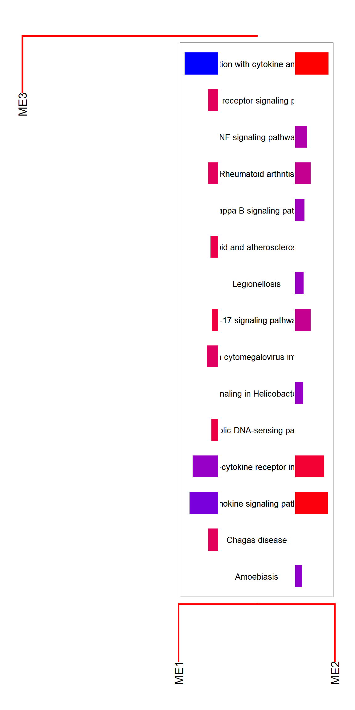
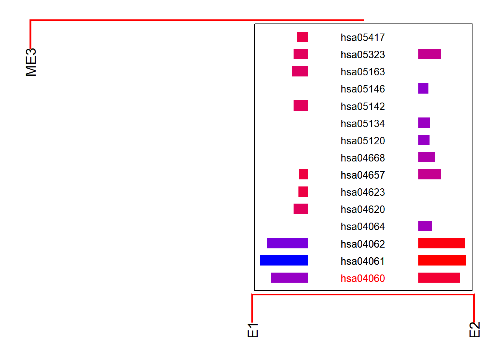
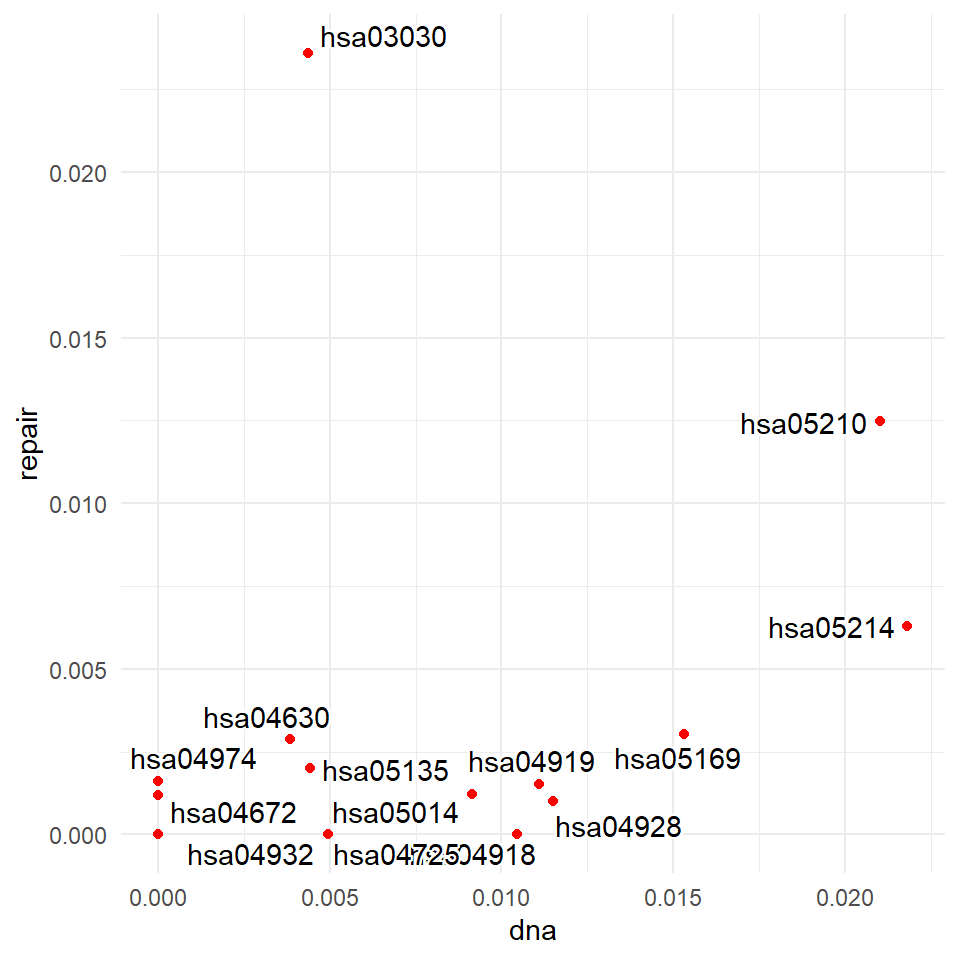
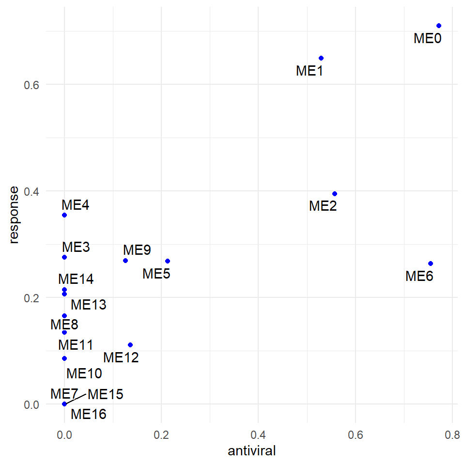
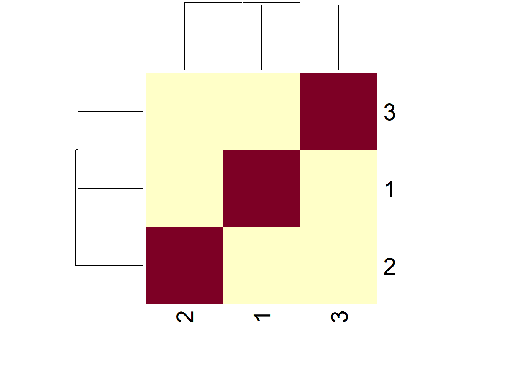

# Custom usage - Interactive inspection of Bayesian network annotated by words


```r
library(wcGeneSummary)
library(ggplot2)
library(ggraph)
library(org.Hs.eg.db)
library(clusterProfiler)
library(RColorBrewer)
```

In this example, a Bayesian network showing the module eigengenes relationship are inferred using `boot.strength` function in `bnlearn` from the weighted gene correlation network analysis (WGCNA) results. The modules are annotated by word clouds produced by `wcGeneSummary()`, and can be exported to the format of `Cytoscape.js` or `vis.js`. In this way, module relationship can be interactively inspected with the functional implications. The other functions like `wcAbst()` can be used, however, you shold specify API keys for the function makes multiple queries.


```r
## In this example, we simulate WGCNA results.
## you can just use results from WGCNA.
## Assuming WGCNA results are stored in `mod`
mod <- wcGeneSummary::returnExample()
MEs <- mod$MEs
modColors <- mod$colors
ensg <- names(modColors)

# library(bnlearn)
library(igraph)

## Replace like boot.strength(mod$MEs, R=500, algorithm = "hc")
# dag <- model2network("[ME1][ME2|ME1]") # If using bnlearn
dag <- graph_from_literal( ME1-+ME2, ME1-+ME3 )

## Convert to igraph
# g <- as.igraph(dag)
g <- dag

## Assign edge attributes
## Skip, if you perform boot.strength, the edge attributes can be added from the result
# el <- data.frame(as_edgelist(g))
# colnames(el) <- c("from","to")
# el <- left_join(el, bs)
# E(g)$strength <- el$strength
# E(g)$direction <- el$direction

## Node attributes
V(g)$stripName <- gsub("ME","",V(g)$name)
sizes <- table(modColors)
V(g)$size <- as.numeric(sizes[V(g)$stripName])

## Directory to save images and a script
rootDir <- "./"
netDir <- "visCyjs"
imageDir <- "images"

dir.create(paste0(rootDir, netDir))
dir.create(paste0(rootDir, netDir, "/", imageDir))

images <- c()
plotType <- "bar"
numLim <- 200 # limit for gene number
for (i in V(g)$name){
    print(i)
    i <- as.numeric(gsub("ME","",i)) # strip ME

    queries <- ensg[modColors==i]
    if (length(queries)>numLim) {
        warning("Sampling random genes")
        queries <- queries[sample(1:length(queries), numLim)] ## Temporary restrict to randomly chosen genes, should be replaced to like kME values
    }
    
    ## Convert to ENTREZ
    entre <- AnnotationDbi::select(org.Hs.eg.db, keytype="ENSEMBL",
        keys = queries, columns = "ENTREZID")$ENTREZID
    
    if (plotType=="bar"){
        plt <- makeBar(entre, keyType="ENTREZID") # get barplot
    } else { ## If wordcloud
        # A <- wcGeneSummary(entre, keyType="ENTREZID",
        #                    argList=list(rot.per=0.4,
        #                                 colors=brewer.pal(10,
        #                                                   sample(row.names(RColorBrewer::brewer.pal.info), 1)),
        #                                 random.order=FALSE),
        #                    numWords=80)
        # # plt <- A@wc
        # # 
        # # ## This time use ggwordcloud()
        # plt <- ggwordcloud::ggwordcloud(A@freqDf$word, A@freqDf$freq,
        #                      shape="circle", min.freq = 1,max.words = Inf,
        #                      rot.per = 0.5, random.order = FALSE,
        #                      colors = brewer.pal(10,
        #                                          sample(row.names(RColorBrewer::brewer.pal.info), 1)))+
        #          scale_size_area(max_size = 40)
    }
    ## Save images
    ggsave(paste0(rootDir, netDir, "/", imageDir, "/", i ,".png"),
           plt, dpi=300, width=10, height=10)
    ## Store image dir
    images <- c(images, paste0(imageDir, "/", i ,".png"))
}
#> [1] "ME1"
#> Input genes: 12
#> Filter based on GeneSummary
#> Filtered 65 words (frequency and/or tfidf)
#> [1] "ME2"
#> Input genes: 13
#> Filter based on GeneSummary
#> Filtered 65 words (frequency and/or tfidf)
#> [1] "ME3"
#> Input genes: 7
#> Filter based on GeneSummary
#> Filtered 65 words (frequency and/or tfidf)
V(g)$image <- images

## Node shape
if (plotType=="bar"){
    V(g)$shape <- rep("rectangle", length(V(g))) 
} else {
    V(g)$shape <- rep("circle", length(V(g)))
}

## Scale the node size
sizeMin <- 50
sizeMax <- 200
rawMin <- min(V(g)$size)
rawMax <- max(V(g)$size)
scf <- (sizeMax-sizeMin)/(rawMax-rawMin)
V(g)$size <- scf * V(g)$size + sizeMin - scf * rawMin

## Export
exportCyjs(g, rootDir, netDir)
# or, exportVisjs(g, rootDir, netDir)
```

Use like `http-server` in the directory containing a exported JavaScript, and interactively inspect the module relationship with word information.

The example visualization is shown below (not by the code above).


# Custom usage - Annotating gene cluster dendrogram

The relationship between gene clusters are often investigated in clustering analysis like WGCNA. As users of WGCNA typically plot dendrogram and heatmap of module eigengenes using `plotEigengeneNetworks`, it is useful to combine with wcGeneSummary, which plot additional word information on a dendrogram with one line.


```r
# WGCNA::plotEigengeneNetworks(mod$MEs, mod$colors, plotHeatmaps = FALSE)
plotEigengeneNetworksWithWords(MEs, modColors)
#> Bootstrap (r = 0.5)... Done.
#> Bootstrap (r = 0.6)... Done.
#> Bootstrap (r = 0.7)... Done.
#> Bootstrap (r = 0.8)... Done.
#> Bootstrap (r = 0.9)... Done.
#> Bootstrap (r = 1.0)... Done.
#> Bootstrap (r = 1.1)... Done.
#> Bootstrap (r = 1.2)... Done.
#> Bootstrap (r = 1.3)... Done.
#> Bootstrap (r = 1.4)... Done.
#> Input genes: 12
#>   Converted input genes: 12
#> Filter based on GeneSummary
#> Filtered 65 words (frequency and/or tfidf)
#> Input genes: 13
#>   Converted input genes: 13
#> Filter based on GeneSummary
#> Filtered 65 words (frequency and/or tfidf)
```


For examining enriched pathway names in the dendrograms, specify `argList` to `wcGeneSummary`, like `list(enrich="kegg")`.


```r
plotEigengeneNetworksWithWords(MEs, modColors, type="words", argList=list(enrich="kegg"))
#> Bootstrap (r = 0.5)... Done.
#> Bootstrap (r = 0.6)... Done.
#> Bootstrap (r = 0.7)... Done.
#> Bootstrap (r = 0.8)... Done.
#> Bootstrap (r = 0.9)... Done.
#> Bootstrap (r = 1.0)... Done.
#> Bootstrap (r = 1.1)... Done.
#> Bootstrap (r = 1.2)... Done.
#> Bootstrap (r = 1.3)... Done.
#> Bootstrap (r = 1.4)... Done.
#> Input genes: 12
#>   Converted input genes: 12
#> Filter based on GeneSummary
#> Filtered 65 words (frequency and/or tfidf)
#> Performing enrichment analysisInput genes: 13
#>   Converted input genes: 13
#> Filter based on GeneSummary
#> Filtered 65 words (frequency and/or tfidf)
#> Performing enrichment analysis
```


Other than textual information, we can simply annotate the dendrogram using enrichment analysis.
Useful for inspecting how the branches of dendrogram contains pathway information. 


```r
plotEigengeneNetworksWithWords(MEs, modColors, type="enrich")
#> Bootstrap (r = 0.5)... Done.
#> Bootstrap (r = 0.6)... Done.
#> Bootstrap (r = 0.7)... Done.
#> Bootstrap (r = 0.8)... Done.
#> Bootstrap (r = 0.9)... Done.
#> Bootstrap (r = 1.0)... Done.
#> Bootstrap (r = 1.1)... Done.
#> Bootstrap (r = 1.2)... Done.
#> Bootstrap (r = 1.3)... Done.
#> Bootstrap (r = 1.4)... Done.
```


The column names for clusterProfiler results can be specified to `showType`.


```r
plotEigengeneNetworksWithWords(MEs, modColors, type="enrich", showType="Description")
#> Bootstrap (r = 0.5)... Done.
#> Bootstrap (r = 0.6)... Done.
#> Bootstrap (r = 0.7)... Done.
#> Bootstrap (r = 0.8)... Done.
#> Bootstrap (r = 0.9)... Done.
#> Bootstrap (r = 1.0)... Done.
#> Bootstrap (r = 1.1)... Done.
#> Bootstrap (r = 1.2)... Done.
#> Bootstrap (r = 1.3)... Done.
#> Bootstrap (r = 1.4)... Done.
```



If you have a specifically interested pathway, use `highlight` to highlight the names in the dendrogram.


```r
plotEigengeneNetworksWithWords(mod$MEs, mod$colors,
                               type="enrich", highlight=c("hsa04060"))
#> Bootstrap (r = 0.5)... Done.
#> Bootstrap (r = 0.6)... Done.
#> Bootstrap (r = 0.7)... Done.
#> Bootstrap (r = 0.8)... Done.
#> Bootstrap (r = 0.9)... Done.
#> Bootstrap (r = 1.0)... Done.
#> Bootstrap (r = 1.1)... Done.
#> Bootstrap (r = 1.2)... Done.
#> Bootstrap (r = 1.3)... Done.
#> Bootstrap (r = 1.4)... Done.
#> 'select()' returned 1:1 mapping between keys and
#> columns
#> 'select()' returned 1:1 mapping between keys and
#> columns
```



# Custom usage - Assess the occurrence of the speicific words across gene clusters


```r
library(limma)
library(ggrepel)
query <- "DNA repair"
tab <- getGeneKEGGLinks(species="hsa")
listOfGenes <- list()
for (path in unique(tab$PathwayID)){
    listOfGenes[[path]] <- subset(tab, PathwayID==path)$GeneID
}
## Random subset! The results would be different.
frq <- findTerm(query, listOfGenes[sample(length(listOfGenes), 20)],
                split=TRUE, calc="mean",
                keyType="ENTREZID")
#> Finding query in 20 clusters ...
#> Input genes: 27
#> Filter based on GeneSummary
#> Filtered 65 words (frequency and/or tfidf)
#> Input genes: 6
#> Filter based on GeneSummary
#> Filtered 65 words (frequency and/or tfidf)
#> Input genes: 1541
#> Filter based on GeneSummary
#> Filtered 65 words (frequency and/or tfidf)
#> Input genes: 65
#> Filter based on GeneSummary
#> Filtered 65 words (frequency and/or tfidf)
#> Input genes: 47
#> Filter based on GeneSummary
#> Filtered 65 words (frequency and/or tfidf)
#> Input genes: 512
#> Filter based on GeneSummary
#> Filtered 65 words (frequency and/or tfidf)
#> Input genes: 148
#> Filter based on GeneSummary
#> Filtered 65 words (frequency and/or tfidf)
#> Input genes: 121
#> Filter based on GeneSummary
#> Filtered 65 words (frequency and/or tfidf)
#> Input genes: 50
#> Filter based on GeneSummary
#> Filtered 65 words (frequency and/or tfidf)
#> Input genes: 26
#> Filter based on GeneSummary
#> Filtered 65 words (frequency and/or tfidf)
#> Input genes: 154
#> Filter based on GeneSummary
#> Filtered 65 words (frequency and/or tfidf)
#> Input genes: 34
#> Filter based on GeneSummary
#> Filtered 65 words (frequency and/or tfidf)
#> Input genes: 232
#> Filter based on GeneSummary
#> Filtered 65 words (frequency and/or tfidf)
#> Input genes: 37
#> Filter based on GeneSummary
#> Filtered 65 words (frequency and/or tfidf)
#> Input genes: 75
#> Filter based on GeneSummary
#> Filtered 65 words (frequency and/or tfidf)
#> Input genes: 8
#> Filter based on GeneSummary
#> Filtered 65 words (frequency and/or tfidf)
#> Input genes: 152
#> Filter based on GeneSummary
#> Filtered 65 words (frequency and/or tfidf)
#> Input genes: 147
#> Filter based on GeneSummary
#> Filtered 65 words (frequency and/or tfidf)
#> Input genes: 72
#> Filter based on GeneSummary
#> Filtered 65 words (frequency and/or tfidf)
#> Input genes: 23
#> Filter based on GeneSummary
#> Filtered 65 words (frequency and/or tfidf)
plt <- data.frame(t(data.frame(frq, check.names=FALSE)),
                  check.names=FALSE)

plt$name <- gsub("path:", "", rownames(plt))
p <- ggplot(plt, aes(dna, repair, label = plt[,3])) +
    geom_point(color = "red")+ 
    geom_text_repel(bg.color="white")+theme_minimal()+
    xlab("dna")+ylab("repair")
p
#> Warning: ggrepel: 7 unlabeled data points (too many
#> overlaps). Consider increasing max.overlaps
```



For clustering analysis like `WGCNA`, making the list and query.


```r
query <- "antiviral response"
load("./blockwiseModule.rda")
mecolors <- bwmod$color
inputList <- names(mecolors)
names(inputList) <- paste0("ME",bwmod$color)

listOfGenes <- split(inputList, names(inputList))

frq <- findTerm(query, listOfGenes,
                split=TRUE,calc="highest",
                keyType="ENSEMBL")
#> Finding query in 17 clusters ...
#> Input genes: 12943
#> 'select()' returned 1:many mapping between keys and
#> columns
#>   Converted input genes: 10001
#> Filter based on GeneSummary
#> Filtered 65 words (frequency and/or tfidf)
#> Input genes: 5534
#> 'select()' returned 1:many mapping between keys and
#> columns
#>   Converted input genes: 4671
#> Filter based on GeneSummary
#> Filtered 65 words (frequency and/or tfidf)
#> Input genes: 43
#> 'select()' returned 1:1 mapping between keys and
#> columns
#>   Converted input genes: 42
#> Filter based on GeneSummary
#> Filtered 65 words (frequency and/or tfidf)
#> Input genes: 43
#> 'select()' returned 1:1 mapping between keys and
#> columns
#>   Converted input genes: 40
#> Filter based on GeneSummary
#> Filtered 65 words (frequency and/or tfidf)
#> Input genes: 42
#> 'select()' returned 1:1 mapping between keys and
#> columns
#>   Converted input genes: 40
#> Filter based on GeneSummary
#> Filtered 65 words (frequency and/or tfidf)
#> Input genes: 41
#> 'select()' returned 1:1 mapping between keys and
#> columns
#>   Converted input genes: 40
#> Filter based on GeneSummary
#> Filtered 65 words (frequency and/or tfidf)
#> Input genes: 40
#> 'select()' returned 1:many mapping between keys and
#> columns
#>   Converted input genes: 36
#> Filter based on GeneSummary
#> Filtered 65 words (frequency and/or tfidf)
#> Input genes: 39
#> 'select()' returned 1:1 mapping between keys and
#> columns
#>   Converted input genes: 37
#> Filter based on GeneSummary
#> Filtered 65 words (frequency and/or tfidf)
#> Input genes: 38
#> 'select()' returned 1:1 mapping between keys and
#> columns
#>   Converted input genes: 38
#> Filter based on GeneSummary
#> Filtered 65 words (frequency and/or tfidf)
#> Input genes: 2192
#> 'select()' returned 1:many mapping between keys and
#> columns
#>   Converted input genes: 2019
#> Filter based on GeneSummary
#> Filtered 65 words (frequency and/or tfidf)
#> Input genes: 740
#> 'select()' returned 1:many mapping between keys and
#> columns
#>   Converted input genes: 573
#> Filter based on GeneSummary
#> Filtered 65 words (frequency and/or tfidf)
#> Input genes: 653
#> 'select()' returned 1:many mapping between keys and
#> columns
#>   Converted input genes: 541
#> Filter based on GeneSummary
#> Filtered 65 words (frequency and/or tfidf)
#> Input genes: 621
#> 'select()' returned 1:many mapping between keys and
#> columns
#>   Converted input genes: 539
#> Filter based on GeneSummary
#> Filtered 65 words (frequency and/or tfidf)
#> Input genes: 591
#> 'select()' returned 1:many mapping between keys and
#> columns
#>   Converted input genes: 476
#> Filter based on GeneSummary
#> Filtered 65 words (frequency and/or tfidf)
#> Input genes: 139
#> 'select()' returned 1:1 mapping between keys and
#> columns
#>   Converted input genes: 59
#> Filter based on GeneSummary
#> Filtered 65 words (frequency and/or tfidf)
#> Input genes: 112
#> 'select()' returned 1:1 mapping between keys and
#> columns
#>   Converted input genes: 65
#> Filter based on GeneSummary
#> Filtered 65 words (frequency and/or tfidf)
#> Input genes: 89
#> 'select()' returned 1:1 mapping between keys and
#> columns
#>   Converted input genes: 87
#> Filter based on GeneSummary
#> Filtered 65 words (frequency and/or tfidf)
plt <- data.frame(t(data.frame(frq, check.names=FALSE)),
                  check.names=FALSE)
plt$name <- row.names(plt)

p <- ggplot(plt, aes(antiviral, response, label = plt[,3])) +
  geom_point(color = "blue")+ 
  geom_text_repel(bg.color="white")+theme_minimal()+
  xlab("antiviral")+ylab("response")
p
```




# Custom usage - Recluster the cluster using word information


```r
simExample <- returnSim(returnExample()$color,
                        keyType="ENSEMBL", argList=list(ora=TRUE))
#> Number of clusters: 3
#> 1
#> Input genes: 12
#>   Converted input genes: 12
#> Filter based on GeneSummary
#> Filtered 65 words (frequency and/or tfidf)
#> Performing ORA
#> Filtered 109 words (ORA)
#> 2
#> Input genes: 13
#>   Converted input genes: 13
#> Filter based on GeneSummary
#> Filtered 65 words (frequency and/or tfidf)
#> Performing ORA
#> Filtered 238 words (ORA)
#> 3
#> Input genes: 7
#>   Converted input genes: 7
#> Filter based on GeneSummary
#> Filtered 65 words (frequency and/or tfidf)
#> Performing ORA
#> Filtered 148 words (ORA)
heatmap(simExample)
```


```r
simExample <- returnSim(returnExample()$color,
                        keyType="ENSEMBL",
                        argList=list(tfidf=TRUE, takeMax=TRUE))
#> Number of clusters: 3
#> 1
#> Input genes: 12
#>   Converted input genes: 12
#> Filter based on GeneSummary
#> Filtered 65 words (frequency and/or tfidf)
#> 2
#> Input genes: 13
#>   Converted input genes: 13
#> Filter based on GeneSummary
#> Filtered 65 words (frequency and/or tfidf)
#> 3
#> Input genes: 7
#>   Converted input genes: 7
#> Filter based on GeneSummary
#> Filtered 65 words (frequency and/or tfidf)
heatmap(simExample)
```


