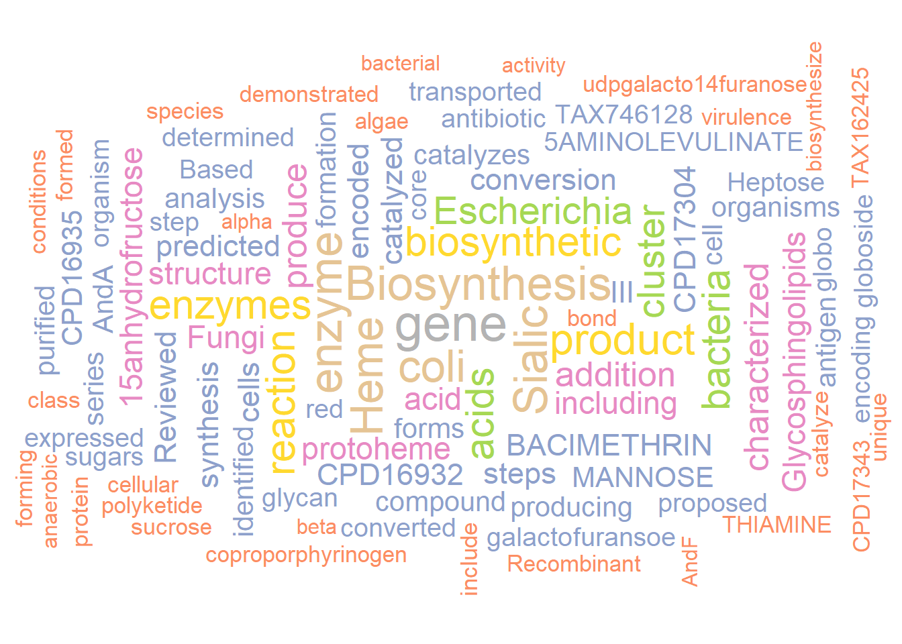
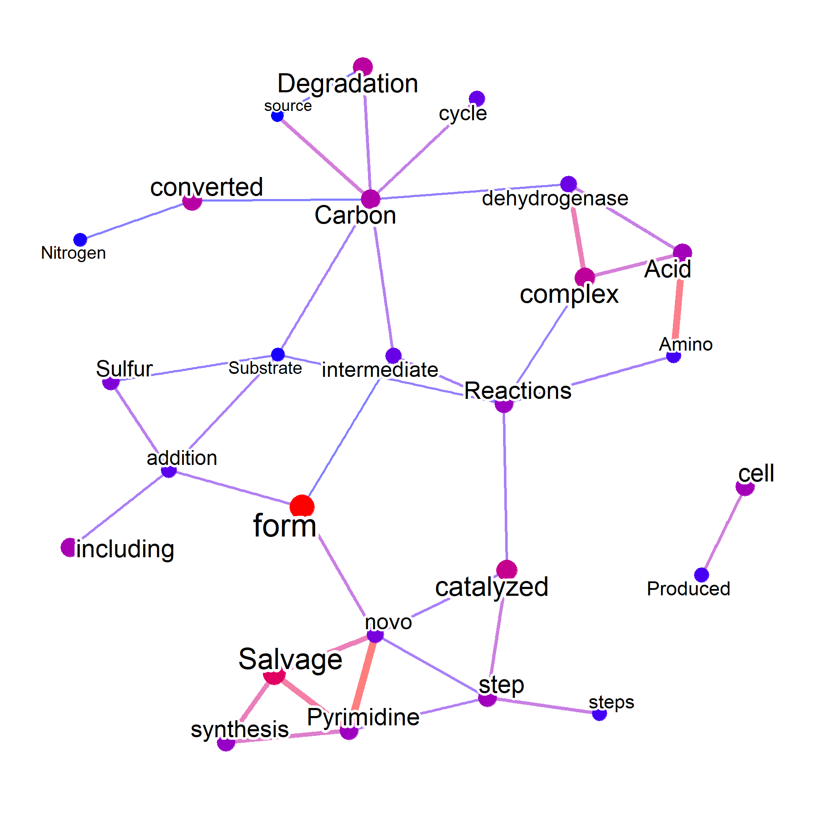
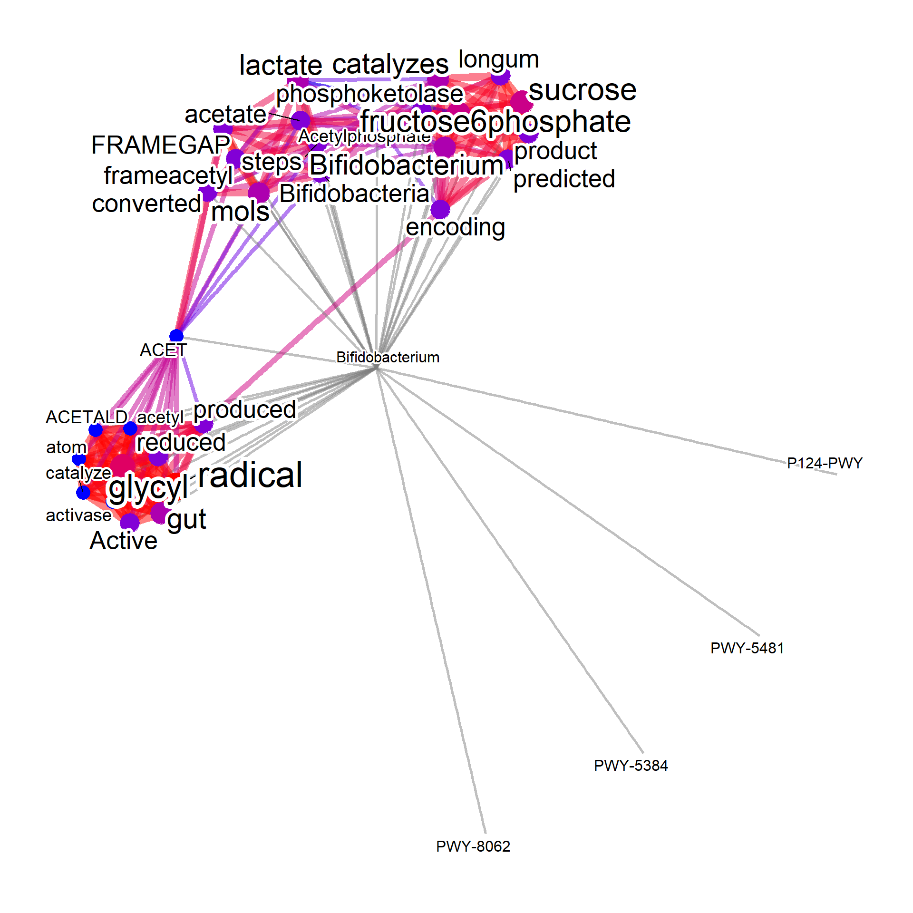

# Including the other databases (an example in MetaCyc)

For mining the pathway information in curated database MetaCyc ([Caspi et al. 2020](https://academic.oup.com/nar/article/48/D1/D445/5581728)), users can prepare `pathways.dat` from MetaCyc flat files. Note that you must have a valid license of using MetaCyc. See [User guides](https://www.metacyc.org/MetaCycUserGuide.shtml) of MetaCyc, and [BioCyc](www.biocyc.org).
Suppose we would like to know pathway and related information of "Bifidobacterium longum" and "Escherichia coli". The function `parseMetaCycPathway` can be used to parse the summarized comment of pathways using these queries. Note that the function search for `TAXONOMIC-RANGE` or `SPECIES` information in `pathways.dat` if `withTax=TRUE`. The resulting data.frame looks like below.


```r
library(wcGeneSummary)
library(ggraph)

candidateSpecies <- c("Bifidobacterium longum","Escherichia coli")
file <- "../../metacyc/24.5/data/pathways.dat"
input <- parseMetaCycPathway(file, candidateSpecies)

head(input)
#>   pathwayID
#> 1  PWY-7622
#> 2  PWY-7591
#> 3  PWY-7613
#> 4  PWY-7529
#> 5  PWY-7599
#> 6  PWY-7536
#>                                                                                                                                                                                                                                                                                                                                                                                                                                                                                                                                                                                                                                                                                                                                                                                                                                                                                                                                                                                                                                                                                                                                                                                                                                                                                                                                                                                                                                                                                                                                                                                                                                                                                                                                                                                                                                                                                                                                                                                                                                                                                                                                                                                                                                                                                                                                                                                                                                                                                                                                                                                                                                                                                                                                                                                                                                                                                                                                                                                                                                                                                                                                                                                                                                                                                                                                                                                                                                                                                                                                                                                                                                                                                                                                                                                                                                                                                                                                                                                                                                                                                                                                                                                                                                                                                                                                                                                                                                                                                                                                                                                                                                                                                                                                                                                                                                                                                                                                                                                                                                                   text
#> 1                                                                                                                                                                                                                                                                                                                                                                                                                                                                                                                                                                                                                                                                                                                                                                                                                                                                                                                                                                                                                                                                                                                                                                   |FRAME: D-galactofuransoe| is the five-carbon ring form of |FRAME: D-galactopyranose|. In solution both forms exist in equilibrium with |FRAME: D-galactopyranose| formation favored. Although |FRAME: D-galactopyranose| is ubiquitous in cellular organisms, |FRAME: D-galactofuransoe| is found only in some non-mammalian eukaryotes and in some bacteria including mycobacteria and <i>Escherichia coli<i> (as indicated in the pathway links and <i>E. coli<i> enzyme |FRAME: EG11983-MONOMER|).  |FRAME: UDP-D-GALACTO-14-FURANOSE| is a nucleotide-activated form of |FRAME: D-galactofuransoe| that is used by some organisms in the biosynthesis of polysaccharides and glycoconjugates. Although |FRAME: D-galactofuransoe| residues are not found in mammals, higher plants and yeasts, they are found in the glycans of some bacteria and lower eukaryotes including trypanosomatids, nematodes, the free-living alga |FRAME: TAX-3055| and filamentous fungi. These groups include known pathogens. |FRAME: D-galactofuransoe| residues are antigenic in humans and are therefore of interest as therapeutic targets (|CITS: [24118544]| and reviewed in |CITS: [21940757]|).  <b>About This Pathway<b>  In filamentous fungi |FRAME: UDP-D-GALACTO-14-FURANOSE| is biosynthesized in the cytosol starting with |FRAME: CPD-12575| which is derived from |FRAME: GLC-6-P| as indicated in the pathway link. Following the epimerization of |FRAME: CPD-12575| to |FRAME: CPD-14553|, |FRAME: EC-5.4.99.9| converts |FRAME: CPD-14553| to its five-carbon ring form |FRAME: UDP-D-GALACTO-14-FURANOSE|. The substrate of the mutase, |FRAME: CPD-14553|, may also be formed by the Leloir pathway enzyme |FRAME: EC-2.7.7.12|. In protozoan parasites such as |FRAME: TAX-5664| which appear to lack an ortholog encoding the Leloir pathway enzyme, |FRAME: CPD-14553| can be formed by |FRAME: EC-2.7.7.64| |CITS: [20335578][19906649][21073876]|. The pathway product |FRAME: UDP-D-GALACTO-14-FURANOSE| is then transported from the cytosol to the Golgi lumen for glycoconjugate biosynthesis (reviewed in |CITS: [21940757]|) (see pathway |FRAME: PWY-6317|).   In filamentous fungi galactomannan metabolism has been studied in both the non-pathogenic model organism |FRAME: TAX-162425| and in the opportunistic pathogen |FRAME: TAX-746128|, and relevant orthologs have been identified in these organisms. In |FRAME: TAX-162425| cytosolic UDP-glucose 4-epimerase (synonym UDP-galactose 4-epimerase) is encoded by <i>ugeA<i> |CITS: [20211750]|. In |FRAME: TAX-746128| <i>uge5<i> encodes the dominant cytosolic UDP-glucose 4-epimerase that is essential for growth on |FRAME: D-Galactose| and the synthesis of |FRAME: D-galactofuransoe|. In |FRAME: TAX-746128| a second gene <i>uge3<i> with no identified ortholog in |FRAME: TAX-162425| has also been characterized. Both Uge5 and Uge3 are required for galactosaminogalactan synthesis in |FRAME: TAX-746128| |CITS: [24257745]|. In |FRAME: TAX-162425| cytosolic UDP-galactose mutase is encoded by <i>ugmA<i>, and in |FRAME: TAX-746128| by <i>ugm1<i> (<i>glfA<i>) |CITS: [24257745]|.   |FRAME: UDP-D-GALACTO-14-FURANOSE| is then transported from the cytosol to the Golgi lumen for galactomannoprotein biosynthesis (not shown). In |FRAME: TAX-162425| the UDP-galactofuranose transporter is encoded by <i>ugtA<i> |CITS: [21693196]|, and in |FRAME: TAX-746128| by <i>ugt1<i> (<i>glfB<i>) (|CITS: [24257745]| and reviewed in |CITS: [21940757]|). In both organisms a novel, |FRAME: G-55162|-encoded, Golgi-localized, |FRAME: EC-2.4.1.M27|, has been characterized that is involved in synthesis of the galactofurnaose antigen of <i>O<i>-linked glycans. The <i>O<i>-glycans are then transported in vesicles to the hyphal cell surface |CITS: [24118544]|. 
#> 2                                                                                                                                                                                                                                                                                                                                                                                                                                                                                                                                                                                                                                                                                                                                                                                                                                                                                                                                                                                                                                                                                                                                                                                                                                                                                                                                                                                                                                                                                                                                                                                                                                                                                                                                                                                                                                                                                                                     |FRAME: CPD-17304 "Okenone"| is a red carotenoid pigment. Structurally this ketocarotenoid has a &chi;-ring at one end and an open chain &psi;-end that is methoxylated at the C-1' position and contains a keto group at the C-4' position. It is found in some purple sulfur bacterial members of the family |FRAME: TAX-1046|. These photosynthetic organisms reside in illuminated anoxic zones of aquatic habitats. Purple sulfur bacteria are anaerobic or microaerophilic, oxidizing |FRAME: HS| to produce granules of |FRAME: Elemental-Sulfur| (elemental sulfur) (see pathway |FRAME: PWY-5274|). The light absorption properties of |FRAME: CPD-17304| allow these bacteria to exist in deeper water layers. In addition to its role in bacterial ecology, |FRAME: CPD-17304| also becomes an important geochemical biomarker via its diagenesis product |FRAME: CPD-17311|, which is found in ancient rock formations ( |CITS: [BROCKSJJ05]| and in |CITS: [21921032][22070388]|.  |FRAME: TAX-572262| is a purple sulfur bacterium that synthesizes |FRAME: CPD-17304| as its only carotenoid when grown anoxically under chlorophototrophic conditions. A gene cluster encoding the enzymes for |FRAME: CPD-17304| biosynthesis (genes <i>crtE<i>, <i>crtB<i>,  <i>crtI<i>, <i>crtC<i>, <i>crtU<i> and <i>crtY<i> and an unlinked gene <i>crtF<i>) was identified and analyzed. The biosynthetic pathway for |FRAME: CPD-17304| was elucidated based on heterologous expression of recombinant enzymes in carotenoid-producing hosts, followed by carotenoid analysis |CITS: [21921032][22070388]|.  <b>About This Pathway<b>  In this pathway CrtY was shown to catalyze the cyclization of one &psi;-end of |FRAME: CPD1F-114| producing the &beta;-ring of |FRAME: CPD1F-126|. The CrtC hydratase hydrates the double bond of the &psi;-end group of |FRAME: CPD1F-126| producing |FRAME: CPD-11446|. CruO is a unique C-44' ketolase required for |FRAME: CPD-17304| biosynthesis that introduces a keto group at the C-4' position of |FRAME: CPD-11446|. CrtF is an <i>O<i>-methyltransferase that further modifies the &psi;-end group by transfer of a methyl group to the hydroxyl formed by CrtC, producing the methoxy group of |FRAME: CPD-17302|. Finally, the &beta;-ring of |FRAME: CPD-17302| is converted to a &chi;-ring and the molecule is further desaturated by the carotene desaturasemethyltransferase CrtU to produce |FRAME: CPD-17304|. The key enzymes of the pathway are CrtY and CrtU |CITS: [21921032][22070388]|.  In addition, a putative |FRAME: OXYGEN-MOLECULE|-dependent pathway for |FRAME: CPD-17307| biosynthesis involving genes <i>crtC<i>, <i>cruS<i> and <i>crtF<i> was also proposed (not shown), based on the demonstration of these enzymatic functions in <i>Escherichia coli<i>. However, no physiological evidence for the pathway could be found in either |FRAME: TAX-572262| or |FRAME: TAX-244573|. The novel gene <i>cruS<i> was shown to encode a unique 2-ketolase3,4-desaturase that could participate in the hypothetical pathway |CITS: [21921032]|. 
#> 3                                                                                                                                                                                                                                                                                                                                                                                                                                                                                                                                                                                                                                                                                                                                                                                                                                                                                                                                                                                                                                                                                                                                                                                                                                                                                                                                                                                                                                                                                                                                                                                                                                                                                                                                                                                                                                                                                                                                                                                                                                                                                                                                                                                                                                                                                                                                                                                                                                                                                                                                                                                                                                                                                                                                                                                                                                                                                                                                                                                                   Heptose sugars, mostly <i>glycero-manno<i>-heptoses, are found in the cell surface polymers of many bacteria. Prior to their incorporation, the heptose residues are activated by attachment to a nucleotide (see pathways |FRAME: PWY0-1241| and |FRAME: PWY-6478|). These activated heptoses can be uniquely modified by enzymes before incorporation into the polymers. In bacterial pathogens heptose derivatives such as 6-deoxyheptoses that are not found in mammals can play an important role in virulence, as demonstrated in |FRAME: TAX-633| |CITS: [18284593]|. Heptose modifying enzymes are therefore of interest as potential drug targets |CITS: [19610666][18284593]|.  The modified heptose |FRAME: CPD-17411| is found in the |FRAME: O-Antigens "O-antigen"| of |FRAME: ORG-6272|. The O-antigen along with core oligosaccharide and |FRAME: Lipid-A "lipid A"| comprise |FRAME: Lipopolysaccharides "lipopolysaccharide"| (LPS), a major component of the outer membrane in Gram-negative bacteria. LPS is one of several virulence factors in |FRAME: TAX-633|. It has been shown that 6-deoxy-D-<i>manno<i>-heptose affects the barrier function of LPS and the overall virulence of |FRAME: ORG-6272| |CITS: [18284593]|.  <b>About This Pathway<b>  DmhA along with its corresponding reductase DmhB catalyze the formation of 6-deoxyheptose, a modified heptose present in the O-antigen of |FRAME: ORG-6272|. In this pathway both DmhA and DmhB utilize and release sugars that are in the D-<i>manno<i> configuration. Unlike |FRAME: PWY-7610| in |FRAME: TAX-197|, no epimerization steps are involved |CITS: [19610666][23689373]|.  Both <i>dmhA<i> and <i>dmhB<i> mutants were analyzed for the composition and structure of their LPS and the virulence-related properties of these mutants and their complemented counterparts were assessed <i>in vitro<i> |CITS: [18284593]|. Recombinant proteins were expressed in <i>Escherichia coli<i>, purified and biochemically characterized |CITS: [19610666]|. 
#> 4  Sialic acids are a family of polyhydroxylated &alpha;-keto acids that contain nine carbon atoms. Most sialic acids are derivatives of |FRAME: N-ACETYLNEURAMINATE|, or |FRAME: CPD-10734| (KDN). |FRAME: N-ACETYLNEURAMINATE| is the most common sialic acid in mammals (see pathway |FRAME: PWY-6138|), while KDN is abundant in lower vertebrates (see pathway |FRAME: PWY-6140|). Their core structures can be modified at the hydroxyl groups, lactonized, or hydroxylated at the acetamido group, generating many derivatives. |FRAME: CPD-262| is a derivative of |FRAME: CMP-N-ACETYL-NEURAMINATE| (see pathway |FRAME: PWY-6144|). Reviewed in |CITS: [15888312] [16897172] [18568399]| and |CITS: [11841250]|.  Sialic acids are found mainly in vertebrates and a few higher invertebrates (ascidians and echinoderms). These acidic sugars are usually the terminal sugar residue in the glycan chains of vertebrate glycoconjugates (mostly glycoproteins and glycolipids, but also proteoglycans and glycosylphosphatidylinositol anchors). They function in mediating cellular recognition and adhesion events for many important processes such as development, the immune and inflammatory responses, and oncogenesis. Sialic acid occurs rarely in invertebrates. Endogenous sialylation has been shown to occur in |FRAME: TAX-7215|, but details of sialic acid biosynthesis in this organism remain to be determined |CITS: [18568399]|. However, it is possible the sialic acids might be biosynthesized by other eukaryotes in a species andor life cycle-dependent manner. In |CITS: [7841794]| and reviewed in |CITS: [15888312] [16897172] [18568399]| and |CITS: [11841250]|.  Most bacteria do not biosynthesize sialic acids, but some pathogenic, or symbiotic bacteria biosynthesize sialic acids as a means of evading a host's immune system (this pathway). The sialic acid is displayed on the bacterial cell surface (in capsular polysaccharides) in order to mimic vertebrate cells. Pathogens that biosynthesize sialic acids include |FRAME: TAX-487|, |FRAME: TAX-1392869| and |FRAME: TAX-197|. In addition, the human gut symbiont |FRAME: TAX-818| has been shown to synthesize |FRAME: CPD-10734| |CITS: [18804026]| (see pathway |FRAME: PWY-6140|). Whether or not archaea contain sialic acids remains to be determined (reviewed in |CITS: [15888312] [16897172] [18568399]| and |CITS: [11841250]|). Other sialic acid-like sugars biosynthesized by bacteria include the nonulosonic acids |FRAME: CPD-10754| |CITS: [16751642]| (see pathway |FRAME: PWY-6143|) and legionaminic acid see pathway class |FRAME: CMP-Legionaminate-Biosynthesis| |CITS: [18275154]|.  Protists are thought to lack the ability to biosynthesize sialic acids although more genome data are needed to confirm this. Sialic acids have been thought to be absent in plants but some studies raise the possibility |CITS: [18258224]|. Fungi appear to lack any known sialic acid biosynthetic pathway, although strain-specific, or novel pathways could exist. Reviewed in |CITS: [15888312] [16897172] [18568399]| and |CITS: [11841250]|.  Also see |FRAME: PWY-6145|.  <b>About This Pathway<b>  |FRAME: TAX-316275| is a Gram-negative, psychrophilic fish pathogen whose genome sequence has been determined |CITS: [19099551]|. Little is known about its mechanism of virulence. This organism contains three copies of a gene cluster that is homologous to the <i>Escherichia coli<i> <i>neu<i> gene cluster for the synthesis of capsular sialic acids (see |FRAME: PWY-6139|). In |FRAME: TAX-316275| the first copy of the gene cluster, <i>neu1<i>, is also likely involved in sialic acids biosynthesis. The second copy <i>neu2<i>, which is less homologous, is likely involved in the synthesis of alternative compounds such as legionaminate (see pathway class |FRAME: CMP-Legionaminate-Biosynthesis|). The third copy is an exact duplicate of the <i>neu2<i> gene cluster |CITS: [23481098]|.  Data suggest that both |FRAME: N-ACETYLNEURAMINATE| and |FRAME: CPD-1803| (7-<i>O<i>-acetyl-<i>N<i>-acetylneuraminate) are present in this organism and that their synthesis is catalyzed by the sialic acid synthase product of gene <i>neuB1<i> which is present in the <i>neu1<i> gene cluster. Based on genome analysis, enzyme kinetics, and structural analysis, the putative substrate for NeuB1 is  |FRAME: CPD-16880| and its product is |FRAME: CPD-1803|. In addition to |FRAME: TAX-316275|, this gene was also predicted to be present in other species including <i>Escherichia coli<i> and |FRAME: TAX-1311|.   A pathway for the biosynthesis of |FRAME: CPD-1803| has been proposed and is shown here. In addition to the experimentally determined NeuB1, predicted enzymes of the pathway include the <i>O<i>-acetyl transferase NeuD1, the hydrolyzing 2-epimerase NeuC1, and NeuA1 which activates |FRAME: CPD-1803| to a |FRAME: CMP| derivative |CITS: [23481098]|.  
#> 5                                                                                                                                                                                                                                                                                                                                                                                                                                                                                                                                                                                                                                                                                                                                                                                                                                                                                                                                                                                                                                                                                                                                                                                                                                                                                                                                                                                                                                                                                                                                                                                                                     |FRAME: CPD-17343 "Anditomin"| is |FRAME: CPD-17353|. These complex organo-oxygen natural products are produced by fungi from polyketide and terpenoid precursors. They have unique, highly oxygenated structures containing a complex bridged-ring system. The elucidation of the biosynthetic pathway for the meroterpenoid |FRAME: CPD-17343| in |FRAME: TAX-1549217| provides an opportunity for future construction of novel scaffolds for use in drug discovery |CITS: [25216349]|.  <b>About This Pathway<b>  The |FRAME: CPD-17343| biosynthetic gene cluster of |FRAME: TAX-1549217| was identified by bioinformatic analysis and the <i>and<i> gene products were functionally characterized (note that NCBI Taxonomy merged the <i>Emericella variecolor<i> and <i>Aspergillus stellifer<i> entries). The early-stage and late-stage biosynthetic steps were determined by expression of recombinant enzymes in a strain of |FRAME: TAX-5062| followed by analysis of products by HPLC, <sup>1<sup>H NMR, <sup>13<sup>C NMR and mass spectrometry. The mid-stage biosynthetic steps were elucidated using feeding experiments to predict the sequence of tailoring enzymes. In the case of AndA and AndF, recombinant enzyme was expressed in <i>Escherichia coli<i>, purified and characterized |CITS: [25216349]|.  The pathway begins with a polyketide synthase encoded by gene <i>andM<i> that produces |FRAME: CPD-17316| as its final product. AndK is a bifunctional P450 monooxygenase and hydrolase fusion protein that produces the phthalide compound |FRAME: CPD-17317|. AndD is a prenyltransferase that incorporates the farnesyl moiety. AndE is an epoxidase that forms the (<i>S<i>)-epoxide |FRAME: CPD-17325|. The terpene cyclase AndB then forms |FRAME: CPD-17333| |CITS: [25216349]|.   The mid-stage biosynthetic steps include AndA, AndJ and AndI. The nonheme iron-dependent dioxygenase AndA was shown to catalyze two reactions, the dehydrogenation of |FRAME: CPD-17334| to produce the enone |FRAME: CPD-17335| that contains a &Delta;<sup>1,2<sup>-conjugated double bond, and an isomerization involving an unprecedented skeletal rearrangement that results in the bridged-ring of |FRAME: CPD-17336|. This is in contrast to a previously proposed DielsAlder reaction. AndA thus generates the scaffold of the andilesins class of secondary metabolites. AndJ is a |FRAME: FAD|-dependent Baeyer-Villiger monooxygenase that generates a seven-membered lactone ring from |FRAME: CPD-17336|. AndI is a short-chain dehydrogenasereductase (SDR) that appears to reduce |FRAME: CPD-17337| to |FRAME: CPD-17339| |CITS: [25216349]|.   In the late-stage biosynthetic steps acetyltransferase AndG attaches an acetyl group to the hydroxyl group of |FRAME: CPD-17339|. This acetyl group is then lost in a spontaneous reaction. AndH is another SDR reductase that catalyzes reduction of the C-6 double bond of |FRAME: CPD-17341| to produce |FRAME: CPD-17342|. Finally AndF, another nonheme iron-dependent dioxygenase like AndA, oxidizes |FRAME: CPD-17342| to |FRAME: CPD-17343|. Based on the cofactor requirements for the production of both |FRAME: CPD-17336| by AndA and |FRAME: CPD-17343| by AndF, as well as the analogous FtmF reaction (see |FRAME: EC-1.14.11.38|), detailed reaction mechanisms for AndA and AndF were proposed |CITS: [25216349]|. 
#> 6                                                                                                                                                                                                                                                                                                                                                                                                                                                                                                                                                                                                                                                                                                                                                                                                                                                                                                                                                                                                                                                                                                                                                                                                                                                                                                                                                                                                                                                                                                                                                                                                                                                                                                                                                                                                                               This pathway depicts the biosynthesis of the |FRAME: CPD-16935| moiety of the natural product |FRAME: CPD-16932|. The reaction link shows its amide linkage to the synthetic partial polyenoate scaffold |FRAME: CPD-16939| which was derived from the structure of |FRAME: CPD-16932| |CITS: [20394362]|.  The antifungal agent |FRAME: CPD-16932| is a linear polyketide antibiotic produced by |FRAME: ORG-6265|. In the |FRAME: CPD-16932| biosynthetic gene cluster of this organism three tandem ORFs, ORF33, ORF34 and ORF35 catalyze the formation of the |FRAME: CPD-16935| moiety of |FRAME: CPD-16932|. Other ORFs in the cluster encode a large type I polyketide synthetase |CITS: 15844935|. |FRAME: CPD-16935 "2-Amino-3-hydroxycyclopent-2-enone"| (an enol tautomer of |FRAME: CPD-16936|) is a C<sub>5<sub>N unit that is present in many members of the manumycin antibiotic family as well as in other bioactive metabolites. In |FRAME: CPD-16932| the amino group of |FRAME: CPD-16935| is amide-bonded to the polyketide-derived polyenoic acid component, whereas in |FRAME: MOENOMYCIN| it is amide-bonded to |FRAME: Hexuronates| group |CITS: [20394362][15844935][NAKAGAWAA85]|.  <b>About This Pathway<b>  In the first reaction |FRAME: GLY| is condensed with |FRAME: SUC-COA| which produces |FRAME: 5-AMINO-LEVULINATE|, catalyzed by  |FRAME: MONOMER-18786| encoded by ORF34. |FRAME: 5-AMINO-LEVULINATE "5-Aminolevulinate"| is also an intermediate in tetrapyrrole biosynthesis in some species of |FRAME: TAX-1883| |CITS: [16816183]| (see pathway |FRAME: PWY-5189|). In the next reaction an |FRAME: ATP|-dependent |FRAME: MONOMER-18787| encoded by ORF35 catalyzes the ligation of |FRAME: 5-AMINO-LEVULINATE| to |FRAME: CO-A| producing |FRAME: CPD-16937|. The latter compound is unstable and can either undergo spontaneous intramolecular cyclization to produce the off-pathway shunt product |FRAME: CPD-16938|, or be converted enzymatically to |FRAME: CPD-16935| by the cyclase activity of the ORF34 product |CITS: [20394362]|.  The reaction link shows a condensation step catalyzed by the |FRAME: MONOMER-18788| product of ORF33 that is proposed to incorporate |FRAME: CPD-16935| into the polyketide chain of |FRAME: CPD-16932| which constitutes the final chain termination step. This reaction was experimentally demonstrated using the synthetic partial polyenoate scaffold |FRAME: CPD-16939| which was derived from the structure of |FRAME: CPD-16932| |CITS: [20394362]|.  Recombinant proteins encoded by ORF33, ORF34 and ORF35 were overexpressed in <i>Escherichia coli<i>, purified and biochemically characterized. In addition, the entire |FRAME: CPD-16935| biosynthetic pathway was reconstituted <i>in vitro<i>. The three enzymes were incubated with |FRAME: MG+2|, |FRAME: ATP|, |FRAME: CO-A|, |FRAME: GLY| and |FRAME: SUC-COA| (or |FRAME: 5-AMINO-LEVULINATE|) and |FRAME: CPD-16939|. The reaction product |FRAME: CPD-16941| was identified by LC-MS. Gel filtration chromatography demonstrated that none of the three enzymes formed complexes, indicating freely diffusible intermediates |CITS: [20394362]|.    
#>                                                      commonName
#> 1                    UDP-&alpha;-D-galactofuranose biosynthesis
#> 2                                          okenone biosynthesis
#> 3               GDP-6-deoxy-D-<i>manno</i>-heptose biosynthesis
#> 4 CMP-<i>N</i>-acetyl-7-<i>O</i>-acetylneuraminate biosynthesis
#> 5                                        anditomin biosynthesis
#> 6               2-amino-3-hydroxycyclopent-2-enone biosynthesis
#>              query
#> 1 Escherichia coli
#> 2 Escherichia coli
#> 3 Escherichia coli
#> 4 Escherichia coli
#> 5 Escherichia coli
#> 6 Escherichia coli

input2 <- parseMetaCycPathway(file, candidateSpecies, withTax=TRUE)

head(input2)
#>   pathwayID
#> 1  PWY-7622
#> 2  PWY-7591
#> 3  PWY-7613
#> 4  PWY-7529
#> 5  PWY-7599
#> 6  PWY-7536
#>                                                                                                                                                                                                                                                                                                                                                                                                                                                                                                                                                                                                                                                                                                                                                                                                                                                                                                                                                                                                                                                                                                                                                                                                                                                                                                                                                                                                                                                                                                                                                                                                                                                                                                                                                                                                                                                                                                                                                                                                                                                                                                                                                                                                                                                                                                                                                                                                                                                                                                                                                                                                                                                                                                                                                                                                                                                                                                                                                                                                                                                                                                                                                                                                                                                                                                                                                                                                                                                                                                                                                                                                                                                                                                                                                                                                                                                                                                                                                                                                                                                                                                                                                                                                                                                                                                                                                                                                                                                                                                                                                                                                                                                                                                                                                                                                                                                                                                                                                                                                                                                   text
#> 1                                                                                                                                                                                                                                                                                                                                                                                                                                                                                                                                                                                                                                                                                                                                                                                                                                                                                                                                                                                                                                                                                                                                                                   |FRAME: D-galactofuransoe| is the five-carbon ring form of |FRAME: D-galactopyranose|. In solution both forms exist in equilibrium with |FRAME: D-galactopyranose| formation favored. Although |FRAME: D-galactopyranose| is ubiquitous in cellular organisms, |FRAME: D-galactofuransoe| is found only in some non-mammalian eukaryotes and in some bacteria including mycobacteria and <i>Escherichia coli<i> (as indicated in the pathway links and <i>E. coli<i> enzyme |FRAME: EG11983-MONOMER|).  |FRAME: UDP-D-GALACTO-14-FURANOSE| is a nucleotide-activated form of |FRAME: D-galactofuransoe| that is used by some organisms in the biosynthesis of polysaccharides and glycoconjugates. Although |FRAME: D-galactofuransoe| residues are not found in mammals, higher plants and yeasts, they are found in the glycans of some bacteria and lower eukaryotes including trypanosomatids, nematodes, the free-living alga |FRAME: TAX-3055| and filamentous fungi. These groups include known pathogens. |FRAME: D-galactofuransoe| residues are antigenic in humans and are therefore of interest as therapeutic targets (|CITS: [24118544]| and reviewed in |CITS: [21940757]|).  <b>About This Pathway<b>  In filamentous fungi |FRAME: UDP-D-GALACTO-14-FURANOSE| is biosynthesized in the cytosol starting with |FRAME: CPD-12575| which is derived from |FRAME: GLC-6-P| as indicated in the pathway link. Following the epimerization of |FRAME: CPD-12575| to |FRAME: CPD-14553|, |FRAME: EC-5.4.99.9| converts |FRAME: CPD-14553| to its five-carbon ring form |FRAME: UDP-D-GALACTO-14-FURANOSE|. The substrate of the mutase, |FRAME: CPD-14553|, may also be formed by the Leloir pathway enzyme |FRAME: EC-2.7.7.12|. In protozoan parasites such as |FRAME: TAX-5664| which appear to lack an ortholog encoding the Leloir pathway enzyme, |FRAME: CPD-14553| can be formed by |FRAME: EC-2.7.7.64| |CITS: [20335578][19906649][21073876]|. The pathway product |FRAME: UDP-D-GALACTO-14-FURANOSE| is then transported from the cytosol to the Golgi lumen for glycoconjugate biosynthesis (reviewed in |CITS: [21940757]|) (see pathway |FRAME: PWY-6317|).   In filamentous fungi galactomannan metabolism has been studied in both the non-pathogenic model organism |FRAME: TAX-162425| and in the opportunistic pathogen |FRAME: TAX-746128|, and relevant orthologs have been identified in these organisms. In |FRAME: TAX-162425| cytosolic UDP-glucose 4-epimerase (synonym UDP-galactose 4-epimerase) is encoded by <i>ugeA<i> |CITS: [20211750]|. In |FRAME: TAX-746128| <i>uge5<i> encodes the dominant cytosolic UDP-glucose 4-epimerase that is essential for growth on |FRAME: D-Galactose| and the synthesis of |FRAME: D-galactofuransoe|. In |FRAME: TAX-746128| a second gene <i>uge3<i> with no identified ortholog in |FRAME: TAX-162425| has also been characterized. Both Uge5 and Uge3 are required for galactosaminogalactan synthesis in |FRAME: TAX-746128| |CITS: [24257745]|. In |FRAME: TAX-162425| cytosolic UDP-galactose mutase is encoded by <i>ugmA<i>, and in |FRAME: TAX-746128| by <i>ugm1<i> (<i>glfA<i>) |CITS: [24257745]|.   |FRAME: UDP-D-GALACTO-14-FURANOSE| is then transported from the cytosol to the Golgi lumen for galactomannoprotein biosynthesis (not shown). In |FRAME: TAX-162425| the UDP-galactofuranose transporter is encoded by <i>ugtA<i> |CITS: [21693196]|, and in |FRAME: TAX-746128| by <i>ugt1<i> (<i>glfB<i>) (|CITS: [24257745]| and reviewed in |CITS: [21940757]|). In both organisms a novel, |FRAME: G-55162|-encoded, Golgi-localized, |FRAME: EC-2.4.1.M27|, has been characterized that is involved in synthesis of the galactofurnaose antigen of <i>O<i>-linked glycans. The <i>O<i>-glycans are then transported in vesicles to the hyphal cell surface |CITS: [24118544]|. 
#> 2                                                                                                                                                                                                                                                                                                                                                                                                                                                                                                                                                                                                                                                                                                                                                                                                                                                                                                                                                                                                                                                                                                                                                                                                                                                                                                                                                                                                                                                                                                                                                                                                                                                                                                                                                                                                                                                                                                                     |FRAME: CPD-17304 "Okenone"| is a red carotenoid pigment. Structurally this ketocarotenoid has a &chi;-ring at one end and an open chain &psi;-end that is methoxylated at the C-1' position and contains a keto group at the C-4' position. It is found in some purple sulfur bacterial members of the family |FRAME: TAX-1046|. These photosynthetic organisms reside in illuminated anoxic zones of aquatic habitats. Purple sulfur bacteria are anaerobic or microaerophilic, oxidizing |FRAME: HS| to produce granules of |FRAME: Elemental-Sulfur| (elemental sulfur) (see pathway |FRAME: PWY-5274|). The light absorption properties of |FRAME: CPD-17304| allow these bacteria to exist in deeper water layers. In addition to its role in bacterial ecology, |FRAME: CPD-17304| also becomes an important geochemical biomarker via its diagenesis product |FRAME: CPD-17311|, which is found in ancient rock formations ( |CITS: [BROCKSJJ05]| and in |CITS: [21921032][22070388]|.  |FRAME: TAX-572262| is a purple sulfur bacterium that synthesizes |FRAME: CPD-17304| as its only carotenoid when grown anoxically under chlorophototrophic conditions. A gene cluster encoding the enzymes for |FRAME: CPD-17304| biosynthesis (genes <i>crtE<i>, <i>crtB<i>,  <i>crtI<i>, <i>crtC<i>, <i>crtU<i> and <i>crtY<i> and an unlinked gene <i>crtF<i>) was identified and analyzed. The biosynthetic pathway for |FRAME: CPD-17304| was elucidated based on heterologous expression of recombinant enzymes in carotenoid-producing hosts, followed by carotenoid analysis |CITS: [21921032][22070388]|.  <b>About This Pathway<b>  In this pathway CrtY was shown to catalyze the cyclization of one &psi;-end of |FRAME: CPD1F-114| producing the &beta;-ring of |FRAME: CPD1F-126|. The CrtC hydratase hydrates the double bond of the &psi;-end group of |FRAME: CPD1F-126| producing |FRAME: CPD-11446|. CruO is a unique C-44' ketolase required for |FRAME: CPD-17304| biosynthesis that introduces a keto group at the C-4' position of |FRAME: CPD-11446|. CrtF is an <i>O<i>-methyltransferase that further modifies the &psi;-end group by transfer of a methyl group to the hydroxyl formed by CrtC, producing the methoxy group of |FRAME: CPD-17302|. Finally, the &beta;-ring of |FRAME: CPD-17302| is converted to a &chi;-ring and the molecule is further desaturated by the carotene desaturasemethyltransferase CrtU to produce |FRAME: CPD-17304|. The key enzymes of the pathway are CrtY and CrtU |CITS: [21921032][22070388]|.  In addition, a putative |FRAME: OXYGEN-MOLECULE|-dependent pathway for |FRAME: CPD-17307| biosynthesis involving genes <i>crtC<i>, <i>cruS<i> and <i>crtF<i> was also proposed (not shown), based on the demonstration of these enzymatic functions in <i>Escherichia coli<i>. However, no physiological evidence for the pathway could be found in either |FRAME: TAX-572262| or |FRAME: TAX-244573|. The novel gene <i>cruS<i> was shown to encode a unique 2-ketolase3,4-desaturase that could participate in the hypothetical pathway |CITS: [21921032]|. 
#> 3                                                                                                                                                                                                                                                                                                                                                                                                                                                                                                                                                                                                                                                                                                                                                                                                                                                                                                                                                                                                                                                                                                                                                                                                                                                                                                                                                                                                                                                                                                                                                                                                                                                                                                                                                                                                                                                                                                                                                                                                                                                                                                                                                                                                                                                                                                                                                                                                                                                                                                                                                                                                                                                                                                                                                                                                                                                                                                                                                                                                   Heptose sugars, mostly <i>glycero-manno<i>-heptoses, are found in the cell surface polymers of many bacteria. Prior to their incorporation, the heptose residues are activated by attachment to a nucleotide (see pathways |FRAME: PWY0-1241| and |FRAME: PWY-6478|). These activated heptoses can be uniquely modified by enzymes before incorporation into the polymers. In bacterial pathogens heptose derivatives such as 6-deoxyheptoses that are not found in mammals can play an important role in virulence, as demonstrated in |FRAME: TAX-633| |CITS: [18284593]|. Heptose modifying enzymes are therefore of interest as potential drug targets |CITS: [19610666][18284593]|.  The modified heptose |FRAME: CPD-17411| is found in the |FRAME: O-Antigens "O-antigen"| of |FRAME: ORG-6272|. The O-antigen along with core oligosaccharide and |FRAME: Lipid-A "lipid A"| comprise |FRAME: Lipopolysaccharides "lipopolysaccharide"| (LPS), a major component of the outer membrane in Gram-negative bacteria. LPS is one of several virulence factors in |FRAME: TAX-633|. It has been shown that 6-deoxy-D-<i>manno<i>-heptose affects the barrier function of LPS and the overall virulence of |FRAME: ORG-6272| |CITS: [18284593]|.  <b>About This Pathway<b>  DmhA along with its corresponding reductase DmhB catalyze the formation of 6-deoxyheptose, a modified heptose present in the O-antigen of |FRAME: ORG-6272|. In this pathway both DmhA and DmhB utilize and release sugars that are in the D-<i>manno<i> configuration. Unlike |FRAME: PWY-7610| in |FRAME: TAX-197|, no epimerization steps are involved |CITS: [19610666][23689373]|.  Both <i>dmhA<i> and <i>dmhB<i> mutants were analyzed for the composition and structure of their LPS and the virulence-related properties of these mutants and their complemented counterparts were assessed <i>in vitro<i> |CITS: [18284593]|. Recombinant proteins were expressed in <i>Escherichia coli<i>, purified and biochemically characterized |CITS: [19610666]|. 
#> 4  Sialic acids are a family of polyhydroxylated &alpha;-keto acids that contain nine carbon atoms. Most sialic acids are derivatives of |FRAME: N-ACETYLNEURAMINATE|, or |FRAME: CPD-10734| (KDN). |FRAME: N-ACETYLNEURAMINATE| is the most common sialic acid in mammals (see pathway |FRAME: PWY-6138|), while KDN is abundant in lower vertebrates (see pathway |FRAME: PWY-6140|). Their core structures can be modified at the hydroxyl groups, lactonized, or hydroxylated at the acetamido group, generating many derivatives. |FRAME: CPD-262| is a derivative of |FRAME: CMP-N-ACETYL-NEURAMINATE| (see pathway |FRAME: PWY-6144|). Reviewed in |CITS: [15888312] [16897172] [18568399]| and |CITS: [11841250]|.  Sialic acids are found mainly in vertebrates and a few higher invertebrates (ascidians and echinoderms). These acidic sugars are usually the terminal sugar residue in the glycan chains of vertebrate glycoconjugates (mostly glycoproteins and glycolipids, but also proteoglycans and glycosylphosphatidylinositol anchors). They function in mediating cellular recognition and adhesion events for many important processes such as development, the immune and inflammatory responses, and oncogenesis. Sialic acid occurs rarely in invertebrates. Endogenous sialylation has been shown to occur in |FRAME: TAX-7215|, but details of sialic acid biosynthesis in this organism remain to be determined |CITS: [18568399]|. However, it is possible the sialic acids might be biosynthesized by other eukaryotes in a species andor life cycle-dependent manner. In |CITS: [7841794]| and reviewed in |CITS: [15888312] [16897172] [18568399]| and |CITS: [11841250]|.  Most bacteria do not biosynthesize sialic acids, but some pathogenic, or symbiotic bacteria biosynthesize sialic acids as a means of evading a host's immune system (this pathway). The sialic acid is displayed on the bacterial cell surface (in capsular polysaccharides) in order to mimic vertebrate cells. Pathogens that biosynthesize sialic acids include |FRAME: TAX-487|, |FRAME: TAX-1392869| and |FRAME: TAX-197|. In addition, the human gut symbiont |FRAME: TAX-818| has been shown to synthesize |FRAME: CPD-10734| |CITS: [18804026]| (see pathway |FRAME: PWY-6140|). Whether or not archaea contain sialic acids remains to be determined (reviewed in |CITS: [15888312] [16897172] [18568399]| and |CITS: [11841250]|). Other sialic acid-like sugars biosynthesized by bacteria include the nonulosonic acids |FRAME: CPD-10754| |CITS: [16751642]| (see pathway |FRAME: PWY-6143|) and legionaminic acid see pathway class |FRAME: CMP-Legionaminate-Biosynthesis| |CITS: [18275154]|.  Protists are thought to lack the ability to biosynthesize sialic acids although more genome data are needed to confirm this. Sialic acids have been thought to be absent in plants but some studies raise the possibility |CITS: [18258224]|. Fungi appear to lack any known sialic acid biosynthetic pathway, although strain-specific, or novel pathways could exist. Reviewed in |CITS: [15888312] [16897172] [18568399]| and |CITS: [11841250]|.  Also see |FRAME: PWY-6145|.  <b>About This Pathway<b>  |FRAME: TAX-316275| is a Gram-negative, psychrophilic fish pathogen whose genome sequence has been determined |CITS: [19099551]|. Little is known about its mechanism of virulence. This organism contains three copies of a gene cluster that is homologous to the <i>Escherichia coli<i> <i>neu<i> gene cluster for the synthesis of capsular sialic acids (see |FRAME: PWY-6139|). In |FRAME: TAX-316275| the first copy of the gene cluster, <i>neu1<i>, is also likely involved in sialic acids biosynthesis. The second copy <i>neu2<i>, which is less homologous, is likely involved in the synthesis of alternative compounds such as legionaminate (see pathway class |FRAME: CMP-Legionaminate-Biosynthesis|). The third copy is an exact duplicate of the <i>neu2<i> gene cluster |CITS: [23481098]|.  Data suggest that both |FRAME: N-ACETYLNEURAMINATE| and |FRAME: CPD-1803| (7-<i>O<i>-acetyl-<i>N<i>-acetylneuraminate) are present in this organism and that their synthesis is catalyzed by the sialic acid synthase product of gene <i>neuB1<i> which is present in the <i>neu1<i> gene cluster. Based on genome analysis, enzyme kinetics, and structural analysis, the putative substrate for NeuB1 is  |FRAME: CPD-16880| and its product is |FRAME: CPD-1803|. In addition to |FRAME: TAX-316275|, this gene was also predicted to be present in other species including <i>Escherichia coli<i> and |FRAME: TAX-1311|.   A pathway for the biosynthesis of |FRAME: CPD-1803| has been proposed and is shown here. In addition to the experimentally determined NeuB1, predicted enzymes of the pathway include the <i>O<i>-acetyl transferase NeuD1, the hydrolyzing 2-epimerase NeuC1, and NeuA1 which activates |FRAME: CPD-1803| to a |FRAME: CMP| derivative |CITS: [23481098]|.  
#> 5                                                                                                                                                                                                                                                                                                                                                                                                                                                                                                                                                                                                                                                                                                                                                                                                                                                                                                                                                                                                                                                                                                                                                                                                                                                                                                                                                                                                                                                                                                                                                                                                                     |FRAME: CPD-17343 "Anditomin"| is |FRAME: CPD-17353|. These complex organo-oxygen natural products are produced by fungi from polyketide and terpenoid precursors. They have unique, highly oxygenated structures containing a complex bridged-ring system. The elucidation of the biosynthetic pathway for the meroterpenoid |FRAME: CPD-17343| in |FRAME: TAX-1549217| provides an opportunity for future construction of novel scaffolds for use in drug discovery |CITS: [25216349]|.  <b>About This Pathway<b>  The |FRAME: CPD-17343| biosynthetic gene cluster of |FRAME: TAX-1549217| was identified by bioinformatic analysis and the <i>and<i> gene products were functionally characterized (note that NCBI Taxonomy merged the <i>Emericella variecolor<i> and <i>Aspergillus stellifer<i> entries). The early-stage and late-stage biosynthetic steps were determined by expression of recombinant enzymes in a strain of |FRAME: TAX-5062| followed by analysis of products by HPLC, <sup>1<sup>H NMR, <sup>13<sup>C NMR and mass spectrometry. The mid-stage biosynthetic steps were elucidated using feeding experiments to predict the sequence of tailoring enzymes. In the case of AndA and AndF, recombinant enzyme was expressed in <i>Escherichia coli<i>, purified and characterized |CITS: [25216349]|.  The pathway begins with a polyketide synthase encoded by gene <i>andM<i> that produces |FRAME: CPD-17316| as its final product. AndK is a bifunctional P450 monooxygenase and hydrolase fusion protein that produces the phthalide compound |FRAME: CPD-17317|. AndD is a prenyltransferase that incorporates the farnesyl moiety. AndE is an epoxidase that forms the (<i>S<i>)-epoxide |FRAME: CPD-17325|. The terpene cyclase AndB then forms |FRAME: CPD-17333| |CITS: [25216349]|.   The mid-stage biosynthetic steps include AndA, AndJ and AndI. The nonheme iron-dependent dioxygenase AndA was shown to catalyze two reactions, the dehydrogenation of |FRAME: CPD-17334| to produce the enone |FRAME: CPD-17335| that contains a &Delta;<sup>1,2<sup>-conjugated double bond, and an isomerization involving an unprecedented skeletal rearrangement that results in the bridged-ring of |FRAME: CPD-17336|. This is in contrast to a previously proposed DielsAlder reaction. AndA thus generates the scaffold of the andilesins class of secondary metabolites. AndJ is a |FRAME: FAD|-dependent Baeyer-Villiger monooxygenase that generates a seven-membered lactone ring from |FRAME: CPD-17336|. AndI is a short-chain dehydrogenasereductase (SDR) that appears to reduce |FRAME: CPD-17337| to |FRAME: CPD-17339| |CITS: [25216349]|.   In the late-stage biosynthetic steps acetyltransferase AndG attaches an acetyl group to the hydroxyl group of |FRAME: CPD-17339|. This acetyl group is then lost in a spontaneous reaction. AndH is another SDR reductase that catalyzes reduction of the C-6 double bond of |FRAME: CPD-17341| to produce |FRAME: CPD-17342|. Finally AndF, another nonheme iron-dependent dioxygenase like AndA, oxidizes |FRAME: CPD-17342| to |FRAME: CPD-17343|. Based on the cofactor requirements for the production of both |FRAME: CPD-17336| by AndA and |FRAME: CPD-17343| by AndF, as well as the analogous FtmF reaction (see |FRAME: EC-1.14.11.38|), detailed reaction mechanisms for AndA and AndF were proposed |CITS: [25216349]|. 
#> 6                                                                                                                                                                                                                                                                                                                                                                                                                                                                                                                                                                                                                                                                                                                                                                                                                                                                                                                                                                                                                                                                                                                                                                                                                                                                                                                                                                                                                                                                                                                                                                                                                                                                                                                                                                                                                               This pathway depicts the biosynthesis of the |FRAME: CPD-16935| moiety of the natural product |FRAME: CPD-16932|. The reaction link shows its amide linkage to the synthetic partial polyenoate scaffold |FRAME: CPD-16939| which was derived from the structure of |FRAME: CPD-16932| |CITS: [20394362]|.  The antifungal agent |FRAME: CPD-16932| is a linear polyketide antibiotic produced by |FRAME: ORG-6265|. In the |FRAME: CPD-16932| biosynthetic gene cluster of this organism three tandem ORFs, ORF33, ORF34 and ORF35 catalyze the formation of the |FRAME: CPD-16935| moiety of |FRAME: CPD-16932|. Other ORFs in the cluster encode a large type I polyketide synthetase |CITS: 15844935|. |FRAME: CPD-16935 "2-Amino-3-hydroxycyclopent-2-enone"| (an enol tautomer of |FRAME: CPD-16936|) is a C<sub>5<sub>N unit that is present in many members of the manumycin antibiotic family as well as in other bioactive metabolites. In |FRAME: CPD-16932| the amino group of |FRAME: CPD-16935| is amide-bonded to the polyketide-derived polyenoic acid component, whereas in |FRAME: MOENOMYCIN| it is amide-bonded to |FRAME: Hexuronates| group |CITS: [20394362][15844935][NAKAGAWAA85]|.  <b>About This Pathway<b>  In the first reaction |FRAME: GLY| is condensed with |FRAME: SUC-COA| which produces |FRAME: 5-AMINO-LEVULINATE|, catalyzed by  |FRAME: MONOMER-18786| encoded by ORF34. |FRAME: 5-AMINO-LEVULINATE "5-Aminolevulinate"| is also an intermediate in tetrapyrrole biosynthesis in some species of |FRAME: TAX-1883| |CITS: [16816183]| (see pathway |FRAME: PWY-5189|). In the next reaction an |FRAME: ATP|-dependent |FRAME: MONOMER-18787| encoded by ORF35 catalyzes the ligation of |FRAME: 5-AMINO-LEVULINATE| to |FRAME: CO-A| producing |FRAME: CPD-16937|. The latter compound is unstable and can either undergo spontaneous intramolecular cyclization to produce the off-pathway shunt product |FRAME: CPD-16938|, or be converted enzymatically to |FRAME: CPD-16935| by the cyclase activity of the ORF34 product |CITS: [20394362]|.  The reaction link shows a condensation step catalyzed by the |FRAME: MONOMER-18788| product of ORF33 that is proposed to incorporate |FRAME: CPD-16935| into the polyketide chain of |FRAME: CPD-16932| which constitutes the final chain termination step. This reaction was experimentally demonstrated using the synthetic partial polyenoate scaffold |FRAME: CPD-16939| which was derived from the structure of |FRAME: CPD-16932| |CITS: [20394362]|.  Recombinant proteins encoded by ORF33, ORF34 and ORF35 were overexpressed in <i>Escherichia coli<i>, purified and biochemically characterized. In addition, the entire |FRAME: CPD-16935| biosynthetic pathway was reconstituted <i>in vitro<i>. The three enzymes were incubated with |FRAME: MG+2|, |FRAME: ATP|, |FRAME: CO-A|, |FRAME: GLY| and |FRAME: SUC-COA| (or |FRAME: 5-AMINO-LEVULINATE|) and |FRAME: CPD-16939|. The reaction product |FRAME: CPD-16941| was identified by LC-MS. Gel filtration chromatography demonstrated that none of the three enzymes formed complexes, indicating freely diffusible intermediates |CITS: [20394362]|.    
#>                                                      commonName
#> 1                    UDP-&alpha;-D-galactofuranose biosynthesis
#> 2                                          okenone biosynthesis
#> 3               GDP-6-deoxy-D-<i>manno</i>-heptose biosynthesis
#> 4 CMP-<i>N</i>-acetyl-7-<i>O</i>-acetylneuraminate biosynthesis
#> 5                                        anditomin biosynthesis
#> 6               2-amino-3-hydroxycyclopent-2-enone biosynthesis
#>                            species
#> 1 TAX-746128,TAX-330879,TAX-162425
#> 2  TAX-572262,TAX-37487,TAX-244573
#> 3                         ORG-6272
#> 4                       TAX-316275
#> 5                      TAX-1549217
#> 6                         ORG-6265
#>                                taxonomicRange
#> 1 TAX-6231,TAX-3052,TAX-147538,TAX-5654,TAX-2
#> 2                                    TAX-1046
#> 3                                       TAX-2
#> 4                                       TAX-2
#> 5                                    TAX-4751
#> 6                                  TAX-201174
#>              query
#> 1 Escherichia coli
#> 2 Escherichia coli
#> 3 Escherichia coli
#> 4 Escherichia coli
#> 5 Escherichia coli
#> 6 Escherichia coli
```

You can strip some tags and symbols by `clear=TRUE`.


```r
input3 <- parseMetaCycPathway(file, candidateSpecies, withTax=TRUE, clear=TRUE)
head(input3)
#>   pathwayID
#> 1  PWY-7622
#> 2  PWY-7591
#> 3  PWY-7613
#> 4  PWY-7529
#> 5  PWY-7599
#> 6  PWY-7536
#>                                                                                                                                                                                                                                                                                                                                                                                                                                                                                                                                                                                                                                                                                                                                                                                                                                                                                                                                                                                                                                                                                                                                                                                                                                                                                                                                                                                                                                                                                                                                                                                                                                                                                                                                                                                                                                                                                                                                                                                                                                                                                                                                                                                                                                                                                                                                                                                                                                                                                                                                                                                                                                                                                                                                                                                                                                                                                                                                                                                                                                                                                                                                                                                                                                                                                                                                                                                                                                                                                                                                                                                                                                                                                                                                                                                                                                                                                                                                                                                                                                                                                                                                                                                                                                                                          text
#> 1                                                                                                                                                                                                                                                                                                                                                                                                                                                                                                                                                                                                                                                                                                                                                                                                                                                                                                                                                                                                                                                                                                  D-galactofuransoe is the five-carbon ring form of D-galactopyranose. In solution both forms exist in equilibrium with D-galactopyranose formation favored. Although D-galactopyranose is ubiquitous in cellular organisms, D-galactofuransoe is found only in some non-mammalian eukaryotes and in some bacteria including mycobacteria and Escherichia coli (as indicated in the pathway links and E. coli enzyme EG11983-MONOMER).  UDP-D-GALACTO-14-FURANOSE is a nucleotide-activated form of D-galactofuransoe that is used by some organisms in the biosynthesis of polysaccharides and glycoconjugates. Although D-galactofuransoe residues are not found in mammals, higher plants and yeasts, they are found in the glycans of some bacteria and lower eukaryotes including trypanosomatids, nematodes, the free-living alga TAX-3055 and filamentous fungi. These groups include known pathogens. D-galactofuransoe residues are antigenic in humans and are therefore of interest as therapeutic targets ( and reviewed in ).  About This Pathway  In filamentous fungi UDP-D-GALACTO-14-FURANOSE is biosynthesized in the cytosol starting with CPD-12575 which is derived from GLC-6-P as indicated in the pathway link. Following the epimerization of CPD-12575 to CPD-14553, EC-5.4.99.9 converts CPD-14553 to its five-carbon ring form UDP-D-GALACTO-14-FURANOSE. The substrate of the mutase, CPD-14553, may also be formed by the Leloir pathway enzyme EC-2.7.7.12. In protozoan parasites such as TAX-5664 which appear to lack an ortholog encoding the Leloir pathway enzyme, CPD-14553 can be formed by EC-2.7.7.64 . The pathway product UDP-D-GALACTO-14-FURANOSE is then transported from the cytosol to the Golgi lumen for glycoconjugate biosynthesis (reviewed in ) (see pathway PWY-6317).   In filamentous fungi galactomannan metabolism has been studied in both the non-pathogenic model organism TAX-162425 and in the opportunistic pathogen TAX-746128, and relevant orthologs have been identified in these organisms. In TAX-162425 cytosolic UDP-glucose 4-epimerase (synonym UDP-galactose 4-epimerase) is encoded by ugeA . In TAX-746128 uge5 encodes the dominant cytosolic UDP-glucose 4-epimerase that is essential for growth on D-Galactose and the synthesis of D-galactofuransoe. In TAX-746128 a second gene uge3 with no identified ortholog in TAX-162425 has also been characterized. Both Uge5 and Uge3 are required for galactosaminogalactan synthesis in TAX-746128 . In TAX-162425 cytosolic UDP-galactose mutase is encoded by ugmA, and in TAX-746128 by ugm1 (glfA) .   UDP-D-GALACTO-14-FURANOSE is then transported from the cytosol to the Golgi lumen for galactomannoprotein biosynthesis (not shown). In TAX-162425 the UDP-galactofuranose transporter is encoded by ugtA , and in TAX-746128 by ugt1 (glfB) ( and reviewed in ). In both organisms a novel, G-55162-encoded, Golgi-localized, EC-2.4.1.M27, has been characterized that is involved in synthesis of the galactofurnaose antigen of O-linked glycans. The O-glycans are then transported in vesicles to the hyphal cell surface . 
#> 2                                                                                                                                                                                                                                                                                                                                                                                                                                                                                                                                                                                                                                                                                                                                                                                                                                                                                                                                                                                                                                                                                                                                                                                                                                                                                                                                                                                                                                                                                                                                                                                             CPD-17304 Okenone is a red carotenoid pigment. Structurally this ketocarotenoid has a &chi;-ring at one end and an open chain &psi;-end that is methoxylated at the C-1' position and contains a keto group at the C-4' position. It is found in some purple sulfur bacterial members of the family TAX-1046. These photosynthetic organisms reside in illuminated anoxic zones of aquatic habitats. Purple sulfur bacteria are anaerobic or microaerophilic, oxidizing HS to produce granules of Elemental-Sulfur (elemental sulfur) (see pathway PWY-5274). The light absorption properties of CPD-17304 allow these bacteria to exist in deeper water layers. In addition to its role in bacterial ecology, CPD-17304 also becomes an important geochemical biomarker via its diagenesis product CPD-17311, which is found in ancient rock formations (  and in .  TAX-572262 is a purple sulfur bacterium that synthesizes CPD-17304 as its only carotenoid when grown anoxically under chlorophototrophic conditions. A gene cluster encoding the enzymes for CPD-17304 biosynthesis (genes crtE, crtB,  crtI, crtC, crtU and crtY and an unlinked gene crtF) was identified and analyzed. The biosynthetic pathway for CPD-17304 was elucidated based on heterologous expression of recombinant enzymes in carotenoid-producing hosts, followed by carotenoid analysis .  About This Pathway  In this pathway CrtY was shown to catalyze the cyclization of one &psi;-end of CPD1F-114 producing the &beta;-ring of CPD1F-126. The CrtC hydratase hydrates the double bond of the &psi;-end group of CPD1F-126 producing CPD-11446. CruO is a unique C-44' ketolase required for CPD-17304 biosynthesis that introduces a keto group at the C-4' position of CPD-11446. CrtF is an O-methyltransferase that further modifies the &psi;-end group by transfer of a methyl group to the hydroxyl formed by CrtC, producing the methoxy group of CPD-17302. Finally, the &beta;-ring of CPD-17302 is converted to a &chi;-ring and the molecule is further desaturated by the carotene desaturasemethyltransferase CrtU to produce CPD-17304. The key enzymes of the pathway are CrtY and CrtU .  In addition, a putative OXYGEN-MOLECULE-dependent pathway for CPD-17307 biosynthesis involving genes crtC, cruS and crtF was also proposed (not shown), based on the demonstration of these enzymatic functions in Escherichia coli. However, no physiological evidence for the pathway could be found in either TAX-572262 or TAX-244573. The novel gene cruS was shown to encode a unique 2-ketolase3,4-desaturase that could participate in the hypothetical pathway . 
#> 3                                                                                                                                                                                                                                                                                                                                                                                                                                                                                                                                                                                                                                                                                                                                                                                                                                                                                                                                                                                                                                                                                                                                                                                                                                                                                                                                                                                                                                                                                                                                                                                                                                                                                                                                                                                                                                                                                                                                                                                                                                                                                                                                                                                                                                                                                                                                                                                                                                                                                                                                     Heptose sugars, mostly glycero-manno-heptoses, are found in the cell surface polymers of many bacteria. Prior to their incorporation, the heptose residues are activated by attachment to a nucleotide (see pathways PWY0-1241 and PWY-6478). These activated heptoses can be uniquely modified by enzymes before incorporation into the polymers. In bacterial pathogens heptose derivatives such as 6-deoxyheptoses that are not found in mammals can play an important role in virulence, as demonstrated in TAX-633 . Heptose modifying enzymes are therefore of interest as potential drug targets .  The modified heptose CPD-17411 is found in the O-Antigens O-antigen of ORG-6272. The O-antigen along with core oligosaccharide and Lipid-A lipid A comprise Lipopolysaccharides lipopolysaccharide (LPS), a major component of the outer membrane in Gram-negative bacteria. LPS is one of several virulence factors in TAX-633. It has been shown that 6-deoxy-D-manno-heptose affects the barrier function of LPS and the overall virulence of ORG-6272 .  About This Pathway  DmhA along with its corresponding reductase DmhB catalyze the formation of 6-deoxyheptose, a modified heptose present in the O-antigen of ORG-6272. In this pathway both DmhA and DmhB utilize and release sugars that are in the D-manno configuration. Unlike PWY-7610 in TAX-197, no epimerization steps are involved .  Both dmhA and dmhB mutants were analyzed for the composition and structure of their LPS and the virulence-related properties of these mutants and their complemented counterparts were assessed in vitro . Recombinant proteins were expressed in Escherichia coli, purified and biochemically characterized . 
#> 4  Sialic acids are a family of polyhydroxylated &alpha;-keto acids that contain nine carbon atoms. Most sialic acids are derivatives of N-ACETYLNEURAMINATE, or CPD-10734 (KDN). N-ACETYLNEURAMINATE is the most common sialic acid in mammals (see pathway PWY-6138), while KDN is abundant in lower vertebrates (see pathway PWY-6140). Their core structures can be modified at the hydroxyl groups, lactonized, or hydroxylated at the acetamido group, generating many derivatives. CPD-262 is a derivative of CMP-N-ACETYL-NEURAMINATE (see pathway PWY-6144). Reviewed in    and .  Sialic acids are found mainly in vertebrates and a few higher invertebrates (ascidians and echinoderms). These acidic sugars are usually the terminal sugar residue in the glycan chains of vertebrate glycoconjugates (mostly glycoproteins and glycolipids, but also proteoglycans and glycosylphosphatidylinositol anchors). They function in mediating cellular recognition and adhesion events for many important processes such as development, the immune and inflammatory responses, and oncogenesis. Sialic acid occurs rarely in invertebrates. Endogenous sialylation has been shown to occur in TAX-7215, but details of sialic acid biosynthesis in this organism remain to be determined . However, it is possible the sialic acids might be biosynthesized by other eukaryotes in a species andor life cycle-dependent manner. In  and reviewed in    and .  Most bacteria do not biosynthesize sialic acids, but some pathogenic, or symbiotic bacteria biosynthesize sialic acids as a means of evading a host's immune system (this pathway). The sialic acid is displayed on the bacterial cell surface (in capsular polysaccharides) in order to mimic vertebrate cells. Pathogens that biosynthesize sialic acids include TAX-487, TAX-1392869 and TAX-197. In addition, the human gut symbiont TAX-818 has been shown to synthesize CPD-10734  (see pathway PWY-6140). Whether or not archaea contain sialic acids remains to be determined (reviewed in    and ). Other sialic acid-like sugars biosynthesized by bacteria include the nonulosonic acids CPD-10754  (see pathway PWY-6143) and legionaminic acid see pathway class CMP-Legionaminate-Biosynthesis .  Protists are thought to lack the ability to biosynthesize sialic acids although more genome data are needed to confirm this. Sialic acids have been thought to be absent in plants but some studies raise the possibility . Fungi appear to lack any known sialic acid biosynthetic pathway, although strain-specific, or novel pathways could exist. Reviewed in    and .  Also see PWY-6145.  About This Pathway  TAX-316275 is a Gram-negative, psychrophilic fish pathogen whose genome sequence has been determined . Little is known about its mechanism of virulence. This organism contains three copies of a gene cluster that is homologous to the Escherichia coli neu gene cluster for the synthesis of capsular sialic acids (see PWY-6139). In TAX-316275 the first copy of the gene cluster, neu1, is also likely involved in sialic acids biosynthesis. The second copy neu2, which is less homologous, is likely involved in the synthesis of alternative compounds such as legionaminate (see pathway class CMP-Legionaminate-Biosynthesis). The third copy is an exact duplicate of the neu2 gene cluster .  Data suggest that both N-ACETYLNEURAMINATE and CPD-1803 (7-O-acetyl-N-acetylneuraminate) are present in this organism and that their synthesis is catalyzed by the sialic acid synthase product of gene neuB1 which is present in the neu1 gene cluster. Based on genome analysis, enzyme kinetics, and structural analysis, the putative substrate for NeuB1 is  CPD-16880 and its product is CPD-1803. In addition to TAX-316275, this gene was also predicted to be present in other species including Escherichia coli and TAX-1311.   A pathway for the biosynthesis of CPD-1803 has been proposed and is shown here. In addition to the experimentally determined NeuB1, predicted enzymes of the pathway include the O-acetyl transferase NeuD1, the hydrolyzing 2-epimerase NeuC1, and NeuA1 which activates CPD-1803 to a CMP derivative .  
#> 5                                                                                                                                                                                                                                                                                                                                                                                                                                                                                                                                                                                                                                                                                                                                                                                                                                                                                                                                                                                                                                                                                                                                                                                                                                                          CPD-17343 Anditomin is CPD-17353. These complex organo-oxygen natural products are produced by fungi from polyketide and terpenoid precursors. They have unique, highly oxygenated structures containing a complex bridged-ring system. The elucidation of the biosynthetic pathway for the meroterpenoid CPD-17343 in TAX-1549217 provides an opportunity for future construction of novel scaffolds for use in drug discovery .  About This Pathway  The CPD-17343 biosynthetic gene cluster of TAX-1549217 was identified by bioinformatic analysis and the and gene products were functionally characterized (note that NCBI Taxonomy merged the Emericella variecolor and Aspergillus stellifer entries). The early-stage and late-stage biosynthetic steps were determined by expression of recombinant enzymes in a strain of TAX-5062 followed by analysis of products by HPLC, 1H NMR, 13C NMR and mass spectrometry. The mid-stage biosynthetic steps were elucidated using feeding experiments to predict the sequence of tailoring enzymes. In the case of AndA and AndF, recombinant enzyme was expressed in Escherichia coli, purified and characterized .  The pathway begins with a polyketide synthase encoded by gene andM that produces CPD-17316 as its final product. AndK is a bifunctional P450 monooxygenase and hydrolase fusion protein that produces the phthalide compound CPD-17317. AndD is a prenyltransferase that incorporates the farnesyl moiety. AndE is an epoxidase that forms the (S)-epoxide CPD-17325. The terpene cyclase AndB then forms CPD-17333 .   The mid-stage biosynthetic steps include AndA, AndJ and AndI. The nonheme iron-dependent dioxygenase AndA was shown to catalyze two reactions, the dehydrogenation of CPD-17334 to produce the enone CPD-17335 that contains a &Delta;1,2-conjugated double bond, and an isomerization involving an unprecedented skeletal rearrangement that results in the bridged-ring of CPD-17336. This is in contrast to a previously proposed DielsAlder reaction. AndA thus generates the scaffold of the andilesins class of secondary metabolites. AndJ is a FAD-dependent Baeyer-Villiger monooxygenase that generates a seven-membered lactone ring from CPD-17336. AndI is a short-chain dehydrogenasereductase (SDR) that appears to reduce CPD-17337 to CPD-17339 .   In the late-stage biosynthetic steps acetyltransferase AndG attaches an acetyl group to the hydroxyl group of CPD-17339. This acetyl group is then lost in a spontaneous reaction. AndH is another SDR reductase that catalyzes reduction of the C-6 double bond of CPD-17341 to produce CPD-17342. Finally AndF, another nonheme iron-dependent dioxygenase like AndA, oxidizes CPD-17342 to CPD-17343. Based on the cofactor requirements for the production of both CPD-17336 by AndA and CPD-17343 by AndF, as well as the analogous FtmF reaction (see EC-1.14.11.38), detailed reaction mechanisms for AndA and AndF were proposed . 
#> 6                                                                                                                                                                                                                                                                                                                                                                                                                                                                                                                                                                                                                                                                                                                                                                                                                                                                                                                                                                                                                                                                                                                                                                                                                                                                                                                                                                                                                                                                                                                                                                                                                                    This pathway depicts the biosynthesis of the CPD-16935 moiety of the natural product CPD-16932. The reaction link shows its amide linkage to the synthetic partial polyenoate scaffold CPD-16939 which was derived from the structure of CPD-16932 .  The antifungal agent CPD-16932 is a linear polyketide antibiotic produced by ORG-6265. In the CPD-16932 biosynthetic gene cluster of this organism three tandem ORFs, ORF33, ORF34 and ORF35 catalyze the formation of the CPD-16935 moiety of CPD-16932. Other ORFs in the cluster encode a large type I polyketide synthetase 15844935. CPD-16935 2-Amino-3-hydroxycyclopent-2-enone (an enol tautomer of CPD-16936) is a C5N unit that is present in many members of the manumycin antibiotic family as well as in other bioactive metabolites. In CPD-16932 the amino group of CPD-16935 is amide-bonded to the polyketide-derived polyenoic acid component, whereas in MOENOMYCIN it is amide-bonded to Hexuronates group .  About This Pathway  In the first reaction GLY is condensed with SUC-COA which produces 5-AMINO-LEVULINATE, catalyzed by  MONOMER-18786 encoded by ORF34. 5-AMINO-LEVULINATE 5-Aminolevulinate is also an intermediate in tetrapyrrole biosynthesis in some species of TAX-1883  (see pathway PWY-5189). In the next reaction an ATP-dependent MONOMER-18787 encoded by ORF35 catalyzes the ligation of 5-AMINO-LEVULINATE to CO-A producing CPD-16937. The latter compound is unstable and can either undergo spontaneous intramolecular cyclization to produce the off-pathway shunt product CPD-16938, or be converted enzymatically to CPD-16935 by the cyclase activity of the ORF34 product .  The reaction link shows a condensation step catalyzed by the MONOMER-18788 product of ORF33 that is proposed to incorporate CPD-16935 into the polyketide chain of CPD-16932 which constitutes the final chain termination step. This reaction was experimentally demonstrated using the synthetic partial polyenoate scaffold CPD-16939 which was derived from the structure of CPD-16932 .  Recombinant proteins encoded by ORF33, ORF34 and ORF35 were overexpressed in Escherichia coli, purified and biochemically characterized. In addition, the entire CPD-16935 biosynthetic pathway was reconstituted in vitro. The three enzymes were incubated with MG+2, ATP, CO-A, GLY and SUC-COA (or 5-AMINO-LEVULINATE) and CPD-16939. The reaction product CPD-16941 was identified by LC-MS. Gel filtration chromatography demonstrated that none of the three enzymes formed complexes, indicating freely diffusible intermediates .    
#>                                                      commonName
#> 1                    UDP-&alpha;-D-galactofuranose biosynthesis
#> 2                                          okenone biosynthesis
#> 3               GDP-6-deoxy-D-<i>manno</i>-heptose biosynthesis
#> 4 CMP-<i>N</i>-acetyl-7-<i>O</i>-acetylneuraminate biosynthesis
#> 5                                        anditomin biosynthesis
#> 6               2-amino-3-hydroxycyclopent-2-enone biosynthesis
#>                            species
#> 1 TAX-746128,TAX-330879,TAX-162425
#> 2  TAX-572262,TAX-37487,TAX-244573
#> 3                         ORG-6272
#> 4                       TAX-316275
#> 5                      TAX-1549217
#> 6                         ORG-6265
#>                                taxonomicRange
#> 1 TAX-6231,TAX-3052,TAX-147538,TAX-5654,TAX-2
#> 2                                    TAX-1046
#> 3                                       TAX-2
#> 4                                       TAX-2
#> 5                                    TAX-4751
#> 6                                  TAX-201174
#>              query
#> 1 Escherichia coli
#> 2 Escherichia coli
#> 3 Escherichia coli
#> 4 Escherichia coli
#> 5 Escherichia coli
#> 6 Escherichia coli
```

These data frames can be passed to `wcMan` function, which performs the same analysis as RefSeq or PubMed information. The input data frame has to have `"text"` column to make word cloud or a correlation network. 


```r


metawc <- wcMan(input, 
				additionalRemove=c("cits","frame","pathway"),
                numWords=100,
                 argList=list(
                   rot.per=0.4,
                   colors=RColorBrewer::brewer.pal(8, "Set2"),
                   random.order=FALSE
                 ))
metawc
#> Type: manual
#> Number of words: 100
#> 
#> 537.2 Kb
metawc@wc
```



For plotting the network, query column must be specified if plotting the query with the word information.


```r


metanet <- wcMan(input[,c("query","text")], 
				additionalRemove=c("cits","frame","pathway"),
                numWords=20, plotType="network", colorText=TRUE)
metanet
#> Type: manual
#> Number of words: 20
#> 
#> 583.7 Kb
metanet@net
```


For column other than the query and text, in this example `commonName` and `pathwayID`, the relationship between query and these columns are to be plotted.


```r

metanet2 <- wcMan(input, 
				additionalRemove=c("cits","frame","pathway"),
                numWords=20, plotType="network", colorText=TRUE,
                tag=TRUE, nodePal=RColorBrewer::brewer.pal(8, "Set2"))
#> Bootstrap (r = 0.5)... Done.
#> Bootstrap (r = 0.6)... Done.
#> Bootstrap (r = 0.7)... Done.
#> Bootstrap (r = 0.8)... Done.
#> Bootstrap (r = 0.9)... Done.
#> Bootstrap (r = 1.0)... Done.
#> Bootstrap (r = 1.1)... Done.
#> Bootstrap (r = 1.2)... Done.
#> Bootstrap (r = 1.3)... Done.
#> Bootstrap (r = 1.4)... Done.
#> Including columns pathwayID and commonName to link with query
metanet2
#> Type: manual
#> Number of words: 20
#> 
#> 666.3 Kb
metanet2@net
```


When taxonomy parsing is available, query by the NCBI Taxonomy ID.


```r
# Set candSp to all and noComma to TRUE
input <- parseMetaCycPathway(file, candSp="all", withTax = TRUE,noComma=TRUE)


input2 <- input[grepl("TAX-2157",input$taxonomicRange),]
input2 <- input2[!duplicated(input2$pathwayID),]
onlyText <- data.frame(input2[,c("text")]) |> `colnames<-`(c("text"))
input2Net <- wcMan(onlyText, plotType="network", additionalRemove=c("cits","frame",
                                               "gene","genes","proteins",
                                               "pathway","pathways","enzyme","enzymes",
                                               "bacteria","reaction","protein","biosynthesis",
                                               "organism","organisms"))
input2Net@net
```



Also, if you want to search for the NCBI tax identifiers and want to use species names as queries,
First you should convert the IDs using `convertMetaCyc` function using `taxonomizr`.
Next you search for converted names for the interested species, and input this data frame to `wcMan`.


```r
input$converted <- convertMetaCyc(input$species)
input3 <- input[grepl("Bifidobacterium",input$converted),]
input3 <- input3[!duplicated(input3$pathwayID),]
input3$query <- rep("Bifidobacterium",nrow(input3))
input3 <- input3[,c("text","pathwayID","query")]
input3Net <- wcMan(input3, plotType="network", queryPlot=TRUE,
                   additionalRemove=c("cits","frame",
                    "gene","genes","proteins",
                    "pathway","pathways","enzyme","enzymes",
                    "bacteria","reaction","protein","biosynthesis",
                    "organism","organisms"))
#> Including columns pathwayID to link with query
input3Net@net
```



Includes BioCyc (TM) pathway/genome databases under license from SRI International.  


```r
sessionInfo()
#> R version 4.2.2 (2022-10-31 ucrt)
#> Platform: x86_64-w64-mingw32/x64 (64-bit)
#> Running under: Windows 10 x64 (build 22621)
#> 
#> Matrix products: default
#> 
#> locale:
#> [1] LC_COLLATE=Japanese_Japan.utf8 
#> [2] LC_CTYPE=Japanese_Japan.utf8   
#> [3] LC_MONETARY=Japanese_Japan.utf8
#> [4] LC_NUMERIC=C                   
#> [5] LC_TIME=Japanese_Japan.utf8    
#> 
#> attached base packages:
#> [1] stats     graphics  grDevices utils     datasets 
#> [6] methods   base     
#> 
#> loaded via a namespace (and not attached):
#>  [1] rstudioapi_0.14 magrittr_2.0.3  knitr_1.41     
#>  [4] xml2_1.3.3      downlit_0.4.2   R6_2.5.1       
#>  [7] rlang_1.0.6     fastmap_1.1.0   stringr_1.5.0  
#> [10] tools_4.2.2     xfun_0.36       cli_3.6.0      
#> [13] jquerylib_0.1.4 withr_2.5.0     htmltools_0.5.4
#> [16] yaml_2.3.6      digest_0.6.31   lifecycle_1.0.3
#> [19] bookdown_0.31   vctrs_0.5.1     sass_0.4.4     
#> [22] fs_1.5.2        memoise_2.0.1   glue_1.6.2     
#> [25] cachem_1.0.6    evaluate_0.19   rmarkdown_2.19 
#> [28] stringi_1.7.12  compiler_4.2.2  bslib_0.4.2    
#> [31] jsonlite_1.8.4
```
