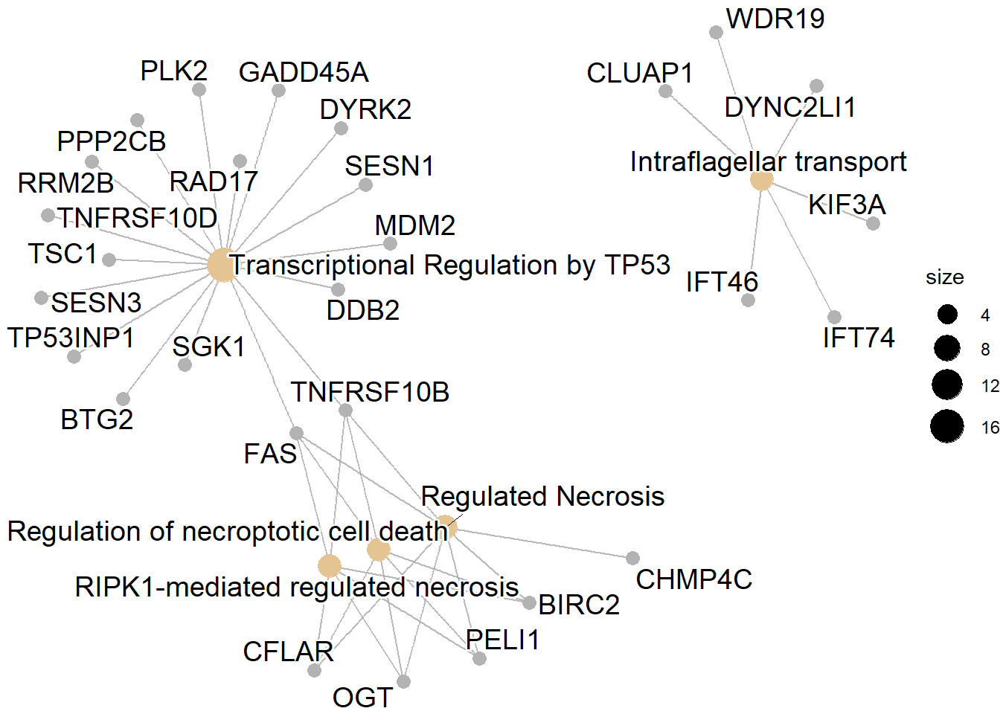
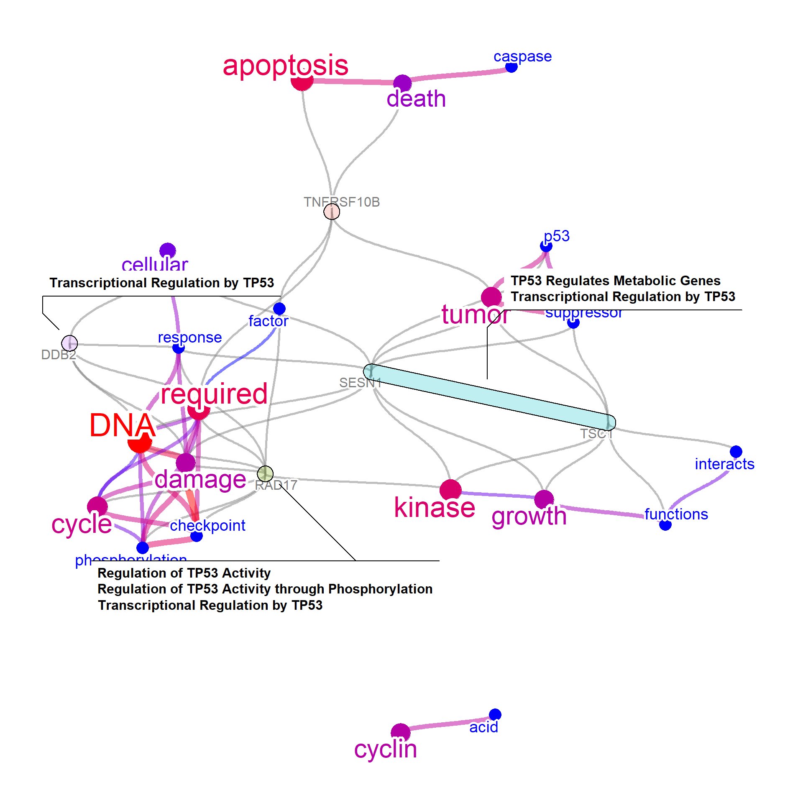
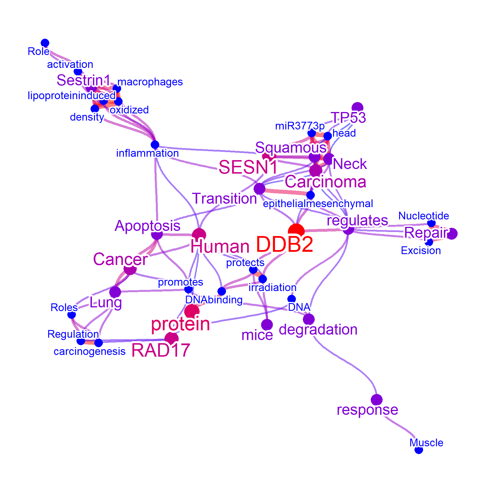
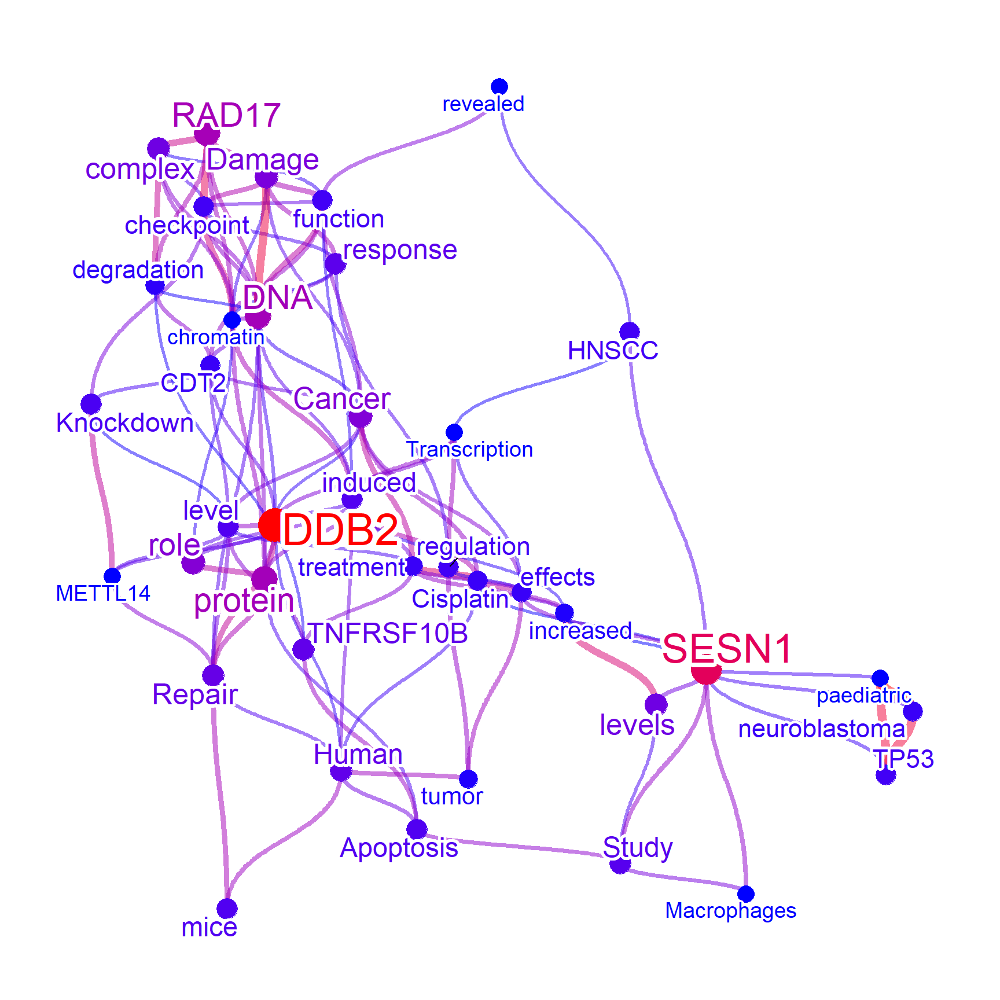
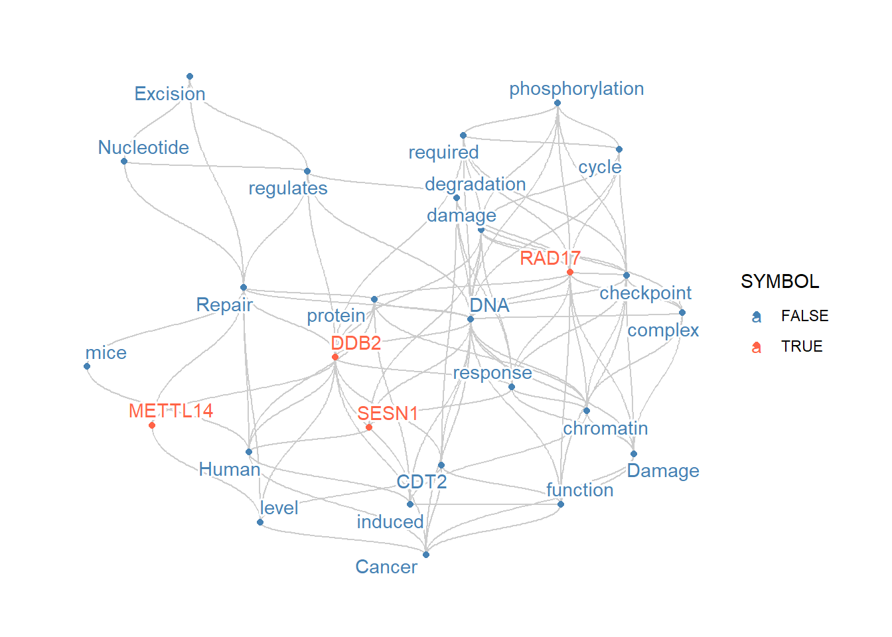
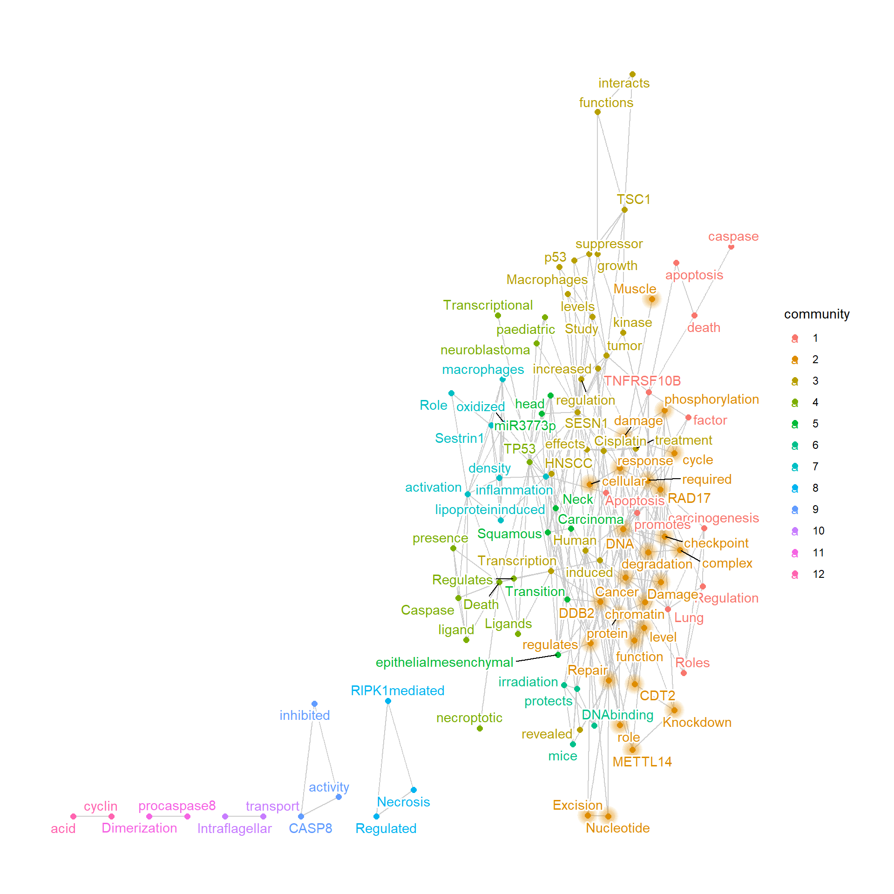
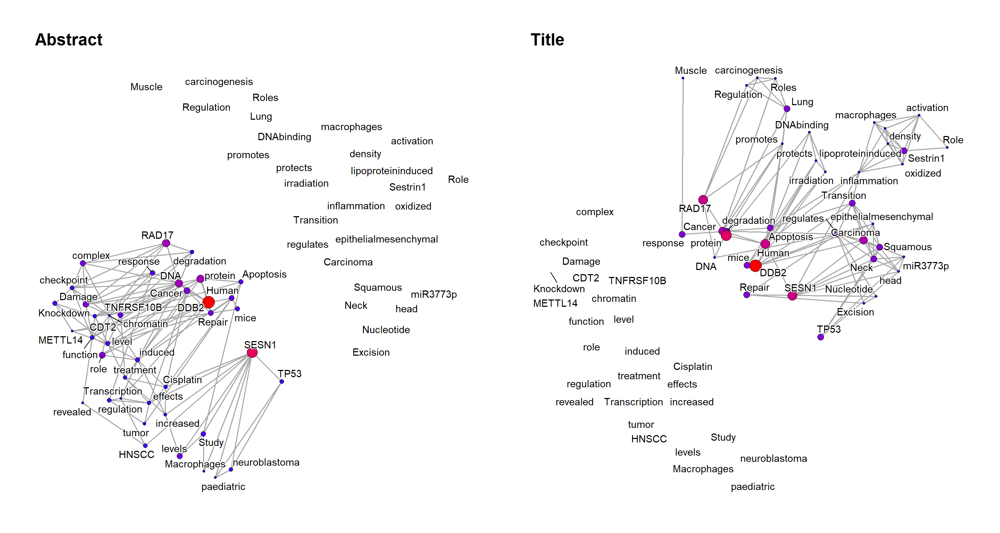

# Application examples

We demonstrate an use case of the package, which investigates transcriptomic changes induced by BK polyomavirus (BKPyV) infection in renal proximal tubular epithelial cells ([Assetta et al. 2016](https://pubmed.ncbi.nlm.nih.gov/27381292/)). Differentially expressed mRNAs in 3 days post-infection were obtained, and down-regulated mRNAs in BKPyV infected cells were examined.

## Load the necessary packages and genes


```r
library(wcGeneSummary)
library(org.Hs.eg.db)
library(ggplot2)
library(ReactomePA);library(clusterProfiler)
library(ggraph);library(igraph)
library(ggforce) ## For genePathPlot
degs <- wcGeneSummary:::d3degDownAssetta2016
length(degs)
#> [1] 191
degs
#>   [1] "ABCB4"           "ABCB7"           "AKTIP"          
#>   [4] "ALS2"            "ANKRA2"          "ANTXR1"         
#>   [7] "APH1B"           "ARHGEF28"        "ARNTL"          
#>  [10] "ATMIN"           "BDH2"            "BIRC2"          
#>  [13] "BTG1"            "BTG2"            "C4A"            
#>  [16] "C7orf60"         "C8orf4"          "CALCOCO1"       
#>  [19] "CAPRIN2"         "CARS"            "CBLB"           
#>  [22] "CCNDBP1"         "CCNG2"           "CCZ1B"          
#>  [25] "CDC42EP3"        "CDH6"            "CFLAR"          
#>  [28] "CHMP1B"          "CHMP4C"          "CLUAP1"         
#>  [31] "COG2"            "COG3"            "CPQ"            
#>  [34] "CROT"            "CTTNBP2NL"       "CYP4V2"         
#>  [37] "DAB2"            "DDB2"            "DDX17"          
#>  [40] "DDX5"            "DGKA"            "DHX32"          
#>  [43] "DLG1"            "DYNC2LI1"        "DYRK2"          
#>  [46] "EFHC1"           "EIF4A2"          "ERMAP"          
#>  [49] "ERMARD"          "EXOC1"           "FAM134B"        
#>  [52] "FAM160B1"        "FAM21C"          "FAM84B"         
#>  [55] "FANK1"           "FAS"             "FBXO38"         
#>  [58] "FCHO2"           "FGD6"            "FLJ22447"       
#>  [61] "FMNL2"           "GADD45A"         "GJA1"           
#>  [64] "GLIDR"           "GLT8D1"          "GOPC"           
#>  [67] "GPBP1L1"         "GPR155"          "GPR75-ASB3"     
#>  [70] "GRAMD3"          "HADHB"           "HCG11"          
#>  [73] "HDAC9"           "HDHD2"           "HERPUD1"        
#>  [76] "HSDL2"           "ICA1"            "ICK"            
#>  [79] "IFNGR1"          "IFT46"           "IFT74"          
#>  [82] "IRF6"            "ITGA2"           "ITGA6"          
#>  [85] "ITGAV"           "ITGB6"           "KDM5B"          
#>  [88] "KIF3A"           "KIF5B"           "KLHL20"         
#>  [91] "KLHL24"          "KLHL9"           "KPNA5"          
#>  [94] "KRCC1"           "L3MBTL3"         "LINC00657"      
#>  [97] "LOC100131564"    "LZTFL1"          "MAMDC2"         
#> [100] "MAP4K5"          "MAT2B"           "MBNL2"          
#> [103] "MDM2"            "MECOM"           "MFSD1"          
#> [106] "MGEA5"           "MICU3"           "MSANTD4"        
#> [109] "NBPF11"          "NCBP2"           "NEAT1"          
#> [112] "NTM"             "OGT"             "PAFAH1B2"       
#> [115] "PAFAH2"          "PCMTD2"          "PDE4D"          
#> [118] "PDP1"            "PELI1"           "PEX1"           
#> [121] "PHF14"           "PHOSPHO2-KLHL23" "PIK3IP1"        
#> [124] "PLA2R1"          "PLCB4"           "PLK2"           
#> [127] "POLI"            "POSTN"           "PPAN-P2RY11"    
#> [130] "PPFIBP1"         "PPP2CB"          "PRICKLE1"       
#> [133] "PROS1"           "PSMD5-AS1"       "RAD17"          
#> [136] "RHOQ"            "RIMKLB"          "RNA18S5"        
#> [139] "RNF170"          "RNF20"           "RNU1-28P"       
#> [142] "RPL23AP53"       "RRM2B"           "RRN3"           
#> [145] "RRN3P1"          "SEMA3C"          "SERINC1"        
#> [148] "SESN1"           "SESN3"           "SGK1"           
#> [151] "SLC22A5"         "SLC37A3"         "SVIL"           
#> [154] "SYT11"           "TARSL2"          "TBC1D19"        
#> [157] "TBCK"            "TBRG1"           "TGFA"           
#> [160] "TGFB2"           "TIPARP"          "TMEM136"        
#> [163] "TNFRSF10B"       "TNFRSF10D"       "TOM1L1"         
#> [166] "TP53INP1"        "TRIM13"          "TRIM32"         
#> [169] "TRIM4"           "TSC1"            "TSPYL5"         
#> [172] "UGT2B7"          "UNC13B"          "UPRT"           
#> [175] "VPS41"           "VPS8"            "WDR11"          
#> [178] "WDR19"           "XPC"             "YPEL2"          
#> [181] "ZC2HC1A"         "ZFAND5"          "ZFP90"          
#> [184] "ZFR"             "ZMAT3"           "ZNF12"          
#> [187] "ZNF248"          "ZNF322"          "ZNF561"         
#> [190] "ZNF626"          "ZSCAN30"
```

## Enrichment analysis

First, we perform enrichment analysis using ReactomePA.
From the enrichment analysis results, the cluster is related to transcriptional regulation by TP53.


```r
## Convert to ENTREZID
entre <- AnnotationDbi::select(org.Hs.eg.db, keytype="SYMBOL",
                               keys = degs, columns = "ENTREZID")$ENTREZID
pway <- setReadable(enrichPathway(entre), org.Hs.eg.db)
sigpway <- subset(pway@result, p.adjust<0.05)
sigpway$Description
#>  [1] "Transcriptional Regulation by TP53"                              
#>  [2] "RIPK1-mediated regulated necrosis"                               
#>  [3] "Regulation of necroptotic cell death"                            
#>  [4] "Regulated Necrosis"                                              
#>  [5] "Intraflagellar transport"                                        
#>  [6] "Regulation by c-FLIP"                                            
#>  [7] "CASP8 activity is inhibited"                                     
#>  [8] "Dimerization of procaspase-8"                                    
#>  [9] "TP53 Regulates Transcription of Death Receptors and Ligands"     
#> [10] "Caspase activation via Death Receptors in the presence of ligand"
#> [11] "FOXO-mediated transcription of cell cycle genes"                 
#> [12] "TP53 Regulates Transcription of Cell Death Genes"                
#> [13] "Cilium Assembly"
cnetplot(pway)
```



```r

## Genes involved in significant pathways
excheck <- unlist(unique(sapply(sigpway$geneID,
                                function (x) strsplit(x,"/"))))
excheck
#>  [1] "BTG2"      "DDB2"      "DYRK2"     "FAS"      
#>  [5] "GADD45A"   "MDM2"      "PLK2"      "PPP2CB"   
#>  [9] "RAD17"     "RRM2B"     "SESN1"     "SESN3"    
#> [13] "SGK1"      "TNFRSF10B" "TNFRSF10D" "TP53INP1" 
#> [17] "TSC1"      "BIRC2"     "CFLAR"     "FAS"      
#> [21] "OGT"       "PELI1"     "TNFRSF10B" "BIRC2"    
#> [25] "CFLAR"     "CHMP4C"    "FAS"       "OGT"      
#> [29] "PELI1"     "TNFRSF10B" "CLUAP1"    "DYNC2LI1" 
#> [33] "IFT46"     "IFT74"     "KIF3A"     "WDR19"    
#> [37] "CFLAR"     "FAS"       "TNFRSF10B" "FAS"      
#> [41] "TNFRSF10B" "TNFRSF10D" "BTG1"      "CCNG2"    
#> [45] "GADD45A"   "FAS"       "TNFRSF10B" "TNFRSF10D"
#> [49] "TP53INP1"  "CLUAP1"    "DYNC2LI1"  "EXOC1"    
#> [53] "IFT46"     "IFT74"     "KIF3A"     "LZTFL1"   
#> [57] "WDR19"
```

We store the name of enriched pathways in the network for the downstream analysis.


```r
netreac <- wcGeneSummary(degs,
                         enrich="reactome",
                         plotType="network",
                         numWords=50,
                         colorText=TRUE)
#> Input genes: 191
#> 'select()' returned 1:1 mapping between keys and
#> columns
#>   Converted input genes: 175
#> Filter based on GeneSummary
#> Filtered 65 words (frequency and/or tfidf)
#> Performing enrichment analysis
```

## Text mining the gene summaries
Next we perform the plain function producing a correlation network, with showing the top-genes related to high-frequency words in the text in RefSeq summary. We obtained the list of these genes from geneCount slot.


```r
net1 <- wcGeneSummary(excheck,
                      plotType="network",
                      colorText=TRUE,
                      numWords=30,
                      corThresh=0.5,
                      genePlot=TRUE,
                      genePlotNum=5,
                      edgeLink=FALSE,
                      genePathPlot="reactome")
#> Input genes: 57
#>   Converted input genes: 57
#> Filter based on GeneSummary
#> Filtered 65 words (frequency and/or tfidf)
#> Found 27 enriched term
net1@net
```



```r
net1@geneCount
#> 
#>     RAD17     SESN1      TSC1      DDB2 TNFRSF10B      BTG1 
#>         9         9         6         5         5         4 
#>     DYRK2     BIRC2     CCNG2       FAS   GADD45A    LZTFL1 
#>         4         3         3         3         3         3 
#>      MDM2     SESN3      SGK1     CFLAR    CHMP4C       OGT 
#>         3         3         3         2         2         2 
#> TNFRSF10D     WDR19      BTG2  DYNC2LI1     EXOC1     IFT74 
#>         2         2         1         1         1         1 
#>    PPP2CB     RRM2B 
#>         1         1
top <- names(net1@geneCount[net1@geneCount>=5])
top
#> [1] "RAD17"     "SESN1"     "TSC1"      "DDB2"     
#> [5] "TNFRSF10B"
```

## Text mining the available literature

These genes are further queried for PubMed information.
First, show the network for the article titles.


```r
titlenet <- wcAbst(top,
                   sortOrder="relevance",
                   target="title",
                   plotType="network",
                   colorText=TRUE,
                   madeUpperGenes=FALSE,
                   corThresh=0.2,
                   preset=TRUE,
                   retMax=40,
                   numWords=40,
                   edgeLink=FALSE)
#> Proceeding without API key
titlenet@net
```



Obtain and show the network for the article abstract.


```r
abstnet <- wcAbst(top,
                   target="abstract",
                   plotType="network",
                   colorText=TRUE,
                   madeUpperGenes=FALSE,
                   corThresh=0.2,
                   preset=TRUE,
                   retMax=40,
                   numWords=40,
                   edgeLink=FALSE)
#> Proceeding without API key
abstnet@net
```



## Combine and compare networks

From the RefSeq summary and articles related to important genes, the cluster could have functionality of DNA damage response, which is also upregulated by BKPyV infection. These networks can be combined to find intersections and differences. We can see that in addition to Reactome pathway names, plenty of information could be obtained and summarized by querying other databases, which could aid in interpreting clusters of genes and hypothesis generation.


```r
compareWordNet(list(abstnet, titlenet, netreac, net1),
               titles=c("Abstract","Title","Reactome","RefSeq"))
#> Warning in RColorBrewer::brewer.pal(catNum, colPal): n too large, allowed maximum for palette Pastel1 is 9
#> Returning the palette you asked for with that many colors
#> Scale for colour is already present.
#> Adding another scale for colour, which will replace the
#> existing scale.
#> Warning in grid.Call(C_stringMetric,
#> as.graphicsAnnot(x$label)): font family not found in Windows
#> font database
#> Warning in grid.Call(C_stringMetric,
#> as.graphicsAnnot(x$label)): font family not found in Windows
#> font database
#> Warning in grid.Call(C_textBounds,
#> as.graphicsAnnot(x$label), x$x, x$y, : font family not found
#> in Windows font database

#> Warning in grid.Call(C_textBounds,
#> as.graphicsAnnot(x$label), x$x, x$y, : font family not found
#> in Windows font database

#> Warning in grid.Call(C_textBounds,
#> as.graphicsAnnot(x$label), x$x, x$y, : font family not found
#> in Windows font database

#> Warning in grid.Call(C_textBounds,
#> as.graphicsAnnot(x$label), x$x, x$y, : font family not found
#> in Windows font database

#> Warning in grid.Call(C_textBounds,
#> as.graphicsAnnot(x$label), x$x, x$y, : font family not found
#> in Windows font database

#> Warning in grid.Call(C_textBounds,
#> as.graphicsAnnot(x$label), x$x, x$y, : font family not found
#> in Windows font database
```


From the network, DNA damage repair pathway, especially nucleotide excision repair related to DDB2, METTL14,and RAD17 might be related to BKPyV infection, which cannot be prioritize based on log2FoldChange or enrichment analysis.


```r
conet <- compareWordNet(list(netreac,
                    net1,
                    titlenet,
                    abstnet),
               returnNet = TRUE)

ddrNms <- NULL
for (nm in names(V(conet))) {
    if (tolower(nm) %in% c("dna","damage","repair")) {
        ddrNms <- c(ddrNms, names(neighbors(conet, nm)))
    }
}
ddrNms
#>  [1] "checkpoint"      "cycle"           "DNA"            
#>  [4] "phosphorylation" "required"        "response"       
#>  [7] "SESN1"           "DDB2"            "RAD17"          
#> [10] "promotes"        "cellular"        "checkpoint"     
#> [13] "cycle"           "damage"          "phosphorylation"
#> [16] "required"        "response"        "SESN1"          
#> [19] "DDB2"            "RAD17"           "Cancer"         
#> [22] "degradation"     "promotes"        "protein"        
#> [25] "regulates"       "Repair"          "CDT2"           
#> [28] "chromatin"       "complex"         "Damage"         
#> [31] "function"        "induced"         "NER"            
#> [34] "DNA"             "DDB2"            "Excision"       
#> [37] "Global"          "mice"            "Nucleotide"     
#> [40] "protein"         "Proteins"        "level"          
#> [43] "METTL14"         "NER"             "cellular"       
#> [46] "DNA"             "response"        "RAD17"          
#> [49] "Cancer"          "chromatin"       "function"       
#> [52] "NER"

ddrRelated <- induced.subgraph(conet,
                 names(V(conet)) %in% unique(ddrNms))
V(ddrRelated)$SYMBOL <- names(V(ddrRelated)) %in% keys(org.Hs.eg.db,"SYMBOL")
ggraph(ddrRelated)+
    geom_edge_diagonal2(color="grey80")+
    geom_node_point(aes(color=SYMBOL))+
    geom_node_text(aes(label=name, color=SYMBOL),check_overlap=TRUE, repel=TRUE,
                   bg.color = "white", segment.color="black",
                   bg.r = .15)+
    scale_color_manual(values=c("steelblue","tomato"))+
    theme_graph()
#> Using `stress` as default layout
#> Warning: Using the `size` aesthetic in this geom was deprecated in
#> ggplot2 3.4.0.
#> ℹ Please use `linewidth` in the `default_aes` field and
#>   elsewhere instead.
#> Warning in grid.Call(C_textBounds,
#> as.graphicsAnnot(x$label), x$x, x$y, : font family not found
#> in Windows font database

#> Warning in grid.Call(C_textBounds,
#> as.graphicsAnnot(x$label), x$x, x$y, : font family not found
#> in Windows font database

#> Warning in grid.Call(C_textBounds,
#> as.graphicsAnnot(x$label), x$x, x$y, : font family not found
#> in Windows font database

#> Warning in grid.Call(C_textBounds,
#> as.graphicsAnnot(x$label), x$x, x$y, : font family not found
#> in Windows font database
```




The network can be obtained by `returnNet=TRUE`, which can be used for downstream analysis like assessment of degrees and community detection.


```r

conetDeg <- igraph::degree(conet)
conetDeg[order(conetDeg, decreasing=TRUE)] |> head(15)
#>       SESN1         DNA       RAD17        DDB2      Cancer 
#>          25          23          18          16          15 
#>       Human     protein        TP53 degradation  activation 
#>          13          13          12          12          11 
#>    response      Repair    cellular      damage   Carcinoma 
#>          11          11          10          10          10

conet <- induced_subgraph(conet, conetDeg>1)

wt <- igraph::walktrap.community(conet)
igraph::V(conet)$walktrap <- wt$membership
pal <- RColorBrewer::brewer.pal(length(unique(wt$membership)),
                                "Dark2") 
#> Warning in RColorBrewer::brewer.pal(length(unique(wt$membership)), "Dark2"): n too large, allowed maximum for palette Dark2 is 8
#> Returning the palette you asked for with that many colors
pal <- colorRampPalette(pal)(20)

ggraph(conet)+
    geom_edge_link(color="grey80")+
    geom_node_point(aes(color=factor(walktrap)), size=3)+
    geom_node_text(aes(label=name, color=factor(walktrap)),
                   check_overlap=TRUE, repel=TRUE,
                   bg.color = "white", segment.color="black",
                   bg.r = .15)+
    scale_color_manual(values=pal,
                         name="Walktrap")+
    theme_graph()
#> Using `stress` as default layout
#> Warning in grid.Call(C_textBounds,
#> as.graphicsAnnot(x$label), x$x, x$y, : font family not found
#> in Windows font database
#> Warning in grid.Call(C_textBounds,
#> as.graphicsAnnot(x$label), x$x, x$y, : font family not found
#> in Windows font database

#> Warning in grid.Call(C_textBounds,
#> as.graphicsAnnot(x$label), x$x, x$y, : font family not found
#> in Windows font database

#> Warning in grid.Call(C_textBounds,
#> as.graphicsAnnot(x$label), x$x, x$y, : font family not found
#> in Windows font database
```



Dynamic layout can be also used to compare the networks, by `graphlayouts`, for comparing the multiple graphs, especially useful for time-series analysis. See the documentation of [`layout_as_dynamic`](http://graphlayouts.schochastics.net/reference/layout_dynamic.html) for specifying the alpha, which is default to 0.5. 


```r
library(igraph)
dyn <- plotDynamic(list(abstnet, titlenet), concat="intersection",
                   titles=c("Abstract","Title"), alpha=0.8)
dyn
```




```r
sessionInfo()
#> R version 4.2.1 (2022-06-23 ucrt)
#> Platform: x86_64-w64-mingw32/x64 (64-bit)
#> Running under: Windows 10 x64 (build 22000)
#> 
#> Matrix products: default
#> 
#> locale:
#> [1] LC_COLLATE=Japanese_Japan.utf8 
#> [2] LC_CTYPE=Japanese_Japan.utf8   
#> [3] LC_MONETARY=Japanese_Japan.utf8
#> [4] LC_NUMERIC=C                   
#> [5] LC_TIME=Japanese_Japan.utf8    
#> 
#> attached base packages:
#> [1] stats4    stats     graphics  grDevices utils    
#> [6] datasets  methods   base     
#> 
#> other attached packages:
#>  [1] ggforce_0.3.3         igraph_1.3.4         
#>  [3] ggraph_2.0.6          clusterProfiler_4.4.4
#>  [5] ReactomePA_1.40.0     ggplot2_3.4.0        
#>  [7] org.Hs.eg.db_3.15.0   AnnotationDbi_1.58.0 
#>  [9] IRanges_2.30.0        S4Vectors_0.34.0     
#> [11] Biobase_2.56.0        BiocGenerics_0.42.0  
#> [13] wcGeneSummary_0.99.0 
#> 
#> loaded via a namespace (and not attached):
#>   [1] shadowtext_0.1.2       fastmatch_1.1-3       
#>   [3] plyr_1.8.7             lazyeval_0.2.2        
#>   [5] splines_4.2.1          BiocParallel_1.30.3   
#>   [7] GenomeInfoDb_1.32.2    digest_0.6.29         
#>   [9] yulab.utils_0.0.5      htmltools_0.5.3       
#>  [11] bugsigdbr_1.2.2        GOSemSim_2.22.0       
#>  [13] viridis_0.6.2          GO.db_3.15.0          
#>  [15] fansi_1.0.3            GeneSummary_0.99.3    
#>  [17] magrittr_2.0.3         memoise_2.0.1         
#>  [19] tm_0.7-8               Biostrings_2.64.0     
#>  [21] graphlayouts_0.8.0     pvclust_2.2-0         
#>  [23] wordcloud_2.6          enrichplot_1.16.1     
#>  [25] colorspace_2.0-3       rappdirs_0.3.3        
#>  [27] blob_1.2.3             ggrepel_0.9.1         
#>  [29] xfun_0.31              dplyr_1.0.9           
#>  [31] crayon_1.5.1           RCurl_1.98-1.7        
#>  [33] jsonlite_1.8.0         scatterpie_0.1.7      
#>  [35] graph_1.74.0           ape_5.6-2             
#>  [37] glue_1.6.2             polyclip_1.10-0       
#>  [39] stopwords_2.3          gtable_0.3.0          
#>  [41] zlibbioc_1.42.0        XVector_0.36.0        
#>  [43] GetoptLong_1.0.5       graphite_1.42.0       
#>  [45] rentrez_1.2.3          scales_1.2.0          
#>  [47] DOSE_3.22.0            DBI_1.1.3             
#>  [49] Rcpp_1.0.9             viridisLite_0.4.0     
#>  [51] xtable_1.8-4           tidytree_0.3.9        
#>  [53] gridGraphics_0.5-1     reactome.db_1.81.0    
#>  [55] bit_4.0.4              htmlwidgets_1.5.4     
#>  [57] httr_1.4.3             fgsea_1.22.0          
#>  [59] RColorBrewer_1.1-3     ellipsis_0.3.2        
#>  [61] pkgconfig_2.0.3        XML_3.99-0.10         
#>  [63] farver_2.1.1           sass_0.4.2            
#>  [65] utf8_1.2.2             labeling_0.4.2        
#>  [67] ggplotify_0.1.0        tidyselect_1.2.0      
#>  [69] rlang_1.0.6            reshape2_1.4.4        
#>  [71] later_1.3.0            munsell_0.5.0         
#>  [73] tools_4.2.1            cachem_1.0.6          
#>  [75] downloader_0.4         cli_3.5.0             
#>  [77] generics_0.1.3         RSQLite_2.2.15        
#>  [79] evaluate_0.15          stringr_1.4.0         
#>  [81] fastmap_1.1.0          ggdendro_0.1.23       
#>  [83] yaml_2.3.5             ggtree_3.7.1.002      
#>  [85] knitr_1.39             bit64_4.0.5           
#>  [87] fs_1.5.2               tidygraph_1.2.1       
#>  [89] purrr_0.3.4            KEGGREST_1.36.3       
#>  [91] dendextend_1.16.0      nlme_3.1-157          
#>  [93] mime_0.12              slam_0.1-50           
#>  [95] aplot_0.1.6            DO.db_2.9             
#>  [97] xml2_1.3.3             concaveman_1.1.0      
#>  [99] compiler_4.2.1         rstudioapi_0.13       
#> [101] curl_4.3.2             png_0.1-7             
#> [103] treeio_1.20.1          tibble_3.1.7          
#> [105] tweenr_1.0.2           bslib_0.4.0           
#> [107] stringi_1.7.8          cyjShiny_1.0.34       
#> [109] highr_0.9              lattice_0.20-45       
#> [111] Matrix_1.4-1           vctrs_0.5.1           
#> [113] pillar_1.8.0           lifecycle_1.0.3       
#> [115] jquerylib_0.1.4        GlobalOptions_0.1.2   
#> [117] data.table_1.14.2      cowplot_1.1.1         
#> [119] bitops_1.0-7           httpuv_1.6.5          
#> [121] patchwork_1.1.1        qvalue_2.28.0         
#> [123] R6_2.5.1               bookdown_0.29         
#> [125] promises_1.2.0.1       gridExtra_2.3         
#> [127] codetools_0.2-18       MASS_7.3-57           
#> [129] assertthat_0.2.1       rjson_0.2.21          
#> [131] withr_2.5.0            GenomeInfoDbData_1.2.8
#> [133] parallel_4.2.1         ISOcodes_2022.01.10   
#> [135] ggfun_0.0.9            grid_4.2.1            
#> [137] tidyr_1.2.0            rmarkdown_2.14        
#> [139] downlit_0.4.2          NLP_0.2-1             
#> [141] shiny_1.7.2            base64enc_0.1-3
```
