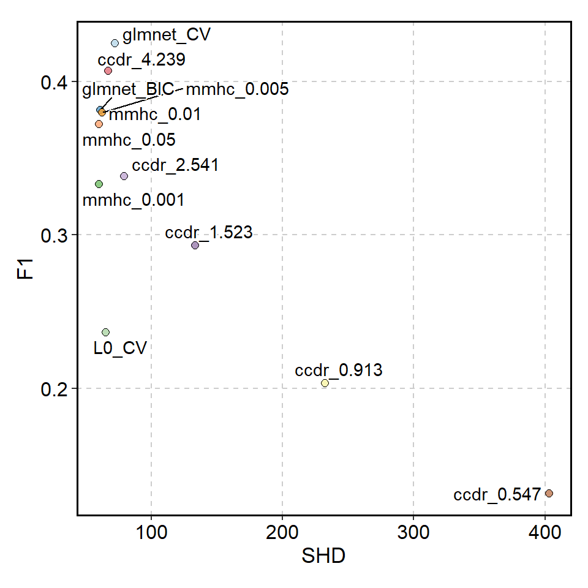
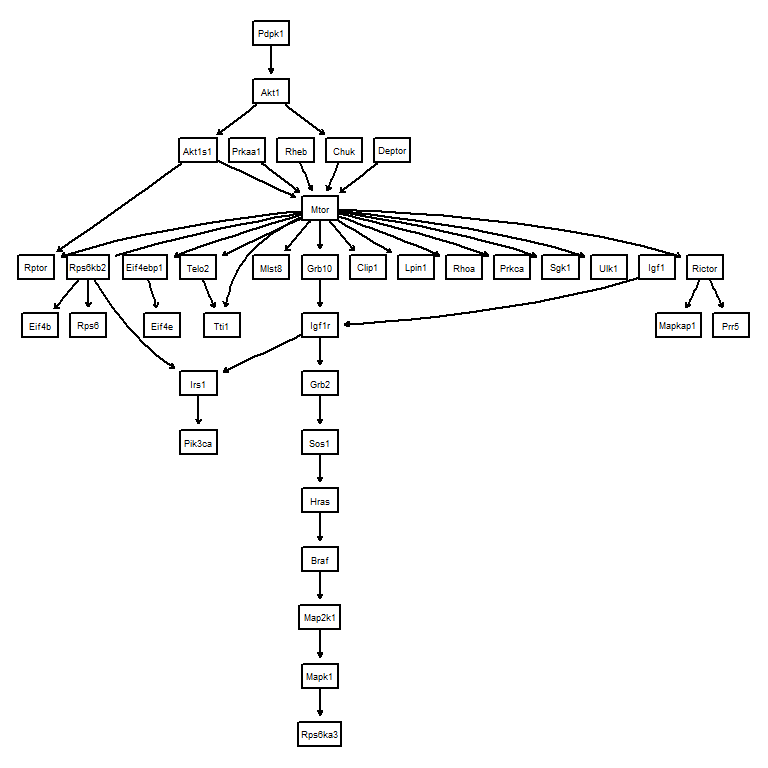

# Evaluating the inferred networks


For the interpretation of the results, the assessment of inferred networks is crucial. This is because it is necessary to determine which network should be used for downstream analysis, and to assess how closely the inferred causal relationships resemble those of biologically validated networks. One of the core features of the `scstruc` is evaluating and selecting optimal algorithms from the inferred networks. We describe how to evaluate the inferred networks using various metrics in this section. The implemented metrics include:

- True positive arcs
- False positive arcs
- False negative arcs
- Precision
- Recall
- F1-score
- Bayesian Information Criterion (if the data to be fitted is provided)
- Structural Hamming Distance
- Structural Intervention Distance (with or without symmetrization)
- Kullback–Leibler divergence
- AUPRC (for bootstrapped network only)

## Evaluation functions

### `metrics` function

This function accepts learned networks and the reference network (both should be `bn` object) and outputs `data.frame` consisting of various metrics.


``` r
library(scstruc)
net <- readRDS("ecoli70.rds")
data.inference <- rbn(net, 50)
infer <- hc(data.inference)
metrics(bn.net(net), list("inferred"=infer))
#>       algo referenceNode InferenceNode s0 edges SHD TP FP
#> 1 inferred            46            46 70    87  93 25 45
#>   FN       TPR Precision    Recall        F1  SID KL BIC
#> 1 62 0.3571429 0.3571429 0.2873563 0.3184713 1000 NA  NA
```

`sid_sym` argument can choose whether to symmetrze the SID, and `SID.cran` can choose whether to use SID implemented in CRAN package `SID`.

### `metricsFromFitted` function

This function accepts parameter-fitted network and sampling number, as well as the algorithms to be used in the inference. Using `rbn` function in `bnlearn`, logic sampling is performed from fitted network. Here, we use `ECOLI70` network from `GeneNet` R package, sampling 50 observations from the network. The testing algorithms can be specifed by argument `algos`. For the special algorithms, the arguments with the same name are provided. The function has `return_data` and `return_net` argument, which returns the data used in the inference and inferred networks. By default, only the `metrics` is returned.


``` r
mf <- metricsFromFitted(net, 50, algos=c("glmnet_CV", "glmnet_BIC", "L0_CV"))
#> glmnet_CV 15.5532598495483
#> glmnet_BIC 1.05871295928955
#> L0_CV
#> 13.4928689002991
#> MMHC 0.001 0.0840771198272705
#> MMHC 0.005 0.0871479511260986
#> MMHC 0.01 0.102375984191895
#> MMHC 0.05 0.107484102249146
#> Network computing finished
head(mf$metrics)
#>         algo s0 edges       KL       BIC SHD TP FP FN
#> 1  glmnet_CV 70    57 14.96705 -2373.800  72 27 43 30
#> 2 glmnet_BIC 70    40 12.07304 -2415.606  61 21 49 19
#> 3      L0_CV 70    23 74.56293 -2922.667  65 11 59 12
#> 4 mmhc_0.001 70    26 38.46923 -2692.738  60 16 54 10
#> 5 mmhc_0.005 70    30 34.40967 -2631.822  62 19 51 11
#> 6  mmhc_0.01 70    30 34.40967 -2631.822  62 19 51 11
#>         TPR Precision    Recall        F1 SID PPI
#> 1 0.3857143 0.3857143 0.4736842 0.4251969  NA  NA
#> 2 0.3000000 0.3000000 0.5250000 0.3818182  NA  NA
#> 3 0.1571429 0.1571429 0.4782609 0.2365591  NA  NA
#> 4 0.2285714 0.2285714 0.6153846 0.3333333  NA  NA
#> 5 0.2714286 0.2714286 0.6333333 0.3800000  NA  NA
#> 6 0.2714286 0.2714286 0.6333333 0.3800000  NA  NA
#>          time   BICnorm  N  p
#> 1 15.55325985 0.9443633 50 46
#> 2  1.05871296 0.9169719 50 46
#> 3 13.49286890 0.5847458 50 46
#> 4  0.08407712 0.7353955 50 46
#> 5  0.08714795 0.7753075 50 46
#> 6  0.10237598 0.7753075 50 46
```

The results can be visualized in the usual way by using the library like `ggplot2`. We use here `plotthis` library for visualizing.


``` r
library(plotthis)
library(ggplot2)
library(ggrepel)
ScatterPlot(mf$metrics, x="SHD", y="F1", color_by="algo", legend.position="none") +
    geom_text_repel(aes(label=algo), bg.colour="white")
```



## Evaluating the causal validity

The primary objective of the package is evaluating the causal validity of the inferred networks. Two approach can be used, in the situations that the reference directed network is available or not. In most of the cases, the reference networks is not readily available.

### Obtaining the directed acyclic graphs (DAGs) for the evaluation

For the interesting biological pathway, one can obtain DAG from the KEGG PATHWAY. The `getKEGGEdges` function accepts the pathway identifier and returns the DAG, though it will not always succeed. The function first parses the pathway information using `ggkegg`, and identify the largest components to be evaluated. If `removeCycle` is TRUE, the function identifies the minimum feedback using igraph function and remove these edges. This returns the `bn` object.

Suppose you are interested in inferring gene regulatory networks in mTOR signaling pathway from your dataset, you should first load DAG from the KEGG API.


``` r
library(scstruc)
dags <- getKEGGEdges("mmu04150", removeCycle=TRUE)
#> Removing Pik3ca|Mtor
graphviz.plot(dags)
```



Using the genes in this candidate pathway, inference is performed and performance metrics can be obtained based on the reference DAG.


``` r
mymet <- metrics(dags, list("Algo1"=net))
```


### Intersection-Validation approach

In case there are no reference networks, we can use Insersection-Validation approach, proposed by Viinikka et al. [@viinikka_intersection-validation_2018] to evaluate which algorithm is optimal in terms of SHD and SID. For this purpose, `interVal` function is prepared. The function accepts input data, multiple algorithms to be tested, and parameters related to Intersection-Validation. The implemented metrics are SHD and SID.

The user should provide `data` and algorithms to be tested, 


``` r
test.data <- head(gaussian.test, 50)
test <- interVal(test.data, algos=c("hc","mmhc","tabu"), ss=30)
test
#> $A0
#> 
#>   Random/Generated Bayesian network
#> 
#>   model:
#>    [A][B][C][D][E][G][F|E:G] 
#>   nodes:                                 7 
#>   arcs:                                  2 
#>     undirected arcs:                     0 
#>     directed arcs:                       2 
#>   average markov blanket size:           0.86 
#>   average neighbourhood size:            0.57 
#>   average branching factor:              0.29 
#> 
#>   generation algorithm:                  Empty 
#> 
#> 
#> $stat
#> # A tibble: 3 × 4
#>   AlgoNum SHD.stat SID.stat    en
#>     <dbl>    <dbl>    <dbl> <dbl>
#> 1       1      5.2      0     7.2
#> 2       2      2.7      1.5   2.3
#> 3       3      5.4      0     7.4
#> 
#> $raw.stat
#>     R AlgoNum SHD SID EdgeNumber
#> 1   1       1   6   0          8
#> 2   1       2   1   0          3
#> 3   1       3   6   0          8
#> 4   2       1   6   0          8
#> 5   2       2   3   3          2
#> 6   2       3   6   0          8
#> 7   3       1   4   0          6
#> 8   3       2   3   1          2
#> 9   3       3   5   0          7
#> 10  4       1   7   0          9
#> 11  4       2   3   1          2
#> 12  4       3   7   0          9
#> 13  5       1   5   0          7
#> 14  5       2   3   1          2
#> 15  5       3   5   0          7
#> 16  6       1   6   0          8
#> 17  6       2   3   3          2
#> 18  6       3   6   0          8
#> 19  7       1   4   0          6
#> 20  7       2   3   1          3
#> 21  7       3   5   0          7
#> 22  8       1   4   0          6
#> 23  8       2   3   3          2
#> 24  8       3   4   0          6
#> 25  9       1   5   0          7
#> 26  9       2   1   0          3
#> 27  9       3   5   0          7
#> 28 10       1   5   0          7
#> 29 10       2   4   2          2
#> 30 10       3   5   0          7
```

`r` argument is used to specify the iteration number, and `ss` argument is used to specify sub-sampling number. It leaves a message if connected node pairs, defined as the number of edges in the agreement graph, is below 15. `returnA0` option can be used to return only the intersection of inferred networks at the first stage. `output` option can be specified to output the relevant data (data used for the inference, `A0`, and all the `bn` object).


## AUPRC

Although the package focuses on Bayesian network evaluation, the commonly used metrics of area under precision-recall curve (AUPRC) can be calculated. `calc.auprc` accepts reference `bn` object and `bn.strength` object obtained by bootstrapping, and returns the AUPRC value. The function uses `yardstick` to calculate the value. The `target` argument specifies which column is to be used as weight, which is useful for the output from the software like `GENIE3`. The below example uses bootstrapped GES network for inference and calculates the AUPRC. 


``` r
net <- readRDS("ecoli70.rds")
data.inference <- rbn(net, 50)
infer <- pcalg.boot(data.inference, R=30)
calc.auprc(bn.net(net), infer)
#> # A tibble: 1 × 3
#>   .metric .estimator .estimate
#>   <chr>   <chr>          <dbl>
#> 1 pr_auc  binary         0.407
```

By combining these methods, it is possible to determine which network is most suitable for assessment.

